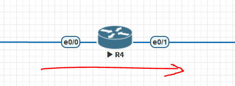

## ACL 访问控制列表

### 技术信息

　　访问控制列表(ACL)是一种基于包过滤的访问控制技术，它可以根据设定的条件对接口上的数据包进行过滤，允许其通过或丢弃。访问控制列表被广泛地应用于路由器和三层交换机，借助于访问控制列表，可以有效地控制用户对网络的访问，从而最大程度地保障网络安全。

#### 工作原理

* 当一个数据包进入一个端口，路由器检查这个数据包是否可路由。
* 如果是可以路由的，路由器检查这个端口是否有 ACL 控制进入数据包。
* 如果有，根据 ACL 中的条件指令，检查这个数据包。
* 如果数据包是被允许的，就查询路由表，决定数据包的目标端口。
* 路由器检查目标端口是否存在 ACL 控制流出的数据包。
* 若不存在，这个数据包就直接发送到目标端口
* 若存在，就再根据 ACL 进行取舍。然后在转发到目的端口。

#### 标准 ACL

* 标准的 ACL 号：

  * 华为：2000-2999
  * 锐捷: 1-99，1300-1999
* ACL 默认最后有一条 deny any，故允许（permit）的 ACL 应该写在上面。若是禁止某网段访问，其他网段均放通，则应该在最后加一条 permit any。
* 标准的 ACL 只匹配源 IP 地址（不写掩码只是匹配单个 ip，可以写掩码）
* 如果是单个 IP 地址，可写为 `access-list 5 permit host 192.168.1.1`​​

#### 扩展 ACL

　　扩展 ACL 号：

　　    华为：3000-3999

　　    锐捷: 100-199，2000-2699

　　扩展 ACL 可匹配源地址、目的地址、IP 协议，tcp、udp、icmp、igmp 待协议； 如要允许所有目的端口是 tcp80 端口的流量：`access-list 100 per tcp any any eq 80`​

#### 配置方向

　　首先要明确 IN 和 OUT 方向是相对的，要根据数流的方向判断，以路由器为中心，数据流进入的方向是 IN 方向，数据流经过路由器转发出去的方向是 OUT 方向。以下图为例子，当数据经过 e0/0 到达 R4，再经过 e0/1 转发，则对于该路由器而已，该数据的 e0/0 口是 IN 方向，e0/1 口是 OUT 方向，若对该数据进行做 ACL，可以选择在 IN 方向或者 OUT 方向上做都可以，后面有例子解析。

​​

### 配置实现

#### 基本 ACL

　　在 ACL 2001 中配置规则，允许源 IP 地址是 192.168.1.3 主机地址的报文通过。

```vim
[HUAWEI] acl 2001
[HUAWEI-acl-basic-2001] rule permit source 192.168.1.3 0
```

　　在 ACL 2001 中配置规则，仅允许源 IP 地址是 192.168.1.3 主机地址的报文通过，拒绝源 IP 地址是 192.168.1.0/24 网段其他地址的报文通过，并配置 ACL 描述信息为 Permit only 192.168.1.3 through。

```vim
[HUAWEI] acl 2001
[HUAWEI-acl-basic-2001] rule permit source 192.168.1.3 0
[HUAWEI-acl-basic-2001] rule deny source 192.168.1.0 0.0.0.255
[HUAWEI-acl-basic-2001] description permit only 192.168.1.3 through
```

　　在 ACL 2001 中配置规则，拒绝源 IP 地址是 192.168.1.0/24 网段地址的非首片分片报文通过。

```vim
[HUAWEI] acl 2001
[HUAWEI-acl-basic-2001] rule deny source 192.168.1.0 0.0.0.255 fragment
```

#### 高级 ACL

　　在 ACL 3001 中配置规则，允许源 IP 地址是 192.168.1.3 主机地址且目的 IP 地址是 192.168.2.0/24 网段地址的 ICMP 报文通过。

```vim
[HUAWEI] acl 3001
[HUAWEI-acl-adv-3001] rule permit icmp source 192.168.1.3 0 destination 192.168.2.0 0.0.0.255
```

　　在名称为 deny-telnet 的高级 ACL 中配置规则，拒绝 IP 地址是 192.168.1.3 的主机与 192.168.2.0/24 网段的主机建立 Telnet 连接。

```vim
[HUAWEI] acl name deny-telnet
[HUAWEI-acl-adv-deny-telnet] rule deny tcp destination-port eq telnet source 192.168.1.3 0 destination 192.168.2.0 0.0.0.255 
```

　　在名称为 no-web 的高级 ACL 中配置规则，禁止 192.168.1.3 和 192.168.1.4 两台主机访问 Web 网页（HTTP 协议用于网页浏览，对应 TCP 端口号是 80），并配置 ACL 描述信息为 Web access restrictions。

```vim
[HUAWEI] acl name no-web
[HUAWEI-acl-adv-no-web] description Web access restrictions
[HUAWEI-acl-adv-no-web] rule deny tcp destination-port eq 80 source 192.168.1.3 0
[HUAWEI-acl-adv-no-web] rule deny tcp destination-port eq 80 source 192.168.1.4 0
```

　　在 ACL 3002 中配置规则，拒绝 192.168.2.0/24 网段的主机主动发起的 TCP 握手报文通过，允许该网段主机被动响应 TCP 握手的报文通过，实现 192.168.2.0/24 网段地址的单向访问控制。同时，配置 ACL 规则描述信息分别为 Allow the ACK TCP packets through、Allow the RST TCP packets through 和 Do not Allow the other TCP packet through。

　　完成以上配置，必须先配置两条 permit 规则，允许 192.168.2.0/24 网段的 ACK=1 或 RST=1 的报文通过，再配置一条 deny 规则，拒绝该网段的其他 TCP 报文通过。

```vim
[HUAWEI] acl 3002
[HUAWEI-acl-adv-3002] rule permit tcp source 192.168.2.0 0.0.0.255 tcp-flag ack
[HUAWEI-acl-adv-3002] display this   //如果配置规则时未指定规则编号，则可以通过此步骤查看到系统为该规则分配的编号，然后根据该编号，为该规则配置描述信息。
#                                                                             
acl number 3002                                                               
 rule 5 permit tcp source 192.168.2.0 0.0.0.255 tcp-flag ack           //系统分配的规则编号是5    
#                                                                             
return 
[HUAWEI-acl-adv-3002] rule 5 description Allow the ACK TCP packets through
[HUAWEI-acl-adv-3002] rule permit tcp source 192.168.2.0 0.0.0.255 tcp-flag rst
[HUAWEI-acl-adv-3002] display this
#                                                                             
acl number 3002                                                               
 rule 5 permit tcp source 192.168.2.0 0.0.0.255 tcp-flag ack               
 rule 5 description Allow the ACK TCP packets through               
 rule 10 permit tcp source 192.168.2.0 0.0.0.255 tcp-flag rst       //系统分配的规则编号是10        
#                                                                             
return   
[HUAWEI-acl-adv-3002] rule 10 description Allow the RST TCP packets through
[HUAWEI-acl-adv-3002] rule deny tcp source 192.168.2.0 0.0.0.255
[HUAWEI-acl-adv-3002] display this
#                                                                             
acl number 3002                                                               
 rule 5 permit tcp source 192.168.2.0 0.0.0.255 tcp-flag ack               
 rule 5 description Allow the ACK TCP packets through               
 rule 10 permit tcp source 192.168.2.0 0.0.0.255 tcp-flag rst              
 rule 10 description Allow the RST TCP packets through              
 rule 15 deny tcp source 192.168.2.0 0.0.0.255       //系统分配的规则编号是15   
#                                                                             
return   
[HUAWEI-acl-adv-3002] rule 15 description Do not Allow the other TCP packet through
```

　　也可以通过配置 established 参数，允许 192.168.2.0/24 网段的 ACK=1 或 RST=1 的报文通过，再配置一条 deny 规则，拒绝该网段的其他 TCP 报文通过。

```vim
[HUAWEI] acl 3002
[HUAWEI-acl-adv-3002] rule permit tcp source 192.168.2.0 0.0.0.255 tcp-flag established
[HUAWEI-acl-adv-3002] rule 5 description Allow the Established TCP packets through
[HUAWEI-acl-adv-3002] rule deny tcp source 192.168.2.0 0.0.0.255
[HUAWEI-acl-adv-3002] rule 10 description Do not Allow the other TCP packet through
[HUAWEI-acl-adv-3002] display this
#                                                                                                                                 
acl number 3002                                                                                                                   
 rule 5 permit tcp source 192.168.2.0 0.0.0.255 tcp-flag established                                                              
 rule 5 description Allow the Established TCP packets through                                                                     
 rule 10 deny tcp source 192.168.2.0 0.0.0.255                                                                                    
 rule 10 description Do not Allow the other TCP packet through                                                                    
#                                                                                                                                 
return
```

#### 配置二层 ACL

　　二层 ACL 根据以太网帧头信息来定义规则，如源 MAC（Media Access Control）地址、目的 MAC 地址、VLAN ID、二层协议类型等，对报文进行过滤。

　　在 ACL 4001 中配置规则，允许目的 MAC 地址是 0000-0000-0001、源 MAC 地址是 0000-0000-0002 的 ARP 报文（二层协议类型值为 0x0806）通过。

```vim
[HUAWEI] acl 4001
[HUAWEI-acl-L2-4001] rule permit destination-mac 0000-0000-0001 source-mac 0000-0000-0002 l2-protocol 0x0806
```

　　在 ACL 4001 中配置规则，拒绝 PPPoE 报文（二层协议类型值为 0x8863）通过。

```vim
[HUAWEI] acl 4001
[HUAWEI-acl-L2-4001] rule deny l2-protocol 0x8863
```

　　在名称为 deny-vlan10-mac 的二层 ACL 中配置规则，拒绝来自 VLAN10 且源 MAC 地址在 00e0-fc01-0000～00e0-fc01-ffff 范围内的报文通过。

```vim
[HUAWEI] acl name deny-vlan10-mac link
[HUAWEI-acl-L2-deny-vlan10-mac] rule deny vlan-id 10 source-mac 00e0-fc01-0000 ffff-ffff-0000
```

#### 配置方式

##### 华为

```vim
// 创建ACL
[Huawei]acl number 2001
// 进入ACL
[Huawei]acl 2001
// rule 规则序号 允许/拒绝 源IP 反掩码 
[Huawei-acl-basic-2001]rule 5 deny source 10.0.1.0 10.0.2.0 
// 扩展ACL rule 规则序号 允许/拒绝 协议 指定源/目的地址...
[Huawei-acl-adv-3001]rule 10 permit icmp source 10.0.1.0 0.0.0.255 destination 1
0.0.2.0 0.0.0.255 
// 应用在接口上
ip access-group <ACL编号> {in | out}
```

### MAC ACL

　　基于 MAC 地址的访问控制列表（MAC ACL）是一种网络安全机制，用于基于设备的物理地址（MAC 地址）对网络流量进行过滤和控制。它可以在二层以太网交换机上实现。

　　**工作原理：**

1. MAC 地址的识别：每个网络设备都有唯一的 MAC 地址，用于在局域网中唯一标识设备。MAC ACL 使用这些 MAC 地址来识别和匹配网络流量。
2. ACL 规则定义：管理员可以创建 MAC ACL 规则，其中每个规则由一个允许或拒绝的动作以及一个或多个源和目标 MAC 地址组成。规则可以基于单个 MAC 地址、MAC 地址范围或 MAC 地址的通配符匹配。
3. ACL 应用位置：MAC ACL 通常应用于交换机的接口或 VLAN 上。通过将 ACL 应用于接口或 VLAN，可以控制通过该接口或 VLAN 的流量。
4. 匹配和处理：当数据包通过交换机的接口或 VLAN 时，交换机会检查数据包的源和目标 MAC 地址，并与已配置的 MAC ACL 规则进行匹配。如果匹配成功，将根据规则中定义的动作（允许或拒绝）来处理数据包。如果没有匹配到任何规则，默认情况下通常会执行默认操作（允许或拒绝）。
5. 数据包处理：根据匹配结果，交换机可以采取以下操作：

   1. 允许数据包通过：如果数据包与允许规则匹配，交换机将允许数据包通过，继续转发到目标设备。
   2. 拒绝数据包：如果数据包与拒绝规则匹配，交换机将丢弃该数据包，不进行转发。
   3. 默认操作：如果数据包未匹配到任何规则，则执行预先配置的默认操作。默认操作可以是允许或拒绝。

　　**优点：**

1. 它提供了一种额外的安全层，可在二层网络中对特定 MAC 地址的流量进行细粒度控制。
2. 它可以用于限制特定设备之间的通信，增加网络的安全性。
3. 它对于防范 MAC 地址欺骗和 ARP 欺骗等攻击具有一定的防御作用。

　　**DCN 神州数码**

```shell
mac-access-list extended name #创建mac地址访问控制列表，表名为“name”
deny host-source-mac 00-ff-51-be-ad-32 host-destination-mac 00-ff-51-be-ad-32 #拒绝源mac地址为”00-ff-51-be-ad-32的主机访问目的地址为“00-ff-51-be-ad-32”的主机
permit any-source-mac any-destination-mac #允许所有源主机访问目的主机
#在接口上启用
Interface Ethernet1/0/10
mac access-group name in
```

### 时间 ACL

　　基于时间的 ACL 功能类似于扩展 ACL，但它允许根据时间执行访问控制。要使用基于时间的 ACL，您需要创建一个时间范围，指定一周和一天内的时段。您可以为时间范围命名，然后对相应功能应用此范围。时间限制会应用到该功能本身。基于时间的 ACL 具有许多优点，例如：

　　允许网络管理员控制日志消息。ACL 条目可在每天定时记录流量，而不是一直记录流量。因此，管理员无需分析高峰时段产生的大量日志就可轻松地拒绝访问。

　　​**华为**

　　创建时间段 working-time（周一到周五每天 8:00 到 18:00），并在名称为 work-acl 的 ACL 中配置规则，在 working-time 限定的时间范围内，拒绝源 IP 地址是 192.168.1.0/24 网段地址的报文通过。

```vim
[HUAWEI] time-range working-time 8:00 to 18:00 working-day
[HUAWEI] acl name work-acl basic
[HUAWEI-acl-basic-work-acl] rule deny source 192.168.1.0 0.0.0.255 time-range working-time
```

　　**DCN 神州数码**

```shell
time-range week // 创建时间acl
 periodic weekdays 09:00 to 17:00
ip access-list extended aclt
 permit ip 20.1.41.0 0.0.0.255 20.1.0.0 0.0.255.255 // 放行内网业务
 deny ip 20.1.41.0 0.0.0.255 any time-range week // 根据时间acl进行匹配
int vlan 41
vacl ip access-group aclt in vlan 50 // 入方向调用策略
```

### Vlan ACL

　　VLAN ACL 基于 VLAN 的 ACL

　　使用 VLAN 与 VLAN 之间的 ACL，相同的 VLAN 也是可以过滤，只要流量进入或离开指定的 VLAN 都会被过滤，可以同时控制二层与三层流量。

　　VLAN ACL 只是 VLAN 调用了 ACL 规则，in 或 out 的 VLAN 流量都会被检测，无论是通过二层转发还是三层转发。VLAN ACL 是不能定义方向的，

　　虽然 VLNA 调用 ACL 规则会有 in 或 out 选项，但只针对 VLAN 源地址和目标地址而言。VLAN 调用 ACL 是不能实现 vlan 10 ping 不通 vlan 20，

　　但 vlan 20 ping 通 vlan10 类似的功能，除非交换机支持自反 ACL 规则。

　　**DCN 神州数码**

```shell
ip access-list extended aclt
 permit ip 20.1.41.0 0.0.0.255 20.1.0.0 0.0.255.255 // 放行内网业务
 deny ip 20.1.41.0 0.0.0.255 any time-range week // 根据时间acl进行匹配
int vlan 41
vacl ip access-group aclt in vlan 50 // vlan入方向调用策略
```
