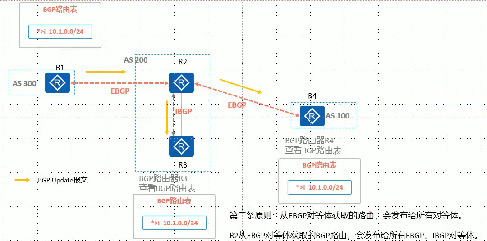

## BGP

　　为方便管理规模不断扩大的网络，网络被分成了不同的 AS (Autonomous System，自治系统)。早期，EGP (Exterior Gateway Protocol，外部网关协议)被用于实现在 AS 之间动态交换路由信息。但是 EGP 设计得比较简单，只发布网络可达的路由信息，而不对路由信息进行优选，同时也没有考虑环路避免等问题，很快就无法满足网络管理的要求。

　　BGP 是为取代最初的 EGP 而设计的另一种外部网关协议。不同于最初的 EGP，BGP 能够进行路由优选、避免路由环路、更高效率的传递路由和维护大量的路由信息。

​​

　　AS 指的是在同一个组织管理下，使用统一选路策略的设备集合

　　不同 AS 使用 AS 号区分，AS 号存在 16bit、32bit 两种表达方式。

　　在不同 AS 之间传递路由时，使用 BGP 协议

　　65412-65534 为私有 AS 号

　　在一台路由器中，只能开启一个 BGP 进程（AS 号）。

　　**BGP 的特点**

* BGP 使用 TCP 作为其传输层协议 (端口号为 179)，使用触发式路由更新，而不是周期性路由更新。
* BGP 能够承载大批量的路由信息，能够支撑大规模网络。
* BGP 提供了丰富的路由策略，能够灵活的进行路由选路，并能指导对等体按策略发布路由
* BGP 能够支撑 MPLS/VPN 的应用，传递客户 VPN 路由。
* BGP 提供了路由聚合和路由衰减功能用于防止路由振荡，通过这两项功能有效地提高了网络稳定性

　　**BGP 的特征**

* 运行 BGP 的路由器被称为 BGP 发言者 (BGP Speaker)或 BGP 路由器
* 两个建立 BGP 会话的路由器互为对等体(Peer)，BGP 对等体之间交换 BGP 路由表
* BGP 路由器只发送增量的 BGP 路由更新，或进行触发式更新(不会周期性更新)
* BGP 路由器之间的会话基于 TCP（179）连接而建立
* BGP 通常被称为路径矢量路由协议
* 每条 BGP 路由都携带多种路径属性 Path attribute)，BGP 可以通过这些路径属性控制路径选择，而不像 IS-SOSPF 只能通过 Cost 控制路径洗择，因此在路径洗择上，BGP 具有丰富的可操作性，可以在不同场景下选择最合适的路径控制方式。

### 对等体

　　IGP 可以通过组播报文发现直连链路上的邻居，而 BGP 是通过 TCP：179 来实现的。BGP 需要手工的方式去配置邻居。不需要直连，只要路由能通就可以建立邻居

#### IBGP 与 EBGP

　　**IBGP :(Internal BGP)**  :位于相同自治系统的 BGP 路由器之间的 BGP 邻接关系

　　**EBGP:(ExternalBGP)** :位于不同自治系统的 BGP 路由器之间的 BGP 对等体关系。两台路由器之间要建立 EBGP 对等体关系必须满足两个条件

* 两个路由器所属 AS 不同(即 AS 号不同)
* 在配置 EBGP 时，Peer 命令所指定的对等体 IP 地址要求路由可达并且 TCP 连接能够正确建立。

#### 邻居建立

​​

　　先启动 BGP 的一端先发起 TCP 连接，如左图所示，R1 先启动 BGP，R1 使用随机端口号向 R2 的 179 端口发起 TCP 连接，完成 TCP 连接的建立

　　三次握手建立完成之后，R1、R2 之间相互发送 open 报文携带参数用于对等体建立，参数协商正常之后双方相互发送 Keepalive 报文，收到对端发送的 Keepalive 报文之后对等体建立成功，同时双方定期发送 Keepalive 报文用于保持连接。

　　其中 open 报文中携带

* My Autonomous System: 自身 AS 号
* Hold Time:用于协商后续 Keepalive 报文发送时间
* RGP Identifier·自身 RouterID

​​

　　BGP 对等体关系建立之后，BGP 路由器发送 BGP Update(更新)报文通告路由到对等体

　　KEEPLIVE 间隔时间 60 秒，超时时间为 Keeplive 的三倍时间

```vim
创建邻居，ip 30.0.0.1 as 64512
[R3-bgp-default]peer 30.0.0.1 as-number 64512

[Huawei]dis bgp peer // 查看路由
```

#### 邻居状态机制

|Peer 状态名称|用途|
| -------------| --------------------------------------------------------------------------------------------------------------------|
|Idle|开始准备 TCP 的连接并监视远程对等体，启用 BGP 时，要准备足够的资源|
|Connect|正在进行 TCP 连接，等待完成中，认证都是在 TCP 建立期间完成的。如果 TCP 连接建立失败则进入 Active 状态，反复尝试连接:|
|Active|TCP 连接没建立成功，反复尝试 TCP 连接|
|OpenSent|TCP 连接已经建立成功，开始发送 open 包，open 包携带参数协商对等体的建立|
|OpenConfirm|参数、能力特性协商成功，自己发送 Keepalive 包，等待对方的 Keepalive 包|
|Established|已经收到对方的 Keepalive 包，双方能力特性经协商发现一致，开始使用 update 通告路由信息|

​​

​​

​​

​​

#### TCP 更新源地址

​​

　　一般而言在 AS 内部，网络具备一定的冗余性。在 R1 与 R3 之间，如果采用直连接口建 IBGP 邻居关系，那么一旦接口或者直连链路发生故障，BGP 会话也就断了”但是事实上，由于冗余链路的存在，R1 与 R3 之间的 IP 连通性其实并没有 DOWN (仍然可以通过 R4 到达彼此)

　　为了解决这个问题

* 缺省情况下，BGP 使用报文出接口作为 TCP 连接的本地接口在部署 IBGP 对等体关系时，建议使用 Loopback 地址作为更新源地址。Loopback 接口非常稳定，而且可以借助 AS 内的 IGP 和元余拓扑来保证可靠性。
* 在部署 EBGP 对等体关系时，通常使用直连接口的 IP 地址作为源地址，如若使用 Loopback 接口建立 EBGP 对等体关系则应注意 EBGP 多跳问题

　　对于 IBGP 来说，如果使用环回口建立邻居，一定要配置连接源，否则邻居关系无法正常建立。

　　在 IBGP 建立邻居时，两台设备之间不要使用默认路由，尽量使用明细路由（防止环路）

```vim
[Huawei-bgp]peer 3.3.3.3 connect-interface lo0  // 配置连接源为lo0接口
```

#### EBGP 多跳

　　在建立 IBGP 邻居时，建议使用环回口

　　但在建立 EBGP 邻居时，则建议使用直连接口。

　　EBGP 建立邻居时数据包的 ttl 默认为 1，仅限直连。跨设备会建立失败

　　可以设置 EBGP 连接邻居的最多跳数

#### 综合配置

```vim
[Huawei-bgp]peer 12.1.1.2 as-number 65413  // 设置邻居
[Huawei-bgp]peer 12.1.1.2 connect-interface lo0  // 使用lo0口与该邻居建立关系
[Huawei-bgp]peer 12.1.1.2 ebgp-max-hop 3  // 设置EBGP的最多条数，不写数值则默认为255
[Huawei-bgp]peer 12.1.1.2 next-hop-local  // 向该邻居更新报文时，修改下一跳为本设备
```

### 路由通告/传递

#### BGP 的路由宣告

　　BGP 自身并不会发现并计算产生路由，只会将 IGP 路由表中的路由引入到 BGP 路由表中，并通过 Update 报文传递给 BGP 对等体（邻居）

　　​`Network`​ 宣告，前提是路由表中存在该条路由

　　​`import-route`​ 引入其他协议的路由

　　​`aggregate`​ 汇总路由

　　BGP 支持根据已有的路由条目进行聚合，生成聚合路由

#### 路由的下一跳

　　BGP 传递路由时，在 AS 边界路由器从 EBGP 邻居学来的路由，再向 IBGP 邻居时，并不会修改下一跳。这就导致了 IBGP 邻居无法到达该条路由的下一跳，从而使传递的该条路由失效。通常情况下需要修改下一跳为本设备建立 IBGP 邻居的源地址（下一跳本地）

　　在 AS 边界设备执行

```vim
[Huawei]peer 12.1.1.2 next-hop-local  // 向该IBGP邻居传递路由时，将路由的下一跳改为本设备
```

#### 路由汇总

​​

　　BGP 支持自动汇总和手工汇总，一般情况下不会使用自动汇总，因为自动汇总不够灵活，只能汇总成主类/8 /16 /24 的路由。

　　而手工汇总就要灵活的多。

```vim
[Huawei-bgp]summary automatically // 开启自动汇总
// 导入的路由不能进行自动汇总

[Huawei-bgp]aggregate 192.168.0.0 255.255.255.0 
// 手工汇总一条192.168.0.0/16的路由，默认情况下，产生汇总路由后并不会删除明细路由，需要手工配置
[Huawei-bgp]aggregate 192.168.0.0 255.255.255.0 detail-suppressed
// 手工汇总路由，并抑制（删除）明细路由
```

　　抑制明细路由由于丢失了部分 BGP 属性（AS_Path 路径属性）因此可能会有环路风险。

　　当然，BGP 也有相应的解决方案

##### 加快收敛，手动刷新某个邻居的路由

```vim
[Huawei-bgp]refresh bgp 4.4.4.4 import // 让对方将最新的路由发过来
[Huawei-bgp]refresh bgp 4.4.4.4 export // 将最新的路由发送给对方
```

##### Null 0 防止环路

　　所有数据包的出接口时 Null 0 的话，会被路由器直接丢弃

　　不管任何路由协议，只要进行了 路由汇总，本地就会产生一条汇总的 Null0 的路由，防止环路产生

#### BGP 通告原则

　　BGP 通过 networkimport-route、aggregate 聚合方式生成 BGP 路由后，通过 Update 报文将 BGP 路由传递给对等体。

　　**BGP 通告遵循以下原则:**

* 只发布最优路由。
* 从 EBGP 对等体获取的路由，会发布给所有对等体
* IBGP 水平分割:从 IBGP 对等体获取的路由，不会发送给 IBGP 对等体。
* BGP 同步规则指的是:当一台路由器从自己的 IBGP 对等体学习到一条 BGP 路由时(这类路由被称为 IBGP 路由)，它将不能使用该条路由或把这条路由通告给自己的 EBGP 对等体，除非它又从 IGP 协议例如 OSPF 等此处也包含静态路由)学习到这条路由，也就是要求 IBGP 路由与 IGP 路由同步。同步规则主要用于规避 BGP 路由黑洞问题

##### BGP 只发布最优路由

​​

　　只发布最优且有效(即下一跳地址可达路由

　　通过 `displaybgprouting-table` ​命令可以查看 BGP 路由表

​​

　　在 BGP 路由表中同时存在以下两个标志的路由为最优、有效

* *：代表有效
* > ：代表最优
  >

##### 从 EBGP 对等体学到的路由，会发给所有 BGP 对等体

​​

##### IBGP 水平分割：从 IBGP 对等体获取的 BGP 路由，不会再发送给其他 IBGP 对等体

　　该条原则也被称为“IBGP 水平分割”

　　​如图所示，如果 IBGP 对等体学习到的路由会继续传递给其他的 IBGP 对等体

* R2 将一条路由传递给了 IBGP 对等体 R3
* R3 收到路由之后传递给 IBGP 对等体 R1
* R1 继续传递给 IBGP 对等体 R2

　　路由环路形成。

##### 路由黑洞

　　由于 IBGP 可以跨设备建立邻居，那么中间的转发设备由于没有运行 BGP 协议，那么会导致没有相应的 BGP 路由从而在转发层面丢弃数据包，这就叫路由黑洞

##### BGP 同步规则

　　为了防止路由黑洞，从 IBGP 学到的路由，不能直接更新给 EBGP 邻居（除非从 IGP 又学到了这条路由）

　　只有 IBGP 和 IGP 同时学到该条路由，才能更新给 EBGP 邻居

　　默认关闭该条规则

​​

　　**R5 访问 10.0.4.4**

1. R5 查找路由表，将报文发送给 R3。
2. R3 收到报文后查找路由表，匹配到一条 BGP 路由其下一跳为 R2，但是 R2 为非直连下一跳，需要进行路由迭代，通过 IGP 学习到的路由迭代出下-跳为 R1。R3 将报文发送给 R1。
3. R1 收到报文后查找路由表，因为 R1 并非 BGP 路由器末与 R2 建立 IBGP 对等体关系，因此 R1 上并无 BGP 路由 10.0.4.0/24，路由查找失败，R1 将报文丢弃

​​

　　当一台路由器从自己的 IBGP 对等体学习到条 BGP 路由时(这类路由被称为 IBGP 路由)，它将不能使用该条路由或把这条路由通告给自己的 EBGP 对等体，除非它又从 IGP 协议(例如 OSPF 等，此处也包含静态路由)学习到这条路由，该条规则也被称为 BGP 同步原则。.

1. BGP 路由器 R4 上存在一条路由 100.40/24，R4 将其传递给了 R2。
2. R2 将路由传递给非直连 IBGP 对等体 R3。
3. R3 将路由传递给 R5
4. 之后 R5 向 10.044 发起访问

### BGP 报文

|报文名称|作用|发送时刻|
| -------------| -------------------------------------------------------------------------------------------------| -----------------------------------------------------------------------------------------------------------|
|Open|协商 BGP 对等体参数，建立对等体关系|BGPTP 连接建立成功之后|
|Update|发送 BGP 路由更新|BGP 对等体关系建立之后有路由需要发送或路由变化时向对等体发送 Update 报文|
|Notification|报告错误信息，中止对等体关系|当 BGP 在运行中发现错误时，发送 Notification 报文将错误通告给 BGP 对等体|
|Keepalive|标志对等体建立，维持 BGP 对等体关系|BGP 路由器收到对端发送的 Keepalive 报文 e 对等体状态置为已建立，同时后续定期发送 keepalive 报文用于保持连接|
|Route-refresh|用于在改变路由策略后请求对等体重新发送路由信息。只有支持路由刷新能力的 BGP 设备会发送和响应此报文|当路由策略发牛变化时，触发请求对等体重新通告路由|

​​

　　BGP 拥有 5 种报文，不同报文拥有相同的头部

#### 公共头部

```vim
0                   1                   2                   3
0 1 2 3 4 5 6 7 8 9 0 1 2 3 4 5 6 7 8 9 0 1 2 3 4 5 6 7 8 9 0 1
+-+-+-+-+-+-+-+-+-+-+-+-+-+-+-+-+-+-+-+-+-+-+-+-+-+-+-+-+-+-+-+-+
|                           Marker                              |
+-+-+-+-+-+-+-+-+-+-+-+-+-+-+-+-+-+-+-+-+-+-+-+-+-+-+-+-+-+-+-+-+
|          Length               |      Type     |
+-+-+-+-+-+-+-+-+-+-+-+-+-+-+-+-+-+-+-+-+-+-+-+-+
```

* Marker

  * 16 字节
  * 用于检查 BGP 对等体的同步信息是否完整，以及用于 BGP 验证的计算。不使用验证时所有比特均为 1（十六进制则全“FF”）。
* Length

  * 2 个字节（无符号位）
  * BGP 消息总长度（包括报文头在内），以字节为单位。长度范围是 19～4096。
* Type

  * 1 个字节（无符号位）
  * BGP 消息的类型。Type 有 5 个可选值，表示 BGP 报文头后面所接的 5 类报文（其中，前四种消息是在 RFC4271 中定义的，而 Type5 的消息则是在 RFC2918 中定义的）。
  * 类型

    * 1 --- OPEN - 用于建立 BGP 连接
    * 2 --- UPDATE - 用于通告路由。
    * 3 --- NOTIFICATION - 用于处理 BGP 进程中的各种错误。
    * 4 --- KEEPALIVE - 用于保持 BGP 连接
    * 5 --- REFRESH（RFC2918） - 用于动态的请求 BGP 路由发布者重新发布 UPDATE 报文，进行路由更新。

#### OPEN 报文

　　如果 BGP 报文头中的 TYPE 为 1，则该报文为 OPEN 报文。报文头后面所接的报文内容如下，OPEN 报文用于建立 BGP 连接。

​​

* Version

  * 1 个字节（无符号位）
  * 表示协议的版本号，现在 BGP 的版本号为 4
* My Autonomous System

  * 2 个字节（无符号位）
  * 发送者自己的 AS 域号
* Hold Time

  * 2 个字节（无符号位）
  * 发送者自己设定的 hold time 值（单位：秒），用于协商 BGP 对等体间保持建立连接关系，发送 KEEPALIVE 或 UPDATE 等报文的时间间隔。BGP 的状态机必须在收到对等体的 OPEN 报文后，对发出的 OPEN 报文和收到的 OPEN 报文两者的 hold time 时间作比较，选择较小的时间作为协商结果。Hold Time 的值可为零（不发 KEEPALIVE 报文）或大于等于 3，我们系统的默认为 180。
* BGP Identifier

  * 4 个字节（无符号位）
  * 发送者的 router id。
* Opt Parm Len

  * 1 个字节（无符号位）
  * 表示 Optional Parameters（可选参数）的长度。如果此值为 0，表示没有可选参数。
* Optional Parameters

  * 可变
  * 此值为 BGP 可选参数列表，每一个可选参数是一个 TLV 格式的单元(RFC3392)。

    ```vim
    0                   1
    0 1 2 3 4 5 6 7 8 9 0 1 2 3 4 5
    +-+-+-+-+-+-+-+-+-+-+-+-+-+-+-+-+-+-+-+-...
    |  Parm.Type   | Parm.Length  |  Parameter Value (variable)
    +-+-+-+-+-+-+-+-+-+-+-+-+-+-+-+-+-+-+-+-...
    ```

    * **Parm.Type**

      * 占 1 个字节（无符号位），为可选参数类型。我们现在的实现中，只在 type 值为 2 时有意义，表示携带的参数为协商能力。
    * **Parm.Length**

      * 占 1 个字节（无符号位），为 Parameter Value 的长度。
    * **Parameter.Value**

      * 根据 Parm.Type 的不同值填写不同的参数内容，在 Parm.Type 为 2 表示协商能力时，Parameter.Value 是表示所支持的各种协商能力的列表，列表中的每一个单元是如下的一个 TLV 三元组：
      * ```vim
        +------------------------------+
        | Capability Code (1 octet)    |
        +------------------------------+
        | Capability Length (1 octet)  |
        +------------------------------+
        | Capability Value (variable)  |
        +------------------------------+
        ```
      * Capability Code

        * 所支持的能力编号，占 1 个字节。Code 为 1 时，表示支持的地址族能力；Code 为 2 时，表示支持 REFRESH 能力。
      * Capability Length

        * 表示 Capability Value 的长度，占 1 个字节。
      * Capability Value

        * 根据 Code 值的不同其内容与长度也不同。
        * Capability Code 为 1：

          * Capability Value 值是一个 TLV 三元组，共占 4 个字节
          * ```vim
            0       7      15      23      31
            +-------+-------+-------+-------+
            |      AFI      | Res.  | SAFI  |
            +-------+-------+-------+-------+
            ```
    * **AFI**

      * 地址族标识(Address Family Identifier)，占 2 个字节，能力所支持地址族标识信息，用以和 SAFI 一同确定网络层协议和 IP 地址间的关系，编码方式与多协议扩展中的规定相同。其值按照 RFC1700 中 ADDRESS FAMILY NUMBERS 的定义；
    * **Res**

      * 保留位，占 1 个字节，发送者应将其设置为零，在接受的时候忽略；
    * **SAFI**

      * 子地址族标识(Address Family Identifier)，占 1 个字节，能力所支持的子地址族标识信息，用以和 AFI 一同确定网络层协议和 IP 地址间的关系，编码方式与多协议扩展中的规定相同。其值按照 RFC1700 中 ADDRESS FAMILY NUMBERS 的定义。

        Capability Code 为 2 表示支持路由刷新能力，即 Route Refresh Capability。此能力的 code 为 2，length 为零，无 value 部分。

        需要说明的是，只有在能力协商中使能了支持 Route Refresh Capability，设备才能处理 REFRESH 报文。默认情况下，支持 IPv4 单播能力与路由刷新能力。

##### OPEN 扩展报文

* Version

  * 1 个字节（无符号位）
  * 表示协议的版本号，现在 BGP 的版本号为 4。
* My Autonomous System

  * 2 个字节（无符号位）
  * 发送者自己的 AS 域号
* Hold Time

  * 2 个字节（无符号位）
  * 发送者自己设定的 hold time 值（单位：秒），用于协商 BGP 对等体间保持建立连接关系，发送 KEEPALIVE 或 UPDATE 等报文的时间间隔。BGP 的状态机必须在收到对等体的 OPEN 报文后，对发出的 OPEN 报文和收到的 OPEN 报文两者的 hold time 时间作比较，选择较小的时间作为协商结果。Hold Time 的值可为 0（不发 KEEPALIVE 报文）或大于等于 3，系统的默认为 180。
* BGP Identifier

  * 4 个字节（无符号位）
  * 发送者的 router id
* Non-Ext OP Len.

  * 1 个字节（无符号位）
  * 固定值为 255
* Non-Ext OP Type

  * 1 个字节（无符号位）
  * IANA 已经注册了可选参数扩展长度类型码 255 作为 BGP OPEN 报文扩展可选参数类型。
* Extended Opt.Parm.Length

  * 2 个字节（无符号位）
  * 扩展可选参数长度，表示 Optional Parameters（可选参数）的长度。
* Optional Parameters

  * 可变
  * 此值为 BGP 可选参数列表，每一个可选参数是一个 TLV 格式的单元。
  * ```vim
    0               7               15              23
    +-+-+-+-+-+-+-+-+-+-+-+-+-+-+-+-+-+-+-+-+-+-+-+-+
    |  Parm.Type    |           Parm.Length         |
    +-+-+-+-+-+-+-+-+-+-+-+-+-+-+-+-+-+-+-+-+-+-+-+-+
    ~              Parm.Value (variable)            ~
    |                                               |
    ```

    * **Parm.Type**

      * 占 1 个字节（无符号位），为可选参数类型。我们现在的实现中，只在 type 值为 2 时有意义，表示携带的参数为协商能力。
    * **Parm.Length**

      * 占 2 个字节（无符号位），为 Parameter Value 的长度
    * **Parm.Value**

      * 根据 Parm.Type 的不同值填写不同的参数内容，在 Parm.Type 为 2 表示协商能力时，Parm.Value 是表示所支持的各种协商能力的列表，列表中的每一个单元是如下的一个 TLV 三元组：
      * ```vim
        +------------------------------+
        | Capability Code (1 octet)    |
        +------------------------------+
        | Capability Length (2 octet)  |
        +------------------------------+
        | Capability Value (variable)  |
        +------------------------------+
        ```
      * Capability Code

        * 所支持的能力编号，占 1 个字节。Code 为 1 时，表示支持的地址族能力；Code 为 2 时，表示支持 REFRESH 能力。
      * Capability Length

        * 表示 Capability Value 的长度，占 2 个字节。
      * Capability Value

        * 根据 Code 值的不同其内容与长度也不同。
        * Capability Code 为 1：

          * Capability Value 值是一个 TLV 三元组，共占 4 个字节：
          * ```vim
            0       7      15      23      31
            +-------+-------+-------+-------+
            |      AFI      | Res.  | SAFI  |
            +-------+-------+-------+-------+
            ```
    * **AFI**

      * 地址族标识(Address Family Identifier)，占 2 个字节，能力所支持地址族标识信息，用以和 SAFI 一同确定网络层协议和 IP 地址间的关系，编码方式与多协议扩展中的规定相同。其值按照相关 RFC 中 ADDRESS FAMILY NUMBERS 的定义；
    * **Res**

      * 保留位，占 1 个字节，发送者应将其设置为 0，在接受的时候忽略；
    * **SAFI**

      * 子地址族标识(Address Family Identifier)，占 1 个字节，能力所支持的子地址族标识信息，用以和 AFI 一同确定网络层协议和 IP 地址间的关系。

        Capability Code 为 2 表示支持路由刷新能力，即 Route Refresh Capability。此能力的 code 为 2，length 为 0，无 value 部分。

        需要说明的是，只有在能力协商中使能了支持 Route Refresh Capability，设备才能处理 REFRESH 报文。默认情况下，支持 IPv4 单播能力与路由刷新能力。

​​​​

#### UPDATE 路由更新报文

　　如果 BGP 报文头中的 TYPE 为 2，则该报文为 UPDATE 报文。报文头后面所接的报文内容如下（RFC 4271），UPDATE 报文用于通告路由。

　　UPDATE 报文格式

```vim
0                         7                           15
+-----------------------------------------------------+
|   Unfeasible routes length (2 octets)               |
+-----------------------------------------------------+
|   Withdrawn Routes (variable)                       |
+-----------------------------------------------------+
|   Total Path Attribute Length (2 octets)            |
+-----------------------------------------------------+
|   Path Attributes (variable)                        |
+-----------------------------------------------------+
|   Network Layer Reachability Information (variable) |
+-----------------------------------------------------+
```

##### 路由属性类型号

|属性类型|属性值|
| :-----------------------: | :------------------------------------------: |
|1：Origin|IGP|
||EGP|
||Incomplete|
|2：As_Path|AS_SET|
||AS_SEQUENCE|
||AS_CONFED_SET|
||AS_CONFED_SEQUENCE|
|3：Next_Hop|下一跳的 IP 地址|
|4：Multi_Exit_Disc|MED 用于判断流量进入 AS 时的最佳路由|
|5：Local_Pref|Local_Pref 用于判断流量离开 AS 时的最佳路由|
|6：Atomic_Aggregate|BGP Speaker 选择聚合后的路由，而非具体的路由|
|7：Aggregator|发起聚合的路由器 ID 和 AS 号|
|8：Community|团体属性|
|9：Originator_ID|反射路由发起者的 Router ID|
|10：Cluster_List|反射路由经过的反射器列表|
|14：MP_REACH_NLRI|多协议可达 NLRI|
|15：MP_UNREACH_NLRI|多协议不可达 NLRI|
|16：Extended Communtities|扩展团体属性|

#### NOTIFICATION 通知报文

　　如果 BGP 报文头中的 TYPE 为 3，则该报文为 NOTIFICATION 报文。报文头后面所接的报文内容如下（RFC 4271），NOTIFICATION 报文用于处理 BGP 进程中的各种错误。

```vim
0                   1                   2                   3
0 1 2 3 4 5 6 7 8 9 0 1 2 3 4 5 6 7 8 9 0 1 2 3 4 5 6 7 8 9 0 1
+-+-+-+-+-+-+-+-+-+-+-+-+-+-+-+-+-+-+-+-+-+-+-+-+-+-+-+-+-+-+-+-+
| Error code    | Error subcode |   Data (variable)             |
+-+-+-+-+-+-+-+-+-+-+-+-+-+-+-+-+-+-+-+-+-+-+-+-+-+-+-+-+-+-+-+-+
```

* Error code

  * 1 字节
  * 定义错误的类型，非特定的错误类型用零表示。
* Error subcode

  * 1 字节
  * 指定错误细节编号，非特定的错误细节编号用零表示。
* Data

  * 可变长
  * 指定错误数据内容。

##### 错误码表

|错误码|错误子码|
| ----------------------------------------------| --------------------------------------|
|1：消息头错误<br />|1：连接未同步|
||2：错误的消息长度|
||3：错误的消息类型|
|2：Open 消息错误<br />|1：不支持的版本号|
||2：错误的对等 AS|
||3：错误的 BGP 标识符|
||4：不支持的可选参数|
||5：认证失败|
||6：不可接受的保持时间|
||7：不支持的能力|
|3：Update 消息错误<br />|1：畸形属性列表|
||2：不可识别的公认属性|
||3：缺少公认属性|
||4：属性标志错误|
||5：属性长度错误|
||6：无效 Origin 属性|
||7：AS 路由环路|
||8：无效 Next_Hop 属性|
||9：可选属性错误|
||10：无效网络字段|
||11：畸形 AS_Path|
|4：Hold Timer 溢出|0：没有特别的错误子码定义。|
|5：有限状态机错误<br />|0：没有特别的错误子码定义<br />|
||1：在 OpenSent 状态下接收到意外消息|
||2：在 OpenConfirm 状态下接收到意外消息|
||3：在 Established 状态下接收到意外消息|
|6：终止<br />|1：前缀超过最大值。|
||2：管理关闭|
||3：删除邻居|
||4：管理重置|
||5：连接失败|
||6：其他配置改变|
||7：连接冲突|
||8：资源短缺|
||9：BFD 断开连接<br />|

#### KEEPALIVE 保活报文

　　如果 BGP 报文头中的 TYPE 为 4，则该报文为 KEEPALIVE 报文。KEEPALIVE 报文用于保持 BGP 连接。KEEPALIVE 报文只有 BGP 报文头，没有具体内容，故其报文长度应固定为 19 个字节。

　　KEEPALIVE 报文格式

```vim
      0                   1                   2                   3
      0 1 2 3 4 5 6 7 8 9 0 1 2 3 4 5 6 7 8 9 0 1 2 3 4 5 6 7 8 9 0 1
      +-+-+-+-+-+-+-+-+-+-+-+-+-+-+-+-+-+-+-+-+-+-+-+-+-+-+-+-+-+-+-+-+
      |                                                               |
      +                                                               +
      |                                                               |
      +                                                               +
      |                           Marker                              |
      +                                                               +
      |                                                               |
      +-+-+-+-+-+-+-+-+-+-+-+-+-+-+-+-+-+-+-+-+-+-+-+-+-+-+-+-+-+-+-+-+
      |          Length               |      Type     |
      +-+-+-+-+-+-+-+-+-+-+-+-+-+-+-+-+-+-+-+-+-+-+-+-+
```

* Marker

  * 16 字节
  * 用于检查 BGP 对等体的同步信息是否完整，以及用于 BGP 验证的计算。不使用验证时所有比特均为 1（十六进制则全“FF”）。
* Length

  * 2 字节
  * BGP 消息总长度（包括报文头在内），以字节为单位。长度范围是 19～4096。
* Type

  * 1 字节
  * BGP 消息的类型。Type 有 5 个可选值，表示 BGP 报文头后面所接的 5 类报文（其中，前四种消息是在 RFC4271 中定义的，而 Type5 的消息则是在 RFC2918 中定义的）。Keepalive 消息类型为 4。

#### REFRESH 路由刷新报文

　　如果 BGP 报文头中的 TYPE 为 5，则该报文为 REFRESH 报文。报文头后面所接的报文内容如下（RFC 2918），REFRESH 报文用于动态的请求 BGP 路由发布者重新发布 UPDATE 报文，进行路由更新。

　　REFRESH 报文格式

```vim
0       7      15      23      31
+-------+-------+-------+-------+
|      AFI      | Res.  | SAFI  |
+-------+-------+-------+-------+
```

* AFI

  * 2 字节（无符号位）
  * 表示地址族 id，与 UPDATE 报文中的定义相同。
* Res.

  * 1 字节（无符号位）
  * 所有位应全为零，在接收报文时，此位被忽略。
* SAFI

  * 1 字节（无符号位）
  * 与 OPEN 报文中的定义相同。

### 解决 IBGP 水平分割带来的问题

　　主要有以下 3 种方案：

* 全互联 ：配置量大、耗费资源
* 联邦： 配置量大、邻居会重建、中断时间较长
* RR 路由反射器：目前主流使用、简单、好用

#### 联邦

　　IBGP 水平分割问题用与防止 AS 内部产生环路，在很大程度上杜绝了 IBGP 路由环路的可能。但同时也带来了新的问题：BGP 路由在 AS 内部只能传递一跳，如果建立 IBGP 对等体全互联模型又会增加设备的负担

　　为了解决这各问题，提出了联邦的概念。

　　联邦为了解决这个问题提出了以下方案

　　    将 BGP 内部配置两个 AS 号，一个对外 AS 和一个联邦 AS。在联邦内部，看似是 IBGP 邻居，实际上是 EBGP 邻居。路由在联邦内部传递时，使用联邦 AS 号，往其他 AS 传递时，使用外部 AS 号。

​​

　　联邦将一个 AS 划分为若干个子 AS。每个子 AS 内部建立 IBGP 对等体。子 AS 之间建立 EBGP 对等体

　　配置联邦后，原 AS 号将作为每不路由器的联邦 ID。

　　联邦外部 AS 仍认为联邦是一个整体大 AS。并不需要了解联邦内部具体的细节

　　**相关术语**

* <span data-type="text" style="background-color: var(--b3-font-background2);" id="">联邦 AS</span>：在外部 AS 看来的一个整体的大 AS
* <span data-type="text" id="" style="background-color: var(--b3-font-background2);">成员 AS</span>：联邦内部划分的若干小 AS (使用私 AS 号)
* <span data-type="text" style="background-color: var(--b3-font-background2);" id="">联邦 IBGP 对等体</span>：成员 AS 号相同的 IBGP 对等体
* <span data-type="text" id="" style="background-color: var(--b3-font-background2);">联邦 EBGP 对等体</span>：成员 AS 号不同的 EBGP 对等体

　　注意联邦 EBGP 对等体与普通的 EBGP 对等体是有不同的体现在建立对等体 OPEN 报文携带的 AS 号不相同,因此联邦 EBGP 需要特别配置，联邦 IBGP 则不需要

```vim
联邦as（对外使用）
confederation id 200
联邦内建立EBGP邻居时，代表这个联邦内部as。使用自己的联邦as建立连接
confederation peer-as 64513
```

　　当配置联邦后，AS_Path 会携带联邦 AS

　　‍

　　但同时也产生的以下问题：

1. 配置量太大。
2. 配置联邦 BGP 会导致邻居关系断开重建，可能会导致较长时间的中断。

　　为此，又提出了一个新的概念：RR 路由反射器，这是目前主流的解决方案

#### RR 路由反射器

​​

　　引入路由反射器之后存在两种角色

* RR：路由反射器
* Client：RR 客户端

　　RR 会将学习的路由反射出去，从而使得 IBGP 路由在 AS 内传播无需建立 IBGP 全互联

　　将一台 BGP 路由器指定为 RR 的同时，还需要指定其 client。至于 client 本身，无需做任何配置，它并不知晓网络中存在 RR。

　　所有配置都在 RR 上做，客户端无需任何配置

```vim
[Huawei]peer 12.1.1.1 reflect-clict // 配置路由反射客户端
```

　　**RR 在接收 BGP 路由时**

* 如果路由反射器从自己的非客户对等体学习到一条 IBGP 路由，则它会将该路由<span data-type="text" id="" style="background-color: var(--b3-font-background2);">反射</span>给所有客户
* 如果路由反射器从自己的客户学习到一条 IBGP 路由，则它会将该路由<span data-type="text" id="" style="background-color: var(--b3-font-background2);">反射</span>给所有非客户，以及除了该客户之外的其他所有客户
* 如果路由学习自 EBGP 对等体，则<span data-type="text" id="" style="background-color: var(--b3-font-background3);">发送</span>给所有客户、非客户 IBGP 对等体。

　　注意此处“反射”和“发送”的区别。发送指的是传统情况下(相当于 RR 不存在的场景下)的 BGP 路由传递行为，而“反射”指的是遵循路由反射规则的情况下 RR 执行的路由传递动作，被反射出去的路由会被 RR 插入特殊的路径属性

##### **路由被反射之后，会增加两个属性防止环路**

　　RR 的设定使得 IBGP 水平分割原则失效，这就可能导致环路的产生，为此 RR 会为 BGP 路由添加两个特殊的路径属性来避免出现环路

　　​`orginator`​ 始发者的路由器 ID

　　​`Cluster list`​ 簇列表

　　OriginatorID、Cluster List 属性都属于可选过渡类型

​​

##### <span id="20240122145004-0sx8lmh" style="display: none;"></span>Originator_ID

​​

　　R3 收到来自 R2 的 BGP 路由 10.0.2.0/24，在反射给 R1 时会添加上 Originator_ID: 10.0.2.2，R1 收到之后再次反射给其客户端 R2 时携带 Originator_ID 属性，R2 收到之后查看 Originator_ID 属性值存在自身的 Router ID，忽略该路由更新。

　　RR 将一条 BGP 路由进行反射时会在反射出去的路由中增加 Originator_ID，其值为本地 AS 中通告该路由的 BGP 路由器 RouterID

　　若 AS 内存在多个 RR，则 Originator_ID 属性由第一个 RR 创建，并且不被后续的 RR (若有)所更改

　　当 BGP 路由器收到一条携带 Originator ID 属性的 IBGP 路由，并且 Originator_ID 属性值与自身的 Router ID 相同，则它会忽略关于该条路由的更新

##### <span id="20240122162422-dakudcj" style="display: none;"></span>CIuster 路由反射族

　　终由反射簇包括反射器 RR 及其 client 个 AS 内允许存在多个路由反射簇 (如下图)

　　每一个簇都有唯一的簇 ID (Cluster_ID，缺省时为 RR 的 BGP Router ID)

　　当一条路由被反射器反射后，该 RR (该族)的 cIuster_ID 就会被添加至路由的 cIuster_list 属性中。

　　当 RR 收到一条携带 cIuster list 属性的 BGP 路，且该属性值中包含该族的 cluster ID 时，RR 认为该条路由存在环路，因此将忽略关于该条路由的更新。

​​

​​

　　R2 发送给 R1 的路由，经过 R1 反射给 R3 时除了添加 Originator ID 之外还会添加 Custer List: 10.0.1.1。R3 再次反射给 R4 时，Cluster List 值为: 10.0.3.3 10.0.1.1，R4 再次反射给 R1 时 Cluster List 值为: 10.0.4.4 10.0.3.3 10.0.1.1.

　　当 R4 将路由反射给 R1 时，R1 发现 Cluster List 包含了自身 cluster ID，判断存在环路，从而忽略该路由更新

### 属性

​​

　　公认属性是所有 BGP 路由器都必须能够识别的属性

* 公认必遵 (Well-known Mandatory) : 必须包括在每个 Update 消息里
* 公认任意 (Well-known Discretionary) : 可能包括在某些 Update 消息里。

　　可选属性不需要都被 BGP 路由器所识别

* 可选过渡(OptionalTransitive) : BGP 设备不识别此类属性依然会接受该类属性并通告给其他对等体。
* 可选非过渡(OptionalNon-transitive) : BGP 设备不识别此类属性会忽略该属性，且不会通告给其他对等体。

​​

#### AS_Path

　　公认必遵属性

　　任何一条 BGP 路由都拥有多个路径属性当路由器将 BGP 路由通告给它的对等体时，一并被通告的还有路由所携带的各个路径属性。BGP 的路径属性将影响路由优选

​​

　　该属性为公认必遵属性，是前往目标网络的路由经过的 AS 号列表

　　作用:确保路由在 EBGP 对等体之间传递无环，另外也作为路由优选的衡量标准之一

　　路由在被通告给 EBGP 对等体时，路由器会在该路由的 AS Path 中追加上本地的 AS 号;路由被通告给 IBGP 对等体时，AS Path 不会发生改变

　　‍

​​

　　R1 从 R4 收到的 BGP 路由更新中 AS Path 属性数值为:400 300 200 100 存在自身 AS 号不接收该路由，从而防止了路由环路的产生。

　　‍

​​

　　AsPath 的重要作用之一便是**影响 BGP 路由的优选**，在上图中，R5 同时从 R2 及 R4 学习到去往 10.0.1.0/24 网段的 8GP 路由在其他条件相同的情况下，R5 会优选 R2 通告的路由，因为该条路由的 AS_Path 属性值较短，也即 AS 号的个数更少。

##### AS_Path 类型

​​

​​

　　有序：默认情况下，都是有序的

　　无序：在路由汇总手工配置，为了解决在路由汇总后明细路由丢失 AS_Path 属性的问题，用于防止环路产生。

```vim
[R5-bgp]aggregate 192.168.1.0 255.255.255.0 as-set detail-suppressed
// 在聚合路由的基础上，产生无序as_path
格式： 300 {200,100}
```

##### 修改 AS_Path 属性

　　在使用 Route-Policy 修改 BGP 路由的 AS_Path 属性时，可以使用以下 3 种方式

​​

```vim
[R5]route-policy aspath permit node 10
[R5-route-policy]apply as-path 300 additive // 在原有as号上追加300
[R5-route-policy]apply as-path 300 overwrite  // 将as号替换为300
[R5-route-policy]apply as-path none overwrite // 将as号清空
[R5-bgp]peer 22.0.0.1 route-policy aspath export // 将对该邻居发出的路由信息执行该策略
[R5-bgp]peer 22.0.0.1 route-policy aspath import  // 将该路由传来的路由信息执行该策略

```

#### Orgin 起源

　　公认必遵属性

|起源名称|标记|描述|
| ----------| ----| ----------------------------------------------------------------------------------------------------------------|
|IGP|i|如果路由是由始发的 BGP 路由器使用 network 命令注入到 BGP 的，那么该 BGP 路由的 origin 属性为 IGP|
|EGP|e|如果路由是通过 EGP 学习到的，那么该 BGP 路由的 Origin 属性为 EGP|
|Incomplete|?|如果路由是通过其他方式学习到的，则 origin 属性为 Incomplete (不完整的例如通过 import-route 命令引入到 BGP 的路由|

　　该属性为公认必遵属性，它标识了 BGP 路由的起源。如上表所示，根据路由被引入 BGP 的方式不同，存在三种类型的 Origin。

　　当去往同一个目的地存在多条不同 origin 属性的路由时，在其他条件都相同的情况下，BGP 将按如 Origin 的下顺序优选路由:IGP>EGP >Incomplete。

　　简单理解：network > 导入的路由

#### NextHop 下一跳

　　公认必遵属性

　　该属性是一个公认必遵属性，用于指定到达目标网络的下一跳地址

　　当路由器学习到 BGP 路由后，需对 BGP 路由的 Next Hop 属性值进行检查，该属性值(IP 地址)必须在本地路由可达，如果不可达，则这条 BGP 路由不可用

　　**在不同的场景中，设备对 BGP 路由的缺省 Next Hop 属性值的设置规则如下**

* BGP 路由器在向 EBGP 对等体发布某条路由时，会把该路由信息的下一跳属性设置为本地与对端建立 BGP 邻居关系的接口地址
* BGP 路由器将本地始发路由发布给 IBGP 对等体时，会把该路由信息的下一跳属性设置为本地与对端建立 BGP 邻居关系的接口地址。
* 路由器在收到 EBGP 对等体所通告的 BGP 路由后，在将路由传递给自己的 IBGP 对等体时，会保持路由的 Next Hop 属性值不变。
* 如果路由器收到某条 BGP 路由，该路由的 Next Hop 属性值与 EBGP 对等体(更新对象)同属一个网段，那么该条路由的 Next Hop 地址将保持不变并传递给它的 BGP 对等体。

　　‍

　　**将自己始发的路由传给 EBGP 邻居时，下一跳为自己的连接源地址**

​​

　　**从 EBGP 学到的路由传给 IBGP 邻居时，下一跳不变**

​​

　　**修改 Next-Hop 属性，下一跳为自己的邻居连接源地址**

​​

　　**如果下一跳与 EBGP 邻居属于一个网段，下一跳将保持不变**

​​

　　‍

#### Local Preference 本地优先级

　　公认任意属性

　　BGP 的选路条件之一，只会出现在 IBGP 邻居之间

​​

* Local.Preference 即本地优先级属性，是公认任意属性，可以用于告诉 AS 中的路由器，哪条路径是离开本 AS 的首选路径
* LocalPreference 属性值越大则 BGP 路由越优。缺省的 Local Preference 值为 100。
* 该属性只能被传递给 IBGP 对等体，而不能传递给 EBGP 对等体。

```vim
// 创建路由策略，将被acl 2000匹配到的路由Local Preference属性改为200，其他放行。
[Huawei]route-policy pre1 permit node 10
[Huawei-route-policy]if-match acl 2000
[Huawei-route-policy]apply local-preference 200
[Huawei]route-policy pre1 permit node 999
// 在邻居 2.2.2.2 的出方向执行策略
[Huawei-bgp]peer 2.2.2.2 route-policy pre1 export 

// 修改本地的默认优先级
[Huawei-bgp]default local-preference 100
```

　　**注意事项**

* LocalPreference 属性只能在 IBGP 对等体间传递(除非做了策略否则 Local Preference 值在 IBGP 对等体间传递过程中不会丢失)，而不能在 EBGP 对等体间传递，如果在 EBGP 对等体间收到的路由的路径属性中携带了 LocalPreference，则会进行错误处理
* 但是可以在 AS 边界路由器上使用 lmport 方向的策略来修改 Local-Preference 属性值。也就是在收到路由之后在本地为路由赋予 Local:Preference。
* 使用 bgpdefault loca-preference 命令修改缺省 LocalPreference 值，该值缺省为 100
* 路由器在向其 EBGP 对等体发送路由更新时，不能携带 Local.Preference 属性但是对方接收路由之后，会在本地为这条路由赋一个缺省 LocalPreference 值(100)，然后再将路由传递给自己的 BGP 对等体。
* 本地使用 network 命令及 import-route 命令引入的路由 ocalPreference 为缺省值 100，并能在 AS 内向其他 IBGP 对等体传递，传递过程中除非受路由策略影响，否则 LocalPreference 不变

#### Community 团体属性

　　可选过渡属性

　　BGP 的路由标记，类似于 OSPF 和 ISIS 的 tag 属性。默认不会发送

　　格式：AS 号：NN(自定义)  `100:01`​

​​

​​

　　以将某些路由分配一个特定的 Community 属性值，之后就可以基于 community 值而不是网络前缀/掩码信息来匹配路由并执行相应的策略了。

　　**格式**

　　‍

​​

　　**团体属性过滤**

```vim
// 创建策略，将被ip-prefix匹配到的路由打上团体属性信息
[Huawei]ip ip-prefix lo0 permit 192.168.1.1 32
[Huawei]route-policy lo0 permit node 10
[Huawei-route-policy]if-match ip-prefix lo0
[Huawei-route-policy]apply community 300:01
// 引入的路由执行策略
[Huawei-bgp]import-route static route-policy lo0
// 将路由信息传递给邻居。默认不传递
[Huawei-bgp]peer 1.1.1.1 advertise-community 

// 针对团体属性进行路由过滤
[Huawei]ip community-filter 1 permit 100:01 
[Huawei]route-policy com1 permit node 10
[Huawei-route-policy]if-match community-filter 1
```

　　**公认团体属性**

|团体属性名称|团体属性号|说明|
| -------------------| ----------------------| -------------------------------------------------------------------------------------------------------|
|Internet|0(0x00000000)|设备在收到具有此属性的路由后可以向任何 BGP 对等体发送该路由。缺省情况下，所有的路由都属于 Internet 团体|
|No Advertise|4294967042(0XFFFFFFO2)|设备收到具有此属性的路由后，将不向任何 BGP 对等体发送该路由|
|NoExport|4294967041(0XFFFFFFO1)|设备收到具有此属性的路由后，将不向 AS 外发送亥路由|
|No Export Subconfed|4294967043(0XFFFFFF03)|设备收到具有此属性的路由后，将不向 AS 外发送该路由，也不向 AS 内其他子 AS 发布此路由|

　　BGP 的路由可以携带多个团体属性

　　**路由过滤实验**

```vim
// 创建策略，将被ip-prefix匹配到的路由打上团体属性信息
[Huawei]ip ip-prefix lo0 permit 192.168.1.1 32
[Huawei]route-policy lo0 permit node 10
[Huawei-route-policy]if-match ip-prefix lo0
[Huawei-route-policy]apply community 300:01 no-advertise
// 在邻居的入方向调用策略
[Huawei-bgp]peer 1.1.1.1 route-policy lo0 import
```

#### MED 多出口鉴别器

　　可选非过渡属性

　　EBGP 的邻居 Cost 开销值，控制如何进入 AS。越小越优。继承 IGP 的开销值，默认 0

​​

* MED(Multi-Exit Discriminator，多出口鉴别器)是可选非过属性，是一种度量值用于向外部对等体指出进入本 AS 的首选路径，即当进入本 AS 的入口有多个时，<span data-type="text" id="" style="background-color: var(--b3-font-background2);">AS 可以使用 MED 动态地影响其他 AS 选择进入的路径</span>。
* MED 属性值越小则 BGP 路由越优
* <span data-type="text" id="" style="background-color: var(--b3-font-background2);">MED 主要用于在 AS 之间影响 BGP 的选路</span>。MED 被传递给 EBGP 对等体后，对等体在其 AS 内传递路由时，携带该 MED 值，但将路由再次传递给其 EBGP 对等体时，缺省不会携带 MED 属性。
* 缺省情况下路由器只比较来自同一相邻 AS 的 BGP 路由的 MED 值也就是说如果去往同一个目的地的两条路由来自不同的相邻 AS，则不进行 MED 值的比较。
* 一台 BGP 路由器将路由通告给 EBGP 对等体时，是否携带 MED 属性，需要根据以下条件进行判断(不对 EBGP 对等体使用策略的情况下)

  * 如果该 BGP 路由是本地始发(本地通过 network 或 import-route 命令引入)的，则<span data-type="text" id="" style="background-color: var(--b3-font-background2);">缺省携带 MED 属性( 0 )</span>发送给 EBGP 对等体。
  * 如果该 BGP 路由为从 BGP 对等体学习到，那么该路由传递给 EBGP 对等体时缺省不会携带 MED 属性
  * 在 IBGP 对等体之间传递路由时，MED 值会被保留并传递，除非部署了策略，否则 MED 值在传递过程中不 0 发生改变也不会丢失。

　　‍

　　使用路由策略修改 med 值时，使用 cost 即可

```vim
[Huawei-route-policy]apply cost 150
```

##### MED 会继承 IGP 的 Cost 值，缺省为 0

​​

* 如果路由器通过 IGP 学习到一条路由，并通过 `network` ​或 `import-route` ​的方式将路由引入 BGP，产生的 BGP 路由的 MED 值继承路由在 IGP 中的 metric。例如上图中如果 R2 通过 OSPF 学习到了 10.0.1.0/24 路由，并目该路由在 R2 的全局路由表中 OSPFCost=100，那么当 R2 将路由 network 进 BGP 后，产生的 BGP 路由的 MED 值为 100.
* 如果路由器将本地直连、静态路由通过 network 或 import-route 的方式引入 BGP，那么这条 BGP 路由的 MED 为 0 因为直连、静态路由 cost 为 0。

##### MED 只传递一次，不会跨 AS 传递

​​

* 如果路由器通过 BGP 学习到其他对等体传递过来的路由，那么将路由更新给自己的 EBGP 对等体时，默认是不携带 MED 的。这就是所谓的:“MED 不会跨 AS 传递”。例如在上图中，如果 R3 从 R2 学习到一条携带了 MED 属性的 BGP 路由，则它将该路由通告给 R4 时，缺省是不会携带 MED 属性的
* 可以使用 default med 命令修改缺省的 MED 值，default med 命令只对本设备上用 import-route 命令引入的路由和 BGP 的聚合路由生效。例如在 R2 上配置 default med 999，那么 R2 通过 import-route 及 aggregate 命令产生的路由传递给 R3 时，路由携带的 MED 为 999。

#### Atomic_Aggregate 和 Aggregator 原子聚合与聚合器

　　Atomic_Aggregate 属于公认任意属性，而 Aggregator 属性属于可选过渡属性

​​

　　Atomic_Aggregate：当设置了 BGP 的路由汇总并且抑制了明细路由后，会丢失原来的 AS_Path 路径、那么就会有环路风险。此时，被汇总的路由会增加原子聚合属性，用来警示。这是一条汇总的路由

　　Aggregator ： 用来通告这条路由在哪个 AS，由哪台设备进行汇总，用于溯源。

#### Preferred-Value/Weight 协议首选值

　　华为/思科 私有 但效果一样

​​

* PreferrediValue(协议首选值)是华为设备的特有属性，该属性仅在本地有效。当 BGP 路由表中存在到相同目的地的路由时，将优先选择 Preferred-Value 值高的路由
* 取值范围:0~65535;该值越大，则路由越优先。华为设备的默认值为 0
* Preferred:Value 只能在路由器本地配置，而且只影响本设备的路由优选。该属性不会传递给任何 BGP 对等体.

#### [CIuster 路由反射族](#20240122162422-dakudcj)

#### [Originator_ID](#20240122145004-0sx8lmh)

### 选路原则

　　共 13 条选路原则，华为 11 条

　　丢弃路由不可达的。前 2 条取值越大越优先，其他取值越小越优先。当前 8 条规则完全相同时，可以形成负载分担

1. 优选 Preferred-Value 属性值最大的路由。
2. 优选 Local Preference 属性值最大的路由-
3. 本地始发的 BGP 路由优于从其他对等体学习到的路由，本地始发的路由优先级:优选手动聚合 > 自动聚合 >network>import> 从对等体学到的
4. 优选 ASPath 属性值最短的路由
5. 优选 origin 属性最优的路由。origin 属性值按优先级从高到低的排列是: IGP、EGP 及 Incomplete。
6. 优选 MED 属性值最小的路由。
7. 优选从 EBGP 对等体学来的路由 (EBGP 路由优先级高于 IBGP 路由)
8. 优选到 Next Hop 的 IGP 度量值最小的路由。
9. 优选 cluster List 最短的路由。
10. 优选 RouterID (Orginator ID)最小的设备通告的路由
11. 优选具有最小 IP 地址的对等体通告的路由。

### 配置命令

　　华为

```vim
[Huawei]bgp 100
[Huawei-bgp]
    peer 1.1.1.1 as-number 200  // 与1.1.1.1 建立邻居，如果与自己在一个as内，则为IBGP邻居。不在同一个AS内，则为EBGP关系
    peer 1.1.1.1 connect-interface lo0  // 使用回环口建立关系
    peer 1.1.1.1 ebgp-max-hop 3  // 修改EBGP建立关系的最大跳数（默认为1，也就是直连）不填数字为255
    peer 1.1.1.1 route-policy as1 import  // 在该邻居关系的入方向执行策略as1
    peer 1.1.1.1 next-hop-local   // 将IBGP的路由信息下一跳改为自己
    peer 1.1.1.1 advertise-community  // 将传递给邻居的路由带上团体属性
    confederation id 200  // 设置联邦AS
    confederation peer-as 64513  // 联邦内建立EBGP邻居时，代表这个是联邦内部as。使用自己的as建立连接
    aggregate 192.168.0.0 255.255.255.0 // 手工汇总路由
    aggregate 192.168.0.0 255.255.255.0 detail-suppressed // 手工汇总路由并抑制明细路由
    aggregate 192.168.0.0 255.255.255.0 detail-suppressed  as-set
// 在此基础上修改as_path为无序方式
    summary automatic  // 开启自动汇总（不推荐） 只能汇总主类路由 /8 /16 /24

[Huawei]
    refresh bgp all import  // 向所有邻居请求最新的路由信息
    refresh bgp 1.1.1.1 import // 向该邻居请求最新的路由信息
    dis bgp peer  // 查看bgp邻居
    dis bgp routing-table  // 查看bgp路由表，类似lsdb
```

　　锐捷

```shell
router bgp 100    // 创建BGP进程100
bgp router-id 1.1.1.1  配置 router-id，只具有本地意义
neighbor 11.1.0.2 remote-as 100    // 与对方路由器的回环接口建立邻居
neighbor 11.1.0.2 update-source Loopback 0    // 使用自己的Loopback0接口作为更新源
neighbor 11.1.0.2 route-refiecto-client    // 设置路由反射器的客户端
neighbor 11.1.0.2 next-hop-self    // 设置下一跳为自己，因为IBGP传递路由下一跳不变，有RR的场景需要在ASBR设备上启用这条命令
neighbor 11.1.0.2 password 0 ruijie   对邻居进行 md5 认证
neighbor 11.1.0.2 ebgp-multihop 3  修改 ebgp 连接跳数

// 通告路由
network 10.1.1.0 mask 255.255.255.0 [route-map map-tag] [backdoor] 
// 引入其他协议路由
redistribute ospf 10 [route-map map-tag] [metric metric-value]
// 通告汇总路由
aggregate-address 20.0.0.0 255.255.0.0

address-family ipv4 unicast
neighbor 11.1.0.2 active   激活邻居

// 关闭Rt验证
no bgp default route-target-filter

// bgp联盟配置
bgp confederation identifier 100 // 自己的真实as
bgp confederation peers 64513  // 联盟邻居


// 建立vpnv4邻居
address-family vpnv4 unicast  // 进入 VPNv4 单播地址族的配置模式
netghbor 11.1.0.2 active // 激活邻居的 VPNv4 协议。指定邻居的 IP 地址并激活该邻居允许与其建立 VPNv4 协议的连接


show ip bgp summary   查看简略邻居信息
show ip bgp nei  查看详细邻居信息
show ip bgp 查看传来的路由等信息

// 硬重启 bgp 进程 会断开邻居链接
Router#clear ip bgp *
Router#clear ip bgp {as number | peer-address | peer-group-name}
// 软更新路由，不会断开邻居连接，可以使新配置的路由策略生效 分为出站和入站
Router#clear ip bgp {as number | peer-address | peer-group-name} [soft in | out]
```

### 特殊场景配置

#### <span id="20240211213824-ywcehvc" style="display: none;"></span>AS 号替换

　　在 MPLS VPN 场景中，若 PE 与 CE 之间运行 EBGP 交互路由信息，则可能会出现两个站点的 AS 号相同的情
况。

​​

　　若 CE1 通过 EBGP 向 PE1 发送一条私网路由，并经过 PE2 发送到 CE2，则 CE2 会由于 AS 号重复丢弃这条路由，导致属于同一 VPN 的 Site 1 和 Site2 之间无法连通。

　　可以在 PE 上执行 peer substitute-as 命令使能 AS 号替换功能，即 PE 用本地 AS 号替换收到的私网路由中 CE 所在 VPN 站点的 AS 号，这样对端 CE 就不会因为 AS 号重复而丢弃路由了

```shell
[PE11 bgp 123
[PE1-bgpl ipv4-family vpn-instance vpn1
[PE1-bgp-vpn1]peer 192.168.100.1 substitute-as
```

　　PE1 在向 CE1 发送 BGP 路由时，若发现 ASPath 中包含 65001，则会用本地 AS 号，也就是 123 去替换 65001。所以若有一条路由从 CE2 传给 PE2，再由 PE2 传给 PE1，当 PE1 再传递给 CE1，此时 BGP 路由的 AS Path 属性为{123,123}。

#### <span id="20240211215410-sjekwjn" style="display: none;"></span>SoO 特性

　　在 CE 多归属场景，若使能了 BGP 的 AS 号替换功能，可能会引起路由环路，需要 So0(Site ofOrigin)特性来避免环路

​​

　　CE1 与 CE3 处于同一个 VPN 站点 1，CE2 位于站点 Site2，Site1 和 Site2 站点所在的 AS 号都为 65001。PE 与 CE 之间运行的都是 EBGP 路由协议，为了 Site1 和 Site2 之间的路由可以正常学习，需要在 PE1 和 PE2 上配置 AS 号替换功能。

　　CE1 传递站点内的路由给 PE1，PE1 传递该路由给 CE3，由于配置 AS 号替换，CE3 会接收该路由，可能会导致产生路由环路。

```shell
[PE1] bgp 123
[PE1-bgp] ipv4-family vpn-instance vpn1
[PE1-bgp-vpn1] peer 192.168.100.1 soo 200:1
[PE1-bgp-vpn1] peer 192.168.200.1 soo 200:1
```

　　配置了 BGP 邻居的 So0 后:

* 接收到该邻居的 BGP 路由时，会在路径属性中携带该 S00 属性并通告给其他 BGP 邻居。
* 向该邻居通告 BGP 路由时，会检查路由中的 S00 属性是否与配置的 SOO 值相同，若相同则不通告，避免引起环路
