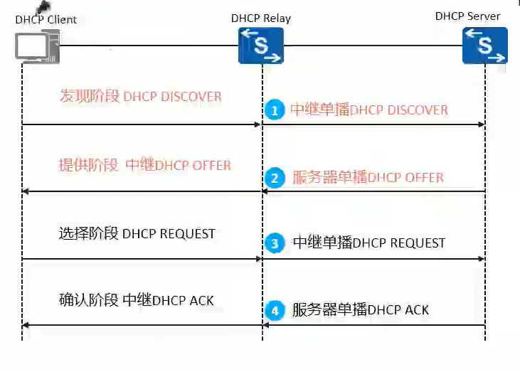

## DHCP

### 协议信息

　　协议报文基于 UDP 进行交互，采用 67（DHCP 服务器）和 68（DHCP 客户端）端口号
正常工作时由客户端向服务器提出配置申请
服务器返回为客户端分配的 IP 地址等配置信息

　　**客户端首次接入网络**

​​

1. 发现阶段，即 DHCP 客户端发现 DHCP 服务器的阶段

   DHCP 客户端发送 DHCPDISCOVER 报文来发现 DHCP 服务器。DHCP DISCOVER 报文中携带了客户端的 MAC 地址、需要请求的参数列表选项、广播标志位等信息
2. 提供阶段，即 DHCP 服务器提供网络配置信息的阶段

   服务器接收到 DHCP DISCOVER 报文后，选择跟接收 DHCP DISCOVER 报文接口的 IP 地址处于同一网段的地址池，并且从中选择一个可用的 IP 地址，然后通过 DHCP OFFER 报文发送给 DHCP 客户端
3. 选择阶段，即 DHCP 客户端选择 IP 地址的阶段

   如果有多个 DHCP 服务器向 DHCP 客户端回应 DHCPOFFER 报文，则 DHCP 客户端一般只接收第一个收到的 DHCPOFFER 报文，然后以广播方式发送 DHCP REQUEST 报文，该报文中包含客户端想选择的 DHCP 服务器标识符和客户端 IP 地址
4. 确认阶段，即 DHCP 服务器确认所分配 IP 地址的阶段

   DHCP 客户端收到 DHCPACK 报文，会广播发送免费 ARP 报文，探测本网段是否有其他终端使用服务器分配的 IP 地址。

　　**客户端再次接入网络**

　　DHCP 客户端非首次接入网络时，可以重用曾经使用过的地址。例如，网络中的主机作为 DHCP 客户端，在关机再开机的过程中，需要重新获取相关网络参数，则可以请求分配曾经使用过的 IP 地址。

1. 选择阶段

   客户端广播发送包含前一次分配的 IP 地址的 DHCPREQUEST 报文，报文中的 option50(请求的 IP 地址选项)依依字段填入曾经使用过的 IP 地址
2. 确认阶段

   DHCP 服务器收到 DHCP REQUEST 报文后，根据 DHCP0REQUEST 报文中携带的 MAC 地址来查找有没有相应的租约记录。如果有则返回 DHCP ACK 报文，通知 DHCP 客户端可以继续使用这个 IP 地址，如果没有租约记录，则不响应。

　　**地址续租**

1. 在租期达到 50% 时，单播请求 DHCP 服务器

   当租期达到 50% 时，DHCP 客户端会自动以单播的方式向 DHCP 服务器发送 DHCP REQUEST 报文，请求更新 IP 地址租期。如果收到 DHCP 服务器回应的 DHCP ACK 报文，则租期更新成功。
2. 在租期达到 87.5% 时，广播请求 DHCP 服务器

   当租期达到 87.5% 时，如果仍未收到 DHCP 服务器的应答，DHCP 客户端会自动以广播的方式向 DHCP 服务器发送 DHCP REQUEST 报文，请求更新 IP 地址租期。如果收到 DHCP 服务器回应的 DHCP ACK 报文，则租期更新成功如果租期时间到时都没有收到服务器的回应，客户端停止使用此 IP 地址，重新发送 DHCP DISCOVER 报文请求新的 IP 地址。

　　**地址分配顺序**

1. MAC 静态绑定

   DHCP 数据库中与客户端 MAC 地址静态绑定的 IP
2. 已使用过的 IP

   客户端曾经使用过的 IP，在客户端发送的请求报文中请求 IP 地址选项中的 IP 地址
3. 空闲状态的 IP

   目前没有被分配出去的 IP，按顺序分配
4. 超过租期的 IP

   以及分配出去，时间超过租期没有续约
5. 产生冲突的 IP

   与其他 IP 发生冲突

　　按顺序依次查找，如果找到可使用的 IP，则进行分配。没有可用 IP 则报告错误

### 报文格式

​​

　　字段说明：

* op (op code): 表示报文的类型，取值为 1 或 2，含义如下
  1:客户端请求报
  2:服务器响应报文
* Secs (seconds):由客户端填充，表示从客户端开始获得 IP 地址或 IP 地址续借后所使用了的秒数，缺省值为 3600s。
* Flags:客户端请求服务器发送响应报文的形式，只有最高位有意义，其余 15 位置 0。最高位为 0 时请求发送单播响应，最高位为 1 时请求发送广播响应
* Yiaddr (your client ip address) : 表示服务器分配给客户端的 IP 地址。当服务器进行 DHCP 响应时，将分配给客户端的 IP 地址填入此字段。
* Siaddr (serverip address) : DHCP 服务器的 IP 地址 0Chaddr (client hardware address) :客户端的 MAC 地址
* Options: DHCP 通过此字段包含了服务器分配给终端的配置信息

  ​

### DHCP 中继 Relay

​​

　　随着网络规模的不断扩大，网络设备不断增多，企业内不同的用户可能分布在不同的网段，一台 DHCP 服务器在正常情况下无法满足多个网段的地址分配需求。如果还需要通过 DHCP 服务器分配 IP 地址，则需要跨网段发送 DHCP 报文

　　DHCP Relav 即 DHCP 中继，它是为解决 DHCP 服务器和 DHCP 客户端不在同一个广播域而提出的，提供了对 DHCP 广播报文的中继转发功能，能够把 DHCP 客户端的广播报文“透明地”传送到其它广播域的 DHCP 服务器上，同样也能够把 DHCP 服务器端的应答报文“透明地”传送到其它广播域的 DHCP 客户端。

### <span id="20231227201906-xlfo1ai" style="display: none;"></span>DHCP snooping

* DHCP Snooping 的信任功能，能够保证 DHCP 客户端从合法的 DHCP 服务器获取 IP 地址
* DHCP Snooping 信任功能将接口分为信任接口和非信任接口

  * 信任接口正常接收 DHCP 服务器响应的 DHCPACK、DHCP NAK 和 0DHCP Offer 报文
  * 设备只将 DHCP 客户端的 DHCP 请求报文通过信任接口发送给合法的 DHCP 服务器，不会向非信任接口转发
  * 非信任接口收到的 DHP Server 发送的 DHCP OFFER、DHCP ACKDHCP NAK 报文会被直接丢弃

#### DAI 动态 ARP 检测

　　防止 ARP 中间人攻击

　　在 vlan 1 里开启动态 arp 检测（DAI），可以防止出现 ARP 欺骗

　　**锐捷**

```shell
Ruijie(config)#ip arp inspection vlan 1   #针对VLAN1中的用户启用DAI（arp防御）

Ruijie(config-if-FastEthernet 0/24)#ip arp inspection trust   ------>设置端口是可信任的，不检测arp
```

#### IP Source Guard --- IPSG 源防护

　　IP 地址欺骗攻击中，攻击者通过伪造合法用户的 IP 地址获取网络访问权限，非法访问网络，甚至造成合法用户无法访问网络，或者信息泄露。IPSG 针对 IP 地址欺骗攻击提供了一种防御机制，可以有效阻止此类网络攻击行为。

　　IP 源防攻击 (IPSG，IP Source Guard)是一种基于二层接口的源 IP 地址过滤技术。它能够防止恶意主机伪造合法主机的 IP 地址来仿冒合法主机，还能确保非授权主机不能通过自己指定 IP 地址的方式来访问网络或攻击网络。

​​

### 配置实现

#### 华为

　　​`display ip pool interface g0/0 // 查看地址池`​

　　​`display ip pool name pool10 // 查看地址池`​

　　​`display dhcp static user-bind all`​ 查看静态绑定表信息

　　​`<Huawei>dis ip pool interface vlanif20 used`​  查看已经分配的 ip

##### 全局模式

```vim
[Huawei]dhcp ena // 全局开启dhcp功能
[Huawei]ip pool pool1 // 创建全局地址池 pool1为地址池名称
[Huawei-ip-pool-pool1]network 192.168.1.0 mask 24 // 设置IP段
[Huawei-ip-pool-dhcp1]excluded-ip-address 192.168.10.2 192.168.10.10 //排除指定IP段
[Huawei-ip-pool-pool1]gateway-list 192.168.1.254 // 设置网关地址
[Huawei-ip-pool-pool1]dns-list 222.222.222.222 // 设置DNS服务器
[Huawei-ip-pool-pool1]lease day 1 // 设置租约
[Huawei]interface GigabitEthernet 0/0/0 // 进入接口
[Huawei-GigabitEthernet0/0/0]ip add 192.168.1.254 24 // 配置接口IP
[Huawei-GigabitEthernet0/0/0]dhcp select global  // 开启DHCP，使用全局地址池
```

##### 接口模式

```vim
[Huawei]interface GigabitEthernet 0/0/1 // 进入接口
[Huawei-GigabitEthernet0/0/1]ip add 192.168.2.1 24 // 配置IP，该IP为网关
[Huawei-GigabitEthernet0/0/1]dhcp select interface // 开启DHCP，使用接口地址池
[Huawei-GigabitEthernet0/0/1]dhcp server dns-list 222.222.222.222 // 设置DNS
[Huawei-GigabitEthernet0/0/1]dhcp server excluded-ip-address 192.168.2.200 192.1
68.210 // 设置排除地址
[Huawei-GigabitEthernet0/0/1]dhcp server lease day 1 // 设置租约
```

##### Relay 中继

```vim
[Huawei]dhcp ena
[Huawei]int g0/0/0
[Huawei-GigabitEthernet0/0/0]dhcp select relay
[Huawei-GigabitEthernet0/0/0]dhcp relay server-ip 192.168.100.1 // DHCP服务器
[Huawei]ip relay address cycle  // 中继服务器轮询，同时配置多个中继DHCP服务
```

##### DHCP 嗅探 snooping

```vim
[Huawei]dhcp snooping ena // 全局开启
[Huawei]dhcp snooping ena vlan 1 // 对vlan1开启嗅探，默认为非信任端口
[Huawei]in g0/0/0
[Huawei-GigabitEthernet0/0/0]dhcp snooping trust // 在朝向合法的DHCP服务器接口开启信任端口，此时该接口可以正常收发DHCP报文
```

　　‍

#### 锐捷

##### 基本配置

```vim
Ruijie(config) service dhcp // 全局开启DHCP
Ruijie(config) ip dhcp pool vlan10 // 创建接口池
Ruijie(config-dhcp-pool) network 192.1.10.0 255.255.255.0 // 分配网段
Ruijie(config-dhcp-pool) default-router 192.1.10.254 // 网关地址
Ruijie(config) ip dhcp excluded-address 192.1.10.252 192.1.10.253 // 排除地址
```

　　DHCP 中继，需全局开启 DHCP

　　​`Ruijie(config) ip helper-address 192.1.10.252`​

```shell
Ruijie(config) ip dhcp snooping  # 开启DHCP Snooping
Ruijie(config) interface gigabitEthernet 1/0/24
Ruijie(config-if-GigabitEthernet 1/0/24) ip dhcp snooping trust  # 设置DHCP信任端口
Ruijie(config) interface gigabitEthernet 1/0/1
Ruijie(config-if-GigabitEthernet 1/0/1) ip verify source port-security  # 开启源IP+MAC的报文检测
Ruijie(config-if-GigabitEthernet 1/0/1) arp-check  # 开启接口ARP-check功能
```

　　am规则

```vim
ip dhcp pool test
lease0 2 0 
network 10.1.0.0 255.255.0.0 
dns-server 202.115.32.39 202.115.32.36 
default-router10.1.0.1 

address-manager//配置AM规则，不同VLAN分配不同IP
match ip 10.1.1.0 255.255.255.0 vlan 101
match ip 10.1.2.0 255.255.255.0 vlan 102
match ip loose //配置为宽松模式，允许没被绑定的vlan获取ip
一般在super vlan情况下使用，dhcp根据不同的sub vlan 分配不同的ip段
```

#### DCN 神州数码

```shell
ip dhcp snooping enable #开启dhcp侦听
ip dhcp snooping binding enable #开启dhcp侦听绑定功能
ip dhcp snooping binding arp #绑定arp
ip dhcp snooping binding dot1x #绑定dot1x
ip dhcp snooping limit-rate <pps> #配置 DHCP snooping 报文转发速率
interface ethernet 1/0/11 #进入接口
ip dhcp snooping trust #配置接口为信任项
interface ethernet 1/0/1-10 #多个接口配置
ip dhcp snooping action shutdown #配置接口为非信任项
Ip dhcp snooping action shutdown 进接口配置
端口检测到伪装DCHP Server时down掉端口，后面跟recovery可以指定恢复时间
Ip dhcp snooping action blackhole
设置防御动作数目限制，防止交换机被攻击而耗尽系统资源，默认为10
Ip dhcp snooping binding enable
开启监听绑定功能，开启后记录所有新人端口DHCP Server分配绑定信息，使用之前先开启bing：ip dhcp binding enable
Ip dhcp snooping bingding user-control，进接口配置
开启后DHCP snooping将把捕获的绑定信息直接作为信任用户允许访问所有资源

Show ip dhcp binding
查看IP地址与相应的DHCP客户机硬件地址绑定信息，无特殊原因租期不到不会自动解除，
Clear ip dhcp binding
与show对应，可以删除自动绑定记录，DHCP地址池中所有地址都会重新分配
此时再次show ip dhcp binding，数据为空
手工绑定ip，MAC，指定用户唯一标识，如：
Client-identifier xx-xx-xx-xx-xx-xx
Host xx.xx.xx.xx. (host用来指定对应ip地址)
手工绑定硬件地址与ip地址
Hardware-address xx-xx-xx-xx-xx-xx
Host xx.xx.xx.xx
ip dhcp excluded-address xx.xx.xx.xx
排除地址池中的不用于动态分配的地址，方便其它用途
Service dhcp
打开DHCP服务器，不开启地址池设置无法生效
Ip dhcp pool xx
新建地址池
Domain-name xx
为客户机配置域名
Default-router xx.xx.xx.xx
为DHCP客户机配置默认网关，最多设置8个地址，最先设置地址优先级最高
Dns-server xx.xx.xx.xx
为DHCP客户机配置DNS服务器，最多设置8个，按照先后优先级排序同网关
Lease 0 8 0
设置租期时间，单位设置 天 /小时 /分钟
设置地址池可分配的地址范围，一个地址池只能对应一个网段，如：
Network-address 192.168.1.0 24
Network-address 192.168.1.0 255.255.255.0
Ip dhcp conflict ping-detection enable
打开ping方式冲突检测功能之前需要先开启日志功能
设置ping检测地址冲突发送ping请求报文的最大个数，如
Ip dhcp ping packets 5
Ip dhcp ping timeout 100
Ip forward-protocol udp boots
配置DHCP中继转发指定该端口UDP广播报文，boots指的是67 DHCP广播报文，查看配置的支持广文报文转发的协议端口号
Ip helper-address 1.1.1.1
指定DHCP中继转发UDP报文目标地址，目标地址往往是所在设备的对端ip，查看相关配置命令：show ip helper-address
```

### Option 属性

#### Option43/138

　　用于指定 AC 地址。锐捷使用 Option138，其他厂商使用 Option43

##### DCN

```shell
#开启option43服务
ip dhcp pool ap
option 43 hex 0104C0A80202 #0104固定值，后面是16进制IP
option 60 ascii udhcp 1.18.2 #固定值，1.18.2是AP版本，详见配置手册
```

##### 锐捷

```shell
ip dhcp pool ap
 option 138 ip 192.1.100.2 192.1.100.3 
```

　　‍

### 联动实验


　　‍
