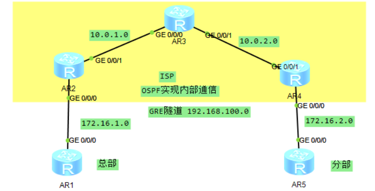

## GRE

### 配置实现

#### 华为

##### 简单 GRE 隧道

　　R1 为总部，R5 为分部。R234 为 ISP（OSPF 实现互通）

　　在 R2 和 R4 上配置 GRE 隧道实现互通

​​

```vim
// 配置基础IP
// 172.16.1.0为总部 172.16.2.0为分部
// 192.168.100.0 为GRE隧道
// 其他IP为模拟ISP
[R1-GigabitEthernet0/0/0]ip add 172.16.1.1 24 
[R2-GigabitEthernet0/0/0]ip add 172.16.1.2 24
[R2-GigabitEthernet0/0/1]ip add 10.0.1.1 24
[R3-GigabitEthernet0/0/0]ip add 10.0.1.2 24
[R3-GigabitEthernet0/0/1]ip add 10.0.2.1 24
[R4-GigabitEthernet0/0/1]ip add 10.0.2.2 2
[R4-GigabitEthernet0/0/0]ip add 172.16.2.1 24
[R5-GigabitEthernet0/0/0]ip add 172.16.2.2 24
// 双端创建隧道
[R2-Tunnel0/0/1]tunnel-protocol gre  // 隧道类型为GRE
[R2-Tunnel0/0/1]destination 10.0.2.2 // 对端IP
[R2-Tunnel0/0/1]source 10.0.1.1      // 本端IP
[R2-Tunnel0/0/1]ip add 192.168.100.1 24   // 接口IP，推荐配置

[R4-Tunnel0/0/1]tunnel-protocol gre 
[R4-Tunnel0/0/1]destination 10.0.1.1
[R4-Tunnel0/0/1]source 10.0.2.2
[R4-Tunnel0/0/1]ip add 192.168.100.2 24
// 静态路由，匹配对方网段从出接口为隧道
[R4]ip route-static 172.16.1.0 24 Tunnel 0/0/1
[R2]ip route-static 172.16.2.0 24 Tunnel 0/0/1
```

　　‍

#### 锐捷

##### ipv6ip 隧道配置命令

　　两端为 ipv6 网络，中间使用 ipv4 网络传输

```vim
In tu 1
Tu mode ipv6ip
Tu sou 本端v4IP
Tu de 对端v4IP
Ipv6 ena
Ipv6 add 2002:200:1：：1/64
对端同理
```

##### ipv6ip 6to4 隧道配置命令

```vim
隧道配置 // 该配置在华为 思科均验证成功，可能是锐捷模拟器bug，真机没问题
ipv6 address 2002:A00:2::1/64  // 注意格式，对端可能是2002:A00:1::1/64
ipv6 enable
tunnel mode ipv6ip 6to4
tunnel source 150.12.12.1 // ip或接口


// ipv6内嵌ipv4
格式：2002：ipv4::1
如：
10 == A
150.12.12.1 == 2002:960c:c01::1

路由：
ipv6 route 2002::/16 tu 1
ipv6 route 2001::/16 2002:960c:c02::1
```

　　**gre over ipsec**

```shell
int tu 1
 ip address 13.1.1.1 255.255.255.0
 tunnel source 12.1.1.1
 tunnel destination 23.1.1.2
# 隧道配置结束
ip access-list extended 101 # 匹配相关流量，隧道及物理接口ip
 permit gre host 13.1.1.1 host 13.1.1.2
 permit gre host 12.1.1.1 host 23.1.1.2
crypto isakmp policy 1
 encryption 3des
 authentication pre-share
crypto isakmp key 0 ruijie address 23.1.1.2
crypto ipsec transform-set myset esp-3des esp-md5-hmac
crypto map mymap 10 ipsec-isakmp
 set local 12.1.1.1
 set peer 23.1.1.2 
 set transform-set myset
 set autoup
 match address 101
int gi 0/0
crypto map mymap

```

　　‍
