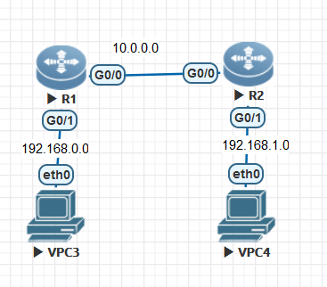
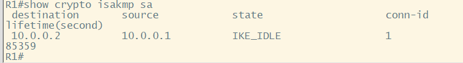
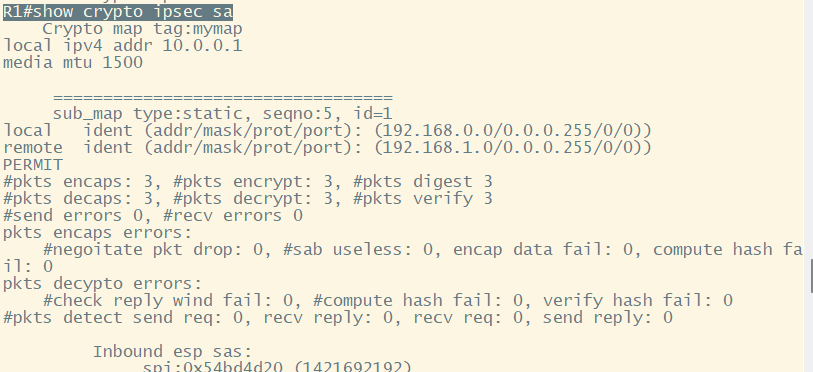

## IPsec

### 技术信息

#### 建立连接

　　第一阶段：对 ISAKMP 消息加密

　　第 1 2 个报文：协商：认证算法、加密算法、认证方式、DH 等

　　第 3 4 个报文：交换 DH 产生密钥

　　        SKEYID 为基础密钥，通过它可以推导出 SKEYID_a，为 ISAKMP 消息完整性验证密钥；可以推导出 SKEYID_e，为 ISAKMP 消息加密密钥；可以推导出 SKEYID_d，用于衍生出 IPsec 报文加密、验证密钥

　　第 5 6 个报文：验证对端的合法性

　　第二阶段：对真正的数据进行加密

### 配置实现

#### 华为

##### 简单配置

　　有些错误 待解决

　　第一阶段 ：

```vim
[R2-ike-proposal-1]dis ike proposal  // 查看策略模板信息
[R2]ike proposal 1 // 优先级 数值越小优先级越高
[R2-ike-proposal-1]encryption-algorithm 3des-cbc  // 配置加密算法
[R2-ike-proposal-1]authentication-method pre-share  // 配置认证算法
[R2-ike-proposal-1]authentication-algorithm md5  // 配置认证方式（后续产生密钥）
[R2]ike peer huawei v1 // 配置对端
[R2-ike-peer-huawei]pre-shared-key simple huawei // 配置预共享密码
[R2-ike-peer-huawei]remote-address 10.0.2.1 // 配置对端地址（后续认证合法性使用）
```

　　第二阶段：

```vim
[R2]ipsec proposal huawei2 // 配置第二阶段 建立IPSec SA
[R2-ipsec-proposal-huawei2]transform ah/esp // 配置用户数据报文封装模式 ah只认证不加密，esp既认证又加密
[R2-ipsec-proposal-huawei2]encapsulation-mode tunnel // 配置模式  transport传输模式  tunnel隧道模式
[R2-ipsec-proposal-huawei2]esp encryption-algorithm 3des // 数据报文的加密算法
[R2-ipsec-proposal-huawei2]esp authentication-algorithm md5 // 数据进行完整性校验
```

　　关联感兴趣流：ACL

```vim
[R2]ipsec policy vpn 1 isakmp // 进入实例 vpn为名字 1为序列号
[R2-ipsec-policy-isakmp-vpn-1]security acl 3000 // 关联ACL
[R2-ipsec-policy-isakmp-vpn-1]ike-peer huawei // 关联第一阶段
[R2-ipsec-policy-isakmp-vpn-1]proposal huawei2 // 关联第二阶段
```

　　‍

#### 锐捷

##### 简单配置 - 静态

　　实现 PC1 ping PC2 正常通信

​​

　　1.**配置 ipsec 感兴趣流**

```vim
R1(config)access-list  101 permit ip 192.168.0.0 0.0.0.255 192.168.1.0 0.0.0.255
// 指定感兴趣流的源地址为`192.168.0.0/24`，目的地址为`192.168.1.0/24`
```

　　2.**配置 isakmp 策略**

```vim
R1(config)#crypto isakmp  keepalive 5 periodic // 配置IPSEC DPD探测功能   
R1(config)#crypto isakmp policy 1  //创建新的isakmp策略
R1(isakmp-policy)#authentication pre-share  //指定认证方式为“预共享密钥”
R1(isakmp-policy)#group 2  
R1(isakmp-policy)#encryption 3des   // 指定使用3DES进行加密  
```

　　3.**配置预共享密钥**

```vim
R1(config)#crypto isakmp key 0 ruijie add 10.0.0.2
// 指定peer 10.0.0.2的预共享密钥为“ruijie”，对端也必须配置一致的密钥
```

　　4.**配置 ipsec 加密转换集**

```vim
R1(config)#crypto ipsec transform-set myset esp-des esp-md5-hmac 
// 指定ipsec使用esp封装des加密、MD5检验
```

　　5.**配置 ipsec 加密图**

```vim
R1(config)#crypto map mymap 5 ipsec-isakmp // 新建名称为“mymap”的加密图  
R1(config-crypto-map)#set peer 10.0.0.2 //指定peer地址 对端地址 别写错了 
R1(config-crypto-map)#set transform-set myset  // 指定加密转换集“myset”
R1(config-crypto-map)#match address 101  // 指定感兴趣流为ACL 101
```

　　6.**将加密图应用到接口**

```vim
R1(config-crypto-map)#in g0/0
R1(config-if-GigabitEthernet 0/0)#crypto map mymap // 绑定
```

　　7.**在 R1 配置路由，将局域网 2 网段路由指向出口**

　　​` ip route 192.168.1.0 255.255.255.0 10.0.0.2`​

##### 简单配置 - 动态

　　要求 PC4 ping 通 PC6

　　R1 使用动态模式，R2 使用静态模式

　　R1 配置 动态

```vim
// 配置isakmp策略
crypto isakmp policy 1     //创建新的isakmp策略 
encryption 3des        //指定使用3DES进行加密 
authentication pre-share       //指定认证方式为“预共享密码”
// 配置预共享密钥 
crypto isakmp key 0 ruijie address 0.0.0.0 0.0.0.0     //配置预共享密钥为“ruijie”，IPSEC客户端也必须配置相同的密钥。由于对端的 ip地址是动态的，因此使用address 0.0.0.0 0.0.0.0代表所有ipsec客户端
// 配置ipsec加密转换集 
crypto ipsec transform-set myset esp-des esp-md5-hmac    //指定ipsec使用esp封装des加密、MD5检验 
// 配置动态ipsec加密图 
crypto dynamic-map dymymap 5     //新建名为“dymymap”的动态ipsec加密图 
	set transform-set myset     //指定加密转换集为“myset” 
// 将动态ipsec加密图映射到静态的ipsec加密图中 
crypto map mymap 10 ipsec-isakmp dynamic dymymap   //将动态的“dymymap”ipsec加密图映射至静态ipsec加密图mymap中 
//将加密图应用到接口 
interface GigabitEthernet 0/0 
	crypto map mymap 
//记得配置路由指向出口
```

　　R2 配置 静态

```vim
// 配置ipsec感兴趣流 
access-list 101 permit ip 192.168.1.0 0.0.0.255 192.168.0.0 0.0.0.255  //指定感兴趣流为源地址192.168.1.0/24，目的地址为192.168.0.0/24的网段。
// 配置isakmp策略 
crypto isakmp keepalive 5 periodic  //配置IPSEC DPD探测功能 
crypto isakmp policy 1            //创建新的isakmp策略 
authentication pre-share         //指定认证方式为“预共享密码”
encryption 3des   //指定使用3DES进行加密 
// 配置预共享密钥 
crypto isakmp key 0 ruijie address 10.0.0.1  //指定peer 10.0.0.1的预共享密钥为“ruijie”，与总部出口路由器上配置的一致。
// 配置ipsec加密转换集
crypto ipsec transform-set myset  esp-des esp-md5-hmac //指定ipsec使用esp封装des加密、MD5检验
// 配置ipsec加密图 
crypto map mymap 5 ipsec-isakmp //新建名称为“mymap”的加密图 
set peer 10.0.0.1                              //指定peer地址 
set transform-set myset                  //指定加密转换集为“myset” 
match address 101                         //指定感兴趣流为ACL 101 
//将加密图应用到接口 
interface dialer 0 
crypto map mymap  
// 记得配置路由指向出口
```

　　如果 ping 不通就多尝试几次，需要流量触发才能建立连接

##### IPsec 配置验证

　　验证配置状态

　　​`Ruijie#show crypto isakmp sa`​ 查看 isakmp sa 协商情况

​​

　　isakmp 协商成功，状态为 IKE_IDLE

　　​`Ruijie#show crypto ipsec sa` ​查看 ipsec sa 协商情况

​​

```vim
Interface: GigabitEthernet 0/0   
Crypto map tag:mymap             //接口下所应用的加密图名称                                 
local ipv4 addr 10.0.0.1  //进行isakmp/ipsec协商时所使用的IP地址   
media mtu 1500
==================================
sub_map type:static, seqno:5, id=0   
local  ident (addr/mask/prot/port): (192.168.0.0/0.0.0.255/0/0))          //感兴趣流源地址
remote  ident (addr/mask/prot/port): (192.168.1.0/0.0.0.255/0/0))      //感兴趣流目的地址   
PERMIT
#pkts encaps: 4, #pkts encrypt: 4, #pkts digest 4//成功封装、加密、摘要报文个数
#pkts decaps: 4, #pkts decrypt: 4, #pkts verify 4//成功解封装，解密、检验报文个数，有数据通过IPSEC加密进行通信时，重复执行show crypto ipsec sa命令可以看到以上统计个数会不断增加。
#send errors 0, #recv errors 0//发送、接收错误报文个数，正常情况下该统计不增加。   
         Inbound esp sas:
spi:0x2ecca8e (49072782)//ipsec sa入方向的spi   
transform: esp-des esp-md5-hmac    //ipsec加密转换集为esp-des esp-md5-hmac
in use settings={Tunnel Encaps,}//采用隧道模式
crypto map mymap 5
sa timing: remaining key lifetime (k/sec): (4606998/1324)  //离安全联盟的生命周期到期还有：4606998千字节/1324秒
IV size: 8 bytes   //IV向量长度为8
               Replay detection support:Y   //抗重播处理   
         Outbound esp sas:
spi:0x5730dd4b (1462820171)//ipsec sa出方向的spi，只有看到了inbound spi和outbound spi才说明ipsec sa已经协商成功。  
transform: esp-des esp-md5-hmac
 in use settings={Tunnel Encaps,}
crypto map mymap 5
sa timing: remaining key lifetime (k/sec): (4606998/1324)
IV size: 8 bytes
Replay detection support:Y
```

#### 错误排查

　　状态：**MM_SI3_WR3**

　　解决方案：双端预共享密钥不一致

　　‍

　　参考链接：((20231210152911-v3e8mrc ''))
