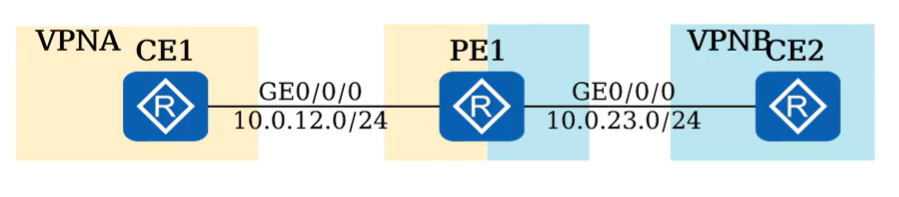

## MPLS VPN

　　目前，MPLS VPN 的主要应用包括企业互连和虚拟业务网络。

* 企业互连应用:可通过 MPLS VPN 将分布在各地的分支机构和合作伙伴的 IP 网络连接在一起;
* 虚拟业务网络:可在同一物理网络上运行多种业务，如 VOIP、IPTV 等，为每个业务建立一个 VPN，实现业务隔离

​​

### 组网方式

#### **Intranet 组网**

　　当采用 Intranet 组网方案时，一个 VPN 中的所有用户形成闭合用户群，相互之间能够进行流量转发.VPN 中的用户不能与任何本 VPN 以外的用户通信，其站点通常是属于同一个组织。

​​

　　PE 需要为每个站点创建 VPN 实例，并配置全网唯一的 RD。

　　PE 通过配置 Import RT 和 Export RI 来控制不同 VPN 的站点做到无法互访。

##### 部署配置

　　如图所示，客户 X 及 Y 各自有 2 个站点，现需要通过 MPLS VPN 实现站点之间的互联，分别对应 VPNX 和 VPNY;

　　互联接口、AS 号及 IP 地址信息，CE 与 PE 通过如图的协议或方法交换路由信息

​​

　　PE-CE 之间部署 OSPF

​​

```shell
[CE1] ospf 1
[CE1-ospf-1] area 0
[CE1-ospf-1-area-0.0.0.0]network 192.168.100.0 0.0.0.255
[CE1-ospf-1-area-0.0.0.0]network 192.168.1.0 0.0.0.255
```

　　CE1 的 OSPF 配置还是传统的 OSPF 配置，CE1 无需支持 VRF

```shell
[PE1] ospf 1 vpn-instance VPNX
[PE1-ospf-1] area 0
[PE1-ospf-1-area-0.0.0.0]network 192.168.100.0 0.0.0.255
[PE1-ospf-1-area-0.0.0.0]quit
[PE1-ospf-1] import bgp
```

　　PE1 用于跟 CE1 对接的 OSPF 进程必须与对应的 VPN 实例绑定，将 PE1 的 VPN 实例 VPNX 的路由表中的 BGP 路由(主要是 PE1 通过 BGP 获知的、到达站点 B 的客户路由)引入 OSPF，以便将这些路由通过 OSPF 通告给 CE1。

```shell
[PE11 bgp 123
[PE1-bgp] ipv4-family vpn-instance VPNX
[PE1-bgp] import-route ospf 1
```

　　将 PE1 的 VPN 实例 VPNX 的路由表中通过 OSPF 进程 1 学习到的 OSPF 路由引入 BGP，从而将到达站点 A 的客户路由转换成 BGP 的 VPNV4 路由，以便通告给远端的 PE2.

　　PE-CE 之间部署静态路由​

​​

```shell
[CE2]ip route-static 192.168.1.0 24 192.168.200.2
[CE2]ip route-static 192.168.100.0 24 192.168.200.2
```

　　CE2 需配置到达站点 A 内的各个网段的静态路由

```shell
[PE2]ip route-static vpn-instance VPNX 192.168.2.0 24 192.168.200.1
[PE2] bgp 123
[PE2-bgp] ipv4-family vpn-instance VPNX
[PE2-bgp] import-route static
```

　　PE2 需配置到达站点 B 内各个网段的静态路由。

　　将 PE2 的 VPN 实例 VPNX 的路由表中的静态路由引入 BGP，从而将客户由转换成 BGP 的 VPNV4 路由，以便通告给远端的 PE1。

　　PE-CE 之间部署 EBGP

​​

```shell
[CE3] bgp 100
[CE3-bgp]peer 192.168.100.2 as-number 123
[CE3-bgp] network 192.168.1.0 24
```

　　CE3 只需要执行普通 BGP 配置，且无需支持 VRF

```shell
[PE1] bgp 123
[PE1-bgp] ipv4-family vpn-instance VPNY
[PE1-bgp-VPNY]peer 192.168.100.1 as-number 100
```

　　当 PE 与 CE 之间使用 BGP 交互客户路由时，无需在 PE 上手工执行路由重分发操作。在本例中，PE1 通过 BGP 从 CE3 学习到的客户路由后，PE1 会自动将这些路由转换成 VPNV4 路由并通告给 PE2;而 PE1 通过 BGP 从 PE2 获知到达站点 D 的路由后，会自动将它们转换成 IPV4 路由并通告给 CE3:

　　注意：在这种情况下需要对 BGP 进行一些特殊配置：

　　[AS号替换](#20240211213824-ywcehvc)

　　[SoO特性](#20240211215410-sjekwjn)

　　PE-CE 之间部署 IS-IS

​​

```shell
[CE4] isis 1
[CE4-isis-1] network-entity 49.0001.0000.0000.1111.00[CE4-isis-1lis-level level-2
[CE4-isis-1] quit
[CE4]interface GigabitEthernet 0/0/0
[CE4-GiaabitEthernet0/0/0]isis enable 1
[CE4-GiqabitEthernet0/0/0]quit
[CE4]interface GigabitEthernet 0/0/1
[CE4-GigabitEthernet0/0/1] isis enable 1
#GE0/0/1接口是192.168.2.0/24网段所在接口
```

```shell
[PE2]isis 1vpn-instance VPNY
[PE2-isis-1]network-entity 49.0002.0000.0000.2222.00PE2-isis-1lis-level level-2
PE2-isis-1]import-route bap level-2
[PE2-isis-1] quit
[PE21interface GigabitEthernet 0/0/2
[PE2-GigabitEthernet0/0/2]isis enable 1
[PE2] bgp 123
[PE2-bgp] ipv4-family vpn-instance VPNY
[PE2-bgp]import-route isis 1
```

#### Extranet 组网

　　当采用 Extranet 组网方案时，VPN 用户可将部分站点中的网络资源给其他 VPN 用户进行访问。
正

​​

　　如图，Site 2 作为能被 VPN1 和 VPN2 访问的共同访问的共享站点，需要保证:

* PE2 能够接收 PE1 和 PE3 发布的 VPNv4 路由
* PE2 发布的 VPNv4 路由能够被 PE1 和 PE3 接收
* PE2 不把从 PE1 接收的 VPNv4 路由发布给 PE3，也不把从 PE3 接收的 VPNv4 路由发布给 PE1。

#### Hub&Spoke 组网

　　当采用 Hub&Spoke 方案时，可以将多个站点中的一个站点设置为 Hub 站点，其余站点为 Spoke 站点。站点间的互访必须通过 Hub 站点，通过 Hub 站点集中管控站点间的数据传输。

​​

　　Spoke 站点需要把路由发布给 Hub 站点，再通过 Hub 站点发布给其他 Spoke 站点。Spoke 站点之间不直接交互路由信息。

　　Spoke-PE 需要设置 Export Target 为“Spoke"，Import Target 为“Hub”

　　Hub-PE 上需要使用两个接口或子接口(创建两个 VPN 实例)，一个用于接收 Spoke-PE 发来的路由，其 VPN 实例的 Import Target 为“Spoke”;另一个用于向 Spoke-PE 发布路由，其 VPN 实例的 Export Target 为
“Hub”

　　**从 Site1 到 Site2 的路由发布过程如下:**

​​

1. Spoke-CE1 发布路由给 Spoke-PE1。
2. Spoke-PE1 通过 IBGP 将该路由发布给 Hub-PE。
3. Hub-PE 通过 VPN 实例(VPNin)的 Import Target 属性将该路由引入 VPN in 路由表，并发布给 Hub-CE。
4. Hub-CE 学习到该路由，并将该路由发布给 Hub-PE 的 VPN 实例(VPNout)
5. Hub-PE 通过 VPN out 发布该路由给 Spoke-PE2(携带 VPN out 的 ExporTarget 属性
6. Spoke-PE2 该路由发布给 Spoke-CE2.

##### 部署配置

　　Hub&Spoke 有以下组网方案:

1. 方式一:Hub-CE 与 Hub-PE，Spoke-PE 与 Spoke-CE 使用 EBGP
2. 方式二:Hub-CE 与 Hub-PE，Spoke-PE 与 Spoke-CE 使用 IGP
3. 方式三:Hub-CE 与 Hub-PE 使用 EBGP，Spoke-PE 与 Spoke-CE 使用 IGP

　　<span data-type="text" id="" style="background-color: var(--b3-card-error-background); color: var(--b3-card-error-color);">无法通过 Hub-CE 与 Hub-PE 使用 IGP，Spoke-PE 与 Spoke-CE 使用 EBGP 来部署 Hub&amp;Spoke 组网的
MPLS VPN.</span>

​​

　　VRF 配置

　　Spoke-PE 上创建一个 VPN 实例，RT 配置如图

　　Hub-PE 上创建 VPN in 和 VPN out 两个 VPN 实例，分别用于从 Spoke-PE 接收私网路由或向 Spoke-PE 发
布私网路由，RT 配置如图。

​​

##### 方式一

　　Hub-PE 通过 VPN in 对应的 EBGP 连接将从 Spoke 站点学习的路由发布到 Hub 站点。

　　Hub-CE 通过 VPN out 对应的 EBGP 将这些路由发布到 Spoke 站点。

​​

```shell
#Hub-PE与Hub-CE建立两条EBGP连接
[Hub-PE] bgp 123
Hub-PE-bgp] ipv4-family vpn-instance VPN in
[Hub-PE-bap-VPN in] peer 192.168.31.1 as-number 65001
[Hub-PE-bgp-VPN in]quit
[Hub-PE-bgp] ipv4-family vpn-instance VPN out
[Hub-PE-bgp-VPN out]peer 192.168.32.1 as-number 6500
[Hub-PE-bgp-VPN out]peer 192.168.32.1 allow-as-loop  // 允许本地AS号重复
```

```shell
# Hub-CE与Hub-PE建立两条EBGP连接
[Hub-CE]bgp 65001
[Hub-CE-bgp]peer 192.168.31.2 as-number 123
[Hub-CE-bgp] peer 192.168.32.2 as-number 123
```

　　由于 Hub-CE 通过 VPN out 对应的 EBGP 连接发送给 Hub-PE 的路由可能带有 AS123，则这些路由将会被 Hub-PE 丢弃，故 Hub-PE 上必须手工配置允许本地 AS 编号重复。

##### 方式二

　　路由发布过程

​​

　　以选用 OSPF 作为 IGP 协议为例:

　　Spoke-CE 与 Spoke-PE 之间通过 OSPF(进程 100)邻居关系交互路由信息

　　Hub-PE 通过两个 OSPF 进程与 Hub-CE 建立 OSPF 邻居，分别负责私网路由的发送和接收。

　　Hub-PE 与 Hub-CE 间配置

　　Hub-PE 通过 VPN in 对应的 OSPF(进程 100)将从 Spoke 站点学习的路由发布到 Hub 站点

　　Hub-CE 通过 VPN out 对应的 OSPF(进程 200)将这些路由发布到 Hub-PE，进而发布给所有 Spoke 站点。

​​

```shell
#Hub-PE上执行OSPF和BGP的相互引入
[Hub-PE]OSPF 100 vpn-instance VPN in
[Hub-PE-ospf-100]import-route bgp
[Hub-PE-ospf-100]quit
[Hub-PE]bgp 100
[Hub-PE-bgp]ipv4-family vpn-instance VPN out
[Hub-PE-bgp-VPN out]import-route ospf 200
```

```shell
#Hub-CE上OSPF 200到OSPF 100的路由引入
[Hub-CE]OSPF 200
[Hub-CE-ospf-200]import-route OSPF 100
```

##### 方式三

　　以选用 OSPF 作为 IGP 协议为例，Spoke-CE 与 Spoke-PE 之间通过 OSPF(进程 100)邻居关系交互路由信点。

　　Hub-PE 与 Hub-CE 之间建立两条 EBGP 连接，分别用来发布和接收私网路由，Hub-PE 与 Hub-CE 的配置与方式一相同。

​​

##### 没有方式四

　　无法通过 Hub-CE 与 Hub-PE 使用 IGP，Spoke-PE 与 Spoke-CE 使用 EBGP 来部署 Hub&Spoke 组网的 MPLS VPN

​​

　　会导致 spoke-PE 设备路由震荡、环路

　　‍

#### MCE 组网

　　当一个私网需要根据业务或者网络划分 VPN 时，不同 VPN 用户间的业务需要完全隔离。此时，为每个 VPN 单独配置一台 CE 将增加用户的设备开支和维护成本。

　　具有 MCE(Multi-VPN-Instance，CE 多实例 CE)功能的 CE 设备可以在 MPLSVPN 组网应用中承担多个 VPN 实例的 CE 功能，减少用户网络设备的投入。

​​

　　MCE 将 PE 的部分功能扩展到 CE 设备，通过将不同的接口与 VPN 绑定，并为每个 VPN 创建和维护独立的路由转发表(Multi-VRF)。

　　MCE 与对应的 PE 之间可以通过物理接口、子接口或者逻辑接口进行互联，PE 上需要将这些接口绑定到对应的 VPN 实例。

#### 跨域组网

　　随着 MPLS VPN 解决方案的广泛应用，服务的终端用户的规格和范围也在增长，在一个企业内部的站点数目越来越大，某个地理位置与另外一个服务提供商相连的需求变得非常的普遍，例如国内运营商的不 同城域网之间，或相互协作的运营商的骨干网之间都存在着跨越不同自治系统(AS，Autonomous System)的情况。

　　一般的 MPLS VPN 体系结构都是在一个 AS 内运行，任何 VPN 的路由信息都是只能在一个 AS 内按需散。
AS 之间的 MPLS VPN 部署需要通过跨域(Inter-AS)MPLS VPN 解决方案来实现。

​​

#### 不同实例的路由相互引入组网

　　在 BGP/MPLSIP VPN 组网中，一个 VPN 实例仅能与其他 VPN-Target 相匹配的 VPN 实例相互通信，但是 VPN 实例无法与公网或其他 VPN-Target 不匹配的 VPN 实例中的用户相互通信。用户可以配置不同实例的路由相互引入功能。同实例的路由相互引入功能可以分为两种类型:

* 公网与私网的路由相互引入功能。

  ​​
* 不同私网间的路由相互引入功能。

  ​​

##### 公网与私网互通

​​

1. 在 PE 上将私网路由引入本地的公网路由表。
2. 将本地的公网路由表引入其他协议，使 P 设备获取到路由信息

　　配置将私网中的静态路由或 IGP 路由引入至公网中对应路由类型的路由表中。

```shell
[Huaweilip import-rib vpn-instance vpn-instance-name protocol{static lisis process-id ospf process-id }[ valid-route l[ route-policy route-policy-name |route-filter route-filter-name l
```

​​

1. 在 PE 上将公网路由引入本地的私网路由表。
2. 将本地的私网路由表引入其他协议，使 CE 设备获取到路由信息

　　配置将公网中的直连路由、VLINK 直连路由、静态路由或 IGP 路由引入至私网中对应路由类型的路由表中。

```shell
[Huawei-vpn-instance-VPNA-af-ipv4l import-rib public protocol{ direct lvlink-direct-route l{static lisis process-idlospf processid}[ valid-route l}[route-policy route-policy-name ]
```

　　举个栗子

​​

　　将私网路由引入公网。

```shell
[PE1]ip import-rib _ypn-instancé VPNA protocol direct
[PE1]ospf 1
[PE1-ospf-1]import-route direct
```

　　将公网路由引入私网。

```shell
[PE1lip vpn-instance VPNA
[PE1-vpn-instance-VPNA]ipv4-family
[PE1-vpn-instance-VPNA-af-ipv4]import-rib public protocol ospf
```

　　配置结果验证:在 P 设备上可以直接 ping 通私网中 CE1 的接口地址

```shell
<P>ping 10.0.12.1PING 10.0.12.1:56 data bytes, press CTRL C to break
Reply from 10.0.12.1:bytes=56 Sequence=1 ttl=255 time=5 ms
Reply from 10.0.12.1:bytes=56 Sequence=2 ttl=255 time=4 ms
Reply from 10.0.12.1:bytes=56 Sequence=3 ttl=255 time=3 ms
Reply from 10.0.12.1:bytes=56 Sequence=4 ttl=255 time=5 ms
Reply from 10.0.12.1:bytes=56 Sequence=5 ttl=255 time=4 ms
```

##### 私网与私网互通

​​

1. 在 PE 上将 VPNA 的路由引入 VPNB
2. 在 PE 上将 VPNB 的路由引入 VPNA。

　　配置将其他 VPN 实例中的直连路由、IGP 路由或静态路由引入至指定 VPN 实例中对应路由类型的路由表中。

```shell
[Huawei-vpn-instance-VPNA-afipv4] import-rib vpn-instance ypn-instance-name protocol { direct { static isis process-id ospf process-id )[valid-route ]}[route-policy route-policy-name route-filter route-flter-name 
```

　　举个栗子

​​

　　将 VPNA 的私网路由引入 VPNB

```shell
[PE1lip vpn-instance VPNB
[PE1-vpn-instance-VPNB]ipv4-family
[PE1-vpn-instance-VPNB-af-ipv4] import-rib vpn-instance VPNA protocol direct
```

　　将 VPNB 的私网路由引入 VPNA。

```shell
[PE1lip vpn-instance VPNA
[PE1-vpn-instance-VPNAlipv4-family
[PE1-vpn-instance-VPNA-af-ipv4] import-rib vpn-instance VPNB protocol direct
```

　　配置结果验证:CE2 设备可以直接 ping 通私网中 CE1 的接口地址

```shell
<CE2>ping 10.0.12.1PING 10.0.12.1:56 data bytes, press CTRL C to break
Reply from 10.0.12.1:bytes=56 Sequence=1 ttl=255 time=5 ms
Reply from 10.0.12.1:bytes=56 Sequence=2ttl=255 time=4 ms
Reply from 10.0.12.1:bytes=56 Sequence=3 ttl=255 time=3 ms
Reply from 10.0.12.1:bytes=56 Sequence=4 ttl=255 time=5 ms
Reply from 10.0.12.1:bytes=56 Sequence=5 ttl=255 time=4 ms
```

### OSPF VPN 扩展

#### OSPF/BGP 互操作

　　当 PE-CE 间部署 OSPF 交互路由信息时，若在 PE 上使用标准 BGP/OSPF 过程(简称为 BGP/OSPF 互操作)互来传递路由信息，则远端 PE 在将 BGP 引入 VPN 实例的 OSPF 进程时，会直接产生 Type5LSA，不同站点都会将其他站点的路由视为自治系统外部路由(ASexternal)

　　为了解决标准 BGP/OSPF 的互操作导致的 OSPF 路由信息丢失的问题，BGP 和 OSPF 都做了相应的拓展

​​

　　‍

　　‍

### 配置实现

##### 锐捷 MPLS VPN 综合实现

* 北京总部、广州分部、吉林分部三个企业内部的局域网之间，通过 MPLS VPN 技术实现安全访问。其中，R1、R2、R3 开启 MPLS 报文转发及 LDP 标签转发协议。VRF 名称为 VPNA,RD 值分别 100:1、100:2、100:3，RT 值均为 1:1。
* 在 R1、R2、R3 间部署 IBGP,AS 号为 100。IGP 协议使用 OSPF，归属区域 0，进程号 20。定义 R1 为路由反射器 RR，使用 Loopback 接口建立 BGP 邻居关系。
* 配置思路：

  1. 部署 AS 核心的 IGP 路由协议
  2. 部署 AS 核心的 MPLS

     1. 全局开启 MPLS 转发功能
     2. 全局开启 LDP 标签分发协议
     3. 开启接口的标签交换能力
     4. 接口下开启 LDP 协议
  3. 部署 PE-PE 的 MP-BGP 协议

     1. 启用 BGP 进程
     2. 进入 VPNV4 地址簇下激活 VPNV4 邻居关系
     3. 配置路由反射器 RR
  4. 部署 PE-CE 的路由协议

     1. 创建 VRF 实例
     2. 将相关接口划入对应的 VRF 实例中
     3. 配置 PE-CE 的路由协议
  5. 将 CE 的路由重发布进 MP-BGP
  6. 将 MP-BGP 的路由重发布进 CE

　　MPLS 实现

```
vim
R1(config) mpls ip  # 全局开启MPLS转发功能
R1(config) mpls router ldp  # 全局开启LDP标签分发协议
R1(config-mpls-router) ldp router-id interface loopback 0 force  # 指定LSR-ID
R1(config) interface gi0/1
R1(config-if-GigabitEthernet 0/1) label-switching  # 开启接口的标签交换能力
# 缺省情况下，三层接口只能识别IP数据包，如果不开启标签交换能力的话，是不能识别0x8847的标签包。
R1(config-if-GigabitEthernet 0/1) mpls ip  # 接口下开启LDP协议
```

　　PE-PE 的 MP-BGP 协议

```vim
R1(config) router bgp 100
R1(config-router) neighbor 3.3.3.3 remote-as 100
R1(config-router) neighbor 3.3.3.3 update-source Loopback 0
R1(config-router) no bgp default ipv4-unicast  # 关闭缺省的IPV4单播的邻居建立过程
R1(config-router) address-family vpnv4 unicast  # 进入进入VPNV4地址簇
R1(config-router-af) neighbor 3.3.3.3 activate  # 激活VPNV4邻居关系

R2(config) router bgp 100
R2(config-router) neighbor 2.2.2.2 remote-as 100
R2(config-router) neighbor 2.2.2.2 update-source Loopback 0
R2(config-router) neighbor 2.2.2.2 route-reflector-client  # 设置路由反射客户为R1
R2(config-router) neighbor 4.4.4.4 remote-as 100
R2(config-router) neighbor 4.4.4.4 update-source Loopback 0
R2(config-router) neighbor 4.4.4.4 route-reflector-client  # 设置路由反射客户为R3
R2(config-router) no bgp default ipv4-unicast
R2(config-router) address-family vpnv4 unicast
R2(config-router-af) neighbor 2.2.2.2 activate
R2(config-router-af) neighbor 2.2.2.2 route-reflector-client
R2(config-router-af) neighbor 4.4.4.4 activate
R2(config-router-af) neighbor 4.4.4.4 route-reflector-client

R3(config) router bgp 100
R3(config-router) neighbor 3.3.3.3 remote-as 100
R3(config-router) neighbor 3.3.3.3 update-source Loopback 0
R3(config-router) no bgp default ipv4-unicast
R3(config-router) address-family vpnv4 unicast
R3(config-router-af) neighbor 3.3.3.3 activate
```

　　PE-CE 的路由协议

```vim
R1(config) ip vrf VPNA  # 创建名为VPNA的VRF实例
R1(config-vrf) rd 100:1  # 设置RD为100:1
R1(config-vrf) route-target both 1:1  # 设置进和出RT均为1:1
R1(config) router ospf 10 vrf VPNA  # 启用VPNA虚拟转发的OSPF进程  
R1(config-router) network 12.1.1.0 0.0.0.255 area 0
```

　　‍

　　**锐捷**

　　R1(CE)---R2(PE)---R3(P)---R4(PE)---R5(CE)

　　其中，R1正常与R2建立bgp邻居

　　R2设备中，将R1的邻居划入vrf中，

```shell
ip vrf aaa
rd 10:1 # 全局唯一
route-target export 100:1  # 出站标签
route-target import 200:1  # 入站标签
route-target import 300:1  # 可引入多个入站标签，学习多个vrf的路由

R2与R1建立的邻居要在
address-family ipv4 vrf aaa 内
neighbor 1.1.1.1 activate

R2连接R3的接口开启mpls，接口下
mpls ip
label-switching

R3开启mpls即可，R2 3 4要求IGP互通

R2与R4建立VPNv4邻居
address-family vpnv4 unicast
neighbor 4.4.4.4 activate

R4与R2配置类似，RT值没错即可学习到路由
```

　　‍

# WLAN

　　WLAN 即 Wireless LAN(无线局域网)，是指通过无线技术构建的无线局域网络。WLAN 广义上是指以无线电波、激光、红外线等无线信号来代替有线局域网中的部分或全部传输介质所构成的网络。

　　通过 WLAN 技术，用户可以方便地接入到无线网络，并在无线网络覆盖区域内自由移动，彻底摆脱有线网络的束缚。

　　‍

​​
