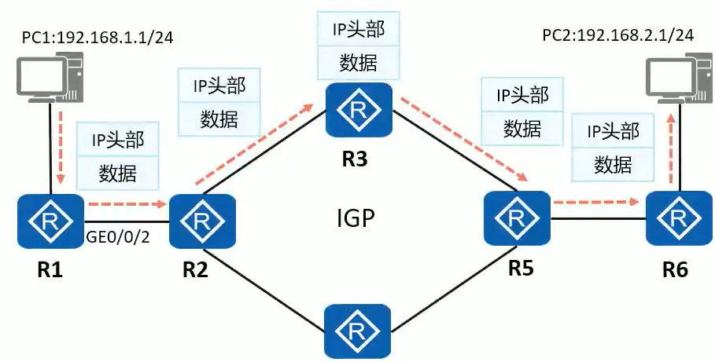
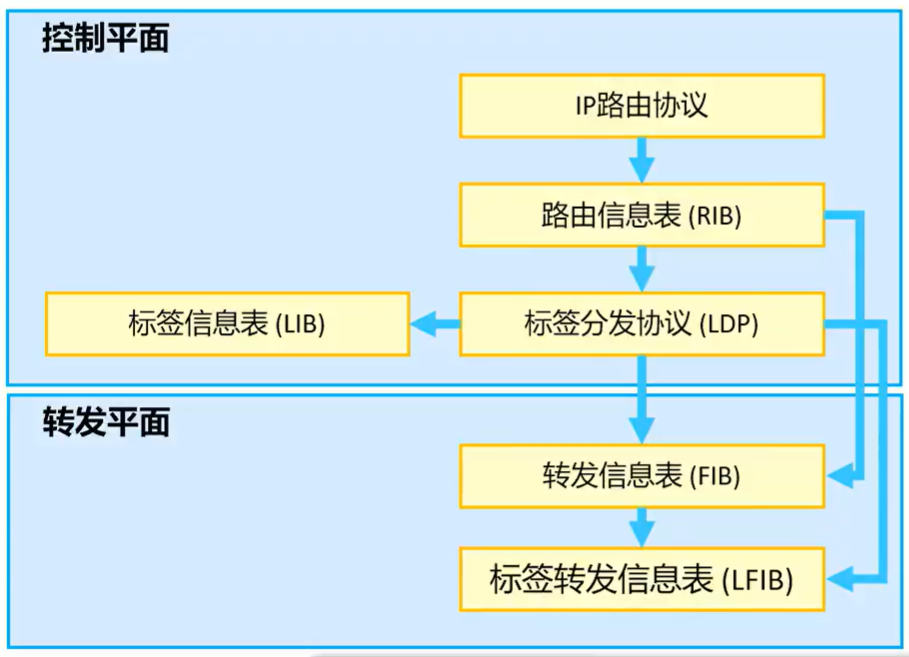

## MPLS

　　与传统 IP 路由方式相比，MPLS 在数据转发时，只在网络边缘分析 IP 报文头，在网络内部采用更为高效的标签(Label) 转发，节约了处理时间

　　随着设备硬件性能不断提升，MPLS 在提高数据转发速度上的优势逐渐弱化，但其支持多层标签嵌套和设备内转控分离的特点，使其在 VPN (Virtual Private Network，虚拟私有网络)、QoS(Quality of Service，服务质量)等新兴应用中得到广泛应用。

　　**传统 IP 路由转发**

　　传统的 IP 转发采用的是逐跳转发。数据报文经过每一台路由器，都要被解封装查看报文网络层信息，然后根据路由最长匹配原则查找路由表指导报文转发。各路由器重复进行解封装查找路由表和再封装的过程，所以转发性能低。

​​

* 所有路由器需要知道全网的路由
* IP 头部不定长，处理效率低
* 传统 IP 转发是面向无连接的，无法提供较好的端到端 QoS 保证

　　**MPLS 路由转发**

　　MPLS 位于 TCP/1P 协议栈中的数据链路层和网络层之间，可以向所有网络层提供服务

　　通过在数据链路层和网络层之间增加额外的 MPLS 头部，基于 MPLS 头部实现数据快速转发

​​

### 术语解释

##### **MPLS 域(MPLS Domain)**

　　一系列连续的运行 MPLS 的网络设备构成了一个 MPLS 域。

##### **LSR(Label switching Router，标签交换路由器)**

　　支持 MPLS 的路由器(实际上也指支持 MPLS 的交换机或其他网络设备)。位于 MPLS 域边缘、连接其它网络的 LSR 称为边沿路由器 LER(LabelEdge Router)，区域内部的 LSR 称为核心 LSR(Core LSR)

​​

##### **LSR 分类**

　　除了根据 LSR 在 MPLS 域中的位置进行分类之外，还可以根据对数据处理方式的不同进行分类:

* 入站 LSR(Ingress LSR)：通常是向 IP 报文压入 MPLS 头部并生成 MPLS 报文的 LSR。
* 中转 LSR(Transit LSR)：通常是将 MPLS 报文进行例如标签置换操作，并将报文继续在 MPLS 域中转发的 LSR。
* 出站 LSR(Egress LSR)通常是将 MPLS 报文中 MPLS 头部移除，还原为 IP 报文的 LSR。

​​

##### **FEC(Forwarding Equivalence class，转发等价类)**

　　是一组具有某些共性的数据流的集合，这些数据流在转发过程中被网络节点以相同方式处理。

　　简单理解：MPLS 的路由

* 在 MPLS 网络中，FEC 可以通过多种方式划分，例如基于目的 IP 地址及网络掩码、DSCP 等特征来划分。
* 数据属于哪一个 LSP，由数据进入 MPLS 域时的 IngressLSR 决定
* MPLS 标签通常是与 FEC 相对应的，必须有某种机制使得网络中的 LSR 获得关于某 FEC 的标签信息。

　　‍

​​

##### **LSP 标签交换路径**

* **LSP(Label Switched Path，标签交换路径)** 是标签报文穿越 MPLS 网络到达目的地所走的路径
* 同一个 FEC 的报文通常采用相同的 LSP 穿越 MPLS 域，所以对同一个 FEC，LSR 总是用相同的标签转发。
* FEC 可以根据地址、掩码等要素进行划分。例如，在传统的采用最长匹配算法的 IP 转发中， 到同一条路由的所有报文就是一个转发等价类

　　‍

　　‍

​​

### **标签**

　　标签由下游产生

　　使用 LDP 标签分发协议为设备的 <span data-type="text" id="" style="background-color: var(--b3-card-info-background); color: var(--b3-card-info-color);">IGP 路由</span>分发标签

##### **转发原理**

​​

　　IP 报文进入 MPLS 域之前，会被入站 LSR 压入 MPLS 头部(又叫 MPLS 标签)，形成一个 PLS 标签报文一个标签报文可以包含一个或多个 MPLS 标签。

* 标签(Label):用于携带标签值，长度 20bit
* EXP(ExperimentalUse):主要用于 CoS(Class of Service)长度 3bit。
* S(Bottom ofstack):栈底位，用于指示该标签头部是否为最后一层标签，长度 1bit。如果该字段为 1，则表示当前标签头部为栈底;如果该字段为 0，则表示当前标签头部之后依然还有其他标签头部。
* TTL(TimeTo Live):用于当网络出现环路时，防止标签报文被无限制转发，与 IP 报文头部中的 TTL 相同

​​

##### **标签栈**

　　MPLS 支持一层或多层标签头部，这些标签头部的有序集合被称为标签栈(Labelstack)

　　当标签栈中存在多个标签时，这些标签的顺序是非常讲究的:

* 最靠近二层头部的标签是栈顶标签，标签中的 S 字段为 0。
* 最靠近 IP 头部的标签是栈底标签，标签中的 S 字段为 1。

​​

##### **标签空间**

　　标签是一个短而定长的、只具有本地意义的标识符。标签空间就是指标签的取值范围。标签值的范围及规划如下

|标签|描述|
| ------------| ----------------------------------------------------------------------------------------------------------------------|
|0-15|特殊标签值。例如 0 被定义为 IPv4 显式空标签(IPv4 Explicit NULLLabel)，标签值 3 被定义为隐式空标签(Implicit NULL Label)|
|16-1023|用于静态 LSP、静态 CR-LSP 的共享标签空间|
|1024-1048575|LDP、RSVP-TE、MP-BGP 等动态信令协议的标签空间:动态信令协议的标签空间不是共享的，而是独立且连续的，互不影响|

##### **次末跳弹出机制（倒数第二跳）**

　　一种优化机制，防止在最后一跳路由器进行 2 次查表（既查标签表，又查路由表）

　　如 R1 --- R2 --- R3 --- R4

　　在 R1 ping R4 时，在 R3 就会把标签弹出

　　一般情况下，使用标签值为 3 的隐式空标签。

　　但在需要 Qos 的情况下，为了使策略正常生效，需要使用标签值为 0 的显示空标签。

　　也可以手动配置为显示空标签（标签值为 0）

##### 标签的处理过程

​​

### MPLS 体系架构

​​

　　MPLS 的体系机构由控制平面和转发平面组成。

　　**控制平面**

* 负责产生和维护路由信息以及标签信息
* 控制平面包括 IP 路由协议和路由信息表，标签分发协议和标签信息表

　　**转发平面**

* 也称为“数据平面”，负责普通 IP 报文的转发以及带 MPLS 标签报文的转发
* 转发平面包括 IP 转发信息表和标签转发信息表

　　在华为设备中，如果使用 MPLS 转发，那么 FIB 表中，对应 TunnelID 不为 0

　　华为默认情况下只会对/32 的路由进行标签转发，其他路由仍旧使用 IP 转发

​​

​​

### 配置命令

　　配置步骤

1. 接口配置 IP
2. 配置 IGP
3. 在转发域配置 LSR 标签（类似 RouterID，一般是环回接口）
4. 在进行转发的接口上开启 mpls

```
Ruijie(config) mpls label range 400 499  // 设置标签范围，16-104857
Ruijie(config) int g0/0
Ruijie(config-if) mpls ip  // 开启mpls标签转发
Ruijie# show mpls ldp bindings  // 查看ldp分发的标签
```

```shell
[R2]mpls lsr-id 2.2.2.2  // 在需要开启mpls的设备上配置
[R2]mpls   // 全局开启mpls
[R2-mpls]mpls ldp  // 全局开启ldp
[R2-GigabitEthernet0/0/1]mpls  // 接口开启
[R2-GigabitEthernet0/0/1]mpls ldp 

[R1-mpls]lsp-trigger all // 为IGP中所有路由进行标签转发

[R4]dis mpls lsp // 查看分配的标签
[R1]tracert lsp ip 5.5.5.5 32  // 跟踪标签转发路径
  LSP Trace Route FEC: IPV4 PREFIX 5.5.5.5/32 , press CTRL_C to break.
  TTL   Replier            Time    Type      Downstream 
  0                                Ingress   12.1.1.2/[1027 ]
  1     12.1.1.2           30 ms   Transit   13.1.1.2/[1027 ]
  2     13.1.1.2           20 ms   Transit   14.1.1.2/[1027 ]
  3     14.1.1.2           40 ms   Transit   15.1.1.2/[3 ]
  4     5.5.5.5            40 ms   Egress  

```

　　LDP 是 MPLS 的一种控制协议，相当于传统网络中的信令协议，负责 FEC 的分类、标签的分配以及 LSP 的建立和维护等操作。LDP 规定了标签分发过程中的各种消息以及相关处理过程。

　　LDP 的工作过程主要分为两部分:

* LSR 之间建立 LDP 会话。
* LSR 之间基于 LDP 会话动态交换标签与 FEC(转发等价类=路由)的映射信息，并根据标签信息建立 LSP

　　‍

​​

### LSP 的建立

　　MPLS 需要为报文事先分配好标签，建立一条 LSP，才能进行报文转发。LSP 分为静态 LSP 和动态 LSP 两种。

#### 静态 LSP - 了解即可

　　**基本概念**

* 静态 LSP 是用户通过手工为各个 FEC 分配标签而建立的，
* 静态 LSP 不使用标签发布协议，不需要交互控制报文，因此消耗资源比较小。
* 通过静态方式建立的 LSP 不能根据网络拓扑变化动态调整，需要管理员干预。

　　**应用场景**

* 适用于拓扑结构简单并且稳定的小型网络。

　　**标签分配原则**

* 前一节点出标签的值等于下一个节点入标签的值。

##### 配置案例

​​

```shell
[R1]mpls lsr-id 10.1.1.1[R1]mplsInfo: Mpls starting, please wait... OK!
[R1-mpls]quit
[R1]interface GigabitEthernet 0/0/0
[R1-GigabitEthernet0/0/0]mpls
[R1-GigabitEthernet0/0/0]quit
// 前往目标网段，压入标签200
[R1] statillsp fransif 1to3 destination 3.3.3.0 24 nexthop 10.0.12.2 out-label 200
// 入接口0/0/0，入标签200，出接口改为300
[R2] statillsp fransif 1to3 incoming-interface GigabitEthernet 0/0/0 in-label 200 nexthop 10.0.23.3 out-label 300
// 入接口0/0/0，入标签300
[R3] statillsp fransif 1to3 incoming-interface GigabitEthernet 0/0/0 in-label 300

注意，这里只配置了单向的标签，实际使用还要配置回程标签。
了解即可
```

#### 动态 LSP - 重点

　　**基本概念**

* 动态 LSP 通过标签发布协议动态建立
* 标签发布协议是 MPLS 的控制协议(也可称为信令协议)，负责 FEC 的分类、标签的分发以及 LSP 的建立和维护等一系列操作。

　　**常用标签发布协议:标签分发协议(LDP)**

* 全称:Label Distribution Protocol.
* 定义:LDP 是多协议标签交换 MPLS 的一种控制协议，负责转发等价类 FEC 的分类、标签的分配以及标签交换路径 LSP 的建立和维护等操作。LDP 规定了标签分发过程中的各种消息以及相关处理过程，
* 应用场景:LDP 广泛地应用在 VPN 服务上，具有组网、配置简单支持基于路由动态建立 LSP、支持大容量 LSP 等优点。

### LDP 概述

#### 会话、对等体

　　LSR 之间交互标签绑定消息之前必须建立 LDP 会话。LDP 会话可以分为:

* 本地 LDP 会话(Local LDp Session):建立会话的两个 LSR 之间是直连的;
* 远程 LDP 会话(Remote LDp Session):建立会话的两个 LSR 之间可以是直连的，也可以是非直连的。可以跨设备进行连接

　　两台 LSR 之间交互 Helo 消息之后，即建立起邻接体(Adjacency)关系:

　　在建立邻接体关系的基础上，两台 LSR 之间交互 LDP 会话消息，建立起 LDP 会话，两台设备之间形成 LDP 对等体关系

​​

```shell
拓扑 R1 --- R2 --- R3 --- R4 --- R5
// 建立远端链接
[R1]mpls ldp remote-peer R3  // 对端名称
[R1-mpls-ldp-remote-r3]remote-ip 3.3.3.3  // 对端地址
```

#### LSR ID 与 LDP ID

　　每一台运行了 LDP 的 LSR 除了必须配置 LSR ID，还必须拥有 LDP ID

* LDP ID 的长度为 48bit，由 32bit 的 LSRID 与 16bit 的标签空间标识符(Labelspace lD)构成。
* LDPID 以“LSRID:标签空间标识”的形式呈现。例如 2.2.2.2:0。

　　标签空间标识一般存在两种形态

* 值为 0:表示基于设备(或基于平台)的标签空间，
* 值非 0:表示基于接口的标签空间。（一般不会遇到）

​​

#### LDP 消息

　　运行 LDP 协议的 LSR 之间通过 LDP 消息来实现邻居发现、会话建立与维护以及标签管理等功能

​​

#### LDP 报文封装

　　LDP 协议报文包含 LDP 头部和 LDP 消息两部分

* LDP 头部携带了 LDP 版本、报文长度等信息
* LDP 消息中携带消息类型、消息长度等信息

​​

### LDP 会话建立

　　**发现阶段**

* 设备通过周期性地发送 LDP 链路 Hello 报文(LDPLink Hello)，实现 LDP 基本发现机制。
* LDP 链路 Helo 报文使用 UDP 报文，目的地址是组播地址 224.0.0.2。如果 LSR 在特定接口接收到 LDP 链路 Hello 报文，表明该接口存在 LDP 邻接体。

　　**TCP 连接建立阶段**

* Helo 报文中携带传输地址，双方后续将使用传输地址建立 LDP 会话。
* 传输地址(默认为 LSR ID)较大的一方作为主动方，主动发起建立 TCP 连接。
* 经过 TCP 三次握手之后，两者建立起 TCP 连接
* TCP 连接建立成功后，主动方 R2(传输地址大的一方)发送 LDP 初始化报文，协商建立 LDP 会话的相关参数。
* LDP 会话的相关参数包括 LDP 协议版本、标签分发方式、KeepAlive 保持定时器的值、最大 PDU 长度和标签空间等。
* 被动方 R1 收到初始化报文后，若接受 R2 的相关参数则回应 KeepAlive 报文作为确认，为了提高发送效率同时发送自己的初始化报文。
* R2 收到 R1 的初始化报文后，若接受相关参数，则回复 KeepAlive 报文给 R1。
* 双方都收到对端的 KeepAlive 报文后，会话建立成功后续通过周期性发送的 KeepAlive 报文保持会话。

​​

​​

```shell
[Huawei]dis mpls ldp peer   // 查看LDP邻居
[Huawei]dis mpls ldp session  // 查看LDP会话

邻居和会话是两个不同的阶段，会话是传输地址大的一方向传输地址小的一方主动发起TCP 3次握手。使用TCP 646端口。
为了保证MPLS LDP会话能够正常建立，一定要保证拥有MPLS LSR ID所使用地址的路由
```

### LDP 标签的分发和管理

　　在 MPLS 网络中，下游 LSR 决定标签和 FEC 的绑定关系，并将这种绑定关系发布给上游 LSR。

　　LDP 通过发送标签请求和标签映射消息，在 LDP 对等体之间通告 FEC 和标签的绑定关系来建立 LSP

　　标签的发布和管理由标签发布方式、标签分配控制方式和标签保持方式来决定。

　　默认：下游自主、有序、自由

|内容|名称|默认|含义|
| ---------------------------------------------------------------------------| ---------------------------------------| ----| --------------------------------------------------------------------------------------------------------------------------------------------------------------|
|标签发布方式(LabelAdvertisementMode)<br />|下游自主方式(DownstreamUnsolicited, Du)|是|对于一个特定的 FEC，LSR 无需从上游获得标签请求消息即进行标签分配与分发。|
||独立方式(Independent)|否|对于一个特定的 FEC，LSR 获得标签请求消息之后才进行标签分配与分发。|
|标签分配控制方式 CLabelDistributionControl Mode)<br />|独立方式(Independent)<br />|否|本地 LSR 可以自主地分配一个标签绑定到某个 FEC，并通告给上游 LSR，而无需等待下游的标签。|
||有序方式(ordered)|是|对于 LSR 上某个 FEC 的标签映射，只有当该 LSR 已经具有此 FEC 下一跳的标签映射消息、或者该 LSR 就是此 FEC 的出节点时，该 LSR 才可以向上游发送此 FEC 的标签映射。|
|标签保持方式 LabelRetentionMode)<br />|自由方式(Liberal)|是|对于从邻居 LSR 收到的标签映射，无论邻居 LSR 是不是自己的下一跳都保留，|
||保守方式(Conservative)|否|对于从邻居 LSR 收到的标签映射，只有当邻居 LSR 是自己的下一跳时才保留。|

　　**下游与上游**

　　通过 MPLS 数据的转发方向确定上下游关系，标签从上游 LSR 发出，被下游 LSR 接受并处理。

　　如图所示：对于到达 192.168.3.0/24 的 LSP 而言，R3 是 R2 的下游 LSR，R1 是 R2 的上游 LSR

​​

#### 标签发布 - DU 模式 下游自主

　　对于一个特定的 FEC，LSR 无需从上游获得标签请求消息即可进行标签分配与分发

　　LSR 会主动将自己	为 FEC 捆绑的标签通告给上游邻居，无需邻居先发起请求再通告。

​​

#### 标签发布 - DoD 模式

　　对于一个特定的 FEC，LSR 获得标签请求消息之后才会进行标签分配与分发

　　一般情况下，对特定 FEC 的访问需求会触发标签请求消息

​​

#### 标签分配-独立模式

　　本地 LSR 可以自主地分配一个标签绑定到某个 FEC，并通告给上游 LSR，而无需等待下游的标签

​​

#### 标签分配-有序模式

　　对于 LSR 上某个 FEC 的标签映射，只有当该 LSR 已经具有此 FEC 下一跳的标签映射消息、或者该 LSR 就是此 FEC 的出节点时，该 LSR 才可以向上游发送此 FEC 的标签映射

​​

#### 标签保持-自由模式

　　LSR 收到的标签映射可能来自下一跳，也可能来自非下一跳

　　对于从邻居 LSR 收到的标签映射，无论 LSR 是不是自己的下一跳都保留

​​

#### 标签保持-保守方式

　　‍

　　对于从邻居 LSR 收到的标签映射，只有当邻居是自己下一跳时才保留

​​

### 标签转发

​​

　　‍

　　‍
