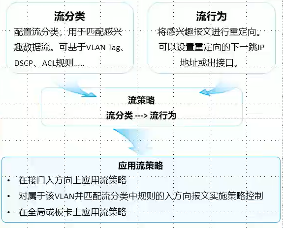
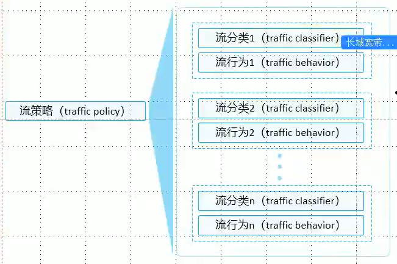
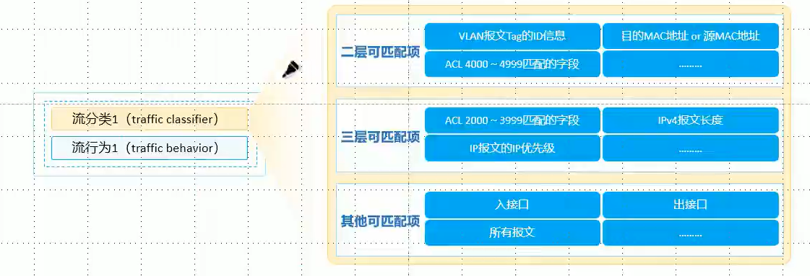
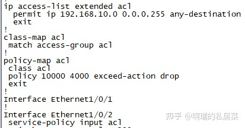
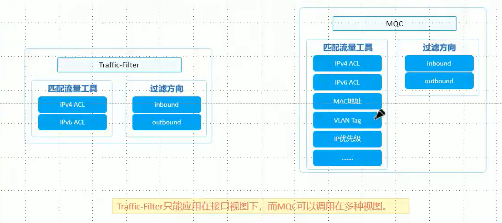
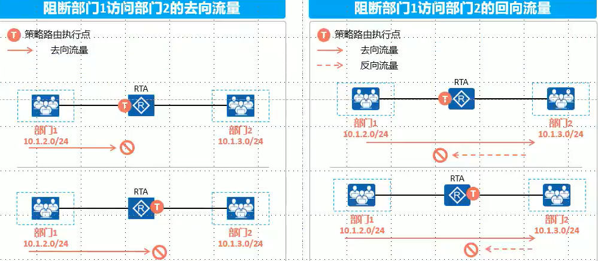

## MQC

　　MQc((Modular Ooslnterface，模块化 Qos 命令行)是指通过将具有某类共同特征的数据流划分为一类，并为同一-类数据流提供相同的服务也可以对不同类的数据流提供不同的服务

​​

　　MQc 包含三个要素:流分类(traffic classifier)、流行为(trafficbehavior)和流策略(trafficpolicy)-
MQC 的流行为支持重定向报文，因此可以使用 MQC 实现 IP 单播策略路由

　　由 3 个模块组成：

* 流分类：使用一定条件定义一部分数据流
* 流行为：数据流的行为，如修改下一跳、增加 QOS 标记等
* 流策略：将流分类与流行为关联

　　在接口或全局调用流策略。

　　相对于 PBR，MQC 更加灵活、自由

​​

　　一个流策略可以绑定多个流分类与流行为

​​

　　修改优先级实验

```vim
// 定义感兴趣流
[Huawei]acl 2000
[Huawei-acl-basic-2000]rule 5 permit source 12.1.1.2 0
// 定义流分类
[Huawei]traffic classifier PC1
[Huawei-classifier-PC1]if-match acl 2000
// 定义流行为
[Huawei]traffic behavior PC1
[Huawei-behavior-PC1]remark dscp cs7
// 定义流策略
[Huawei]traffic policy QOS
[Huawei-trafficpolicy-QOS]classifier PC1 behavior PC1
// 在接口下调用流策略
[Huawei-GigabitEthernet0/0/1]traffic-policy QOS inbound 
```

　　MQC 依据路由表进行转发数据

　　[基于MQC的园区双出口实验]( #20240119002418-5v2urjq)

　　‍

　　**DCN**

　　在端口 eth1/0/4，将网段 192.168.10.0 报文带宽限制为 10M bit/s，突发值设为 5Bit/s,超过该数值报文一律丢弃

​​

### 流量过滤

　　流量过滤工具：

​​

　　简单来讲，traffic Filter 流量过滤匹配的条件较少，而且只能在接口下应用

　　MQC 匹配的条件更多，并且可以应用的位置也更多，因此 MQC 会更加灵活

　　‍

　　使用 trafic-Filter 过滤流量可以灵活地选择部署位置，在流量进入设备或者离开设备的接口上执行过滤动作，双向访问的业务禁止其中一个方向即可实现阻断业务的需求

​​

```vim
[Huawei]in g0/0
 traffic-filter inbound acl 3000   // 在接口的入方向调用acl 3000
```

　　‍

　　MQC 进行流量过滤

```vim
流分类，注意这里的ACL (匹配permit,不匹配deny)
acl number 3000
 rule 5 permit ip source 192.168.1.101 0 destination 13.1.1.3 0
traffic classifier drop
 if-match ac1 3000

流行为(在流行为的deny和permit才是拒绝和放行的意思)
traffic behavior drop
 deny

流策略
traffic policy drop
 classifier drop behavior drop

在三层接口或vlan下调用流策略
interface GigabitEthernet0/0/2
 traffic-policy drop inbound
in vlan 1
 traffic-policy drop oubound
```

### 联动实验

#### [基于MQC的园区双出口实验]( #20240119002418-5v2urjq)

　　‍

　　‍
