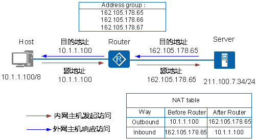
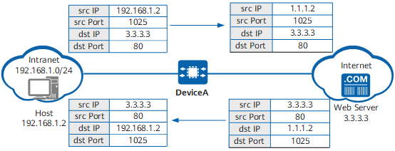
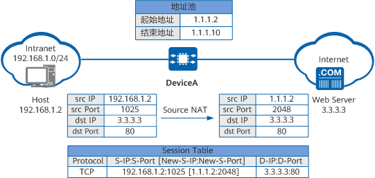
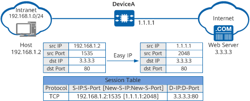
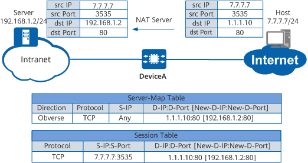
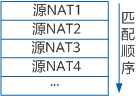
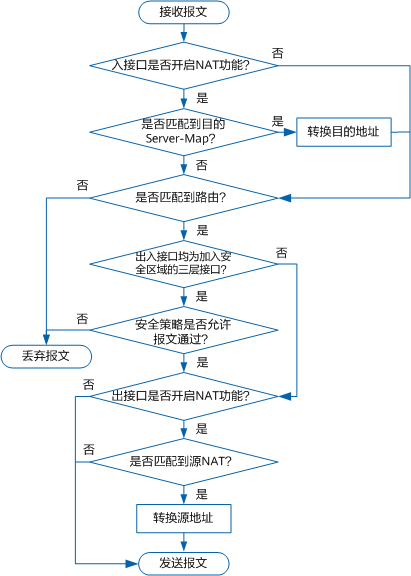

## NAT 地址转换

　　网络地址转换 NAT（Network Address Translation）是将 IP 数据报文头中的 IP 地址转换为另一个 IP 地址的过程。

　　优势：

* 有效避免来自外网的攻击，可以很大程度上提高网络安全性。
* 控制内网主机访问外网，同时也可以控制外网主机访问内网，解决了内网和外网不能互通的问题。

　　NAT 是将 IP 数据报文头中的 IP 地址转换为另一个 IP 地址的过程，主要用于实现内部网络（私有 IP 地址）访问外部网络（公有 IP 地址）的功能。Basic NAT 是实现一对一的 IP 地址转换，而 NAPT 可以实现多个私有 IP 地址映射到同一个公有 IP 地址上。

#### Basic NAT 一对一地址转换

　　一般不会使用

　　Basic NAT 方式属于一对一的地址转换，在这种方式下只转换 IP 地址，而不处理 TCP/UDP 协议的端口号，一个公网 IP 地址不能同时被多个私网用户使用。

​​

　　描述了 Basic NAT 的基本原理，实现过程如下：

1. Router 收到内网侧 Host 发送的访问公网侧 Server 的报文，其源 IP 地址为 10.1.1.100。
2. Router 从地址池中选取一个空闲的公网 IP 地址，建立与内网侧报文源 IP 地址间的 NAT 转换表项（正反向），并依据查找正向 NAT 表项的结果将报文转换后向公网侧发送，其源 IP 地址是 1.1.1.1，目的 IP 地址是 2.2.2.2。
3. Router 收到公网侧的回应报文后，根据其目的 IP 地址查找反向 NAT 表项，并依据查表结果将报文转换后向私网侧发送，其源 IP 地址是 2.2.2.2，目的 IP 地址是 10.1.1.100。

### 源 NAT

　　源 NAT 是指对报文中的源地址进行转换。

　　设备通过源 NAT 技术将私网 IP 地址转换成公网 IP 地址，使私网用户可以利用公网地址访问 Internet

​​

　　当 Host 访问 Web Server 时，设备的处理过程如下：

1. 当私网地址用户访问 Internet 的报文到达设备时，设备将报文的源 IP 地址由私网地址转换为公网地址。
2. 当回程报文返回至设备时，设备再将报文的目的地址由公网地址转换为私网地址。

#### NAPT

　　NAPT 是一种转换时同时转换地址和端口，实现多个私网地址共用一个或多个公网地址的地址转换方式。

　　NAPT 适用于公网地址数量少，需要上网的私网用户数量大的场景。

​​

　　当 Host 访问 Web Server 时，设备的处理过程如下：

1. 设备收到 Host 发送的报文后查找 NAT 策略，发现需要对报文进行地址转换。
2. 设备根据源 IP Hash 算法从 NAT 地址池中选择一个公网 IP 地址，替换报文的源 IP 地址，同时使用新的端口号替换报文的源端口号，并建立会话表，然后将报文发送至 Internet。
3. 设备收到 Web Server 响应 Host 的报文后，通过查找会话表匹配到步骤 [2](http://127.0.0.1:51299/icslite/hdx/pages/HDXAZM08013_02_zh/HDXAZM08013_02_zh/resources/security_nat_cfg_0012.html#ZH-CN_CONCEPT_0000001563996301__step02) 中建立的表项，将报文的目的地址替换为 Host 的 IP 地址，将报文的目的端口号替换为原始的端口号，然后将报文发送至 Intranet。

　　此方式下，由于地址转换的同时还进行端口的转换，可以实现多个私网用户共同使用一个公网 IP 地址上网，设备根据端口区分不同用户，所以可以支持同时上网的用户数量更多。

　　**配置命令**

```vim
[Huawei]nat address-group 1 15.1.1.1 15.1.1.10
// 创建地址池
[Huawei-GigabitEthernet0/0/0]nat outbound 2000 address-group 1
// 在出接口上配置nat，使用acl2000匹配流量，使用nat地址池1
```

#### Easy IP

　　适合公网接口通过拨号方式动态获取公网地址，转换后 IP 地址不固定，无法在 NAT 地址池中配置固定的地址场景。或申请到的静态公网地址仅可用于配置公网接口，无法在 NAT 地址池中配置固定地址段的场景。

　　Easy IP 是一种利用出接口的公网 IP 地址作为 NAT 转换后的地址，同时转换地址和端口的地址转换方式。

　　对于接口 IP 是动态获取的场景，Easy IP 也一样支持。

　　当设备的公网接口通过拨号方式动态获取公网地址时，如果只想使用这一个公网 IP 地址进行地址转换，此时不能在 NAT 地址池中配置固定的地址，因为公网 IP 地址是动态变化的。此时，可以使用 Easy IP 方式，即使出接口上获取的公网 IP 地址发生变化，设备也会按照新的公网 IP 地址来进行地址转换。

​​

　　当 Host 访问 Web Server 时，设备的处理过程如下：

1. 设备收到 Host 发送的报文后查找 NAT 策略，发现需要对报文进行地址转换。
2. 设备使用与 Internet 连接的接口的公网 IP 地址替换报文的源 IP 地址，同时使用新的端口号替换报文的源端口号，并建立会话表，然后将报文发送至 Internet。
3. 设备收到 Web Server 响应 Host 的报文后，通过查找会话表匹配到步骤 [2](http://127.0.0.1:51299/icslite/hdx/pages/HDXAZM08013_02_zh/HDXAZM08013_02_zh/resources/security_nat_cfg_0013.html#ZH-CN_CONCEPT_0000001513156042__step03) 中建立的表项，将报文的目的地址替换为 Host 的 IP 地址，将报文的目的端口号替换为原始的端口号，然后将报文发送至 Intranet。

　　此方式下，由于地址转换的同时还进行端口的转换，可以实现多个私网用户共同使用一个公网 IP 地址上网，设备根据端口区分不同用户，所以可以支持同时上网的用户数量更多。

### 目的 NAT

　　‍

#### NAT Server

　　适用于私网地址与公网地址、私网地址与公网端口、私网端口与公网地址、私网端口与公网端口存在固定映射关系场景。通过配置 **nat server** 命令实现。

　　NAT Server 是一种静态目的地址转换技术。NAT Server 将报文中的公网地址转换为与之对应的私网地址，转换前后的地址存在一种固定的映射关系。

　　在一些场景下，学校或公司经常会对公网用户提供一些可访问的服务。但是网络部署时，这些服务器的地址一般都会配置成私网地址，公网用户无法直接访问私网地址，此时作为出口网关的设备可以通过 NAT Server 技术，将私网服务器地址映射成公网地址供公网用户访问。

​​

　　在设备上配置 NAT Server，确定公网地址和私网地址的映射关系。配置完成后，设备将会自动生成 Server-Map 表项，用于存放公网地址和私网地址的映射关系，该表项将一直存在除非 NAT Server 的配置被删除。

　　当 Host 访问 Server 时，设备的处理过程如下：

1. 设备收到 Internet 上用户访问 1.1.1.10 的报文的首包后，查找并匹配到 Server-Map 表项，将报文的目的 IP 地址转换为 192.168.1.2。
2. 设备建立会话表，然后将报文发送至 Intranet。
3. 设备收到 Server 响应 Host 的报文后，通过查找会话表匹配到 [2](http://127.0.0.1:51299/icslite/hdx/pages/HDXAZM08013_02_zh/HDXAZM08013_02_zh/resources/security_nat_cfg_0031.html#ZH-CN_CONCEPT_0000001513036050__li0476130205017) 中建立的表项，将报文的源地址替换为 1.1.1.10，然后将报文发送至 Internet。
4. 后续 Host 继续发送给 Server 的报文，设备都会直接根据会话表项的记录对其进行转换，而不会再去查找 Server-map 表项。

　　另外，设备还可以通过指定端口、协议、安全区域等参数，是否允许服务器采用公网地址上网，灵活配置 NAT Server 功能，满足不同场景的需求。

### 双向 NAT

　　‍

#### 源 NAT+NAT Server

　　适合源和目的地址同时需要转换，且目的地址转换前后存在固定映射关系的场景。需要分别配置源 NAT 策略和 **nat server** 命令实现。

　　‍

### NAT 策略

　　设备的源 NAT 功能可以通过配置 NAT 策略实现。NAT 策略由转换后的地址（地址池地址或者出接口地址）、匹配条件、动作三部分组成。

* 根据 NAT 转换方式的不同，可以通过地址池或者出接口方式选择转换后的地址。
* 匹配条件包括源地址、目的地址、源安全区域、目的安全区域、出接口、服务、时间段。根据不同的需求配置不同的匹配条件，对匹配上条件的流量进行 NAT 转换。
* 动作包括不同类型的源地址转换。可以对匹配上条件的流量选择进行 NAT 转换或者不进行 NAT 转换。

　　如果创建了多条 NAT 策略，设备会依据 NAT 策略列表中的存储顺序从上到下依次进行匹配。如果流量匹配了某个 NAT 策略，进行 NAT 转换后，将不再进行下一个 NAT 策略的匹配。新增的策略和被修改 NAT 动作的策略都会被调整到 NAT 策略的最后面，NAT 策略的匹配顺序可根据需要进行调整，如图中源 NAT2 可以调整到源 NAT1 前面。

​​

### NAT 处理流程

　　需要在接口下开启 NAT 功能，设备才会对通过该接口的报文进行 NAT 处理。若报文的入接口开启 NAT 功能，则设备会查找目的 NAT 转换的匹配信息，若成功匹配，则会转换该报文的目的地址；若报文的出接口开启 NAT 功能，则设备会查找源 NAT 转换的匹配信息，若成功匹配，则会转换该报文的源地址。

　　设备上的 NAT 处理流程简述如下：

​​

1. 设备收到报文后，若报文的入接口开启了 NAT 功能，则进入步骤 2 处理；否则，进入步骤 3 处理。
2. 查找 NAT Server 生成的 Server-Map 表，如果报文匹配到 Server-Map 表，则根据表项转换报文的目的地址后进入步骤 3 处理；如果没有匹配到 Server-Map 表，则直接进入步骤 3 处理。
3. 根据报文当前的信息查找路由，如果找到路由，则进入步骤 4 处理；如果没有找到路由，则丢弃报文。
4. 如果报文的出入接口均为加入安全区域的三层接口，则该报文需要匹配安全策略，若安全策略允许报文通过，则进入步骤 5 处理；若安全策略不允许报文通过，则丢弃报文。如果报文不需要匹配安全策略，则直接进入步骤 5 处理。
5. 如果报文的出接口开启了 NAT 功能，则进入步骤 6 处理；否则，进入步骤 7 处理。
6. 如果报文符合源 NAT 的匹配条件，则转换报文的源地址，然后进入步骤 7；如果报文不符合源 NAT 的匹配条件，则直接进入步骤 7 处理。
7. 设备发送报文。

　　目的 NAT 会在路由和安全策略之前处理，源 NAT 会在路由和安全策略之后处理。因此，配置路由和安全策略的源地址是 NAT 转换前的源地址，配置路由和安全策略的目的地址是 NAT 转换后目的地址。
