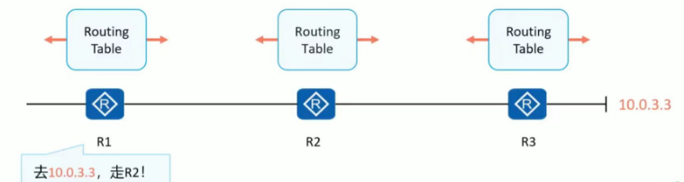
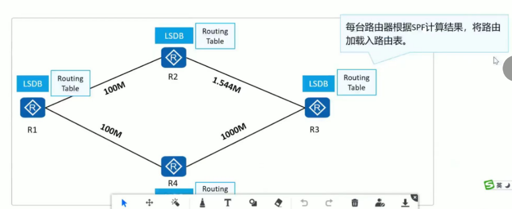
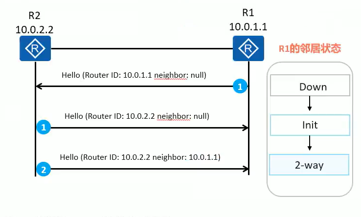

## OSPF

### 基础术语

#### 距离矢量路由协议

　　运行距离矢量路由协议的路由器周期性地泛洪自己的路由表。通过路由的交互，每台路由器都从相邻的路由器学习到路由，并且加载进自己的路由表中，然后再通告给其他相邻路由器

　　对于网络中的所有路由器而言，路由器并不清楚网络的拓扑，只是简单的知道要去往某个目的双段方向在哪里，开销有多大

​​

　　**LSA 泛红**

　　链路状态路由协议通告的的是链路状态而不是路由信息
运行链路状态路由协议的路由器之间首先会建立邻居关系，然后彼此之间开始交互 LSA (Link stateAdvertisement，链路状态通告)。

​​

　　**LSDB 维护**

　　每台路由器都会产生 LSA，路由器将接收到的 LSA 放入自己的 LSDB (Link state DataBase，链路状态数据库)。路由器通过对 LSDB 中所存储的 LSA 进行解析，进而了解全网拓扑。

​​

　　**SPF 计算**

　　每台路由器基于 LSDB，使用 SPF (Shortest Path First，最短路径优先)算法进行计算。每台路由器都计算出一棵以自己为根的、无环的、拥有最短路径的“树”。有了这棵“树”，路由器就已经知道了到达所有网段的优选路径。

​​

　　**路由表生成**

　　路由器将计算出来的优选路径，加载进自己的路由表 (Routing Table)

​​

　　选路原则：域内路由（1、2 类 LSA） >  域间路由（3 类 LSA） > 域外路由 1 > 域外路由 2

　　OSPF(Open Shortest Path First，开放式最短路径优先)具有扩展性强，收敛速度快等特点，作为优秀的内部网关协议被广泛使用

　　针对 IPv4 使用 OSPF version 2
针对 IPv6 使用 OSPF version 3 （思科的 OSPFv3 同时支持 IPv4）

　　OSPF 的优点：

* 基于 SPF 算法，以“累计链路开销”作为选路参考值
* 采用组播形式收发部分协议报文
* 支持区域划分
* 支持报文认证
* 支持对等价路由进行负载分担

　　**路由形成过程：**

1. 建立邻居关系

   ​​
2. 同步 LSDB 链路状态信息

   ​​
3. 进行路径计算

   ​​
4. 生成路由表

   ​​

#### Router ID

　　RouterID 用于在自治系统中唯一标识一省运行 OSPF 的路由器，它是一个 32 位的无符号整数

　　配置完成后，如果需要修改 Router ID 的话，需要重启进程才能上生效

　　​`<Huawei>reset ospf 1 process`​ // 重启 ospf 进程 1

　　RouterID 选举规则如下:

* 手动配置 OSPF 路由器的 RouterID (建议手动配置)
* 如果没有手动配置 Router ID，则路由器使用 Loopback 接口中最大的 IP 地址作为 RouterID
* 如果没有配置 Loopback 接口，则路由器使用物理接口中最大的 IP 地址作为 Router ID

　　**全局 Router ID**：针对所有协议生效。比进程的 Router ID 优先级低

　　​`[Huawei]router id 1.1.1.1`​

#### 度量值

　　OSPF 使用 Cost(开销)作为路由的度量值。每一个激活了 OSPF 的接口都会维护一个接口 Cost 值，缺省的接 100 Mbit/sCost =其中 100Mbit/s 为 OSPF 指定的缺省参考值，该值是可配置的接口带宽

　　OSPF 以“累计 cost”为开销值，也就是流量从源网络到目的网络所经过所有路由器的出接口的 cost 总和。

​​

#### 邻居表

　　OSPF 在传递链路状态信息之前，需先建立 OSPF 邻居关系。
OSPF 的邻居关系通过交互 Hello 报文建立
OSPF 邻居表显示了 OSPF 路由器之间的邻居状态，使用 `display ospf peer` ​查看

#### LSDB

　　LSDB 会保存自己产生的及从邻居收到的 LSA 信息，
本例中 R1 的 LSDB 包含了三条 LSA。
Type 标识 LSA 的类型，AdvRouter 标识发送 LSA 的路由器
用命令行 `display ospf lsdb` ​查看 LSDB 表​

### LSA 类型

* **Type-1 路由器 LSA  Router LSA**

  * 描述路由器所有 OSPF 直连接口的状况和 Cost 值，在接口所属区域内泛红
* **Type-2 网络 LSA Network LSA**

  * 由 DR 产生，描述该 DR 所接入的 MA 网络中与之形成邻接关系的路由器，其中包括 DR 本身。在接口所属区域内泛红
* **Type-3 网络汇总 LSA Network Summary LSA**

  * 由 ABR 产生，描述到达某个区域的目标网段的路由。主要用于区域间路由传递
* **Type-4 ASBR 汇总 LSA ASBR summary LSA**

  * 由 ABR 产生，描述 ASBR，ASBR 汇总 LSA 相当于一条到达 ASBR 的主机路由
* **Type-5 AS 外部 LSA AS External LSA**

  * 由 ASBR 产生，描述本 AS 之外的路由
* **Type-7 NSSA（非完全末梢区域）LSA  NSSA LSA**

  * 由 ASBR 产生，描述本 AS 之外的路由。NSSA 只在产生这个 LSA 的 NSSA 内泛红，不能直接进入骨干区域。NSSA 的 ABR 会将 7 类 LSA 转换成 5 类 LSA 注入到骨干区域

　　1 类和 2 类 LSA 描绘出区域内部的网络拓扑以及网段信息，只能在本区域内泛红。被称为区域内部路由

　　3 类 LSA 描绘区域内的路由信息，并在多个区域间传递，被称为区域间路由

#### LSA 的基本概念

​​

　　在 LSU 报文中，可以携带多种不同类型的 LSA。

　　LSA 是 OSPF 进行路由计算的关键依据。

　　各种 LSA 具有相同的报文头部

　　字段解释：

* LSAge(链路状态老化时间)

  此字段表示 LSA 已经生存的时间，单位是秒。
  3600s 表示撤销路由。老化时间可修改
* Options(可选项)

  每一个 bit 都对应了 OSPF 所支持的某种特性

  * E 允许泛洪 AS-External-LSA 外部路由
  * MC  转发组播报文
  * N/P  处理 7 类 LSA
  * DC  处理按需链路
* Ls Type (链路状态类型)

  指示本 LSA 的类型
* Link stateID(链路状态 ID)
  不同的 LSA，对该字段的定义不同
* Advertising Router (通告路由器)
  产生该 LSA 的路由器的 RouterID
* Ls Sequence Number (链路状态序列号)
  当 LSA 每次有新的实例产生时序列号就会增加。定期或有变化时发送，每次发送序列号都会增加
* Ls checksum(校验和)
  用于保证数据的完整性和准确性
* Length 长度
  是一个包含 LSA 头部在内的 LSA 的总长度值

#### 1 类 LSA   Router LSA

　　type：**Router**

　　每台路由器都会产生

　　描述内容是设备上有几条链路以及链路对端和开销。拓扑信息

　　TransNet 和 p2p 属于拓扑信息，而 stubnet 末节 属于路由信息，可以进行路由计算

　　**Link Type：TransNet 中转网络  代表着 MA 网络连接着 DR，有邻居。**

* Link ID: 1.1.1.2  DR 的 IP 地址
* Data   : 1.1.1.1 本路由器 IP
* Link Type: TransNet/代表着 MA 网络连接着 DR，有邻居。
* Metric : 1  开销值

　　**Link Type：stubnet 末节  代表没有连接邻居**

* Link ID: 1.1.1.2  目标网络
* Data   : 255.255.255.255  掩码
* Link Type: stubnet/代表没有连接邻居
* Metric : 1  开销值

　　**Link Type：P-2-P 点对点网络，此类型中不选举 DR/BDR，可加快网络收敛**

* Link ID: 2.2.2.2 对端 Router ID
* Data   : 12.1.1.1 本端的接口地址
* Link Type: stubnet/代表没有连接邻居
* Metric : 1  开销值

　　**Link Type：VLINK 虚链路**

* Link ID: 2.2.2.2 虚连接中对端的 Router ID。
* Data   : 12.1.1.1 本端的接口地址
* Link Type: vlink
* Metric : 1  开销值

#### 2 类 LSA Network-LSA

　　由 DR 产生，描述本网段连接 DR 的设备数量，以及掩码。P2P 网络中，不会产生 2 类 LSA

　　    Type      : Network  // LSA 类型
    LS ID     : 12.1.1.2  //  产生 LSA 的接口地址
    Adv Rtr   : 2.2.2.2  // 产生 LSA 的设备
    LS age    : 465
    Len       : 32
    Options   : O E
    Seq#      : 80000002
    Checksum  : 0x826a
    Net mask  : 255.255.255.0  // 掩码
       Attached router    3.3.3.3  // 包含的设备
       Attached router    2.2.2.2

#### 3 类 LSA  Network Summary LSA

　　由 ABR 产生，用于传递区域之间的路由。其他区域有多少条路由，ABR 就会产生多少 3 类 LSA

　　Type      : Sum-Net
    LS ID     : 20.1.1.0  // 通告的网络地址。如果是 ASBR Summary LSA，此字段表示 ASBR 的 Router ID
    Adv Rtr   : 2.2.2.2 // 产生该 LSA 的设备（ABR 的地址）
    LS age    : 39
    Len       : 28
    Options   : O E
    Seq#      : 80000001
    Checksum  : 0x59a4
    Net mask  : 255.255.255.0  // 掩码
    MTID   0 Metric: 1 // cost 值

#### 4 类 LSA  ASBR summary LSA

　　由 ABR 产生，告诉其他设备 ASBR 在哪。描述到 ASBR 的路由

　　Type      : Sum-Asbr
    LS ID     : 13.1.1.2  // ASBR
    Adv Rtr   : 12.1.1.1  // ABR
    LS age    : 69
    Len       : 28
    Options   : O E
    Seq#      : 80000001
    Checksum  : 0x57a2
    MTID   0 Metric: 2

#### 5 类 LSA AS External LSA

　　由 ASBR 产生，用于描述外部路由。与 3 类 lSA 类似

　　Type      : External // 类型
    LS ID     : 20.1.1.0  // 网络地址
    Adv Rtr   : 13.1.1.2  // ASBR
    LS age    : 880
    Len       : 36
    Options   : O E
    Seq#      : 80000001
    Checksum  : 0x8eda
    Net mask  : 255.255.255.0 // 掩码
    MTID   0 Metric   : 1
    E Type            : 2   // 外部路由类型
    Forwarding Address: 0.0.0.0  // 转发地址
    Tag               : 1

　　‍

　　type1 ： 内部路由开销 + 外部路由开销

　　type2 ： 只计算外部路由开销

　　‍

　　转发地址：默认为空 0.0.0.0，满足以下要求时，会别填充

1. 接口宣告进了 OSPF
2. 接口的网络类型为 MA 网络
3. 接口不是静默接口

　　如果转发地址为空，则 OSPF 进行路由计算时会根据域内路由计算到 ASBR 的开销，将 ASBR 作为下一跳。

　　如果转发地址不为空，则会将转发地址作为下一跳

#### 7 类 LSA

　　由 NSSA 区域的外部路由产生

　　‍

### OSPF 报文

　　所有设备均监听 224.0.0.5，DR/BDR 同时监听 224.0.0.6。

　　发送更新报文时，DRother 先发送到 224.0.0.6，再由 DR 发送到 224.0.0.5 进行全网泛红

　　OSPF 一共定义了 5 种类型的报文不同类型的 OSPF 报文有相同的头部格式
OSPF 报文直接采用 IP 封装，在报文的 IP 头部中，协议号为 89.

​​

* 1-Hello 报文

  * 发现和维护邻居关系
* 2-DD 报文  Database Description

  * 交互链路状态数据库摘要
* 3-LSP 报文  Link State Request

  * 请求特定的链路状态信息
* 4-LSU 报文  Link State Update

  * 发送详细的链路状态信息
* 5-LSA 报文 Link State Ack

  * 确认 LSA

#### 报文头格式

​​

* Version：OSPF 的版本号
* Type：报文类型 Hello 报文、DD 报文、LSR 报文、LSU 报文、LSAck 报文
* Packet length：报文的总长度，包括报文头在内，单位为字节。
* Router ID：发送该报文的路由器标识。
* Area ID：发送该报文的所属区域。
* Checksum：校验和
* AuType：验证类型 0-不验证 1-简单验证 2-md5 验证
* Authentication：
  鉴定字段，其数值根据验证类型而定：

  *  

    * 当验证类型为 0 时未作定义。
  *  

    * 类型为 1 时此字段为密码信息。
  *  

    * 类型为 2 时此字段包括 Key ID、MD5 验证数据长度和序列号的信息。
  * MD5 验证数据添加在 OSPF 报文后面，不包含在 Authenticaiton 字段中。

#### Hello 报文

​​

* Network Mask：发送 Hello 报文的接口所在网络的掩码。
* HelloInterval：发送 Hello 报文的时间间隔。
* Options：可选项：

  * E：允许 Flood AS-External-LSAs
  * MC：转发 IP 组播报文
  * N/P：处理 Type-7 LSAs
  * DC：处理按需链路
* Rtr Pri：DR 优先级。默认为 1。如果设置为 0，则路由器不能参与 DR 或 BDR 的选举。
* RouterDeadInterval：失效时间。如果在此时间内未收到邻居发来的 Hello 报文，则认为邻居失效。
* Designated Router：DR 的接口地址。
* Backup Designated Router：BDR 的接口地址。
* Neighbor：邻居，以 Router ID 标识。

#### DD 报文

　　双方第一次互发 DD 报文时，报文内不携带摘要信息

​​

* Interface MTU：在不分片的情况下，此接口最大可发出的 IP 报文长度。华为：0。思科：接口的 MTU
* Options：可选项：

  *  

    * E：允许 Flood AS-External-LSAs；
  * MC：转发 IP 组播报文；
  * N/P：处理 Type-7 LSAs；
  * DC：处理按需链路。
* I：当发送连续多个 DD 报文时，如果这是第一个 DD 报文，则置为 1，否则置为 0。
* M (More)：当发送连续多个 DD 报文时，如果这是最后一个 DD 报文，则置为 0。否则置为 1，表示后面还有其他的 DD 报文。
* MS (Master/Slave)：当两台 OSPF 路由器交换 DD 报文时，首先需要确定双方的主从关系，Router ID 大的一方会成为 Master。当值为 1 时表示发送方为 Master。第一次互发 DD 报文时，双方都置位 1
* DD sequence number：DD 报文序列号。主从双方利用序列号来保证 DD 报文传输的可靠性和完整性。从使用主的序列号进行回复

#### LSR 报文

​​​​

* LS type：LSA 的类型号。
* Link State ID：与 LSA 中的 LS Type 和 Advertising Router 一起在路由域中描述一个 LSA
* Advertising Router：产生此 LSA 的路由器的 Router ID。

#### LSU 报文

​​

​​

* Number of LSAs：LSA 的数量。
* LSAs：

  常用的 LSA 共有 5 种，分别为：Router-LSA、Network-LSA、Network-summary-LSA、ASBR-summary-LSA 和 AS-External-LSA。

  所有的 LSA 都有相同的报文头，如[图 2](http://127.0.0.1:51299/icslite/hdx/pages/HDXAZI0130X_14_zh/HDXAZI0130X_14_zh/resources/message/cd_feature_ospf_message_lsu.html#ZH-CN_CONCEPT_0254009212__fig_ospf_lsa_header) 所示。

  不同的 LSA 类型有不同的格式：

  * Type1：Router-LSA，每个路由器都会产生，描述了路由器的链路状态和花费，在所属的区域内传播。详细格式请参见[图 3](http://127.0.0.1:51299/icslite/hdx/pages/HDXAZI0130X_14_zh/HDXAZI0130X_14_zh/resources/message/cd_feature_ospf_message_lsu.html#ZH-CN_CONCEPT_0254009212__fig_ospf_router-lsa)。
  * Type2：Network-LSA，由广播网或 NBMA 网络中的 DR 产生，Network-LSA 中记录了这一网络上所有路由器的 Router ID，描述本网段的链路状态，在所属的区域内传播。详细格式请参见[图 4](http://127.0.0.1:51299/icslite/hdx/pages/HDXAZI0130X_14_zh/HDXAZI0130X_14_zh/resources/message/cd_feature_ospf_message_lsu.html#ZH-CN_CONCEPT_0254009212__fig_ospf_network-lsa)。
  * Type3：Network-summary-LSA，描述区域内所有网段的路由，并通告给其他相关区域。Type3 和 Type4 的 LSA 有相同的格式，它们都是由 ABR 产生。详细格式请参见[图 5](http://127.0.0.1:51299/icslite/hdx/pages/HDXAZI0130X_14_zh/HDXAZI0130X_14_zh/resources/message/cd_feature_ospf_message_lsu.html#ZH-CN_CONCEPT_0254009212__fig_ospf_summary-lsa)。
  * Type4：ASBR-summary-LSA，描述到 ASBR 的路由，通告给除 ASBR 所在区域的其他相关区域。Type3 和 Type4 的 LSA 有相同的格式，它们都是由 ABR 产生。详细格式请参见[图 5](http://127.0.0.1:51299/icslite/hdx/pages/HDXAZI0130X_14_zh/HDXAZI0130X_14_zh/resources/message/cd_feature_ospf_message_lsu.html#ZH-CN_CONCEPT_0254009212__fig_ospf_summary-lsa)。
  * Type5：AS-External-LSA，由 ASBR 产生，描述到 AS 外部的路由，这是五种 LSA 中，唯一一种通告到所有区域（除了 Stub 区域和 NSSA 区域）的 LSA。Type5 的 LSA 可以用来通告缺省路由，此时 Link State ID 和 Network Mask 都设置为 0.0.0.0。详细格式请参见[图 6](http://127.0.0.1:51299/icslite/hdx/pages/HDXAZI0130X_14_zh/HDXAZI0130X_14_zh/resources/message/cd_feature_ospf_message_lsu.html#ZH-CN_CONCEPT_0254009212__fig_ospf_as-external-lsa)。
  * Type7：NSSA-LSA，由 NSSA 的 ASBR 产生，仅在本 NSSA 内传播。格式与 Type5 相同。

#### LSACK 报文

　　‍

### OSPF 区域

　　OSPFArea 用于标识一个 OSPF 的区域
区域是从逻辑上将设备划分为不同的组，每个组用区域号 (Area ID)来标识 OSPF 的区域 ID 是一个 32bit 的非负整数，按点分十进制的形式(与 IPV4 地址的格式一样)呈现，例如 Area0.0.0.1。
为了简便起见，我们也会采用十进制的形式来表示。

　　骨干区域（Area 0）  非骨干区域（非 Area 0）

　　非骨干区域不允许直接相连。

　　同一区域的 OSPF 路由器具有相同的 LSDB，在只有一个区域的情况下，区域内部只有 1 类和 2 类 LSA。每台路由器都会产生 1 类 LSA，描述直连接口信息用于计算拓扑。
在 MA 网络中，DR 会产生 2 类 LSA 来描述该网络中所有的 Router-ID（包括自身）以及网络掩码。

　　**单区域存在的问题：**

　　系列连续的 OSPF 路由器构成的网络称为 OSPF 域(Domain)
OSPF 要求网络内的路由器同步 LSDB，实现对于网络的一致认知.当网络规模越来越大时，LSDB 将变得非常臃肿，设备基于该 LSDB 进行路由计算，其负担也极大地增加了，此外路由器的路由表规模也变大了，这些无疑都将加大路由器的性能损耗。
当网络拓扑发生变更时，这些变更需要被扩散到整个网络，并可能引发整网的路由重计算。
单区域的设计，使得 OSPF 无法部署路由汇总

　　所以需要分多区域。注意：每个区域都要和骨干区域相连接

#### **区域间路由计算**

　　OSPF 区域间路由信息传递是通过 ABR 产生的 Network Summary LSA (3 类 LSA)实现的

　　以 192.168.1.0/24 路由信息为例

* R2 依据 Area 1 内所泛洪的 Router LSA 及 Network LSA 计算得出 192.168.1.0/24 路由 (区域内路由)并将该路由通过 Network Summary LSA 通告到 Area 0。R3 根据该 LSA 可计算出到达 192.168.1.0/24 的区域间路由
* R3 重新生成一份 Network Summary LSA 通告到 Area 2 中，至此所有 OSPF 区域都能学习到去往 192.168.1.0/24 的路由

​​

　　‍

​​

​​

##### 区域间路由防环

　　OSPF 要求所有的非骨干区域必须与 Area0 直接相连，区域间路由需经由 Area0 中转。
区域间的路由传递不能发生在两个非骨千区域之间，这使得 OSPF 的区域架构在逻辑上形成了一个类似星型的拓扑。

​​

* ABR 不会将描述到达某个区域内网段路由的 3 类 LSA 再次注入会该区域
* ABR 从非骨干区域收到的 3 类 LSA 不能参与路由计算

  * ​​
  * R1 和 R2、R3 和 R4 之间的链路中断导致骨干区域不连续
  * R4 将 10.0.2.2/32 的路由以 3 类 LSA 的形式发送到区域 1
  * R5 和 R6 可以根据上述 3 类 LSA 计算出 10.2.2.2/32 路由
  * R3 从非骨干区域收到 3 类 LSA，不进行路由计算。也不会将此 3 类 LSA 发送到其他区域
  * 此时：R1 和 R3 都无法和 10.2.2.2 进行通信

　　**真假 ABR**

　　ABR 从非骨干区域收到的 3 类 LSA 不能参与路由计算。当骨干区域分割时，会导致部分路由器无法正确计算路由。

　　解决方案：vlink

　　真 ABR：骨干区域有邻居 --- 不能进行路由计算

　　假 ABR：骨干区域没有邻居 --- 可以进行路由计算

#### 虚连接 Vlink

　　只可属于区域 0，依靠物理链路承载

　　类似于隧道。主要用于临时连接两端，使骨干区域连续

　　第一种情况，区域 0 ---> 区域 1 --> 区域 0

​​​​

```vim
双端配置，注意：对端为Router ID 不是接口地址
ospf 10
    ar 1
    vlink-peer 3.3.3.3
ospf 10
    ar 1
    vlink-peer 2.2.2.2
```

　　第二种情况： 区域 0 --> 区域 1 --> 区域 2

　　解决方案：在区域 1 双端配置 vlink

　　第三种情况：区域 1 --> 区域 2 --> 区域 3

　　解决方案：在区域 2 两端建立 vlink

#### Stub 末节区域

　　为了减少 LSDB、路由表规模 ABR 不向 Stub 区域内传播它接收到的 AS 外部路由。

　　 同时，为了保证 Stub 区域能够正常到达 AS 外部，Stub 区域的 ABR 将会产生一条缺省路由（使用 3 类 LSA 描述）

　　注意：配置 Vlink 时，使用对端的 Router ID。不要使用接口 ip

　　配置 Stub 时需注意：

* 骨干区域不能被配置为 Stub 区域
* Stub 区域中所有路由器都要上设置成 Stub
* Stub 区域内不能引入和接收 AS 外部路由
* 虚连接不能穿越 Stub 区域

　　Stub 区域内只存在 1、2、3 类 LSA

#### Totally Stub 完全末节区域

　　与 Stub 的区别：3 类 LSA 也不存在，只保留一条 0.0.0.0 默认路由指向 ABR

　　只需要在 ABR 上配置即可

#### NSSA 非纯末节区域

　　不支持外部路由，但是允许本地路由引入。

　　NSSA 区域使用 7 类 LSA，但是，向外部泛红时，ABR 会将 7 类 LSA 转成 5 类 LSA 向外泛红

#### Totally NSSA 完全非纯末节区域

　　在 ABR 上配置

　　区域内不会出现 3 类 LSA。只留一条 0.0.0.0 到 ABR

​​

### 邻居&角色

#### 邻居与邻接

　　OSPF 使用 Hello 报文发现和建立邻居关系
在以太网链路上，缺省时，OSPF 采用组播的形式发送 Hello 报文 (目的地址 224.0.0.5)
OSPF Hello 报文中包含了路由器的 RouterID、邻居列表等信息。

​​

​​

​​

　　‍

　　**邻居状态：**

　　邻居：2-way   邻接：full

* Down

  这是邻居的初始状态，表示没有从邻居收到任何信息
* Init

  在此状态下，路由器已经从邻居收到了 Hello 报文但是自己的 RouterID 不在所收到的 Hello 报文的邻居列表中
* 2-way  （此时成为邻居，连接网络中的 DRother）

  在此状态下，路由器发现自己的 RouterID 存在于收到的 Hello 报文的邻居列表中
* ExStart

  邻居状态变成此状态以后，路由器开始向邻居发送 DD 报文。在此状态下发送的 DD 报文不包含链路状态描述。
* Exchange

  在此状态下，路由器与邻居之间相互发送包含链路状态信息摘要的 DD 报文。
* Loading

  在此状态下，路由器与邻居之间相互发送 LSR 报文 LSU 报文、LSAck 报文。
* Full （此时成为邻接状态，与 DR/BDR）

  路由器已完成了与邻居的 LSDB 同步。

#### DR 与 BDR

　　DR(DesignatedRouter，指定路由器)负责在 MA 网络建立和维护邻接关系并负责 LSA 的同步
DR 与其他所有路由器形成邻接关系并交换链路状态信息，其他路由器之间不直接交换链路状态信息。
为了规避单点故障风险，通过选举 BDR(Backup Designated Router 备份指定路由器)，在 DR 失效时快速接管 DR 的工作。

　　减少重复的 LSA 泛红，降低资源浪费。所有路由器与 DR 和 BDR 邻接，DR other 之间不建立邻接关系。

　　网络中必须存在 DR，可以不存在 BDR

​​

　　**DR 与 BDR 选举：基于接口、非抢占**

* 接口的 DR 优先级大的优先
* 接口的 DR 优先级相同时，Router ID 大的优先

#### ABR

　　区域边界路由器，同时连接骨干区域与非骨干区域

#### ASBR

　　自治系统边界路由器，只要一台 OSPF 设备引入了外部路由，那他就是 ASBR

　　将外部路由以 5 类 LSA 进行泛红

### 其他

　　本章部分内容没有写配置命令，有需求查文档

#### 被动接口 静默接口

　　在 OSPF 中，被动接口不发送和接收 OSPF 报文。抑制不必要的报文

　　但是直连路由仍旧可以发布出去

```vim
Ruijie(config) router ospf 10
Ruijie(config-router) passive-interface vlan10  # 配置VLAN10为被动接口
Ruijie(config) router rip
Ruijie(config-router) passive-interface interface gi 0/1  # 设置Gi0/1为被动接口
```

#### P2MP

　　点对多点，默认 hello/超时时间为 40/120 秒，所以与其他网络类型对接可能会出现问题。

　　不选举 DR/BDR，可以加快收敛速度

#### NBMA 非广播网络

　　需要双方手工指定邻居才可建立关系。默认 hello/超时时间为 40/120 秒

　　存在一个特殊的状态 attempt 尝试建立邻居（发送 Hello，但对方没有回复）

　　因为 hello 报文时间较长，所以 DR 选举速度极慢。所以一般 NBMA 网络中都需要修改计时器，调整 hello 报文发送时间

#### OSPF 报文认证

　　可以在区域或接口上配置。    当两种认证都存在时，优先接口认证

　　如果只在一方配置，那另一方不能正常解析 ospf 报文

　　区域认证：一个区域中的所有路由器在该区域下配置的认证模式和口令必须一致

　　接口认证：相邻路由器直连接口下的认证模式和口令必须一致

　　注意：Vlink 也属于区域 0，因此，如果区域 0 要开启认证，那么 Vlink 也需要配置

#### PRC

　　PRC 的工作原理:当网络上路由发生变化的时候，只对发生变化的路由进行重新计算
PRC 不计算节点路径，而是根据 SPF 算法算出来的最短路径树来更新路由。

​​

　　场景：

* 某网络运行 OSPF，网络收敛后，左图是以 R1 为根的最短路径树。此时 R1 访问节点 R5 时，通过 IR1 下行链路的出接口，R3 上行链路接口的 IP 地址]到达该目的地。
* R5 将环回口 Loopback0 开启 OSPF，即 OSPF 网络内有新增网段

　　PRC 计算：

* R5 全网泛洪新增 LSA。
* R1 收到该 LSA 后会创建新的路由，继承原有访问节点 R5 的路径及下一跳，即最短路径树不变，只在节点 R5 上新增叶子。
* 因此 R1 访问 R5 的 Loopbacko 时，通过[R1 下行链路的出接口，R3 上行链路接口的 IP 地址]到达该目的地。

　　用途：

* OSPF 网络新增网段时，只关注发生变化的路由，加快了路由的计算

#### 智能定时器

　　智能定时器是在进行 SPF 计算和产生 LSA 的时候用到的一种定时器

　　智能定时器既可以对少量的外界突发事件进行快速响应，又可以避免过度的占用 CPU。

　　**控制 LSA 的生成与接收**

* OSPF 通过如下两个规定来避免网络连接或者路由频繁动荡引起的过多占用设备资源的情况。

  * 同一条 LSA 在 1 秒内不能再次生成，即 LSA 的更新时间间隔 5 秒。
  * LSA 被接收的时间间隔为 1 秒
* 在网络相对稳定、对路由收敛时间要求较高的组网环境中，可以通过智能定时器指定 LSA 的更新时间间隔为 0 来取消 LSA 的更新时间间隔，使得拓扑或者路由的变化可以立即通过 LSA 发布到网络中，或者立即被感知到从而加快网络中路由的收敛速度

　　**控制路由计算**

* 当网络发生变化时，OSPF 的 LSDB 会发生改变，需要重新计算最短路径。如果网络频繁变化，由于不断的计算最短路径，会占用大量系统资源，影响设备的效率
* 通过配置智能定时器，设置合理的 SPF 计算的间隔时间可以避免占用过多的路由器内存和带宽资源

#### OSPF IP FRR

　　OSPF IP FRR(Fast reroute，快速重路由)是动态 IP FRR，利用 LFA (Loop-Free Alternates)算法预先计算出备份路径，保存在转发表中，以备在故障时将流量快速切换到备份链路上，保证流量不中断，从而达到流量保护的目的，该功能可将故障恢复时间降低到 50ms 以内。

　　LFA 计算备份链路的基本思路是：

* 以可提供备份链路的邻居为根节点，利用 SPF 算法计算出到目的节点的最短距离。然后，按照不等式计算出开销最小且无环的备份链路.

　　**链路保护：**

​​

　　流量从设备 S 到 D 进行转发，网络开销值满足链路保护公式可保证当主链路故障后，设备 S 将流量切换到备份链路 S 到 N 后可以继续向下游转发，确保流量中断小于 50ms

　　**节点链路双保护：**

​​

　　保证从节点 N->D 的流量不会经过节点 S 和 E，即保证没有环路。

　　节点链路双保护必须同时满足以上两个公式

#### OSPF 与 BFD 联动

　　网络上的链路故障或拓扑变化都会导致设备重新进行路由计算，所以缩短路由协议的收敛时间对于提高网络的性能是非常重要的。

　　OSPF 与 BFD 联动就是将 BFD 和 OSPF 关联起来，一旦与邻居之间的链路出现故障，BFD 对完品以，四二出快速感应能够加快 OSPF 对于网络拓扑变化的响应

​​

　　OSPF 与 BFD 联动工作原理：

* 三台设备(R1、R2、R3)间建立 OSPF 邻居关系。邻居状态到达 Full 时通知 BFD 建立 BFD 会话
* R1 到 R2 间的链路出现故障后，BFD 首先感知到并通知 R1。R1 外理 BFD 会话 Down 事件，重新进行路由计算，新的路径为:R1-R3-R2

​​

　　**锐捷**

```shell
RSR-A(config)#interface gigabitEthernet 2/1
RSR-A(config-GigabitEthernet 2/1)#bfd interval 500 min_rx 500 multiplier 3//配置BFD时间参数，该命令同时启用了接口的BFD功能，因此必须配置；
这里的 500/500/3 为推荐配置，间隔500ms发送一个探测报文，连续3个没收到回应宣告链路失败。
RSR-A(config-GigabitEthernet 2/1)#no bfd echo    //推荐配置为该模式（ctrl模式），默认是bfd echo模式；和友商对接更是推荐ctrl模式，否则可能对接不起来。
RSR-A(config-GigabitEthernet 2/1)#ip ospf bfd        //在对应的接口开启OSPF与BFD联动功能
```

#### 等价路由

　　当路由表中存在到达同一目的地址，且同一路由协议发现的多条路由时，若这几条路由的开销值也相同，那么这些路由就是等价路由，可以实现负载分担。

　　设置进行负载分担的等价路由最大数量：

```vim
[H3C-ospf-10]maximum load-balancing 10
```

　　如果配置了下一跳的权重，那么会以权重的优先级为主

```vim
[HUAWEI-ospf-1] nexthop 10.0.0.3 weight 1
```

#### 缺省路由

　　OSPF 实际组网应用中，区域边界和自治系统边界通常都是由多个路由器组成的多出口几余备份或者负载分担。此时，为了减少路由表的容量，可以配置缺省路由，保证网络的高可用

　　**OSPF 缺省路由通常应用于下面两种情况**

* 由区域边界路由器(ABR)发布 Type3 LSA，用来指导区域内路由器进行区域之间报文的转发
* 由自治系统边界路由器(ASBR)发布 Type5 LSA 或 Type7LSA，用来指导 OSPF 路由域内路由器进行域外报文的转发。

　　OSPF 不支持默认路由引入，OSPF 只可以产生默认路由

　　OSPF 产生默认路由的条件是：

　　    首先本设备的路由表中存在其他协议的默认路由，那么才可以向其他 OSPF 邻居产生默认路由。并且使用 5 类 LSA 进行泛红

　　**H3C**

```vim
[H3C-ospf-10]default-route-advertise // 产生缺省路由
[H3C-ospf-10]default-route-advertise always // 不管路由表中是否存在默认路由，均向其他邻居泛红默认路由
```

　　**锐捷**

```shell
default-information originate always  // 强制下发默认路由
default-information originate // 非强制下发默认路由，只有在本地有默认路由的情况下才会发布type5默认路由，也学习其它设备发布的默认路由
```

#### 对发送的 LSA 进行过滤

　　当两台路由器之间存在多条链路时，可以在某些链路上通过对发送的 LSA 进行过滤，减少不必要的重传，节省带宽资源。

　　通过对 OSPF 接口出方向的 LSA 进行过滤可以不向邻居发送无用的 LSA，从而减少邻居 LSDB 的大小提高网络收敛速度

　　在接口下配置：

​​​​

　　‍

#### 对 ABR 3 类 LSA 进行过滤

　　对区域内出、入方向 ABR Type3 LSA (Summary LSA)设置过滤条件，只有通过过滤的 LSA 才能被发布和接收。
通过对区域内的 LSA 进行过滤可以不向邻居发送无用的 LSA，从而减少 LSDB 的大小，提高网络收敛速度。

​​

#### OSPF Database Overflow

　　OSPF 要求同一个区域中的路由器保存相同的 LSDB。随着网络上路由数量不断增加，一些路由器由于系统资源有限，不能再承载如此多的路由信息，这种状态就被称为数据库超限(OSPFDatabaseOverflow)。

　　对于路由信息不断增加导致路由器系统资源耗尽而失效的问题，可以通过配置 stub 或 NSSA 区域来解决，但 stub 或 NSSA 区域的方案不能解决动态路由增长导致的数据库超限问题。为了解决数据库超限引发的问题，通过设置 LSDB 中 ExternalLSA 的最大条目数，可以动态限制链路数据库的规模.

　　设置 OSPF 的 LSDB 中 ExternalLSA 的最大条目数
​`[Huawei-ospf-1]lsdb-overflow-limit 300`​

　　OSPF 网络中所有路由器都配置相同的上限值，只要路由器上外部路由的数量达到该上限，路由器就进入 Overflow 状态，并同时启动 Overflow 状态定时器(默认超时时间为 5 秒)，路由器在定时器超过 5 秒后自动退出 overflow 状态

* 进入 Overflow 状态时

  * 路由器删除所有自己产生的非缺省外部路由
  * 启动 Overflow 状态定时器
* 处于 overflow 状态中

  * 不产生非缺省外部路中
  * 丢弃新收到的非缺省外部路由，不回复确认报文
  * 当 Overflow 状态定时器超时，你管外部路由数量是否
    仍然超过上限

    * N-ztzioverow 状态
    * Y=> 重启 Overflow 定时器 N
* 退出 Overflow 状态时

  * 删除 Overflow 状态定时器
  * 产生非缺省外部路由
  * 接收新收到的非缺省外部路由，回复确认报文
  * 准备下一次进入 Overflow 状态

#### OSPF 多进程

　　OSPF 支持多进程，在同一台路由器上可以运行多个不同的 OSPF 进程，它们之间互不影响，彼此独立。不同 OSPF 进程之间的路由交互相当于不同路由协议之间的路由交互。

　　路由器的一个接口只能属于某一个 OSPF 进程

　　**应用场景：**

​​

　　OSPF 多进程的一个典型应用就是在 VPN 场景

　　如图，同一台 PE 设备连接了两个不同的 VPN 客户，并目 PE 和 CE 之间均部署 OSPF，因此可以通过在 PE 设备上部署多进程实现 VPN 客户之间的隔离。

　　两个 OSPF 进程之间互访，需要引入路由

　　‍

### 路由汇总

#### 区域间路由汇总

　　路由汇总又被称为路由聚合，即是将一组前缀相同的路由汇聚成一条路由，从而达到减小路由表规模以及优化设备资源利用率的目的，我们把汇聚之前的这组路由称为精细路由或明细路由，把汇聚之后的这条路由称为汇总路由或聚合路由。

　　OSPF 路由汇总的类型

* 在 ABR 执行路由汇总：对区域间的路由执行路由汇总
* 在 ASBR 执行路由汇总：对引入的外部路由执行路由汇总

​​

​​

　　执行路由汇总后，ABR R2 只向 Area o 通告汇总路由 172.16.0.0/21

　　明细路由对应的网段如果产生翻动 (Up/Down)，该拓扑变更造成的影响将被限制在 Area 1 内。

#### 区域外路由汇总

　　在 asbr 上配置

### OSPF 与 BGP 联动

　　当有新的设备加入到网络中，或者设备重启时，可能会出现在 BGP 收敛期间内网络流量丢失的现象这是由于 IGP 收敛速度比 BGP 快而造成的

​​

　　R1、R2、R3 和 R4 运行 OSPF，并建立 IBGP 全互联。其中 R3 是 R2 的备份设备。当网络环境稳定时，R1 访问 10.155/32 的流量路径为:R1-R2-R4-R5

* 当 R2 故障时，流量路径切换到:R1-R3-R4-R5。
* 当 R2 故障恢复后，由于 IGP 收敛速度比 BGP 快，因此 OSPF 先收敛。此时 R1 若要访问 10.1.5.5/32，先查 BGP 路由，下一跳为 R5:再查 IGP 路由，会根据 IGP 路由传递给 R2。
* R2 收到该流量后，会查 BGP 路由。由于 BGP 还未完成收敛发现没有到达 10.1.5.5/32 的路由，则不会转发数据，造成流量丢失。

　　通过使能 OSPF 与 BGP 联动特性，可以解决流量丢失问题

　　使能了 OSPF 与 BGP 联动特性的设备会在设定的联动时间内保持为 Stub 路由器，也就是说，该设备发布的 LSA 中的链路度量值为最大值(65535)，从而告知其它 OSPF 设备不要使用这个路由器来转发数据

​​

　　在 R2 上使能 BGP 联动，这样，在 BGP 收敛完成前，R1 不把流量转发到 R2 上，而是继续使用备份设备 R3 转发流量，直到 R2 上的 BGP 路由完成收敛

　　配置 stub 路由器

　　​`[Huawei-ospf-1] stub-router[on-startup[interval]]`​

* 配置 stub 路由器是一种特殊的路由选路，配置了 stub 路由器的路径不被优选
* 实现方法是将度量值设为最大(65535)，尽量避免数据从此路由器转发。用于保护此路由器链路，通常使用在升级等维护操作的场景

　　‍

### 配置命令

　　华为

```vim
[huawei]ospf 10 router-id 1.1.1.1 //创建ospf进程，本地有效
    area 1    // 进入区域1
        network 192.168.1.0 0.0.0.255  // 宣告网段，使用反掩码
        stub // 配置为stub区域
        stub no-summary  // 配置为Totally Stub 完全末节区域。在ABR上配置，其他路由器配置stub区域即可
        nssa // 配置为nssa区域
        nssa no-summary  // 配置为Totally NSSA 
        abr-summary 192.168.0.0 16  // 在ABR上进行区域内路由汇总，配置路由聚合前，必须执行network命令指定需要聚合的网段。
        authentication-mode simple plain test  // 设置报文加密
    peer 1.1.1.2 // 用于NBMA网络中指定邻居
    import-route direct type 1 cost 100 // 引入直连路由，类型为1。 cost为100.其他路由同理
    asbr-summary 66.1.0.0 16  // 在引入的外部路由上做路由汇总
    asbr-summary 66.1.0.0 16 tag 66  // 给汇总的外部路由打tag
[huawei-g0/0]ospf ena 10 ar 0  // 在接口下开启ospf，优先级高于network。在华三中：ospf 10 ar 0
    ospf timer hello 10 // 修改报文发送 或 修改超时时间
    ospf network-type p2p // 修改网络类型
    ospf dr-priority 150 // 修改dr选举优先级
    silent-interface GigabitEthernet 0/0/0  // 设置静默接口
    ospf authentication-mode simple plain test  // 在接口上配置ospf报文加密


[huawei]display ospf peer // 查看ospf邻居
    display ospf lsdb    // 查看ospf数据库
    display ospf lsdb router 1.1.1.1    // 查看1类LSA详细信息
    display ospf lsdb network 1.1.1.0   // 查看2类LSA详细信息
    ...
    dis ospf interface g0/0/0  // 查看ospf接口信息
    dis ospf peer verbose // 查看详细的OSPF邻居信息
```

　　**锐捷**

```shell
router ospf 20  # 进程号
router-id 11.1.0.1 # router id
redistribute connected metric-type 1 subnets  # 引入直连路由到ospf，类型为1
network 11.1.1.1 0.0.0.3 ar 0  # 宣告网段
pass vlan 10  # 业务vlan内不出现协议报文
area 2 stub  # 区域2为stub区域
area 3 stub no-summary # 区域2为totally stub区域
// 路由汇总，只能在ABR或ASBR上操作
area 2 range 10.4.0.0 255.255.0.0    // 汇总域内路由（area后面加的区域，必须是该路由起源的区域）
summary-address 10.1.0.0 255.255.0.0      // ospf对外部路由做汇总，只能在外部路由重分发进来的ASBR路由器上，对外部路由做汇总。

int gi0/1
ip ospf network point-to-point // 修改网络类型为p2p 加快网络收敛
// ospf与bfd联动
bfd interval 500 min_rx 500 multiplier 3 // 500m间隔，超过3s没收到即为失联
no bfd echo // 切换bfd模式（echo对接异厂商设备时容易出问题）
ip ospf bfd  // ospf与bfd联动
```

### 故障排查

##### 邻接关系正常， 学不到路由

　　检查双方配置，MA 类型和 P2P 类型可以建立邻接，但学不到路由。

##### 路由学习正常，无法建立邻接

　　检查双方配置，P2MP 和 P2P 类型可以学到路由，但无法建立邻接关系。

　　解决：修改 p2mp 的 hello 时间，与 p2p 保持一致。（P2MP 默认的 hello 报文是 30s）
