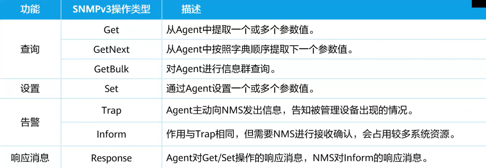
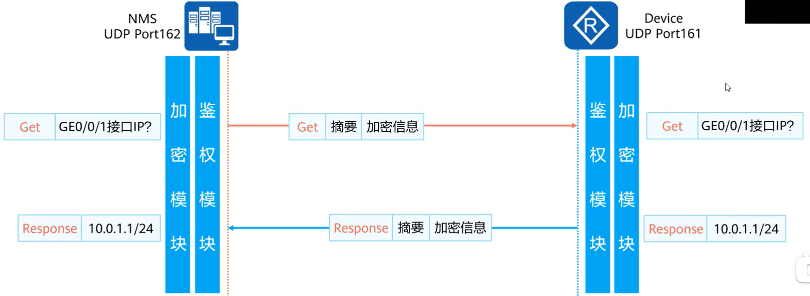
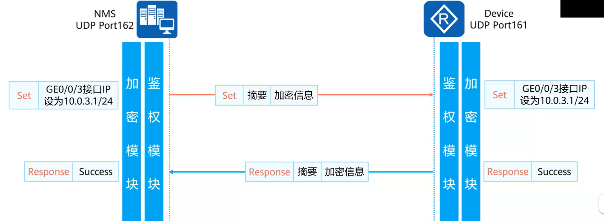

## SNMP

　　SNMP（Simple Network Management Protocol）是广泛应用于 TCP/IP 网络的网络管理标准协议。SNMP 提供了一种通过运行网络管理软件的中心计算机（即网络管理系统）来管理设备的方法。

　　在大型网络中，设备发生故障时，由于设备无法主动上报故障，导致网络管理员无法及时感知、及时定位和排除故障，从而导致网络的维护效率降低，维护工作量大大增加。为了解决这个问题，设备制造商在一些设备中提供网络管理的功能，网络管理员可以通过网管系统远程查询设备的状态，同样设备能够在特定类型的事件发生时向网络管理工作站发出警告。

　　SNMP 就是规定网络管理系统 NMS（Network Management System）和被管理设备之间如何传递管理信息的应用层协议。SNMP 定义了网管管理设备的几种操作，以及设备发生故障时能向网管主动发送告警。

### SNMP 特性

* 访问控制

  * 访问控制主要用来限制管理设备的用户的权限。通过该功能可以限制指定的用户管理设备上的指定节点，从而提升精细化管理。
* 认证加密

  * 认证加密主要是通过对网管和被管理设备传送的报文进行认证和加密，避免数据报文被窃取或篡改，从而提升数据传输的安全性。
* 错误码

  * 错误码用来标识特定的故障现象，有助于管理员快速定位和解决故障，因此错误码越丰富越有利于管理员对设备进行管理。
* Trap 告警

  * Trap 告警是被管理设备主动向网管发送告警。以便管理员能够及时发现设备的异常。
  * 被管理设备发送 Trap 告警后，不需要网管进行接收确认。
* Inform 告警

  * Inform 告警也是被管理设备向网管主动发送告警。
  * 被管理设备发送 Inform 告警后，需要网管进行接收确认。
* GetBulk

  * GetBulk 主要方便管理员进行批量的 Get-Next 操作。网络规模较大时，以节省管理员的工作量，提升管理效率。

　　**各版本支持情况：**

|特性|V1|V2C|V3|
| -----------| ----------------------------------| ----------------------------------| ----------------------------------------|
|访问控制|基于团体名和 MIB View 进行访问控制|基于团体名和 MIB View 进行访问控制|基于用户、用户组和 MIB view 进行访问控制|
|认证加密|基于团体名的认证|基于团体名的认证|((20240117221624-3rrxboc "支持的认证和加密"))<br />|
|错误码|支持 6 个错误码|支持 16 个错误码<br />|支持 16 个错误码<br />|
|Trap 告警|支持|支持|支持|
|Inform 告警|不支持|支持|不支持|
|GetBulk|不支持|支持|支持|

　　SNMP V3 支持的认证加密：

* 认证

  * MD5
  * SHA
* 加密

  * DES56
  * AES128

### 基本操作

​​

### SNMP 交互

#### GET 操作

　　从被管理设备的 Agent 提取一个或多个参数值。下图介绍 NMS 使用 Get 操作获取被管理设备接口 IP 地址的交互过程。

​​

#### SET 操作

　　通过 Agent 设置一个或多个参数值。下图介绍 NMS 使用 Set 操作设定被管理设备特定接口交互过程。

​​

　　‍

　　‍

　　‍

　　‍

　　‍

### SNMP V1

```vim
[H3C]snmp-agent  // 启动snmp服务，配置其他服务会自动开启，所以不配置也行
[H3C]snmp-agent sys-info version v1   // 配置版本为1
使能SNMPv1后，被管理设备将同时支持SNMPv1和SNMPv3，能同时满足使用SNMPv1和SNMPv3的网管对设备进行监控和管理。
[H3C]snmp-agent community read simple snmp1  // 配置读团体名snmp1
[H3C]snmp-agent community write simple snmp1  // 配置写团体名 snmp1
[H3C]snmp-agent target-host trap address udp-domain 1.1.1.1 params securityname 
snmp1 v1 // 配置trap 发送数据到1.1.1.1，团体名snmp1


// 确认是否开启信息中心
[H3C]info-center enable  // 开启信息中心功能
```

### SNMP V2C

　　H3C 新华三

```vim
[H3C]snmp-agent  // 启动snmp服务，配置其他服务会自动开启，所以不配置也行
[H3C]snmp-agent sys-info version v1 // 配置版本为2c
[H3C]snmp-agent community read simple snmp1  // 配置读团体名snmp1
[H3C]snmp-agent community write simple snmp1  // 配置写团体名 snmp1
[H3C]snmp-agent target-host trap address udp-domain 1.1.1.1 params securityname 
 snmp2c v2c // 配置设备发送Trap告警和错误码的目的IP地址。
[H3C]snmp-agent target-host inform address udp-domain 1.1.1.1 params securitynam
e snmp2c v2c  // 配置设备发送Inform告警和错误码的目的IP地址
```

　　锐捷

```vim
Ruijie(config) enable service snmp-agent  # 开启snmp功能
Ruijie(config) snmp-server enable traps  # 使能交换机主动发送Trap消息
Ruijie(config) snmp-server community ruijie rw  # 配置读写消息
Ruijie(config) snmp-server community public ro  # 配置只读消息
Ruijie(config) snmp-server host 172.16.0.254 version 2c ruijie  # 向172.16.0.254发从版本为V2C的trap报文 读写消息
```

　　DCN 神州数码

```shell
Snmp-server enable
打开SNMP代理服务器功能，使用no关闭
Snmp-server community
设置交换机团体字符串
Snmp-server community ro 0 public
添加只读权限团体字符串public
Snmp-server community rw 0 private
添加读写权限团体字符串private
Snmp-server enable traps
交换机若要通过网管软件进行配置管理，必须先要用该命令
Snmp-server host xx.xx.xx.xx v2c xx
交换机SNMP的traps的网络管理站IPv4
Snmp-server engineid
配置当前引擎号
Snmp-server host
设置接收traps消息时使用
Snmp-server securityip
设置允许访问本交换机的MNS管理站的安全ipv4
注：
网管系统ip往往指的是被管理网络
服务器地址往往指的是NMS
```

### SNMP V3

```vim
[H3C]snmp-agent  // 开启snmp服务
[H3C]snmp-agent sys-info version v3  // 设置版本3
[H3C]snmp-agent community read simple snmp1  // 配置读团体名snmp1
[H3C]snmp-agent community write simple snmp1  // 配置写团体名 snmp1
[H3C]snmp-agent local-engineid 1234567890 // 可选。设置引擎号
[H3C]snmp-agent group v3 snmp3  // 添加用户组
[H3C]snmp-agent usm-user v3 user1 snmp3 // 添加用户到用户组
[H3C]snmp-agent target-host trap address udp-domain 1.1.1.1 params securityname 
snmp3 // 配置设备发送告警和错误码的目的IP地址。

```
