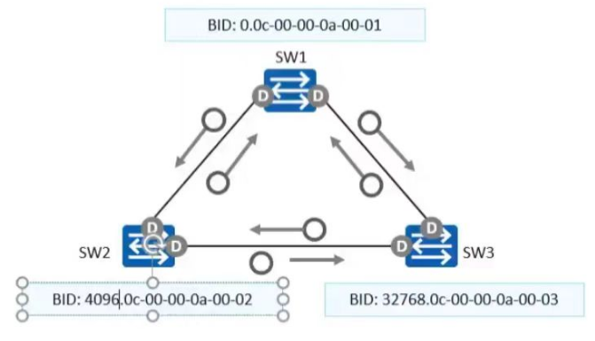
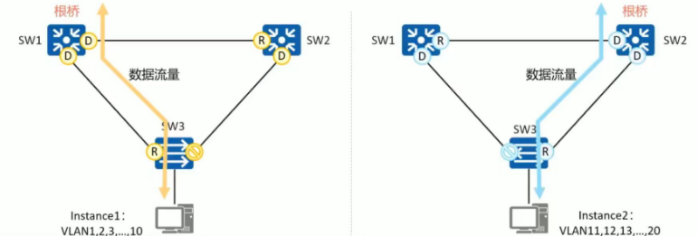
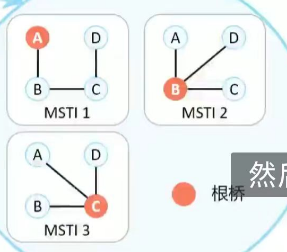

## STP --- 生成树协议

### 协议信息

　　**配置 BPDU**

​​

　　**Protocol identifier：** 协议标识

　　**Version：** 协议版本：STP 为 0，RSTP 为 2，MSTP 为 3

　　**type**： BPDU 类型

　　**Flag**： 标志位

　　**Root ID**： 根桥 ID，由两字节的优先级和 6 字节 MAC 地址构成

　　**Root path cost**： 根路径开销

　　**Bridge ID**： 桥 ID，表示发送 BPDU 的桥的 ID，由 2 字节优先级和 6 字节 MAC 地址构成

　　**Port ID**： 端口 ID，标识发出 BPDU 的端口

　　**Message age**： BPDU 生存时间

　　**Maximum age**： 当前 BPDU 的老化时间，即端口保存 BPDU 的最长时间

　　**Hello time**： 根桥发送 BPDU 的周期

　　**Forward delay**： 表示在拓扑改变后，交换机在发送数据包前维持在监听和学习状态的时间

　　**通知 BPDU**
拓扑变化时使用，通知其他交换机
防止因为拓扑改变导致 MAC 地址表错误

　　‍

　　STP 通过在交换机间传递配置 BPDU 来选举根交换机，以及确定每个交换机接口的角色和状态
在初始化过程中，每个交换机都主动发送配置 BPDU，其中包含桥 ID、路径开销和接口 ID 等参数
在网络拓扑稳定后，只有跟桥周期性发送配置 BPDU，其他交换机在收到上游传来的配置 BPDU 后才发送自己的配置 BPDU

　　**STP 计算**
主要比较 4 个参数进行角色选举：1.根桥 ID、根路径开销、网桥 ID 和接口 ID
1.选举根桥
2.选举根接口
3.选举指定接口
4.阻塞非指定接口

#### **STP 角色与状态**

　　STP 的五种状态

* 1、失效(disabled) - 该端口只是相应网管消息，并且必须先转到阻塞状态。这种状态可以是由于端口的物理状（如端口物理层没有 up）态导致的，也可能是管理员手工讲端口关闭。
* 2、 阻塞(blocking) - 处于这个状态的端口不能够参与转发数据报文，但可以接收 BPDU 配置消息，并交给 CPU 处理。不过不能发送配置 BPDU 消息，也不能进行地址学习。
* 3、监听(listening) - 处于这个状态的端口不参与数据转发，也不进行地址学习，但可以接收并发送 BPDU 配置消息。
* 4、学习(learning) - 处于这个状态的端口不能转发数据，但是开始地址学习，并可以接收、处理和发送 BPDU 配置消息。
* 5、转发(forwarding) -一旦端口进入该状态，就可以转发任何数据，同时也进行地址学习和 BPDU 配置消息的接收、处理和发送。

　　STP 三种角色：

* 根端口
* 指定端口
* 阻塞端口
* 禁用端口

　　**名词解释**

　　桥 ID：由优先级 +MAC 地址组成（优先级默认为 32768，以 4096 的步长进行增加）

　　路径开销：每条线路根据自己的带宽会产生一个开销值，带宽越大，开销越小。

　　根路径开销：本设备到达根桥的开销之和。

　　端口 ID：端口的优先级 + 端口编号

　　**STP 选举流程**

* 选择根桥

  选择桥 ID 最小的交换设备作为根桥
* 选择根端口

  在所有的非根桥上选择一个端口作为根端口

  1. 选择根路径开销最小的（以接口出发）
  2. 选择对端网桥 ID 小的
  3. 选择对端端口 ID 小的
* 选择指定端口

  根桥上的端口都是指定端口，每条线路上一定会有一个指定端口

  1. 选择根路径开销最小的（以设备出发）
  2. 选择网桥 ID 最小的
  3. 选择端口 ID 最小的

### 保护机制

　　‍

#### BPDU 防护

　　正常情况下，边缘端口不会收到 RST BPDU。当边缘端口收到 RST BPDU 时，交换机会将边缘端口转换为非边缘端口，重新进行生成树计算，引起网络震荡。
交换机启动 BPDU 保护后，如果边缘端口收到 RST BPDU 时，端口会 error-down，同时通知网管系统。但是边缘端口属性不变。

　　若用户在本应连接终端的接口上非法连接了一台网络设备，此网络设备可能发送 BPDU 导致网络拓扑变化。在 BPDU 保护（BPDU Guard）功能生效的接口上，若接口收到 BPDU 报文则会启动防护机制，接口进入端口违例（Error-disabled）状态并且被关闭，表示网络中发生了异常。

　　**锐捷**

　　处于端口违例状态的接口可以通过自动或手动方式恢复。**errdisable recovery** [ **interval** *seconds* ]命令用于配置自动恢复端口违例状态的间隔时间，取值范围为 30~86400，单位为秒；**errdisable recovery** 命令用于手动恢复端口违例状态。


```shell
二层接口模式下配置
S1(config-if-GigabitEthernet 0/10)#spanning-tree bpduguard enable  // 开启BPDU防护
S1(config-if-GigabitEthernet 0/10)#errdisable recovery interval 300
// 恢复时间

spanning-tree bpdufilter enable  // 开启后，接口不会收发BPDU
```

#### 根保护

　　对于启动根保护的指定端口，其他端口角色只能保持为指定端口。
启用根保护的指定端口收到优先级更高的 RST BPDU 时，端口进入 Discarding 状态，不再转发报文。经过一段时间后（两倍的 Forward Delay 时间），如果端口一直没有收到优先级更高的 RST BPDU 报文，端口才会恢复到转发状态
​stp root-protection ​// 配置在指定端口

#### 环路保护

　　如果根端口或 Alternate 端口长时间收不到来自上游设备的 BPDU 报文时，向网管发出通知信息（此时，根端口进入 Discarding 状态，角色为指定端口）而 Alternate 端口会一直保持在 Discarding 状态（角色也会切换为指定端口）不转发报文，防止形成环路
知道链路不再堵塞或单向链路故障恢复，端口重新收到 BPDU 报文进行协商，并恢复到链路拥塞或单向链路故障前的角色和状态
​stp loop-protection​ // 在 RP 和 AP 端口配置

#### 防 TC-BPDU 攻击

　　启用防 TC-BPDU 报文攻击后，可配置在单位时间内，交换设备处理 TC PBDU 报文的次数
如果在单位时间内，收到的 TC BPDU 报文数量大于配置的阈值，只处理阈值内的报文
对于超出阈值的报文，会在定时器到期后统一处理一次，避免频繁的删除 MAC 地址表项，保护设备
​stp tc-oritection threshold 1​ // 全局配置，1s 内指处理一次 TC BPDU 报文

### 配置命令

　　 [huawei] stp enable

　　开启生成树协议

### RSTP  ---  快速生成树

　　STP 的改进版本，收敛速度更快，兼容 STP
#### 特性

　　**相对 STP 的优化：**

　　通过端口角色的增补，简化生成树协议的理解及部署
端口状态重新划分
配置 BPDU 格式改变，利用 flag 字段，明确端口角色
配置 BPDU 的处理过程发生改变
支持快速收敛
增加保护功能

　　**端口角色：**

　　根端口 RP
替代端口 AP（根端口失效时，替代根端口）
指定端口 DP
备份端口 BP（指定端口失效时，替代指定端口）

　　**端口状态：**

　　​Discarding ​状态：不转发流量也不学习 MAC 地址
​Learning ​状态：不转发流量，但是学习 MAC 地址
​Forwarding ​状态：既转发用户流量又学习 MAC 地址

　　**报文字段改进：**

　　​Type ​字段：配置 BPDU 类型改为 2。运行 STP 的设备收到 RSTP 的配置 BPDU 会丢弃
​Flag ​字段：使用了原来保留的中间 6 位，这样改变的 BPDU 叫做 RST BPDU。

　　**拓扑改变：**

　　一个非边缘端口迁移到 Forwarding 状态视为拓扑发生改变
检测到拓扑改变后：

　　为交换机所有非边缘指定端口和根端口启动一个 TC while timer，该计时器是 hello time 的 2 倍，在这个时间内，清空状态发生改变端口上学习到的 MAC 地址
同时向外发送 RST BPDU，其中 TC 置位 1。TC while timer 超时后，停止发送。
其他设备收到 RST BPDU 后，清空 MAC 地址表，为自己所有的非边缘指定端口和根端口启动 TC while timer，重复上述过程。
如此，网络中产生 RST BPDU 泛红

　　**PA 机制：**

　　一方发生提议 P，一方发送同意 A
如果协商成功，端口就可以快速进入转发状态
提议由 DP 端口发出，同意 A 由 RP 端口回应

　　DP 端口询问 RP 端口是否有环路（此时，RP 所在交换机会将所有 DP 端口阻塞。DP 端口继续进行 PA 协商）回应 DP，并进入转发状态。DP 收到后也会进入转发状态。


#### 故障处理

##### 非直链故障：

　　STP：
20s 老化时间 +30s 转发延迟

　　RSTP：
一旦收到次优 BPDU，立刻回应最优 BPDU。
并且利用 PA 机制，立刻进入转发状态

#### 拓扑收敛过程

​​

1. 每一台交换机启动 RSTP 后，都认为自己是“根桥”，并且发送 RST BPDU。

   所有端口都为指定端口，处于 Discarding 状态
2. 上游链路的设备互联端口通过 P/A 机制，快速进入转发状态。

   SW2 收到更优的 RST BPDU 后，经过比较认为 SW1 才是当前的根桥，此时 SW2 的端口称为 RP 根端口，而不是 DP 指定端口。停止发送 RST BPDU

   SW1 的端口进入 Discarding 状态，发送 Proposal 位置位的 RST BPDU。SW2 收到后阻塞除边缘端口以外的所有其他端口（此过程被称为 SYNC 同步过程）

   SW2 的各端口同步后，根端口立即进入 Forwarding 状态，并向 SW1 返回 Agreement 位置位的 RST BPDU。SW1 收到该报文后，会让指定端口立即进入 Discarding 状态·
3. 下游链路的设备互联接口会进行新一轮的 P/A 协商

   SW2 的下游端口设置为指定端口，持续发送 Proposal 位置位的 RST BPDU

   SW3 的下游端口收到该 BPDU 后，发现不是本设备收到的最优 BPDU，则忽略该 BPDU，不回复 agreement 位置位的 RST BPDU

   SW2 的下游端口一直收不到 Agreement 位置位的回应报文，等待 2 被的 Forward Delay 后，进入转发状态

#### 配置命令

　　 [huawei] stp mode rstp

　　修改生成树模式为 RSTP

　　 [huawei] stp priority 4096

　　设置交换机的优先级。取值范围：0 - 61440，步长为 4096，缺省情况下，优先级是 32768

　　 [hauwei] stp pathcost-standard dot1d-1998 | dot1t | legacy

　　配置接口路径开销算法，缺省情况下，思科使用 dot1d-1998 算法，华为使用 dot1t 算法。同一网络内，所有交换机的接口路径开销算法需要保持一致

　　 [huawei] stp cost 1500  // 接口模式配置

　　设置当前接口的路径开销值

　　 [huawei] stp priority 4096 // 接口模式配置

　　设置交换机接口的优先级。取值范围：0 - 240，步长 16.缺省情况，优先级是 128

　　 [huawei] stp edged-port enable // 接口模式

　　配置当前接口为边缘接口。缺省情况下，交换机所有端口都是非边缘接口

　　 [huawei] stp tc-protection interval  1000

　　当 STP 网络中的链路状态发生变化时（如链路故障或恢复），STP 会生成拓扑变化通知(BPDU TCA)并发送给相邻的交换机，以通知它们发生了拓扑变化。TC-Protection Interval 用于控制在发送拓扑变化通知之后的一段时间内，临近的交换机不会发送自己的拓扑变化通知。

　　通过抑制拓扑变化通知，可以避免在拓扑变化链路上出现环路，从而减少网络的不稳定性

　　 [huawei] stp tc-protection shreshold 1

　　当启用 TC-Protection 时，STP 交换机会抑制发送自己的拓扑变化通知给相邻交换机一段时间，以减少网络震荡。TC-Protection Threshold 设置了在交换机启用 TC-Protection 之前需要收到的拓扑变化通知的数量。

　　通过将 TC-Protection Threshold 设置为 1，即 `stp tc-protection threshold 1`​，表示在收到任何一个拓扑变化通知之后，即使只有一个 BPDU TCA 被接收到，交换机将立即启用 TC-Protection。

　　 [huawei] stp-bpdu-protection

　　配置交换机边缘接口的 BPDU 保护功能。缺省情况下，交换机的 BPDU 保护功能处于禁用状态。

　　 [huawei] stp root-protection     // 接口模式

　　配置根保护功能。缺省情况下，跟保护功能处于禁用状态。当前端口的角色是指定端口时，根保护功能猜生效。配置了根保护的端口，不可以配置环路保护。

　　 [huawei] stp loop-protection    // 配置环路保护

　　配置交换机根端口或 AP 端口的环路保护功能，缺省情况下，端口的环路保护处于关闭状态。

　　 [huawei] stp bpdu-filter enable

　　在接口下过滤 BPDU。即不发送 BPDU，也不接收 BPDU。相当于没有运行 STP 一样。谨慎配置

　　 [Ruijie]  spanning-tree portfast  // 接口配置模式

　　设置为边缘端口

　　[Ruijie] spanning-tree bpduguard enable       // 接口配置模式

　　配置边缘接口的 BPDU 保护功能

### MSTP

#### 协议信息

　　MSTP 兼容 STP 和 RSTP，既可以快速收敛，又提供了数据转发的多个冗余路径，在数据转发过程中实现 VLAN 数据的负载均衡。

　　MSTP 可以将一个或多个 VLAN 映射到一个 Instance（实例）（一个或多个 VLAN 集合），再基于 Instance 计算生成树。映射到同一个 Instance 的 VLAN 共享同一棵生成树。

​​

　　**网络层次**

　　MSTP 把一个交换网络划分成多个域，每个域内形成多棵生成树，生成树之间彼此独立。

　　MSTP 网络中包含一个或多个 MST 域，每个 MST 域中包含一个或多个生成树实例

#### 术语解释

　　**MSTI --- 多生成树实例**

* 一个 MST 域内可以生成多棵生成树，每棵生成树都被称为一个 MSTI
* MSTI 使用 Instance ID 标识，华为设备取值 0 - 4094

　　**VLAN 映射表**

　　MST 域的属性，描述了 VLAN 和 MSTI 之间的映射关系

　　如图所示的 MST Region 4 的 VLAN 映射有：

* VLAN1 映射到 MSTI 1
* VLAN2 映射到 MSTI 2
* 其他 VLAN 映射到 MSTI 3

​​

　　**CST 公共生成树**

　　连接交换网络内所有 MST 域的一棵生成树

　　如果把每个 MST 域看作是一个节点，CST 就是这些节点通过生成树协议计算生成的一棵树

　　**IST 内部生成树**

　　各 MST 域内的生成树

　　IST 时一个特殊的 MSTI，MSTI 的 instance ID 为 0

　　**CIST 公共和内部生成树**

　　通过生成树协议计算生成的，连接一个交换网络内所有设备的单生成树

　　所有 MST 域的 IST 加上 CST 就构成一棵完整的生成树，即 CIST

　　**SST 单生成树**

　　运行生成树协议的交换设备只能属于一个生成树。如：STP 和 RSTP

　　MST 域中只有一台交换设备，这台设备就构成单生成树

　　**总根、域根和主桥**

* 总根 CIST Root

  是 CIST 的根桥
* 域根 Region Root

  * 分为 IST 域根和 MSTI 域根
  * IST 域根：在 MSTI 域中 IST 生成树距离总根最近的交换设备是 IST 域根
  * MSTI 域根是每个多生成树的树根
* 主桥

  域内距离总根最近的交换设备

  如果总根在 MST 域中，则总根为该域内的主桥

　　**CIST 公共和内部生成树选举过程：**

　　 就是把 MST 域视为一台逻辑交换机，然后进行生成树计算

* 首先选举总根 Root(实例 0 中的根)比较规则

  1. 在多个 MST 区域之间先选举"总根”，通过比较实例 0 的 BID 桥 ID，越小越优(总根本质是实例 0 中的 Root)总根是设备的概念有整个 MST 多区域之间只能有一条总根 Root(可以相象把一个 MST 区域想成一个交换机)
  2. 总根可以是 MST 区域中的任意一台设备
  3. 总根是整个大网中绝对的霸主
* 接着选举域根

  在每一个 MST 区域选举一个 Region Root 域根,非总根区域的域根只能用于区域的域边界设备担任
  Region root 比较规则

  1. 比较区域边界交换机到达总根的 ERPC 外部开销(外部根路径开销)越小越优
  2. 如果 ERPC 外部开销相同，比较域边界交换机在实例 0 的桥 ID
  3. 域根选举出来后，该区域内所有交换机到总根的 ERPC，等于域根到达总根的 ERPC（此时，把一个 MST 域视为一个逻辑交换机）
  4. 如果一个 MST 区域内存在总根，那么这个设备也是这个 MST 域的 Region root 域根
  5. 域根是每个 MST 区域内的霸主
* 选举 CIST 中的端口角色规则

  1. 比较 CIST 的总根 ID，越小越优
  2. 比较 CIST 到达总根的 ERPC（ERPC 指到达总根的距离，ERPC 在跨越 MST 区域时累加）
  3. 比较 CIST 域根的桥 ID，越小越优
  4. 比骄 CIST 到达域根的 IRPC，越小越优（IRPC 指到达域根的距离）
  5. 比较 CIST 中 BPDU 报文发送者的 BID（桥 ID），越小越优
  6. 比较 CIST 中 BPDU 报文发送者的 PID（端口 ID），越小越优
  7. 比较 CIST 中 BPDU 报文接收者的 PID，越小越优

  所有 CIST 的选举基于 instance0 的 BID 来选举

　　**转发原则**

　　本区域中 VLAN 属于哪个实例，就按哪个实例进行转发。数据需要跨区域时，按照 CIST 进行转发，进入其他区域后，按其他区域对应的实例进行转发。

　　**名词解释**

　　域边缘端口：

　　    域边缘端口是指位于 MST 域边缘并连接其他 MST 域或 SST 的端口

　　    域边缘端口在生成树实例上的角色与在 CIST 的角色保持一致（如果不一致，则会导致环路）

　　MASTER 端口：

　　    MP 端口是在 MSTP 中新增的端口，只会出现在域根上

　　    是 MST 域和总根项链的所有路径中的最短路径，是交换设别上连接 MST 域到总额和的端口

　　    是域中报文去往总根的必经之路

#### 配置命令

##### 锐捷单域配置

　　​`spanning-tree mode mst`​ // 修改生成树为 MSTP
​`spanning-tree mst configuration`​  // 进入 MST 设置
​`name KFC`​ // 配置域名为 KFC
​`revision 1`​ // 修订级别 1
​`instance 1 vlan 1-10`​ // 将 vlan 划入实例
​`show spanning-tree mst 1`​ // 查看 mst 实例 1

##### 锐捷 MSTP 简单实现

　　要求 VLAN10、VLAN20 数据流经过 S3 转发，VLAN50、VLAN60 数据流经过 S4 转发，S3、S4 其中一台宕机时均可无缝切换至另一台进行转发。所配置的参数要求如下：

* region-name 为 ruijie；
* revision 版本为 1；
* 实例 1，包含 VLAN10、VLAN20；
* 实例 2，包含 VLAN50,VLAN60；
* S3 作为实例 0、1 中的主根，S4 作为实例 0、1 的从根；
* S4 作为实例 2 中的主根，S3 作为实例 2 的从根；
* 主根优先级为 4096，从根优先级为 8192；

```vim
VSU(config) spanning-tree  # 开启生成树
VSU(config) spanning-tree mst configuration  # 配置MSTP
VSU(config-mst) name ruijie  # 名称为ruijie
VSU(config-mst) revision 1  # 版本为1
VSU(config-mst) instance 1 vlan 10, 20  # 实例1允许通过VLAN10、VLAN20、VLAN30、VLAN40、VLAN100
VSU(config-mst) instance 2 vlan 50, 60  # 实例2允许通过VLAN50、VLAN60
...
S4(config) spanning-tree
S4(config) spanning-tree mst configuration
S4(config-mst) name ruijie 
S4(config-mst) revision 1
S4(config-mst) instance 1 vlan 10, 20
S4(config-mst) instance 2 vlan 50, 60

spanning-tree portfast default 配置所有的接口为边缘端口
spanning-tree portfast       (接口下)配置接口为边缘端口
```

##### 华为单域配置

　　​`stp mode mstp `​ // 修改 stp 模式为 mstp
​`stp region-configuration`​
​`region-name KFC`​  // 配置域名
​`revision-leval 1 `​ // 配置修订级别（版本）
​`instance 1 vlan 1 to 50`​	// 将 vlan 划入实例
​`active region-configuration`​ // 激活配置
在多台设备间，域名、修订级别、VLAN 映射实例配置需保持一致
​`stp instance 1 priority 0`​   // 修改实例的优先级
​`display stp vlan 1`​  // 查看 vlan1 的生成树
​`display stp region-configuration`​  // 查看生成树实例配置
​`display stp brief`​ // 查看生成树端口状态

　　​`stp instance 1 priority 4096`​  // 修改优先级

　　‍

　　‍
