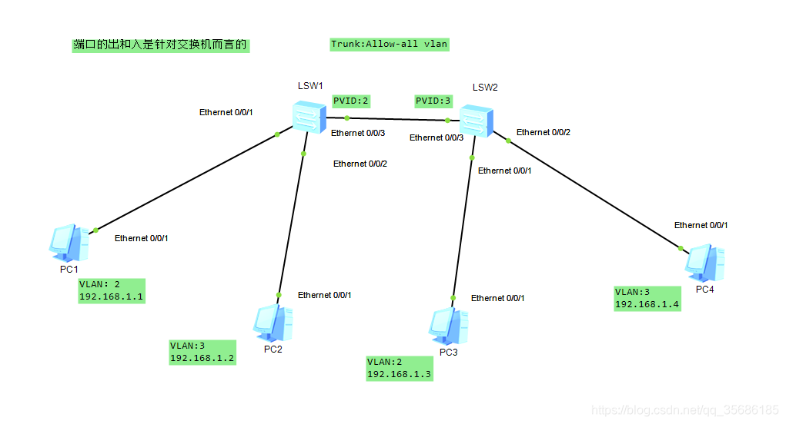
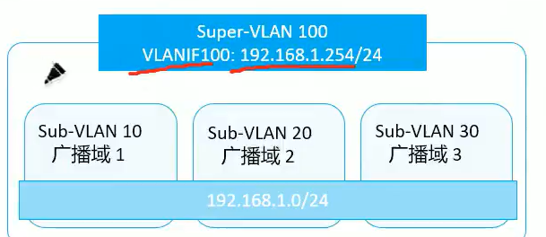
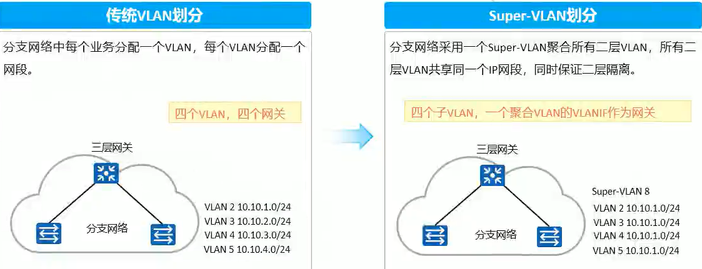
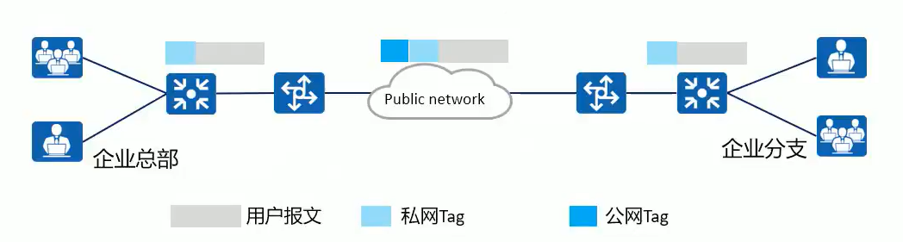
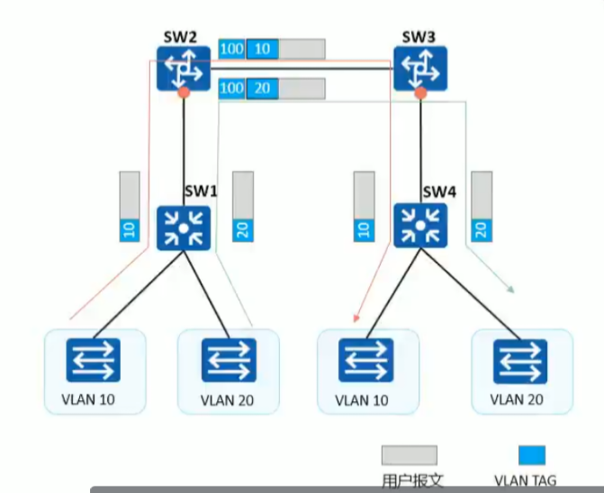
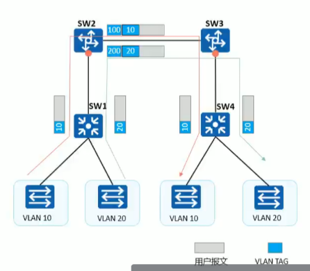
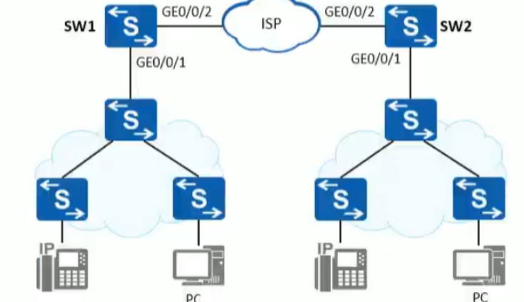

## VLAN 高级特性

### VLAN

* Access 类型端口：只能属于 1 个 VLAN，发出数据时只能根据 PVID 剥离一个 VLAN Tag

  * 入方向：针对没有 tag 的数据包打上 PVID 的 tag
  * 出方向：将 tag 为本接口 PVID 的数据包去掉 tag，发出数据。（只有在与本接口的 PVID 相同的情况下才会去掉 tag 后向此接口转发数据帧，其他情况下则会拒绝此帧通过此接口）
* Trunk 类型端口：可以允许多个 VLAN 通过，但是在发出数据时仍然只能根据 PVID 剥离一个 VLAN Tag

  * 入方向：若收到的数据带 tag，直接转发；反之则打上本接口 PVID
  * 出方向：发出的数据与本接口的 PVID 如果相同就去掉标记，如果不同就直接转发。
* Hybrid 类型端口：可以允许多个 VLAN 通过，至于该端口在 vlan 中是否打 tag 由用户根据具体情况而定。可以自定义的剥离多个 VLAN Tag

　　什么是 PVID？

　　    交换机在收到不带标签的数据帧时，根据 PVID 添加相应的 VLAN Tag
    交换机在发出数据帧时，根据 PVID 剥离相应的 VLAN Tag

　　​`display port vlan active`​  // 查看端口类型及所属 VLAN

　　​`port hybrid pvid vlan 10`​  // 设置 PVID，入方向打 Tag 10

　　​`port hybrid tagged vlan 10`​ // 出方向打 Tag 10

　　​`port hybrid untagger vlan 10`​ // 出方向剥离 Tag 10

```vim
access配置：
interface g0/0/1
    port link-type access
    port default vlan 10
等同于以下配置：
hybrid配置：
interface g0/0/1
    port link-type hybrid
    port hybrid pvid vlan 10   // 入方向打tag
    port htbrid untagged vlan 10  // 出方向剥离tag
```

#### 案例讲解

​​

　　**PC1 ping PC3 --- 不能通信**

　　PC1 发出的数据包在 S1 的 0/0/1 口被打上 tag2 进行转发。

　　在 S1 的 0/0/3 口，数据包 tag 与 PVID 相同，删除 tag 进行转发

　　在 S2 的 0/0/3 口，收到没有 tag 的数据包，打上本接口的 PVID

　　在 S2，因为 PC3 的接口 0/0/1 属于 vlan2，而 PC1 发来的数据包数据 vlan3，所以数据包会在交换机内部丢弃，不会进行转发

　　**PC1 ping PC4 --- 可以通信**

　　PC1 发出的数据包在 S1 的 0/0/1 口被打上 tag2 进行转发。

　　在 S1 的 0/0/3 口，数据包 tag 与 PVID 相同，删除 tag 进行转发

　　在 S2 的 0/0/3 口，收到没有 tag 的数据包，打上本接口的 PVID

　　在 S2，PC4 的接口 0/0/2 的 vlan3 的与 PC1 数据包的 tag 一致，正常转发。

　　此时，PC1 和 PC4 可以正常通信

　　**PC2 ping PC3 --- 不能通信**

　　PC2 发出的数据包在 S1 的 0/0/2 口被打上 vlan3 的 tag

　　在 S1 的 0/0/3 口，数据包与 PVID 不同，直接进行转发。

　　在 S2 的 0/0/3 口，数据携带 tag，直接转发。

　　由于 PC3 的接口 0/0/1 属于 vlan2，所以 PC2 的数据包会在交换机内部被丢弃。

　　<span data-type="text" id="" style="background-color: var(--b3-card-error-background); color: var(--b3-card-error-color);">注意：</span>**PC2 ping PC4 --- 不能通信**

　　PC2 发出的数据包在 S1 的 0/0/2 口被打上 vlan3 的 tag

　　在 S1 的 0/0/3 口，数据包与 PVID 不同，直接进行转发。

　　在 S2 的 0/0/3 口，数据携带 tag，直接转发。

　　PC4 的接口 0/0/2 属于 vlan3，此时 PC1 的数据包可以正常到达 PC4.

　　PC4 此时发出回应数据包，在 S2 的 0/0/2 口被打上 vlan3 的 tag

　　在 S2 的 0/0/3 口，由于数据包的 tag 与 PVID 一致，剥离 tag 进行转发。

　　在 S1 的 0/0/3 口，收到没有 tag 的数据包，打上本接口的 PVID 2。

　　而 PC2 的接口 0/0/2 属于 vlan3，所以

　　PC2 的数据包能到达 PC4，但 PC4 的数据包无法到达 PC2

　　‍

### VLAN 聚合

　　在一般的三层交换机中，通常是采用一个 VLAN 对应一个 VLANIF 接口的方式实现广播域之间的互通，这在某些情况下导致了 IP 地址的浪费。
因为一个 VLAN 对应的子网中，子网号、子网广播地址、子网网关地址不能用作 VLAN 内的主机 IP 地址，且子网中实际接入的主机可能少于可用 IP 地址数量，空闲的 IP 地址也会因不能再被其他 VLAN 使用而被浪费掉.

　　**VLAN 聚合**(VLAN Aggregation，也称 Super-VLAN): 指在个物理网络内，用多个 VLAN (称为 Sub-VLAN)隔离广播域并这些 sub-VLAN 使用同一个 IP 子网和缺省网关进而达到节约将这些 sub-VLAN 聚合成一个逻辑的 VLAN (称为 Super-VLAN)
P 地址资源的目的

* **Super-VLAN**:只建立三层 VLANIF 接口，不包含物理接口，与子网网关对应。与普通 LAN 不同 Super-VLAN 的 VLANIF 接口状态取决于所包含 Sub-VLAN 的物理接口状态。
* **Sub-VLAN**:只包含物理接口，不能建立三层 VLANIF 接口，用于隔离广播域。每个 Sub-VLAN 内的主机与外部的三层通信是靠 Super-VLAN 的三层 VLANIF 接口来实现的。sub-vlan 之间互相通信依赖 super-vlan 的 arp 代理实现
* ​​

　　‍

　　传统 VLAN 方式每一个 VLAN 需要划分不同的 IP 地址网段，在本例中需要耗费 4 个 IP 网段和产生 4 条路由条目;Super-VLAN 方式只需要分配一个 IP 地址网段，下属二层 VLAN 共用同一个 IP 地址网段，共用同一个三层网关，同时 VLAN 之间保持二层隔离。

​​

#### 配置

　　**华为**​

```vim
[Huawei-vlan100]aggregate-vlan // 修改vlan为Super-VLAN
// super-vlan的vlan id与sub-vlan中的vlan id必须不同
[Huawei-vlan100]access-vlan 10 // 将sub-vlan加入super-vlan
[Huawei-Vlanif100]arp-proxy inner-sub-vlan-proxy enable // 开启子vlan间的arp代理，实现子vlan间二层通信
```

　　**锐捷**

```undefined
SwitchA(config)#vlan 2  
SwitchA(config-vlan)#supervlan   设置为super vlab
SwitchA(config-vlan)#subvlan 10,20,30  绑定sub vlan
SwitchA(config)#interface vlan 2
SwitchA(config-if-VLAN 2)ip address 192.168.1.1 设置网关地址，默认开启arp代理
SwitchA(config)#vlan 10  设置sub vlan的地址范围，dhcp环境下无需配置。配置此地址范围后，如果用户的ip不在范围内，则禁止通信
SwitchA(config-vlan)#subvlan-address-range 192.168.1.10 192.168.1.50
```

　　‍

### MUX VLAN -- PVLAN

　　MUXVLAN (Multiplex VLANT 提供了一种通过 VLAN 进行网络资源控制的机制。

　　可以设置互通性 vlan 和隔离型 vlan。

　　MUX VLAN 分为 Principal VLAN (VLAN)和 Subordinate VLAN (从 VLAN)，Subordinate VLAN 又分为 Separate VLAN(隔离型 VLAN)和 Group VLAN (互通型从 VLAN)。

* Principal VLAN 主 VLAN

  可以和所有从 VLAN 进行通信
* Subordinate VLAN 从 VLAN

  * Group VLAN 互通 VLAN

    <span data-type="text" id="" style="background-color: var(--b3-card-success-background); color: var(--b3-card-success-color);">二层端口之间可以互相通信</span>。可以和主 VLAN 通信。
  * Separate VLAN 隔离 VLAN

    <span data-type="text" id="" style="background-color: var(--b3-card-error-background); color: var(--b3-card-error-color);">二层端口之间无法互相通信</span>。可以和主 VLAN 通信

　　注意：从 VLAN 数据帧离开交换机时，VLAN tag 为主 VLAN 的 Tag

##### 华为配置

```vim
[HuaWei-vlan100]mux-vlan  // 配置MUX vlan，即主VALN
[HuaWei-vlan100]suboridinate group 10 // 配置VLAN10为互通VLAN
[HuaWei-vlan100]suboridinate separte 20 // 配置VLAN20为隔离VLAN，一个主VLAN只能配置一个隔离VLAN。互通与隔离VLAN id不能相同
[HuaWei-g0/0]port mux-vlan enable  vlan 10   // 开启接口的MUX VLAN功能
```

##### 锐捷配置

```vim
Ruijie(config) vlan 10
Ruijie(config-vlan) name Primary
Ruijie(config-vlan) private-vlan primary  # 创建主VLAN
Ruijie(config) vlan 11
Ruijie(config-vlan) name Community
Ruijie(config-vlan) private-vlan community  # 创建团体VLAN
Ruijie(config) vlan 12
Ruijie(config-vlan) name Isolated
Ruijie(config-vlan) private-vlan isolated  # 创建隔离VLAN
Ruijie(config) vlan 10
Ruijie(config-vlan) private-vlan association add 11,12  # 进入主VLAN绑定团体VLAN和隔离VLAN

Ruijie(config) interface range gi 0/1 - 8
Ruijie(config-if-range) switchport mode private-vlan host  
Ruijie(config-if-range) switchport private-vlan host-association 10 11  # 将1-8端口加入团体vlan11  
Ruijie(config) interface range gi0/9 - 16
Ruijie(config-if-range) switchport mode private-vlan host
Ruijie(config-if-range) switchport private-vlan host-association 10 12  # 将9-16端口加入隔离vlan12   

Ruijie(config) intterface vlan 10
Ruijie(config-if-vlan) ip address 194.1.10.254 255.255.255.0 # 配置主VLAN的IP地址
Ruijie(config-if-vlan) private-vlan mapping add 11-12 # 映射两个辅vlan到主vlan10
```

### QinQ

　　随着以太网技术在网络中的大量部署，利用 VLAN 对用户进行隔离和标识受到很大限制。因为 IEEE802.1Q 中定义的 VLAN Tag 域只有 12 个比特，仅能表示 4096 个 VLAN，无法满足城域以太网中标识大量用户的需求，于是 QinQ 技术应运而生。

　　QinQ(8021Q in 802.10)技术是一项展 VLAN 空间的技术，通过在 802.10 标签报文的基础上再增加一层 802.10 的 Tag 来达到扩展 VLAN 空间的功能。

　　如下图所示用户报文在公网上传递时携带了两层 Tag，内层是私网 Tag，外层是公网 Tag。

​​

#### 基本 QinQ

​​

　　报文处理：

1. sw1 收到 VLANID 为 10 和 20 的报文，将该报文发给 SW2。
2. sw2 收到该报文后，在该报文原有 Tag 的外侧再添加一层 VLANID 为 100 的外层 Tag。
3. 带着两层 Tag 的用户数据报文在网络中按照正常的二层转发流程进行转发数据
4. sw3 收到 VLAN100 的报文后，剥离报文的外层 Tag (VLANID 为 100)。将报文发送给 Sw4，此时报文只有一层 Tag (VLANID 为 10 或 20)。
5. sw4 收到该报文，根据 VLANID 和目的 MAC 地址进行相应的转发

　　配置：

　　注意：CE 往 PE 发报文时使用 trunk 接口，因为 access 发出数据时会剥离 vlan tag。

```vim
[SW1] interface GigabitEthernet 0/0/1
// 在此接口收到的数据打上vlan100的tag（此时数据有两层tag）
[SW1-GigabitEthernet0/0/1] port link-type dot1g-tunnel
[SW1 -GigabitEthernet0/0/1] port default vlan 100
// 其他接口正常配置即可
```

#### 灵活 QinQ

​​

　　报文处理：

1. sw1 收到 VLANID 为 10 和 20 的报文，将该报文转发给 Sw2
2. sw2 收到 VLANID 为 10 的报文后，添加一层 VLANID 为 100 的外层 Tag;sw2 收到 VLANID 为 20 的报文后，添加一层 VLANID 为 200 的外层 Tag。
3. 带着两层 Tag 的用户数据报文在网络中按照正常的二层转发流程进行转发数据
4. sw3 收到报文后，剥离报文的外层 Tag (VLANID 为 100 或 A200)。将报文发送给 SW4，此时报文只有一层 Tag (VLANID 为 10 或 20)。
5. sw4 收到报文，根据 VLANID 和目的 MAC 地址进行相应的转发

　　‍

　　配置：

​​

```vim
[SW1] interface GigabitEthernet 0/0/1
[SW1-GigabitEthernet0/0/1] port link-type hybrid
// 接收数据时剥离外层vlan tag
[SW1-GigabitEthernet0/0/1] port hybrid untagged vlan 2 3
// 开启QinQ的vlan转换功能，配置此条命令代表使用的为灵活QinQ
[SW1-GigabitEthernet0/0/1] qinq vlan-translation enable
// 发出数据时将vlan100的数据打上外层vlan tag 2
[SW1-GigabitEthernet0/0/1] port vlan-stacking vlan 100 stack-vlan 2
[SW1-GigabitEthernet0/0/1] port vlan-stacking vlan 300 stack-vlan 3
[SW1-GigabitEthernet0/0/1] quit
[SW1] interface GigabitEthernet 0/0/2
[SW1-GigabitEthernet0/0/2] port link-type trunk
[SW1-GigabitEthernet0/0/2] port trunk allow-pass vlan 2 3
[SW1-GigabitEthernet0/0/2] quit
```

### PrivateVlan

　　Private VLAN将一个VLAN的二层广播域划分了多个子域，由一个Private VLAN对组成，主VLAN(Primary VLAN）和辅助VLAN(Second VLAN）;

　　Private VLAN域中的Private VLAN对共享同一个主VLAN，一个Private VLAN域中只有一个主VLAN,包含两种类型的辅助VLAN，分别是隔离VLAN(Isolated VLAN）和群体VLAN(CommunityVLAN）;

　　隔离VLAN，同一个隔离VLAN之内的端口不能互相二层通信。一个Private VLAN域中只能有一个隔离VLAN:

　　群体VLAN，同一个群体VLAN之内的端口可以互相二层通信，群体VLAN之间的端口不能相互通信。一个Private VLAN域中可以有多个群体VLAN;

　　在一个Private VLAN域内通常有三种端口角色，混杂端口（属于主VLAN，Promiscuous Port）、隔离端口（属于隔离VLAN）和群体端口（属于群体VLAN）。

　　为节省 IP 资源，隔离广播风暴、病毒攻击，控制端口二层互访，在 S7 交换机使用 Private Vlan

　　锐捷

```shell
Ruijie(config) vlan 10
Ruijie(config-vlan) name Primary
Ruijie(config-vlan) private-vlan primary  # 创建主VLAN
Ruijie(config) vlan 11
Ruijie(config-vlan) name Community
Ruijie(config-vlan) private-vlan community  # 创建团体VLAN
Ruijie(config) vlan 12
Ruijie(config-vlan) name Isolated
Ruijie(config-vlan) private-vlan isolated  # 创建隔离VLAN
Ruijie(config) vlan 10
Ruijie(config-vlan) private-vlan association add 11,12  # 进入主VLAN绑定团体VLAN和隔离VLAN

Ruijie(config) interface range gi 0/1 - 8
Ruijie(config-if-range) switchport mode private-vlan host  
                          ⬆️ 下联主机时配置为私有vlan得host模式，上联网关时配置为promiscuous 混杂模式
Ruijie(config-if-range) switchport private-vlan host-association 10 11  # 将1-8端口加入团体vlan11  
Ruijie(config) interface range gi0/9 - 16
Ruijie(config-if-range) switchport mode private-vlan host
Ruijie(config-if-range) switchport private-vlan host-association 10 12  # 将9-16端口加入隔离vlan12   

Ruijie(config) intterface vlan 10
Ruijie(config-if-vlan) ip address 194.1.10.254 255.255.255.0 # 配置主VLAN的IP地址
Ruijie(config-if-vlan) private-vlan mapping add 11-12 # 映射两个辅vlan到主vlan10
```
