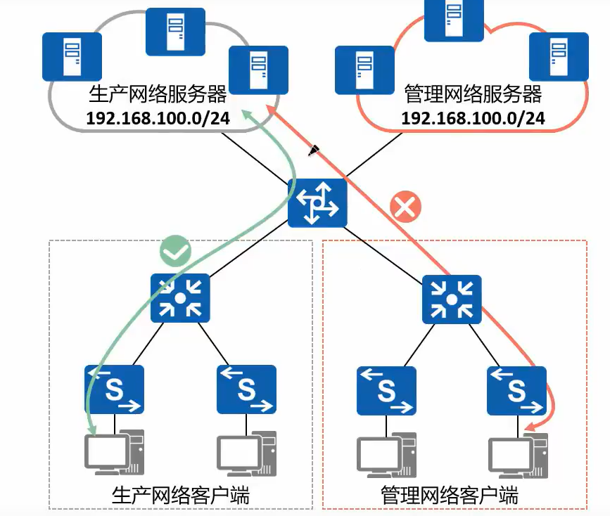
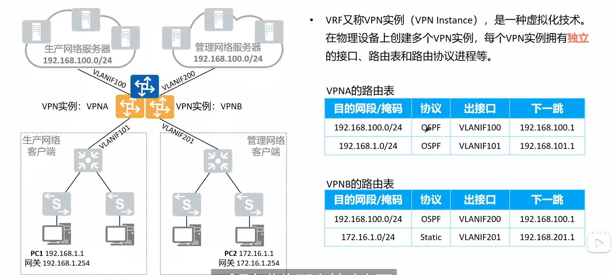
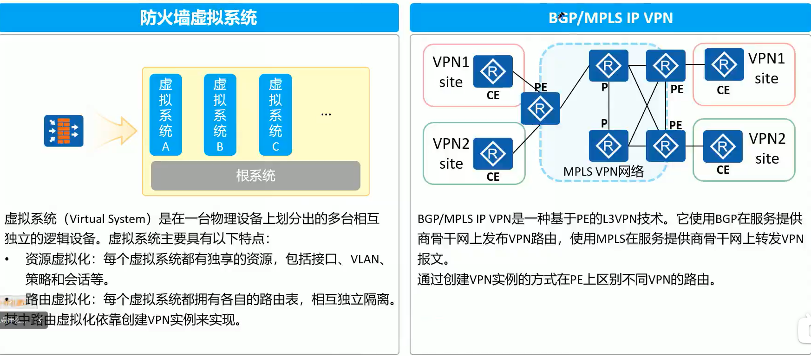

## VRF - VPN 实例

　　在三层上解决业务隔离、IP 地址重复等问题

　　VRE(Virtual Routing and Forwarding，虚拟路由转发)技术通过在一台三层转发设备上创建多张路由表实现数据或业务的隔离，常用于 MPLS VPN、防火墙等一些需要实现隔离的应用场景。

　　**产生背景**

​​

* 某企业网络内有生产和管理两张网络，这两张网络独占接入和汇聚层交换机，共享核心交换机。
* 核心交换机上同时连接了生产网络和管理网络的服务器群，两个网段均为 192.168.100.0/24 网段
* 需求:实现生产和管理网络内部的数据通信，同时隔离两张网络之间的通信

　　**解决方案**

​​

　　VPN 实例，就是虚拟路由器。将一个物理路由器虚拟为多个逻辑服务器，同时每个逻辑服务器都具有互相隔离的路由表等

　　常见应用场景

​​

　　VPN 实例在防火墙的 SYS 中会自动创建和启用

　　在 MPLS VPN 中有重大作用

### 配置命令

```vim
// 创建vrf
[Huawei]ip vpn-instance AAA
// 进入ipv4 地址簇
[Huawei-vpn-instance-AAA]ipv4-family
	route-distinguisher 1:1 // 配置rd值
	vpn-target 100:1 export-extcommunity  // 配置rt值
// 将接口绑定到vrf AAA。绑定后接口的地址配置会消失
[Huawei-GigabitEthernet0/0/0]ip binding vpn-instance AAA
// 运行基于VRF的OSPF
[Huawei]ospf 10 vpn-instance AAA
// 基于VRF的ACL
[Huawei-acl-basic-2000]rule permit source 172.16.1.0 0.0.0.255 vpn-instance AAA
// 基于vrf的静态路由
[Huawei]ip route-static vpn-instance AAA 172.168.1.0 24 192.168.1.1

// 查看路由表等需要携带相关关键词
[Huawei]dis ip routing-table vpn-instance AAA
[Huawei]ping -vpn-instance AAA 192.168.0.1
```

　　‍

　　‍
