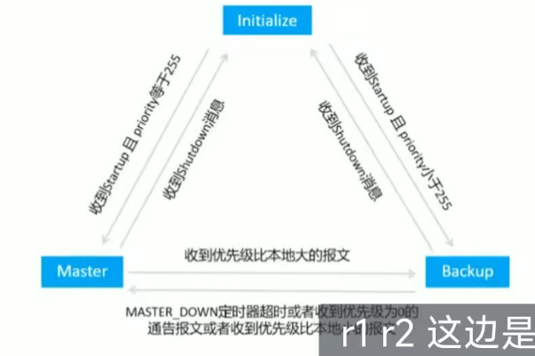

## VRRP

#### 基础概念

　　**Master 路由器**:“Master 路由器”在一个 VRRP 组中承担报文转发任务。在每一个 VRRP 组中，只有 Master 路由器才会响应针对虚拟 IP 地址的 ARP Request。Master 路由器会以一定的时间间隔周期性地发送 VRRP 报文，以便通知同一个 VRRP 组中的 Backup 路由器关于自己的存活情况

　　**Backup 路由器**:也被称为备份路由器。Backup 路由器将会实时侦听 Master 路由器发送出来的 VRRP 报文它随时准备接替 Master 路由器的工作。

　　**Priority**:优先级值是选举 Master 路中器和 Backup 路由器的依据，优先经船过艺围 0-255，值越大越优先，值相等则比较接口 IP 地址大小，大者优先

　　**ADVERINTERVA 定时器**:Master 发送 VRRP 通告报文时间周期，缺省值为 1 秒

　　**MASTER DOWN 定时器**: Backup 设备监听该定时器超时后，会变为 Master 状态 MASTER DOWN 定时器计算公式如下
，MASTER DOWN = (3* ADVER INTERVAL) + Skew time (偏移时间)其中，Skew_Time= (256-Priority) /256
interval 就是间隔

​​

　　**VRRP 抢占模式(Preempt Mode)**  :
**抢占模式(默认激活)** :如果 Backup 路由器激活了抢占功能，那么当它发现 Master 路由器的优先级比自己更低时，它将立即切换至 Master 状态，成为新的 Master 路由器
**非抢占模式**:如果 Backup 路由器没有激活抢占功能，那么即使它发现 Master 路由器的优先级比自己更低，也只能依然保持 Backup 状态，直到 Master 路由器失效

#### <span id="20240101232423-12u1w96" style="display: none;"></span>BFD 与 VRRP 联动

　　通过 VRRP 与 BFD 联动，当 Bcakup 设备通过 BFD 感知到故障后，不再等待 Master_Down_Timer 超时，而会在 BFD 检测周期结束后立即切换 VRRP 状态，此时可以实现毫秒级的主备切换

```vim
vrrp vrid 8 track bfd-session-name 1 reduced 100
// 通过track，将bfd的结果告诉VRRP，如果检测失败，则减少VRRP优先级100
```

### 配置命令

#### 华为

```vim
vrrp vrid 9 virtual-ip 192.168.9.1 // 设置虚拟IP，可以设置多个
vrrp vrid 9 priority 150 // 设置优先级
vrrp vrid 9 preempt-mode disable // 关闭抢占模式
vrrp vrid 9 preempt-mode tiomer delay 10 配置VRRP抢占延迟
```

#### 锐捷

##### VRRP for IPv4&6 综合实现

* 在 S3 和 S4 上配置 VRRP，实现主机的网关冗余。
* S3、S4 各 VRRP 组中高优先级设置为 200，低优先级设置为 110
* S3、S4 启用 IPV6 网络，实现 IPV6 终端可自动从网关处获取地址。
* 在 S3 和 S4 上配置 VRRP for IPv6，实现主机的 IPv6 网关冗余
* VRRP 主备状态与 IPV4 网络一致

　　VRRP for IPv4

```vim
S3(config) interface vlan 10
S3(config-if-VLAN 10) ip address 192.1.10.252 255.255.255.0  # 配置VLAN10的IP地址
S3(config-if-VLAN 10) vrrp 10 ip 192.1.10.254  # 配置VRRP10的IP地址
S3(config-if-VLAN 10) vrrp 10 priority 200  # 设置VRRP10的优先级
...
S3(config) interface vlan 50
S3(config-if-VLAN 50) ip address 192.1.50.252 255.255.255.0
S3(config-if-VLAN 50) vrrp 50 ip 192.1.50.254
S3(config-if-VLAN 50) vrrp 50 priority 110
```

　　VRRP for IPv6

```vim
S3(config) ipv6 unicast-routing  # 开启IPv6单播路由
S3(config) interface vlan 10
S3(config-if-VLAN 10) ipv6 enable  # 开启IPv6
S3(config-if-VLAN 10) ipv6 address 2001:192:10::252/64  # 配置VLAN10的IPv6地址
S3(config-if-VLAN 10) ipv6 address autoconfig  # 无状态自动配置
S3(config-if-VLAN 10) no ipv6 nd suppress-ra  # 开启路由通告功能
S3(config-if-VLAN 10) vrrp 10 ipv6 FE80::  # 配置VRRP6 10的本地链路地址为FE80::
S3(config-if-VLAN 10) vrrp 10 ipv6 2001:192:10::254  # 配置VRRP6 10的IPv6地址为2001:192:10::254
S3(config-if-VLAN 10) vrrp ipv6 10 priority 200  # 配置VRRP6 10的优先级
...
S4(config) interface vlan 60
S4(config-if-VLAN 60) ipv6 enable 
S4(config-if-VLAN 60) ipv6 address 2001:192:60::253/64
S4(config-if-VLAN 60) ipv6 address autoconfig
S4(config-if-VLAN 60) no ipv6 nd suppress-ra
S4(config-if-VLAN 60) vrrp 60 ipv6 FE80::
S4(config-if-VLAN 60) vrrp 60 ipv6 2001:192:60::254
S4(config-if-VLAN 60) vrrp ipv6 60 priority 110
```
