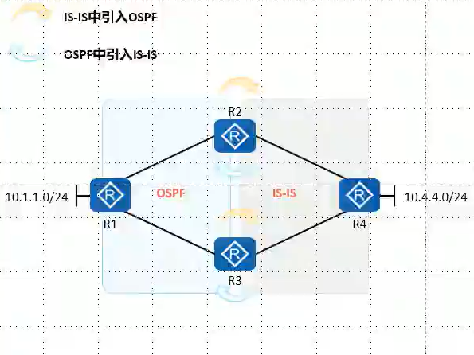

## 双点双向重发布

​​

　　在边界路由器上把两个路由域的路由相互引入，称之为双向路由重发布
两个路由域存在两个边界路由器，并且都执行双向路由重分发此时称为双点双向路由重发布
双点双向路由重发布是一种经典的路由模型，因单点的双向路由重发布缺乏冗余性，一旦单点的边界路由器故障那么两个路由域之间的通信可能就会出现问题，因此在大型网络部署中一般采用双点双向路由重发布
双点双向重路由发布虽然增强了网络的可靠性，但是容易引发次优路径、路由环路等问题

　　‍

　　单点双向路由引入会存在单点故障的问题，因此需要双点双向引入

　　双点双向引入会因为不同路由协议的优先级不同，而带来两个问题：

1. 次优路径

   1. 从低优先级向高优先级引入，不会出现问题。但高优先级向低优先级引入，会出现次优路径
   2. 对于双点双向来讲，哪个点先引入成功，另一个点就会出现次优路径
   3. 解决方案：在做重分布时，修改优先级。（针对需要引入的路由进行修改，不要改全部）
2. 重分布失败

   1. 本质仍然是优先级的问题，导致对应的节点中没有该协议的路由。
   2. 解决方案：修改优先级，再把路由引入
3. 路由回馈

   1. 从一个协议引入到另一个协议的路由，不应该再重新被引入到本协议中。否则就有可能引发路由回馈的问题
   2. 解决方案

      1. 假设：A 协议的打上 tag 100，B 协议的路由打上 tag 200
      2. 在 A 协议引入 B 协议的路由时，定义路由策略。tag 100 的路由不引入。tag 200 的路由正常引入。
      3. 其他方向同理。

　　‍

　　‍

#### 配置

```vim
// 修改优先级，只在本地有意义
[H3C-ospf-10]preference 8   // 修改内部路由优先级8
[H3C-ospf-10]preference ase 160  // 修改外部路由优先级160

// 定义策略，对于tag 123的路由 修改优先级100
route-policy 123 permit node 10
 if-match tag 123
 apply preference 100
[H3C-ospf-10]preference route-policy 123  // 对内部路由调用策略
[H3C-ospf-10]preference ase route-policy 123  // 对外部路由调用策略


```

```vim
// 思科 锐捷配置，只描述与华为的差异点，没有完整配置
Ruijie(config-route-map)#set distance 14  // 在策略里修改优先级（管理距离）
```

### 联动实验

#### [双点双向重分发]( #20240119001707-xjj7fi0)
