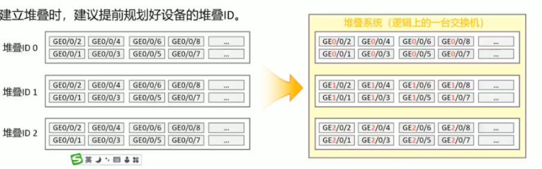
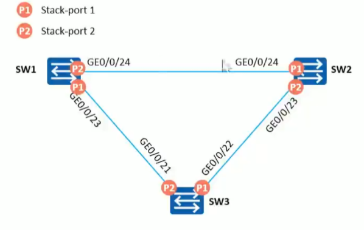
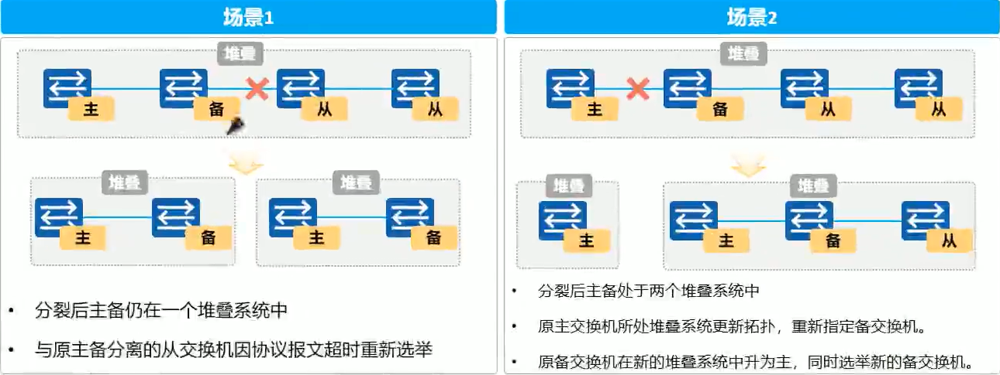
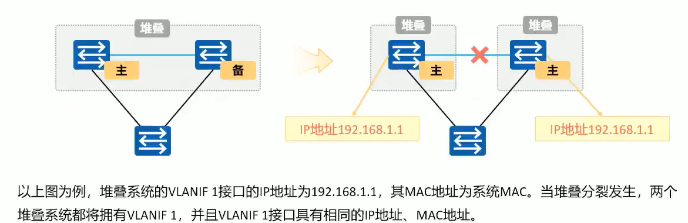
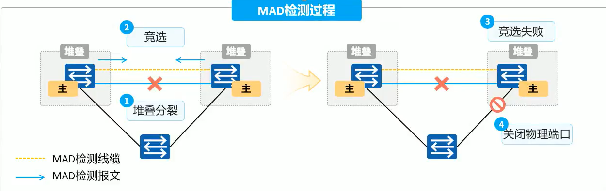
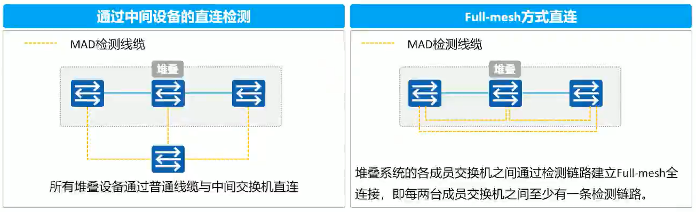
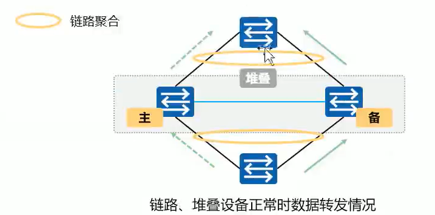
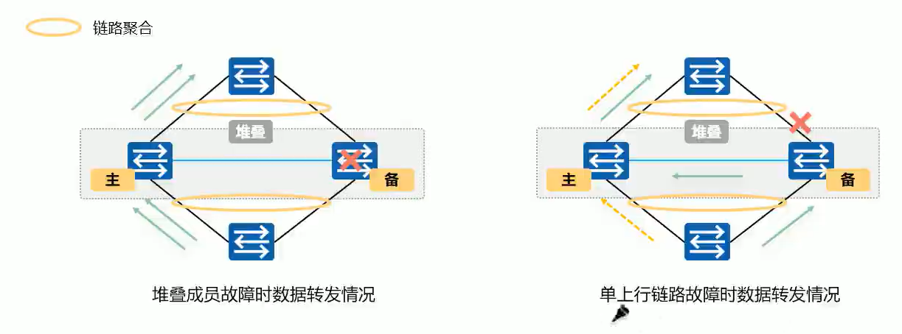
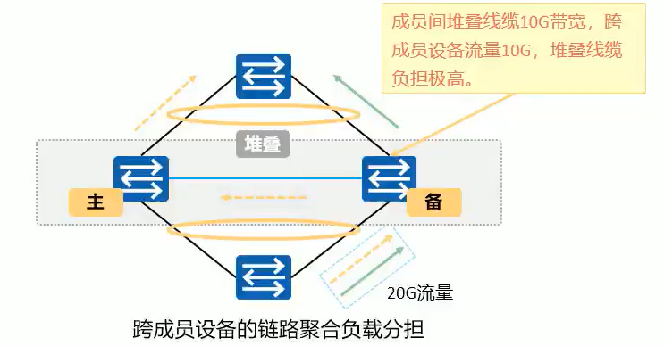

## 堆叠&虚拟化

　　各厂商叫法不同：思科 VSS 锐捷 VSU 华为 Stack 华三 IRF

　　虚拟化为一台设备进行管理，从而实现高可靠性。当任意交换机故障时，都能实现设备、链路切换，保护客户业务稳定运行

　　传统的园区网高可靠性技术出现故障时切换时间很难做到毫秒级别、实现可靠性的方案通常为一主一备，存在着严重的资源浪费。同时随着网络设备的越来越多，管理将会变资源利用率高、易于扩展的交换网络，引入了交换得越加复杂。为构建可靠、易管理、机堆叠、集群技术。

　　堆叠角色：

* **主交换机 Master**：负责管理整个堆叠，堆叠系统中只有一台主交换机
* **备交换机 Standby**：被交换机是主交换机的备份。堆叠系统中只有一台主交换机，当主交换机故障时，备交换机接替主交换机的所有业务
* **从交换机**：从交换机用于业务转发，堆叠系统中可以有多台从交换机。从交换机数量越多，堆叠系统的转发带宽越大。除主从交换机 (slave)交换机和备交换机外，堆叠中其他所有的成员交换机都是从交换机。当备交换机不可用时，从交换机承担备交换机的角色

　　**堆叠优先级**:堆叠优先级是成员交换机的一个属性，主要用于角色选举过程中确定成员交换机的角色，优先级值越大表示优先级越高，优先级越高当选为主交换机的可能性越大。

　　**堆叠 ID**

　　堆叠 ID，即成员交换机的槽位号 (Slot D)，用来标识和管理成员交换机，堆叠中所有成员交换机的堆叠 ID 都是唯一的。

　　设备堆叠 ID 缺省为 0。堆叠时由堆叠主交换机对设备的堆叠 ID 进行管理，当堆叠系统有新成员加入时，如果新成员与已有成员堆叠 ID 冲突，则堆叠主交换机从 0~最大的堆叠 ID 进行遍历，找到第一个空闲的 ID 分配给该新成员

　　在建立堆香时，建议提前规划好设备的堆叠 ID

​​

　　**逻辑接口**

　　堆叠逻辑接口: 交换机之间用于建立堆叠的逻接口，每台交换机支持两个逻辑堆叠端口，分别为 stack-portn/1 和 stack-port n/2，其中 n 为成员交换机的堆叠 ID。

　　一个逻辑堆叠端口可以绑定多个物理成员端口，用来提高堆叠的可靠性和堆叠带宽

　　堆叠成员设备之间，本端设备的逻辑堆叠端口 stack-port n/1 必须与对端设备的逻辑堆叠端口 stack-port m/2 连接。**交叉连接**

​​

　　**堆叠过程**

* 物理连接

  选择适当的连接方式和连接拓扑，组建堆叠网络
* 主交换机选举

  成员交换机之间相互发送堆叠竞争报文，并根据选举原则，选出堆叠系统主交换机。

  * 运行状态比较，已经运行的交换机比处于启动状态的交换机优先竞争为主交换机堆叠主交换机选举超时时间为 20S，堆叠成员交换机上电或重启时，由于不同成员交换机所需的启动时间可能差异比较大，因此不是所有成员交换机都有机会参与主交换机的第一次选举
  * 堆叠优先级高的交换机优先竞争为主交换机
  * 堆叠优先级相同时，MAC 地址小的交换机优先竞争为主交换机
* 拓扑收集和备交换机选举

  拓扑收集和备交换机选举
  主交换机收集所有成员交换机的拓扑信息，向成员交换机分配堆叠 ID，之后选出堆叠系统备交换机。

  主交换机选举完成后，主交换机会收集所有成员交换机的拓扑信息，并向所有成员交换机分配堆叠 ID。之后进行备交换机的选举，作为主交换机的备份交换机。除主交换机外最先完成设备启动的交换机优先被选为备份交换机。当除主交换机外其它交换机同时完成启动时，备交换机的选举规则如下(依次从第一条开始判断，直至找到最优的交换机才停止比较)

  * 堆叠优先级最高的交换机成为备交换机
  * 堆叠优先级相同时，MAC 地址最小的成为备交换机
* 软件和配置同步

  主交换机将堆叠系统的拓扑信息同步给所有成员交换机，成员交换机同步主交换机的系统软件和配置文件，之后进入稳定运行状态。

  堆叠具有自动加载系统软件的功能，待组成堆叠的成员交换机不需要具有相同软件版本，只需要版本间兼容即可。
  当备交换机或从交换机与主交换机的软件版本不一致时，备交换机或从交换机会自动从主交换机下载系统软件，然后使用新系统软件重启，并重新加入堆叠。

  堆叠具有配置文件同步机制，备交换机或从交换机会将主交换机的配置文件同步到本设备并执行，以保证堆叠中的多台设备能够像一台设备一样在网络中工作，并且在主交换机出现故障之后，其余交换机仍能够正常执行各项功能。

　　**堆叠成员加入/退出**

　　堆叠成员加入是指向已经稳定运行的堆叠系统添加一台新的交换机:

* 将未上电的交换机连线加入堆叠之后再上电启动，新加入的交换机会选举为从交换机，堆叠系统中原有主备从角色不变
* 角色选举结束后，主交换机更新堆叠拓扑信息，同步到其他成员交换机上，并向新加入的交换机分配堆叠 ID(新加入的交换机没有配置堆叠 ID 或配置的堆叠 ID 与原堆叠系统的冲突时)
* 新加入的交换机更新堆叠 ID，并同步主交换机的配置文件和系统软件，之后进入稳定运行状态

　　堆叠成员退出是指成员交换机从堆叠系统中离开。根据退出成员交换机角色的不同，对堆叠系统的影响也有所不同

* 当主交换机退出，备份交换机升级为主交换机，重新计算堆叠拓扑并同步到其他成员交换机，指定新的备交换机，之后进入稳定运行状态
* 当备交换机退出，主交换机重新指定备交换机，重新计算堆叠拓扑并同步到其他成员交换机，之后进入稳定运行状态
* 当从交换机退出，主交换机重新计算堆叠拓扑并同步到其他成员交换机，之后进入稳定运行状态

　　**堆叠分裂**

　　堆叠分裂是指稳定运行的堆叠系统中带电移出部分成员交换机，或者堆叠线缆多点故障导致一个堆叠系统变成多个堆叠系统

​​

　　由于堆叠系统中所有成员交换机都使用同一个 IP 地址(VLANIF 接口地址)和 MAC 地址 (堆叠系统 MAC)个叠系统分裂后，可能产生多个具有相同 IP 地址和 MAC 地址的堆叠系统，从而引起网络故障，为此必须进行 IP 地址和 MAC 地址的冲突检查

​​

　　**MAD 检测**

　　多主检测 MAD(Multi-Active Detection):一种检测和处理堆叠分裂的协议，链路故障导致堆叠系统分裂后 MAD 可以实现堆叠分裂的检测工冲突处理和故障恢复，降低堆叠分裂对业务的影响

　　MAD 检测方式有两种:直连检测方式和代理检测方式。在同一个堆叠系统中，两种检测方式互斥，不可以同时配置。

​​

* 直连检测

  直连检测方式是指堆叠成员交换机间通过普通线缆直连的专用链路进行多主检测。在直连检测方式中，堆叠系统正常运行时，不发送 MAD 报文，堆叠系统分裂后，分裂后的两台交换机以 1 秒为周期通过检测链路发送 MAD 报文进行多主冲突处理。

  ​​
* 代理检测

　　**MAD 冲突处理：**

　　堆叠分裂后，MAD 冲突处理机制使用 MAD 报文进行 MAD 竞争，竞争结果为堆叠系统处于 Detect 状态或者 Recovery 状态:

* Detect:竞争成功，堆叠系统将处于正常工作状态
* Recovery: 竞争失败，堆叠系统将状态处于禁用状态，关闭除手动配置的保留端口以外的其它所有物理端

　　MAD 竞选规则：

　　与主交换机竞选规则类似

* 先比较启动时间，启动完成时间早的堆叠系统成为 Detect 状态。启动完成时间差在 20 秒内则认为堆叠的启动完成时间相同。
* 启动完成时间相同时，比较堆叠中主交换机的优先级，优先级高的堆叠系统成为 Detect 状态
* 优先级相同时，比较堆叠系统的 MAC，MAC 小的堆叠系统成为 Detect 状态

　　主备倒换：

　　手工指定主交换机

　　如果堆叠系统当前的主交换机不是用户期望的，此时可以通过配置主备倒换实现将堆叠备交换机升为堆叠主交换机。
除了用户通过命令执行的主备倒换之外，主交换机故障重启也会引起主备倒换

　　**MAD 检测方式**：

* LACP MAD 常用：

  * 优势：检测速度快，利用现有聚合组网即可实现，无需占用额外接口，利用聚合链路同时传输普通业务报文和 MAD 检测报文（扩展 LACP 报文）
  * 限制：组网中需要使用 H3C 设备作为中间设备，每个成员设备都需要连接到中间设备
* BFD MAD 常用：

  * 优势：检测速度较快，组网形式灵活，对其它设备没有要求
  * 限制：当堆叠设备大于两台时，组网中需要使用中间设备，每个成员设备都需要连接到中间设备，这些 BFD 链路专用于 MAD 检测
* ARP MAD：

  * 优势：非聚合的 IPv4 组网环境，和 MSTP 配合使用，无需占用额外端口。在使用中间设备的组网中对中间设备没有要求
  * 限制：检测速度慢于前两种。
* ND MAD

  * 优势：非聚合的 IPv6 组网环境，和 MSTP 配合使用，无需占用额外端口。在使用中间设备的组网中对中间设备没有要求
  * 限制：检测速度慢于前两种

　　注意：由于 LACP MAD 和 BFD MAD、ARP MAD、ND MAD 冲突处理的原则不同，请不要同时配置。BFD MAD、ARP MAD、ND MAD 这三种方式独立工作，彼此之间互不干扰，可以同时配置。

#### M-LAG 跨设备链路聚合

　　堆叠支持跨设备链路聚合技术，堆叠后成为逻辑上的一台交换机，支持将 Eth-Trunk 的成员接口分布在不同的成员交换机上。

　　当其中一条聚合链路故障或堆叠中某台成员交换机故障时，Eth-Trunk 接口通过堆叠线缆将流量重新分布到其也聚合链路上，实现了链路间和设备间的备份，保证了数据流量的可靠传输

​​

　　‍

​​

　　‍

　　**流量本地优先转发**

　　链路聚合的负载分担算法根据流量特征将报文分担在不同的成员链路上，对于跨设备链路聚合极有可能出现报文的出接口和入接口不在同一台成员设备之上的情况，此时堆叠成员之间将会通过堆叠线缆转发流量，这增加了堆线缆的流量负担，同时也降低了转发效率

​​

　　‍

　　‍

　　‍

　　‍

　　‍

### 配置命令

#### 锐捷

##### 设备堆叠 +BFD 综合实现

* 规划 S1 和 S2 间的 Te0/25-26 端口作为 VSL 链路，使用 VSU 技术实现网络设备虚拟化。其中 S1 为主，S2 为备；
* 规划 S1 和 S2 间的 Gi0/17 端口作为双主机检测链路，配置基于 BFD 的双主机检测，当 VSL 的所有物理链路都异常断开时，备机会切换成主机，从而保障网络正常；
* 主设备：Domain id ：1，switch id：1，priority 200，description：S2910-24GT4XS-E-1
* 备设备：Domain id ：1，switch id：2，priority 150，description：S2910-24GT4XS-E-2

```vim
S1(config) switch virtual domain 1  
S1(config) switch 1  # 设置switch ID
S1(config-vs-domain) switch 1 priority 200  # 将switch1的优先级设置为200
S1(config-vs-domain) switch 1 description S2910-24GT4XS-E-1  # switch1的描述为S2910-24GT4XS-E-1
S1(config) vsl-port  # 进入VSL配置视图
S1(config-vsl-ap-1) port-member interface TengigabitEthernet 0/25  # 配置Te0/25为VSL链路
S1(config-vsl-ap-1) port-member interface TengigabitEthernet 0/26  # 配置Te0/26为VSL链路
S1(config-vsl-ap-1) end
S1# write memory
S1# switch convert mode virtual  --  更改为VSU模式
Are you sure to convert switch to virtual mode[yes/no]：yes   
Do you want to recover config file from backup file in virtual mode (press 'ctrl + c' to cancel) [yes/no]：no
# no 

S2(config) switch virtual domain 1  
S2(config) switch 2
S2(config-vs-domain) switch 1 priority 150
S2(config-vs-domain) switch 1 description S2910-24GT4XS-E-2
S2(config) vsl-port
S2(config-vsl-ap-1) port-member interface TengigabitEthernet 0/25
S2(config-vsl-ap-1) port-member interface TengigabitEthernet 0/26
S2(config-vsl-ap-1) end
S2# write memory
S2# switch convert mode virtual
Are you sure to convert switch to virtual mode[yes/no]：yes   
Do you want to recover config file from backup file in virtual mode (press 'ctrl + c' to cancel) [yes/no]：no
```

　　选择转换模式后，设备会重启启动，并组建 VSU。

```vim
VSU(config) interface gi1/0/17
VSU(config-if-GigabitEthernet 1/0/17) no switchport  # 转换为三层口
VSU(config) interface gi2/0/17
VSU(config-if-GigabitEthernet 2/0/17) no switchport
VSU(config) switch virtual domain 1
VSU(config-vs-domain) dual-active detection bfd  #  BFD 开关,缺省关闭
VSU(config-vs-domain) dual-active bfd interface gi1/0/17  # 配置一对BFD 检测接口 
VSU(config-vs-domain) 	dual-active bfd interface gi2/0/17  
```

　　**锐捷 AC 配置**

```shell
virtual-ac domain 1  # 域
device 1 # 设备编号
device 1 pri 150  # 优先级
device 1 description AC-1  # 设备描述
exi
vac-port # 配置堆叠口，可以使用千兆口做堆叠
port-member interface gigabitEthernet 0/3
port-member interface gigabitEthernet 0/4
end
device convert mode virtual  # 切换到堆叠模式

# 堆叠成功后配置bfd
virtual-ac domain 1
 dual-active detection bfd # 设置检测接口，必须是三层口
 dual-active bfd interface GigabitEthernet 1/0/5
 dual-active bfd interface GigabitEthernet 2/0/5
```

#### 华三

　　​`display irf`​  查看堆叠信息

```vim
SW1:
// 关闭堆叠互联逻辑端口的物理接口
[H3C]interface range Ten-GigabitEthernet 1/0/49 to Ten-GigabitEthernet 1/0/50
[H3C-if-range]shutdown 
// 将物理接口划入堆叠逻辑接口。 堆叠成员ID/逻辑接口编号
注意：交叉互联，SW1的1/1连接SW2的1/2。如果SW1与SW2堆叠成功后，SW3加入堆叠时，SW2的互联逻辑口为2/1（2/2与SW1互联）
[H3C]irf-port 1/1
[H3C-irf-port1/1]port group interface Ten-GigabitEthernet 1/0/49
[H3C-irf-port1/1]port group interface Ten-GigabitEthernet 1/0/50
// 开启物理接口
[H3C]interface range Ten-GigabitEthernet 1/0/49 to Ten-GigabitEthernet 1/0/50
[H3C-if-range]undo shutdown 
// 设置优先级
[H3C]irf member 1 priority 20
// 激活堆叠
[H3C]irf-port-configuration active 

SW2:
// 修改堆叠成员ID，堆叠合并后生效，默认为1.
[H3C]irf member 1 renumber 2
// 关闭物理接口
[H3C]interface range Ten-GigabitEthernet 1/0/49 to Ten-GigabitEthernet 1/0/50
[H3C-if-range]shutdown 
// 进入堆叠逻辑接口
[H3C]irf-port 1/1
[H3C-irf-port1/1]port group interface Ten-GigabitEthernet 1/0/49
[H3C-irf-port1/1]port group interface Ten-GigabitEthernet 1/0/50
// 开启物理接口
[H3C]interface range Ten-GigabitEthernet 1/0/49 to Ten-GigabitEthernet 1/0/50
[H3C-if-range]undo shutdown 
// 激活堆叠配置
[H3C]irf-port-configuration active 

两端配置完毕后，重启设备。注意：主设备先重启
```

　　MAD 检测

```vim
// LACP-MAD检测
配置lacp-mad时，当堆叠线断裂时，
mad会迅速shutdown 掉number号大的交换机的所有业务口。
堆叠恢复时，又会迅速up刚才down掉的业务口
//sw1的1/0/1和2/0/1口聚合，连接sw10的聚合口(1口和2口)
SW1：
interface Bridge-Aggregation1
 port link-type trunk
 port trunk permit vlan all
 link-aggregation mode dynamic
 mad enable    //开启mad功能检测
 
sw10：
interface Bridge-Aggregation1
 port link-type trunk
 port trunk permit vlan all
 link-aggregation mode dynamic
 mad enable    //开启mad功能检测
注意：两台交换机开启mad时，domain 要一致。且同一个局域网内，检测多个堆叠设备时，domain不能重复


// BFD检测
这种方式，需要单独用一根线连接sw1和sw2。这里将sw1的48口和sw2的48口相连
需要单独配置一个vlan，供bfd检测使用，这里用vlan100
将两台交换机的48口划到vlan100
bfd-mad检测与生成树（stp）互斥，所以两台交换机的48口需要关闭生成树协议
[sw1]int range gig1/0/48 gig2/0/48 
      port link-type accese
      port access vlan 100
      undo stp enable  
  
[sw1]interface Vlan-interface100
		 mad bfd enable
		 mad ip address 10.0.100.1 255.255.255.0 member 1
		 mad ip address 10.0.100.2 255.255.255.0 member 2


// ARP-MAD检测
这种方式需要和mstp结合使用
[sw1]stp mode mstp  
[sw1]undo irf mac-address persistent    将IRF配置为MAC地址立即改变的模式  

[sw1]vlan 200   
[sw1]int range gig1/0/46 gig2/0/46   
	  port link-type accese
      port access vlan 200  
[sw1]int vlan 200           
      ip address 10.0.200.1 24  
      mad arp enable

sw10的配置：
[sw10]stp mode mstp   全局下将stp模式改为mstp
[sw10]vlan 200                  创建用于检测的vlan200
        port gig1/0/1 to g1/0/2     将这两个端口加入到vlan200中
```

#### 华为

　　未经测试

```vim
SW1:
// 关闭堆叠互联逻辑端口的物理接口
[HuaWei]interface range Ten-GigabitEthernet 1/0/49 to Ten-GigabitEthernet 1/0/50
[HuaWei-if-range]shutdown 
// 将物理接口划入堆叠逻辑接口。 堆叠成员ID/逻辑接口编号
注意：交叉互联，SW1的1/1连接SW2的1/2。如果SW1与SW2堆叠成功后，SW3加入堆叠时，SW2的互联逻辑口为2/1（2/2与SW1互联）
[HuaWei]interface stack-port 1/1
[HuaWei-stack-port1/1]port interface Ten-GigabitEthernet 1/0/49 enable
[HuaWei-stack-port1/1]port interface Ten-GigabitEthernet 1/0/49 enable
// 开启物理接口
[HuaWei]interface range Ten-GigabitEthernet 1/0/49 to Ten-GigabitEthernet 1/0/50
[HuaWei-if-range]undo shutdown 
// 设置优先级
[HuaWei]stack slot 0 priority 200

SW2:
// 修改堆叠成员ID为1
[HuaWei]stack slot 0 renumber 1
// 关闭堆叠互联逻辑端口的物理接口
[HuaWei]interface range Ten-GigabitEthernet 1/0/49 to Ten-GigabitEthernet 1/0/50
[HuaWei-if-range]shutdown 
// 将物理接口划入堆叠逻辑接口。 堆叠成员ID/逻辑接口编号
注意：交叉互联，SW1的1/1连接SW2的1/2。如果SW1与SW2堆叠成功后，SW3加入堆叠时，SW2的互联逻辑口为2/1（2/2与SW1互联）
[HuaWei]interface stack-port 1/1
[HuaWei-stack-port1/1]port interface Ten-GigabitEthernet 1/0/49 enable
[HuaWei-stack-port1/1]port interface Ten-GigabitEthernet 1/0/49 enable
// 开启物理接口
[HuaWei]interface range Ten-GigabitEthernet 1/0/49 to Ten-GigabitEthernet 1/0/50
[HuaWei-if-range]undo shutdown 

两端配置完毕后，重启设备。注意：主设备先重启
```
