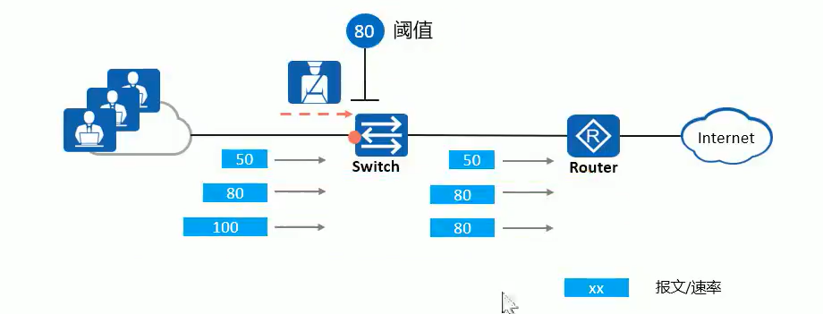

## 安全特性

### 端口隔离

　　采用端口隔离功能，可以实现同一 VLAN 内端口之间的隔离。用户只需要将端口加入到隔离组中，就可以实现隔离组内端口之间二层数据的隔离。端口隔离功能为用户提供了更安全、更灵活的组网方案。

​​

　　相同隔离组内接口无法互通，不通隔离组间可以互通。默认隔离方式为二层隔离，三层互通。

```vim
[Huawei-GigabitEthernet0/0/1]port-isolate enable group 1 // 将接口加入隔离组1
[Huawei-GigabitEthernet0/0/1]port-isolate mode  port-isolate mode ( l2  all ) // l2为二层隔离，all为二层三层均隔离
[Huawei-GigabitEthernet0/0/1]am isolate GigabitEthernet 0/0/2 
// 单向隔离。在1接口配置后，1接口发出的报文无法到达2接口。但2接口发出的报文可以到达1接口

[huawei]port-isolate enable group 1 // 查看隔离组1信息
```

```vim
ruijie#switchport protected // 配置端口隔离F
```

### [DHCP snooping](#20231227201906-xlfo1ai)

　　‍

### 端口安全

　　企业要求接入层交换机上每个连接终端设备的接口均只允许一台 PC 接入网络(限制 MAC 地址接入数量)。如果有员工试图在某个接口下级联一台小交换机或集线器从而扩展上网接口，那么这种行为应该被发现或被禁止，如左图所示.
另一些企业还可能会要求只有 MAC 地址为可信任的终端发送的数据帧才允许被交换机转发到上层网络，员工不能私自更按位置(变更交换机的接入端口)，如右图所示
通过交换机的端口安全(port security)特性可以解决这些问题

​​

　　通过在交换机的特定接口上部署端口安全，可以限制接口的 MAC 地址学习数量，并且配置出现越限时的惩罚
措施
端口安全通过将接口学习到的动态 MAC 地址转换为安全 MAC 地址(包括安全动态 MAC，安全静态 MAC 和 StickyMAC)，阻止非法用户通过本接口和交换机通信，从而增强设备的安全性

　　**安全 MAC 地址类型：**

* 安全动态 MAC 地址

  定义：使能端口安全而未使能 StickyMAC 功能时转换的 MAC 地址。

  特点：设备重启后表项会丢失，需要重新学习。缺省情况下不会被老化，只有在配置安全 MAC 的老化时间后才可以被老化
* 安全静态 MAC 地址

  定义：使能端口安全时手工配置的静态 MAC 地址。

  特点：不会被老化，手动保存配置后重启设备不会丢失
* Sticky MAC 地址

  定义：使能端口安全后又同时使能 StickyMAC 功能后转换到的 MAC 地址

  特点：不会被老化，手动保存配置后重启设备不会丢失

　　**安全 MAC 地址通常与安全保护动作结合使用，常见的安全保护动作：**

* Restrict

  丢弃源 MA 地址不存在的报文并上报告警
* Protect

  只丢弃源 MAC 地址不存在的报文，不上报告警
* shutdown

  接口状态被置为 error-down，并上报告警

　　华为

```vim
[Huawei-GigabitEthernet0/0/1]port-security enable // 在接口开启端口安全，默认情况下：该接口只允许出现一个mac
[Huawei-GigabitEthernet0/0/1]port-security max-mac-num 2  // 设置该接口最多允许出现2个mac
[Huawei-GigabitEthernet0/0/1]port-security mac-address sticky
[Huawei-GigabitEthernet0/0/1]port-security mac-address sticky aaaa-aaaa-aaa3 vla
n 1  // 手工配置端口安全下的静态MAC地址

// 设置安全动作，违规后执行
// protect 丢弃数据包 restrict 丢弃数据包并告警 Shutdown 关闭接口
[Huawei-GigabitEthernet0/0/1]port-security protect-action protect 
```

　　DCN 神州数码

```shell
mac-address-learning cpu-control #必须先全局开启mac地址学习
interface ethernet 1/0/2 #进入接口接口
switchport port-security #开启本接口的端口安全
switchport port-security maximum 5 #mac地址最大学习数量5
switchport port-security mac-address sticky #mac地址自动学习
switchport port-security violation restrict recovery 300 #当有违反规则的mac地址数据包通过限制接口，并在300秒后恢复，
#除此之外还有，shutdown、protect、recovery
switchport port-security aging time 1 #端口老化时间，用于忘记已经动态记住的mac地址
switchport port-security mac-address 2F-FF-FF-FF-FF-2F #手动绑定mac地址
配置端口安全mac的最大数量：
Swichport port-security maximum 100
Switchport port-security violation
当超过设置的最大值，会违反MAC地址安全
Protect模式：保护模式，不学习新的mac，丢弃数据包不告警
Restrict模式：限制模式，不学习新的mac，丢弃数据包，发送snmp trap，
在syslog日志记录
Shutdown模式：关闭模式，默认模式，端口立即关闭，发送snmp trap，
在日志记录

端口配置安全MAC老化时间为10s
Switchport port-security aging time 10
```

　　锐捷

```shell
Ruijie(config) int gi 0/1
Ruijie(config-if-GigabitEthernet 0/1) switchport port-security  # 使能端口安全
Ruijie(config-if-GigabitEthernet 0/1) switchport port-security mac-address sticky  # 设置端口安全模式为sticky_MAC
Ruijie(config-if-GigabitEthernet 0/1) switchport port-security maximum 1  # 最大绑定一个MAC地址
```

### MAC 地址表项安全

　　**MAC 地址表相关配置**

* 配置静态 MAC 地址

  * ​`[HuaWei]mac-address static aaaa-aaaa-aaa2 GigabitEthernet 0/0/2`​
  * 指定的 VLAN 必须已经创建并且已经加入绑定的端口; 指定的 MAC 地址，必须是单播 MAC 地址，不能是组播和广播 MAC 地址。
* 配置黑洞 MAC

  * ​`[HuaWei]mac-address blackhole aaaa-aaaa-aaa4 vlan 1`​
  * 当设备收到目的 MAC 或源 MAC 地址为黑洞 MAC 地址的报文，直接丢弃
* 配置 MAC 表项的老化时间

  * ​`[HuaWei]mac-address aging-time 600`​
  * 配置老化时间，单位：秒
* 关闭基于接口的 MAC 地址学习功能及动作

  * ​`[Huawei-GigabitEthernet0/0/1]mac-address learning disable action {forward | discard} `​
  * 缺省情况下，接口的 MAC 地址学习功能是使能的:

    * 关闭 MAC 地址学习功能的缺省动作为 forward，即对报文进行转发
    * 当配置动作为 discard 时，会对报文的源 MAC 地址进行匹配，当接口和 MAC 地址与 MAC 地址表项匹配时，则对该报文进行转发。当接口和 MAC 地址与 MAC 地址表项不匹配时，则丢弃该报文
* 关闭基于 VLAN 的 MAC 地址学习功能

  * ​`[Huawei-vlan20]mac-address learning disable `
  * 缺省情况下，VLAN 的 MAC 地址学习功能是使能的

    * 当同时配置基于接口和基于 VLAN 的禁止 MAC 地址学习功能时，基于 VLAN 的优先级要高于基于接口的优先级配置
* 配置基于 VLAN 限制 MAC 地址学习数

  * ​`[Huawei-vlan20]mac-limit maximum 10`​
  * 缺省情况下，不限制 MAC 地址学习数
* 配置基于接口限制 MAC 地址学习数

  * ​`[Huawei-GigabitEthernet0/0/1]mac-limit maximum 10`​
  * 缺省情况下，不限制 MAC 地址学习数。
* 配置当 MAC 地址数到达限制后，对报文采取的动作

  * ​`[Huawei-GigabitEthernet0/0/1] mac-limit action  {discard | forward}`​
  * 缺省情况下，对超过 MAC 地址学习数限制的报文采取丢弃动作
* 配置当 MAC 地址数达到限制后是否进行告警

  * ​`[Huawei-GigabitEthernet0/0/1] mac-limit alarm { disable | enable }`​
  * ​缺省情况下，对超过 MAC 地址学习数限制的报文进行告警。

　　**防止 MAC 地址漂移**

　　如果是环路引发 MAC 地址漂移，治本的方法是部署防环技术，例如 STP，消除二层环路。如果由于网络攻击等其他原因引起则可使用如下 MAC 地址防漂移特性

* 配置接口 MAC 地址学习优先级

  * ​`[Huawei-GigabitEthernet0/0/1]mac-learning priority 3`​
  * 当 MAC 地址在交换机的两个接口之间发生漂移时，可以将其中一个接口的 MAC 地址学习优先级提高。高优先级的接口学习到的 MAC 地址表后会覆盖低优先级接口学到的 MAC 地址表项
  * ​​
* 配置不允许相同优先级接口 MAC 地址漂移

  * ​`[Huawei]undo mac-learning priority 0 allow-flapping`​
  * 当伪造网络设备所连接口的 MAC 地址优先级与安全的网络设备相同时，后学习到的伪造网络设备 MAC 地址表项不会覆盖之前正确的表项
  * ​
* 配置禁止 MAC 地址漂移时报文的处理动作为丢弃

  * ​`[Huawei]mac-learning priority flapping-defend action discard`​
  * 缺省情况下，禁止 MAC 地址漂移时报文的处理动作是转发。
* 配置 MAC 地址漂检测的 VLAN 白名单

  * ​`[Huawei]mac-address flapping detection exclude vlan 20`​
  * 缺省情况下，没有配置 MAC 地址漂移检测的 VLAN 白名单
* 配置发生漂移后接口的处理动作

  * ​`[Huawei-GigabitEthernet0/0/1]mac-address flapping trigger {error-down | quit-vlan}`
  * 缺省情况下，没有配置接口 MAC 地址漂移后的处理动作。

  配置 MAC 地址漂移表项的老化时间

  * ​`[Huawei] mac-address flapping aging-time 600`​
  * 缺省情况下，MAC 地址漂移表项的老化时间为 300 秒。

### 流量抑制\广播控制

　　流量抑制可以通过配置阀值来限制广播、未知组播、未知单播已知组播和已知单播报文的速率，防止广播、未知组播报文和未知单播报文产生流量泛洪，阻止已知组播报文和已知单播报文的大流量冲击。

　　限制接口速率

　　在接口入方向上，设备支持对广播、未知组播、未知单播、已知组播和已知单播报文按百分比、包速率和比特
速率进行流量抑制。设备监控接口下的各类报文速率并和配置的闻值相比较，当入口流量超过配置的闻值时，设备会丢弃超额的流量

​​

　　在 VLAN 视图下，设备支持对广播报文按比特速率进行流量抑制。设备监控同一 VLAN 内广播报文的速率并和配置的闯值相比较，当 VLAN 内流量超过配置的闽值时，设备会丢弃超额的流量。

​​

#### 配置方式

　　DCN 神州数码

```shell
设置交换机的广播风暴抑制功能
Storm-control unicast (单播) pps
broadcast (广播)
multicast (组播)
```

### ARP 相关

#### 防 ARP 扫描

　　DCN 神州数码

```shell
anti-arpscan enable #启动防ARP扫描功能
anti-arpscan recovery enable #开启自定恢复
anti-arpscan recovery time 3600 #配置自动恢复时间
anti-arpscan trust ip 192.168.10.1 255.255.255.0  #配置信任IP，非必要

Interface Ethernet1/0/2 #与主机相连的接口
anti-arpscan trust port #配置信任接口

interface ethernet 1/0/3 #与交换机相连的接口
anti-arpscan trust supertrust-port #超级信任端口，对端交换机也需要开启功能并配置接口

基于端口
规定时间，接收到ARP报文数量超过设定阈值，down掉端口
基于ip
规定时间，某ip接收到ARP报文数量超过设定阈值，禁用ip而不是端口

Anti-arpscan log enable
启用防ARP扫描日志功能
Anti-arpscan trap enable
启动防ARP扫描的SNMP TRAP功能，网关软件可以收到
查看配置如：
Show anti-arpscan trust port
```

#### Arp local proxy

　　DCN 神州数码

```shell
#功能：某种实际的应用环境中，为了防止 ARP 的欺骗，要求汇聚层的交换机实现local arp proxy功能，
#限制 ARP 报文在同一 vlan 内的转发，从而引导数据流量通过交换机进行 L3转发。
interface vlan 10
ip local proxy-arp
```

#### ARP 动态监测

　　DCN 神州数码

```shell
#需要和dhcp结合使用
ip arp inspection vlan 1 #开启arp检测的vlan号
interface e1/0/18
ip arp inspection trust #配置信任接口

interface vlan 30
ip arp dynamic maximum 50 #VLAN接口的ARP阀值为50
# 限制最大arp地址数量
```

#### 免费 ARP

　　免费 ARP，在交换机接口配置定时发送 ARP 报文，或者在全局配置所有接口当时发送 ARP 报文

　　DCN 神州数码

```shell
使能免费ARP发送功能，并设置免费ARP报文的发送时间间隔
Ip gratuitous-arp 300 配置时间间隔为300s

Show ip gratuitous-arp
显示免费ARP发送功能的配置信息
```

### 环路检测

　　DCN 神州数码

```shell
#配置端口环路检测
loopback-detection interval-time 35 15

int ethernet 1/0/1
loopback-detection special-vlan 1-3
进入接口，启动端口环路检测功能
loopback-detection control [shutdown,block]
进入接口，打开端口环路控制方式，共有三种方式
Shutdown：发现端口环路将该端口down掉
Block：发现端口环路将端口阻塞掉，只允许bpdu和环路检测报文通过，block控制，必须先要全局启动mstp，并且配置生成树协议与vlan的对应关系
Learning：禁止端口的学习MAC地址功能的受控方式，不转发流量，并删除端口MAC地址

Loopback-detection control-recovery timeout xx
配置环路检测收款方式是否自动恢复的时间间隔
Show loopback-detection
通过该命令显示出端口段环路检测状态和检测结果

#如果使用 block 控制，必须全局启动 mstp，并且配置生成树实例与 vlan 的对应关系
spanning-tree
spanning-tree mst configuration
instance 1 vlan 1
instance 2 vlan 2
```

　　锐捷

```shell
Ruijie(config) rldp enable  # 使能RLDP协议
Ruijie(config) errdisable recovery interval 300
# 如果端口被RLDP检测并shutdown，再过300秒后会自动恢复，重新检测是否有环路   
Ruijie(config) int gi 0/1
Ruijie(config-if-GigabitEthernet 0/1) rldp port loop-detect shutdown-port
# 接口开启RLDP功能，如果检测出环路后shutdow该端口
```

### AM(Access Management-访问管理)

　　DCN 神州数码

```shell
作用：网络管理员可以将合法用户MAC-IP地址绑定到指定端口，只有这些用户发出的报文才可能通过该端口转发
am enable
全局模式下启用AM功能，no关闭
am port
端口默认关闭，开启am功能
am ip-pool
设置端口访问管理ip地址段最大不得超过32,例如：
am ip-pool 10.10.10.1 10
am mac-ip-pool
设置端口访问管理的MAC-IP地址
在交换机端口配置允许源mac地址为xx-xx-xx-xx-xx-xx,且ip为10.10.10.1的地址进行转发
am mac-ip-pool xx-xx-xx-xx-xx-xx 10.10.10.1
no am all
删除ip-pool和mac-ip-pool设置
Show am
查看am入口表项
```

### 抗 ddos 攻击

　　DCN 神州数码

```shell
dosattack-check srcip-equal-dstip enable #防IP Spoofing攻击
dosattack-check ipv4-first-fragment enable #启用对第一片段IPv4包的检查
dosattack-check tcp-flags enable #防TCP非法标志攻击
dosattack-check srcport-equal-dstport enable #启用TCP/UDP L4端口的检查，防止端口欺骗
dosattack-check tcp-fragment enable #防TCP碎片攻击
dosattack-check icmp-attacking enable #防icmp碎片攻击
dosattack-check icmpV4-size 64 #icmp包大小限制64
dosattack-check tcp-segment 20 #TCP段大小限制
```

### DoS(Denial of Service)的缩写，意味拒绝服务

　　DCN 神州数码

```shell
(1) 防IP Spoofing攻击，
Dosattack-check srcip-equal-dstip enable
开启检查ip源地址等于目的地址的功能

(2)防TCP非法标志攻击功能配置
Dosattack-check tcp-flags enable
开启检查TCP标志功能
Dosattack-check ipv4-first-fragment enable
开启检查IPv4分片功能，单独使用无作用

（3）防端口欺骗功能
Dosattack-check srcport-equal-dstport enable
开启防端口欺骗功能
Dosattack-check ipv4-first-fragement enable
开启检查IPv4分片功能，单独使用无效

（4）防TCP碎片攻击配置任务
Dosattack-check tcp-fragment enable
开启防TCP碎片攻击功能
Dosattack-check tcp-segment
设置允许通过的最小TCP报文段长度

（5）防ICMP碎片攻击功能配置
Dosattack-check icmp-attacking enable
开启ICMP碎片攻击功能
Dosattack-check icmpV4-size xx
设置允许通过的最大ICMPv4净荷长度，单独使用无作用
```

### Portfast & BPDUguard

　　BPDU 防护

　　锐捷

```shell
Ruijie(config) int gi 0/1
Ruijie(config-if-GigabitEthernet 0/1) spanning-tree portfast  # 设置为边缘端口
Ruijie(config-if-GigabitEthernet 0/1) spanning-tree bpduguard enable  # 使能BPDU保护
```
