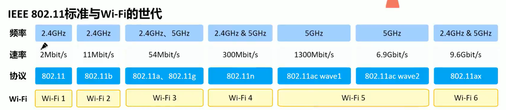
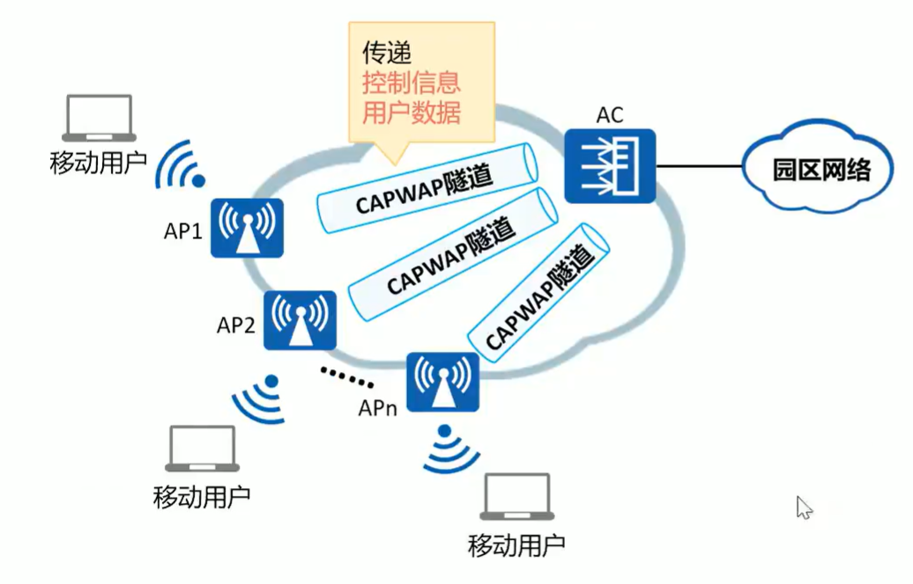
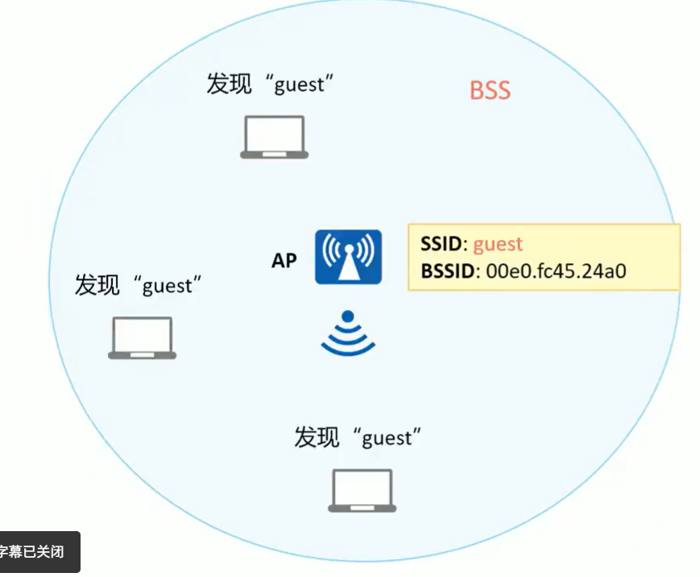
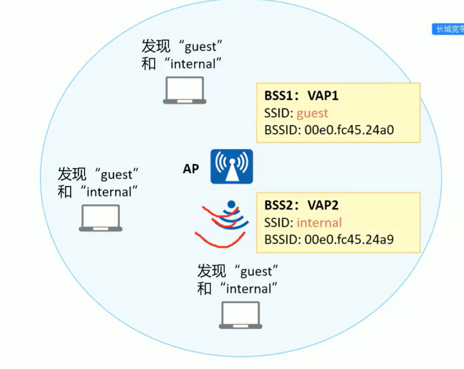
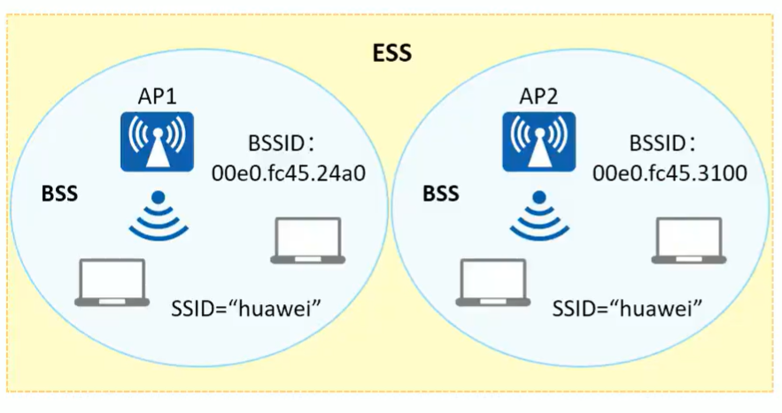

## 术语解释

### IEEE 802.11 = WiFi

​​

### CAPWAP

　　**CAPWAP 隧道**

　　CAPWAP(Control And Provisioning of Wireless AccessPoints Protocol，无线接入点控制和配置协议):该协议定义了如何对 AP 进行管理、业务配置，即 AC 通过 CAPWAP 隧道来实现对 AP 的集中管理和控制。

　　**CAPWAP 隧道的功能**

* AP 与 AC 间的状态维护
* AC 通过 CAPWAP 隧道对 AP 进行管理、业务配置下发。
* 当采用隧道转发模式时，AP 将 STA 发出的数据通过 CAPWAP 隧道实现与 AC 之间的交互。

​​

### BSS/SSID/BSSID

​​

　　**BSS 基本服务集**

　　无线信号覆盖

　　**BSSID 基本服务集符**

　　无线的身份标识，用 AP 的 MAC 表示

　　**SSID 服务集标识**

　　无线的名称

### VAP 虚拟接入点

​​

　　早期的 AP 只支持 1 个 BSS 如果要在同一空间内部署多个 BSS，则需要安放多个 AP，这不但增加了成本，还占用了信道资源。为了改善这种状况，现在的 AP 通常支持创建出多个虚拟 AP(Virtual Access Point, VAP)。

　　**虚拟接入点 VAP：**

* VAP 就是在一个物理实体 AP 上虚拟出的多个 AP。每一个被虚拟出的 AP 就是一个 VAP。每个 VAP 提供和物理实体 AP 一样的功能。
* 每个 VAP 对应 1 个 BSS。这样 1 个 AP，就可以提供多个 BSS 可以再为这些 BSS，设置不同的 SSID。

### ESS 扩展服务集

　　无线漫游

​​

　　为了满足实际业务的需求，需要对 BSS 的覆盖范围进行扩展。同时用户从一个 BSS 移动到另一个 BSS 时不能感知到 SSID 的变化，则可以通过扩展服务集 ESS 实现。

　　**扩展服务集 ESS(Extend Service Set)**

* 由多个使用相同 SSID 的 BSS 组成，是采用相同的 SSID 的多个 BSS 组成的更大规模的虚拟 BSS

　　‍

　　‍
