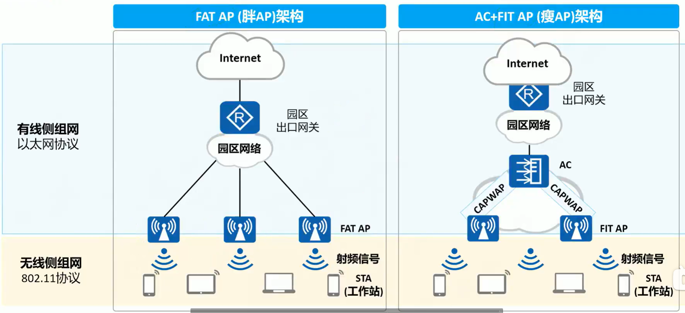
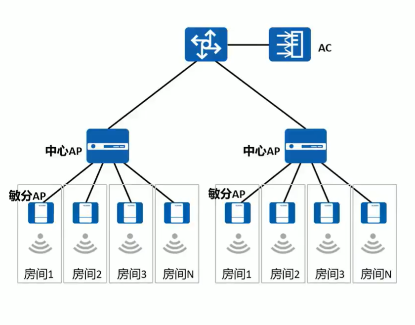
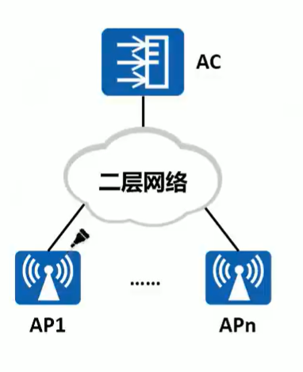
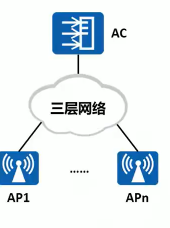
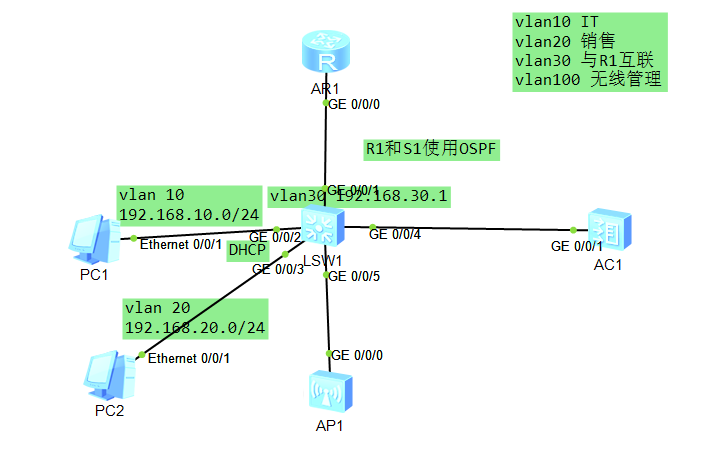
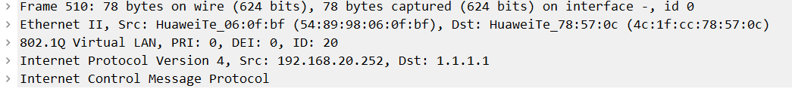
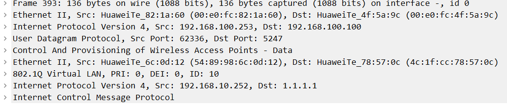
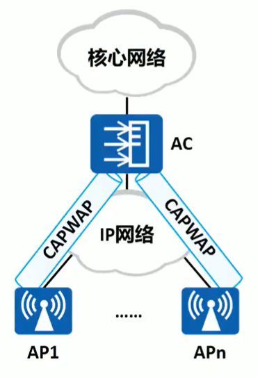
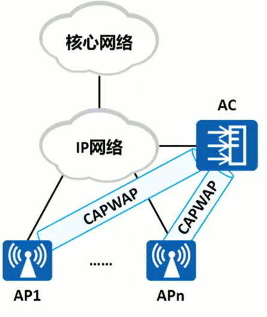

## 简单部署架构

​​

　　胖 AP 需要对每台设备单独配置，维护困难。成本较低

　　瘦 AP 使用 AC 统一配置，集中管理，维护简单。成本较高

### 敏捷分布式 AP 架构

　　AP 的一种特殊架构，将 AP 拆分为中心 AP 和敏分 AP 两部分，中心 AP 可以管理多台敏分 AP。在适用的场景下，成本低、覆盖好。敏捷分布式 AP 可以用于 FAT AP、AC+FIT AP、云管理架构

　　适用于房间分布密集的场景。酒店常用

​​

### 二层组网

　　AP 与 AC 之间的网络为直连或者二层网络。

　　由于二层组网比较简单，适用于简单临时的组网，能够进行比较快速的组网配置
但不适用于大型组网架构。

​​

### 三层组网

　　AP 与 AC 之间的网络为三层网络。

　　在实际组网中，一台 AC 可以连接几十甚至几百台 AP，组网一般比较复杂，在大型组网中一般采用三层组网。

​​

### 组网实验

​​

　　有线部分：

```shell

S1：
// 使R1和R2使用dhcp获取地址
interface GigabitEthernet0/0/2
 port link-type access
 port default vlan 10
interface Vlanif10
 ip address 192.168.10.254 255.255.255.0
 dhcp select interface
interface GigabitEthernet0/0/3
 port link-type access
 port default vlan 20
interface Vlanif20
 ip address 192.168.20.254 255.255.255.0
 dhcp select interface

// 与R1互联，并宣告所有地址
interface GigabitEthernet0/0/1
 port link-type access
 port default vlan 30
interface Vlanif30
 ip address 192.168.30.1 255.255.255.0
ospf 10 router-id 2.2.2.2
 area 0.0.0.0
  network 0.0.0.0 255.255.255.255

R1：
// 与S1互联，并宣告所有路由
interface GigabitEthernet0/0/0
 ip address 192.168.30.2 255.255.255.0 
interface LoopBack0
 ip address 1.1.1.1 255.255.255.255 
ospf 10 router-id 1.1.1.1 
 area 0.0.0.0 
  network 0.0.0.0 255.255.255.255 
```

　　接下来，AC 和 AP 二层组网。

#### AP 上线

　　使用 vlan100 作为管理 vlan

```shell
// AP默认为瘦AP，使用DHCP获取地址，不做任何配置
// S1修改连接AP接口的模式。修改PVID使AP发来的数据包默认为vlan100，与AC建立连接
interface GigabitEthernet0/0/5
 port link-type trunk
 port trunk pvid vlan 100
 port trunk allow-pass vlan 2 to 4094
// S1修改连接AC的接口模式为trunk。access在使用隧道转发时会出现问题。
interface GigabitEthernet0/0/4
 port link-type trunk
 port trunk allow-pass vlan 2 to 4094
// AC手动配置地址为192.168.100.100
interface Vlanif100
 ip address 192.168.100.100 255.255.255.0
interface GigabitEthernet0/0/1
 port link-type trunk
 port trunk allow-pass vlan 2 to 4094
```

　　建立 CAPWAP 隧道，使 AC 发现 AP。（AP 自动发送 CAPWAP 请求）

```shell
// 在AC上定义CAPWAP的源，使AC能够回复AP的请求
[AC6005]capwap source ip-address 192.168.100.100
```

　　AC 对 AP 的认证方式

* 不认证  --- 不管任何 AP，只要发出请求就同意
* MAC 认证 --- AC 白名单
* SN 序列号认证 --- AC 白名单

```shell
// 修改认证模式为不认证
[AC6005]wlan 
[AC6005-wlan-view]ap auth-mode no-auth
```

　　此时，AP 已经正常上线

```shell
// 查看上线AP
[AC6005]dis ap all
Info: This operation may take a few seconds. Please wait for a moment.done.
Total AP information:
nor  : normal          [1]
-------------------------------------------------------------------------------
ID   MAC            Name           Group   IP              Type            State
 STA Uptime
--------------------------------------------------------------------------------
0    00e0-fc82-1a60 00e0-fc82-1a60 default 192.168.100.253 AP6050DN        nor  
 0   1M:14S
--------------------------------------------------------------------------------
```

#### 下发配置

##### AP 组

　　把被管理的 AP 划入对应的 AP 组内（默认在 Default 组）

```shell
// 在AC上进入ap
AC6005]wlan
[AC6005-wlan-view]ap-id 0  // 进入ap 0 ，id使用 dis ap all 查看
[AC6005-wlan-ap-0]ap-name ap1  // 修改ap名称为ap1
[AC6005-wlan-ap-0]ap-group it // 加入ap组IT，注意，需要先创建AP

[AC6005-wlan-view]ap-group name it // 创建ap组IT
```

##### 定义安全模板

```shell
[AC6005-wlan-view]security-profile name it
[AC6005-wlan-sec-prof-it]security open  // 不加密
[AC6005-wlan-view]security-profile name xs // 加密模板
[AC6005-wlan-sec-prof-xs]security wpa-wpa2 psk pass-phrase 123456789 aes
// wpa-wps2协议 ，pas 预共享密钥验证 pass-phrase 密码 ，aes 加密方式
```

##### 定义 SSID 模板

```shell
[AC6005-wlan-view]ssid-profile name it  // ssid模板，释放信号使用
[AC6005-wlan-ssid-prof-it]ssid it  // 无线信号名称
[AC6005-wlan-view]ssid-profile name xs
[AC6005-wlan-ssid-prof-xs]ssid xs
```

##### 定义 VAP 模板

　　调用安全模板和 SSID 模板，配置转发方式和业务 VLAN

```shell
[AC6005-wlan-view]vap-profile name it
[AC6005-wlan-vap-prof-it]security-profile it  // 安全模板为it
[AC6005-wlan-vap-prof-it]ssid-profile it // ssid模板为it
[AC6005-wlan-vap-prof-it]service-vlan vlan-id 10 // 配置业务vlan为10. 用户连接后使用该vlan上网（dhcp也是这个的地址）

// 默认为直接转发，流量不经过AC
// 隧道转发，流量经过CAPWAP隧道，到达AC后再有AC进行转发。
[AC6005-wlan-vap-prof-default]forward-mode tunnel // 修改为隧道转发
// 在使用隧道转发时，需要在AC创建业务VLAN，并且AC连接核心的接口为Trunk。否则无线设备无法正常上网。
// 无线设备在上网时，会将数据包通过CAPWAP隧道到达AC，再有AC进行转发
```

　　直接转发报文

​​

　　隧道转发报文

​​

##### AP 组调用模板

```shell
// 进入ap组default，调用VAP模板
[AC6005-wlan-ap-group-default]vap-profile it wlan 1 radio all   // wlan ID为1，radio为发射信号类型
[AC6005-wlan-ap-group-default]vap-profile xs wlan 2 radio all // 再次调用，可同时发送多个信号
```

　　至此，无线设备已经可以正常使用

##### VLAN Pool 地址池

　　对于学校/商场/医院等场景都会使用同一个 SSID，此时会面临一个问题：单个 VLAN 所容纳的用户数量较少，无法满足需求

　　VLAN Pool

　　当使用 even 算法时，将按照用户上线顺序使用多个 VLAN 向用户分配地址

　　当使用 hash 算法时，使用轮询的方式，使用多个 VLAN 向用户分配地址

```shell
[AC6005]vlan pool wlan1 // 创建vlan池
[AC6005-vlan-pool-wlan1]assignment hash // 算法为hash，使用轮询的方式分配
[AC6005-vlan-pool-wlan1]vlan 10  // 将vlan添加到池子
[AC6005-vlan-pool-wlan1]vlan 20

// 在vap模板中调用
[AC6005-wlan-vap-prof-it]service-vlan vlan-pool wlan1
```

#### 三层组网

　　跨广播域组网，默认情况下 AP 发出的 CAPWAP 请求报文目的为 255.255.255.255 无法跨广播域传播

　　在三层组网的情况下，AC 无法收到 AP 的请求报文。

```shell
// AC的CAPWAP源为192.168.200.200，AP为192.168.100.0/24
// 在AC上配置AP的回程路由，保证AP与AC正常通信
[AC6005]ip route-static 192.168.100.0 24 192.168.200.254
// 在AP获取地址的dhcp服务器上配置Optine43.指定AC的地址。使AP发送单播报文请求AC
[Huawei-Vlanif100]dhcp server option 43 sub-option 2 ip-address 192.168.200.200
```

　　‍

　　‍

　　‍

　　‍

### 直连式组网

　　直连式组网可以认为 AP、AC 与上层网络串联在一起，所有数据必须通过 AC 到达上层网络。

　　直连式组网中 AC 同时扮演 AC 和汇聚交换机的功能，AP 的数据业务和管理业务都由 AC 集中转发和处理。

​​

### 旁挂式组网

　　旁挂式组网，AC 旁挂在 AP 与上行网络的直连网络中不再直接连接 AP。

　　旁挂式组网，AC 旁挂在 AP 与上行网络的直连网络上 AP 的业务数据可以不经 AC 而直接到达上行网络

​​
