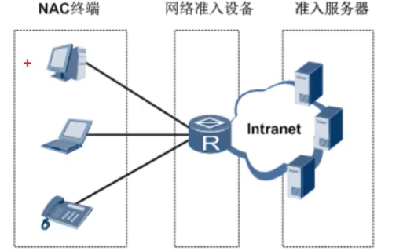
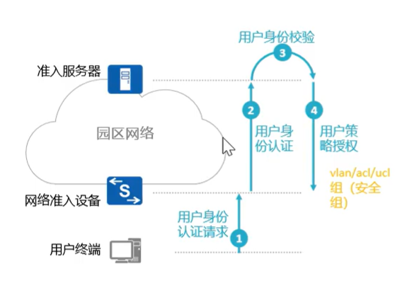
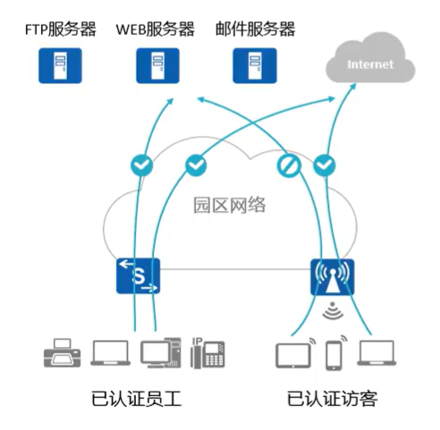
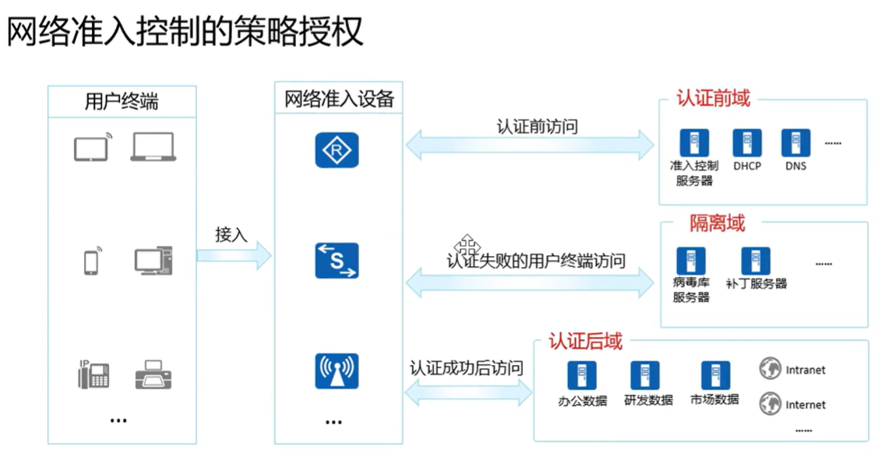

## 网络准入控制

　　**NAC**(Network Admission Control)称为网络接入控制,是一种“端到端”的安全结构，包括 802.1x 认证、MAC 认证与 Portal 认证。牧击等各种信息安全威胁也在不断增加。在传统的企业网络建设思路中，一般认为企业内网是安全的，安全威随着企业网络的应用和发展，病毒、木马、间谍软件、网络胁主要来自外界。但是研究证明，80% 的网络安全漏洞都存在于网络内部，它们对网络的破坏程度和范围持续扩大，经常引起系统崩溃、网络瘫痪。另外，内部员工在浏览某些网站时，一些间谍软件、木马程序等恶意软件也会不和不觉地被下载到电脑中，并且在企业内网传播，产生严重的安全急患。因此，随着安全挑战的不断升级，仅通过传统的安全措施已轻远远不够，安全模型需要由被动模式向主动模式转变，从根源(端)彻底解决网络安全问题，提高整个企业的信息安全水平。

　　**NAC** 安全解决方案从接入网络的终端安全控制入手，将终端安全状况和网络准入控制结合在一起，通过检查、隔离、加固和审计等手段，加强网络用户终端的主动防御能力，保证企业中每个终端的安全性，进而保护企业整网的安性。

　　网络准入控制以“只有合法的用户、安全的终端才可以接入网络”为主导思想，通过用户认证、权限管理、安全检查、修复升级等手段提升企业网络整体终端安全防护能力

### 架构及原理

　　NAC 安全构架包括三个关键组件:NAC 终端、网络准入设备和准入服务器。

​​

* NAC 终端:作为 NAC 客户端的各种终端设备，与网络接入设备交互完成用户的接入认证功能，如果采用 802.1x 认证，用户还需要安装客户端软件。<span data-type="text" style="color: var(--b3-font-color9);" id="">手机 打印机 PC 摄像头等</span>
* 网络准入设备:网络准入设备是终端访问网络的网络控制点，是企业安全策略的实施者负责按照客户网络制定的安全策略，实施相应的准入控制(允许、拒绝、隔离或限制)。 <span data-type="text" id="" style="color: var(--b3-font-color9);">交换机 路由器 AP 等</span>
* 准入服务器:准入服务器包括准入控制服务器、管理服务器、病毒库服务器和补丁服务器，主要进行用户身份认证、终端安全检查、系统修复升级，终端行为监控审计等工作。<span data-type="text" style="color: var(--b3-font-color9);" id="">认证 授权 安全检查</span>

​​

1. 用户身份认证请求：网络准入设备通过和终端进行报文交互，获取终端的身份凭证。
2. 用户身份认证：网络准入设备将身份凭证发送给准入服务器进行身份认证。
3. 用户身份校验：准入服务器进行身份校验，确定终端身份是否合法，并将校验结果及策略下发给网络准入设备。
4. 用户策略授权：网络准入设备作为策略的实施者，根据准入服务器的授权结果对终端实施策略的控制。

#### 策略管控

　　即使终端通过认证接入网络，也并不意味着可以访问网络内的所有资源，而是需要基于用户身份对其加以区分，分别赋予其不同的网络访问权限

​​

#### 策略授权

​​

　　网络准入控制基本流程:

1. 用户终端接入网络，认证前都具有认证前域网络权限，包括访问准入控制服务器、DHCP、DNS 等。
2. 对用户终端进行身份认证，认证通过后，准入服务器下发网络权限到网络准入设备，允许该用户访问认证后域网络。对于一些合法但是不安全的用户，身份认证后，准入服务器下发隔离域网络权限到网络准入设备，仅允许该用户访问隔离域网络，用户安全修复后，重新下发认证后域网络权限。在隔离域时，用户可以根据需要进行终端代理软件安装，补丁安装，杀毒软件安装、升级等操作。
3. 非法用户及未认证用户仅允许访问认证前域或隔离域网络资源。

### 802.1X 认证

　　IEEE802 LAN/WAN 委员会为解决无线局域网网 7 络安全问题，提出了 802.1x 协议。后来，802.1x 协议作为局域网端口的一个普通接入控制机制在以太网中被广泛应用，主要解决以太网内认证和安全方面的问题。

　　802.1x 协议是一种基于端口的网络接入控制协议，“<span data-type="text" id="" style="color: var(--b3-font-color9);">基于端口</span>的网络接入控制”是指，在局域网接入设备的端口这一级，对所接入的用户设备通过认证来控制对网络资源的访问。

　　<span data-type="text" id="" style="color: var(--b3-font-color9);">802.1X 的认证的最终目的就是确定一个端口是否可用。</span>
对于一个端口，如果认证成功那么就“打开”这个端口，允许所有的报文通过;如果认证不成功就使这个端口保持“关闭”，此时只允许 802.1X 的认证报文 EAPOL(ExtensibleAuthentication Protocol over LAN)通过。

　　**优势：**

* 802.1X 协议为二层协议，不需要到达三层，对接入设备的整体性能要求不高，可以有效降低建网成本。
* 认证报文和数据报文通过逻辑接口分离，提高安全性。

　　<span data-type="text" id="" style="color: var(--b3-font-color6);">应用在虚拟化园区网中时，可以先认证，根据授权结果(安全组/VLAN)，获取 IP 地址</span>

　　‍

#### 配置方式

　　DCN 神州数码

```shell
radius-server authentication host 10.103.117.7 #配置认证服务器
radius-server accounting host 10.103.117.7  #配置计费服务器
radius-server key 123   #配置认证服务器的密钥
aaa enable   #开启AAA认证
aaa-accounting enable  #开启AAA计费功能
dot1x enable  #开启802.1x认证
dot1x user free-resource 10.103.117.0 255.255.255.0 #设置认证前可访问资源

interface Ethernet 0/0/1   #进入端口
dot1x enable   #开启端口的1X认证
dot1x port-method userbased advanced #设置认证方式为userbased
dot1x port-control auto  #设置授权状态为auto
```

　　‍

　　‍

　　‍

　　‍

　　‍

　　‍

　　‍

　　‍

　　‍

　　‍

# 参考手册
