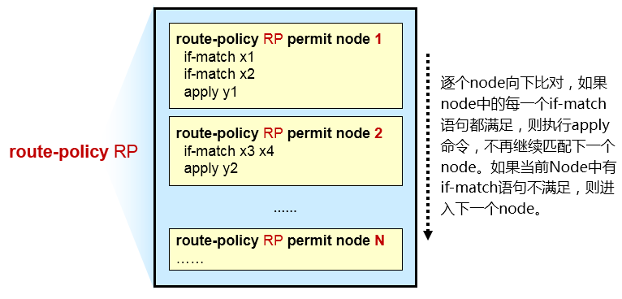
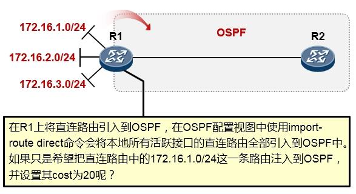
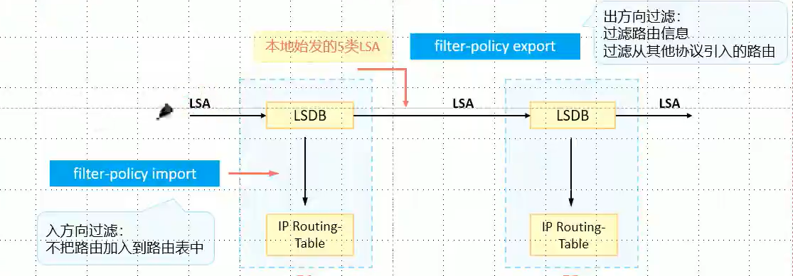
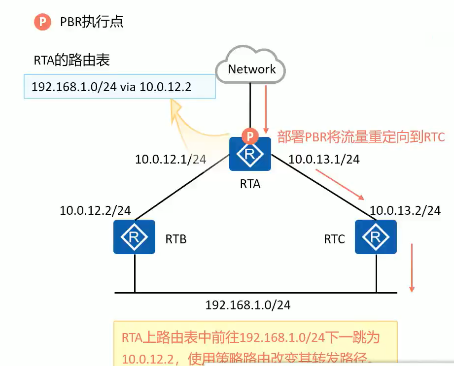
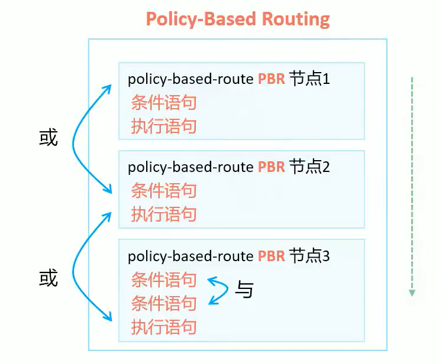
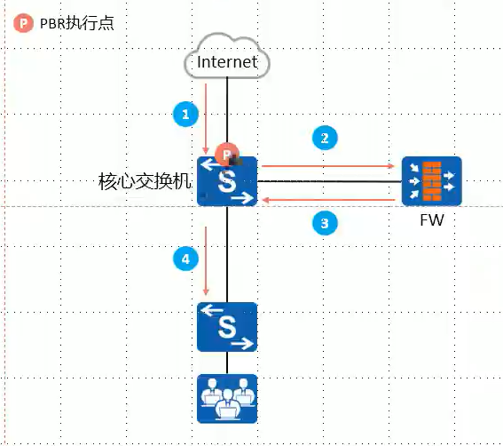

## 路由策略/策略路由

### 前缀列表

　　不同于用于匹配流量的 IP 访问列表，IP 前缀列表主要是用来指定具体的网络可达的。前缀列表用来匹配前缀（网段）和前缀长度（子网掩码）。前缀列表有两个参数很难理解。

1. 可以增量修改，我们知道对于普通访问控制列表，我们不能删除该列表中的某个条目，如果想删除列表中的某个条目只能将该访问列表全部删除，而前缀列表中，一个条目可以单独地删除或添加。
2. 前缀列表在 Cisco IOS 12.0 及其以后的版本中可以使用。
3. 在大型列表的加载和路由查找方面比访问控制列表有显著的性能改进。

#### 简单使用

　　​`ip prefix-list [name] [permit | deny] [prefix]/[len]`​

　　​`name` ​为名字 `permit/deny` ​为策略 `[prefix]/[len]`​ 网段和掩码

　　​`ip prefix-list LIST permit 1.2.3.0/24`​

　　允许 1.2.3.0/24 网段

　　​`ip prefix-list LIST permit 0.0.0.0/0`​

　　允许所有，一般用于匹配默认路由

#### 进阶版

　　​`ip prefix-list list-name [seq seq-value] {deny|permit} network/len [ge ge-value] [le le-value]　`​

* list name：代表被创建的前缀列表名（注意该列表名是区分大小写的）
* seq-value：代表前缀列表语名的 32bit 序号，用于确定过滤语句被处理的次序。缺省序号以 5 递增（5，10，15 等等）。
* deny|permit：代表当发现一个匹配条目时所要采取的行动
* network/len：代表要进行匹配的前缀和前缀长度。Network 是 32 位的地址，长度是一个十进制的数。
* ge-value：代表比“network/len”更具体的前缀，要进行匹配的前缀长度的范围。如果只规定了“ge”属性，该范围被认为是从“ge-value”到 32。
* le-vlaue：代表比“network/len”更具体的前缀，要进行匹配的前缀长度的范围。如果只规定了“le”属性，该范围被认为是从“le”到“le-value”。

　　通常情况下，在使用前缀列表的时候加上”GE”（大于或等于）和”LE”（小于或等于）时比较容易发生混淆。这是因为当使用”GE”和”LE”时，列表的长度（len）发生了改变。

　　**使用 GE 和 LE,必须满足下面的条件：**

　　len < GE <= LE

　　上面的参数很容易混淆，简单的说就是一个匹配前缀或子网的地址的范围。

　　实例：比如我们希望匹配：192.168.16.0 /24 和 192.168.18.0/24 两条路由，那么我们的前缀列表应写为：ip prefix-list 1 permit 192.168.16.0/22 ge 24 le 24 该命令的意思表示先把/24 掩码的路由筛选出来，然后再按照 mask 值/22 进行匹配。

　　匹配范围：

* 未配置 ge 和 le：配置的前缀长度和路由的前缀长度必须相同
* 配置了 ge 和 le：路由的前缀长度必须在配置的 ge 值和 le 值之间
* 只配置了 ge：指定的前缀长度范围为 ge-value~32 的闭区间
* 只配置了 le：指定的前缀长度范围为 prefix-length~le-value 的闭区间

　　**例子：**

　　​`ip prefix-list LIST permit 1.2.3.0/24 le 32`​

　　表示前缀 1.2.3.0 前面的 24 位必须匹配。此外，子网掩码必须小于或等于 32 位

　　​`ip prefix-list LIST permit 0.0.0.0/0 le 32`​

　　意味着 0 位需要匹配，此外子网掩码必须小于或等于 32 位。因为所有的网段的掩码都小于或等于 32 位，并且一位都不用匹配，所以这句话等于 permit any

　　​`ip prefix-list LIST permit 10.0.0.0/8 ge 21 le 29`​

　　说明网段 10.0.0.0 的前 8 位必须匹配，此外子网掩码必须在 21 位和 29 位之间。

　　**注意：使用前缀列表不能像访问列表那样匹配具体的应用流。前缀列表也不能用来具体匹配奇数或偶数的前缀，或什么可以被 15 整除的前缀**

#### 进阶使用综合实例

　　路由器 A 属于 AS65000，路由器 B 与路由器 C 是路由器 A 的邻居，路由器 A 从路由器 B 学到了，172.16.10.0/24, 172.16.11.0 这两条路由，路由器 C 接路由器 A 的端口地址是：10.1.1.1

　　在这个测试中使用了 3 台路由器：路由器 B，路由器 A 和路由器 C，路由器 C 是路由器 A 的 EBGP 邻居，路由器 C 的接口地址为 10.1.1.1，如上所示。
假设配置前缀列表之前，路由器 A 学到了下面的路由（从路由器 B 那里学来的）：

```vim
172.16.0.0 subnetted:
172.16.10.0/24
172.16.11.0/24
```

　　我们测试了如下 5 种情况：

##### 第一种情况：

　　在这种情况下，对路由器 A 做了如下配置：

```vim
router bgp 65000
aggregate-address 171.16.0.0 255.255.0.0
neighbor 10.1.1.1 prefix-list tenonly out
in prefix-list tenonly permit 172.16.10.0/8 le 24
```

　　当用“show run”命令查看路由器的配置时，我们将看到路由器 A 自动地将这个配置的最后一行改为下面这样

　　​`ip prefix-fix tenonly permit 172.0.0.0/8 le 24`​

　　这时路由器 C 学到了三个路由器，即

```vim
172.16.0.0/16
172.16.10.0/24
172.16.11.0/24
```

　　下面就祥细的说明一下路由器 C 为什么会学到这三条路由：

　　因为我们在路由器 A 中用 aggregate 创建了一条聚合路由器 172.16.0.0/16，而且在使用这个命令的时候没有加参数 summary-only 所以，路由器 A 的 EBGP 邻居，即路由器 C 有可能学到三条路由，即聚合路由 172.16.0.0/16，具体路由 172.16.10.0/24，具体路由 172.16.11.0/24。

　　在命令“`in prefix-list tenonly permit 172.16.10.0/8 le 24`​”中， len 等于 8，len-value 等 24。前面我们说过对于比“network/len”更具体的前缀，要加上参数 len-value，如果只规定了“le”属性，该范围被认为是从“le”到“le-value”，这里的 8 和 24 是长度的概念，即可以精确匹配前 8 位，前 9 位，前 11 位，…….一直到可以精确匹配前 24 位。172.16.0.0/16 被认为是精确匹配了前 16 位，而 172.16.10.0/24 和 172.16.11.0/24 则被认为是精确匹配了前 24 位，如果是 172.0.0.0/8 则被认为是精确匹配了前 8 位，即这里的 8 至 24 可是掩码位的概念，就是说从路由器 C 的角度上来说，我可以学到路由器 A 的 BGP 路由表中的掩码为/8，/9，/10，/11，/12，/13，/14，/15，/16，/17，/18，/19，/20，/21，/22，/23，/24 的路由器，**所以在这种情况下路由器 C 学到了三条路由即：**

```vim
172.16.0.0/16
172.16.10.0/24
172.16.11.0/24
```

##### **第二种情况：**

　　在这种情况中，对路由器 A 做了如下配置：

```vim
router bgp 65000
aggregate-address 171.16.0.0 255.255.0.0
neighbor 10.1.1.1 prefix-list tenonly out
in prefix-list tenonly permit 172.16.10.0/8 le 16
```

　　在这里从路由器 C 的角度来说，我有可能学到的路由是 172.16.0.0/16 ， 172.16.11.0/24，172.16.10.0/24，但实际我只学到 172.16.0.0/16 这一条路由器，原因是 len-value 的值已经改为 16，即我只能学到掩码为/8，/9，/10，/11，/12，/13，/14，/15，/16 的路由，在上面的三条路由中，符合条件的只有 172.16.0.0/16，**所以路由器 C 只学到 172.16.0.0/16 这一条路由。**

##### **第三种情况**

　　在这个情况中，对路由器 A 做了如下配置：

```vim
router bgp 65000
aggregate-address 171.16.0.0 255.255.0.0
neighbor 10.1.1.1 prefix-list tenonly out
in prefix-list tenonly permit 172.16.10.0/8 ge 17
```

　　在这里从路由器 C 的角度来说，我有可能学到的路由是 172.16.0.0/16 ， 172.16.11.0/24，172.16.10.0/24，但路由器 C 只学到 172.16.11.0/24，172.16.10.0/24 这两条路由，为什么呢？这是因为这里 ge-value 的值为 17，它精确匹配前 17 位，前 19 位，前 20 位，一直可以精确匹配前 32 位，即从路由器 C 的角度上来看，能匹配到路由器 A 中的 BGP 路由表中的掩码为/17，/18，/19，/20，/21，/22，/23，/24，/25，/26，/27，/28，/29，/30，/31，/32 的路由，**所以路由器 C 学到了两条路由：172.16.11.0/24，172.16.10.0/24。**

##### **第四种情况**

　　在这个情况中，对路由器 A 做了如下配置：

```vim
router bgp 65000
aggregate-address 171.16.0.0 255.255.0.0
neighbor 10.1.1.1 prefix-list tenonly out
in prefix-list tenonly permit 172.16.10.0/8 ge 16 le 24
```

　　在这里从路由器 C 的角度来说，有可能学到的路由是 172.16.0.0/16 ，172.16.11.0/24，172.16.10.0/24，路由器 C 能从路由器 A 的 BGP 路由表中学到掩码为/16，/17，/18，/19，/20，/21，/22，/23，/24 的路由，以上三条路由都符合条件，**所以都被路由器 C 学到了。**

##### **第五种情况**

　　在这个情况中，对路由器 A 做了如下配置：

```vim
router bgp 65000
aggregate-address 171.16.0.0 255.255.0.0
neighbor 10.1.1.1 prefix-list tenonly out
in prefix-list tenonly permit 172.16.10.0/8 ge 17 le 24
```

　　不同于用于匹配流量的 IP 访问列表，IP 前缀列表主要是用来指定具体的网络可达的。前缀列表用来匹配前缀（网段）和前缀长度（子网掩码）。前缀列表有两个参数很难理解。

#### **前缀列表在 BGP 中的应用**

　　​`neighbor {ip-address | peer-group-name} prefix-list prefix-listname {in|out}`​

* ip-address：代表要为之进行路由过滤的 BGP 邻居的 IP 地址。
* peer-group-name：代表 BGP 对等体组的名称。
* prefix-listname：代表要被用来过滤路由的前缀列表的名称。
* in：说明前缀列表要被应用在来自邻居的入路由通告。
* out：说明前缀列表要被应用在发送给邻居的外出的路由通告。

#### 注意：

　　使用前缀列表不能像访问列表那样匹配具体的应用流；
前缀列表也不能用来具体匹配奇数或偶数的前缀，或什么可以被 15 整除的前缀；
在前缀列表中，比特位必须是连续的，并且从左边开始。

　　**ip prefix-list except-default-route permit 0.0.0.0/0 ge 1 表示除了默认路由外的所有路由**
**ip prefix-list test16 seq 5 permit 0.0.0.0/1 ge 8 le 8 配置 A 类地址**
**ip prefix-list test16 seq 10 permit 128.0.0.0/2 ge 16 le 16 配置 B 类地址**
**ip prefix-list test16 seq 15 permit 192.0.0.0/3 ge 24 le 24 配置 C 类地址**

### route-policy

　　思科名称：route-map、match、set

　　Route-policy 是一个非常重要的**基础性策略工具**。你可以把它想象成一个拥有多个节点（node）的列表（这些 node 按编号大小进行排序）。在每个节点中，可以定义条件语句及执行语句，这就有点像程序设计里的 **if-then** 语句，如上图所示。

　　route-policy 执行的时候，是**自上而下进行计算**的。首先看节点 1（这里假设编号最小的节点为 1），对节点 1 中的“条件语句”进行计算，如果所有的条件都满足，则执行该节点下的“执行语句”，并且不会再继续往下一个节点进行匹配了。而如果节点 1 中，有任何一个条件不满足，则继续看下一个节点，到节点 2 中去匹配条件语句，如果全都满足则执行该节点中定义的执行语句，如果不满足，则继续往下一个节点进行，以此类推。下图就是一个 route-policy：

​​

　　路由控制可以通过路由策略下 Route-Policy)实现，路策略应用灵活而广泛

* 控制路由的发布:通过路由策略对发布的路由进行过滤，只发布满足条件的路由
* 控制路由的接收:通过路由策略对接收的路由进行过滤，只接收满足条件的路由
* 控制路由的引入:通过路由策略控制从其他路由协议引入的路由条目，只有满足条件的路由

#### 配置

　　**创建 route-policy**

　　​ **​`[Huawei] route-policy name { permit | deny } node node`​**​

* **Permit** 关键字指定节点的匹配模式为允许。当该节点下所有的条件都被满足时，将执行该节点的 apply 子句，不进入下一个节点；如果有任何一个条件不满足，将进入下一个节点继续计算。
* **Deny** 关键字指定节点的匹配模式为拒绝，这时 apply 子句不会被执行。当该节点下所有的条件都被满足时，将被拒绝通过该节点，不进入下一个节点；如果有任何一个条件不满足，将进入下一个节点继续计算。
* 默认情况下，所有未匹配的路由将被拒绝通过 route-policy。如果 Route-Policy 中定义了一个以上的节点，则各节点中至少应该有一个节点的匹配模式是 permit。

　　**配置 IF-math 语句**

```vim
[Huawei-route-policy] if-match ?

acl 匹配ACL
cost 匹配路由信息的cost
interface 匹配路由信息的出接口
ip { next-hop | route-source | group-address }  匹配IPv4的路由信息（下一跳、源地址或组播组地址）
ip-prefix  匹配前缀列表
route-type 匹配各类型路由信息
tag 匹配路由信息的标记域
……
```

* 对于同一个 route-policy 节点，命令 if-match acl 和命令 if-match ip-prefix 不能同时配置，后配置的命令会覆盖先配置的命令。
* 对于同一个 Route-Policy 节点，在匹配的过程中，各个 if-match 子句间是“与”的关系，即路由信息必须同时满足所有匹配条件，才可以执行 apply 子句的动作。但命令 if-match route-type 和 if-match interface 除外，这两个命令的各自 if-match 子句间是“或”的关系，与其它命令的 if-match 子句间仍是“与”的关系。
* 如不指定 if-match 子句，则所有路由信息都会通过该节点的过滤。
* 如果多个条件在一行内显示，那么此时的关系是“与”，and。即需要同时满足这几个条件（一般不会遇到）
* 如狗多个条件在多行内显示，那么此时的关系是“或”，or。即满足任意一个条件即可

```vim
[Huawei-route-policy] apply ?
cost  设置路由的cost
cost-type { type-1 | type-2 }  设置OSPF的开销类型
ip-address next-hop  设置IPv4路由信息的下一跳地址
preference  设置路由协议的优先级
tag 设置路由信息的标记域
……
```

​​

　　R1 的配置：

```vim
# 定义一个acl2000，用于匹配需要放行的路由：
[R1] acl 2000
[R1-acl-basic-2000] rule permit source 172.16.1.0 0.0.0.0
[R1-acl-basic-2000] quit

# 创建一个route-policy，名字叫RP，同时配置第一个节点，节点编号为10：
[R1] route-policy RP permit node 10
[R1-route-policy] if-match acl 2000  # 在节点10中，定义了一个if-match子句，调用acl 2000
[R1-route-policy] apply cost 20 # 在节点10中，定义了一个apply子句，设置cost为20

[R1] ospf 1
[R1-ospf-1] import-route direct route-policy RP # 在ospf注入直连路由的时候调用这个route-policy
```

　　由于 route-policy 在末尾隐含“拒绝所有”的节点，因此 172.16.2.0/24 及 172.16.3.0/24 路由因为没有满足任何节点的 if-match 语句，从而不被注入到 OSPF 中。

### Filter-Policy

　　Filter-Policy(过滤-策略)是一个很常用的路由信息过滤工具，能够对接收、发布、引入的路由进行过滤，可应用于 IS-IS、OSPF、BGP 等协议。

　　在某些场景中，使用 route-policy 过滤并不太好用。route-policy 只能在路由引入时使用，而 Filter-policy 可以在任何场景使用

　　使用 Filter-policy 过滤策略在进行路由过滤时，对于链路状态路由协议（OSPF、IS-IS）只有在 ABR 始发的位置，才可以在出方向进行 LSA 的过滤，从而过滤路由。否则在其他设备只能在入方向过滤路由。（LSA 会保持全网一致，无法过滤。）

　　注意：只过滤路由，不过滤 LSA。在 R1 的入方向做的策略，不会影响 R2

　　在链路状态路由协议中，各路由设备之间传递的是 LSA 信息，然后设备根据 LSA 汇总成的 LSDB 信息计算出路由表。但是 Filter-Policy 只能过滤路由信息，无法过滤 LSA。

​​

　　‍

```vim
[H3C]ospf 10
[H3C-ospf-10]filter-policy prefix-list test import // 在入方向进行过滤，调用IP prefix-list
```

　　在 ABR 出方向过滤 LSA（ASBR 同理）

```vim
// AR1 -- area 0 -- AR2 -- area 1 -- AR3
// 在AR3中，存在15.1.1.0和13.1.1.0的信息
// 在AR2（ABR）过滤掉15.1.0.0 的信息
[H3C]ip prefix-list 15a index 10 deny 15.1.0.0 16 greater-equal 16 less-equal 32 // 拒绝15.1.0.0网段
[H3C]ip prefix-list 15a index 20 permit 0.0.0.0 0 less-equal 32 // 允许其他网段
[H3C]ospf 10 // 进入ospf进程
[H3C-ospf-10]area 1 // 进去来源区域
[H3C-ospf-10-area-0.0.0.1]filter prefix-list 15a export  // 生效策略
// ASBR要在进程下过滤才生效
```

### 策略路由 PBR

　　PBR 不仅可以按照目的地址进行转发，还可以按照数据包的源地址等多个条件指导数据转发

　　默认情况下，PBR 的优先级比路由表高

​​

　　PBR 使得网络设备不仅能够基于报文的目的 IP 地址进行数据转发，更能基于其他元素进行数据转发，例如源 IP 地址、源 MAC 地址、目的 MAC 地址、源端口号、目的端口号、VLAN-ID 等等

　　用户还可以使用 ACL 匹配特定的报文，然后针对该 ACL 进行 PBR 部署

　　若设备部署了 PBR，则被匹配的报文优先根据 PBR 的策略进行转发，即 PBR 策略的优先级高于传统路由表

#### PBR 结构

​​

　　PBR 与 Route-Policy 类似，由多个节点组成，每个节点由匹配条件(条件语句)和执行动作(执行语)组成。

　　每个节点内可包含多个条件语句

　　节点内的多个条件语句之间的关系为“与“即匹配所有条件语句才会执行本节点内的动作

　　节点之间的关系为“或”，PBR 根据节点编号从小到大顺序执行，匹配当前节点将不会继续向下匹配

#### 配置

　　PBR 调用的位置：

* 在接口下调用：对转发的流量进行 PBR 的调用
* 在全局下调用：对设备本身始发的流量进行 PBR 的调用

```vim
[HuaWei]acl 2001  // 创建acl 匹配来自192.168.1.0/24的数据包
 rule 5 permit source 192.168.1.0 0.0.0.255 
[HuaWei]policy-based-route pbr permit node 10
 if-match acl 2001
 apply ip-address next-hop 13.1.1.2 
// 对于匹配住acl2001的数据包，修改下一跳到13.1.1.2
 apply ip-address default next-hop 13.1.1.2 
// 如果没有default关键字，PBR的转发优先级大于路由表。如果有，那优先路由表转发
[HuaWei]ip local policy-based-route pbr
// 在全局下生效该策略
```

　　流量重定向，在二层做策略。原理与 PBR 类似，traafic 在二层三层都生效。

　　​`traffic-redirect inbound acl 2000 ip-next-hop 12.1.1.1`​

　　锐捷配置

```shell
ip prefix-list fb1 seq 5 permit 10.1.0.24/30
ip prefix-list fb1 seq 10 permit 11.1.0.2/32
ip prefix-list fb1 seq 15 permit 11.1.0.6/32
ip prefix-list fb1 seq 20 permit 194.1.0.0/16

route-map fb permit 10
 match ip address prefix-list fb1
 set ip next-hop 20.0.0.2
!   
route-map fb permit 20
 match ip address prefix-list fb2
 set ip next-hop 10.1.0.21

interface GigabitEthernet 0/0
 ip policy route-map fb

show ip policy  查看策略路由
```

#### 应用场景

​​

　　内网防火墙旁挂部署在核心交换机，为防护内网在核心交换机的三层接口上部署 PBR，将来自外部网络的流量牵引到防火墙上进行安全检查，检查完的流量再发送回核心交换机，由核心交换机依据路由表转发到内网
将流量牵引到别的设备进行安全检查等类似的行为我们称之为“引流”，PBR 是一种常见的引流工具

### 联动实验

#### [基于PBR的无路由实现互联互通实验-ENSP]( #20240119164541-bxocj8z)

#### [基于PBR的无路由互联互通实验-锐捷]( #20240119164543-a9jxyfn)

#### [基于PBR的无路由实现互联互通实验-H3C]( #20240119220352-nksn3fh)
