## 锐捷 AC

### 无线热备

　　ap 会同时在两台 AC 上线。

　　ap 默认密码：

　　fat AP：admin

　　fit AP：ruijie/apdebug

　　AC 配置

```shell
wlan hot-backup 11.1.0.205  // 对端ip
  local-ip 11.1.0.204  // 本端ip
  context 10
	priority level 7 // 优先级，主设备配置 7 为抢占模式。备不用设置
	ap-group ZB // ap组
  wlan hot-backup enable  // 开启热备
```

　　此时在 ap 可以看到，建立了两条隧道

​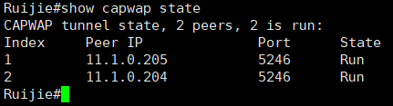​

　　在 AC 查看：

​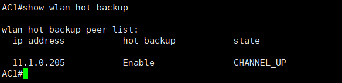​

# 安全策略

### 概述

　　防火墙是一种安全设备。它用于保护一个网络区域免受来自另一个网络区域的攻击和入侵，通长城常被应用于网络边界，例如企业互联网出口、企业内部业务边界、数据中心边界等。

​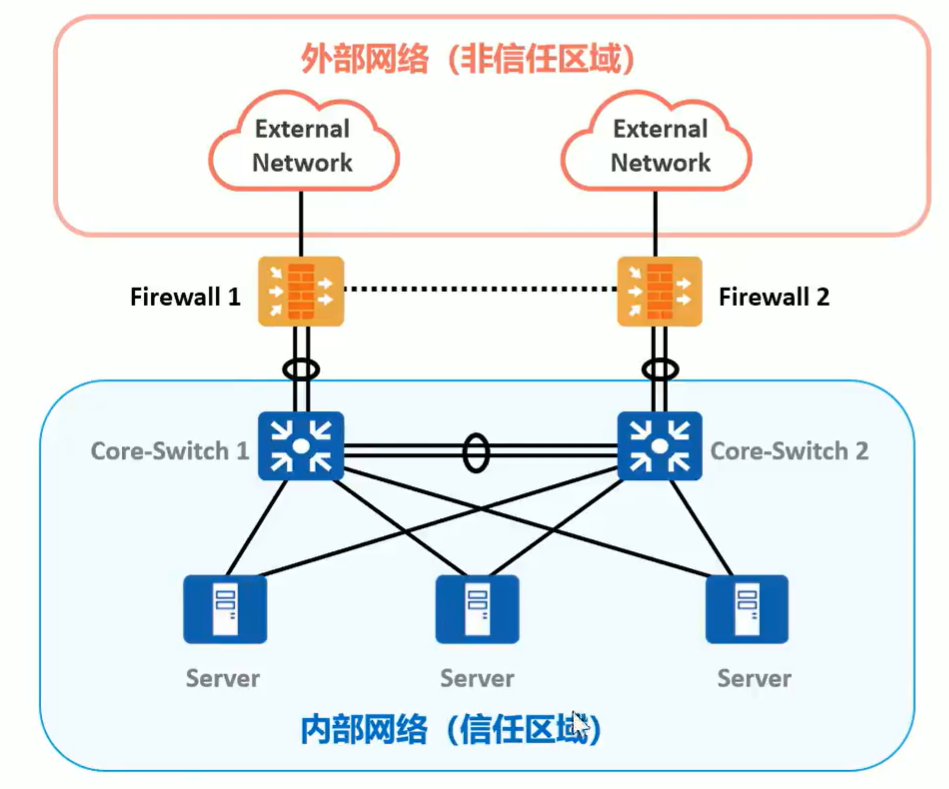​

　　安全无处不在。路由器和交换机构建了互联互通的网络，带来便利的同时也带来了安全隐患。

　　例如在网络边界，企业有了如下安全诉求

* 外部网络安全隔离
* 内部网络安全管控
* 内容安全过滤
* 入侵防御
* 防病毒

​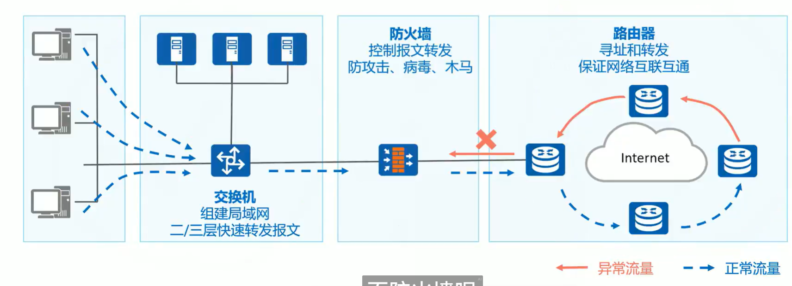​

　　交换机作用是接入终端和汇聚内部路由，组建内部互联互通的局域网。

　　路由器作用是路由的分发、寻址和转发，构建外部连接网络。

　　防火墙作用是流量控制和安全防护，区分和隔离不同安全区域。

　　**路由器与防火墙的转发流程对比**

​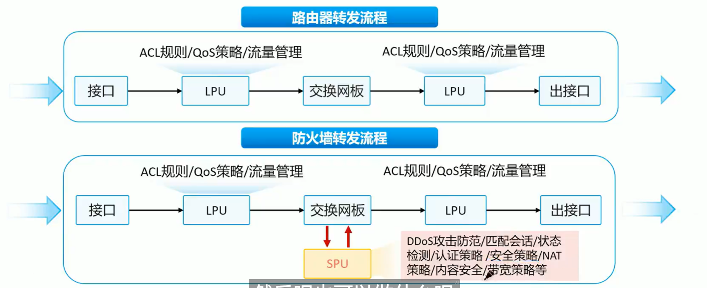​

　　**防火墙的典型应用场景**

​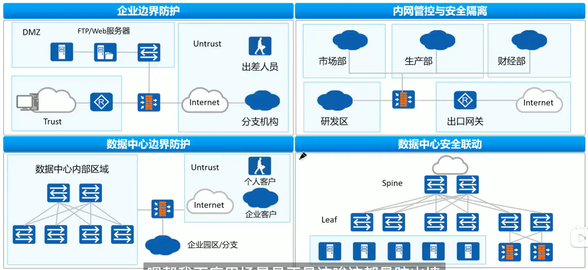​

　　 **包过滤防火墙**

　　包过滤是指基于五元组对每个数据包进行检测，根据配置的安全策略转发或丢弃数据包。

　　包过滤防火墙的基本原理是:通过配置访问控制列表(Access control List，ACL)实施数据包的过滤

​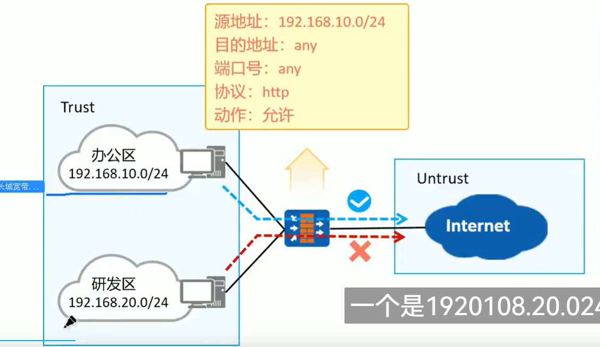​

　　包过滤防火墙的问题:

* 逐包检测，性能较低。
* ACL 规则难以适应动态需求。
* 通常不检查应用层数据。
* 无报文关联分析，容易被欺骗。

　　**报文检测防火墙**

　　状态检测是包过滤技术的发展，它考虑报文前后的关联性，检测的是连接状态而非单个报文。

　　状态检测防火墙就是支持状态检测功能的防火墙。

​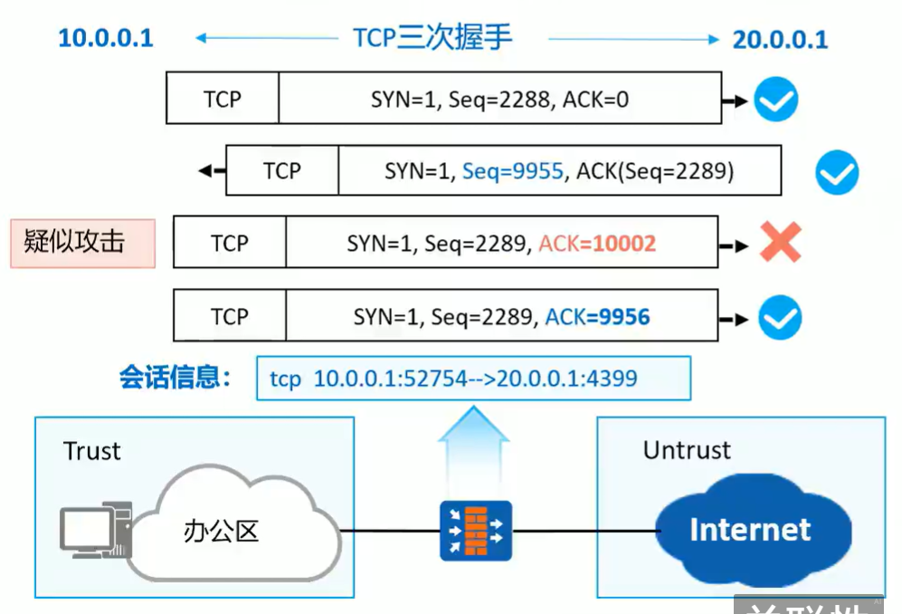​

　　本例中，状态检测防火墙检测到 10.0.0.1 与 20.0.0.1 建立 TCP 连接，并产生会话信息第三次握手报文不符合 TCP 连接状态，报文被丢舘瀾墠矶颔困弃。

　　NGFW（下一代防护墙）也是状态检测防火墙的一种。NGFW 在内容安全和处理性能有极大的提升。

　　**会话表**

　　会话表是用来记录 TCP、UDP、ICMH 协议连接状态的表项，是防火墙转发报文的重要依据

　　防火墙采用了基于“状态”的报文控制机制:只对首包或者少量报文进行检测就确定一条连接的状态，大量报文直接根据所属连接的状态进行控制。这种状态检测机制迅速提高了防火墙的检测和转发效率。会话表就是为了记录连接的状态而存在的。设备在转发 TCP、UDP 和 ICMP 报文时都需要查询会话表，来判断该报文所属的连接并采取相应的处理措施

​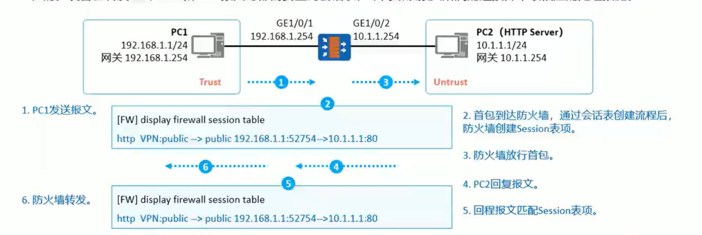​

#### 安全区域

　　安全区域(SecurityZone)，简称为区域(Zone)，是防火墙的重要概念。防火墙大部分的安全策略都基于安全区域实施。

　　一个安全区域是防火墙若干接口所连网络的集合，一个区域内的用户具有相同的安全属性，

​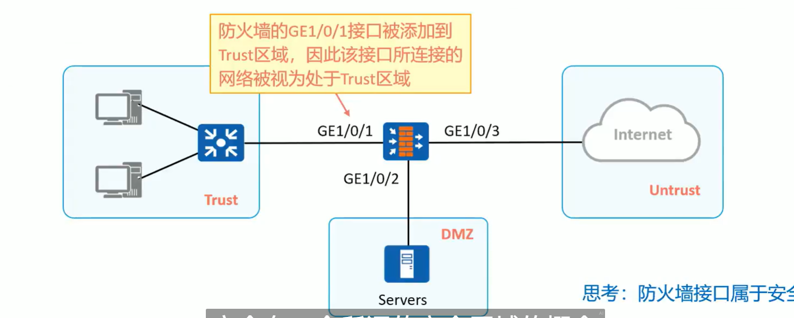​

　　‍

##### 默认安全区域

　　华为防火墙确认已创建四个区域，untrust、dmz、trust 和 local 区域。安全区域有以下特性:

* 默认的安全区域不能删除，也不允许修改安全优先级。
* 每个 zone 都必须设置一个安全优先级(Priority)，值越大，则 zone 的安全优先级越高。
* 用户可根据自己的需求创建自定义的 zone。

|非受信区域(untrust)|低安全级别区域，优先级为 5。|
| -------------------| --------------------------------------------------------------------------------------|
|非军事化区域(dmz)|中等安全级别区域，优先级为 50。|
|受信区域(trust)|较高安全级别区域，优先级为 85.|
|本地区域(local)|Local 区域定义的是设备本身，如设备的接口。Local 区域是最高安全级别区域，优先级为 100。|

　　高优先级可以访问低优先级的区域，而低优先级的区域不能访问高优先级的区域（华为除外）

​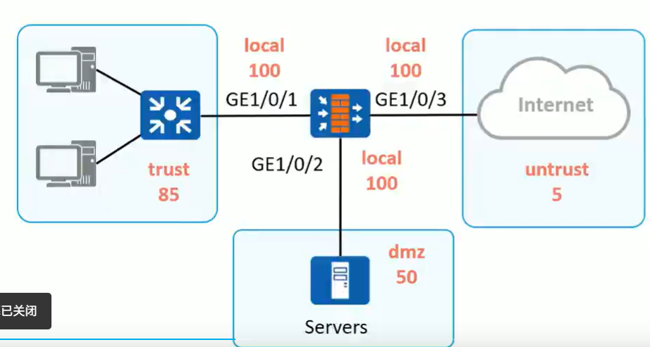​

#### 安全策略

　　安全策略的组成有匹配条件、:动作和安全配置文件(可选)。安全配置文件实现内容安全

　　安全策略动作如果为“允许”则可配置安全配置文件，如果为“禁止”则可配置反馈报文

​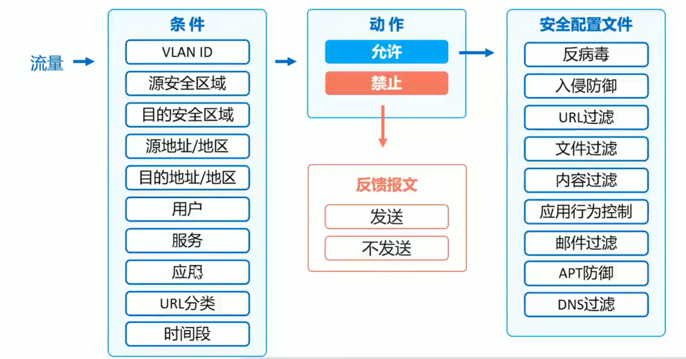​

#### 基础配置

　　注意：g0/0/0 为管理接口，不要连接业务设备

　　防火墙默认动作是丢弃，所以需要配置安全策略放行流量

```shell
// 创建区域 yu
[USG6000V1]firewall zone name yu
// 将接口划入安全区域
[USG6000V1-zone-yu]add interface g1/0/0
[USG6000V1-zone-yu]add interface g1/0/2
// 设置安全区域的优先级
[USG6000V1-zone-yu]set priority 60
// 注意：在实际使用中，一般不用自定义区域。而是使用trust untrust dmz区域

// 在接口下允许ping
[USG6000V1-GigabitEthernet1/0/0]service-manage ping permit 

// 创建安全策略
[USG6000V1]security-policy
[USG6000V1-policy-security]rule name ToU  // 规则名称
[USG6000V1-policy-security-rule-ToU]source-zone trust // 源区域
[USG6000V1-policy-security-rule-ToU]destination-zone untrust  // 目的区域
[USG6000V1-policy-security-rule-ToU]action permit // 动作 允许
[USG6000V1-policy-security-rule-ToU]source-address 192.168.1.1 32 // 定义源地址
// 策略可以由多条，从上向下匹配
 rule name ToU
  source-zone trust
  destination-zone untrust
  source-address 192.168.1.1 mask 255.255.255.255
  action permit
// 此时，trust区域已经可以访问untrust区域了。（防火墙接口属于local区域，所以不能访问其他区域主机）
```

```shell
// 查看防护墙的区域
[USG6000V1]dis zone 
2024-02-02 15:21:28.740 
local
 priority is 100
 interface of the zone is (0):
trust
 priority is 85
 interface of the zone is (1):
    GigabitEthernet0/0/0
untrust
 priority is 5
 interface of the zone is (0):
dmz
 priority is 50
 interface of the zone is (0):

// 查看会话表
[USG6000V1]dis firewall session table 
2024-02-03 13:19:03.730 
 Current Total Sessions : 0
[USG6000V1]dis firewall session table 
2024-02-03 13:19:16.450 
 Current Total Sessions : 4
 icmp  VPN: public --> public  192.168.1.1:20541 --> 1.1.1.1:2048
 icmp  VPN: public --> public  192.168.1.1:20797 --> 1.1.1.1:2048
 icmp  VPN: public --> public  192.168.1.1:19773 --> 1.1.1.1:2048
 icmp  VPN: public --> public  192.168.1.1:20285 --> 1.1.1.1:2048

// 查看会话详细信息
[USG6000V1]dis firewall session table verbose
2024-02-03 13:20:17.200 
 Current Total Sessions : 0
[USG6000V1]dis firewall session table verbose
2024-02-03 13:20:23.940 
 Current Total Sessions : 4
 icmp  VPN: public --> public  ID: c387ff040b8e050ed665be3d97
 Zone: trust --> untrust  TTL: 00:00:20  Left: 00:00:20
 Recv Interface: GigabitEthernet1/0/0
 Interface: GigabitEthernet1/0/1  NextHop: 1.1.1.1  MAC: 5489-98f3-61bd
 <--packets: 1 bytes: 60 --> packets: 1 bytes: 60
 192.168.1.1:38205 --> 1.1.1.1:2048 PolicyName: ToU

 icmp  VPN: public --> public  ID: c487ff040b8fdd013c165be3d95
 Zone: trust --> untrust  TTL: 00:00:20  Left: 00:00:18
 Recv Interface: GigabitEthernet1/0/0
 Interface: GigabitEthernet1/0/1  NextHop: 1.1.1.1  MAC: 5489-98f3-61bd
 <--packets: 1 bytes: 60 --> packets: 1 bytes: 60
 192.168.1.1:37693 --> 1.1.1.1:2048 PolicyName: ToU
...

// 查看目标端口为2048的详细会话信息
[USG6000V1]dis firewall session table verbose destination-port global 2048
2024-02-03 13:22:16.070 
 Current Total Sessions : 2
 icmp  VPN: public --> public  ID: c487ff040b8e48826df65be3df4
 Zone: trust --> untrust  TTL: 00:00:20  Left: 00:00:01
 Recv Interface: GigabitEthernet1/0/0
 Interface: GigabitEthernet1/0/1  NextHop: 1.1.1.1  MAC: 5489-98f3-61bd
 <--packets: 1 bytes: 60 --> packets: 1 bytes: 60
 192.168.1.1:62013 --> 1.1.1.1:2048 PolicyName: ToU

 icmp  VPN: public --> public  ID: c487ff040b8e5602a1a65be3df5
 Zone: trust --> untrust  TTL: 00:00:20  Left: 00:00:02
 Recv Interface: GigabitEthernet1/0/0
 Interface: GigabitEthernet1/0/1  NextHop: 1.1.1.1  MAC: 5489-98f3-61bd
 <--packets: 1 bytes: 60 --> packets: 1 bytes: 60
 192.168.1.1:62269 --> 1.1.1.1:2048 PolicyName: ToU

```

　　‍

#### VSYS

　　虚拟防护墙实例，参考 VPN 实例

　　虚拟防火墙与物理防火墙和其他虚拟防火墙之间<span data-type="text" id="" style="background-color: var(--b3-card-error-background); color: var(--b3-card-error-color);">完全隔离</span> IP 地址等可以重复。

　　创建虚拟防火墙时，会自动创建一个与虚拟防火墙同名的 VPN 实例。在虚拟防火墙的接口中配置时，会自动加入到 VPN 实例

```shell
[USG6000V1]vsys ena  // 全局开启vsys
[USG6000V1]vsys name A // 创建虚拟防火墙A
[USG6000V1-vsys-A]assign interface g1/0/2  // 将g1/0/2接口划入虚拟防火墙A
[USG6000V1]switch vsys A  // 切换到虚拟防火墙A
<USG6000V1-A>
```

　　‍

　　‍

　　‍

　　‍

　　‍

# 业务专题
