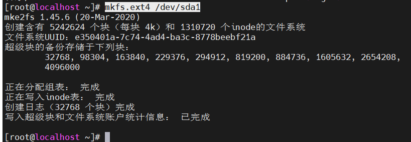

# Centos挂载新硬盘

　　Centos/linux 挂载新添加的硬盘

　　新添加磁盘格式化并挂载

　　**1.使用**​**​`lsblk`​**​ **查看磁盘设备.**

​​

　　**2.创建分区** `/dev/sda`​ 磁盘

　　执行 `fdisk /dev/sda`​

　　第一个命令输入 `n`​，添加新分区，参数可保持默认，直接回车

　　然后选择 `w`​ 将分区表写入磁盘并退出

​​

　　**3.格式化分区**

　　​`mkfs.ext4 /dev/sda1`​

​​

　　**4.创建挂载目录**

　　​`mkdir -p /data`​

　　**5.挂载磁盘**

　　​`mount /dev/sda1 /data`​

　　**6.查看是否挂载成功**

　　执行 `df -h`​

​​

　　可以看到，`/dev/sda1`​ 已经挂载到 `/data`​ 目录

　　**7. 开机自动挂载**

　　​`echo "/dev/sda1    /data    ext4    defaults    0 2" >> /etc/fstab`​

　　在 **Linux** 中，如果要让磁盘在每次开机后自动挂载到指定的目录下，我们需要将挂载信息写入  **/etc/fstab** 文件中。

　　 **/etc/fstab** 是 **Linux** 系统中用于存储文件系统挂载信息的文件。它包含了系统启动时需要挂载的所有文件系统的信息，以及挂载时使用的选项。

　　我们需要在  **/etc/fstab** 文件中添加一个新的行来描述我们要挂载的文件系统。每一行包含了如下信息：

1. 设备：要挂载的设备名称，例如 : **/dev/sdb1** 。
2. 挂载点：要将设备挂载到哪个目录下。
3. 文件系统类型：要挂载的文件系统类型，例如: **ext4** 。
4. 挂载选项：用于控制挂载行为的选项，例如: **noatime**（不更新访问时间）和 **defaults**（使用默认选项）等。
5. 挂载次序：系统应该以什么顺序挂载文件系统，例如: **0** 表示最先挂载。

　　**8. 卸载磁盘**

　　使用 `umount /data`​  即可解除挂载

​​

　　‍
