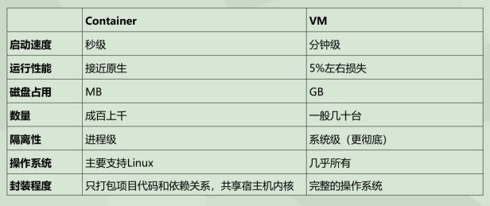
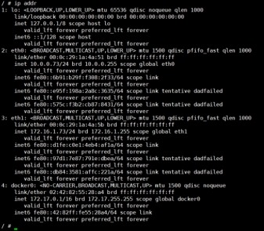
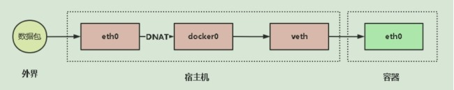
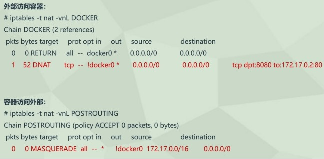
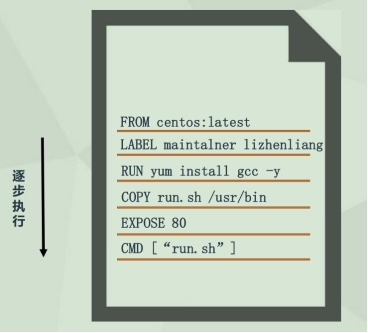

# Docker

# 1 D**ocker核心概述与安装**

## 1.1 **为什么要用容器**

1. 上线流程繁琐

    开发->测试->申请资源->审批->部署->测试等环节
2. 资源利用率低

    普遍服务器利用率低，造成过多浪费
3. 扩容/缩容不及时

    业务高峰期扩容流程繁琐，上线不及时
4. 服务器环境臃肿

    服务器越来越臃肿，对维护、迁移带来困难
5. (5) 环境不一致性

## **1.** 2 **docker是什么**

1. 使用最广泛的开源容器引擎
2. 一种操作系统级的虚拟化技术
3. 依赖于Linux内核特性：Namespace（资源隔离）和Cgroups（资源限制）
4. 一个简单的应用程序打包工具

## **1.** 3 **docker设计目标**

1.  提供简单的应用程序打包工具
2. 开发人员和运维人员职责逻辑分离
3. 多环境保持一致性

## **1.** 4 **docker基本组成**

​​

## **1.** 5 **容器vs虚拟机**

​​

​​

## **1.** 6 **docker应用场景**

1. 应用程序打包和发布
2. 应用程序隔离
3. 持续集成
4. 部署微服务
5. 快速搭建测试环境
6. 提供PaaS产品（平台即服务）

## **1.** 7 **安装docker**

　　Docker版本：

* 社区版（Community Edition，CE）
* 企业版（Enterprise Edition，EE）

　　支持平台：

* Linux（CentOS,Debian,Fedora,Oracle Linux,RHEL,SUSE和Ubuntu）
* Mac
* Windows

　　安装Docker

```shell
# 安装依赖包
[root@slavenode1 ~]# yum install -y yum-utils device-mapper-persistent-data lvm2

# 添加Docker软件包源
[root@slavenode1 ~]# yum-config-manager \
    --add-repo \
    https://download.docker.com/linux/centos/docker-ce.repo

# 更新为阿里云的源
[root@slavenode1 ~]# wget -O /etc/yum.repos.d/docker-ce.repo http://mirrors.aliyun.com/docker-ce/linux/centos/docker-ce.repo

# 清理源缓存
[root@slavenode1 ~]# yum clean all

# 安装Docker CE
[root@slavenode1 ~]# yum install -y docker-ce

# 启动Docker服务并设置开机启动
[root@slavenode1 ~]# systemctl start docker
[root@slavenode1 ~]# systemctl enable docker

# 查看docker版本
[root@slavenode1 ~]# docker -v
Docker version 19.03.12, build 48a66213fe

# 添加阿里云的镜像仓库
[root@slavenode1 ~]# mkdir -p /etc/docker
[root@slavenode1 ~]# tee /etc/docker/daemon.json <<-'EOF'
{
  "registry-mirrors": ["https://b1cx9cn7.mirror.aliyuncs.com"]
}

# 重启docker
[root@slavenode1 ~]# systemctl daemon-reload
[root@slavenode1 ~]# systemctl restart docker
```

　　在某些系统(kylin-ser)中，似乎直接 `yum install docker`​ 即可使用

# **2** D**ocker镜像管理**

## **2**.1 **什么是镜像**

1. 一个分层存储的文件，不是一个单一的文件
2. 一个软件的环境
3. 一个镜像可以创建N个容器
4.  一种标准化的交付
5. 一个不包含Linux内核而又精简的Linux操作系统

　　‍

## **2**.2 **镜像从哪里来**

　　Docker Hub是由Docker公司负责维护的公共镜像仓库，包含大量的容器镜像，Docker工具默认从这个公共镜像库下载镜像。

　　地址：https://hub.docker.com

## **2**.3 **镜像与容器联系**

　　镜像：类似于虚拟机镜像，一个只读模板

　　容器：通过镜像创建的运行实例

​​

## **2**.4 **镜像常用管理命令**

|指令|描述|
| ---------| --------------------------------------------------|
|ls|列出镜像|
|build|构建镜像来自Dockerfile|
|history|查看镜像历史|
|inspect|显示一个或多个镜像详细信息|
|pull|从镜像仓库拉取镜像, 分层下载，默认镜像版本latest|
|push|推送一个镜像到镜像仓库|
|rm|移除一个或多个镜像|
|prune|移除没有被标记或者没有被任何容器引用的镜像|
|tag|创建一个引用源镜像标记目标镜像|
|export|导出容器文件系统到tar归档文件|
|import|导入容器文件系统tar归档文件创建镜像|
|save|保存一个或多个镜像到一个tar归档文件|
|load|加载镜像来自tar归档或标准输入|

　　 **(1) 清理镜像**

```shell
docker image prune -f  # 不提示确认(-f)清除没有tag的镜像
docker image prune -a -f  # 不提示确认(-f)清除没有被容器使用的镜像
```

　　 **(2) export、import方式导入镜像**

```shell
docker export 容器名/容器ID > 打包容器名.tar
docker import 打包容器名.tar 自定义镜像名:版本号
```

　　 **(3) save、load方式导入镜像**

```shell
docker save -o 打包镜像名.tar 镜像名称:版本号
docker load -i 打包镜像名.tar
```

　　 **(4) docker export和docker save的区别**

1. docker save保存的是镜像（image），docker export保存的是容器（container）。

2. docker load用来载入镜像包，docker import用来载入容器包，但两者都会恢复为镜像。

3. docker load不能对载入的镜像重命名，而docker import可以为镜像指定新名称。

4. docker export导出的镜像文件大小小于save保存的镜像。

5. docker save 没有丢失镜像的历史，可以回滚到之前的层（layer）。（查看方式：docker images --tree）docker export 再导入时会丢失镜像所有的历史，所以无法进行回滚操作（docker tag <LAYER ID> <IMAGE NAME>）。

　　 **(5) 其它命令**

　　​`docker images`​ # 列出所有镜像

　　​`docker image rm -f 镜像名或ID`​ # 强制(-f)删除镜像，如果镜像正在被运行的容器使用不会被删除。

　　​`docker image rm -f $(docker images -q)`​ # 强制(-f)删除所有的镜像，如果镜像正在被运行的容器使用不会被删除。

## **2**.5 镜像存储核心技术(联合文件系统Union**FS)**

　　镜像怎么高效存储，难道像虚拟机那样一个容器对应一个独立的镜像文件，这样对于密集型容器，磁盘占用率太大，引入联合文件系统，将镜像多层文件联合挂载到容器文件系统。

​​

　　镜像存储目录: /var/lib/docker/overlay2/

　　容器目录: /var/lib/docker/containers/

　　读文件: 容器层->镜像层

　　修改文件: 容器层->镜像层

　　MergedDir(视图层)

　　UpperDir(容器层)

　　LowerDir(镜像层)

　　Storage Driver: overlay2（aufs、overlay、devicemapper）

## **2**.6 镜像存储核心技术(写时复制Cow **)**

​​

　　了解联合文件系统后，我们知道，镜像是只读的，类似共享形式让多个容器使用，如果要在容器里修改文件，即镜像里的文件，那该怎么办呢，这时就需要引入写时复制（copy-on-write），需要修改文件操作时，会先从镜像里把要写的文件复制到自己的文件系统中进行修改。

​​

　　docker存储优化建议：

* 使用SSD固态硬盘
* 使用卷作为频繁读写文件的工作目录，绕过存储驱动，减少抽象的开销

# **3** D**ocker容器管理**

## **3**.1 **创建容器常用选项**

|-i, --interactive|交互式|
| --------------------| ------------------------------------------------|
|-t, --tty|分配一个伪终端|
|-d, --detach|运行容器到后台|
|-e, --env|设置环境变量|
|-p, --publish list|发布容器端口到主机|
|-P, --publish-all|发布容器所有EXPOSE的端口到宿主机随机端口|
|--name string|指定容器名称|
|-h, --hostname|设置容器主机名(同时也加入到/etc/hosts文件解析)|
|--add-host host:ip|设置容器hosts|
|--dns|设置容器resolv.conf|
|--ip string|指定容器IP，只能用于自定义网络|
|--network|连接容器到一个网络(bridge,host,none)|
|--mount mount|将文件系统附加到容器|
|-v, --volume list|绑定挂载一个卷|
|--restart string|容器退出时重启策略，默认no，可选值：always|

　　参数后面加的值可以用"="或空格隔离。

　　创建容器时，容器会挂载宿主机三个文件(宿主机修改，需要重启容器)：

```shell
hostname         --hostname
hosts --add-host host:ip
resolv.conf       --dns
```

## **3**.2 **容器资源限制**

|选项|描述|
| -----------------------------| -------------------------------------------------|
|-m，--memory|容器可以使用的最大内存量|
|--memory-swap|允许交换到磁盘的内存量，表示内存和 Swap 的总和|
|--memory-swappiness=<0-100>|容器使用SWAP分区交换的百分比（0-100，默认为-1）|
|--oom-kill-disable|禁用OOM Killer|
|--cpus|可以使用的CPU数量|
|--cpuset-cpus|限制容器使用特定的CPU核心，如(0-3, 0,1)|
|--cpu-shares|CPU共享（相对权重）|

　　参数后面加的值可以用"="或空格隔离。

## **3**.3 **容器资源配额扩容**

　　**1 内存限额**

　　允许容器最多使用500M内存和100M的Swap，并禁用OOM Killer：

　　​`docker run -d --name nginx03 --memory="500m" --memory-swap="600m" --oom-kill-disable nginx`​

```shell
--memory用于限制内存使用量，而--memory-swap则表示内存和Swap的总和。

# 如果只指定了--memory，则最终--memory-swap将会设置为--memory的两倍。
# 如果--memory-swap和--memory设置了相同值，则表示不使用Swap。
# 如果设置了--memory-swap参数，则必须设置--memory参数。
# --oom-kill-disable：触发oom异常不杀死容器(当内核检测到没有足够的内存来运行系统的

某些功能时，触发OOM异常，并且会使用OOM Killer来杀掉一些进程，腾出空间以保障
系统的正常运行。
```

　　**2 CPU限额**

　　(1) 允许容器最多使用一个半的CPU

　　​`docker run -d --name nginx04 --cpus="1.5" nginx`​

　　(2) 允许容器最多使用50%的CPU

　　​`docker run -d --name nginx05 --cpus=".5" nginx`​

## **3.** 4 **管理容器常用命令**

|选项|描述|
| --------------------| -------------------------------|
|ls|列出正在运行的容器|
|inspect|查看一个或多个容器详细信息|
|exec|在运行容器中执行命令|
|commit|创建一个新镜像来自一个容器|
|cp|拷贝文件/文件夹到一个容器|
|logs|获取一个容器日志|
|port|列出或指定容器端口映射|
|top|显示一个容器运行的进程|
|stats|显示容器资源使用统计|
|stop/start/restart|停止/启动/重启/一个或多个容器|
|rm|删除一个或多个容器|
|prune|移除已停止的容器|

　　​`docker container ps`​ # 列出正在运行的容器

　　​`docker container ps -l `​# 列出最近一次操作的容器

　　​`docker container ps -a`​   # 列出所有容器，包括停止和运行的容器

　　​`docker container ps -aq`​  # 列出所有容器ID

　　​`docker container prune -f`​ # 不提示确认(-f)删除已停止的容器

　　​`docker container rm -f 容器名或id`​ # 强制(-f)删除指定的容器

　　​`docker container exec -it 容器名或id  bash`​ # 进入容器

　　实际上 docker ps 和 docker container ps 作用完全一致，当然 官方更推荐 docker container 的用法

　　‍

　　更新容器配置(默认创建的容器使用宿主机所有资源)

　　本质：

　　​`echo "1000m" > /sys/fs/cgroup/memory/docker/<容器id>/memory.limit_in_bytes`​

　　​`echo "500m" > /sys/fs/cgroup/memory/docker/<容器id>/memory.limit_in_bytes`​

　　​`docker container rm -f $(docker ps -qa)`​ # 强制(-f)删除所有的容器(包括正在运行的容器)

## **3.** 5 容器实现核心技术(**Namespace)**

　　1 在容器化中，一台物理计算机可以运行多个不同操作系统，那就需要解决“隔离性”，彼此感知不到对方存在，有问题互不影响。Linux内核从2.4.19版本开始引入了namespace概念，其目的是将特定的全局系统资源通过抽象方法使得namespace中的进程看起来拥有自己隔离的资源。Docker就是借助这个机制实现了容器资源隔离。

　　2 Linux的Namespace机制提供了6种不同命名空间

　　​`ll /proc/$$/ns`​ # 查看进程的命名空间

1.  IPC：隔离进程间通信
2.  MOUNT：隔离文件系统挂载点
3.  NET：隔离网络协议栈
4.  PID：隔离进程号，进程命名空间是一个父子结构，子空间对父空间可见
5.  USER：隔离用户
6.  UTS：隔离主机名和域名

## **3.** 6 容器实现核心技术(CGroups **)**

　　**1 Docker利用namespace实现了容器之间资源隔离**

　　但是namespace不能对容器资源限制，比如CPU、内存。如果某一个容器属于CPU密集型任务，那么会影响其他容器使用CPU，导致多个容器相互影响并且抢占资源。如何对多个容器的资源使用进行限制就成了容器化的主要问题。

　　**2 引入Control Groups（简称CGroups）**

　　限制容器资源CGroups，所有的任务就是运行在系统中的一个进程，而CGroups以某种标准将一组进程为目标进行资源分配和控制。例如CPU、内存、带宽等，并且可以动态配置。

　　**3 CGroups主要功能**

1. 限制进程组使用的资源数量（Resource limitation），可以为进程组设定资源使用上限，例如内存
2. 进程组优先级控制（Prioritization），可以为进程组分配特定CPU、磁盘IO吞吐量。
3. 记录进程组使用的资源数量（Accounting），例如使用记录某个进程组使用的CPU时间。
4. 进程组控制（Control），可以将进程组挂起和恢复。

　　**4 查看cgroups可控制的资源**

　　​`ls /sys/fs/cgroup/ -l`​

1.  `blkio`​ # 对快设备的IO进行限制。
2.  `cpu`​ # 限制CPU时间片的分配，与cpuacct挂载同一目录。
3.  `cpuacct`​# 生成cgroup中的任务占用CPU资源的报告，与cpu挂载同一目录。
4.  `cpuset`​ # 给cgroup中的任务分配独立的CPU（多核处理器）和内存节点。
5.  `devices`​ # 允许或者拒绝 cgroup 中的任务访问设备。
6.  `freezer`​ # 暂停/恢复 cgroup 中的任务。
7.  `hugetl`​ # 限制使用的内存页数量。
8.  `memory`​ # 对cgroup 中任务的可用内存进行限制，并自动生成资源占用报告。
9.  `net_cls`​ # 使用等级识别符（classid）标记网络数据包，这让Linux流量控制
10. 程序（tc）可以识别来自特定从cgroup 任务的数据包，并进行网络限制。
11.  `net_prio`​ # 允许基于cgroup设置网络流量的优先级。
12.  `perf_event`​ #允许使用perf工具来监控cgroup。
13.  `pids`​ # 限制任务的数量。
14.  `/sys/fs/cgroup/<资源名>/docker/<容器ID>`​ # 容器实际资源限制位置

## **3**.7 docker**核心组件之间关系**

​​

1. Docker Daemon

    Docker守护进程，负责与Docker Clinet交互，并管理镜像、容器。
2. Containerd

    是一个简单的守护进程，向上给Docker Daemon提供接口，向下通过containerd-shim结合runC管理容器。
3. runC

    一个命令行工具，它根据OCI标准来创建和运行容器

​​

## **3.** 8 **小结**

1. Namespace

    命名空间，Linux内核提供的一种对进程资源隔离的机制，例如进程、网络、挂载点等资源。
2. CGroups

    控制组，Linux内核提供的一种对进程组限制资源的机制；例如CPU、内存等资源。
3. UnionFS

    联合文件系统，支持将不同位置的目录挂载到同一虚拟文件系统，形成一种分层的模型。

# **4** D**ocker容器数据持久化**

## **4**.1 **将数据从宿主机挂载到容器中的三种方式**

　　数据卷目录名称，指定的源目录/指定的源文件 ：指定容器内的目录/指定容器内的文件/(如果目标不存在会自动创建)

　　容器被删除后不会删除卷，卷是容器的一个独立的资源。

1. volumes

    Docker管理宿主机文件系统的一部分(/var/lib/docker/volumes)
2. bind mounts

    将宿主机上的任意位置的文件或者目录挂载到容器中
3. tmpfs

    挂载存储在主机系统的内存中，而不会写入主机的文件系统。如果不希望将数据持久存储在任何位置，可以使用tmpfs，同时避免写入容器可写层提高性能。

​​

## **4**.**2 Volume**

　　1 **管理卷**

```shell
docker volume create nginx-vol

docker volume ls

docker volume inspect nginx-vol
```

　　2 **用卷创建一个容器**

```shell
docker run -d --name=nginx-test --mount src=nginx-vol,dst=/usr/share/nginx/html nginx

docker run -d --name=nginx-test -v nginx-vol:/usr/share/nginx/html nginx
```

　　3 **清理**

```shell
docker stop nginx-test

docker rm nginx-test

docker volume rm nginx-vol
```

　　4 **volume 挂载注意点(目录对目录)：**

1. 宿主机目录不存在也能挂载成功
2. 如果宿主机目录为空，会继承容器目录中的全部内容
3. 如果宿主机目录不为空，会覆盖容器目录中的全部内容
4. 源数据卷由docker进行管理

## **4**.**3 Bind Mounts**

　　**1 用卷创建一个容器**

```shell
docker run -d --name=nginx-test --mount type=bind,src=/app/wwwroot,dst=/usr/share/nginx/html nginx

docker run -d --name=nginx-test -v /app/wwwroot:/usr/share/nginx/html nginx
```

　　**2 验证绑定**

```shell
docker inspect nginx-test
```

　　**3 清理**

```shell
docker stop nginx-test

docker rm nginx-test
```

　　**4 注意点**

　　bind mounts 注意点(目录对目录或文件对文件):

1. 宿主机文件或者目录必须存在才能成功挂载
2. 宿主机目录覆盖容器目录中的全部内容
3. 宿主机文件覆盖容器中指定的文件
4. 使用-v参数挂卷时，如果源目录不存在也会创建

## **4**.4 **小结**

　　**1 Volume特点**

1. 将容器的数据存储在远程主机或其他存储上（间接）。
2. 多个运行容器之间共享数据，多个容器可以同时挂载相同的卷。
3. 当容器停止或被移除时，该卷依然存在。
4. 当明确删除卷时，卷才会被删除。
5. 将数据从一台Docker主机迁移到另一台时，先停止容器，然后备份卷的目录(/var/lib/docker/volumes/)。

　　‍

　　**2 Bind Mounts特点**

1. 从主机共享配置文件到容器。
2. 在Docker主机上的开发环境和容器之间共享源代码。例如，可以将Maven target

    目录挂载到容器中，每次在Docker主机上构建Maven项目时，容器都可以访问构建

    的项目包。
3. 当Docker主机的文件或目录结构保证与容器所需的绑定挂载一致时。

# **5** D**ocker容器网络**

## **5**.1 **四种网络模式**

### 5.1.1bridge

　　​`--net=bridge`​

　　默认网络，Docker启动后创建一个docker0网桥，默认创建的容器也是添加到这个网桥中。

　　也可以自定义网络，相比默认的具备内部DNS发现，可以通过容器名(--name)进行容器之间网络通信，可以解决因重建容器导致容器ip发生改变，导致前端应用无法连接后端服务的问题。

　　**小结：**

1. 不通容器之间，主机和容器之间是完全隔离的。

2. docker0桥类似于一个交换机，把这个桥下的所有容器都连接起来，起到一个二层数据转发的功能。

3. veth设备解决容器和宿主机之间网络命名空间隔离的问题。

4. 宿主机能到达的外部网络，容器都能够到达。

5. 宿主机可以访问其下的所有宿主机。

6. 同一宿主机内不同桥接网卡下的容器不能通信。

### 5.1.2 host

　　​`--net=host`​

　　容器不会获得一个独立的network namespace，而是与宿主机共用一个。这就意味着容器不

　　会有自己的网卡信息，而是使用宿主机的，容器除了网络，其他都是隔离的。

　　示例：

```shell
docker run -d -it --name nginx_v4 --net=host busybox sh

docker exec -it nginx_v4 sh
```

​​

　　进入nginx_v4容器内查看的网卡信息和宿主机上的网卡相同。

　　‍

### 5.1.3 none

　　​`--net=none`​

　　获取独立的network namespace，但不为容器进行任何网络配置，需要我们手动配置。

　　示例：

```shell
docker run -d -it --name nginx_v3 --net none busybox sh

docker exec -it nginx_v3 sh
```

​​

　　除了本地环回网卡(lo)，没有其他的网卡信息。

　　‍

### 5.1.4 container

　　​`--net=container:Name/ID`​

　　与指定的容器使用同一个network namespace，具有同样的网络配置信息，两个容器除了网络，其他都还是隔离的。

　　示例：

　　nginx_v1使用的bridge网络，nginx_v2共享nginx_v1的网络

```shell
docker run -d -it --name nginx_v1 busybox sh

docker run -d -it --name nginx_v2 --net=container:nginx_v1 busybox sh

docker exec -it nginx_v1 sh
```

​​

　　​`docker exec -it nginx_v2 sh`​

​​

### 5.1.5 查看网络docker网络信息

　　​`docker network ls`​

​​

## **5**.2 **Docker网络模型**

​​

1. veth pair

    成对出现的一种虚拟网络设备，数据从一端进，从另一端出。用于解决网络命名空间之间隔离。
2. docker0

    网桥是一个二层网络设备，通过网桥可以将Linux支持的不同的端口连接起来，并实现类似交换机那样的多对多的通信。

## **5**.3 **容器网络访问原理**

　　1 外部访问容器

​​

　　2 容器访问外部

​​

　　3 小结

​​

## **5.** 4 容器网络实现核心技术(Iptables **)**

### 5.4.1 iptables基础知识

　　1 四表五链

|表|链|
| --------------------------| ------------------------------------------------|
|filter(过滤)|INPUT、OUTPUT、FORWARD|
|nat(地址转换)|PREROUTING、POSTROUTING、OUTPUT|
|mangle(拆包、修改、封装)|INPUT、OUTPUT、PREROUTING、POSTROUTING、OUTPUT|
|raw(数据包状态跟踪)|PREROUTING、OUTPUT|

　　2 操作命令

​​

### 5.4.1.2 容器网络实现核心技术

　　1 Iptables 工作流程

​​

　　INPUT链 # 接收的数据包是本机(入站)时，应用此链中的规则。

　　OUTPUT链 # 本机向外发送数据包(出站)时，应用此链中的规则。

　　FORWARD链 # 需要通过防火墙中转发送给其他地址的数据包(转发)时，应用测链中的规则。

　　PREROUTING链 # 在对数据包做路由选择之前，应用此链中的规则。DNAT

　　POSTROUTING链 # 在对数据包做路由选择之后，应用此链中的规则。SNAT

## **5.** 5 **跨主机网络(实现Docker主机容器通信)**

　　通过桥接的方式实现

### 5.5.1 **实验环境**

|主机名|IP地址|安装软件|
| ----------| -------------| -----------------|
|etcd|172.16.1.71|etcd|
|docker01|172.16.1.72|docker、flannel|
|docker02|172.16.1.73|docker、flannel|

　　Flannel是CoreOS维护的一个网络组件，在每个主机上运行守护进程，负责维护本地路由转发，Flannel使用ETCD来存储容器网络与主机之间的关系。其他主流容器跨主机网络方案有：Weave、Calico、OpenvSwitch

​​

### 5.5.2 **ectd安装配置**

　　在172.16.1.71节点上操作

　　(1) 安装ectd

```shell
# yum install etcd -y

# egrep -v "^$|^#" /etc/etcd/etcd.conf

ETCD_DATA_DIR="/var/lib/etcd/default.etcd"
ETCD_LISTEN_CLIENT_URLS="http://172.16.1.71:2379"
ETCD_NAME="default"
ETCD_ADVERTISE_CLIENT_URLS="http://172.16.1.71:2379"

# systemctl start etcd.service

# systemctl enable etcd.service

# netstat -tunlp | grep etcd
```

​​

　　(2) 向etcd写入子网

```shell
# etcdctl --endpoints="http://172.16.1.71:2379" set /atomic.io/network/config '//{ "Network":"172.17.0.0/16", "Backend": //{"Type": "vxlan"//} //}'
```

　　注意：子网地址不要和宿主机上的网段冲突

### 5.5.3 **flannel安装并配置**

　　在172.16.1.72、73节点上操作

　　(1) 安装flannel

```shell
# yum install flannel -y

# egrep -v "^$|^#" /etc/sysconfig/flanneld

FLANNEL_ETCD_ENDPOINTS="http://172.16.1.71:2379"
FLANNEL_ETCD_PREFIX="/atomic.io/network"

# systemctl start flanneld.service

# systemctl enable flanneld.service
```

　　(2) 查看flannel网络信息

　　172.16.1.72节点

```shell
# cat /var/run/flannel/docker

DOCKER_OPT_BIP="--bip=172.17.72.1/24"
DOCKER_OPT_IPMASQ="--ip-masq=true"
DOCKER_OPT_MTU="--mtu=1450"
DOCKER_NETWORK_OPTIONS=" --bip=172.17.72.1/24 --ip-masq=true --mtu=1450"
```

　　172.16.1.73节点

```shell
# cat /var/run/flannel/docker

DOCKER_OPT_BIP="--bip=172.17.66.1/24"
DOCKER_OPT_IPMASQ="--ip-masq=true"
DOCKER_OPT_MTU="--mtu=1450"
DOCKER_NETWORK_OPTIONS=" --bip=172.17.66.1/24 --ip-masq=true --mtu=1450"
```

### 5.5.4 **配置Docker使用flannel生成的网络信息**

　　在172.16.1.72、73节点上操作

　　(1) 配置docker systemd引用flannel的分配的网络

```shell
# vim /usr/lib/systemd/system/docker.service

EnvironmentFile=/run/flannel/docker
ExecStart=/usr/bin/dockerd -H fd:// --containerd=/run/containerd/containerd.sock $DOCKER_NETWORK_OPTIONS
```

　　(2) 重启docker

　　​`systemctl restart docker`​

### 5.5.5 查看172.16.1.72、73节点的网卡信息

　　(1) 172.16.1.72节点

​​

　　(2) 172.16.1.73节点

​​

### 5.5.6 设置iptables允许转发

　　在172.16.1.72、73节点上操作

　　​`iptables -P FORWARD ACCEPT`​

### 5.5.7 测试

　　(1) 在172.16.1.72节点上创建名为nginx_v72的容器

```shell
docker run -d -it --name nginx_v72 busybox sh

docker exec -it nginx_v72 sh
```

　　在172.16.1.73节点上创建名为nginx_v73的容器

```shell
docker run -d -it --name nginx_v73 busybox sh

docker exec -it nginx_v73 sh
```

　　(3) 容器nginx_v72 ping 容器nginx_v73

​​

　　(4) 容器nginx_v73 ping 容器nginx_v72

​​

　　(5) 在宿主机下访问容器ip地址

1. 使用docker01主机ping nginx_v72、nginx_v73容器

​​

2. 使用docker02主机ping nginx_v72、nginx_v73容器

​​

### 5.5.8 查看宿主机路由

　　(1) 172.16.1.72节点

​​

　　(2) 172.16.1.73节点

​​

# **6** Dockerfile**定制容器镜像**

## **6**.1 **Dockerfile介绍**

​​

## **6**.2 **Dockerfile常用指令**

|指令|描述|
| ------------| ----------------------------------------------------------------------|
|FROM|构建新镜像是基于哪个镜像|
|LABEL|标签|
|RUN|构建镜像时运行的Shell命令|
|COPY|拷贝文件或目录到镜像中|
|ADD|解压压缩包并拷贝|
|ENV|设置环境变量|
|USER|USER为RUN、CMD和ENTRYPOINT执行命令指定运行用户|
|EXPOSE|声明容器运行的服务端口|
|WORKDIR|WORKDIR为RUN、CMD、ENTRYPOINT、COPY和ADD设置工作目录|
|CMD|CMD运行容器时默认执行，如果有多个CMD指令，最后一个生效|
|ENTRYPOINT|ENTRYPOINT如果与CMD一起用，CMD将作为ENTRYPOINT的默认参数，如果有多个|

## **6**.3 **docker build构建镜像**

　　​`Usage: docker build [OPTIONS] PATH | URL | - [flags]`​

　　Options:

　　​`-t, --tag list`​ # 镜像名称

　　​`-f, --file string`​ # 指定Dockerfile文件位置，如果构建文件是Dockerfile，可以不指定。

　　​`PATH:`​ # 构建镜像时所需文件的存放目录，Dockerfile文件中从宿主机上读取文件的命令都是从这个目录里读取的。

```shell
docker build -t shykes/myapp .

docker build -t shykes/myapp -f /path/Dockerfile /path

docker build -t shykes/myapp http://www.example.com/Dockerfile
```

## **6**.4 **CMD与ENTRYPOINT区别**

### 6.4.1 CMD用法

　　(1) exec形式(首选)

```shell
CMD ["executable", "param1", "param2"]

CMD ["/usr/bin/sh", "-c", "executable param1 $param2"]
```

　　传递Dockerfile中定义的变量

　　(2) shell形式

　　​`CMD command param1 param2`​

### 6.4.2 ENTRYPOINT用法

　　(1) exec形式(首选)

```shell
ENTRYPOINT [ "executable", "param1", "param2"]

ENTRYPOINT [ "/usr/bin/sh", "-c", "executable param1 $param2"]
```

　　传递Dockerfile中定义的变量

　　(2) shell形式

　　​`ENTRYPOINT command param1 param2`​

### 6.4.3 ENTRYPOINT和CMD结合使用

```shell
ENTRYPOINT [ "executable" ]

CMD [ "param1", "param2" ]
```

　　CMD作为ENTRYPOINT的默认参数

### 6.4.4 小结

1. CMD和ENTRYPOINT指令都可以用来定义运行容器时所使用的默认命令，

    使用方法相同。
2. Dockerfile至少指定一个CMD或ENTRYPOINT，如果Dockerfile中定义了

    多个CMD或多个ENTRYPOINT，只有最后一个定义生效。
3. docker run指定<command>时，将会覆盖CMD，ENTRYPOINT不会被覆盖。
4. 如果是可执行文件，希望docker run时传参，应该使用ENTRYPOINT作执

    行文件，CMD用作ENTRYPOINT的默认参数。好处是，用户不传参时使用默

    认的CMD参数，用户自定义传参时覆盖默认参数，方便用户灵活传参

## **6.5  前端项目镜像构建与部署(Nginx**)

### 6.5.1 Dockerfile文件

　　​`ls /tools/DockerFile/nginx/`​

```shell
Dockerfile  nginx-1.19.1.tar.gz  nginx.conf  php.conf
```

　　​`cat /tools/DockerFile/nginx/Dockerfile`​

```shell
FROM centos:7
# 指定了构建镜像的基础镜像。在这里，它使用的是 CentOS 7 的官方镜像

LABEL maintainer liuchang
# 给镜像添加了一个标签，用来标识维护者的名字，这里是 “liuchang”。

RUN yum install -y gcc gcc-c++ make \
    openssl-devel pcre-devel gd-devel \
    iproute net-tools telnet wget curl && \
    yum clean all && \
    rm -rf /var/cache/yum/*
# 在容器内部执行命令，安装构建 Nginx 所需的依赖包，包括 GCC、C++ 编译器、Make 工具、OpenSSL 开发包、PCRE 开发包、GD 开发包、网络工具等。

RUN groupadd -g 1200 nginx && \
    useradd -M -s /sbin/nologin -u 1200 -g nginx nginx
# 创建了一个名为 “nginx” 的用户组和一个名为 “nginx” 的用户，用户不会分配家目录，且不能通过登录shell登录。

COPY nginx-1.19.1.tar.gz /
# 将本地的 Nginx 源代码压缩包复制到容器的根目录。

RUN tar -zxf nginx-1.19.1.tar.gz && \
    cd nginx-1.19.1 && \
    ./configure --prefix=/usr/local/nginx \
    --with-http_ssl_module \
    --with-http_stub_status_module \
    --user=nginx \
    --group=nginx && \
    make -j 4 && make install && \
	# 解压 Nginx 源代码，并编译安装 Nginx。指定了 Nginx 的安装路径、启用了 SSL 模块和状态模块，并指定了运行 Nginx 服务的用户和组。
    rm -rf /usr/local/nginx/html/* && \
    cd / && rm -rf nginx* && \
	# 删除 Nginx 默认的 HTML 内容，并清理源代码和解压后的文件。
    ln -sf /usr/share/zoneinfo/Asia/Shanghai /etc/localtime
	# 设置容器内的时区为亚洲/上海。

ENV PATH $PATH:/usr/local/nginx/sbin
# 将 Nginx 的可执行文件路径添加到容器的 PATH 环境变量中，这样可以在任何地方直接执行 nginx 命令。

COPY nginx.conf /usr/local/nginx/conf/nginx.conf
# 将本地的 Nginx 配置文件复制到容器的 Nginx 配置目录，替换默认的配置文件。

WORKDIR /usr/local/nginx
# 设置工作目录为 Nginx 的安装目录

EXPOSE 80
# 声明容器在运行时将监听 80 端口。

CMD ["nginx", "-g", "daemon off;"]
# 指定了容器启动时运行的命令。这里告诉 Nginx 以前台模式运行，而不是作为守护进程。
```

### 6.5.2 构建nginx镜像

　　​`docker build -t nginx:v1 -f /tools/DockerFile/nginx/Dockerfile /tools/DockerFile/nginx/`​

　　​`docker images`​

```shell
REPOSITORY      TAG              IMAGE ID          CREATED           SIZE
nginx            v1               24ed66fdbc2d      17 minutes ago      337MB
```

　　‍
