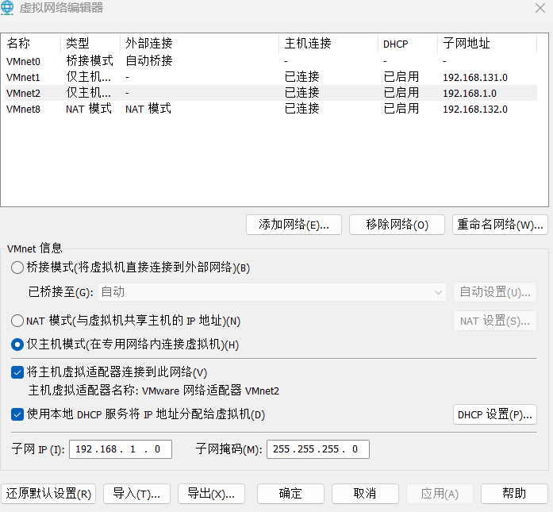
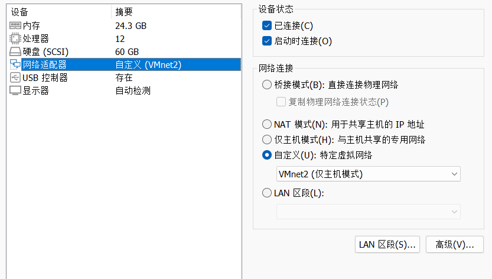
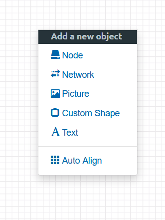
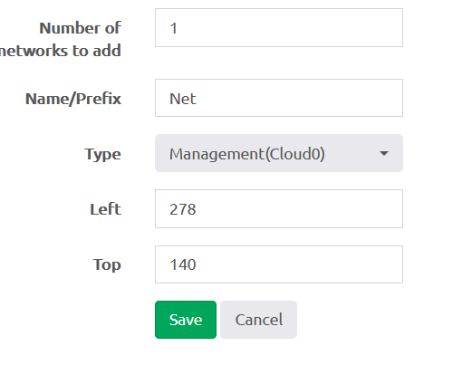
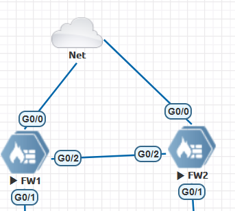
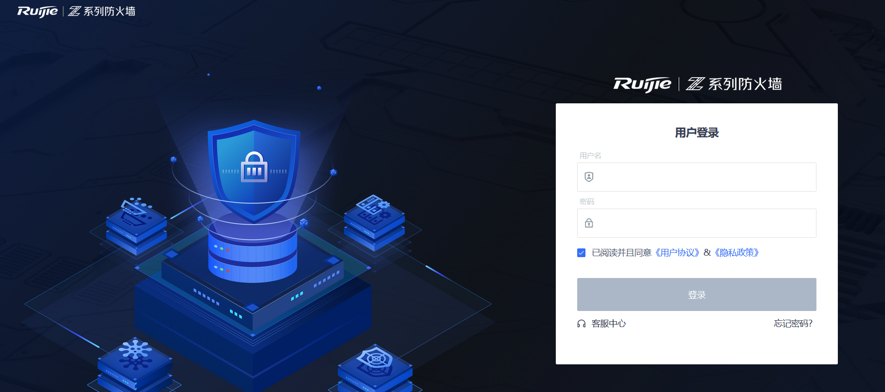
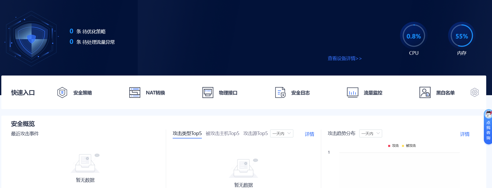

# EVE桥接网卡访问锐捷防火墙

# eve桥接物理网卡

## 虚拟机配置

　　1.创建一块新的网卡

　　设置为仅主机模式，选择“将主机虚拟适配器连接到次网络”选上，  选择“使用本地DHCP服务将IP分配给虚拟机”，

　　网段可以自定义。我这边因为锐捷防火墙镜像的默认IP为`192.168.1.200`​所以设置了`192.168.1.0`​网段。

​​

　　2.将虚拟机的网卡改为自定义，选择刚才添加的网卡，保存重启EVE虚拟机

​​

## EVE配置

　　1.eve选择“network”

​​

　　2.type这里选择“Management(Cloud0)”

​​

　　3.连接防火墙的G0/0口

​​

　　4.浏览器访问`htps://192.168.1.200`​即可访问防火墙的web页面。默认密码：`admin/firewall`​。

​​

​​

　　‍

　　参考链接：[http://ie.oldc.cc/article/1](http://ie.oldc.cc/article/1)
