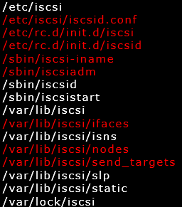
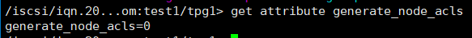

# ISCSI

　　本文详细介绍iSCSI相关的内容，以及在Linux上如何实现iSCSI。

# 第1章 iSCSI简介

## 1.1 scsi和iscsi

　　传统的SCSI技术是存储设备最基本的标准协议，但通常需要设备互相靠近并用SCSI总线连接，因此受到物理环境的限制。

　　**iSCSI(Internet Small Computer System Interface)，顾名思义，iSCSI是网络上的SCSI，也就是通过网络连接的SCSI。** 它是由IBM公司研究开发用于实现在IP网络上运行SCSI协议的存储技术，能够让SCSI接口与以太网技术相结合，使用iSCSI协议基于以太网传送SCSI命令与数据，克服了SCSI需要直接连接存储设备的局限性，使得可以跨越不同的服务器共享存储设备，并可以做到不停机状态下扩展存储容量。

　　iSCSI实现的是IP SAN，数据传输基于以太网。

## 1.2 iSCSI数据封装

　　initiator向target发起scsi命令后，在数据报文从里向外逐层**封装SCSI协议报文、iSCSI协议报文、tcp头、ip头。**

​​

　　封装是需要消耗CPU资源的，如果完全以软件方式来实现iscsi，那么所有的封装过程都由操作系统来完成。在很繁忙的服务器上，这样的资源消耗可能不太能接受，但好在它是完全免费的，对于不是非常繁忙的服务器采用它可以节省一大笔资金。

　　除了软件方式实现，还有硬件方式的initiator(TOE卡和HBA卡)，通过硬件方式实现iSCSI。由于它们有控制芯片，可以帮助或者完全替代操作系统对协议报文的封装。

* TOE卡，操作系统首先封装SCSI和iSCSI协议报文，而TCP/IP头则交由TOE内的芯片来封装，这样就能减少一部分系统资源消耗。
* HBA卡，操作系统只需封装SCSI，剩余的iSCSI协议报文还有TCP/IP头由HBA芯片负责封装。

​​

　　显然，HBA卡实现iSCSI是最好的方案，但是它要花钱，还不便宜。

# 第2章 配置使用iSCSI

## 2.1 部署iscsi前的说明和需求描述

　　**1.说明**

* (1).iscsi在target端是工作在套接字上的，监听端口默认是3260，且使用的是tcp连接。因为要保证数据安全性，使用udp可能会导致丢包。
* (2).iscsi对客户端有身份认证的需要，有两种认证方式：基于IP认证，基于CHAP认证(双方都进行验证，即双向认证)。

　　**2.需求描述**

　　找一台服务器A作为iscsi的target，将其中的一块磁盘或分区/dev/sdb当作要共享的存储设备共享出去。再找两台服务器B和C当作iscsi initiator连接到target的共享存储上。

　　大致拓扑图如下：

​​

​​

　　请确保服务器A上已经关闭了防火墙或者允许了3260端口。

　　下图描述了使用iSCSI的大致过程，后文内容虽然因为介绍各种用法而显得比较杂，但根据这张图的流程，阅读时很容易搞清楚相关内容。

​​

## 2.2 安装target

　　在服务器A上：

```mipsasm
yum -y install scsi-target-utils
```

　　查看该工具包生成了哪些文件。

```bash
rpm -ql scsi-target-utils
/etc/rc.d/init.d/tgtd   #
/etc/sysconfig/tgtd
/etc/tgt/targets.conf   #
/usr/sbin/tgt-admin     #
/usr/sbin/tgt-setup-lun
/usr/sbin/tgtadm        #
/usr/sbin/tgtd
/usr/sbin/tgtimg
/usr/share/doc/scsi-target-utils-1.0.24
/usr/share/doc/scsi-target-utils-1.0.24/README
/usr/share/doc/scsi-target-utils-1.0.24/README.iscsi
/usr/share/doc/scsi-target-utils-1.0.24/README.iser
/usr/share/doc/scsi-target-utils-1.0.24/README.lu_configuration
/usr/share/doc/scsi-target-utils-1.0.24/README.mmc
/usr/share/man/man5/targets.conf.5.gz
/usr/share/man/man8/tgt-admin.8.gz
/usr/share/man/man8/tgt-setup-lun.8.gz
/usr/share/man/man8/tgtadm.8.gz
```

　　其中`/usr/sbin/tgtadm`​和`/usr/sbin/tgt-admin`​的都是管理和配置target的工具，它们作用是一样的，只不过tgtadm是命令行下的工具，而tgt-admin是根据配置文件`/etc/tgt/targets.conf`​调用tgtadm来实现。另外`/etc/init.d/tgtd`​是服务启动脚本。

　　这个时候已经可以启动target服务了。

```yaml
service tgtd start
netstat -tnlp | grep 3260
tcp     0    0 0.0.0.0:3260    0.0.0.0:*   LISTEN    2074/tgtd
tcp     0    0 :::3260         :::*        LISTEN    2074/tgtd
```

　　加入开机自启动。

```csharp
chkconfig tgtd on
```

### 2.2.1 tgtadm命令用法说明

　　tgtadm是一个高度模式化的命令，他们的模式很相近。有三个模式:target、logicalunit、account。指定模式时使用--mode选项。再使用--op来指定对应模式下的选项。另外，使用-lld指定driver，有两种driver：iscsi和iser，基本都会使用iscsi。

```xml
tgtadm --help
  --lld <driver> --mode target --op new --tid <id> --targetname <name>
                        add a new target with <id> and <name>. <id> 
                        must not be zero.
  --lld <driver> --mode target --op delete [--force] --tid <id>
                        delete the specific target with <id>.
                        With force option, the specific target is 
                        deleted even if there is an activity.
  --lld <driver> --mode target --op show
                        show all the targets.
  --lld <driver> --mode target --op show --tid <id>
                        show the specific target's parameters.
  --lld <driver> --mode target --op update --tid <id> --name <param> --value <value>
                        change the target parameters of the specific
                        target with <id>.
  --lld <driver> --mode target --op bind --tid <id> --initiator-address <address>
  --lld <driver> --mode target --op bind --tid <id> --initiator-name <name>
                        enable the target to accept the specific initiators.
  --lld <driver> --mode target --op unbind --tid <id> --initiator-address <address>
  --lld <driver> --mode target --op unbind --tid <id> --initiator-name <name>
                        disable the specific permitted initiators.
  --lld <driver> --mode logicalunit --op new --tid <id> --lun <lun> \
                        --backing-store <path> --bstype <type> --bsoflags <options>
                        add a new logical unit with <lun> to the specific
                        target with <id>. The logical unit is offered
                        to the initiators. <path> must be block device files
                        (including LVM and RAID devices) or regular files. 
                        bstype option is optional.
                        bsoflags supported options are sync and direct
                        (sync:direct for both).
  --lld <driver> --mode logicalunit --op delete --tid <id> --lun <lun>
                        delete the specific logical unit with <lun> 
                        that the target with <id> has.
  --lld <driver> --mode account --op new --user <name> --password <pass>
                        add a new account with <name> and <pass>.
  --lld <driver> --mode account --op delete --user <name>
                        delete the specific account having <name>.
  --lld <driver> --mode account --op bind --tid <id> --user <name> [--outgoing]
                        add the specific account having <name> to 
                        the specific target with <id>.
                        <user> could be <IncomingUser> or <OutgoingUser>.
                        If you use --outgoing option, the account will be
                        added as an outgoing account.
  --lld <driver> --mode account --op unbind --tid <id> --user <name>
                        delete the specific account having <name> from 
                        specific target.
  --control-port <port> use control port <port>
```

​​

　　看上去很复杂。不过可以将上面的语法抛去driver部分，target、logicalunit和account这3种模式下的操作方式简化后如下：

​​

　　这样就简单的多了。

　　上表中的选项都是长格式的，但他们都有对应的短格式选项。

​​

　　target和logicalunit两个模式随后就会有示例，而account是和CHAP认证有关的，将在后文和配置文件放在一块解释。

### 2.2.2 target的命名方式

```css
iqn.YYYY-mm.<reversed domain name>[:identifier]
```

* ​`iqn`​是iscsi qualified name的缩写，就像fqdn一样。
* ​`YYYY-mm`​描述的是此target是何年何月创建的，如2016-06。
* ​`<reversed domain name>`​是域名的反写，起到了唯一性的作用，如longshuai.com写为com.longshuai。
* ​`identifier`​是可选的，是为了知道此target相关信息而设的描述性选项，如指明此target用到了哪些硬盘。

　　示例：

```makefile
iqn.2016-06.com.longshuai:test.disk1
```

### 2.2.3 创建一个target

　　需要说明的是，下面的实验全是使用命令行工具tgtadm来实现的。但是修改配置文件然后使用tgt-admin也是一样可以的，且target数量多的时候，更建议使用配置为文件加载的方式。最重要的一点是，使用命令行方式创建的target及lu等是临时生效的，在target服务重启后就失效了，再手动建立它们是一件相当麻烦的事情。

　　如下，分别使用了长格式选项和短格式选项分别创建和显示target。注意：创建target时，tid不能是0，因为0是被系统保留的。

```css
tgtadm --lld iscsi --mode target --op new --tid 1 --targetname iqn.2017-03.com.longshuai:test.disk1
tgtadm -L iscsi -m target -o show
```

​​

　　以上是第一个target的信息。从信息中可以看到：

* 创建完第一个target后自动就创建了一个LUN为0的logicalunit(以后简称lu)，这是固定给每个target都使用的LUN。
* 此lu的类型是controller。
* "backing store type"为null，即此lu没有向下扩展逻辑设备，因为它是lun控制器。也就是说这个LUN是保留作为lu控制器用的。
* "I_T nexus information"记录的是initiator与此target的联结关系，nexus的意思就是联结、关联，在后文介绍initiator的时候会展示此处信息。

　　现在向此target添加一个lu，使用的是新插入的磁盘/dev/sdc(全新，未进行分区)。当然，使用新建立的分区或者已经格式化后的分区做实验也可以。

```bash
tgtadm -L iscsi -m logicalunit -o new -t 1 -l 1 -b /dev/sdc
```

　　然后再来查看target的信息。

```sql
tgtadm -L iscsi -m target -o show
```

​​

　　从LUN 1信息中可以看出，lu type已经是disk而非controller，且显示了此lu的容量大小是42950M。另外还显示了使用的逻辑设备是/dev/sdc，且是可读可写的(rdwr)。

　　但到目前为止，该target都没有定义共享给谁，这从target信息的最后两行Account/ACL information中可以看出。

　　现在将此target绑定一个共享IP，即说明此IP可以连接该target。**这是iSCSI的一种认证方式：IP认证。除此之外，还有基于account的CHAP认证，详细内容见后文。IP认证的作用是允许Initiator发现该target，并允许做进一步的基account的CHAP认证。**

```cmake
tgtadm -L iscsi -m target -o bind -t 1 -I 192.168.100.0/24
tgtadm -L iscsi -m target -o show
```

​​

　　再添加一个10G分区/dev/sdb1为逻辑存储单元，lun=2。

```sql
tgtadm -L iscsi -m logicalunit -o new -t 1 -l 2 -b /dev/sdb1
tgtadm -L iscsi -m target -o show
```

​​

　　由于该lu是在target id=1下的，所以192.168.100.0这个网段的机器也能访问此设备。也就是说，**共享出去的是target级别而不是lu级别的。**

　　然后在iscsi的"客户端"initiator安装iscsi-initiator-utils看看是否能看见这两个设备。如果想急着看结果，请跳到[安装initiator](https://www.cnblogs.com/f-ck-need-u/p/9067906.html#blog2.3)的章节中。

### 2.2.4 tgt-admin和配置文件targets.conf

　　tgt-admin是读取配置文件的选项然后调用tgtadm来执行的工具。它的选项很多可以简化tgtadm命令的书写，毕竟tgtadm的选项太长太多余了，除此之外也有一些其他的作用用于更细致的配(tgtadm配置的太粗糙了)。用法如下：

​​

　　tgt的配置文件为`/etc/tgt/targets.conf`​，该配置文件的格式很容易读懂，能实现的target和lun的配置方式多种多样。它的配制方法在后文会和iscsi initiator的配置文件/etc/iscsi/iscsid.conf放在一起介绍。

　　下面就使用tgt-admin为当前的target生成对应的配置文件来稍作分析。

　　首先列出当前target的信息。

```yaml
bash> tgt-admin -s
Target 1: iqn.2017-03.com.longshuai:test.disk1
    System information:
        Driver: iscsi
        State: ready
    I_T nexus information:
    LUN information:
        LUN: 0
            Type: controller
            SCSI ID: IET     00010000
            SCSI SN: beaf10
            Size: 0 MB, Block size: 1
            Online: Yes
            Removable media: No
            Prevent removal: No
            Readonly: No
            Backing store type: null
            Backing store path: None
            Backing store flags: 
        LUN: 1
            Type: disk
            SCSI ID: IET     00010001
            SCSI SN: beaf11
            Size: 10742 MB, Block size: 512
            Online: Yes
            Removable media: No
            Prevent removal: No
            Readonly: No
            Backing store type: rdwr
            Backing store path: /dev/sdb1
            Backing store flags: 
        LUN: 2
            Type: disk
            SCSI ID: IET     00010002
            SCSI SN: beaf12
            Size: 42950 MB, Block size: 512
            Online: Yes
            Removable media: No
            Prevent removal: No
            Readonly: No
            Backing store type: rdwr
            Backing store path: /dev/sdc
            Backing store flags:  
    Account information:
    ACL information:
        192.168.100.0/24
```

　　使用`--dump`​选项输出为配置文件的格式，并将其重定向到/tmp/tgt.conf中。

```bash
bash> tgt-admin --dump | tee /tmp/tgt.conf
default-driver iscsi

<target iqn.2017-03.com.longshuai:test.disk1>
        backing-store /dev/sdb1
        backing-store /dev/sdc
        initiator-address 192.168.100.0/24
</target>
```

　　由此可以看出，全局使用的driver是iscsi，名称为`iqn.2017-03.com.longshuai:test.disk1`​的target有两个backing-store，即逻辑设备，分别是/dev/sdb1和/dev/sdc。但是要注意，这样导出的配置文件指定的LUN号码可能会在tgt-admin读取并执行的时候更换位置，但这并不会有任何影响。

　　现在将已有的target全部删除，再去查看信息就已经没有了。

```css
tgt-admin --delete ALL
tgt-admin -s
```

　　再从刚才生成的配置文件中读取并启动。然后查看信息，发现已经有了target。

```bash
tgt-admin -e -c /tmp/tgt.conf
tgt-admin -s
```

　　关于tgt-admin其他选项也都很简单，都是从字面意思就能看出来用法的。所以就不多说明了。

　　另外需要说明的是在tgt的配置文件`/etc/tgt/targets.conf`​中有一行：

```shell
#include /etc/tgt/temp/*.conf
```

　　将此行注释后，以后可以导出配置文件到/etc/tgt/temp目录下并以.conf作为后缀，重启tgtd服务即可重新加载，而不需要在手动加载了。不过有个问题，使用dump出来的配置文件会有default-driver指令行，而这一行在主配置文件中也有，且他们是不能出现多次的，否则将会报错，所以需要将主配置文件中的default-driver指令注释掉。

## 2.3 安装initiator

　　安装Initiator的机器成为iscsi的发起者，initiator本身的意思就是"发起者"，在这里即iscsi的"客户端"程序的意思。

　　此处先在B服务器(192.168.100.5)上安装iscsi-initiator-utils。另一台C服务器后面再做测试。

```mipsasm
yum -y install iscsi-initiator-utils
```

### 2.3.1 相关文件和目录说明

　　下面是此安装包生成的一些重要文件和目录(只列出了必要的部分)。

```undefined
rpm –ql iscsi-initiator-utils
```

​​

　　其中:

* ​`/etc/iscsi/iscsid.conf`​：是iscsi发起者的配置文件。
* ​`/etc/rc.d/init.d/{iscsi,iscsid}`​：服务启动脚本，只需要启动iscsi即可，因为它会自动调用iscsid脚本。
* ​`/sbin/iscsi-iname`​：为initiator命名的工具。就像target有自己独特的iqn名称，initiator也有独特的名称标识自己。
* ​`/sbin/iscsiadm`​：initiator的管理工具，在initiator上的绝大部分的命令都是通过它来执行的。
* ​`/var/lib/iscsi/ifaces`​：指定使用哪个网卡接口和target通信。
* ​`/var/lib/iscssi/nodes`​：该目录中保存了发现的target，分别是以target_name命名的目录，在target_name目录下又保存了以"target_ip,port"(如192.168.100.151,3260)的配置文件，这个配置文件是本initiator向对应的target 发起连接时的参数，这些参数继承于`/etc/iscsi/iscsid.conf`​。
* ​`/var/lib/iscsi/send_targets`​：该目录中也存储了一个或多个以"target_IP,port"命名的目录，记录的是discovery的历史记录，对于discovery成功的则在对应的目录会有文件，否则是空目录。

　　其中`IP,port`​的记录方式称为protal，是入口、入门的意思。

　　需要注意的是，建议不要把iscsi和iscsid设置为开机自启动，因为开机时如果它找不到target的时候会一直卡在那里等待。可以将其放在rc.local文件中来启动。

​​

```bash
chkconfig iscsi off
chkconfig iscsid off
echo "service iscsi start" >>/etc/rc.d/rc.local
```

### 2.3.2 iscsi-iname命令

　　和target一样，initiator也需要一个独特的名称来标识自己让target识别。initiator在连接target的时候，会读取/etc/iscsi/initiatorname.iscsi中的内容作为自己的iname。

　　初始状态的iname如下：

```shell
bash> cat /etc/iscsi/initiatorname.iscsi   
InitiatorName=iqn.1994-05.com.redhat:ceb390801983
```

　　其中后缀"ceb390801983"是一个随机串。

　　也可以为iname生成一个别名，只需在此文件中另起一行写入以下内容：

```ini
InitiatorAlias=INAME_ALIAS
```

　　如:

```ini
InitiatorAlias=client.longshuai.com
```

　　若要自指定iname，可以手动修改该文件。也可以使用iscsi-iname工具来生成iname并保存到该文件。

```makefile
bash> iscsi-iname
iqn.1994-05.com.redhat:5a804fa64f8e
bash> iscsi-iname
iqn.1994-05.com.redhat:ca4eb16bbddd
```

　　可以看出iscsi-iname生成的iname前缀都是一样的，修改的只是后缀部分的随机串。如果要指定前缀，则使用-p选项。

```avrasm
bash> iscsi-iname -p iqn.2017-03.com.longshuai
iqn.2017-03.com.longshuai:adb6a5ec885c
```

　　所以，通过iscsi-iname向/etc/iscsi/initiatorname.iscsi中写入一个iname。

```javascript
echo Initiatorname=`iscsi-iname -p iqn.2017-03.com.longshuai` >/etc/iscsi/initiatorname.iscsi
```

　　然后重启下iscsi服务。

```undefined
service iscsi restart
```

### 2.3.3 iscsiadm命令

　　iscsiadm也是一个模式化的命令，使用-m指定mode。mode有:discovery、node、session、iface。一般就用前两个mode。

* ​`discovery`​：发现某服务器是否有target输出，以及输出了哪些target。发现target后会生成target数据库discoverydb。
* ​`node`​：管理跟某target的关联关系。在discovery发现了target后，是否要跟target建立关系，是否要删除已有的关系或者解除已有的关系等。删除关联关系不仅会解除关联，还会删除发现target后生成的discoverydb。
* ​`session`​：会话管理。
* ​`iface`​：接口管理。

### 2.3.4 发现target(discovery)

　　即使用discovery模式。

```haskell
iscsiadm -m discovery [ -d debug_level ] [ -t type -p ip:port -I ifaceN [ -p ip:port ]

-d：输出调试信息，级别从0-8。出现错误的时候用来判断错误来源是很有用处的，可以使用级别2。
-I：指定发现target时通信接口。
-t type：有三种type(sendtargets,SLP,iSNS)，一般只会用到sendtargets，可以简写为st。
-p IP:PORT：指定要发现target的IP和端口，不指定端口时使用默认的3260。
```

　　现在可以进行discovery了。这里发起两次，第一次是正确的，第二次是错误的(该IP上没有target或主机未启动)。

```vbnet
bash> iscsiadm -m discovery -t st -p 192.168.100.151:3260
192.168.100.151:3260,1 iqn.2017-03.com.longshuai:test.disk1

bash> iscsiadm -m discovery -t st -p 192.168.100.152:3260
iscsiadm: cannot make connection to 192.168.100.152: No route to host
iscsiadm: cannot make connection to 192.168.100.152: No route to host
iscsiadm: cannot make connection to 192.168.100.152: No route to host
iscsiadm: cannot make connection to 192.168.100.152: No route to host
iscsiadm: cannot make connection to 192.168.100.152: No route to host
iscsiadm: cannot make connection to 192.168.100.152: No route to host
iscsiadm: connection login retries (reopen_max) 5 exceeded
iscsiadm: Could not perform SendTargets discovery: encountered connection failure
```

　　如果出现以上错误，检查下是不是防火墙阻挡了，是不是IP地址写错了。

　　在发现了target后，在`/var/lib/iscsi`​中的nodes和send_targets目录中就有了文件。

```bash
tree /var/lib/iscsi/
```

​​

　　可以看到，对于discovery失败的在send_targets目录中也会记录，只不过是空目录。在nodes目录和正确discovery到的send_targets子目录中都有几个配置文件，都是些参数信息。而且可以看到，send_targets中的目录是nodes目录的软链接。

　　如果想重新发现已存在的target时，可以清空nodes目录中对应的项，然后再discovery。

　　使用`service iscsi status`​可以查看到相关信息项。

​​

### 2.3.5 关联和解除关联target(node)

　　关联target的作用是initiator和target建立session，建立session后，initiator上就可以查看、访问、操作target上的scsi设备。

　　有两种关联方法，一是关联所有，一是指定单个target进行关联。

```sql
iscsiadm -m node [-d debug_level] [-L all,manual,automatic] [-U all,manual,automatic]
iscsiadm -m node [-d debug_level] [[-T targetname -p ip:port -I ifaceN] [-l | -u ]] [-o operation]

-d：指定debug级别，有0-8个级别。
-L和-U：分别是登录和登出target，可以指定ALL表示所有发现的target，或者manual指定。
-l和-u：分别是登录和登出某一个target。
-T：用于-l或-u时指定要登录和登出的targetname。
-o：对discoverydb做某些操作，可用的操作有new/delete/update/show，一般只会用到delete和show。
```

　　例如，使用单个的关联方式关联target。其中target_name可以通过命令`iscsiadm -m node`​查看。

```yaml
bash> iscsiadm -m node
192.168.100.151:3260,1 iqn.2017-03.com.longshuai:test.disk1

bash> iscsiadm -m node -T iqn.2017-03.com.longshuai:test.disk1 -p 192.168.100.151:3260 -l
Logging in to [iface: default, target: iqn.2017-03.com.longshuai:test.disk1, portal: 192.168.100.151,3260] (multiple)
Login to [iface: default, target: iqn.2017-03.com.longshuai:test.disk1, portal: 192.168.100.151,3260] successful.
```

　　实际上，在执行discovery的时候很可能就已经自动执行了关联，所以再次关联很可能什么消息也看不到。如果是这样的话，需要先退出session，再进行关联。当然也可能是直接显示successful，这样就说明原来discovery的时候是没有主动关联的。

```r
iscsiadm -m node -T iqn.2017-03.com.longshuai:test.disk1 -p 192.168.100.151:3260 -u
```

　　此时fdisk -l看看是否已经多出了两块硬盘出来。

```bash
bash> fdisk -l

Disk /dev/sda: 21.5 GB, 21474836480 bytes
255 heads, 63 sectors/track, 2610 cylinders
Units = cylinders of 16065 * 512 = 8225280 bytes
Sector size (logical/physical): 512 bytes / 512 bytes
I/O size (minimum/optimal): 512 bytes / 512 bytes
Disk identifier: 0x0005ff67

   Device Boot      Start         End      Blocks   Id  System
/dev/sda1   *           1          32      256000   83  Linux
Partition 1 does not end on cylinder boundary.
/dev/sda2              32        2356    18666496   83  Linux
/dev/sda3            2356        2611     2048000   82  Linux swap / Solaris

Disk /dev/sdb: 10.7 GB, 10742183424 bytes
64 heads, 32 sectors/track, 10244 cylinders
Units = cylinders of 2048 * 512 = 1048576 bytes
Sector size (logical/physical): 512 bytes / 512 bytes
I/O size (minimum/optimal): 512 bytes / 512 bytes
Disk identifier: 0x00000000


Disk /dev/sdc: 42.9 GB, 42949672960 bytes
64 heads, 32 sectors/track, 40960 cylinders
Units = cylinders of 2048 * 512 = 1048576 bytes
Sector size (logical/physical): 512 bytes / 512 bytes
I/O size (minimum/optimal): 512 bytes / 512 bytes
Disk identifier: 0x00000000
```

　　现在就可以对这两块逻辑盘进行分区格式化(创建文件系统)，并投入使用。

　　此时先看下target端的target信息。

```cmake
tgt-admin -s | less
```

​​

　　其中I_T nexus表示initiator到target的关联信息，nexus的值是该initiator关联到target的次数。多个initiator会显示多个I_T nexus信息。这里可以看到只有一个I_T nexus，说明只有一个initiator进行了关联。

### 2.3.6 iSCSI的数据不安全性(不同步性)

　　现在在initiator上将/dev/sdb进行格式化，并向其中写入一个文件。

```bash
parted /dev/sdb mklabel gpt
parted /dev/sdb mkpart /dev/sdb1 ext4 1 10G
mkfs.ext4 /dev/sdb1
parted /dev/sdb print
mount /dev/sdb1 /mnt/
echo "haha" > /mnt/test.txt
```

　　然后配置服务器C(192.168.100.6)，让其作为另一台initiator。

```shell
bash> yum -y install iscsi-initiator-utils
bash> iscsiadm -m discovery -t st -p 192.168.100.151:3260
bash> iscsiadm -m node -T iqn.2017-03.com.longshuai:test.disk1 -p 192.168.100.151:3260 -l
bash> fdisk -l
bash> mount /dev/sdb1 /mnt

bash> ls /mnt
lost+found  test.txt
```

　　不出所料，C服务器也能挂载/dev/sdb1，且在B服务器写入的test.txt文件也已经同步过来了。

　　再看看此时target的target信息。

```yaml
bash> tgt-admin -s
Target 1: iqn.2017-03.com.longshuai:test.disk1
    System information:
        Driver: iscsi
        State: ready
    I_T nexus information:
        I_T nexus: 1
            Initiator: iqn.2017-03.com.longshuai:b01d684ad13f
            Connection: 0
                IP Address: 192.168.100.5
        I_T nexus: 2
            Initiator: iqn.1994-05.com.redhat:42b7f829d2ec
            Connection: 0
                IP Address: 192.168.100.6
```

　　现在在C服务器上，向/dev/sdb1挂载的目录/mnt下写入一个文件，看看是否会同步到B服务器上。

```bash
echo "hehe" >/mnt/test1.txt
```

　　在192.168.100.5上执行：

```bash
ls /mnt/
lost+found  test.txt

echo "heihei" >/mnt/test3.txt
```

　　显然，test1.txt并没有同步到B服务器上。同理，此时B中再写入文件也不会同步到C上。

　　那么在C上卸载/mnt，然后再次挂载会有什么情况呢？

```bash
umount /mnt
mount /dev/sdb1 /mnt

ls /mnt
lost+found  test3.txt  test.txt
```

　　没看错，test1.txt确实没了。这就是使用iscsi出现的问题，多个主机同时使用逻辑存储，数据会冲突并且不能及时同步而导致数据丢失。

　　所以，**iscsi一定要配合集群文件系统或者分布式文件系统来使用以防止上述问题。**

### 2.3.7 initiator开机一直处于等待状态

　　该问题在前文描述过。

　　出现这个问题是因为initiator端设置了iscsi或iscsid开机自启动，正好又无法和target联系，如通信出现故障、target处于关机状态、target中的tgtd服务未启动、target上的target_id和target_name等配置改变了。

　　总而言之，开机自启动的时候无法正常关联/var/lib/iscsi目录下记录的target就会出现此问题。

　　解决办法也是建议的办法是把iscsi和iscsid的开机自启动关闭掉，然后把启动他们的命令放到rc.local中。

　　如果已经遇到了无法正常开机的情况，那么可以多等待些时间，或者修改target端让target端能够和initiator匹配上。如target端本来是关机状态，将其开机即可。

## 2.4 targetcli相关配置

　　‍

　　概述：这篇文章来介绍LIO下的用户态工具targetcli来配置iSCSI服务

　　虚拟机环境：centos7.x（内核版本3.10.0-862.el7.x86_64）

　　IP分别为192.168.1.200/201

# targetcli安装

　　centos一般都自带了此工具，没有的话去官网下载，这里就不再介绍

# 快速创建IP-SAN

　　1.命令行输入targetcli进入交互界面，在交互界面可以使用ls,cd等命令灵活简单的操作，如图所示，最上层目录包括backstores、iscsi等，如果有FC或Infiniband的话，还会有其余的一些子模块如qla2xxx等

​​

　　2.创建卷资源

　　使用cd进入/backstores/block目录，

　　cd backstores/block

　　然后创建卷资源，使用块设备/dev/sdb

　　create dev=/dev/sdb name=sdb

　　提示sdb设备正在被使用，重新选择/dev/sdc来创建卷资源，提示创建成功（readonly属性表示读写权限，wwn号为卷资源的唯一标号）

​​

　　3.创建iSCSI

　　快速创建一个iSCSI服务的步骤如下：

　　a.首先创建一个iqn

　　b.在iqn下添加提供服务的IP以及需要映射的卷

　　c.设置认证

​​

　　 操作如下：

　　这里介绍一个技巧，在交互界面输入cd，可以进入下图界面，可以灵活快速地跳到指定目录

​​

　　接下来在iscsi目录下创建iqn

​​

　　然后在iqn的对应目录下添加服务IP，映射卷和权限设置

​​

　　initiator端发现：可以看到已经可以发现登录过来的逻辑卷

　　发现命令：iscsiadm -m discovery -t st -p IP

　　登录命令：在发现命令后面加入-l或者iscsiadm -m node -T IQN -l

　　登出命令：iscsiadm -m node -T IQN -u 如 iscsiadm -m node -T iqn.2018-10.hzhrinet.com:test -u

​​

# iSCSI认证

　　iSCSI认证分为发现认证和登录认证，其中每种认证又分为单向认证和双向认证

　　发现认证和登录认证的意思就和名字一样

　　单向认证是指initiator端在发现target端的时候，要提供正确的认证才能发现在target端的iSCSI服务

　　双向认证是指在单向认证的基础上，target端需要正确设置initiator端设置的认证才能被initiator端发现

## 发现认证：

　　1.首先我们来看发现认证的默认属性，这是一个全局的设置

​​

　　2.设置单向认证

　　首先在target端执行命令，设置单向认证

​​

　　此时initiator端登录会出现认证错误，无法发现

​​

　　这时我们需要设置initiator端的配置文件/etc/iscsi/iscsid.conf

​​

　　此时再在initiator端发现，发现成功

​​

　　3.设置双向认证（必须建立在单向认证的基础上）

　　首先在initiator端设置认证

​​

　　然后在target端设置initiator的认证

​​

　　PS:这里也可以不动配置文件，通过操作discoverydb来发现认证，首先我们看一下现在的数值

　　​[&quot;复制代码&quot;]()

```
[root@nodeb ~]# iscsiadm -m discoverydb -t st -p node -o show
# BEGIN RECORD 6.2.0.874-10
discovery.startup = manual
discovery.type = sendtargets
discovery.sendtargets.address = node
discovery.sendtargets.port = 3260
discovery.sendtargets.auth.authmethod = None
discovery.sendtargets.auth.username = <empty>
discovery.sendtargets.auth.password = <empty>
discovery.sendtargets.auth.username_in = <empty>
discovery.sendtargets.auth.password_in = <empty>
discovery.sendtargets.timeo.login_timeout = 15
discovery.sendtargets.use_discoveryd = No
discovery.sendtargets.discoveryd_poll_inval = 30
discovery.sendtargets.reopen_max = 5
discovery.sendtargets.timeo.auth_timeout = 45
discovery.sendtargets.timeo.active_timeout = 30
discovery.sendtargets.iscsi.MaxRecvDataSegmentLength = 32768
# END RECORD
```

　　​[&quot;复制代码&quot;]()

　　然后可以通过类似如下命令来修改值

```
iscsiadm -m discoverydb -t st -p node -o update -n discovery.sendtargets.auth.authmethod -v CHAP
```

　　然后执行

```
iscsiadm -m discoverydb -t st -p node -D
```

　　这里注意，iscsiadm -m discovery命令默认是从配置文件去获取的，所以如果执行了discovery命令，discoverydb的默认值又会被改回来

## 登录认证：

　　登录认证和发现认证类似，也是分为单向认证和双向认证，设置的方法和发现认证几乎一样

　　这里有几个注意的地方

　　1.generate_node_acls属性表示是否开启ACL，当为no-gen-acls的是否，initiator端的iqn号（/etc/iscsi/initiatorname.iscsi下）必须加入acl才能登陆

​​

　　2.在tpg目录下打开认证set attribute authentication=1，作用类似发现认证的enable

　　在acl的iqn目录下设置用户和密码，操作类似发现认证

​​

　　initiator端修改这些选项就可以了，和发现认证类似

 ​

# 第3章 target和initiator的配置文件

## 3.1 initiator的配置文件

　　一般而言，对于initiator的配置文件/etc/iscsi/iscsid.conf，里面默认设置了重启服务就自动对已发现过的target进行关联，所以**重启iscsi服务的时候会自动进行关联**。

　　如果不使用CHAP，则基本可以无视这个配置文件。使用CHAP认证的时候配置下面CHAP相关的段落就够了，其他的配置段落可以不用理会。关于CHAP认证，稍后就介绍。

```ini
# *************
# CHAP Settings
# *************

####以下是initiator authentication相关
# To enable CHAP authentication set node.session.auth.authmethod to CHAP. The default is None.
#node.session.auth.authmethod = CHAP

# To set a CHAP username and password for initiator authentication by the target(s):
#node.session.auth.username = username
#node.session.auth.password = password

####以下是target authentication相关
# To set a CHAP username and password for target(s) authentication by the initiator:
#node.session.auth.username_in = username_in
#node.session.auth.password_in = password_in

####以下是discovery认证相关，iscsi-initiator-utils似乎不支持这个认证，所以以下项不能开启和设置
# To enable CHAP authentication for a discovery session to the target
# set discovery.sendtargets.auth.authmethod to CHAP. The default is None.
#discovery.sendtargets.auth.authmethod = CHAP

# To set a discovery session CHAP username and password for the initiator authentication by the target(s):
#discovery.sendtargets.auth.username = username
#discovery.sendtargets.auth.password = password

# To set a discovery session CHAP username and password for target(s) authentication by the initiator:
#discovery.sendtargets.auth.username_in = username_in
#discovery.sendtargets.auth.password_in = password_in
```

　　所以，如果只要实现单向认证，则开启以下三项即可。

```ini
node.session.auth.authmethod = CHAP
node.session.auth.username = username
node.session.auth.password = password
```

　　如果要实现双向认证，则需要开启以下5项。

```ini
node.session.auth.authmethod = CHAP
node.session.auth.username = username
node.session.auth.password = password
node.session.auth.username_in = username_in
node.session.auth.password_in = password_in
```

　　且需要注意的是，如果是单向认证，则后两项必须不能开，开了就会进行双向认证。

　　虽然iscsi-initiator-utils支持discovery认证，但是由于scsi-target-utils不支持discovery认证，所以在认证关联target之前必须先进行discovery，也就是说在target端的访问控制列表ACL项中必须要定义允许initiator进行discovery。

## 3.2 target配置文件的配置方法

　　target端使用tgtadm命令配置的结果都是工作在内核中的，重启tgt服务或重启系统时，内存中的内容都会丢失。所以要永久让配置生效需要写入到配置文件中去。

　　target的配置文件默认是/etc/tgt/targets.conf，但是可以在/etc/tgt/temp/目录(默认不存在)下建立多个以".conf"为后缀的配置文件，然后启用主配置文件中的include指令即可。

　　以下给出两个配置的例子，这个配置文件很通俗易懂。

```xml
#include /etc/tgt/temp/*.conf
default-driver iscsi

<target iqn.2017-03.com.longshuai:test.disk1>
        backing-store /dev/sdb1
        backing-store /dev/sdc
        incominguser <incoming_username> <PASSWORD>
        outgoinguser <outgoing_username> <PASSWORD> 
        initiator-address 192.168.100.0/24
</target>
```

　　这样的配置，backing-store的顺序决定了lun号码的顺序，上面的配置中/dev/sdb1会是Lun1，/dev/sdc会是lun2。

　　若想要为每个逻辑设备指定想要指定的lun号码，需要将每个backing-store封装在target中并独立指定lun号码。

```xml
#include /etc/tgt/temp/*.conf
default-driver iscsi

<target iqn.2017-03.com.longshuai:test.disk1>
        <backing-store /dev/sdb1>
              lun 5
        </backing-store>
        <backing-store /dev/sdc>
              lun 6
        </backing-store>
        incominguser <incoming_username> <PASSWORD>
        outgoinguser <outgoing_username> <PASSWORD> 
        initiator-address 192.168.100.0/24
</target>
```

## 3.3 重启tgtd服务不加载配置文件的问题

　　如果在正常状态下有initiator关联了target设备，此时重启tgtd服务很可能会导致配置文件中的配置不生效，这是为了保护initiator仍然可以随时关联target而不丢失数据和状态设立的机制。但不得不说，这个特性真的很让人烦恼，配置不生效，难道非得再使用tgtadm来重新生成到内核吗？

　　问题如下描述。

　　当前的target状态如下：

```yaml
bash> tgt-admin -s         
Target 1: iqn.2017-03.com.longshuai:test1.disk1
    System information:
        Driver: iscsi
        State: ready
    I_T nexus information:
    LUN information:
        LUN: 0
            Type: controller
            SCSI ID: IET     00010000
            SCSI SN: beaf10
     ……省略部分结果……  
        LUN: 1
            Type: disk
            SCSI ID: IET     00010001
            SCSI SN: beaf11
     ……省略部分结果…… 
        LUN: 2
            Type: disk
            SCSI ID: IET     00010002
            SCSI SN: beaf12
            Size: 42950 MB, Block size: 512
     ……省略部分结果…… 
    Account information:
    ACL information:
        192.168.100.0/24
```

　　配置文件中启用的项如下。这和上面的状态是一样的。

```bash
<target iqn.2017-03.com.longshuai:test1.disk1>
        backing-store /dev/sdb1
        backing-store /dev/sdc
        initiator-address 192.168.100.0/24
</target>
```

　　此时在initiator上关联此target，然后登出。这里无论登不登出对target的影响都是一样的。

```avrasm
iscsiadm -m discovery -t st -p 192.168.100.151:3260
iscsiadm -m node -T iqn.2017-03.com.longshuai:test1.disk1 -p 192.168.100.151:3260 -l
iscsiadm -m node -T iqn.2017-03.com.longshuai:test1.disk1 -p 192.168.100.151:3260 -u
```

　　再重启target上的tgtd服务，然后查看状态。

```yaml
service tgtd restart
Stopping SCSI target daemon:                               [  OK  ]
Starting SCSI target daemon:                               [  OK  ]

tgt-admin -s
Target 1: iqn.2017-03.com.longshuai:test1.disk1
    System information:
        Driver: iscsi
        State: ready
    I_T nexus information:
    LUN information:
        LUN: 0
            Type: controller
            SCSI ID: IET     00010000
            SCSI SN: beaf10
            Size: 0 MB, Block size: 1
            Online: Yes
            Removable media: No
            Prevent removal: No
            Readonly: No
            Backing store type: null
            Backing store path: None
            Backing store flags: 
    Account information:
    ACL information:
        192.168.100.0/24
```

　　结果lun1和lun2没了。无论再怎么重启结果都是一样，哪怕是手动使用`tgt-admin -e -c`​指定配置文件执行结果也一样。

　　好在/etc/init.d/tgtd提供了不少的选项。

```bash
/etc/init.d/tgtd --help
Usage: /etc/init.d/tgtd {start|stop|status|restart|condrestart|try-restart|reload|force-stop|force-restart|force-reload}
```

　　它们的意思无须多述。

　　经过测试，上述问题只有使用force-reload选项能解决，其他所有选项都无效，包括force-restart和reload。

```vhdl
service tgtd force-reload
```

　　或者重启系统也能解决，但是谁没事会重启系统呢？

# 第4章 account模式和CHAP认证

## 4.1 CHAP认证

　　基于IP的认证比较粗糙，不过多数时候已经够用了。但对于安全性要求高的环境来说，使用CHAP认证更好一些。

　　CHAP(Challenge-Handshake Authentication Protocol)，称为挑战式握手认证协议，它是双向认证，当然也支持单向认证。

　　对于iscsi而言，在CHAP认证的机制上有两种方式：`initiator authentication`​和`target authentication`​。

1. **initiator authentication认证**  
    　  
    在initiator尝试连接到一个target的时候，initator需要提供一个用户名和密码给target被target进行认证。也就是说initiator需要被target认证，它向target端提供的账号和密码是target端指定的。  
    　  
    这个账号和密码对于target来说是流入的账号和密码，用incoming表示。所以后面称呼这个账号和密码为incoming账号和incoming密码。再次说明，incoming账号是initiator端提供给target端，被target端认证的账号。
2. **target authentication认证**  
    　  
    在initiator尝试连接到一个target的时候，target有时也需要被initiator认证，以确保该target是合法而非伪装的target，这就要求target提供一个用户名和密码给initiator被initiator进行认证。  
    　  
    target向initiator提供的账号和密码对于target而言是流出的，所以称之为outgoing。所以outgoing使用的账号和密码在后文称为outgoing账号和outgoing密码。而对于initiator而言是incoming的，所以在initiator配置文件中称为in。也就是说outgoing账号是target端提供给initiator端，被initiator认证的账号，但尽管如此，这个账号和密码还是在target端创建和绑定的。

　　综上，不管是什么认证，账号和密码都是target端创建和绑定。

　　以上两种认证方式是有层次顺序的。一般来说，有认证需求的时候都是服务器验证客户端是否有权限，iscsi也一样。

　　​`initiator authentication`​可以单独存在，它可以在没有`target authentication`​的情况下应用，这时候的CHAP认证就是单向认证(target认证initiator的合法性)。

　　但`target authentication`​只有在`initiator authentication`​的基础上才能进行。也就是说target认证和initiator认证必须同时存在才可以。即initiator和target需要相互认证实现双向CHAP认证。

## 4.2 tgtadm命令的account模式用法

　　以下是`tgtadm --help`​关于account的结果，但是用法给的并不全面。

```css
--lld <driver> --mode account --op new --user <name> --password <pass>
--lld <driver> --mode account --op delete --user <name>
--lld <driver> --mode account --op bind --tid <id> --user <name> [--outgoing]
--lld <driver> --mode account --op unbind --tid <id> --user <name>
```

　　以下是个人发现的较为全面的用法，为了偷懒，所以使用短选项格式来表示。其中

```xml
# 新建一个用户
-L <driver> -m account -o new --u <name> --p <pass>

# 删除一个用户
-L <driver> -m account -o delete --u <name>

# 查看用户列表
-L <driver> -m account -o show

# 绑定用户到target上，outgoing的意义在后文会说明
-L <driver> -m account -o bind -t <tid> -u <name> [--outgoing]

# 从target上解绑用户
-L <driver> -m account -o unbind -t <tid> -u <name> [--outgoing]
```

## 4.3 实现CHAP单向认证

1. 首先确保target的ACL是允许initiator进行discovery的。

```shell
bash> tgt-admin -s | sed -n '/Account/,$p'
    Account information:
    ACL information:
        192.168.100.0/24
```

2. 在target端创建`initiator authentication`​所需的账号和密码并绑定到target_ID上。这个账号是用来对initiator进行单向认证的，所以对于target而言是incoming账号。

```css
tgtadm -L iscsi -m account -o new --user incoming_malong --password incoming_123456 
tgtadm -L iscsi -m account -o bind -t 1 --user incoming_malong
```

　　查看下绑定情况。

```yaml
tgt-admin -s | sed -n '/Account/,$p'
    Account information:
        incoming_malong
    ACL information:
        192.168.100.0/24
```

　　由于tgtg的工作在内核当中的，所以配置好后无需重启服务，这些账号相关的就可以生效。  
3. 在initiator端修改配置文件/etc/iscsi/iscsid.conf，设置以下几项，这里故意没启用密码认证部分，是为了看到认证失败的结果。。(这里使用的是服务器B，即192.168.100.5这台机器，服务器C即192.168.100.6在后面绑定多个账号的时候拿来做测试用)

```bash
vim /etc/iscsi/iscsid.conf
node.session.auth.authmethod = CHAP
node.session.auth.username = incoming_malong
#node.session.auth.password = incoming_123456
```

4. 在initiator发现，然后关联。

```yaml
bash> iscsiadm -m discovery -t st -p 192.168.100.151:3260
192.168.100.151:3260,1 iqn.2017-03.com.longshuai:test.disk1  
　  
bash> iscsiadm -m node -T iqn.2017-03.com.longshuai:test.disk1 -p 192.168.100.151:3260 -l
Logging in to [iface: default, target: iqn.2017-03.com.longshuai:test.disk1, portal: 192.168.100.151,3260] (multiple)
iscsiadm: Could not login to [iface: default, target: iqn.2017-03.com.longshuai:test.disk1, portal: 192.168.100.151,3260].
iscsiadm: initiator reported error (24 - iSCSI login failed due to authorization failure)
iscsiadm: Could not log into all portals
```

　　因为认证所需的密码没设置，所以认证失败了。设置为正确的账号和密码再进行发现、关联认证。

```yaml
bash> vim /etc/iscsi/iscsid.conf
node.session.auth.authmethod = CHAP
node.session.auth.username = incoming_malong
node.session.auth.password = incoming_123456

bash> iscsiadm -m discovery -t st -p 192.168.100.151:3260
192.168.100.151:3260,1 iqn.2017-03.com.longshuai:test.disk1

bash> iscsiadm -m node -T iqn.2017-03.com.longshuai:test.disk1 -p 192.168.100.151:3260 -l
Logging in to [iface: default, target: iqn.2017-03.com.longshuai:test.disk1, portal: 192.168.100.151,3260] (multiple)
Login to [iface: default, target: iqn.2017-03.com.longshuai:test.disk1, portal: 192.168.100.151,3260] successful.
```

## 4.4 实现CHAP双向认证

　　要双向认证，那么target端需要创建一个outgoing账号和密码，并绑定到target上。注意下面的`--outgoing`​选项，表示是从target流出的账号，即表示该target要被initiator认证。

```css
tgtadm -L iscsi -m account -o new --user outgoing_malong --password outgoing_123456
tgtadm -L iscsi -m account -o bind -t 1 --user outgoing_malong --outgoing
```

　　查看下target上的账号信息。在信息中，outgoing的账号后面使用括号对此进行了标识。

```java
tgt-admin -s | sed -n '/Account/,$p'
    Account information:
        incoming_malong
        outgoing_malong (outgoing)
    ACL information:
        192.168.100.0/24
```

　　然后在initiator端配置CHAP双向认证。同样，此处先配置一个错误的情况以作比较。

```bash
vim /etc/iscsi/iscsid.conf
node.session.auth.authmethod = CHAP
node.session.auth.username = incoming_malong
node.session.auth.password = incoming_123456
node.session.auth.username_in = outgoing_malong
#node.session.auth.password_in = outgoing_123456
```

　　重新进行发现和关联。不过首先要登出已经登录的target。

```yaml
iscsiadm -m node -Tiqn.2017-03.com.longshuai:test.disk1 -p 192.168.100.151:3260 -u

iscsiadm -m discovery -t st -p 192.168.100.151:3260
192.168.100.151:3260,1 iqn.2017-03.com.longshuai:test.disk1

iscsiadm -m node -Tiqn.2017-03.com.longshuai:test.disk1 -p 192.168.100.151:3260 -l
Logging in to [iface: default, target: iqn.2017-03.com.longshuai:test.disk1, portal: 192.168.100.151,3260] (multiple)
iscsiadm: Could not login to [iface: default, target: iqn.2017-03.com.longshuai:test.disk1, portal: 192.168.100.151,3260].
iscsiadm: initiator reported error (19 - encountered non-retryable iSCSI login failure)
iscsiadm: Could not log into all portals
```

　　它提示遇到不可重试的iscsi登录错误，因为target无法被initiator认证，initiator认为这个target是非法的target。

　　配置为正确的密码然后再进行发现、关联。

```avrasm
vim /etc/iscsi/iscsid.conf
node.session.auth.authmethod = CHAP
node.session.auth.username = incoming_malong
node.session.auth.password = incoming_123456
node.session.auth.username_in = outgoing_malong
node.session.auth.password_in = outgoing_123456

iscsiadm -m discovery -t st -p 192.168.100.151:3260
iscsiadm -m node -Tiqn.2017-03.com.longshuai:test.disk1 -p 192.168.100.151:3260 -l
```

## 4.5 绑定多个outgoing账号

```css
tgtadm -L iscsi -m account -o new --user outgoing_user1 --password outgoing_passwd1

tgtadm -L iscsi -m account -o bind -t 1 --user outgoing_user1 --outgoing
tgtadm: this target already has an outgoing account
```

　　绑定的时候提示已经有一个outgoing账号，说明一个target的outgoing账号只能有一个。也就是说，某一个target被认证的时候是1对多的关系。

　　但是incoming账号并非如此。

## 4.6 绑定多个incoming账号

```sql
tgtadm -L iscsi -m account -o new --user incoming_user1 --password incoming_passwd1
tgtadm -L iscsi -m account -o new --user incoming_user2 --password incoming_passwd2 
tgtadm -L iscsi -m account -o bind -t 1 --user incoming_user1   
tgtadm -L iscsi -m account -o bind -t 1 --user incoming_user2 

tgt-admin -s | sed -n '/Account/,$p'
    Account information:
        incoming_malong
        incoming_user1
        incoming_user2
        outgoing_malong (outgoing)
    ACL information:
        192.168.100.0/24
```

　　用服务器C即192.168.100.6来登录一个看看。

```bash
vim /etc/iscsi/iscsid.conf
node.session.auth.authmethod = CHAP
node.session.auth.username = incoming_user1
node.session.auth.password = incoming_passwd1
node.session.auth.username_in = outgoing_malong
node.session.auth.password_in = outgoing_12345
```

　　发现并关联。

```css
iscsiadm -m node -U all
iscsiadm -m discovery -t st -p 192.168.100.151:3260
iscsiadm -m node -T iqn.2017-03.com.longshuai:test.disk1 -p 192.168.100.151:3260 -l
```

　　所以，incoming账号可以有多个。

## 4.7 解绑和删除用户

　　先查看下有目前有哪些用户。

```markdown
tgtadm -L iscsi -m account -o show
Account list:
    outgoing_user1
    incoming_user2
    incoming_user1
    outgoing_malong
    incoming_malong
```

　　再查看下哪些用户是已经绑定到target上的。

```java
tgt-admin -s | sed -n '/Account/,$p'
    Account information:
        incoming_malong
        incoming_user1
        incoming_user2
        outgoing_malong (outgoing)
    ACL information:
        192.168.100.0/24
```

　　对incoming_user1和incoming_user2进行解绑。

```undefined
tgtadm -L iscsi -m account -o unbind -t 1 -u incoming_user1
tgtadm -L iscsi -m account -o unbind -t 1 -u incoming_user2
```

　　对outgoing账户解绑。

```css
tgtadm -L iscsi -m account -o unbind -t 1 -u outgoing_malong --outgoing
```

　　删除多余的账户。

```cpp
tgtadm -L iscsi -m account -o delete -u incoming_user1 
tgtadm -L iscsi -m account -o delete -u incoming_user2
tgtadm -L iscsi -m account -o delete -u outgoing_malong
tgtadm -L iscsi -m account -o delete -u outgoing_user1 
```

# 第5章 快速配置iscsi两端

　　这里是对前文的一个总结，用于解释要使用iscsi时对target端和initiator大致需要做哪些事情。

```bash
#############################
# target端所需要做的事情
#############################

tgtadm -L iscsi -m target -o new -t 1 -T iqn.2017-03.com.longshuai:test1.disk1
tgtadm -L iscsi -m logicalunit -o new -t 1 -l 1 -b /dev/sdb1
tgtadm -L iscsi -m logicalunit -o new -t 1 -l 2 -b /dev/sdc
tgtadm -L iscsi -m target -o bind -t 1 -I 192.168.100.0/24

#如果要CHAP认证，则继续添加相关账户和密码并绑定到target上
tgtadm -L iscsi -m account -o new -u USERNAME -p PASSWORD
tgtadm -L iscsi -m account -o bind -t 1 -u USERNAME [--outgoing]

#最后将配置放入到配置文件中
sed -i -r 's/#include(.*)/include\1/' /etc/tgt/targets.conf
mkdir /etc/tgt/temp
tgt-admin --dump | sed '/default/d' >/etc/tgt/temp/tgt1.conf

#不用重启服务。
#如特殊情况，出现重启tgtd服务器但是配置文件不生效的情况，适应force-reload选项
#service tgtd force-reload


#############################
# initiator端所需要做的事情
#############################

#第一件事是决定是否要自定义initiator的名称，如果需要自定义，则修改/etc/iscsi/initiatorname.iscsi文件
#首先discovery目标主机上有哪些可用的target
iscsiadm -m discovery -t st -p 192.168.100.151:3260

# 然后登陆target
iscsiadm -m node -T iqn.2017-03.com.longshuai:test1.disk1 -p 192.168.100.151:3260 -l

#如果需要CHAP认证，则启用/etc/iscsi/iscsid.conf中的相关CHAP认证指令
#前三项实现单向认证，target端认证initiator是否合法
#同时启用这5项实现双向认证，target端和initiator都会认证对方是否合法
node.session.auth.authmethod = CHAP
node.session.auth.username = incoming_malong
node.session.auth.password = incoming_123456
node.session.auth.username_in = outgoing_malong
node.session.auth.password_in = outgoing_123456
```

# 第6章 windows上配置initiator

　　在"运行"中输入`iscsicpl.exe`​，打开iscsi发起程序。

​​

​​

　　但要注意，Windows中格式化的NTFS文件系统在Linux中默认是不支持的，所以iscsi的共享存储不能跨Windows和Linux系统使用，除非安装支持插件。
