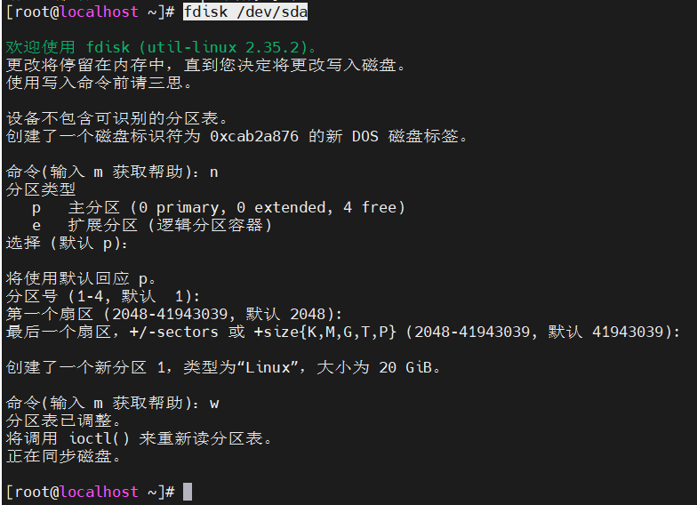
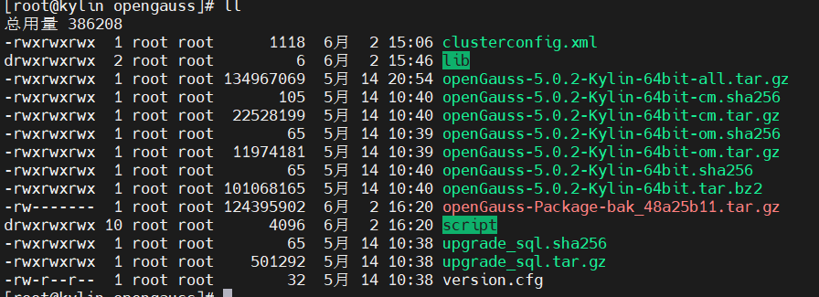
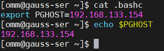
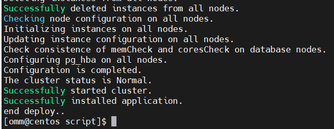
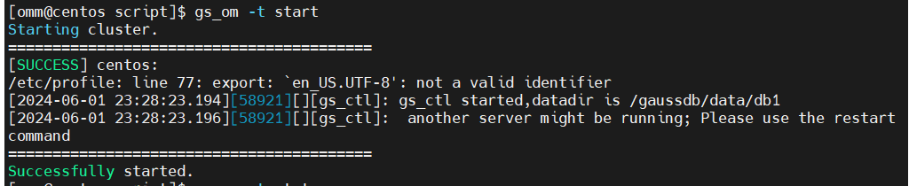

# Linux服务配置

# 基础配置

### 基础命令

　　​`ls [-a] [~路径]`​ 列出目录下的内容

　　可选项：

* ​`-a`​ 显示隐藏内容
* ​`-l`​ 以列表显示内容 可与 `-h` ​组合使用（显示文件大小单位）

　　​`cd [路径] `​ 进入其他目录

　　​`pwd`​ 查看目前所在目录

　　​`mkdir [-p] [路径]`​ 创建目录

　　可选项：

* ​`-p`​ 自动创建不存在的父目录，用于创建连续多层级目录

　　​`touch`​ 路径 创建文件

　　​`cat`​ 路径 查看文件 默认全部显示

　　​`more`​ 路径 查看文件 支持按页显示，空格翻页

　　​`cp [-r]`​ 参数 1 参数 2 复制文件、文件夹

　　可选项：

　　​`-r `​  复制文件夹使用，表示递归

　　参数：

* ​`参数1`​ 表示被复制的文件或文件夹
* ​`参数2`​ 表示要复制到的地方

　　​`mv 参数1 参数2`​ 移动文件或文件夹

　　参数：

* ​`参数1`​ 表示被移动的文件或文件夹
* ​`参数2`​ 表示要移动到的地方

　　​`rm [-r]`​ 参数 1 参数 2...  删除文件或文件夹

　　可选项：

* ​`-r`​ 删除文件夹
* ​`-f ` ​强制删除，不会弹出确认信息

　　参数：

* 表示要删除的文件和文件夹 空格隔开
* 支持 `*` ​通配符 进行模糊匹配

　　​`which 要查找的命令`​ 查看命令的程序文件位置

　　​`find 起始路径 -name "被查找的文件名" ` ​查找文件

* 起始路径：要查找的位置
* ​`-name`​：文件名模式进行查找
* ​`-size`​：按文件大小进行查找

  * find 起始路径 -size +10M 查找大于 10M 的文件 `+-` ​代表正负 `kMG` ​代表单位
* 支持通配符

　　​`echo 输出的内容`​

　　使用反引号可以使用模板字符串，将会输出该命令的执行结果

```Go
命令 echo `pwd`
输出 /root/itheima
```

　　重定向符

```Go
将左边的结果写入右边的文件中
echo `pwd` > 12.txt // 覆盖写入
echo "hello word2" >> 12.txt // 追加写入
ls -hl >> 12.txt
```

　　管道符

```Go
将左边的结果当做右边的内容源
cat 2.txt | wc -l 
该行等于 wc-l 12.txt  (2.txt的内容为12.txt)
链式编程，左边的结果加上右边的条件进行筛选输出
ls | grep lib
该命令只输出名字含lib的文件或文件夹
```

　　​`tail [-f -num] 路径`​  查看文件尾部内容

　　可选项：

* ​`-f`​ 表示持续跟踪（实时更新）
* ​`-num`​ 表示查看多少行

　　​`grep [-n] 关键字 文件路径`​ 从文件中通过关键字过滤文件行

　　可选项：

* ​`-n`​ 表示在结果中显示匹配的行号

　　​`wc [-c] 文件路径 `​ 统计文件的行数、单词数量等

　　可选项：

* ​`-c`​​ 统计 bytes 数量
* ​`-m`​​ 统计字符数量
* ​`-l`​​ 统计行数
* ​`-w`​​​ 统计单词数量

　　**软链接**

　　将文件和文件夹链接到其他位置，类似于 win 的快捷方式

　　语法：`ln -s 参数1 参数2`​

　　选项：-s 创建软连接
参数 1：被链接的文件或文件夹
参数 2：要链接的文件或文件夹

　　示例：
​`ln -s /home/qiu /qiu`​
此时，访问根目录下的 qiu 目录时，实际访问的是/home/qiu 目录

### 用户和用户组

```vim
useradd tom #创建用户
userdel -r tom #删除用户，同时删除用户目录
```

　　​`groupadd test`​    创建用户组 test

　　​`groupdel test `​    删除用户组 test

　　​`useradd [-g] user2`​   创建用户 user2

　　​`passwd test`​ 修改用户 test 的密码

　　可选项：

* ​`-g`​ 指定用户的组，不指定则会自动创建同名组并加入，指定组时需要组已存在。如果存在同名组，则必须使用-g 指定组
* ​`-d`​  指定用户的 HOME 目录，默认目录：/home/用户名

　　​`userdel [-r] user2`​   删除用户 user2

　　可选项：

　　​`-r ` ​指定该可选项时，删除用户的 home 目录。如不指定，则删除用户的 home 会自动保留

　　id [用户名]   查看用户所属组

　　参数：用户名，被查看的用户。如不提供则查看自身

　　​`usermod -aG 用户组 用户名`​   修改用户所属组

　　​`getent passwd `​  查看系统中存在哪些用户

　　​`getent group`​   查看系统中存在哪些用户组

　　**为用户配置 sudo 免认证**

　　root 用户 `vim sudo `​// 自动打开/etc/sudoers 文件 在文件最后添加

　　​`test(用户名) ALL=(ALL)    NOPASSWD:ALL`​

#### 密码策略

　　**密码过期策略**

　　修改 `/etc/login.defs`​ 文件

```shell
PASS_MAX_DAYS 99999
# 一个密码最长可以使用的天数；

PASS_MIN_DAYS 0
# 更换密码的最小天数；

PASS_MIN_LEN 5
# 密码的最小长度；

PASS_WARN_AGE 7
# 密码失效前提前多少天数开始警告；
```

　　‍

　　**PASS_MIN_LEN 5**

　　该配置不会生效，需要在`/etc/pam.d/system-auth`​配置文件中添加`minlen=13`​(密码最小长度为12)密码长度策略

　　​`password requisite pam_pwquality.so try_first_pass local_users_only retry=3 minlen=13 authtok_type=`​

　　‍

　　​`etc/login.defs`​和`/etc/pam.d/system-auth`​配置文件修改后对之前创建的用户不生效，对以后创建的用户生效。

　　对之前创建的用户修改密码过期策略的可以使用chage命令，参数如下

```shell
# chage --help
用法：chage [选项] 登录
选项：
-d, --lastday 最近日期 将最近一次密码设置时间设为“最近日期”
-E, --expiredate 过期日期 将帐户过期时间设为“过期日期”
-h, --help 显示此帮助信息并推出
-I, --inactive INACITVE 过期 INACTIVE 天数后，设定密码为失效状态
-l, --list 显示帐户年龄信息
-m, --mindays 最小天数 将两次改变密码之间相距的最小天数设为“最小天数”
-M, --maxdays 最大天数 将两次改变密码之间相距的最大天数设为“最大天数”
-R, --root CHROOT_DIR chroot 到的目录
-W, --warndays 警告天数 将过期警告天数设为“警告天数”

# 密码过期后，登录linux需要输旧密码并强制更新密码
# 使用root用户为普通用户更新密码时可以不遵守密码最小长度的策略，但是普通用户更新自身密码时会遵循。
```

##### 示例

　　 root用户密码默认过期策略

　　​`chage -l root`​

　　最近一次密码修改时间 ：从不

　　密码过期时间 ：从不

　　密码失效时间 ：从不

　　帐户过期时间 ：从不

　　两次改变密码之间相距的最小天数 ：0

　　两次改变密码之间相距的最大天数 ：99999

　　在密码过期之前警告的天数 ：7

　　‍

　　(2) 更改密码过期策略后，新建test用户，test用户的密码过期策略

1. 修改/etc/login.defs配置文件

　　​`vim /etc/login.defs`​

```shell
PASS_MAX_DAYS 42
PASS_MIN_DAYS 0
PASS_MIN_LEN 12
PASS_WARN_AGE 30
```

2. 修改/etc/pam.d/system-auth配置文件

　　​`vim /etc/pam.d/system-auth`​

　　​`password requisite pam_pwquality.so try_first_pass local_users_only retry=3 minlen=13 authtok_type=`​

　　‍

3. 创建test用户并查看密码过期策略

　　​`useradd test`​

　　​`echo "Linux@2020" | passwd --stdin test`​​

　　更改用户 test 的密码 。

　　passwd：所有的身份验证令牌已经成功更新。

　　‍

　　​`chage -l test`​

最近一次密码修改时间 ：10月 13, 2020

密码过期时间 ：11月 24, 2020

密码失效时间 ：从不

帐户过期时间 ：从不

两次改变密码之间相距的最小天数 ：0

两次改变密码之间相距的最大天数 ：42

在密码过期之前警告的天数 ：30

　　‍

　　​`su - test`​

　　上一次登录：二 10月 13 16:00:26 CST 2020pts/0 上

　　$ passwd

更改用户 test 的密码 。

为 test 更改 STRESS 密码。

（当前）UNIX 密码：

新的 密码：

无效的密码： 密码少于 12 个字符

新的 密码：

无效的密码： 密码少于 12 个字符

新的 密码：

无效的密码： 密码少于 12 个字符

passwd: 已经超出服务重试的最多次数

　　‍

　　‍

　　‍

　　‍

　　‍

### 目录结构

* /bin，/usr/bin，/usr/local/bin

  是Binary的缩写，这个目录存放着最经常使用的命令
* /sbin，/usr/sbin，/usr/local/sbin

  S就是Super User的意思，这里存放的是系统管理员使用的系统管理程序。
* /home

  存放普通用户的主目录，在Linux中每个用户都有一个自己的目录，一般该目录名是以用户的账号命名，如: /home/tom
* /root

  该目录为系统管理员，也称作超级权限者的用户主目录
* /lib

  系统开机所需要最基本的动态连接共享库，其作用类似于Windows里的DLL文件。几乎所有的应用程序都需要用到这些共享库
* /lost+found

  这个目录一般情况下是空的，当系统非法关机后，这里就存放了一些文件。只能在终端中查看
* /etc

  所有的系统管理所需要的配置文件和子目录，比如安装mysql数据库 my.conf
* /usr

  这是一个非常重要的目录，用户的很多应用程序和文件都放在这个目录下，类似与windows下的program files目录。一般存放手动安装的系统级应用，/usr/local 一般存放手动安装的用户级应用
* /boot

  存放的是启动Linux时使用的一些核心文件，包括一些连接文件以及镜像文件
* /proc  禁止修改

  这个目录是一个虚拟的目录，它是系统内存的映射，访问这个目录来获取系统信息
* /srv 

  service缩写，该目录存放一些服务启动之后需要提取的数据
* /sys 

  这是linux2.6内核的一个很大的变化。该目录下安装了2.6内核中新出现的一个文件系统sysfs
* /tmp

  这个目录是用来存放一些临时文件的
* /dev

  类似于windows的设备管理器，把所有的硬件用文件的形式存储
* /media

  linux系统会自动识别一些设备，例如U盘、光驱等等，当识别后，linux会把识别的设备挂载到这个目录下
* /mnt

  系统提供该目录是为了让用户临时挂载别的文件系统的，如 u 盘，硬盘等，我们可以将外部的存储挂载在/mnt/上，然后进入该目录就可以查看里的内容了。 d:/myshare
* /opt 

  这是给主机额外安装软件所摆放的目录。如安装ORACLE数据库就可放到该目录下。默认为空。一般存放 yum apt 等自动安装的应用
* /var

  这个目录中存放着在不断扩充着的东西，习惯将经常被修改的目录放在这个目录下。包括各种日志文件
* /selinux [security-enhanced linux]

  SELinux是一种安全子系统，它能控制程序只能访问特定文件，有三种工作模式，可以自行设置。开启 SElinux 后才会有该目录

　　‍

　　‍

　　‍

### 磁盘操作

　　新添加磁盘格式化并挂载

　　**1.使用**​**​`lsblk`​** **查看磁盘设备.**

​​

　　**2.创建分区** `/dev/sda`​ 磁盘

　　执行 `fdisk /dev/sda`​

　　第一个命令输入 `n`​，添加新分区，参数可保持默认，直接回车

　　然后选择 `w`​ 将分区表写入磁盘并退出

​​

　　**3.格式化分区**

　　​`mkfs.ext4 /dev/sda1`​

​​

　　**4.创建挂载目录**

　　​`mkdir -p /data`​

　　**5.挂载磁盘**

　　​`mount /dev/sda1 /data`​

　　**6.查看是否挂载成功**

　　执行 `df -h`​

​​

　　可以看到，`/dev/sda1`​ 已经挂载到 `/data`​ 目录

　　**7. 开机自动挂载**

　　​`echo "/dev/sda1    /data    ext4    defaults    0 2" >> /etc/fstab`​

　　在 **Linux** 中，如果要让磁盘在每次开机后自动挂载到指定的目录下，我们需要将挂载信息写入  **/etc/fstab** 文件中。

　　 **/etc/fstab** 是 **Linux** 系统中用于存储文件系统挂载信息的文件。它包含了系统启动时需要挂载的所有文件系统的信息，以及挂载时使用的选项。

　　我们需要在  **/etc/fstab** 文件中添加一个新的行来描述我们要挂载的文件系统。每一行包含了如下信息：

1. 设备：要挂载的设备名称，例如 : **/dev/sdb1** 。
2. 挂载点：要将设备挂载到哪个目录下。
3. 文件系统类型：要挂载的文件系统类型，例如: **ext4** 。
4. 挂载选项：用于控制挂载行为的选项，例如: **noatime**（不更新访问时间）和 **defaults**（使用默认选项）等。
5. 挂载次序：系统应该以什么顺序挂载文件系统，例如: **0** 表示最先挂载。

　　**8. 卸载磁盘**

　　使用 `umount /data`​  即可解除挂载

​​

　　‍

　　‍

　　‍

### 系统配置

#### Vim

　　命令模式：

* ​`i`​：在当前光标位置进入输入模式
* ​`a`​：在当前光标位置 之后进入输入模式
* ​`o`​：在当前光标位置下一行进入输入模式
* ​`I`​：在当前行的开始进入输入模式
* ​`A`​：在当前行的结尾进入输入模式
* ​`O`​：在当前行的上一行进入输入模式

　　命令模式：

* ​`/ `​： 进行搜索

　　底线模式：

* ​`w`​ 保存
* ​`q`​ 退出
* ​`wq!`​  强制保存并退出
* ​`set nu`​ 显示行号
* ​`set paste`​ 设置粘贴模式

#### 安装软件

##### 自动安装

　　后缀名：
​`.rpm`​ 使用 yum 管理器
​`.deb`​ 使用 apt 管理器（Ubuntu）

　　语法：`yum [-y] [install | remove | search] 软件名称`​

　　选项：`-y`​ 自动确认，无需手动确认安装和卸载过程
​`install`​ 安装   `remove`​ 卸载   `search ` ​搜索

　　示例：`yum install wget`​

　　注意：需要 `联网`​，使用 `root权限`​，yum 和 apt 命令的选项与参数 `完全一致`​

#### systemctl

　　控制服务的启动 关闭

　　能被 systemctl 管理的软件被称为 服务

　　语法：`systemctl [start | stop | status | enable | disable] 服务名`​

　　参数：`start`​ 启动 `stop`​ 关闭 `status`​ 查看状态 `enable` ​开启开机自启 `disable`​ 关闭开机自启 `restart`​ 重启服务

　　系统内置服务较多，比如：
​`NetworkManager`​ : 主网络服务
​`Network`​ : 副网络服务
​`firewalld`​ : 防火墙服务
​`sshd`​ : ssh 服务

#### 时间与时区

##### 查看系统时间

　　date 命令查看系统时间
语法：`date [-d] [+格式化字符串]`​
-按照给定的字符串显示日期，一般用于日期计算
格式化字符串：`%Y`​ 年 `%y`​  年份后 2 位数字 `%m`​ 月份（01-12）`%d`​ 日（01-31）
​`%H`​ 小时 （00-23） `%M`​ 分钟（00-59） `%S`​ 秒（00-60） `%s`​ 自 1970-01-01 00:00:00 UTC 到现在的秒数
示例：`date "+%Y-%m-%d %H-%M-%S"`​ // 2023-12-11 22-51-35
按给定的字符串显示日期 支持 + 或-
支持 `year` ​年 `month` ​月 `day` ​天 `hour` ​小时 `minute` ​分钟 `second` ​秒
显示后一天的时间
示例：`date -d "+1 day" "+%y-%m-%d %H-%M-%S"`​ // 23-12-12 23-14-20

#### 修改系统时区

　　使用 root 权限执行命令

```vim
rm -f /etc/localtime
sudo ln -s /usr/share/zoneinfo/Asia/Shanghai /etc/localtime 
// 修改时区为Shanghai（CST）
```

#### 时间校准

　　NTP

　　安装服务 `ntp yum install ntp`​
开启服务 `systemctl start ntpd`​

　　ntp 启动后会自动定期联网校准系统时间
手动校准
​`ntpdate -u ntp.aliyun.com`​ // 指向一个 ntp 服务器手动更新时间

#### IP 与主机

##### 查看主机 IP 地址

　　​`ifconfig`​ 查看 ip 地址

　　没有该命令使用 `yum install net-tools`​ 安装

　　​`ip a`​ 查看 ip 地址

##### 修改主机 IP 地址

　　修改文件 `/etc/sysconfig/network-scripts/ifcfg-ens33`​，其中 ens33 为网卡名称

```vim
TYPE=Ethernet
PROXY_METHOD=none
BROWSER_ONLY=no
BOOTPROTO=dhcp // 动态获取为dhcp，静态配置为static
DEFROUTE=yes
IPV4_FAILURE_FATAL=no
IPV6INIT=yes
IPV6_AUTOCONF=yes
IPV6_DEFROUTE=yes
IPV6_FAILURE_FATAL=no
IPV6_ADDR_GEN_MODE=stable-privacy
NAME=ens33
UUID=aff41b68-29ab-4734-ba59-6344817a924a
DEVICE=ens33
ONBOOT=yes  // 修改为yes，使配置生效
// 以下为静态地址配置字段
IPADDR=192.168.132.130
NETMASK=255.255.255.0
GATEWAY=192.168.132.2
DNS1=114.114.114.114
```

　　执行 `systemctl restart network`​ 重启网卡，使新配置生效

　　<span data-type="text" style="color: var(--b3-font-color9);">RedHat 9 命令 使用 nmcli 进行修改</span>

```vim
nmcli c m ens33 ipv4.address 192.168.80.10/24  # 修改 IP 地址和子网掩码
nmcli c m ens33 +ipv4.addresses 192.168.80.100/24
nmcli c m ens33 ipv4.method manual             # 修改为静态配置，默认是 auto
nmcli c m ens33 ipv4.gateway 192.168.80.2      # 修改默认网关
nmcli c m ens33 ipv4.dns 192.168.80.2          # 修改 DNS
nmcli c m ens33 +ipv4.dns 114.114.114.114      # 添加一个 DNS
nmcli c m ens33 ipv6.method ignored            # 将 IPv6 禁用，针对CentOS8，三个可选项：disabled auto manal
nmcli c m ens33 connection.autoconnect yes     # 开机启动
```

　　Debian

　　方式1：

　　修改 `/etc/netplan/01-network-manager-all.yaml`​ 文件

　　‍

　　方式2：

　　修改 `/etc/network/interfaces`​ 文件

```shell
# interfaces(5) file used by ifup(8) and ifdown(8)
# Include files from /etc/network/interfaces.d:
# source-directory /etc/network/interfaces.d  注释该行
添加以下内容，ens37为网卡名称
auto ens37
iface ens37 inet static
address 192.168.100.101
netmask 255.255.255.0
gateway 192.168.100.1
```

　　​`systemctl restart networking`​  重启网卡，使新配置生效

　　方式3：

　　使用 `nmtui`​ 进行可视化修改

　　‍

##### 主机名

　　​`hostname`​ 查看主机名
​`hostname centos1`​ 也可以修改主机名
​`hostnamectl set-hostname centos1`​ 修改主机名

##### DNS

　　hosts 文件地址 `/etc/hosts`​
修改 hosts 格式
​`192.168.1.1 www.baidu.com`​

#### 网络请求与下载

　　​`ping [-c num] ip或主机名`​  检测是否连通
​`-c`​ 检查的次数，默认为无限次
​`wget [-b] url `​  下载文件
​`-b`​ 可选 后台下载，日志将写入到当前目录的 wget-log 文件
​`curl [-O] url`​  发送请求或下载文件
​`-O`​ 下载文件，默认为发送请求

#### 端口与进程

　　端口划分:

　　公认端口：`1-1023`​，通常用于一些系统内置或知名程序的预留使用
注册端口：`1024-49151`​，随意使用，用于松散的绑定一些程序/服务
动态端口：`49152-65535`​，通常不会固定绑定程序，而是程序对外链接时，临时使用

　　查看端口占用情况

　　nmap 命令

　　安装：`yum install nmap`​
语法：`nmap 要查看的IP地址`​

　　netstat 命令

　　安装：`yum install net-tools`​
语法：`netstat -anp | grep 端口/进程号`​

##### 进程信息

　　​`ps [-ef]`​ 查看当前系统中的进程信息
​`-e`​ 显示出全部进程
​`-f`​ 以格式化的形式展示信息

​​

　　​`UID`​：进程所属的用户 ID
​`PID`​：进程的进程号
​`PPID`​：进程的父 ID（启动它的进程）
​`C`​：进程的 CPU 占用率
​`STIME`​：进程的启动时间
​`TTY`​：启动此进程的终端序号，如为？则代表非终端启动
​`TIME`​：进程占用 CPU 的时间
​`CMD`​：进程对应的名称或启动路径或启动命令

　　查看指定类型的进程信息
ps -ef | grep 启动用户/进程 ID/进程名等
​`ps -ef | grep sshd`​

　　关闭进程
​`kill [-9] 进程ID`​
​`-9`​  强制关闭

#### 主机状态监测

##### 系统资源监控

　　​`top`​ 查看系统的运行信息，5s 刷新一次

​​

​​

​​

​​

​​

​​

##### 磁盘信息监测

　　​`df [-h]`​  查看磁盘空间使用量
​`-h`​ 显示文件大小单位
​`iostat [-x] [num1] [num2]`​  查看 cpu 磁盘的相关信息
num1:刷新间隔，num2 刷新次数

　　​`-x`​ 显示更多信息

​​​​

##### 网络信息监测

　　​`sar [-n DEV] num1 num2`​  查看网络信息
​`-n`​ 查看网络 `DEV` ​表示查看网络接口
​`num1`​：刷新间隔（默认查看一次） `num2`​：查看次数（默认无限次数）

#### 环境变量

　　环境变量
​`env`​ 查看环境变量

　　​`echo {$PATH} ABC `​ 输出环境变量的值 还可以拼接字符串

　　设置临时变量

```vim
export MYNAME=qiu
echo $MYNAME // qiu
```

　　设置永久环境变量

　　针对当前用户生效：修改 ~/.bashrc 文件
针对所有用户生效：修改 /etc/profile 文件

```vim
格式：export MYNAME = qiu
source /etc/profile 刷新环境变量
```

　　PATH 变量

　　以冒号分隔，
自定义执行命令 如
/etc/profile 中添加
​`export PATH=$PATH:/root`​
此时，执行 haha 会在 PATH 变量中的目录按顺序查找可执行文件，即执行/root/haha 程序

#### 文件的操作

##### tar 命令

　　​`tar [-c -v -x -f -z -C] 参数1 参数2...`​  压缩或解压缩文件

　　​`-c`​ 创建压缩文件，用于压缩模式
​`-v`​ 显示压缩、解压过程，用于查看进度
​`-x ` ​解压模式
​`-f`​ 要创建的文件夹，或者要解压的文件，-f 必须是最后一个选项
​`-z`​ gzip 模式，默认为普通模式
​`-C`​ 选择解压的目的地，用于解压模式​

　　​`tar -zcvf test.tar.gz 1.txt 2.txt 3.txt`​ // 将这几个文件压缩到 test.rar.gz 文件内，使用 gzip 模式
​`tar -xvf test.tar -C /root/test`​ // 将 test.tar 解压到/root/test 目录，-C 可省略
注意：`-z` ​为 `gzip` ​模式，一般是**第一个选项**​。`-f` ​为要创建或解压的文件，**必须是最后一个选项**​

##### zip unzip 命令

　　​`zip [-r] 参数1 参数2...`​ 压缩文件

　　​`-r`​ 被压缩的包含文件夹时候，需要使用-r 选项
参数 要压缩的文件或文件夹

　　​`zip test.zip 10.txt 11.txt`​ // 将 10.txt 和 11.txt 压缩到 test.zip
​`zip -r test2.zip 10.txt 12.txt dir`​ // 将 10.txt 和 11.txt 和 dir 目录压缩到 test2.zip

　　​`unzip [-d] 参数1 参数2...`​  解压缩文件
​`-d ` ​指定解压到的目录，通 tar 的-C 选项
参数 待解压的文件
​`unzip test.zip`​ // 将 test.zip 解压到当前目录
​`unzip test2.zip -d /root/test2`​    // 将 test2.zip 解压到/root/tets2 目录下

#### 远程登录

　　‍

　　‍

　　‍

### 计划任务

　　**一次性任务**

```vim
[root@localhost ~]# at 19:20 // 设置一次性任务
at> echo "一次性任务" // 需要执行的命令
at> echo "一次性任务2"
at> // ctrl+D 退出

// 更加简便的方法
[root@localhost ~]# echo "echo "计划任务测试"" | at 19:25

[root@localhost ~]# at -l  // 查看任务列表
2       Sat Dec 23 19:25:00 2023 a root
[root@localhost ~]# atrm 2  // 删除任务
```

　　​`重复性计划任务`​

　　时间格式：分 时 日 月 星期   注意：日和星期冲突，不可同时使用

​​

　　0 2 15,20 * * echo "在每个月的15日和20日2时执行命令"

　　0 3 * * 1,3,5 echo "在每周1,3,5的3时执行命令"

　　​`crontab -l `​   查看任务列表

　　‍

## SHELL 编程

　　执行脚本

　　​`bash ./test.sh`​  推荐使用！！！

　　​`./test.sh`​ 需要执行文件的权限，不推荐

　　变量声明：NUM=0 注意=号周围不要有空格

　　声明变量不需要$$，但是使用变量需要$。$NUM

　　数学运算：((SNUM++))，((SNUM+2))等

### 编写脚本

　　简单示例

```vim
#! /bin/bash   // 告诉系统使用哪种解释器
# 这里是注释
echo "以下内容是变量"
echo "shell变量：`echo $SHELL `"

执行结果：
以下内容是变量
shell变量：/bin/bash
```

　　脚本中使用变量

　　​`$0`​ 为脚本名称
​`$#`​ 共有几个参数
​`$2`​ 第 2 个参数...
​`$*`​ 全部参数
​`$?`​ 获取上一次命令的执行结果

```vim
#! /bin/bash
echo "当前脚本共有$#个参数"
echo "当前脚本名称：$0"
echo "第1个变量：$1"
echo "第3个变量：$3"
echo "全部变量：$*"

执行：bash test2.sh b1 c2 d3
结果：
当前脚本共有3个参数
当前脚本名称：test2.sh
第1个变量：b1
第3个变量：d3
全部变量：b1 c2 d3
当变量不存在时，变量值为空
```

##### 引号的作用与区别

　　​`单引号 ''`​ 在单引号内的文本被视为字面字符串，没有任何特殊字符的替换或扩展。

```vim
echo 'Hello $USER'
输出：Hello $USER
```

　　​`双引号 ""`​ 在双引号内的文本允许进行变量替换和命令替换。变量会被解析并替换为其值，而命令替换会执行内部命令并将其结果替换为输出。

```vim
name="John"
echo "Hello $name"
输出：Hello John
```

　　​` 反引号 ``  `​ 称为命令替换：反引号内的内容将被视为命令，并执行该命令，并将其结果作为替换内容。建议使用更现代的命令替换语法 `$()`​ 来代替反引号，这样可以避免转义问题。

```vim
current_date=`date +%Y-%m-%d`
echo "Today is $current_date"
输出：Today is 2023-12-18
```

#### IF 语句，流程控制

　　注意：条件成立返回 0 ，不成立则返回其他值

　　**运算符：**

　　​`-d`​ 测试文件是否为目录类型
​`-e`​ 测试文件是否存在
​`-f`​ 判断是否为一般文件
​`-r`​ 检测当前用户是否有权限读取
​`-w`​ 检测当前用户是否有权限写入
​`-x`​ 检测当前用户是否有权限执行

　　**逻辑运算符**

　　​`&&`​ 逻辑与运算，左边的命令返回 True 时执行右边的命令
​`||`​ 逻辑或运算，左边的命令返回 False 时指向右边的命令
​`！`​ 取反运算

　　​`[ $USER = root ] && echo "当前用户是root用户" || echo "当前用户不是root用户，当前是 $USER 用户"`​

　　**整数比较运算符**

　　​`-eq`​ 是否等于
​`-ne`​ 是否不等于
​`-gt`​ 是否大于
​`-lt`​ 是否小于
​`-le`​ 是否等于或小于
​`-ge`​ 是否大于或等于

　　**字符串比较运算符**

　　​`=`​ 比较字符串内容是否相同  
​`！=`​ 比较字符串内容是否不同  
​`-z`​ 判断字符串内容是否为空

　　**语法结构**

```vim
if 条件语句;then 
    ［［  ］］测试命令
    （（ ）） 数学运算
     执行命令
elif 条件语句;then
     执行命令
else
    执行命令
fi 
```

> ```vim
> #! /bin/bash
> NC=$(free -m | grep Mem: | awk '{print $4}')
> echo "剩余内存： $NC MB"
> if [ $NC -le $1 ]
> then
> echo "当前剩余内存小于告警值：$1 MB"
> else
> echo "当前剩余内存大于告警值：$1 MB"
> fi
>
> 输出：
> [root@localhost ~]# bash test4.sh 1000
> 剩余内存： 677 MB
> 当前剩余内存小于告警值：1000 MB
> [root@localhost ~]# bash test4.sh 500
> 剩余内存： 677 MB
> 当前剩余内存大于告警值：500 MB
> ```

#### For 循环

　　for循环语句允许脚本一次性读取多个信息，然后逐一对信息进行操作处理

　　**语法：**

```vim
for 变量名 in 取值列表
do
    执行命令
done
```

　　获取全部IP

```vim
for ip in $(cat iplist.txt)
do
    echo $ip
done
```

#### While 条件循环

　　while条件循环语句是一种让脚本根据某些条件来重复执行命令的语句，它的循环结构往往在执行前并不确定最终执行的次数

　　**语法：**

```vim
while 条件语句
do
    执行语句
done
```

　　猜数字小游戏

```vim
#! /bin/bash
PRICE=$(($RANDOM % 1000))
SNUM=0
while [ $SNUM -lt $1 ]
do
    ((SNUM++))
    read -p "请输入你要猜的数字：" CNUM
    if [ $CNUM -eq $PRICE ]
    then
        echo "恭喜你，猜对啦！"
        echo "总共猜了 $NUM 次哦"
        exit 0
    else
        echo "猜错啦，重新来哦"
    fi
done
echo "随机数字： $PRICE"

[root@localhost ~]# bash test6.sh 3
请输入你要猜的数字：1
猜错啦，重新来哦
请输入你要猜的数字：2
猜错啦，重新来哦
请输入你要猜的数字：3
猜错啦，重新来哦
随机数字： 483
```

#### case条件测试

　　case条件测试语句和switch语句的功能非常相似！case语句是在多个范围内匹配数据，若匹配成功则执行相关命令并结束整个条件测试；而如果数据不在所列出的范围内，则会去执行星号（*）中所定义的默认命令

　　简单示例

```vim
        [root@linuxprobe ~]# vim Checkkeys.sh
        #! /bin/bash
        read -p "请输入一个字符，并按Enter键确认：" KEY
        case "$KEY" in
        [a-z]|[A-Z])
        echo "您输入的是 字母。"
        ;;
        [0-9])
        echo "您输入的是 数字。"
        ;;
        *)
        echo "您输入的是 空格、功能键或其他控制字符。"
        esac
        [root@linuxprobe ~]# bash Checkkeys.sh
        请输入一个字符，并按Enter键确认：6
        您输入的是 数字。
        [root@linuxprobe ~]# bash Checkkeys.sh
        请输入一个字符，并按Enter键确认：p
        您输入的是 字母。
        [root@linuxprobe ~]# bash Checkkeys.sh
        请输入一个字符，并按Enter键确认：^[[15~
        您输入的是 空格、功能键或其他控制字符。
```

### 脚本实践

　　**获取当前剩余可用内存，并检测是否告警**

```vim
#! /bin/bash
NC=$(free -m | grep Mem: | awk '{print $4}')
echo "剩余内存： $NC MB"
if [ $NC -le $1 ]
then
echo "当前剩余内存小于告警值：$1 MB"
else
echo "当前剩余内存大于告警值：$1 MB"
fi

输出：
[root@localhost ~]# bash test4.sh 1000
剩余内存： 677 MB
当前剩余内存小于告警值：1000 MB
[root@localhost ~]# bash test4.sh 500
剩余内存： 677 MB
当前剩余内存大于告警值：500 MB
```

　　**手动输入IP或自动获取IP，测试是否在线**

```vim
#! /bin/bash
if [ "$1" = "1" ]
then
    read -p "请输入需要测试的IP：" IPLIST
else
    echo "自动获取IP列表"
    IPLIST=$(cat iplist.txt)
fi
for IP in $IPLIST
do
    ping -c 3 -i 0.2 -W 3 $IP &> /dev/null
    // -c为测试次数，-i为测试间隔 -W 为超时时间。 /dev/null 该地址为黑洞地址，输出到该地址意味着丢弃
    if [ $? -eq 0 ]
    then
        echo "$IP 状态：在线"
    else
        echo "$IP 状态：离线"
    fi
done

输出：
[root@localhost ~]# bash test5.sh 
自动获取IP列表
114.114.114.114 状态：在线
129.29.29.29 状态：离线
23.5.5.5 状态：在线
baidu.com 状态：在线
123.1.1.1 状态：离线
[root@localhost ~]# bash test5.sh 1
请输入需要测试的IP：192.168.132.2
192.168.132.2 状态：在线
```

　　‍

## KySec 银河麒麟安全系统

　　查看当前状态 `getstatus `​

​​

​​

　　临时关闭Kysec  `setstatus disable`​

　　永久关闭Kysec `setstatus disable -p`​

​​

　　开启关闭Kysec  `setstatus enable`​

　　重启后生效

　　设置为 softmode 模式 `setstatus softmode`​

## YUM

### 修改yum源

　　进入yum源的配置文件目录

　　​`cd /etc/yum.repos.d/`​

　　查看yum源配置文件

　　​`yum repolist`​

​​

　　备份旧的配置文件

　　​`sudo mv CentOS-Base.repo CentOS-Base.repo.bak`​

　　下载阿里云yum源

　　​`sudo wget -O /etc/yum.repos.d/CentOS-Base.repo http://mirrors.aliyun.com/repo/Centos-7.repo`​

　　清理缓存

　　​`yum clean all`​

　　重建缓存

　　​`yum makecache`​

　　再次查看yum信息

　　​`yum repolist`​

​​

### 本地yum源

　　将光盘挂载到/mnt下面

```shell
[root@Server01 ~]# mount /dev/sr0 /mnt/
```

　　删除系统本身自带的repo文件

```shell
进入yum目录
[root@Server01 ~]# cd /etc/yum.repos.d/
删除所有
[root@Server01 yum.repos.d]# rm -Rf *
```

　　编辑需要的repo文件并上传扩展安装包

```shell
[root@routserv kz]# pwd
/root/kz
[root@routserv kz]# ls
centos-indexhtml-7-9.el7.centos.noarch.rpm openssl11-libs-1.1.1k-
4.el7.x86_64.rpm
gperftools-libs-2.6.1-1.el7.x86_64.rpm pkcs11-helper-1.11-3.el7.x86_64.rpm
nginx-1.20.1-9.el7.x86_64.rpm repodata
nginx-filesystem-1.20.1-9.el7.noarch.rpm
[root@routserv kz]#

[root@Server01 yum.repos.d]# vim local.repo
[local] #库名称
name=local #名称描述
baseurl=file:///mnt #yum源目录
enabled=1 #是否启用该yum源，0为禁用
gpgcheck=0 #检查GPG-KEY（0为不检查，1为检查）
[kz]
name=local #名称描述
baseurl=file:///root/kz #yum源目录
enabled=1 #是否启用该yum源，0为禁用
gpgcheck=0
```

　　加载yum并缓存

```shell
[root@Server01 yum.repos.d]# yum clean all
[root@Server01 yum.repos.d]# yum makecache
```

　　测试 随便安装一个软件试试

```shell
[root@Server01 yum.repos.d]# yum install vim -y
```

　　‍

　　‍

# 服务配置

## SSH服务-sshd

　　安装服务

　　​`yum install sshd`​

### 禁止root用户通过SSH登录

　　修改 `/etc/ssh/sshd_config`​ 文件

　　​`PermitRootLogin`​ 改为 `no`​

​​

　　‍

## ISCSI文件共享-targetcli

　　安装

　　服务端 `yum install targetcli -y`​

### 创建文件存储

```shell
targetcli
/> cd /backstores/fileio
# 创建存储，kylin_file
/backstores/fileio> create kylin_file /root/kylin-iscsi-file
/backstores/fileio> cd /iscsi
```

### 创建共享IQN

```shell
# 创建共享，名称iqn.2024-04.com.kyline:file
/iscsi> create iqn.2024-04.com.kyline:file
# 添加存储到共享中
/iscsi> cd /iscsi/iqn.2024-04.com.kyline:file/tpg1/luns
/iscsi/iqn.20...ile/tpg1/luns> create /backstores/fileio/kylin_file
```

### 指定IQN挂载访问

　　只允许指定的IQN进行挂载

```shell
进入共享iqn
/iscsi/iqn.20...ile/tpg1/luns> cd /iscsi/iqn.2024-04.com.kyline:file/tpg1/acls
# 允许这个机器访问
/iscsi/iqn.20...ile/tpg1/acls> create iqn.2024-04.com.kylin:storage
```

### 放行端口

　　tcp：3260

### 挂载磁盘-iqn验证

　　安装 `apt install open-iscsi`​

　　发现目`iscsiadm -m discovery -t sendtargets -p 192.168.100.100:3260`​

　　修改 `/etc/iscsi/initiatorname.iscsi `​ 文件

​​

　　登录目标 `iscsiadm -m node -T iqn.2024-04.com.kylin:file -p 192.168.100.100:3260 -l`​

​​

　　查看登录状态  `iscsiadm -m session -P 3`​

​​

　　创建目录 `mkdir -p /data/storage`​

　　创建物理卷 `pvcreate /dev/sda`​ 如果失败，则加上 `-ff`​ 强制执行

　　创建卷组 `vgcreate kylin_vg /dev/sda`​

　　创建逻辑卷 `lvcreate -l +100%FREE -n kylin_lv kylin_vg`​

　　格式化为ext4  `mkfs.ext4 /dev/kylin_vg/kylin_lv`​

　　挂载 `mount /dev/kylin_vg/kylin_lv /data/storage`​

　　查看逻辑卷ID  `blkid /dev/kylin_vg/kylin_lv`​

​​

　　执行 `iscsiadm -m node -T iqn.2024-04.com.kyline:file -p 192.168.100.100:3260 --op update -n node.startup -v automatic`​ 设置开机自启，此命令没有返回值

　　修改 `/etc/fstab`​ 文件

　　添加以下内容

```shell
UUID=8a3c3d7b-0ba4-421a-9935-b23a7b35b886 /data/storage ext4 defaults,_netdev 0 0
```

## 时间同步-chrony

　　安装服务 `yum install chrony`​

　　安装服务 `apt install chrony`​

#### 允许网络中的其他计算机向该服务器同步时间

　　修改 `/etc/chrony.conf`​  文件，添加以下内容

```shell
allow 192.168.0.0/16
```

### 向服务器同步时间

　　修改 `/etc/chrony/chrony.conf`​ 文件

　　添加以下内容

```shell

server 192.168.100.100 iburst
```

　　‍

## NFS服务

　　安装服务 ` yum install nfs-utils rpcbind -y`​

### 只读共享

　　修改 `/etc/exports`​ 文件

```shell
共享文件夹         允许挂载对象（网段）  允许挂载方式 ro只读 rw读写
/nfsdata/kylin01 192.168.100.101/32(ro,sync,no_subtree_check)
```

### 匿名共享

　　/nfsdata/kylin02 共享文件夹使用匿名用户nfsuser访问，具有读写权限

```shell
useradd nfsuser
# 将文件夹归属用户改为nfsuser 
chown nfsuser:nfsuser /nfsdata/kylin02
# 修改权限 
chmod 777 /nfsdata/kylin02
```

　　查看 `nfsuser`​ 的id

​​

　　修改 `/etc/exports`​ 文件

```shell
/nfsdata/kylin02  192.168.100.101/32(rw,sync,no_subtree_check,anonuid=1001,anongid=1001)
```

　　rw：读写  
sync：表示数据在被确认写入磁盘之前，NFS服务器会响应客户端的写请求。这保证了数据的一致性，但可能会略微降低性能 必须选项？  
no_subtree_check： 禁用 subtree checking，这是一个性能优化选项，NFS服务器不会检查每个操作是否跨越了挂载点边界，对于大型或深度目录树结构特别有用 必须选项？  
anonuid：用户的uid  
anongid：用户的gid

### 启动服务

　　开启服务  ` exportfs -arv`​

​​

　　启动服务并设置开机自启

```shell
systemctl start nfs-server
systemctl start rpcbind
systemctl enable nfs-server
systemctl enable rpcbind
```

　　放行相关服务

```shell
firewall-cmd --add-service=nfs --permanent
firewall-cmd --add-service=rpc-bind --permanent
firewall-cmd --reload
```

### 挂载共享目录

　　​`mount 192.168.100.100:/nfsdata/kylin01 /data/client01 `​

　　开机自动挂载

　　修改 `/etc/fstab`​文件

```shell
192.168.100.100:/nfsdata/kylin01                /data/client01  nfs             defaults        0 0
```

　　尝试挂载 `mount /data/client01`​

## openGauss安装

　　测试环境：openEuler22.03    openGauss5.0.2  Centos7  KylinV10-server

　　openGauss下载：[https://opengauss.org/zh/download/](https://opengauss.org/zh/download/)

### 1.安装前准备

#### 1.1 安装流程

　　**安装流程：**

​​

|流程|说明|
| ---------------------| ---------------------------------------------------------------------------------------------------------------------------------------------------------------------------------------------------------|
|安装前准备|openGauss安装前需要准备相应的软硬件环境以及完成相关配置。<br />本文档提供了openGauss安装所需的最低要求，实际安装中，请用户根据实际情况进行规划。<br />更多信息，请参考[安装准备](https://docs-opengauss.osinfra.cn/zh/docs/5.0.0/docs/InstallationGuide/%E5%AE%89%E8%A3%85%E5%87%86%E5%A4%87_%E4%BC%81%E4%B8%9A%E7%89%88.html)。|
|获取并校验安装包|安装包需要在openGauss开源社区下载并且对安装包内容进行检查，详细请参见[获取安装包](https://docs-opengauss.osinfra.cn/zh/docs/5.0.0/docs/InstallationGuide/%E8%8E%B7%E5%8F%96%E5%AE%89%E8%A3%85%E5%8C%85_%E4%BC%81%E4%B8%9A%E7%89%88.html)。|
|配置XML文件|安装openGauss前需要创建XML文件。XML文件包含部署openGauss的服务器信息、安装路径、IP地址以及端口号等。用于告知openGauss如何部署。用户需根据不同场景配置对应的XML文件。<br />关于如何配置XML文件，详细请参见[创建XML配置文件](https://docs-opengauss.osinfra.cn/zh/docs/5.0.0/docs/InstallationGuide/%E5%88%9B%E5%BB%BAXML%E9%85%8D%E7%BD%AE%E6%96%87%E4%BB%B6.html)。|
|上传安装包和XML文件|上传安装包和XML配置文件到待安装的服务器。|
|解压安装包|使用tar命令解压安装包。|
|初始化安装环境|安装环境的初始化包含上传安装包和XML文件、解压安装包、使用gs_preinstall准备好安装环境。<br />关于如何初始化安装环境，详细请参见[初始化安装环境](https://docs-opengauss.osinfra.cn/zh/docs/5.0.0/docs/InstallationGuide/%E5%88%9D%E5%A7%8B%E5%8C%96%E5%AE%89%E8%A3%85%E7%8E%AF%E5%A2%83.html)。|
|执行安装|使用gs_install安装openGauss。<br />关于如何执行安装，详细请参见[执行安装](https://docs-opengauss.osinfra.cn/zh/docs/5.0.0/docs/InstallationGuide/%E6%89%A7%E8%A1%8C%E5%AE%89%E8%A3%85.html)。|
|设置备机可读|可选操作。在开启备机可读之后，备机将支持读操作，并满足数据一致性要求。|

#### 1.2 配置系统环境

　　下载安装包

```shell
wget https://opengauss.obs.cn-south-1.myhuaweicloud.com/5.0.2/arm_2203/openGauss-5.0.2-openEuler-64bit-all.tar.gz
```

　　**设置字符集参数**

　　修改文件 `/etc/profile`​，添加 `export LANG=en_US.UTF‐8`​ 到末尾

```shell
echo "export LANG= en_US.UTF‐8" >> /etc/profile
```

​​

　　刷新配置文件，使新配置生效

```shell
source /etc/profile
```

　　**修改Python为3.7**

　　之后安装过程中openGauss用户互信，openEuler服务器需要用到Python-3.7.x命令，但是默认Python版本为Python-2.7.x，所以需要切换Python版本。

　　进入/usr/bin目录。

　　​`cd /usr/bin/`​

　　备份python文件

　　​`mv python python.bak `​

　　建立Python3软连接。

　　​`ln -s python3 /usr/bin/python `​

　　Euler默认为python3，版本3.9.9

　　Euler：`ln -s python3 python`​

　　验证Python版本。

　　​`python -V `​

​​

　　**安装相关服务**

　　​`yum install libaio* -y`​

### 2 安装openGauss

#### 2.1 解压安装包

```shell
mkdir -p /opt/software/opengauss  
chmod 755 /opt/software/opengauss/
mv openGauss-5.0.2-openEuler-64bit-all.tar.gz /opt/software/opengauss
```

#### 2.2**创建XML文件，用于安装数据库**

```shell
vim clusterconfig.xml
```

　　添加以下内容

　　＂opengauss01＂是服务器的主机名，＂192.xxx.x.xx＂为服务器的IP地址（私有），例如：192.168.133.154；其他value值可以不进行修改。

```shell
<?xml version="1.0" encoding="UTF-8"?> 
<ROOT> 
    <CLUSTER> 
        <PARAM name="clusterName" value="dbCluster" /> 
        <PARAM name="nodeNames" value="opengauss01" /> 
        <PARAM name="backIp1s" value="192.168.133.154"/> 
        <PARAM name="gaussdbAppPath" value="/opt/gaussdb/app" /> 
        <PARAM name="gaussdbLogPath" value="/var/log/gaussdb" /> 
        <PARAM name="gaussdbToolPath" value="/opt/huawei/wisequery" /> 
        <PARAM name="corePath" value="/opt/opengauss/corefile"/> 
        <PARAM name="clusterType" value="single-inst"/> 
    </CLUSTER> 
   
    <DEVICELIST> 
    
        <DEVICE sn="1000001"> 
            <PARAM name="name" value="opengauss01"/> 
            <PARAM name="azName" value="AZ1"/> 
            <PARAM name="azPriority" value="1"/> 
            <PARAM name="backIp1" value="192.168.133.154"/> 
            <PARAM name="sshIp1" value="192.168.133.154"/> 
         
	    <!--dbnode--> 
	    <PARAM name="dataNum" value="1"/> 
	    <PARAM name="dataPortBase" value="26000"/> 
	    <PARAM name="dataNode1" value="/gaussdb/data/db1"/> 
        </DEVICE> 
    </DEVICELIST> 
</ROOT>
```

|**参数**|**说明**|
| -----------------| --------------------------------------------------------------------------------------------------------------------------------------------------------------------------------------------------------------------------------------------------------------------------------------------------------------|
|clusterName|openGauss名称。|
|nodeNames|openGauss中主机名称。|
|backIp1s|主机在后端存储网络中的IP地址（内网IP）。所有openGauss主机使用后端存储网络通讯。|
|gaussdbAppPath|openGauss程序安装目录。此目录应满足如下要求：<br />•磁盘空间>1GB。<br />•与数据库所需其它路径相互独立，没有包含关系。|
|gaussdbLogPath|openGauss运行日志和操作日志存储目录。此目录应满足如下要求：<br />•磁盘空间建议根据主机上的数据库节点数规划。数据库节点预留1GB空间的基础上，再适当预留冗余空间。<br />•与openGauss所需其它路径相互独立，没有包含关系。<br />此路径可选。不指定的情况下，openGauss安装时会默认指定＂$GAUSSLOG/安装用户名＂作为日志目录。|
|tmpdbPath|数据库临时文件存放目录。<br />若不配置tmpdbPath，默认存放在/opt/huawei/wisequery/perfadm_db目录下。|
|gaussdbToolPath|openGauss系统工具目录，主要用于存放互信工具等。此目录应满足如下要求：<br />•磁盘空间>100MB。<br />•固定目录，与数据库所需其它目录相互独立，没有包含关系。<br />此目录为可选配置项。不指定的情况下，openGauss安装时会默认指定＂/opt/huawei/wisequery＂作为数据库系统工具目录。|
|corePath|openGauss core文件的指定目录。|

　　须知：

* ＂/opt/huawei/newsql/tools＂存放互信等工具，避免权限问题，不要把实例数据目录放在此目录下。
* 安装目录和数据目录须为空或者不存在，否则可能导致安装失败。
* 在对数据库节点的实例进行具体配置时，需确保配置的目录之间不相互耦合。即各个配置目录不关联，删除其中任意一个目录，不会级联删除其它目录。如gaussdbAppPath为＂/opt/gaussdb/app＂，gaussdbLogPath为＂/opt/gaussdb/app/omm＂。当gaussdbAppPath目录被删除时，会级联删除gaussdbLogPath目录，从而引起其它问题。
* 若需要安装脚本自动创建安装用户时，各配置的目录需保证不与系统创建的默认用户目录耦合关联。
* 配置openGauss路径和实例路径时，路径中不能包含＂|＂,＂;＂,＂&＂,＂$＂,＂<＂,＂>＂,＂`＂,＂\＂,＂'＂,＂\＂,＂{＂,＂}＂,＂(＂,＂)＂,＂[＂,＂]＂,＂~＂,＂*＂,＂?＂特殊字符。

#### 2.3 确保openssl版本正确

　　执行预安装前加载安装包中lib库

　　执行命令如下，其中packagePath为用户安装包放置的路径，本示例中为/opt/software/openGauss。

```shell
cat >>/etc/profile<<END
export packagePath=/opt/software/openGauss
export LD_LIBRARY_PATH=$packagePath/script/gspylib/clib:$LD_LIBRARY_PATH
END
```

　　刷新配置

　　​`source /etc/profile`​

#### 2.4 解压安装包

```shell
cd /opt/software/opengauss/
tar -xzvf openGauss-5.0.2-openEuler-64bit-all.tar.gz
tar -xzvf openGauss-5.0.2-openEuler-64bit-om.tar.gz
```

　　安装包解压后，会在/opt/software/openGauss路径下自动生成script子目录，并且在script目录下生成gs_preinstall等各种OM工具脚本。

```shell
cd script/
ll
```

​​

#### 2.5 交互式安装

```shell
python gs_preinstall -U omm -G dbgrp -X /opt/software/openGauss/clusterconfig.xml
```

　　报错Error: os architecture is x86_64, package architecture is aarch64

　　下载错版本了，根据自己的架构下载openGauss版本，使用`arch`​查询架构

　　提示[GAUSS-50236] : The /opt/software/openGauss/clusterconfig.xml does not exist or the permission on the upper-layer directory is insufficient. 找不到文件

　　检查文件路径 区分大小写

　　报错[GAUSS-51620] : Failed to obtain local instance information. It is not a host name bogon.

　　修改主机名，注意与xml文件的`nodeNames`​字段保持一致，同时与`<DEVICE sn="1000001">`​下的`name`​字段一致

　　报错ImportError: libpython3.6m.so.1.0: cannot open shared object file: No such file or directory

　　缺少 libpython3.6m.so.1.0 库

　　系统中存在ibpython3.7m.so.1.0，创建一个软链接指向3.6即可

　　​`find / -name libpython*m.so.1.0`​

​​

　　​`ln -s /usr/lib64/libpython3.7m.so.1.0 /usr/lib64/libpython3.6m.so.1.0`​

　　预安装命令执行时卡住，没有输出内容

　　添加 `--unused-third-party`​ 可选项

　　报错Error: os architecture is x86_64, package architecture is

　　麒麟：架构一致，不知道为什么报错

　　假装自己是centos也不行，修改源码，跳过检测

　　修改 `/opt/software/opengauss/script/gspylib/common/CheckPythonVersion.py`​   文件的 `check_os_and_package_arch()`​ 函数

　　在68行附近，注释掉

​​

　　报错ModuleNotFoundError: No module named 'netifaces'

　　缺少该模块，安装即可，其他模块一致处理

　　​`pip3 install netifaces`​

　　报错[GAUSS-50201] : The ['openGauss-5.0.2-openEuler-64bit.tar.bz2', 'openGauss-5.0.2-Kylin-64bit.tar.bz2', 'openGauss-5.0.2-UnionTech-64bit.tar.bz2'] does not exist.

　　返回上级目录

　　修改相关文件名

​​

　　[GAUSS-51103] : Failed to execute the PSSH command [encrypt ...].Error is:./encrypt: error while loading shared libraries: libreadline.so.6: cannot open shared object file: No such file or directory

　　进入`/lib64`​ 目录

​​

　　查找相关文件，不存在就创建软链接

　　[GAUSS-52400] : Installation environment does not meet the desired result.  
Please get more details by "/opt/software/opengauss/script/gs_checkos -i A -h kylin --detail".

　　安装环境不满足要求，`/opt/software/opengauss/script/gs_checkos -i A -h kylin --detail`​ 按要求修改

　　‍

　　命令中的omm为操作系统用户（同时omm也是openGauss的数据库管理员账号），dbgrp为运行openGauss的操作系统用户的群组名称，/opt/software/openGauss/clusterconfig.xml为openGauss配置文件路径。

　　在执行过程中，用户根据提示选择是否创建互信，填写 yes。

　　此时会创建操作系统omm用户，并对omm创建trust互信，并要求设置密码，设置为Admin@123（建议用户自定义设置密码）。

​​

#### 2.6 开始安装

```shell
chmod -R 755 /opt/software/openGauss/script/
su - omm
```

　　omm指的是前置脚本gs_preinstall中-U参数指定的用户。

　　安装脚本gs_install必须以前置脚本中指定的omm执行，否则，脚本执行会报错。

```shell
gs_install -X /opt/software/openGauss/clusterconfig.xml --gsinit-parameter="--encoding=UTF8"  --dn-guc="max_process_memory=5GB"  --dn-guc="shared_buffers=256MB" --dn-guc="bulk_write_ring_size=256MB" --dn-guc="cstore_buffers=16MB"

```

　　提示gs_install不存在 -bash: gs_install: command not found

　　使用绝对路径 `/opt/software/openGauss/script/gs_install`​

　　提示操作文件时没有权限

　　使用root用户将文件夹改777

　　Exception: [GAUSS-51802] : Failed to obtain the environment variable PGHOST.

　　猜测是主机名，修改成主机名并没有解决问题

​​

　　设置监听地址

```shell
export PGHOST=localhost
source ~/.bashc
```

​​

　　修改不生效？

```shell
vi .bashc
```

​​

　　Exception: [GAUSS-50201] : The 192.168.133.154 does not exist. Please check it.

　　欧拉报错，而centos却没有此问题

　　实际上，centos的`PGHOST`​值为`/opt/huawei/wisequery/omm_mppdb`​

　　欧拉执行`export PGHOST=/opt/huawei/wisequery/omm_mppdb`​

　　重新安装报错 `Exception: [GAUSS-50201] : The /opt/huawei/wisequery/omm_mppdb does not exist. Please check it.`​

　　实际中，eluer的/opt目录下没有相关文件夹，猜测是预安装的问题

　　所以这个值是干嘛用的？

　　‍

　　‍

　　‍

　　/opt/software/ openGauss/clusterconfig.xml为openGauss配置文件的路径。在执行过程中，用户需根据提示输入数据库管理员omm用户的密码，密码具有一定的复杂度，为保证用户正常使用该数据库，请记住输入的数据库密码。

　　参数说明如下：

* Encoding：设置字符集；
* max_process_memory：设置一个数据库节点可用的最大物理内存；
* shared_buffers：设置openGauss使用的共享内存大小；
* bulk_write_ring_size：大批量数据写入触发时，该操作使用的环形缓冲区大小；
* cstore_buffers：设置列存所使用的共享缓冲区的大小。
* 按照设置密码要求，设置密码为GaussDB@123（**建议用户自定义设置复杂密码**）

​​

　　‍

### 3 启动数据库

#### 3.1 查看服务状态

　　​`gs_om -t start`​

　　启动状态

​​

　　未启动状态

​​

#### 3.2 启动服务

　　​`gs_om -t start`​ 默认为启动状态

​​

#### 3.3 进入数据库

　　​`gsql -d postgres -p 26000 -r`​

​​

　　‍

　　‍

　　‍

　　‍

# 小功能合集

### Kylin-Desk切换root用户

　　银河麒麟桌面版切换root

　　首先使用普通用户登录

```shell
test@test-pc:~/桌面$ sudo passwd root
新的密码：# 输入要设置的root密码
重新输入新的密码：
passwd：已成功更新密码

test@test-pc:~/桌面$ su root
输入密码
root@test-pc:/home/test/桌面# 
```

### Kylin-Desk开启SSH连接

　　银河麒麟桌面版开启SSH，Debian可参考配置

　　首先，关闭麒麟安全（Kylin-Sec）的网络保护

　　修改 `/etc/ssh/ssh_config`​ 文件，将端口前的注释删掉，设置自己需要的端口

​​

　　然后安装SSH `apt install ssh -y`​ 

​​

　　安装完成后，查看ssh服务状态 `systemctl status sshd`​ 

​​

### 完全限定域名

　　修改主机名1：

　　​`vim /etc/hostname`​

```vim
routersrv  // 主机名
```

　　修改主机名方式2：

　　​`hostnamectl set-hostname routersrv`​

　　修改完全限定域名：

　　​`vim /etc/hosts`​

```vim
127.0.0.1   routersrv.chinaskill.com routersrv  // 主机名与域名对应
```

　　重启网络服务，使配置生效，切换用户也能更新主机名

　　​`systemctl restart NetworkManager`​

　　查看配置是否生效

​​

### 用户登录时执行脚本

　　在全局状态下，所有用户执行

　　首先，在`/etc/profile.d/`​ 目录下创建需要执行的文件

　　​`vim /etc/profile.d/login.sh`​

　　写入需要执行的内容

```shell
#!/bin/bash
echo "*********************************"
echo "    ChinaSkills 2023–CSK         "
echo "      Module C Linux             "
echo "                                 "
echo "    >> $(hostname) <<        "   // 执行命令，获取主机名
echo " >> $(cat /etc/redhat-release) << "  // 获取系统版本号，仅限于红帽redhat
echo "    >> $(date +%F%T) <<         "  // 输出当前时间
echo "*********************************"
```

　　修改文件的权限

　　​`chmod 777 /etc/profile.d/login.sh`​

　　此时，执行此文件显示

```shell
[root@localhost /]# bash login.sh 
*********************************
    ChinaSkills 2023–CSK   
      Module C Linux     
                         
    >> centos1 <<  
 >> CentOS Linux release 7.9.2009 (Core) << 
    >> 2024-01-2922:54:58 <<   
*********************************
```

　　脚本编写完成。

　　在登录任何用户时，都会自动执行该文件

```shell
[root@centos1 /]# su testu1
*********************************
    ChinaSkills 2023–CSK   
      Module C Linux     
                         
    >> centos1 <<  
 >> CentOS Linux release 7.9.2009 (Core) << 
    >> 2024-01-2923:19:07 <<   
*********************************
[testu1@centos1 /]$ su
密码：
*********************************
    ChinaSkills 2023–CSK   
      Module C Linux     
                         
    >> centos1 <<  
 >> CentOS Linux release 7.9.2009 (Core) << 
    >> 2024-01-2923:19:14 <<   
*********************************
[root@centos1 /]# 
```

# 磁盘管理
