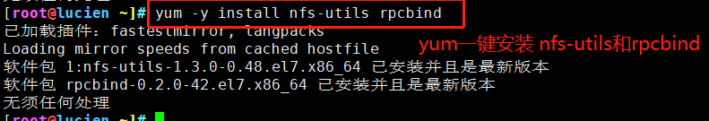
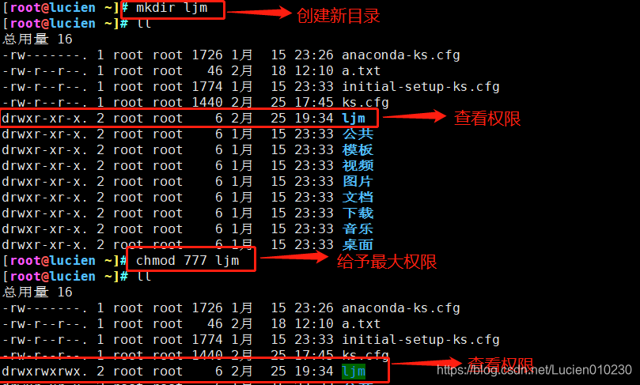
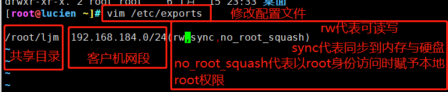
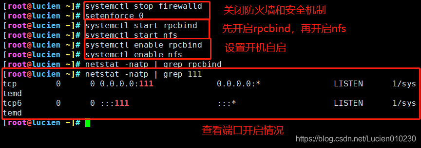
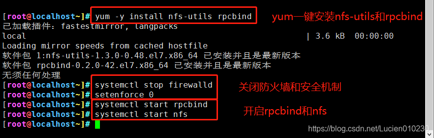
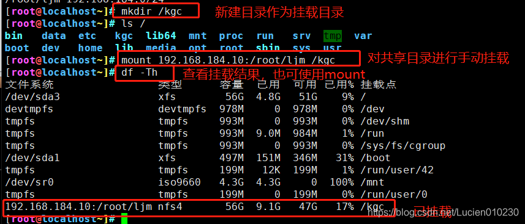
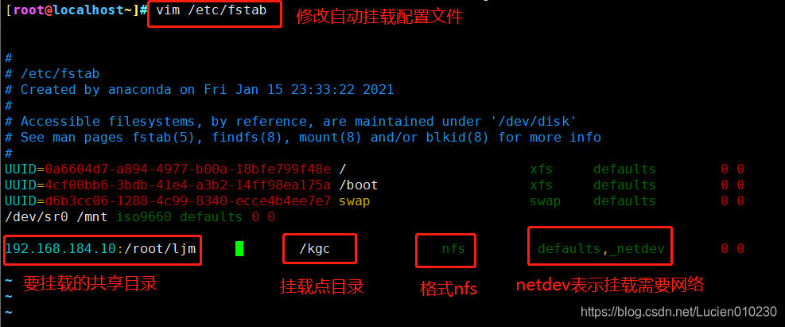
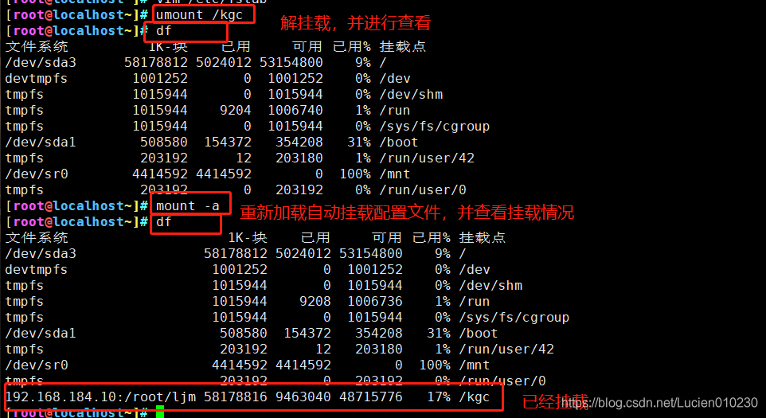
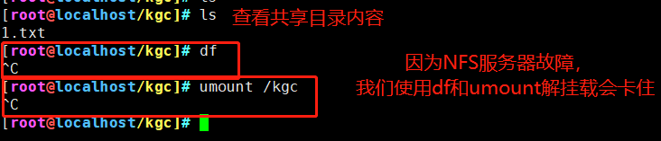
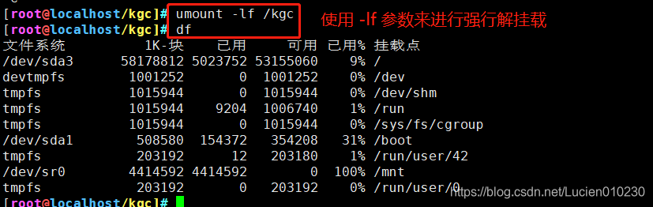

# NFS

　　一、NFS简介  
 NFS是一种基于TCP/IP传输的网络文件系统协议。通过使用NFS协议，客户机可以像访问本地目录一样访问远程服务器中的共享资源。  
 对于大多数负载均衡群集来说，使用NFS协议来共享数据存储是比较常见的做法，NFS也是NAS存储设备必然支持的一种协议。但是由于NFS没有用户认证机制，而且数据在网络上明文传输，所以安全性很差，一般只能在局域网中使用。  
 NFS 服务的实现依赖于 RPC（Remote Process Call，远端过程调用）机制，以完成远程到本地的映射过程。所以需要安装 nfs-utils、rpcbind 软件包来提供 NFS共享服务，前者用于 NFS 共享发布和访问，后者用于 RPC 支持。  
二、NSF服务  
1、/etc/exports 配置文件  
格式  
​​

### 2、服务器使用NFS发布共享资源

#### ①安装 nfs-utils、rpcbind 软件包

​​

​​

#### ②、设置共享目录

​​

​​

　　权限选项	说明  
rw	表示允许读写  
ro	表示为只读  
sync	表示同步写入到内存与硬盘中  
async	将数据先保存在内存缓冲区中，必要时才写入磁盘  
no_root_squash	表示当客户机以root身份访问时赋予本地root权限（默认是root_squash）  
root_squash	表示客户机用root用户访问该共享目录时，将root用户映射成匿名用户  
all_squash	所有访问用户都映射为匿名用户或用户组  
subtree_check（默认）	若输出目录是一个子目录，则nfs服务器将检查其父目录的权限  
no_subtree_check	即使输出目录是一个子目录，nfs服务器也不检查其父目录的权限，这样可以提高效率  
anonuid=xxx	指定NFS服务器/etc/passwd文件中的匿名用户的UID  
anongid=xxx	指定NFS服务器/etc/passwd文件中的匿名用户的GID

#### ③、启动NFS服务

​​

#### ④、查看本机发布的 NFS共享目录

​​

### 3、在客户机中访问NFS共享资源

#### ①、安装nfs-utils、rpcbind 软件包，并开启服务

​​

#### ②、查看NFS服务器端共享的目录

​​

#### ③、手动挂载NFS共享目录

​​

#### ④、设置自动挂载

​​

#### ⑤、查看自动挂载是否设置成功

​​

#### ⑥、强制解挂（当服务器突然断掉，而客户端还在查看共享目录时）

​​

​​

​​
