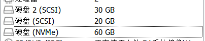
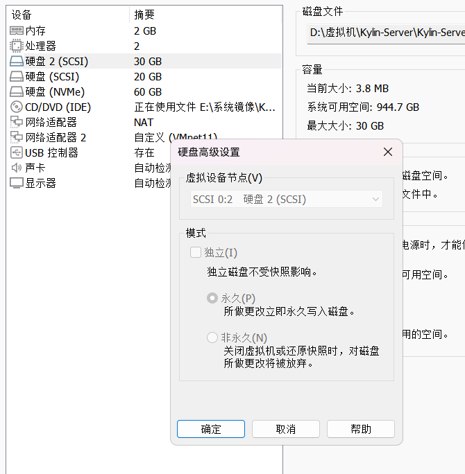
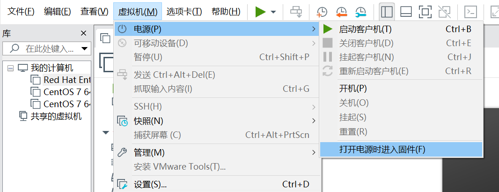
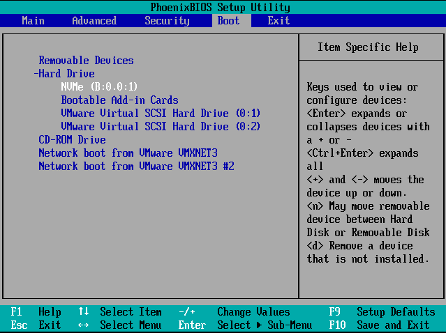
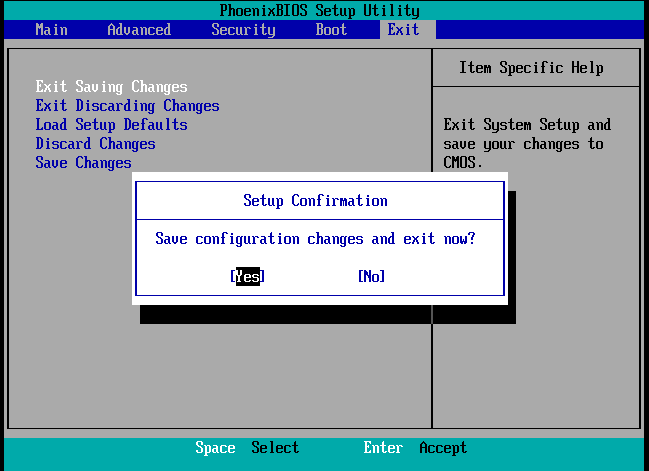

# VMware虚拟机添加硬盘后无法启动

　　**问题描述：**

　　在原虚拟机系统盘是NVMe的情况下，新添加两块SCSI硬盘导致无法开机

​​

　　**原因：**

　　计算机启动顺序识别错误，将新增的空硬盘作为了系统盘进行启动，所以无法启动系统。

　　如果添加的新盘与系统盘类型一致的情况下，不会出现这种情况。

　　**解决方案：**

　　调整启动顺序及硬盘优先级

　　1.调整SCSI硬盘节点编号

　　在关机状态下，虚拟机设置-硬盘-高级

　　注意：两块SCSI硬盘编号不同，便于后面调整启动顺序。顺序先后不会有其他影响

​​

　　2.进入BIOS，调整优先级

​​

　　系统启动后会进入PhoenixBIOS Setup Utility

　　左右键移动到Boot选项卡，移动到Hard Dreive 回车将它展开

　　按shift和+号将选中的设备上移（右边框框其实都有提示，要多看英文提示）

　　将NVMe移到最顶，因为我的系统是装在这个盘的，系统装在哪个盘，就把它移到最顶

​​

　　按→箭头，到Exit选项，回车，yes，回车

　　即可重新启动系统

​​

　　‍
