# WinSer服务配置

## 基础配置

​​

### ICMP回显

　　刚安装时，主机间的互相ping是不通的。此时可以打开icmp回显请求，解决此问题

​​

　　图形化：

　　高级安全防火墙 - 入站规则 - 文件和打印机共享(回显请求ICMPv4) - 启用

​​

​​

　　命令配置：

　　​` netsh firewall set icmpsetting 8 enable`​

​​

### DFS服务

　　在AppSrv上安装及配置 DFS 服务。

　　目录设置在F：\DFSsharedir。

　　配置DFS复制，使用DC1作为次要服务器，复制方式配置为交错拓扑。

　　在F：\DFSsharedir 文件夹内新建所有部门的文件夹。

　　所有部门的用户之可以访问部门内的文件，不可以跨部门访问别的部门文件夹内容。

　　Management用户组用户可以访问全局的文件夹。

　　‍

　　服务器管理-添加角色

​​

　　服务器管理-工具-DFS

​​

　　设置文件权限

​​

​​

### WSUS服务

　　WSUS更新服务

　　安装WSUS更新服务，更新补丁目录设置为“c: \wsusbackup" ;

　　创建更新组名称为“CHINASKILLS-WSUS" ;

　　每天凌晨03:00下发自动更新;

　　更新服务 器地址为“http://wsus.chinaskills.com:8530”。

#### 安装服务

​​

​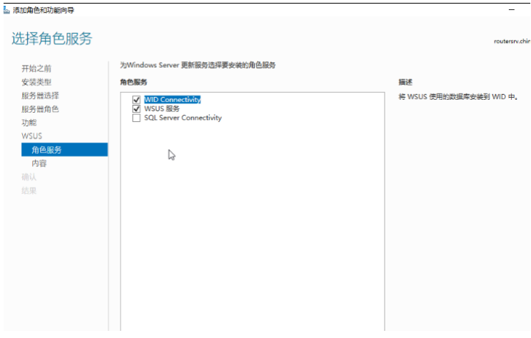​

​​

​​

​​

​​

​​

​​

#### 创建更新组

​​

​​

​​

​​

#### 配置策略并更新

​​

​​

​​

​​

​​

​​

​​

### DHCP

　　动态地址分配服务

　　安装和配置dhcp服务，为办公区域提供网络地址上网

　　地址池范围：192.168.0.100-192.168.0.200

#### 安装服务

​​

​​

#### 配置作用域

​​

​​

​​

​​

### 万维网服务

　　在RouterSrv1上搭建网站服务器。

　　将访问http://www.chinaskills.com的http的请求重定向到https://www.chinaskills.com站点。

　　网站内容设置为“该页面为www.chinaskills.com测试页！”。

　　将当前web根目录的设置为d:\wwwroot目录。

　　启用windows身份验证，只有通过身份验证的用户才能访问到该站点，manager用户组成员使用IE浏览

　　器打开不提示认证，直接访问。

　　设置“http://www.chinaskills.com/”网站的最大连接数为1000，网站连接超时为60sl；

　　使用W3C记录日志；每天创建一个新的日志文件，文件名格式:

　　日志只允许记录日期、时间、客户端IP地址、用户名、服务器IP地址、服务器端口号；

　　日志文件存储到“C:\WWWLogFile”目录中；

　　IIS（FTP）：

　　匿名用户上传的文件都将映射为ftp2用户

　　ftp在登录前显示Banner消息：

　　“Hello, unauthorized login is prohibited!”

#### 配置IIS

　　添加角色

​​

​​

​​

#### 证书配置

​​

​​

#### 添加站点

​​

​​

#### 配置重定向及认证

​​

​​

​​

​​

​​

　　刷新策略

​​

​​

#### IIS安全选项配置及日志配置用户日志

​​

​​

​​

​​

#### IIS（FTP）

​​

​​

​​

#### ftp用户映射

​​

​​

​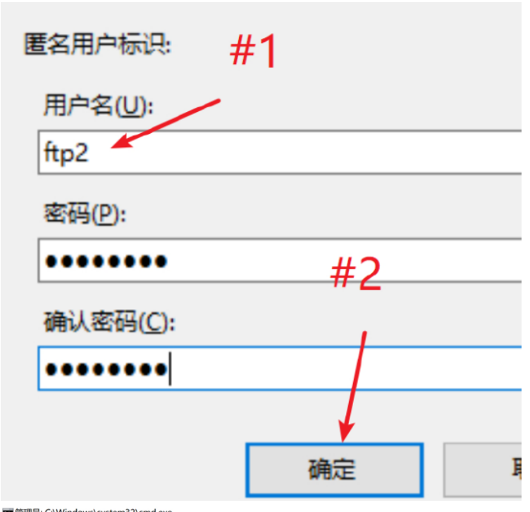​

​​

### Raid 磁盘管理

　　安装及配置软 RAID5。

　　在安装好的AppSrv虚拟机中添加三块10G虚拟磁盘。

　　组成RAID5，磁盘分区命名为卷标H盘: Raid5。 禁用raid5的写入

　　缓存;

　　手动测试破坏一块磁盘，做RAID磁盘修复；确认RAID5配置完毕。

#### 添加磁盘

​​

#### 创建RAID

​​

#### RAID磁盘修复

　　我们模拟一块硬盘损害，移除一块盘。

​​

　　然后就会出现这样

​​

　　在添加一块10G盘

​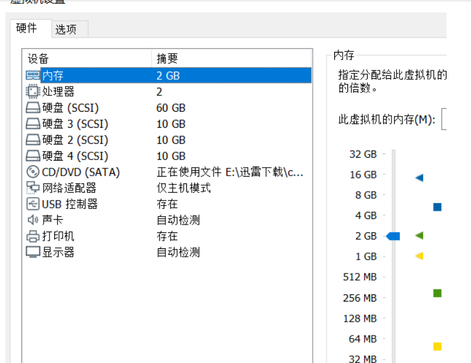​

​​

​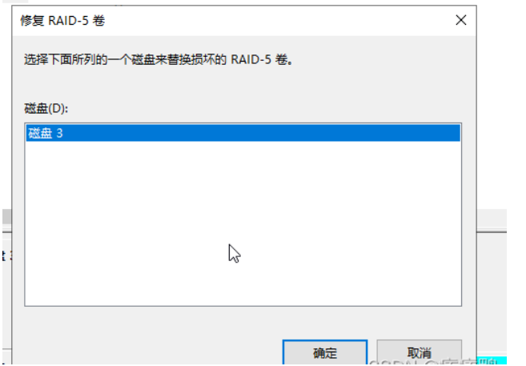​

### DC证书颁发机构

　　在DC1服务器上安装证书办法机构。

　　定义名称：CSK2023-ROOTCA。

　　证书颁发机构有效期：3 years。

　　为chinaskills.com域内的web站点颁发web证书。

　　当前拓扑内所有机器必须信任该证书颁发机构。

　　所域内所有计算机自动颁发一张计算机证书。

#### 安装及创建根证书

​​

​​

​​

​​

​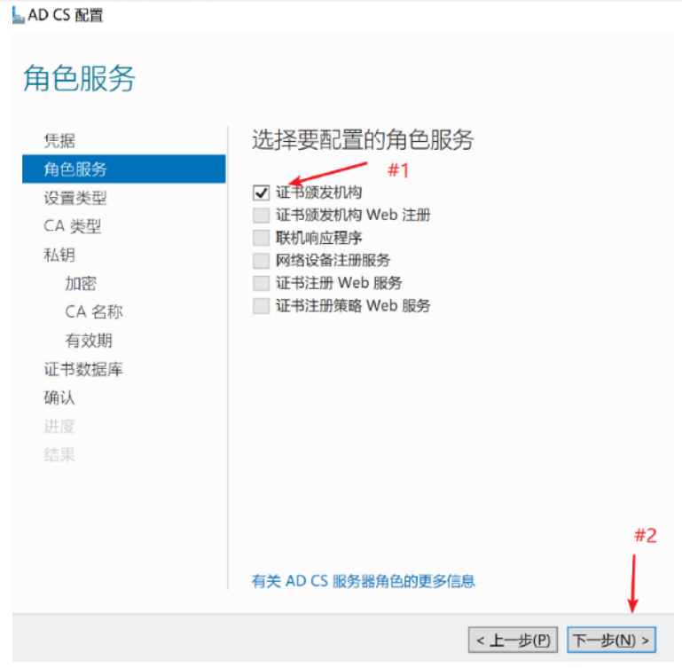​

​​

​​

#### 所域内所有计算机自动颁发一张计算机证书。

```shell
计算机配置-->策略-->Windows设置-->安全设置-->公钥策略-->证书服务客户端-证书注册策略
计算机配置-->策略-->Windows设置-->安全设置-->公钥策略-->证书服务客户端-自动注册
```

​​

​​

​​

​​

​​

### 活动目录域服务

　　在DCSERVER和SDCSERVER服务器上安装活动目录域服务，DCSERVER作为主域控，SDCSERVER作为备份域控，活动目录域名为：chinaskills.com。

　　域用户能够使用[username]@csk.cn进行登录。

　　创建一个名为“CSK”的OU，并新建以下域用户和组：

　　sa01-sa20，请将该用户添加到sales用户组。

　　it01-it20，请将该用户添加到IT用户组。

　　ma01-ma10，请将该用户添加到manager用户组。

　　许除manager 组和IT组，所有用户隐藏C盘。

　　除manager 组和IT组，所有普通给用户禁止使用cmd。

　　禁止客户端电脑显示用户首次登录动画。

　　所有用户的IE浏览器首页设置为“https://www.chinaskills.com”。

　　域内的所有计算机（除dc外），当dc服务器不可用时，禁止使用缓存登录。

#### 安装配置活动目录

　　DC

​​

​​

​​

​​

​​

​​

　　SDC加入域再安装服务配置

​​

​​

​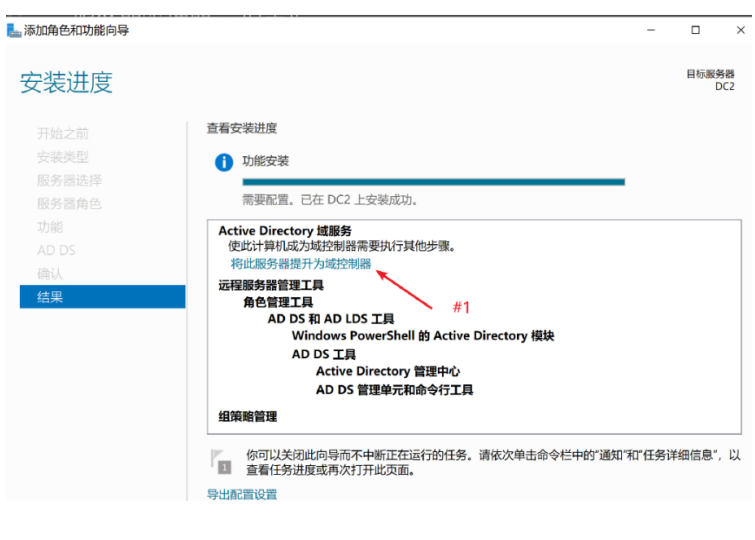​

​​

​​

​​

​​

#### 配置后缀和创建用户组及批量建立用户并加入组

​​

​​

​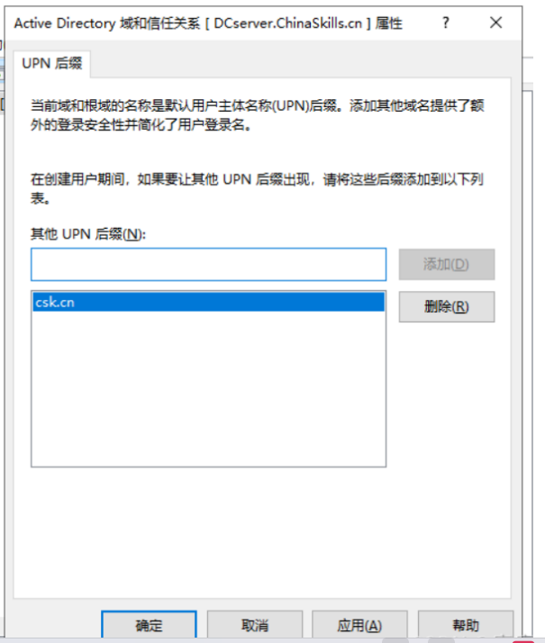​

​​

​​

​​

​​

​​

​​

​​

```shell
for /l %a in (1,1,9) do dsadd user "cn=sa0%a,ou=CSK,dc=chinaskills,dc=com" -pwd ChinaSkill23! -memberof "cn=sales,ou=CSK,dc=chinaskills,dc=com" -upn sa0%a@csk.cn

for /l %a in (10,1,20) do dsadd user "cn=sa0%a,ou=CSK,dc=chinaskills,dc=com" -pwd ChinaSkill23! -memberof "cn=sales,ou=CSK,dc=chinaskills,dc=com" -upn sa0%a@csk.cn

for /l %a in (1,1,9) do dsadd user "cn=it0%a,ou=CSK,dc=chinaskills,dc=com" -pwd ChinaSkill23! -memberof "cn=IT,ou=CSK,dc=chinaskills,dc=com" -upn it0%a@csk.cn

for /l %a in (10,1,20) do dsadd user "cn=it0%a,ou=CSK,dc=chinaskills,dc=com" -pwd ChinaSkill23! -memberof "cn=IT,ou=CSK,dc=chinaskills,dc=com" -upn it0%a@csk.cn

for /l %a in (1,1,9) do dsadd user "cn=ma0%a,ou=CSK,dc=chinaskills,dc=com" -pwd ChinaSkill23! -memberof "cn=manager,ou=CSK,dc=chinaskills,dc=com" -upn ma0%a@csk.cn

dsadd user "cn=ma10,ou=CSK,dc=chinaskills,dc=com" -pwd ChinaSkills23! -memberof "cn=manager,ou=CSK,dc=chinaskills,dc=com" -upn ma10@csk.cn
```

​​

​​

​​

​​

​​

​​

　　Manager组也是一样操作

​​

　　用户配置-->策略-->管理模板-->Windows组件-->文件资源管理器-->隐藏“我的电脑”中的这些指定驱动器

​​

　　用户配置-->策略-->管理模板-->系统-->阻止访问命令提示符

​​

　　刷新策略

​​

### DNS域名解析服务

　　安装DNS服务器，根据题目要求创建必要的正向区域和反向区域的DNS解析

　　把当前机器作为互联网根域服务器，创建test1.com-test100.com，并在所有正向区域中创建一条A记录，解析到本地址

#### 安装dns并添加记录

　　ispsrv

​​

#### 批量创建

​​

```shell
for /L %q in (1,1,100) do dnscmd /zoneadd test%q.com /Primary /file test%q.com.zone

for /L %a in (1,1,100) do dnscmd /recordadd test%a.com test%a.com. A 100.100.100.100
```

### 互联网访问检测

　　为了模拟Internet 访问测试，请搭建网卡互联网检测服务。

#### 搭建服务

​​

　　首先参考regedit 注册表，要知道怎么修改​`HKEY_LOCAL_MACHINE\SYSTEM\CurrentControlSet\Services\NlaSvc\Parameters\Internet`​

​​

​​

#### 配置DNS服务

​​

​​

​​

​​

​​

​​

#### 配置IIS

​​

​​

​​

​​

### 路由转发功能及DHCP中继

　　路由功能

　　安装Remote Access 服务开启路由转发，为当前实验环境提供路由功能。

　　启用网络地址转换功能，实现内部客户端访问互联网资源。

　　配置网络地址转换，允许互联网区域客户端访问AppSrv上的HTTP资源。

　　动态地址分配中继服务

　　安装和配置dhcp relay服务，为办公区域网络提供地址上网。

　　DHCP服务器位于AppSrv服务器上。

#### 安装Remote Access

​​

​​

#### 配置转发以及NAT转换

​​

​​

​​

​​

　　.​

​​

​​

​​

#### 允许互联网区域客户端访问AppSrv上的HTTP资源

​​

​​

​​

#### 安装和配置dhcp relay

​​

​​

​​

​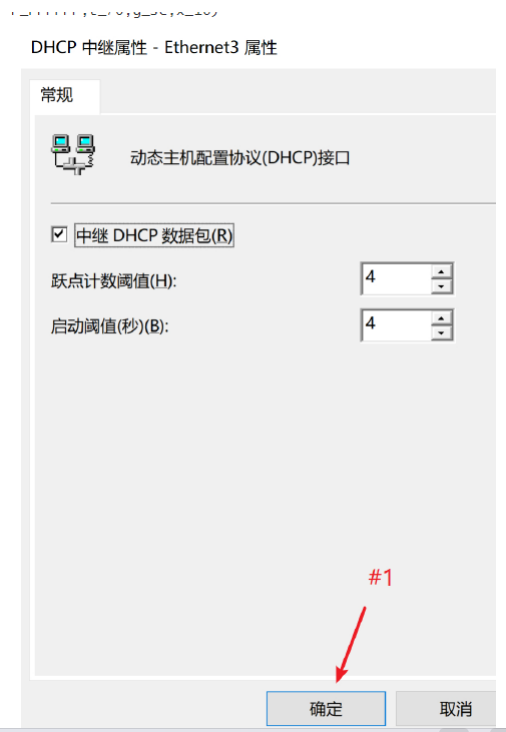​

​​

### RDS远程桌面服务

　　在AppSrv安装和配置RDS服务，用户通过

　　“https:// app. chinaski1ls. com/rdweb"进行访问;

　　该页面无证书警告;

　　用户可以获取以下应用: Notepad.

#### 安装证书服务

　　DC上配置证书模板

​​

​​

​​

​​

​​

​​

​​

​​

​​

#### 安装远程桌面服务

　　APPSRV

​​

​​

​​

​​

​​

​​

​​

​​

​​

　　等待重启

​​

​​

​​

​​

​​

​​

​​

​​

​​

​​

　　上面2个绑定证书步骤一样

​​

　　发布notepad

​​

​​

　　位置在C盘windows下面

​​

​​

#### 测试

　　去主域DC创建一条A记录

​​

​​

　　客户端打开浏览器

　　输入https://app.chinaskills.com/rdweb

​​

​​

​​

### L2TP/IPsec VPN

　　虚拟专用网络

　　设置L2Tp/IPSe， IKE通道采用证书进行验证;

　　L2TP通道使用chinaskills. com域内用户进行身份验证，仅允许manager组内用户通过身份证验证;

　　对于VPN客户端，请使用IP范围192. 168. 1.200-192. 168.1. 220/24.

　　NPS (网络策略服务)

　　在DCServer.上安装网络策略服务作为VP用户登录验证;

　　仅允许L2TP/IPSE VPN 进行VPN连接访问验证;

#### 安装证书服务和nps配置

​​

​​

​​

​​

​​

​​

​​

​​

​​

　　NPS

​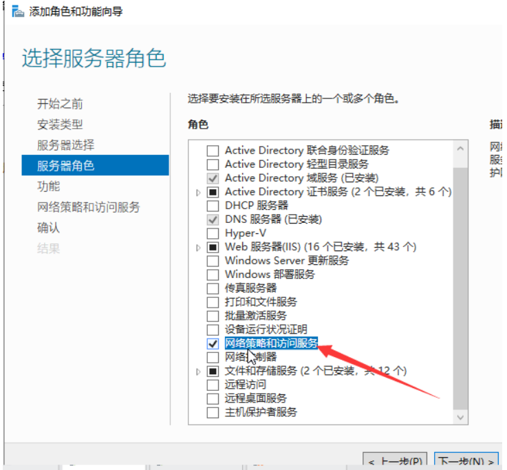​

​​

​​

​​

​​

​​

​​

​​

​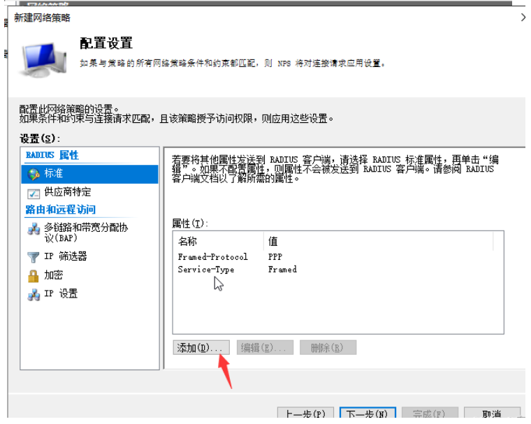​

​​

​​

#### 安装路由远程访问服务和配置证书

​​

​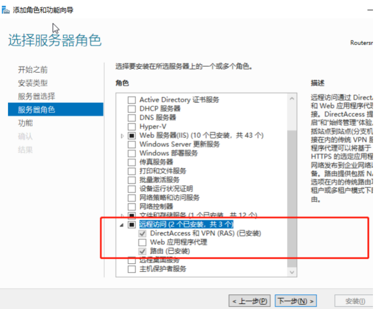​

​​

​​

​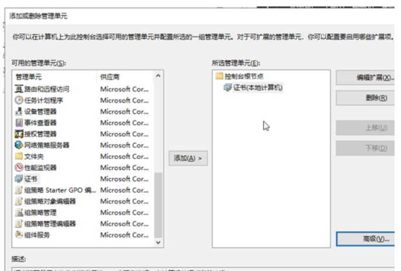​

​​

​​

​​

​​

​​

​​

​​

​​

​​

​​

​​

​​

​​

​​

​​

​​

​​

#### 测试

　　把证书导出到客户端

​​

​​

​​

​​

​​

​​

​​

　　windows + R"调出运行窗口，输入"c:\WINDOWS\system32\drivers\etc"

​​

​​

​​

​​

​​

​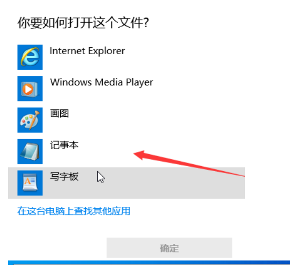​

​​

​​

​​

​​

​​

​​

　　‍
