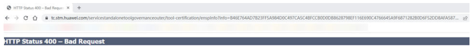

# enspPro常见问题解答

### 1.登录数通模拟器eNSP-Pro网页时报无法访问此页面

　　查看代理服务器开关是否开启，若代理服务器开关开启，需屏蔽代理服务器。

​​

### 2.虚拟机启动成功后，无法通过浏览器访问 eNSP-Pro，报错“HTTP Status 400 – Bad Request”

​​

　　重启虚拟机并清理一下浏览器Cookie。

### 3.登录 eNSP-Pro 的时候，工具报服务连通性检测错误

​​

　　网卡设置错误，网卡2改为nat模式，保证能连接外网。并重启虚拟机

### 4.登录 eNSP 后，工具报 ("code":1,"message":"系统内部错误，请联系客服反馈问题。”，"data":nul1} 错误

​​

　　重新启动虚拟机即可

### 5. 虚拟机安装完后，无法通过浏览器访问，出现“LOGIN FAIL”报错

　　登陆失败.该eNSP安装包已被其他用户注册并使用

​​

　　重新部署虚拟机

### 6. 登录 eNSP 后，工具报“服务器拒绝请求”，无法创建沙箱

　　浏览器的插件导致的。

### 7. 设备启动慢

1. 新建虚拟机时候，操作系统类型需要修改为linux，产品文档中有说明，如果类型

    不选择“Linux”会导致模拟网元启动性能下降，启动时间延长。
2. 其他可缩短网元启动时间的方式如下：

    电源模式设置为最高性能；

    尽量避免并行启动网元，建议逐个网元启动；

    优化笔记本散热；

    尽量不同时使用其他大量消耗资源的应用。

### 8. NE 设备执行 save 保存配置失败

　　当前版本NE设备的保存配置方法比较特殊，请参考产品文档中“导出配置”章节内容

　　进行操作。

　　NE设备保存配置

```shell
<HUAWEI> save ne.cfg 
Warning: Are you sure to save the configuration to cfcard:/ne.cfg? [Y/N]:y
Now saving the current configuration to the slot 17 
Info: Save the configuration successfully.
<HUAWEI> startup saved-configuration ne.cfg
Info: Succeeded in setting the configuration for booting system.
<HUAWEI>dir
Directory of cfcard:/ Idx Attr Size(Byte) Date Time FileName 
 0 dr-x - Mar 21 2023 06:17:08 $_checkpoint 
 1 dr-x - Mar 11 2023 04:57:57 $_install_hpg dir
 2 dr-x - Mar 11 2023 04:57:57 $_install_mod 
 3 dr-x - Mar 21 2023 06:17:40 $_license 
 4 dr-x - Mar 21 2023 06:17:46 $_security_info 
 5 dr-x - Mar 21 2023 06:16:47 $_startup 
 6 dr-x - Mar 21 2023 06:17:43 $_system 
 7 dr-x - Mar 21 2023 06:17:43 $_user 
 8 -rw- 5 Mar 21 2023 06:16:32 VRPV800R022C10SPC100B315D0311_ne40e_x8664.cc
 9 -rw- 2,934 Mar 21 2023 09:21:51 device.sys 
 10 -rw- 3,295 Mar 21 2023 09:21:32 ne.cfg 
 11 drwx - Mar 21 2023 06:17:48 ztp 37,235,712 KB total (30,117,348 
KB free)
```

　　‍

### 9. PC 进入休眠后再唤醒，eNSP 虚拟机无法 ping 通，需要重启虚拟机，该操作导致配置丢失

　　如果在使用过程中需要中断，建议通过配置导出方式导出配置数据。
