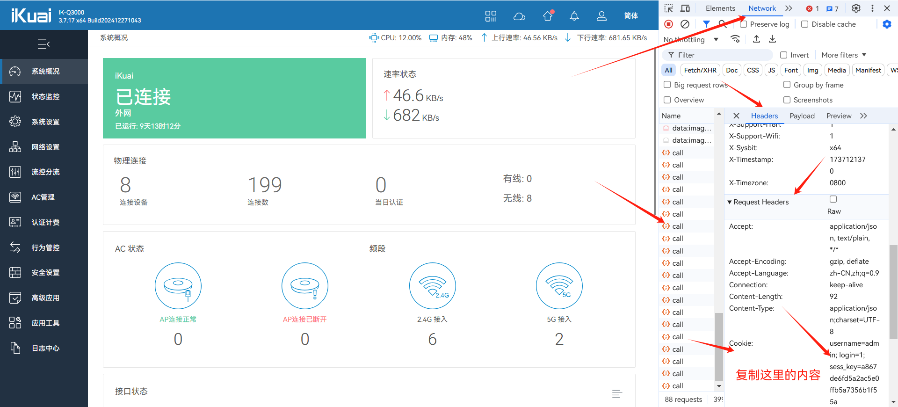
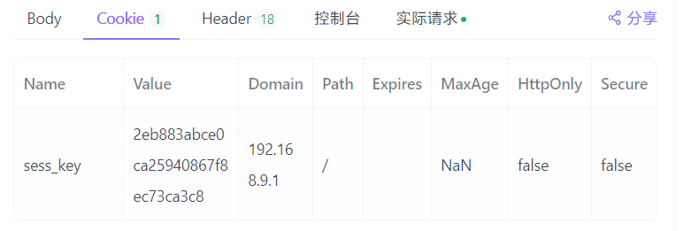

# iKuai路由系统API指南-常用查询接口

　　无论进行任何操作，都需要携带Cookie才能成功获取信息

## 获取Cookie

　　建议浏览器抓包，比较简单

### 浏览器抓包

　　登录到首页，按F12，打开控制面板。

　　选择network，随意点击一个请求，下滑找到Request Headers-Cookie 复制里面的内容

​​

### 模拟登录

　　向 路由器ip/Action/login 发送 POST 请求

　　以json格式发送以下内容

```shell
{
    "username":"admin",
    "passwd":"572a912b22bedddd7188688799cc3b08", 
    "pass": "c2FsdF8xMTU3MmE5MTJiMjJiZWRkZGQ3MTg4Njg4Nzk5Y2MzYjA4"
}
```

　　其中，passwd为密码的md5加密

　　pass为

```shell
salt_11拼接md5密码
如：
salt_11572a912b22bedddd7188688799cc3b08
进行base64加密，得到
c2FsdF8xMTU3MmE5MTJiMjJiZWRkZGQ3MTg4Njg4Nzk5Y2MzYjA4
```

　　成功发送请求后，返回Body

```shell
{
    "Result": 10000,
    "ErrMsg": "Success"
}
```

　　并携带Cookie

​​

　　与以下内容进行拼接

```shell
username=用户名; login=1; sess_key=获取到的ck
```

# 查询信息

### 统一查询接口

　　POST

```shell
路由器ip/Action/call
```

### 请求格式：

#### Header

```shell
Cookie=浏览器中获取到的ck，示例：
Cookie=username=admin; login=1; sess_key=2eb883abce0ca25940867f8ec73ca3c8
```

#### Body

　　以JSON格式发送请求

```shell
{
  "func_name": "homepage",  // 请求接口
  "action": "show",
  "param": {
    "TYPE": "ether_info,snapshoot" // 请求内容，可同时填写多个
  }
}
```

## homepage 首页接口

　　请求 Body 里 param 的Type值：

### ether_info 获取接口物理信息

　　获取mac地址等信息

　　返回值

```shell
{
    "Result": 30000,
    "ErrMsg": "Success",
    "Data": {
        "ether_info": {
            "veth1": {
                "driver": "mt7531",  // 网卡
                "type": "TP",  // 应该是厂商
                "mac": "08:9b:4b:12:2b:54",
                "link": 0,
                "speed": 0,
                "duplex": 0,
                "model": "MediaTek MT7531 Gigabit Ethernet Controller",
                "interface": "lan1",
                "lock": 0
            },
            省略重复内容
        }
    }
}
```

### snapshoot   获取接口信息

　　获取lan接口mac ip掩码等

　　获取wan接口的ip mac 掩码 网关 dns 在线状态等

　　返回值

```shell
{
    "Result": 30000,
    "ErrMsg": "Success",
    "Data": {
        "snapshoot_lan": [
            {
                "id": 1,
                "comment": "",
                "interface": "lan1",  // 接口名称
                "bandmode": 0,
                "linkmode": 4,
                "mac": "08:9b:4b:12:2b:54",   // mac
                "member": [
                    "ra0",
                    "veth1"  // 绑定的接口
                ],
                "ip_addr": "192.168.9.1",  // 接口ip
                "netmask": "255.255.255.0"   // 接口掩码
            },
            省略其他接口
        "snapshoot_wan": [
            {
                "id": 1,
                "comment": "",
                "interface": "wan1",
                "mac": "08:9e:4b:12:2b:54",  // mac
                "member": [
                    "veth4"
                ],
                "bandmode": 0,
                "default_route": 1,
                "internet": 2,
                "ip_addr": "10.4.71.74",  // ip
                "netmask": "255.255.255.255",  // 掩码
                "gateway": "10.4.64.1",  // 网关
                "dns1": "111.11.1.1",  // dns
                "dns2": "111.11.11.1",
                "count_static": 0,
                "count_dhcp": 0,
                "count_pppoe": 0,
                "count_check_fail": 0,
                "updatetime": 1736296104,  // 检测时间 时间戳姓氏
                "check_res": 0,
                "errmsg": "线路检测成功",
                "power": "",
                "isp": "",  // 运营商
                "imei": "",
                "qnw": "",
                "ccid": "",
                "isnr": "",
                "pcid": ""
            }
        ]
    }
}
```

### app_historical  获取上下行速率

　　获取协议流量分布 上传 下载 总计

　　流量单位Bytes

　　返回值

```shell
{
    "Result": 30000,
    "ErrMsg": "Success",
    "Data": {
      "app_historical": {
        "app_historical": [
          [
            {
              "name": "Unknown", // 协议名称
              "upload": "142", // 上传流量
              "download": "127" // 下载流量
            },
            {
              "name": "HTTP",
              "upload": "20",
              "download": "33"
            },
            {
              "name": "Download",
              "upload": "228",
              "download": "276"
            },
            {
              "name": "Transport",
              "upload": "0",
              "download": "0"
            },
            {
              "name": "IM",
              "upload": "157",
              "download": "155"
            },
            {
              "name": "Video",
              "upload": "786",
              "download": "409115"
            },
            {
              "name": "Common",
              "upload": "53238",
              "download": "2925"
            },
            {
              "name": "Game",
              "upload": "0",
              "download": "0"
            },
            {
              "name": "Others",
              "upload": "1584",
              "download": "443"
            },
            {
              "name": "Test",
              "upload": "0",
              "download": "0"
            },
            {
              "name": "Total",
              "upload": "56156",
              "download": "413075"
            }
          ],
            省略
      }
    }
  }
```

### app_flow  获取流量分布

　　获取每个协议在一定时间内使用流量

　　额外参数

```shell
minute: "60"  // 单位：分钟
```

　　返回值

```shell
{
  "Result": 30000,
  "ErrMsg": "Success",
  "Data": {
    "app_flow": {
      "app_flow": [
        {
          "HTTP": 212894332,  // 协议流量 单位Bytes
          "Download": 54688163,
          "Transport": 0,
          "IM": 24836575,
          "Video": 1059765666,
          "Common": 307136616,
          "Game": 363,
          "Others": 56914238,
          "Test": 0,
          "Unknown": 73303257,
          "Total": 1789539210 // 总计流量
        }
      ]
    }
  }
}
```

### ac_status  获取在线/离线AP数量

　　返回值

```shell
{
    "Result": 30000,
    "ErrMsg": "Success",
    "Data": {
        "ac_status": {
            "ap_count": 0, // ap数量
            "ap_online": 0 // 在线数量
        }
    }
}
```

### dhcp_addrpool_num  获取dhcp地址池的ip数量

　　返回值

```shell
{
    "Result": 30000,
    "ErrMsg": "Success",
    "Data": {
        "dhcp_addrpool_num": {
            "available_num": 290 // 剩余ip数量
        }
    }
}
```

### sysstat 获取系统信息

　　cpu 内存占用 上下行流量 在线用户数量

　　返回值

```shell
{
    "Result": 30000,
    "ErrMsg": "Success",
    "Data": {
        "sysstat": {
            "cpu": [
                "9.45%", // cpu占用百分比
                "9.00%",
                "9.00%"
            ],
            "cputemp": [],
            "freq": [
                "",
                ""
            ],
            "gwid": "2341245213",
            "hostname": "iKuai",
            "link\_status": 0,
            "memory": {
                "total": 497020,  // 内存占用总量
                "available": 260556,
                "free": 195948,
                "cached": 76604,
                "buffers": 0,
                "used": "47%" // 内存占用比率
            },
            "online\_user": {
                "count": 7, // 在线用户
                "count\_2g": 4, // 2.4g在线
                "count\_5g": 3, // 5g在线
                "count\_wired": 0,
                "count\_wireless": 7 // 无线在线数量
            },
            "stream": {
                "connect\_num": 158, // 连接数
                "upload": 36015,
                "download": 573776,
                "total\_up": 72295012401,  // 累计上传
                "total\_down": 114653745795 // 累计下行
            },
            "uptime": 828418,
            "verinfo": {
                "modelname": "IK-Q3000",
                "verstring": "3.7.17 x64 Build202412271043",
                "version": "3.7.17",
                "build\_date": 202412271043,
                "arch": "arm",
                "sysbit": "x64",
                "verflags": "",
                "is\_enterprise": 0,
                "support\_i18n": 1,
                "support\_dingtalk": 1,
                "support\_lcd": 0,
                "bootguide": "flash"
            }
        }
    }
}
```

## monitor_iface 线路监控接口

### iface_check  线路检测

　　获取wan口的ip 网关 类型 状态

　　返回值

```shell
{
    "Result": 30000,
    "ErrMsg": "Success",
    "Data": {
        "iface_check": [
            {
                "id": 1,
                "interface": "wan1",
                "parent_interface": "wan1",
                "ip_addr": "10.4.71.74",
                "gateway": "10.4.64.1",
                "internet": "PPPOE",
                "updatetime": "1736296104",
                "auto_switch": "自动",
                "result": "success",
                "errmsg": "线路检测成功",
                "comment": ""
            }
        ]
    }
}
```

### iface_stream  线路信息接口

　　获取线路的ip 连接数 上行速率 下行速率 累计上行 累计下行 今日上行丢包 今日下行丢包信息

　　返回值

```shell
{
    "Result": 30000,
    "ErrMsg": "Success",
    "Data": {
        "iface_stream": [
            {
                "interface": "lan1",
                "comment": "",
                "ip_addr": "192.168.9.1",
                "connect_num": "--",
                "upload": 53484,  // 上传速率
                "download": 3912,
                "total_up": 76635843466,  // 累计上行流量
                "total_down": 86272983579,
                "updropped": 0,
                "downdropped": 0,
                "uppacked": 0,
                "downpacked": 0
            }
            ...
        ]
    }
}
```

## monitor_lanip  终端监控

### data

　　获取终端的mac 连接数 上行速率 下行速率 累计上行 累计下行 在线时长 连接ap ssid 终端类型 设备厂商 备注

　　返回值

```shell
{
  "mac": "36:6e:24:13:ba:6e",
  "auth_type": 0,
  "client_type": "Android",
  "client_device": "Redmi",
  "apname": "",
  "ac_gid": 0,
  "link_addr": "",
  "bssid": "",
  "uprate": "286M",
  "downrate": "286M",
  "reject": 0,
  "id": 10,
  "hostname": "Redmi-Note-11T-Pro",
  "total_up": 9084140,
  "total_down": 266701440,
  "timestamp": 1737201695,
  "download": 232,
  "upload": 271,
  "client_model": "红米Note%2011T%20Pro",
  "client_typeid": 101003103,
  "signal": "-48",
  "frequencies": "2g",
  "username": "",
  "ppptype": "",
  "comment": "红米Note%2011T%20Pro",
  "ssid": "2G:TP-LINK_FD1C",
  "apmac": "08:9b:4b:12:2b:54",
  "dtalk_name": "",
  "uptime": "2025-01-18 20:01:35",
  "webid": 0,
  "connect_num": 50,
  "ip_addr": "192.168.9.11",
  "ip_addr_int": 3232237835
}
```

## monitor_lanipv6 终端监控

### data

　　获取终端的mac 连接数 上行速率 下行速率 累计上行 累计下行 在线时长 连接ap ssid 终端类型 设备厂商 备注

```shell
{
  "data": [
    {
      "mac": "60:7e:a4:77:9f:f9",
      "signal": "",
      "link_addr": "fe80::627e:a4ff:fe77:9ff9",
      "bssid": "",
      "uprate": "",
      "downrate": "",
      "id": 1,
      "hostname": "",
      "total_up": 1664,
      "total_down": 0,
      "timestamp": 1737206695,
      "download": 0,
      "upload": 0,
      "client_model": "",
      "client_typeid": 0,
      "ip_addr_int": 0,
      "connect_num": 2,
      "auth_type": 0,
      "client_type": "Unknown",
      "client_device": "Unknown",
      "apname": "",
      "ac_gid": 0,
      "username": "",
      "ppptype": "",
      "ssid": "",
      "apmac": "",
      "frequencies": "",
      "uptime": "2025-01-18 21:24:55",
      "webid": 0,
      "dtalk_name": "",
      "ip_addr": "2409:8a04:5633:2171:627e:a4ff:fe77:9ff9",
      "comment": "院内监控"
    },
    ...
  ],
  "total": 5
}
```

## monitor_l7qos 策略监控接口

### data 获取策略

　　获取策略名称 优先级 IP 上行速率 下行速率 上行总流量 下行总流量

　　返回值

```shell
{
  "Result": 30000,
  "ErrMsg": "Success",
  "Data": {
    "data": [
      {
        "wan1": [
          {
            "download": "592",
            "total_down": "16663664",
            "total_up": "41748652",
            "name": "小包数据",
            "prio": "0",
            "ipgroup": "所有内网地址",
            "upload": "320"
          },
          {
            "download": "0",
            "total_down": "0",
            "total_up": "0",
            "name": "自定义域名优先",
            "prio": "0",
            "ipgroup": "所有内网地址",
            "upload": "0"
          },
          {
            "download": "872",
            "total_down": "7746798907",
            "total_up": "829101300",
            "name": "HTTP协议",
            "prio": "1",
            "ipgroup": "所有内网地址",
            "upload": "440"
          },
          {
            "download": "21776",
            "total_down": "9619081158",
            "total_up": "71036043855",
            "name": "常用协议",
            "prio": "2",
            "ipgroup": "所有内网地址",
            "upload": "475656"
          },
          {
            "download": "3256",
            "total_down": "3809369083",
            "total_up": "644498160",
            "name": "网络通讯",
            "prio": "2",
            "ipgroup": "所有内网地址",
            "upload": "1472"
          },
          {
            "download": "373896",
            "total_down": "6764225501",
            "total_up": "398679639",
            "name": "未知应用",
            "prio": "3",
            "ipgroup": "所有内网地址",
            "upload": "11392"
          },
          {
            "download": "62728",
            "total_down": "10737413612",
            "total_up": "942113286",
            "name": "其它应用",
            "prio": "4",
            "ipgroup": "所有内网地址",
            "upload": "8680"
          },
          {
            "download": "24",
            "total_down": "43797736",
            "total_up": "5236387",
            "name": "网络游戏",
            "prio": "4",
            "ipgroup": "所有内网地址",
            "upload": "24"
          },
          {
            "download": "0",
            "total_down": "59750348",
            "total_up": "1643234",
            "name": "测速软件",
            "prio": "5",
            "ipgroup": "所有内网地址",
            "upload": "0"
          },
          {
            "download": "292824",
            "total_down": "34888707473",
            "total_up": "1817228332",
            "name": "网络视频",
            "prio": "5",
            "ipgroup": "所有内网地址",
            "upload": "12184"
          },
          {
            "download": "0",
            "total_down": "1679025668",
            "total_up": "28805146",
            "name": "文件传输",
            "prio": "6",
            "ipgroup": "所有内网地址",
            "upload": "0"
          },
          {
            "download": "1320",
            "total_down": "6216638702",
            "total_up": "296805980",
            "name": "网络下载",
            "prio": "7",
            "ipgroup": "所有内网地址",
            "upload": "1032"
          },
          {
            "download": 757288,
            "total_down": "81581471852",
            "name": "ALL",
            "total_up": "76041903971",
            "ipgroup": "ALL",
            "upload": 511200
          }
        ]
      }
    ]
  }
}
```

## dns 域名解析信息接口

### `dns_config`​ dns配置信息

　　获取dns配置的首选 备选dns 禁止ipv6解析状态 dns加速服务状态 dns加速模式

　　返回值

```shell
{
  "Result": 30000,
  "ErrMsg": "Success",
  "Data": {
    "data": [
      {
        "defense": 0,
        "query_args_ip": "",
        "query_head_ip": "",
        "id": 1,
        "enabled": "yes",
        "cachemode": 1,
        "forbid_dns_4a": 0,
        "proxy_force": 1,
        "proxy_force_dns": "",
        "network": 0,
        "dns1": "114.114.114.114",
        "query": "https://doh-m62s56ay-ikuai.doh.pub/dns-query",
        "dns2": "119.29.29.29"
      }
    ]
  }
}
```

### `dns_proxy`​ 反向代理配置

　　获取反向代理的域名 解析类型 解析地址 备注 状态

　　返回值

```shell
{
    "Result": 30000,
    "ErrMsg": "Success",
    "Data": {
        "data": [
            {
                "is_ipv6": 0,
                "dns_addr": "192.168.9.1",
                "parse_type": "ipv4",
                "enabled": "yes",
                "src_addr": "192.168.0.0/16",
                "comment": "测试反代",
                "id": 1,
                "domain": "ikuai.cn"
            }
        ]
    }
}
```

### `dns_proxy_total`​ 反向代理数目

　　获取已经配置的反向代理数量

　　返回值

```shell
{
    "Result": 30000,
    "ErrMsg": "Success",
    "Data": {
        "total": 1
    }
}
```

### `dns_cache`​ dns缓存信息

　　获取dns 今日 昨日 累计的请求dns次数 缓存命中次数 未命中次数 命中比例

　　返回值

```shell
{
    "Result": 30000,
    "ErrMsg": "Success",
    "Data": {
        "data": [
            {
                "request": 110068,
                "hit": 34206,
                "date": "2025-01-17",
                "save_time": 0,
                "id": 1,
                "miss": 75862
            },
            {
                "request": 94039,
                "hit": 35919,
                "date": "2025-01-18",
                "save_time": 0,
                "id": 2,
                "miss": 58120
            },
            {
                "request": 9326799,
                "hit": 4202621,
                "date": 0,
                "save_time": 0,
                "id": 3,
                "miss": 5124178
            }
        ]
    }
}
```

## `ipgroup`​ 终端分组接口

### data 分组信息

　　获取终端分组名称 ip列表

　　返回值

```shell
{
    "Result": 30000,
    "ErrMsg": "Success",
    "Data": {
        "data": [
            {
                "group_name": "内网全部",
                "type": 0,
                "addr_pool": "192.168.9.0/24",
                "id": 1,
                "comment": ""
            }
        ]
    }
}
```

## `ipgroupv6`​ 终端分组接口

### data 分组信息

　　获取终端分组名称 ip列表

　　返回值

```shell
{
    "Result": 30000,
    "ErrMsg": "Success",
    "Data": {
        "data": [
            {
                "group_name": "内网全部",
                "type": 0,
                "addr_pool": "",
                "id": 1,
                "comment": ""
            }
        ]
    }
}
```

## `macgroupv6`​ 终端分组接口

### data 分组信息

　　获取终端分组名称 mac列表

　　返回值

```shell
{
    "Result": 30000,
    "ErrMsg": "Success",
    "Data": {
        "data": [
            {
                "group_name": "内网全部",
                "type": 0,
                "addr_pool": "",
                "id": 1,
                "comment": ""
            }
        ]
    }
}
```

## `static_rt`​ 静态路由接口

### data 获取全部静态路由

　　获取静态路由的线路 目的地址 子网掩码 网关 优先级 备注 状态

　　返回值

```shell
{
  "Result": 30000,
  "ErrMsg": "Success",
  "Data": {
    "total": 1,
    "data": [
      {
        "comment": "测试静态路由",
        "interface": "auto",
        "dst_addr": "200.200.200.0",
        "netmask": "255.255.255.0",
        "gateway": "1.1.1.1",
        "prio": 1,
        "ip_type": "4",
        "dst_addr_int": 3368601600,
        "gateway_int": 16843009,
        "id": 1,
        "enabled": "yes"
      }
    ]
  }
}
```

## `static_rt_table`​ 静态路由表接口

### data IPv4静态路由表

　　获取线路 目的地址 子网掩码 网关 优先级

　　返回值

```shell
{
  "Result": 30000,
  "ErrMsg": "Success",
  "Data": {
    "total": 6,
    "data": [
      {
        "dst_addr_int": 0,
        "gateway": "10.4.64.1",
        "netmask": "0.0.0.0",
        "prio": 0,
        "interface": "wan1_ad",
        "id": 1,
        "dst_addr": "0.0.0.0"
      },
      {
        "dst_addr_int": 0,
        "gateway": "10.4.64.1",
        "netmask": "0.0.0.0",
        "prio": 1,
        "interface": "wan1_ad",
        "id": 2,
        "dst_addr": "0.0.0.0"
      },
      {
        "dst_addr_int": 168050689,
        "gateway": "0.0.0.0",
        "netmask": "255.255.255.255",
        "prio": 0,
        "interface": "wan1_ad",
        "id": 3,
        "dst_addr": "10.4.64.1"
      },
      {
        "dst_addr_int": 3232237824,
        "gateway": "0.0.0.0",
        "netmask": "255.255.255.0",
        "prio": 0,
        "interface": "lan1",
        "id": 4,
        "dst_addr": "192.168.9.0"
      },
      {
        "dst_addr_int": 3232238080,
        "gateway": "0.0.0.0",
        "netmask": "255.255.255.0",
        "prio": 0,
        "interface": "lan2",
        "id": 5,
        "dst_addr": "192.168.10.0"
      },
      {
        "dst_addr_int": 3232238336,
        "gateway": "0.0.0.0",
        "netmask": "255.255.255.0",
        "prio": 0,
        "interface": "lan3",
        "id": 6,
        "dst_addr": "192.168.11.0"
      }
    ]
  }
}
```

### data6 IPv6静态路由表

　　获取线路 目的地址 子网掩码 网关 优先级

　　返回值

```shell
{
  "Result": 30000,
  "ErrMsg": "Success",
  "Data": {
    "data": [
      {
        "dst_addr": "::/0",
        "gateway": "fe80::3ea3:7eff:fe95:7b2",
        "id": 1,
        "prio": 1,
        "interface": "wan1_ad"
      },
      {
        "dst_addr": "2409:8a04:5603:3b23::/64",
        "gateway": "",
        "id": 2,
        "prio": 256,
        "interface": "wan1_ad"
      },
      {
        "dst_addr": "2409:8a04:5633:2171::/64",
        "gateway": "",
        "id": 3,
        "prio": 256,
        "interface": "lan1"
      },
      {
        "dst_addr": "2409:8a04:5633:2172::/64",
        "gateway": "",
        "id": 4,
        "prio": 256,
        "interface": "lan2"
      },
      {
        "dst_addr": "2409:8a04:5633:2173::/64",
        "gateway": "",
        "id": 5,
        "prio": 256,
        "interface": "lan3"
      },
      {
        "dst_addr": "fe80::/64",
        "gateway": "",
        "id": 6,
        "prio": 256,
        "interface": "lan3"
      },
      {
        "dst_addr": "fe80::/64",
        "gateway": "",
        "id": 7,
        "prio": 256,
        "interface": "wan1"
      },
      {
        "dst_addr": "fe80::/64",
        "gateway": "",
        "id": 8,
        "prio": 256,
        "interface": "lan1"
      },
      {
        "dst_addr": "fe80::/64",
        "gateway": "",
        "id": 9,
        "prio": 256,
        "interface": "lan2"
      }
    ],
    "total": 9
  }
}
```

## `vlan`​ 获取vlan信息接口

### data 获取vlan信息

　　获取vlanid vlan名称 mac ip 子网掩码 线路 备注 状态

　　返回值

```shell
{
  "Result": 30000,
  "ErrMsg": "Success",
  "Data": {
    "total": 1,
    "data": [
      {
        "ip_mask": "",
        "interface": "lan1",
        "id": 1,
        "enabled": "yes",
        "comment": "",
        "vlan_id": "10",
        "vlan_name": "vlan10",
        "mac": "00:10:5f:8d:ee:43",
        "ip_addr": "",
        "netmask": "255.255.255.0",
        "ip_addr_int": 4294967295
      }
    ]
  }
}
```

　　‍
