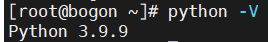
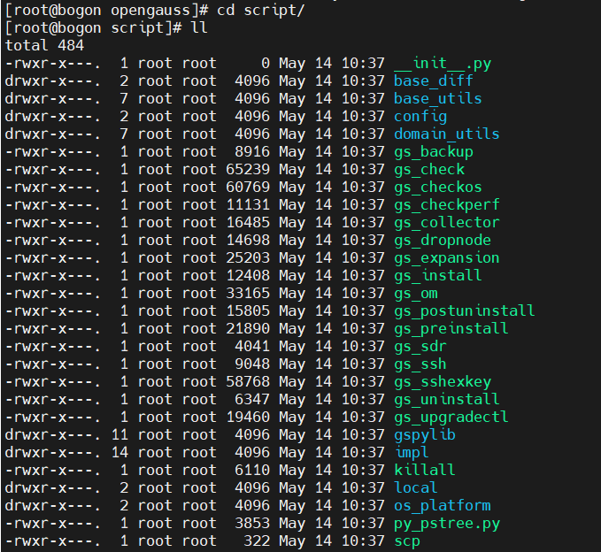
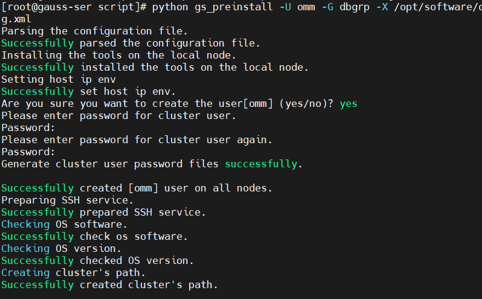
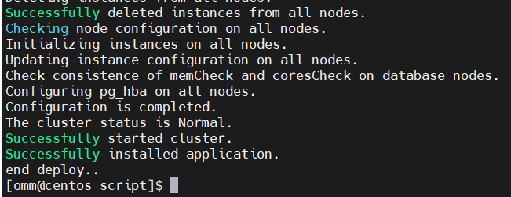
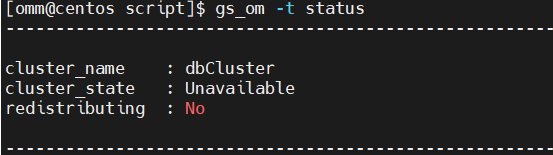
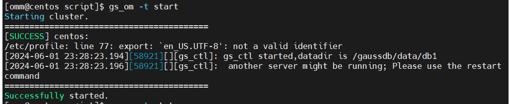
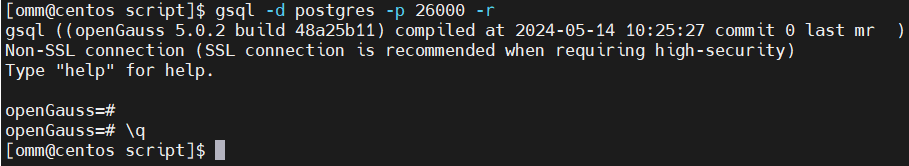

# openGauss安装流程2024

　　报错解决：

## openGauss安装

　　之后安装过程中openGauss用户互信，openEuler服务器需要用到Python-3.7.x命令，但是默认Python版本为Python-2.7.x，所以需要切换Python版本。

　　进入/usr/bin目录。

　　​`cd /usr/bin/`​

　　备份python文件

　　​`mv python python.bak `​

　　建立Python3软连接。

　　​`ln -s python3 /usr/bin/python `​

　　Euler默认为python3，版本3.9.9

　　Euler：`ln -s python3 python`​

　　验证Python版本。

　　​`python -V `​

​​

　　**安装相关服务**

　　​`yum install libaio* -y`​

### 2 安装openGauss

#### 2.1 解压安装包

```shell
mkdir -p /opt/software/opengauss  
chmod 755 /opt/software/opengauss/
mv openGauss-5.0.2-openEuler-64bit-all.tar.gz /opt/software/opengauss
```

#### 2.2**创建XML文件，用于安装数据库**

```shell
vim clusterconfig.xml
```

　　添加以下内容

　　＂opengauss01＂是服务器的主机名，＂192.xxx.x.xx＂为服务器的IP地址（私有），例如：192.168.133.154；其他value值可以不进行修改。

```shell
<?xml version="1.0" encoding="UTF-8"?> 
<ROOT> 
    <CLUSTER> 
        <PARAM name="clusterName" value="dbCluster" /> 
        <PARAM name="nodeNames" value="opengauss01" /> 
        <PARAM name="backIp1s" value="192.168.133.154"/> 
        <PARAM name="gaussdbAppPath" value="/opt/gaussdb/app" /> 
        <PARAM name="gaussdbLogPath" value="/var/log/gaussdb" /> 
        <PARAM name="gaussdbToolPath" value="/opt/huawei/wisequery" /> 
        <PARAM name="corePath" value="/opt/opengauss/corefile"/> 
        <PARAM name="clusterType" value="single-inst"/> 
    </CLUSTER> 
   
    <DEVICELIST> 
  
        <DEVICE sn="1000001"> 
            <PARAM name="name" value="opengauss01"/> 
            <PARAM name="azName" value="AZ1"/> 
            <PARAM name="azPriority" value="1"/> 
            <PARAM name="backIp1" value="192.168.133.154"/> 
            <PARAM name="sshIp1" value="192.168.133.154"/> 
     
	    <!--dbnode--> 
	    <PARAM name="dataNum" value="1"/> 
	    <PARAM name="dataPortBase" value="26000"/> 
	    <PARAM name="dataNode1" value="/gaussdb/data/db1"/> 
        </DEVICE> 
    </DEVICELIST> 
</ROOT>
```

|**参数**|**说明**|
| -----------------| --------------------------------------------------------------------------------------------------------------------------------------------------------------------------------------------------------------------------------------------------------------------------------------------------------------|
|clusterName|openGauss名称。|
|nodeNames|openGauss中主机名称。|
|backIp1s|主机在后端存储网络中的IP地址（内网IP）。所有openGauss主机使用后端存储网络通讯。|
|gaussdbAppPath|openGauss程序安装目录。此目录应满足如下要求：<br />•磁盘空间>1GB。<br />•与数据库所需其它路径相互独立，没有包含关系。|
|gaussdbLogPath|openGauss运行日志和操作日志存储目录。此目录应满足如下要求：<br />•磁盘空间建议根据主机上的数据库节点数规划。数据库节点预留1GB空间的基础上，再适当预留冗余空间。<br />•与openGauss所需其它路径相互独立，没有包含关系。<br />此路径可选。不指定的情况下，openGauss安装时会默认指定＂$GAUSSLOG/安装用户名＂作为日志目录。|
|tmpdbPath|数据库临时文件存放目录。<br />若不配置tmpdbPath，默认存放在/opt/huawei/wisequery/perfadm_db目录下。|
|gaussdbToolPath|openGauss系统工具目录，主要用于存放互信工具等。此目录应满足如下要求：<br />•磁盘空间>100MB。<br />•固定目录，与数据库所需其它目录相互独立，没有包含关系。<br />此目录为可选配置项。不指定的情况下，openGauss安装时会默认指定＂/opt/huawei/wisequery＂作为数据库系统工具目录。|
|corePath|openGauss core文件的指定目录。|

　　须知：

* ＂/opt/huawei/newsql/tools＂存放互信等工具，避免权限问题，不要把实例数据目录放在此目录下。
* 安装目录和数据目录须为空或者不存在，否则可能导致安装失败。
* 在对数据库节点的实例进行具体配置时，需确保配置的目录之间不相互耦合。即各个配置目录不关联，删除其中任意一个目录，不会级联删除其它目录。如gaussdbAppPath为＂/opt/gaussdb/app＂，gaussdbLogPath为＂/opt/gaussdb/app/omm＂。当gaussdbAppPath目录被删除时，会级联删除gaussdbLogPath目录，从而引起其它问题。
* 若需要安装脚本自动创建安装用户时，各配置的目录需保证不与系统创建的默认用户目录耦合关联。
* 配置openGauss路径和实例路径时，路径中不能包含＂|＂,＂;＂,＂&＂,＂$＂,＂<＂,＂>＂,＂`＂,＂\＂,＂'＂,＂\＂,＂{＂,＂}＂,＂(＂,＂)＂,＂[＂,＂]＂,＂~＂,＂*＂,＂?＂特殊字符。

#### 2.3 确保openssl版本正确

　　执行预安装前加载安装包中lib库

　　执行命令如下，其中packagePath为用户安装包放置的路径，本示例中为/opt/software/openGauss。

```shell
cat >>/etc/profile<<END
export packagePath=/opt/software/openGauss
export LD_LIBRARY_PATH=$packagePath/script/gspylib/clib:$LD_LIBRARY_PATH
END
```

　　刷新配置

　　​`source /etc/profile`​

#### 2.4 解压安装包

```shell
cd /opt/software/opengauss/
tar -xzvf openGauss-5.0.2-openEuler-64bit-all.tar.gz
tar -xzvf openGauss-5.0.2-openEuler-64bit-om.tar.gz
```

　　安装包解压后，会在/opt/software/openGauss路径下自动生成script子目录，并且在script目录下生成gs_preinstall等各种OM工具脚本。

```shell
cd script/
ll
```

​​

#### 2.5 交互式安装

```shell
python gs_preinstall -U omm -G dbgrp -X /opt/software/openGauss/clusterconfig.xml
```

　　命令中的omm为操作系统用户（同时omm也是openGauss的数据库管理员账号），dbgrp为运行openGauss的操作系统用户的群组名称，/opt/software/openGauss/clusterconfig.xml为openGauss配置文件路径。

　　在执行过程中，用户根据提示选择是否创建互信，填写 yes。

　　此时会创建操作系统omm用户，并对omm创建trust互信，并要求设置密码，设置为Admin@123（建议用户自定义设置密码）。

​​

#### 2.6 开始安装

```shell
chmod -R 755 /opt/software/openGauss/script/
su - omm
```

　　omm指的是前置脚本gs_preinstall中-U参数指定的用户。

　　安装脚本gs_install必须以前置脚本中指定的omm执行，否则，脚本执行会报错。

```shell
gs_install -X /opt/software/openGauss/clusterconfig.xml --gsinit-parameter="--encoding=UTF8"  --dn-guc="max_process_memory=5GB"  --dn-guc="shared_buffers=256MB" --dn-guc="bulk_write_ring_size=256MB" --dn-guc="cstore_buffers=16MB"

```

　　/opt/software/ openGauss/clusterconfig.xml为openGauss配置文件的路径。在执行过程中，用户需根据提示输入数据库管理员omm用户的密码，密码具有一定的复杂度，为保证用户正常使用该数据库，请记住输入的数据库密码。

　　参数说明如下：

* Encoding：设置字符集；
* max_process_memory：设置一个数据库节点可用的最大物理内存；
* shared_buffers：设置openGauss使用的共享内存大小；
* bulk_write_ring_size：大批量数据写入触发时，该操作使用的环形缓冲区大小；
* cstore_buffers：设置列存所使用的共享缓冲区的大小。
* 按照设置密码要求，设置密码为GaussDB@123（**建议用户自定义设置复杂密码**）

​​

　　‍

### 3 启动数据库

#### 3.1 查看服务状态

　　​`gs_om -t start`​

　　启动状态

​​

　　未启动状态

​​

#### 3.2 启动服务

　　​`gs_om -t start`​ 默认为启动状态

​​

#### 3.3 进入数据库

　　​`gsql -d postgres -p 26000 -r`​

​​

　　‍
