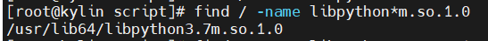
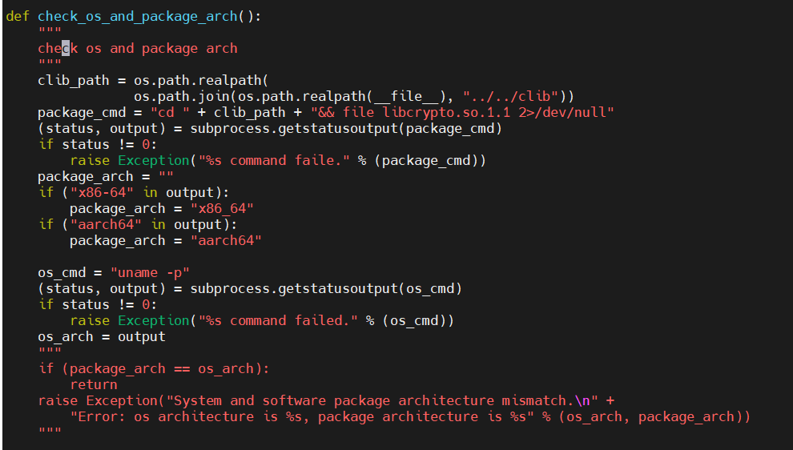
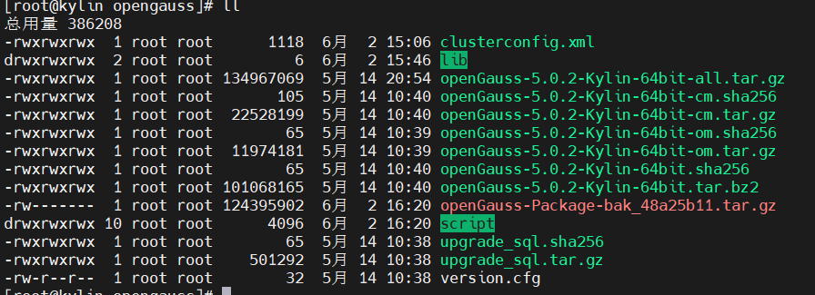
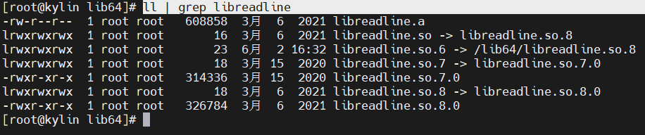
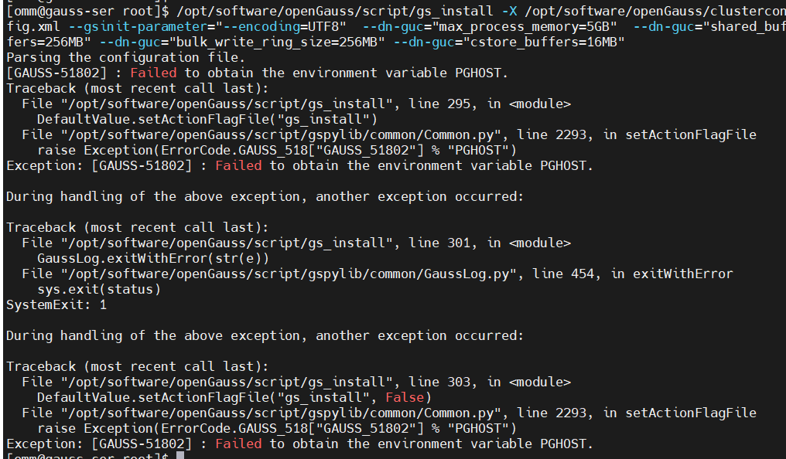
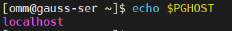

# openGauss报错解决方案

　　完整安装流程

　　‍

#### 2.5 交互式安装

```shell
python gs_preinstall -U omm -G dbgrp -X /opt/software/openGauss/clusterconfig.xml
```

　　报错Error: os architecture is x86_64, package architecture is aarch64

　　下载错版本了，根据自己的架构下载openGauss版本，使用`arch`​查询架构

　　提示[GAUSS-50236] : The /opt/software/openGauss/clusterconfig.xml does not exist or the permission on the upper-layer directory is insufficient. 找不到文件

　　检查文件路径 区分大小写

　　报错[GAUSS-51620] : Failed to obtain local instance information. It is not a host name bogon.

　　修改主机名，注意与xml文件的`nodeNames`​字段保持一致，同时与`<DEVICE sn="1000001">`​下的`name`​字段一致

　　报错ImportError: libpython3.6m.so.1.0: cannot open shared object file: No such file or directory

　　缺少 libpython3.6m.so.1.0 库

　　系统中存在ibpython3.7m.so.1.0，创建一个软链接指向3.6即可

　　​`find / -name libpython*m.so.1.0`​

​​

　　​`ln -s /usr/lib64/libpython3.7m.so.1.0 /usr/lib64/libpython3.6m.so.1.0`​

　　预安装命令执行时卡住，没有输出内容

　　添加 `--unused-third-party`​ 可选项

　　报错Error: os architecture is x86_64, package architecture is

　　麒麟：架构一致，不知道为什么报错

　　假装自己是centos也不行，修改源码，跳过检测

　　修改 `/opt/software/opengauss/script/gspylib/common/CheckPythonVersion.py`​   文件的 `check_os_and_package_arch()`​ 函数

　　在68行附近，注释掉

​​

　　报错ModuleNotFoundError: No module named 'netifaces'

　　缺少该模块，安装即可，其他模块一致处理

　　​`pip3 install netifaces`​

　　报错[GAUSS-50201] : The ['openGauss-5.0.2-openEuler-64bit.tar.bz2', 'openGauss-5.0.2-Kylin-64bit.tar.bz2', 'openGauss-5.0.2-UnionTech-64bit.tar.bz2'] does not exist.

　　返回上级目录

　　修改相关文件名

​​

　　[GAUSS-51103] : Failed to execute the PSSH command [encrypt ...].Error is:./encrypt: error while loading shared libraries: libreadline.so.6: cannot open shared object file: No such file or directory

　　进入`/lib64`​ 目录

​​

　　查找相关文件，不存在就创建软链接

　　[GAUSS-52400] : Installation environment does not meet the desired result.  
Please get more details by "/opt/software/opengauss/script/gs_checkos -i A -h kylin --detail".

　　安装环境不满足要求，`/opt/software/opengauss/script/gs_checkos -i A -h kylin --detail`​ 按要求修改

#### 2.6 开始安装

```shell
chmod -R 755 /opt/software/openGauss/script/
su - omm
```

　　omm指的是前置脚本gs_preinstall中-U参数指定的用户。

　　安装脚本gs_install必须以前置脚本中指定的omm执行，否则，脚本执行会报错。

```shell
gs_install -X /opt/software/openGauss/clusterconfig.xml --gsinit-parameter="--encoding=UTF8"  --dn-guc="max_process_memory=5GB"  --dn-guc="shared_buffers=256MB" --dn-guc="bulk_write_ring_size=256MB" --dn-guc="cstore_buffers=16MB"

```

　　提示gs_install不存在 -bash: gs_install: command not found

　　使用绝对路径 `/opt/software/openGauss/script/gs_install`​

　　提示操作文件时没有权限

　　使用root用户将文件夹改777

　　Exception: [GAUSS-51802] : Failed to obtain the environment variable PGHOST.

　　猜测是主机名，修改成主机名并没有解决问题

​​

　　设置监听地址

```shell
export PGHOST=localhost
source ~/.bashc
```

​​

　　修改不生效？

```shell
vi .bashc
```

​​

　　Exception: [GAUSS-50201] : The 192.168.133.154 does not exist. Please check it.

　　欧拉报错，而centos却没有此问题

　　实际上，centos的`PGHOST`​值为`/opt/huawei/wisequery/omm_mppdb`​

　　欧拉执行`export PGHOST=/opt/huawei/wisequery/omm_mppdb`​

　　重新安装报错 `Exception: [GAUSS-50201] : The /opt/huawei/wisequery/omm_mppdb does not exist. Please check it.`​

　　实际中，eluer的/opt目录下没有相关文件夹，猜测是预安装的问题

　　所以这个值是干嘛用的？
