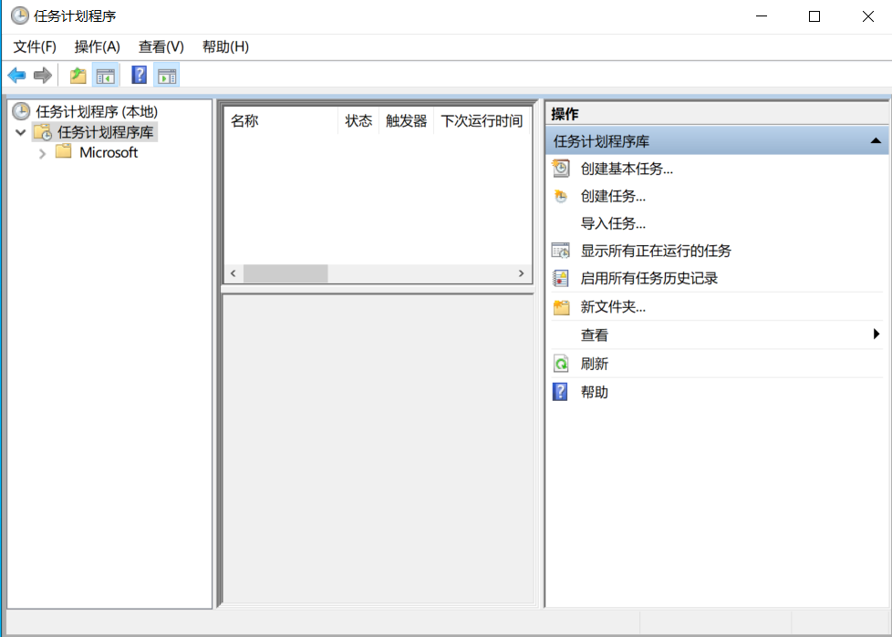
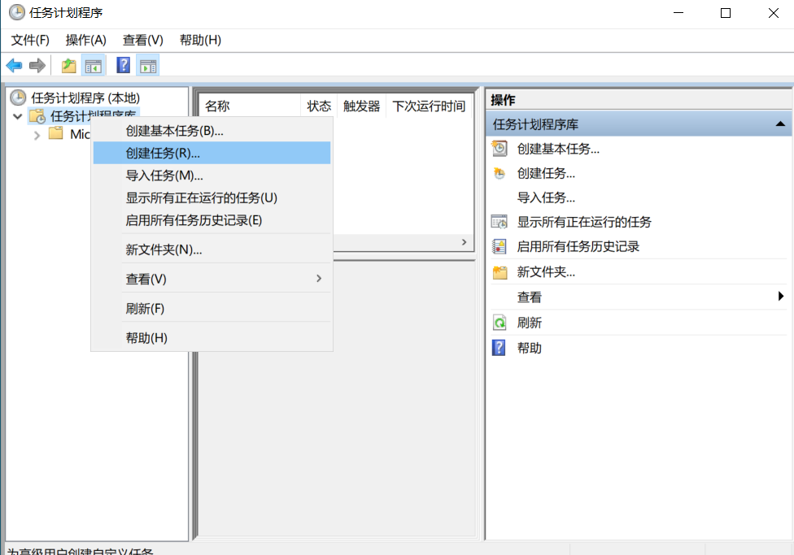
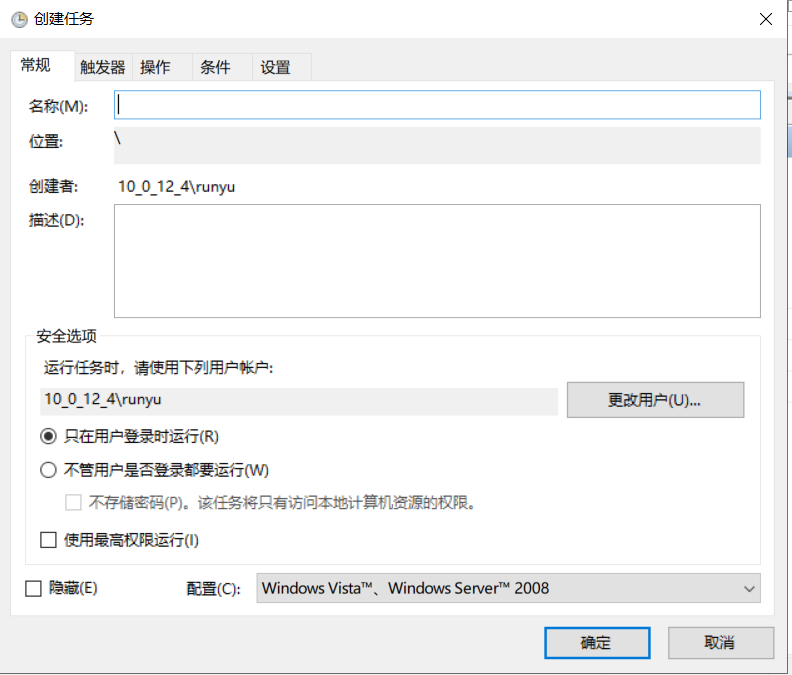
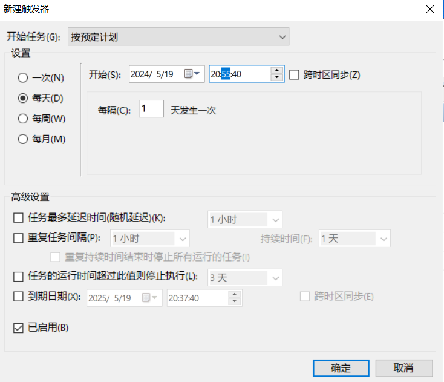
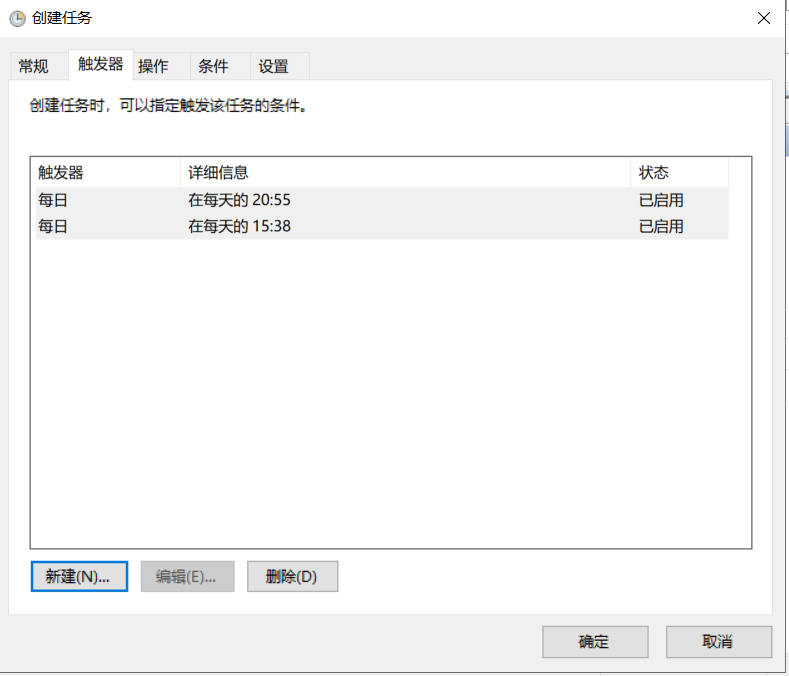
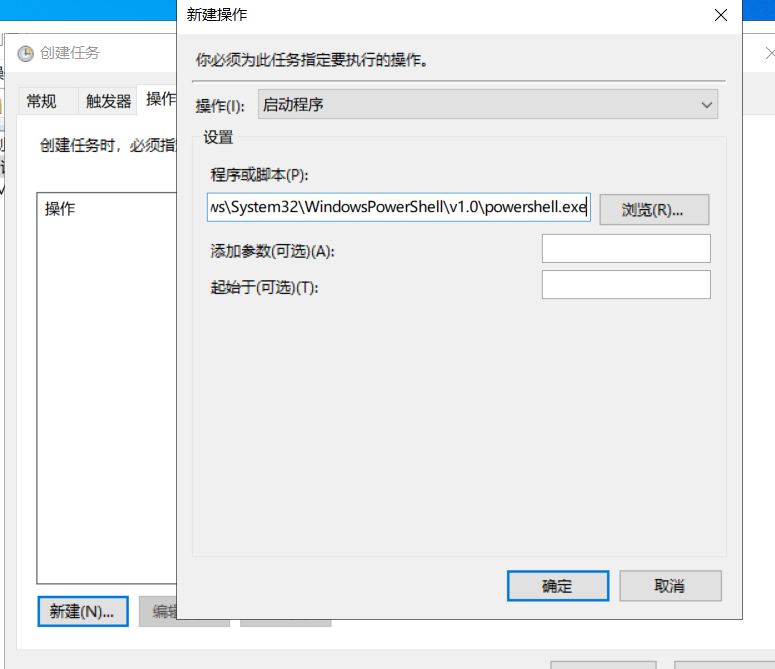
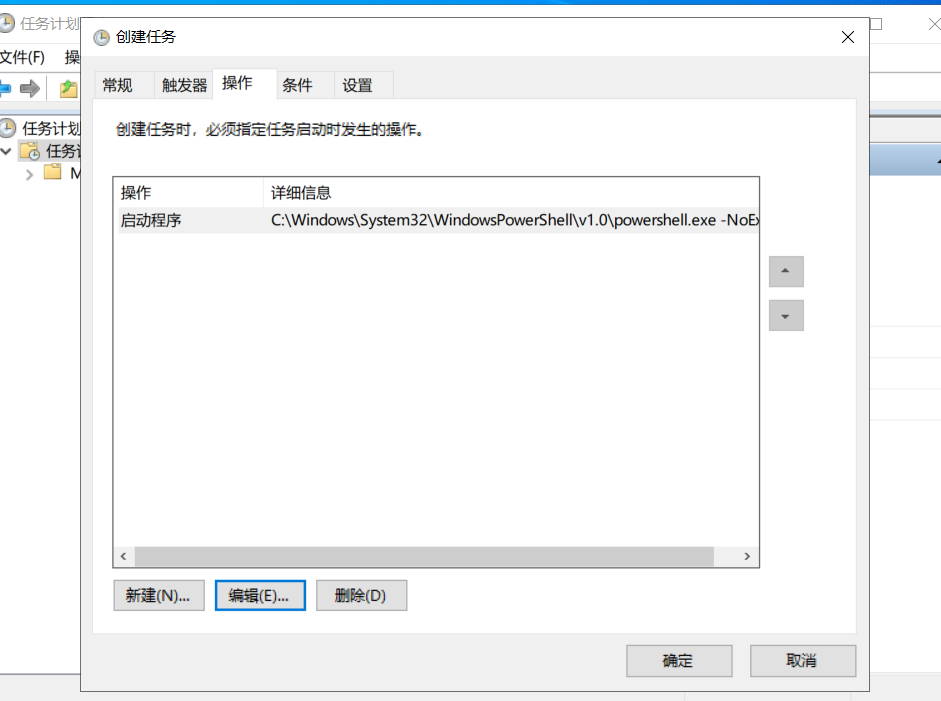
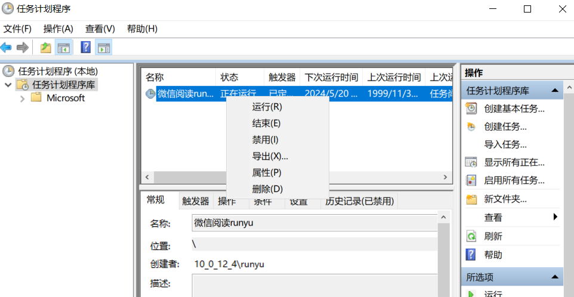

# windows定时任务运行PowerShell脚本

　　使用windows自带的 任务计划 程序实现定时运行指定程序

　　打开 任务计划程序 即可看到以下页面

​​

　　右键  - 创建任务

​​

　　这里可以填写计划名称、运行级别等情况

　　注意：PowerShell脚本需要使用最高权限运行

​​

　　触发器这里可以选择触发类型、频次等

　　这里选择 每天的20:55运行程序

​​

　　同时，可以设置多个触发器，满足任一条件即可运行

​​

　　操作这里选择 PowerShell程序，一般为

　　​`C:\Windows\System32\WindowsPowerShell\v1.0\powershell.exe`​

​​

　　可选参数这里填写

　　​`-NoExit -WindowStyle Hidden -c 脚本路径`​

​​

　　点击确定 保存即可

　　右键计划任务，点击允许，将状态改为正在运行，启用该任务

​​

　　配置成功，等到时间后会自动执行你设定的脚本

　　‍
