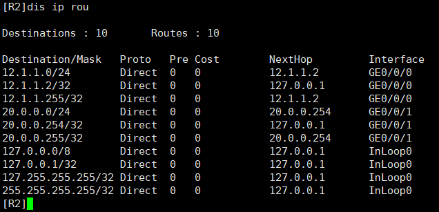
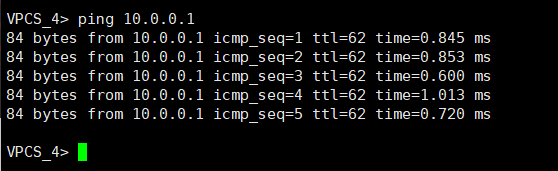

# 使用H3C模拟无路由互联互通实验

　　‍

　　使用策略路由PBR在路由表无对方内网路由的情况下实现互相通信。

　　在前两次实验（[使用ensp模拟双端无路由互联互通实验](http://ie.oldc.cc/article/2)、[使用eve模拟无路由互联互通实验](http://ie.oldc.cc/article/3)）中，虽然完成了实验，但结果都有点瑕疵，这次是使用H3C带来的完美版本。

　　环境：H3C Cloud

　　技术：策略路由PBR

　　拓扑：

​​

　　区域1使用 10.0.0.0 网段进行互联，区域2使用 20.0.0.0 进行互联。

　　区域之间使用 12.1.1.0 进行互联。

## 策略路由的基本介绍

　　在开始之前，先介绍一下什么是策略路由：

　　策略路由（Policy-Based Routing，PBR）是一种网络路由的技术，它允许根据特定的策略或条件对网络流量进行定制化的路由。

　　传统的路由是基于目标地址选择最佳路径进行转发，而PBR将路由决策与其他因素（如源地址、应用类型、协议等）相结合，以决定如何处理特定流量。

　　PBR的基本原理是通过创建并应用路由策略来匹配流量，并根据设定的策略将该流量定向到特定的出接口或下一跳地址。这允许网络管理员根据特定需求或策略来定制路由行为，例如：

* 根据源地址进行流量控制：将特定源地址的流量引导到不同的出口或下一跳地址，以实现分流或负载均衡。
* 根据应用类型进行优先级设置：根据流量中的应用类型（例如视频、音频、文件传输等）设置不同的优先级或服务质量。
* 根据安全需求重定向流量：根据安全策略，将特定流量（例如恶意流量或未经授权的流量）重定向到专用设备进行检查或阻止。

　　实施PBR通常涉及以下步骤：

1. 创建路由策略访问列表（Route-map）：定义匹配条件，如源地址、目标地址、协议等。
2. 定义路由策略：规定如果特定条件匹配，则如何处理流量，如指定下一跳地址或出接口。
3. 将路由策略应用到接口或特定流量：通过接口配置或ACL进行应用，以决定哪些流量将遵循PBR策略。
4. 验证和监控PBR的效果：测试和观察流量是否按照预期的策略进行处理。

　　这里最重要的一点：

　　**PBR的优先级高于路由表。也就是说，可以在路由表没有路由的情况下完成转发**

## 策略配置

### 基本配置

　　配置接口IP等。

　　R1：

```vim
[R1-GigabitEthernet0/0/0]ip add 12.1.1.1 24
[R1-GigabitEthernet0/0/1]ip add 10.0.0.254 24
```

　　R2：

```vim
[R2-GigabitEthernet0/0/0]ip add 12.1.1.2 24
[R2-GigabitEthernet0/0/1]ip add 20.0.0.254 24
```

### 策略配置

#### 创建ACl，匹配对端流量

　　源地址为本网段，目的地址为对方网段

　　R1：

```vim
[R1]acl advanced 3001
[R1-acl-ipv4-adv-3001]rule permit ip source 10.0.0.0 0.255.255.255 destination 20.0.0.0 0.255.255.255 
```

　　R2：

```vim
[R2]acl advanced 3001
[R2-acl-ipv4-adv-3001]rule permit ip source 20.0.0.0 0.255.255.255 destination 10.0.0.0 0.255.255.255 
```

#### 配置PBR策略，将前往对方的数据修改下一跳

　　R1：

```vim
// 创建策略，将被acl 3001匹配到的流量重定向到对方IP 12.1.1.2
[R1]policy-based-route pbr permit node 10
[R1-pbr-pbr-10]if-match acl 3001
[R1-pbr-pbr-10]apply next-hop 12.1.1.2
```

　　R2：

```vim
[R2]policy-based-route pbr permit node 10
[R2-pbr-pbr-10]if-match acl 3001
[R2-pbr-pbr-10]apply next-hop 12.1.1.1
```

#### 在接口下应用策略

　　R1：

```vim
// 在内部接口应用该策略
[R1-GigabitEthernet0/0/1]ip policy-based-route pbr
```

　　R2：

```vim
[R2-GigabitEthernet0/0/1]ip policy-based-route pbr
```

## 结果验证

　　R1和R2路由表中没有对方内网的路由

​​

​​

　　从PC1和PC2互相ping， 全部成功

​​

​​

　　抓包查看流量走向

​​

　　‍

　　欢迎联系博主（QQ：65800270）探讨交流

　　原文地址：[使用H3C模拟无路由互联互通实验](http://ie.oldc.cc/article/4)
