# 使用VirtualBox部署enspPro模拟器

　　环境：VirtualBox 5.2.44

　　镜像文件下载：[https://blog.csdn.net/weixin_47115107/article/details/138823425?spm=1001.2014.3001.5501](https://blog.csdn.net/weixin_47115107/article/details/138823425?spm=1001.2014.3001.5501)

　　‍

　　最低配置要求：

　　CPU：8核心

　　内存：16G

　　硬盘：40G

　　‍

## 安装流程

　　下载镜像，并保存到本地

​​

　　打开VirtualBox，点击新建

​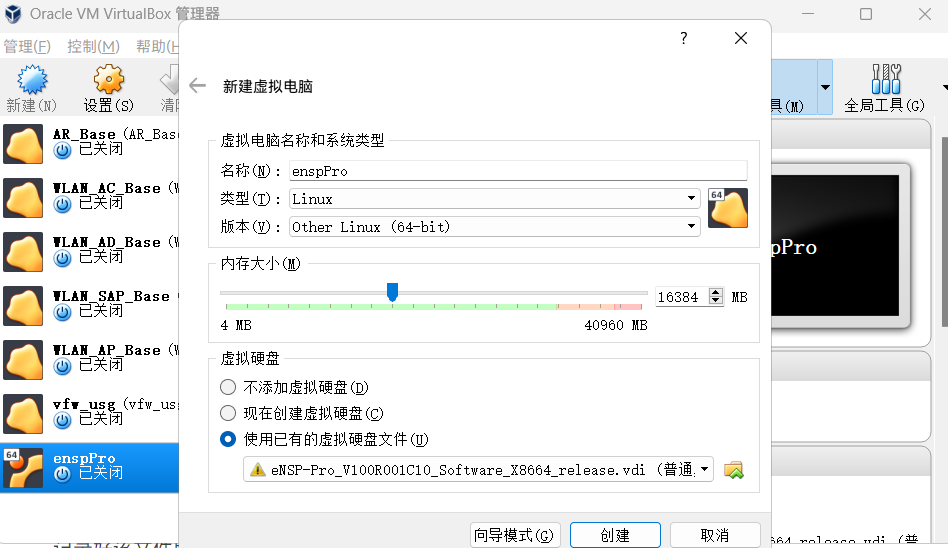​

　　名称自定义，类型选择 Linux ，版本选择 Other-64位

　　内存最低需要16G，硬盘选择刚才下载好的VDI文件

　　点击创建即可，创建成功后右键点击虚拟机-设置

​​

　　点击系统-处理器，将处理器数量最低改为8

​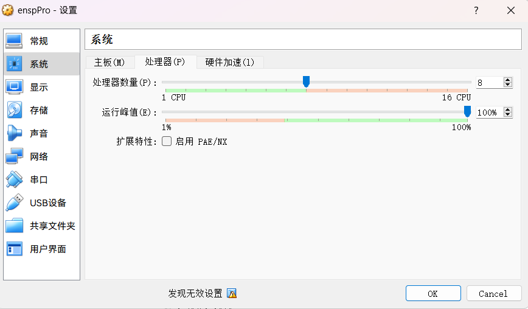​

　　然后点击网络，修改网卡

　　网卡一：仅主机(Host-Only)网络

　　网卡一：网络地址转换(NAT)网络

　　网卡一：仅主机(Host-Only)网络

​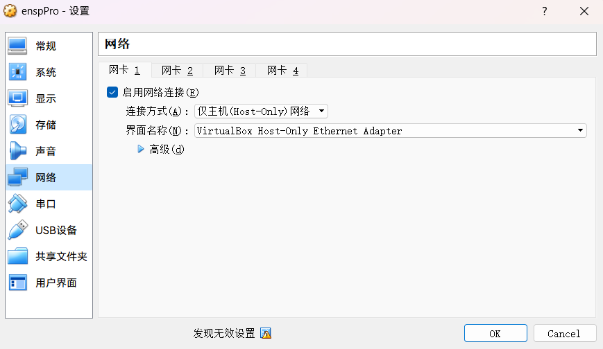​

​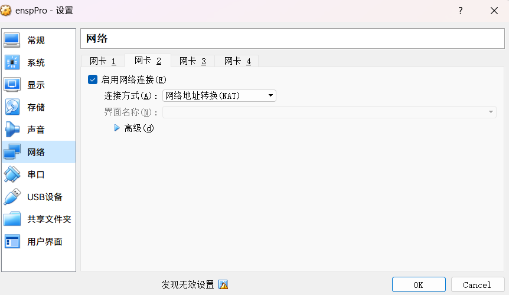​

​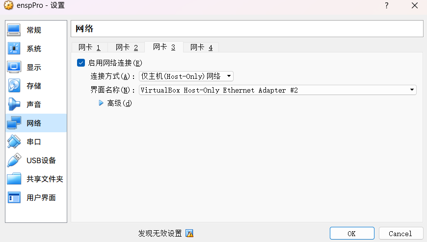​

　　全部设置完成后，点击启动

​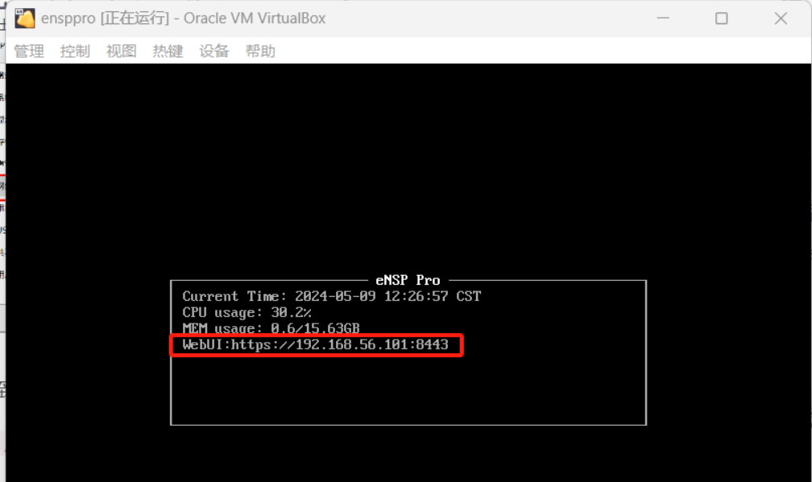​

　　看到正确获取到IP后即可。

　　浏览器打开 https://IP:8443  即可

​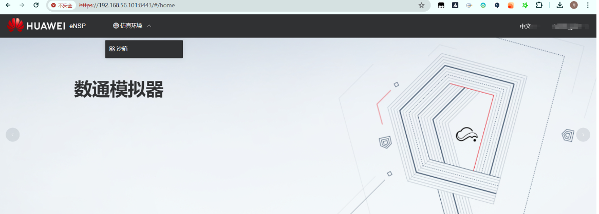​

　　点击右上角登录，使用自己的华为账号登录即可。

　　然后点击最近打开 - 更多

​​

　　创建沙箱进入

​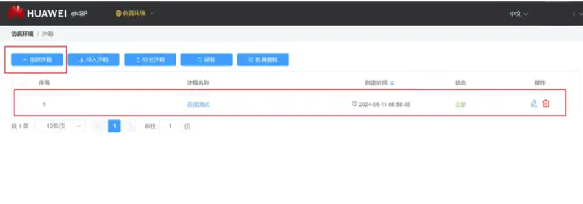​

​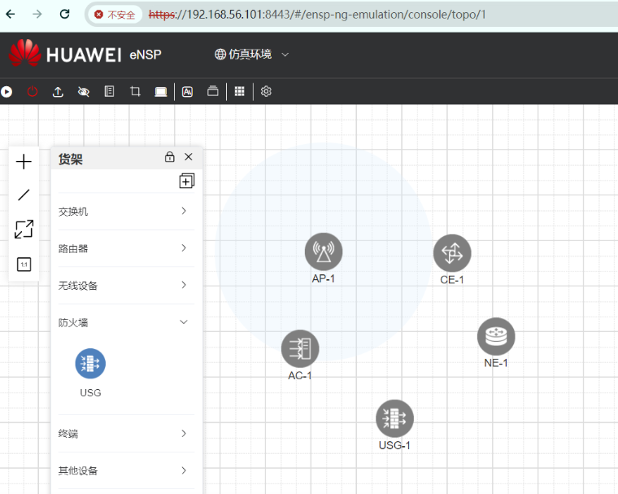​

　　右键点击启动，这个颜色正在启动

​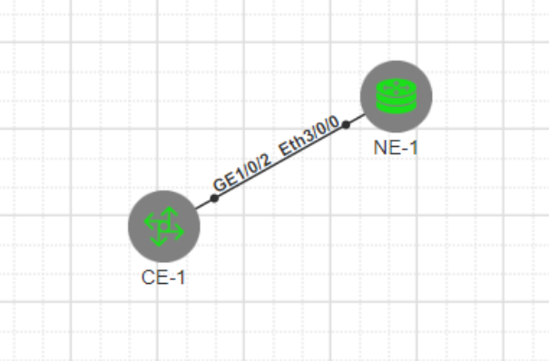​

　　设备全绿后，即为启动成功。点击图标即可进入控制台

​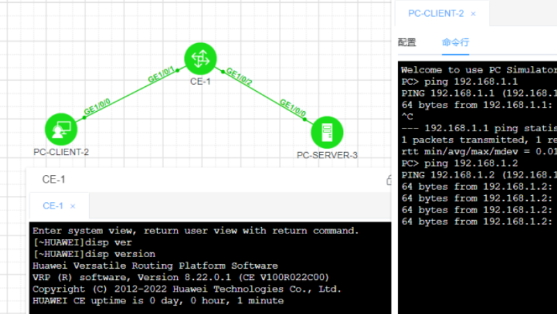​

　　右键可以进行抓包

​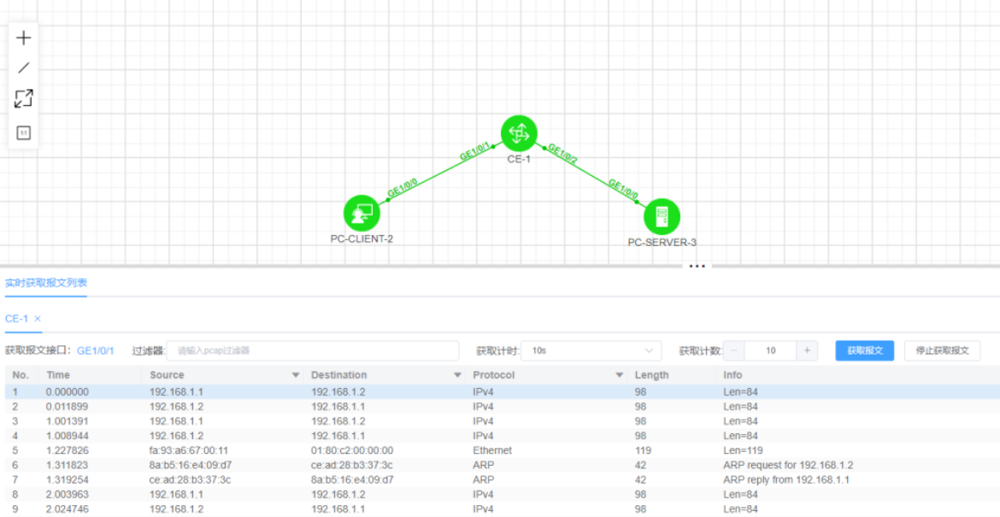​

　　‍
