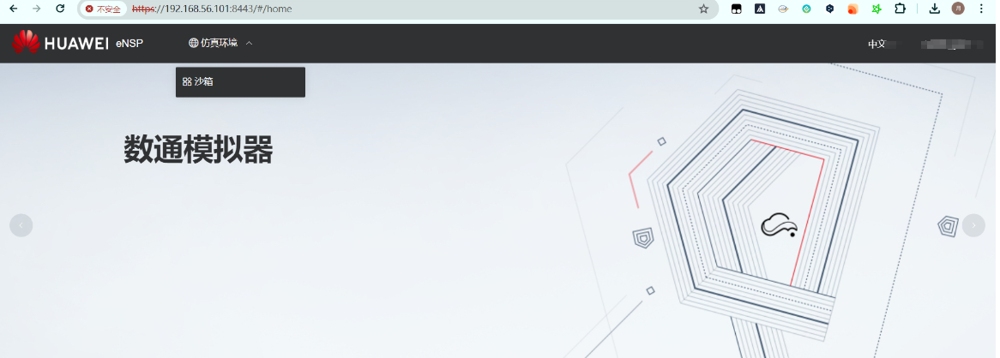
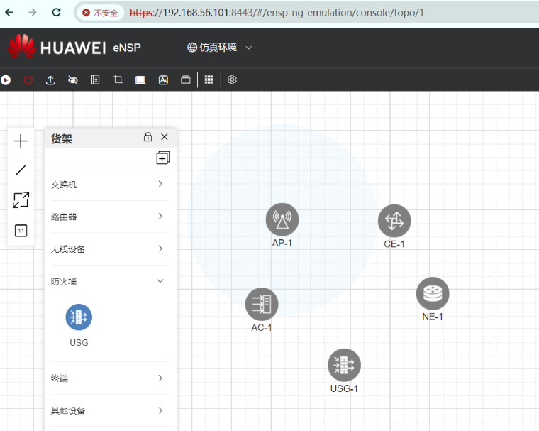
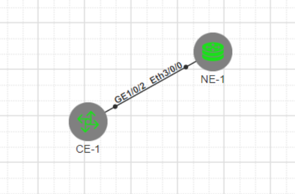

# 使用Vmware部署enspPro华为数通模拟器

　　环境：Vmware 17

　　镜像文件下载：[https://blog.csdn.net/weixin_47115107/article/details/138823425?spm=1001.2014.3001.5501](https://blog.csdn.net/weixin_47115107/article/details/138823425?spm=1001.2014.3001.5501)

　　‍

　　最低配置要求：

　　CPU：8核心

　　内存：16G

　　硬盘：40G

## 安装流程

　　下载镜像，并保存到本地

​​

　　打开Vmware，点击文件 - 打开 - 选择刚才下载的文件

​​

　　虚拟机名称可自定义，存储位置可根据需要自己修改

​​

　　点击导入，会提示导入失败，这时点击重试即可

​​

　　导入成功后，点击虚拟机 - 编辑虚拟机设置

​​

　　要求CPU八核及以上、内存16G及以上

　　网卡一：仅主机模式

　　网卡二：NAT模式

　　网卡三：仅主机模式

​​

　　修改完毕后，点击保存

　　并开启虚拟机

​​

　　此时，看到内网ip，使用浏览器打开

　　看到正确获取到IP后即可。

　　浏览器打开 https://IP:8443  即可

​​

　　点击右上角登录，使用自己的华为账号登录即可。

　　然后点击最近打开 - 更多

​​

　　创建沙箱进入

​​

​​

　　右键点击启动，这个颜色正在启动

​​

　　设备全绿后，即为启动成功。点击图标即可进入控制台

​​

　　右键可以进行抓包

​​

　　‍
