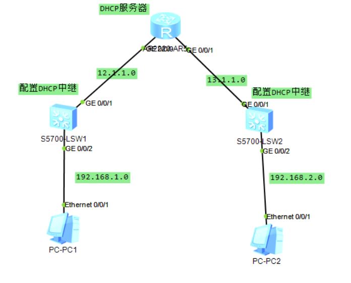
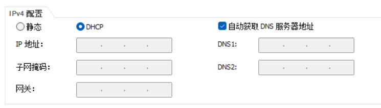
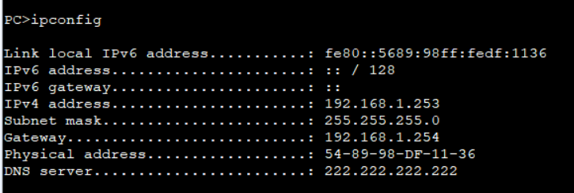
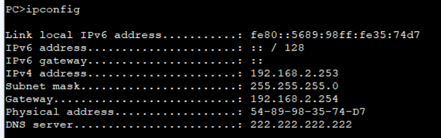

# 使用ensp的DHCP中继实验

　　‍

　　使用ensp模拟小型园区网环境，配置DHCP中继，使不同网段的PC都能在统一的DHCP服务器上获取到地址

　　话不多说，先上拓扑：

​​

　　SW1和SW2分别为PC1和PC2的接入交换机，同时连接DHCP服务器R1。

　　使用R1为PC1分配192.168.1.0网段的IP，为PC2分配 192.168.2.0 网段的IP。

　　在开始配置之气，先介绍一下DHCP的原理

## DHCP中继原理

　　DHCP中继（DHCP Relay）是一种网络设备功能，用于在不同的子网之间传递DHCP（动态主机配置协议）消息，以便在不同子网上的设备可以获取IP地址和其他网络配置信息。

　　在一个局域网（LAN）中，通常有一个DHCP服务器负责为局域网中的设备分配IP地址和其他配置参数，如网关地址、子网掩码和DNS服务器等。然而，当存在多个子网时，设备无法直接与DHCP服务器通信，因为它们不在同一个广播域内。

　　DHCP中继的作用是充当一个中转站，将来自不同子网的DHCP请求消息转发到DHCP服务器，并将DHCP服务器的响应消息传递回来。这样，在不同子网上的设备仍然可以通过DHCP中继获取IP地址和其他配置参数。

　　DHCP中继工作原理如下：

1. 设备在连接到网络时发送一个DHCP请求广播消息（DHCP Discover）。
2. DHCP中继设备收到这个广播消息，并将其转换为单播消息（DHCP Request）。
3. DHCP中继设备将单播消息转发到事先配置好的DHCP服务器。
4. DHCP服务器接收到单播消息后，为设备分配IP地址和其他配置，并发送DHCP响应消息（DHCP Offer）。
5. DHCP中继设备收到DHCP响应消息后，将其转换为广播消息，并在相应的子网上进行广播。
6. 设备收到DHCP响应后，可以获取到IP地址和其他配置信息，并完成网络连接的配置。

　　通过DHCP中继，可以实现跨子网的集中式地址分配和配置的管理，简化了网络管理的工作，并提高了网络的灵活性和扩展性。

## 开始配置

### 配置R1为集中的DHCP服务器，创建两个地址池为PC1和PC2分配IP

```vim
// 开启DHCP功能
[R1]dhcp enable 

// 创建两个地址池，准备给PC分配地址
[R1]ip pool 10
[R1-ip-pool-10]network 192.168.1.0 mask 24  // 要分配的网段
[R1-ip-pool-10]gateway-list 192.168.1.254  // 网关地址
// 这次是实验，就不配置其他内容了。在实际操作中，还需要配置dns、租约等内容。
[R1]ip pool 20
[R1-ip-pool-20]network 192.168.2.0 mask 24
[R1-ip-pool-20]gateway-list 192.168.2.254
```

　　配置连接交换机的IP、静态路由

```vim
// 给连接两个交换机的接口配置IP
[R1-GigabitEthernet0/0/0]ip add 12.1.1.1 24
[R1-GigabitEthernet0/0/0]dhcp select global // 开启DHCP，使用全局地址池
[R1-GigabitEthernet0/0/1]ip add 13.1.1.1 24
[R1-GigabitEthernet0/0/1]dhcp select global 
// 配置静态路由，保证路由可达
[R1]ip route-static 192.168.1.0 24 12.1.1.2
[R1]ip route-static 192.168.2.0 24 13.1.1.2
```

### 配置交换机，开启DHCP 中继

　　S1配置：

```vim
// 开启DHCP
[R1]dhcp enable 

// 配置PC的网段VLAN，并设置DHCP中继
[S1]vlan 10
[S1]in vlan 10
[S1-Vlanif10]ip add 192.168.1.254 24
[S1-Vlanif10]dhcp select relay   // dhcp模式为中继
[S1-Vlanif10]dhcp relay server-ip 12.1.1.1  // dhcp服务器的ip

// 配置互联DHCP服务器的网段vlan
[S1]vlan 12
[S1]in vlan 12
[S1-Vlanif12]ip add 12.1.1.2 24

// 修改接口vlan。vlan10连接PC，vlan12用于连接DHCP服务器
[S1-GigabitEthernet0/0/1]port link-type access 
[S1-GigabitEthernet0/0/1]port default vlan 12
[S1-GigabitEthernet0/0/2]port link-type access 
[S1-GigabitEthernet0/0/2]port default vlan 10
```

　　S2配置：

```vim
[R1]dhcp enable 

[S1]vlan 10
[S1]in vlan 10
[S1-Vlanif10]ip add 192.168.1.254 24
[S1-Vlanif10]dhcp select relay 
[S1-Vlanif10]dhcp relay server-ip 12.1.1.1

[S1]vlan 13
[S1]in vlan 13
[S1-Vlanif12]ip add 13.1.1.2 24

[S1-GigabitEthernet0/0/1]port link-type access 
[S1-GigabitEthernet0/0/1]port default vlan 12
[S1-GigabitEthernet0/0/2]port link-type access 
[S1-GigabitEthernet0/0/2]port default vlan 20
```

## 结果验证

　　此时，PC1和PC2都可以正常获取地址

​​

​​

​​

　　可以看到，PC1和PC2都正常获取到了IP

　　‍

　　欢迎联系博主（QQ：65800270）探讨交流

　　原文地址：[使用ensp的DHCP中继实验](http://ie.oldc.cc/article/5)
