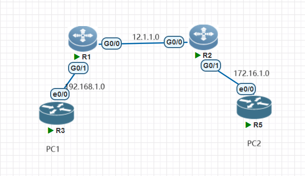
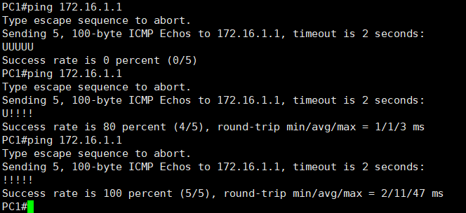
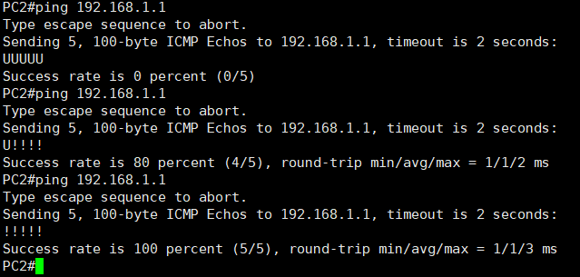
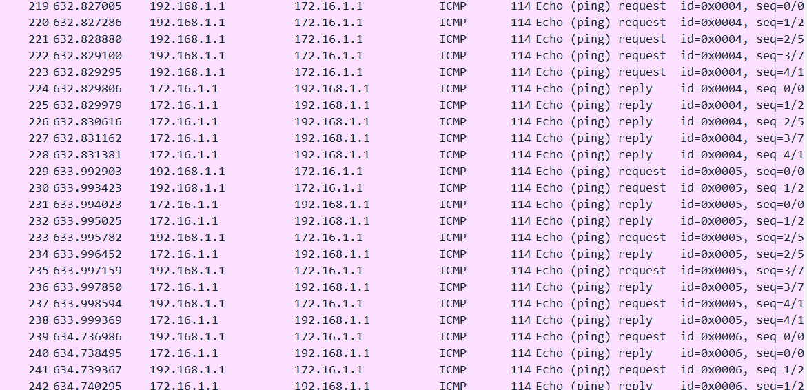

# 使用eve模拟无路由互联互通实验

　　使用策略路由PBR在路由表无对方内网路由的情况下实现互相通信。

　　在[使用ensp模拟双端无路由互联互通实验](http://ie.oldc.cc/article/2)中，PC并无法正常验证。这个实验修复了这个问题。

　　环境：eve、pnet 锐捷镜像+思科镜像

　　技术：策略路由PBR

　　拓扑：

​​

　　使用两台思科路由器模拟PC。

　　区域1内网使用 192.168.1.0 进行互联，区域2使用 172.16.1.0 进行互联。

　　路由器使用 12.1.1.0 进行互联。

## 策略路由的基本介绍

　　在开始之前，先介绍一下什么是策略路由：

　　策略路由（Policy-Based Routing，PBR）是一种网络路由的技术，它允许根据特定的策略或条件对网络流量进行定制化的路由。

　　传统的路由是基于目标地址选择最佳路径进行转发，而PBR将路由决策与其他因素（如源地址、应用类型、协议等）相结合，以决定如何处理特定流量。

　　PBR的基本原理是通过创建并应用路由策略来匹配流量，并根据设定的策略将该流量定向到特定的出接口或下一跳地址。这允许网络管理员根据特定需求或策略来定制路由行为，例如：

* 根据源地址进行流量控制：将特定源地址的流量引导到不同的出口或下一跳地址，以实现分流或负载均衡。
* 根据应用类型进行优先级设置：根据流量中的应用类型（例如视频、音频、文件传输等）设置不同的优先级或服务质量。
* 根据安全需求重定向流量：根据安全策略，将特定流量（例如恶意流量或未经授权的流量）重定向到专用设备进行检查或阻止。

　　实施PBR通常涉及以下步骤：

1. 创建路由策略访问列表（Route-map）：定义匹配条件，如源地址、目标地址、协议等。
2. 定义路由策略：规定如果特定条件匹配，则如何处理流量，如指定下一跳地址或出接口。
3. 将路由策略应用到接口或特定流量：通过接口配置或ACL进行应用，以决定哪些流量将遵循PBR策略。
4. 验证和监控PBR的效果：测试和观察流量是否按照预期的策略进行处理。

　　这里最重要的一点：

　　**PBR的优先级高于路由表。也就是说，可以在路由表没有路由的情况下完成转发**

## 策略配置

### 基础配置

　　配置设备的PC

　　R1：

```vim
R1(config-if-GigabitEthernet 0/0)#ip address 12.1.1.1 255.255.255.0
```

　　R2：

```vim
R2(config-if-GigabitEthernet 0/0)#ip address 12.1.1.2 255.255.255.0
```

### 配置策略

　　配置策略，匹配数据包并修改下一跳

　　R1：

```vim
// 定义感兴趣流，匹配对端网段
R1(config)#access-list 101 permit ip any 172.16.1.0 0.0.0.255
// 定义策略路由，被acl 101匹配到的数据包重定向到12.1.1.2
R1(config)#route-map pbr permit
 match ip address 101
 set ip next-hop 12.1.1.2
```

　　R2：

```vim
R2(config)#access-list 101 permit ip any 192.168.1.0 0.0.0.255
R2(config)#route-map pbr permit
 match ip address 101
 set ip next-hop 12.1.1.1
```

### 启用策略

　　在接口上启用策略

　　R1：

```vim
// 在接口上应用策略
R1(config-if-GigabitEthernet 0/0)#ip policy route-map pbr
```

　　R2：

```vim
R2(config-if-GigabitEthernet 0/0)#ip policy route-map pbr
```

## 结果验证

　　路由表忘记截图了，但路由表中肯定没有路由。

　　使用两台PC互相ping

​​

​​

　　前几次并不通，猜测是模拟器的原因，还未收到对方的回包就提示超时了。实际上会回包的。

　　抓包：

​​

　　‍

　　欢迎联系博主（QQ：65800270）探讨交流

　　原文地址：[使用eve模拟无路由互联互通实验](http://ie.oldc.cc/article/3)
