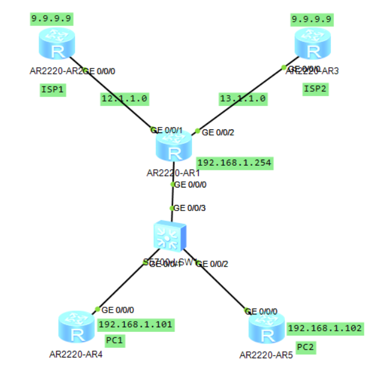
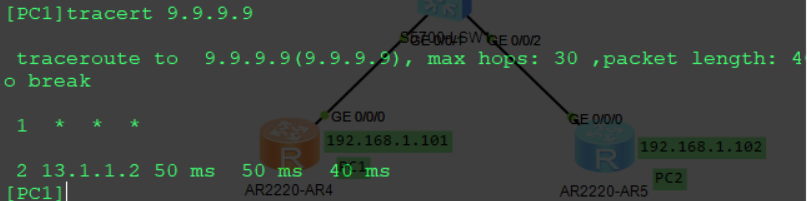
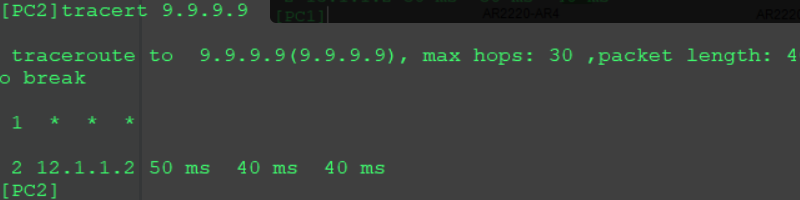

# 园区网双出口基于源地址控制流量走向

　　使用ensp模拟小型园区网双出口环境，通过源地址控制流量走向。

　　要求：

* PC1通过ISP2连接外网
* PC2通过ISP1连接外网

　　基于MQC针对源地址修改下一跳，达到题目要求

　　拓扑：

​​

　　使用`9.9.9.9`​模拟外网，`192.168.1.0`​为内部网段。`12.1.1.0`​和`13.1.1.0`​为连接ISP的互联网段。

### 基础配置

　　为了方便测试，使用Router模拟PC。ISP和PC的配置省略。

　　以下所有配置都是R1的配置内容

　　配置内部接口和连接ISP的接口IP

```vim
[Huawei-GigabitEthernet0/0/0]ip add 192.168.1.254 24
[Huawei-GigabitEthernet0/0/1]ip add 12.1.1.1 24
[Huawei-GigabitEthernet0/0/2]ip add 13.1.1.1 24
```

　　定义acl，在外网接口开启nat地址转换

```vim
[Huawei]acl 2000
[Huawei-acl-basic-2000]rule 5 permit source 192.168.1.0 0.0.0.255
// 在接口上开启nat
[Huawei-GigabitEthernet0/0/1]nat outbound 2000
[Huawei-GigabitEthernet0/0/2]nat outbound 2000
```

　　配置静态路由，指向ISP（默认为负载均衡，并不能确定流量走向）

```vim
[Huawei]ip route-static 0.0.0.0 0 12.1.1.2
[Huawei]ip route-static 0.0.0.0 0 13.1.1.2
```

　　定义acl，使用IP匹配两台主机

```vim
[Huawei]acl 2001
[Huawei-acl-basic-2001]rule 5 permit source 192.168.1.101 0
[Huawei]acl 2002
[Huawei-acl-basic-2002]rule 5 permit source 192.168.1.102 0
```

　　定义流分类，用于检测pc的数据包

```vim
[Huawei]traffic classifier PC1 operator or 
[Huawei-classifier-PC1]if-match acl 2001
[Huawei]traffic classifier PC2 operator or 
[Huawei-classifier-PC1]if-match acl 2002
```

　　定义流行为，并设置动作。修改下一跳。

```vim
[Huawei]traffic behavior PC1
[Huawei-behavior-PC1]redirect ip-nexthop 13.1.1.2
[Huawei]traffic behavior PC2
[Huawei-behavior-PC2]redirect ip-nexthop 12.1.1.2
```

　　定义流策略，将流分类与流行为绑定

```vim
// 创建策略
[Huawei]traffic policy YU
// 流分类PC1关联到流分类PC1
[Huawei-trafficpolicy-YU]classifier PC1 behavior PC1
[Huawei-trafficpolicy-YU]classifier PC2 behavior PC2
```

　　最后，在流量的入口应用策略即可

```vim
[Huawei-GigabitEthernet0/0/0]traffic-policy YU inbound 
```

　　综合来说，就是将acl 2001（PC1） 匹配到的数据包的下一跳修改为13.1.1.2（ISP2）。

　　这样就实现了PC1通过ISP2连接外网，PC2通过ISP1连接外网。

## 结果验证

　　PC1通过ISP2连接外网

​​

　　PC2通过ISP1连接外网

​​

　　‍

　　欢迎联系博主（QQ：65800270）探讨交流

　　原文地址：[园区网双出口基于源地址控制流量走向](http://ie.oldc.cc/article/6)

　　‍
