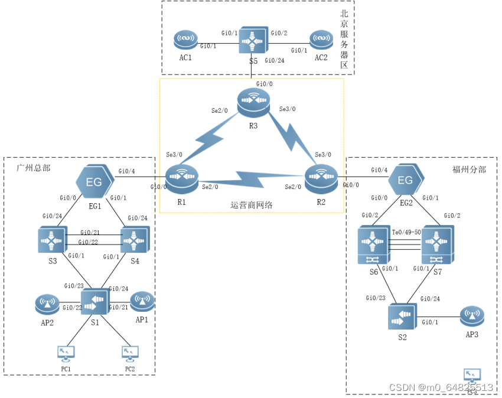
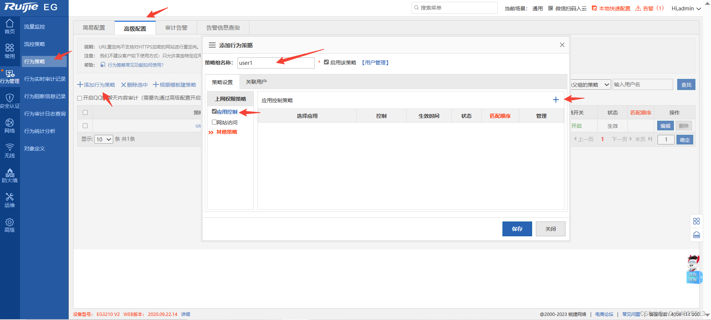

# 22国赛A-样题1解法

## 拓扑

​​

## 一、基础配置

### 1.根据附录1、附录2，配置设备接口信息。

　　在做配置之前需要先配置VSU

```
S6:
switch virtual domain 1
 switch 1
 switch 1 priority 150
 switch 1 description S6
exi
vsl-port
 port-member interface TenGigabitEthernet 0/49
 port-member interface TenGigabitEthernet 0/50
switch convert mode virtual   //在用户视图配置，yes回车后设备自动重启
设备重启后S6就是master，重命名位VSU
```

```
S7:
switch virtual domain 1
 switch 2
 switch 2 priority 120
 switch 2 description S7
exi
vsl-port
 port-member interface TenGigabitEthernet 0/49
 port-member interface TenGigabitEthernet 0/50
switch convert mode virtual
```

　　根据地址规划表配置即可，需要在S1和S2创建无线用户vlan60

### 2.所有交换机和无线控制器开启SSH服务，用户名密码分别为admin、admin1234；密码为明文类型,特权密码为admin。

```
enable service ssh-server
username admin passowrd 0 admin1234

crypto key generate rsa   //yes然后回车

line vty 0 4
 transport input ssh 
 login local
 
enable password admin
```

### 3.交换机配置SNMP功能，向主机172.16.0.254发送Trap消息版本采用V2C，读写的Community为“Test”，只读的Community为“public”，开启Trap消息。

```
enable service snmp-agent
snmp-server enable traps
snmp-server enable version v2c
snmp-server community Test rw 
snmp-server community Public ro 
snmp-server host 172.16.0.254 traps version 2c Test
snmp-server host 172.16.0.254 traps version 2c Public
```

## 二、有线网络配置

### 1.在全网Trunk链路上做VLAN修剪。

```
S1:
interface range GigabitEthernet 0/21-22  //地址表和拓扑图接口不一致，根据拓扑来的
 switchport mode trunk
 switchport trunk native vlan 50
 switchport trunk allowed vlan only 50,60   //地址表没有vlan60，自己创建
 
interface range GigabitEthernet 0/23-24
 switchport mode trunk
 switchport trunk allowed vlan only 10,20,30,40,50,60,100
```

```
S2:
interface range GigabitEthernet 0/1-20
 switchport mode trunk
 switchport trunk native vlan 50
 switchport trunk allowed vlan only 50,60
 
interface range GigabitEthernet 0/23-24
 switchport mode trunk
 switchport trunk allowed vlan only 10,20,50,60,100  //vlan60自己创建
```

```
S3-S4:
interface GigabitEthernet 0/1
 switchport mode trunk
 switchport trunk allowed vlan only 10,20,30,40,50,60,100
 
interface AggregatePort 1
 switchport mode trunk
 switchport trunk allowed vlan only 10,20,30,40,50,60,100
 
interface range GigabitEthernet 0/21-22
 port-group 1 mode active
```

```
VSU:
interface range GigabitEthernet 1/0/1,2/0/1
 switchport mode trunk
 switchport trunk allowed vlan only 10,20,50,60,100
VSU和S2之间会环路，要开启STP，也可以将这两个接口配置成聚合组
```

```
AC1-AC2:
interface GigabitEthernet 0/1
 switchport mode trunk
 switchport trunk allowed vlan only 100
```

```
S5:
interface range GigabitEthernet 0/1-2
 switchport mode trunk
 switchport trunk allowed vlan only 100
```

### 2.为隔离部分终端用户间的二层互访，在交换机S5的Gi0/1-Gi0/10端口启用端口保护。

```
S5：
interface range GigabitEthernet 0/1-10
 switchport protected
```

### 3.为规避网络末端接入设备上出现环路影响全网，要求在总部接入设备S1进行防环处理。具体要求如下：终端接口开启BPDU防护不能接收 BPDU报文；终端接口下开启 RLDP防止环路，检测到环路后处理方式为Shutdown-Port；连接PC终端的所有端口配置为边缘端口；如果端口被 BPDU Guard检测进入Err-Disabled状态，再过 300 秒后会自动恢复（基于接口部署策略），重新检测是否有环路。

```
S1：
rldp enable
interface range GigabitEthernet 0/1-16
 errdisable recovery interval 300
 spanning-tree bpduguard enable
 spanning-tree bpdufilter enable
 rldp port loop-detect shutdown-port
```

### 4.在交换机S3、S4上配置DHCP中继，对VLAN10内的用户进行中继，使得总部PC1用户使用DHCP Relay方式获取IP地址。

```
S3-S4:
service dhcp 
int vlan 10
 ip helper-address 11.1.0.11
```

### 5.DHCP服务器搭建于EG1上，地址池命名为Pool_VLAN10，DHCP对外服务使用loopback 0地址。

```
EG1：
service dhcp 
ip dhcp pool Pool_VLAN10
 network 192.1.10.0 255.255.255.0
 default-router 192.1.10.254
```

### 6.为了防御动态环境局域网伪DHCP服务欺骗，在S1交换机部署DHCP Snooping功能。

```
S1:
ip dhcp snooping
interface range GigabitEthernet 0/23-24
 ip dhcp snooping trust
```

### 7.在总部交换机S1、S3、S4上配置MSTP防止二层环路；要求VLAN10、VLAN20、VLAN50、VLAN60、VLAN100数据流经过S3转发，S3失效时经过S4转发；VLAN30、VLAN40数据流经过S4转发，S4失效时经过S3转发。所配置的参数要求如下：region-name为test；revision版本为1；S3作为实例1的主根、实例2的从根，S4作为实例2的主根、实例2的从根；生成树优先级可设置为4096、8192或保持默认值；在S3和S4上配置VRRP，实现主机的网关冗余，所配置的参数要求如下表；S3、S4各VRRP组中高优先级设置为150，低优先级设置为120。

```
S1:
spanning-tree mst configuration
 revision 1
 name test
 instance 1 vlan 10, 20, 50, 60, 100
 instance 2 vlan 30, 40
!
spanning-tree
```

```
S3:
spanning-tree mst configuration
 revision 1
 name test
 instance 1 vlan 10, 20, 50, 60, 100
 instance 2 vlan 30, 40
!
spanning-tree mst 1 priority 4096
spanning-tree mst 2 priority 8192
spanning-tree

interface VLAN 10
 vrrp 10 ip 192.1.10.254
 vrrp 10 priority 150
!
interface VLAN 20
 vrrp 20 ip 192.1.20.254
 vrrp 20 priority 150
!
interface VLAN 30
 vrrp 30 ip 192.1.30.254
 vrrp 30 priority 120
!
interface VLAN 40
 vrrp 40 ip 192.1.40.254
 vrrp 40 priority 120
!
interface VLAN 50
 vrrp 50 ip 192.1.50.254
 vrrp 50 priority 150
!
interface VLAN 60
 vrrp 60 ip 192.1.60.254
 vrrp 60 priority 150
!
interface VLAN 100
 vrrp 100 ip 192.1.100.254
 vrrp 100 priority 150
```

```
S4:
spanning-tree mst configuration
 revision 1
 name test
 instance 1 vlan 10, 20, 50, 60, 100
 instance 2 vlan 30, 40
!
spanning-tree mst 1 priority 8192
spanning-tree mst 2 priority 4096
spanning-tree

interface VLAN 10
 vrrp 10 ip 192.1.10.254
 vrrp 10 priority 120
!
interface VLAN 20
 vrrp 20 ip 192.1.20.254
 vrrp 20 priority 120
!
interface VLAN 30
 vrrp 30 ip 192.1.30.254
 vrrp 30 priority 150
!
interface VLAN 40
 vrrp 40 ip 192.1.40.254
 vrrp 40 priority 150
!
interface VLAN 50
 vrrp 50 ip 192.1.50.254
 vrrp 50 priority 120
!
interface VLAN 60
 vrrp 60 ip 192.1.60.254
 vrrp 60 priority 120
!
interface VLAN 100
 vrrp 100 ip 192.1.100.254
 vrrp 100 priority 120
```

### 8.分部两台数据中心交换机通过虚拟化为一台设备进行管理，其中S6为主，S7为备；规划S6和S7间的Gi0/48端口作为双主机检测链路，配置基于BFD的双主机检；主设备：Domain id：1,switch id:1,priority 150;备设备：Domain id：1,switch id:2,priority120。

```
VSU:
基础配置那配置过了
switch virtual domain 1
 dual-active detection bfd
 dual-active bfd interface GigabitEthernet 1/0/48
 dual-active bfd interface GigabitEthernet 2/0/48
```

### 9.总部与分部内网均使用OSPF协议组网，总部、分部与互联网间使用静态路由协议。具体要求如下：总部S3、S4、EG1间运行OSPF，进程号为10，规划单区域0；分部S6/S7、EG2间运行OSPF，进程号为20，规划单区域0；服务器区使用静态路由组网；重发布路由进OSPF中使用类型1。

```
EG1:
ip route 0.0.0.0 0.0.0.0 20.1.0.2
router ospf 10
 network 10.1.0.0 0.0.0.3 area 0
 network 10.1.0.4 0.0.0.3 area 0
 network 11.1.0.11 0.0.0.0 area 0
 default-information originate metric-type 1
```

```
S3:
router ospf 10
 passive-interface VLAN 10
 passive-interface VLAN 20
 passive-interface VLAN 30
 passive-interface VLAN 40
 passive-interface VLAN 50
 passive-interface VLAN 60
 network 10.1.0.0 0.0.0.3 area 0
 network 11.1.0.33 0.0.0.0 area 0
 network 192.1.10.0 0.0.0.255 area 0
 network 192.1.20.0 0.0.0.255 area 0
 network 192.1.30.0 0.0.0.255 area 0
 network 192.1.40.0 0.0.0.255 area 0
 network 192.1.50.0 0.0.0.255 area 0
 network 192.1.60.0 0.0.0.255 area 0
 network 192.1.100.0 0.0.0.255 area 0
```

```
S4:
router ospf 10
 passive-interface VLAN 10
 passive-interface VLAN 20
 passive-interface VLAN 30
 passive-interface VLAN 40
 passive-interface VLAN 50
 passive-interface VLAN 60
 network 10.1.0.4 0.0.0.3 area 0
 network 11.1.0.34 0.0.0.0 area 0
 network 192.1.10.0 0.0.0.255 area 0
 network 192.1.20.0 0.0.0.255 area 0
 network 192.1.30.0 0.0.0.255 area 0
 network 192.1.40.0 0.0.0.255 area 0
 network 192.1.50.0 0.0.0.255 area 0
 network 192.1.60.0 0.0.0.255 area 0
 network 192.1.100.0 0.0.0.255 area 0
```

```
EG2:
ip route 0.0.0.0 0.0.0.0 30.1.0.2
router ospf 20
 network 10.1.0.12 0.0.0.3 area 0
 network 10.1.0.16 0.0.0.3 area 0
 network 11.1.0.12 0.0.0.0 area 0
 default-information originate metric-type 1
```

```
VSU:
router ospf 20
 redistribute connected metric-type 1 subnets
 network 10.1.0.12 0.0.0.3 area 0
 network 10.1.0.16 0.0.0.3 area 0
 network 11.1.0.67 0.0.0.0 area 0
```

```
S5:
ip route 0.0.0.0 0.0.0.0 40.1.0.2
ip route 11.1.0.204 255.255.255.255 194.1.100.2
ip route 11.1.0.205 255.255.255.255 194.1.100.3
```

### 10.总部与分部部署IPV6网络实现总分机构内网IPV6终端可通过无状态自动从网关处获取地址。IPV6地址规划如下：11.在S3和S4上配置VRRP for IPv6，实现主机的IPv6网关冗余;在S3和S4上VRRP与MSTP的主备状态与IPV4网络一致。

```
S3:
ipv6 unicast-routing
interface VLAN 10
 ip address 192.1.10.252 255.255.255.0
 vrrp 10 ip 192.1.10.254
 vrrp 10 ipv6 FE80::
 ipv6 address 2001:192:10::252/64
 ipv6 enable
 no ipv6 nd suppress-ra
 vrrp ipv6 10 priority 150
 vrrp 10 priority 150
!
interface VLAN 20
 ip address 192.1.20.252 255.255.255.0
 vrrp 20 ip 192.1.20.254
 vrrp 20 ipv6 FE80::
 ipv6 address 2001:192:20::252/64
 ipv6 enable
 no ipv6 nd suppress-ra
 vrrp ipv6 20 priority 150
 vrrp 20 priority 150
!
interface VLAN 30
 ip address 192.1.30.252 255.255.255.0
 vrrp 30 ip 192.1.30.254
 vrrp 30 ipv6 FE80::
 ipv6 address 2001:192:30::252/64
 ipv6 enable
 no ipv6 nd suppress-ra
 vrrp ipv6 30 priority 120
 vrrp 30 priority 120
!
interface VLAN 40
 ip address 192.1.40.252 255.255.255.0
 vrrp 40 ip 192.1.40.254
 vrrp 40 ipv6 FE80::
 ipv6 address 2001:192:40::252/64
 ipv6 enable
 vrrp ipv6 40 priority 120
 vrrp 40 priority 120
!
interface VLAN 50
 ip address 192.1.50.252 255.255.255.0
 vrrp 50 ip 192.1.50.254
 vrrp 50 priority 150
!
interface VLAN 60
 ip address 192.1.60.252 255.255.255.0
 vrrp 60 ip 192.1.60.254
 vrrp 60 ipv6 FE80::
 ipv6 address 2001:192:60::252/64
 ipv6 enable
 no ipv6 nd suppress-ra
 vrrp ipv6 60 priority 150
 vrrp 60 priority 150
!
interface VLAN 100
 ip address 192.1.100.252 255.255.255.0
 vrrp 100 ip 192.1.100.254
 vrrp 100 ipv6 FE80::
 ipv6 address 2001:192:100::252/64
 ipv6 enable
 no ipv6 nd suppress-ra
 vrrp ipv6 100 priority 150
 vrrp 100 priority 150
```

```
S4:
interface VLAN 10
 ip address 192.1.10.253 255.255.255.0
 vrrp 10 ip 192.1.10.254
 vrrp 10 ipv6 FE80::
 ipv6 address 2001:192:10::253/64
 ipv6 enable
 no ipv6 nd suppress-ra
 vrrp ipv6 10 priority 120
 vrrp 10 priority 120
!
interface VLAN 20
 ip address 192.1.20.253 255.255.255.0
 vrrp 20 ip 192.1.20.254
 vrrp 20 ipv6 FE80::
 ipv6 address 2001:192:20::253/64
 ipv6 enable
 no ipv6 nd suppress-ra
 vrrp ipv6 20 priority 120
 vrrp 20 priority 120
!
interface VLAN 30
 ip address 192.1.30.253 255.255.255.0
 vrrp 30 ip 192.1.30.254
 vrrp 30 ipv6 FE80::
 ipv6 address 2001:192:30::253/64
 ipv6 enable
 no ipv6 nd suppress-ra
 vrrp ipv6 30 priority 150
 vrrp 30 priority 150
!
interface VLAN 40
 ip address 192.1.40.253 255.255.255.0
 vrrp 40 ip 192.1.40.254
 vrrp 40 ipv6 FE80::
 ipv6 address 2001:192:40::253/64
 ipv6 enable
 vrrp ipv6 40 priority 150
 vrrp 40 priority 150
!
interface VLAN 50
 ip address 192.1.50.253 255.255.255.0
 vrrp 50 ip 192.1.50.254
 vrrp 50 priority 120
!
interface VLAN 60
 ip address 192.1.60.253 255.255.255.0
 vrrp 60 ip 192.1.60.254
 vrrp 60 ipv6 FE80::
 ipv6 address 2001:192:60::253/64
 ipv6 enable
 no ipv6 nd suppress-ra
 vrrp ipv6 60 priority 120
 vrrp 60 priority 120
!
interface VLAN 100
 ip address 192.1.100.253 255.255.255.0
 vrrp 100 ip 192.1.100.254
 vrrp 100 ipv6 FE80::
 ipv6 address 2001:192:100::253/64
 ipv6 enable
 no ipv6 nd suppress-ra
 vrrp ipv6 100 priority 120
 vrrp 100 priority 120
```

### 12.R1、R2、R3直连接口封装PPP协议，部署IGP中OSPF动态路由实现直连网段互联互通。

```
R1:
router ospf 100
 redistribute connected metric-type 1 subnets
 network 11.1.0.1 0.0.0.0 area 0
 network 12.1.0.0 0.0.0.15 area 0
 network 13.1.0.0 0.0.0.15 area 0
 summary-address 20.1.0.0 255.255.0.0
interface Serial 2/0  
 encapsulation PPP
 ip ospf network point-to-point
 ip address 12.1.0.1 255.255.255.240
interface Serial 2/1    //路由器s2/1表示S3/0接口
 encapsulation PPP
 ip ospf network point-to-point
 ip address 13.1.0.1 255.255.255.240
```

```
R2:
router ospf 100
 redistribute connected metric-type 1 subnets
 network 11.1.0.2 0.0.0.0 area 0
 network 12.1.0.0 0.0.0.15 area 0
 network 23.1.0.0 0.0.0.15 area 0
 summary-address 30.1.0.0 255.255.0.0
interface Serial 2/0
 encapsulation PPP
 ip ospf network point-to-point
 ip address 12.1.0.2 255.255.255.240
interface Serial 2/1
 encapsulation PPP
 ip ospf network point-to-point
 ip address 23.1.0.2 255.255.255.240
```

```
R3:
router ospf 100
 redistribute connected metric-type 1 subnets
 network 11.1.0.3 0.0.0.0 area 0
 network 13.1.0.0 0.0.0.15 area 0
 network 23.1.0.0 0.0.0.15 area 
interface Serial 2/0
 encapsulation PPP
 ip ospf network point-to-point
 ip address 13.1.0.3 255.255.255.240
interface Serial 2/1
 encapsulation PPP
 ip ospf network point-to-point
 ip address 23.1.0.3 255.255.255.240
```

### 13.R1、R2、R3间部署IBGP,AS号为100, 使用Loopback接口建立Peer。

### 14.运营商通告EG1、EG2专线至服务器区，R1、R2均以汇总B段静态路由的方式进行发布。服务器区通过R3将AC1、AC2通告到BGP中。

```
R1:
router bgp 100
 bgp router-id 11.1.0.1
 neighbor 11.1.0.2 remote-as 100
 neighbor 11.1.0.2 update-source Loopback 0
 neighbor 11.1.0.3 remote-as 100
 neighbor 11.1.0.3 update-source Loopback 0
```

```
R2:
router bgp 100
 bgp router-id 11.1.0.2
 neighbor 11.1.0.1 remote-as 100
 neighbor 11.1.0.1 update-source Loopback 0
 neighbor 11.1.0.3 remote-as 100
 neighbor 11.1.0.3 update-source Loopback 0
```

```
R3:
router bgp 100
 neighbor 11.1.0.1 remote-as 100
 neighbor 11.1.0.1 update-source Loopback 0
 neighbor 11.1.0.2 remote-as 100
 neighbor 11.1.0.2 update-source Loopback 0
 network 11.1.0.204 mask 255.255.255.255
 network 11.1.0.205 mask 255.255.255.255

ip route 11.1.0.204 255.255.255.255 40.1.0.1
ip route 11.1.0.205 255.255.255.255 40.1.0.1
```

### 15.可通过修改OSPF 路由COST达到分流的目的，且其值必须为5或10。

### 16.总部财务、销售IPV4用户与互联网互通主路径规划为：S3-EG1。

### 17.总部研发、市场IPV4用户与互联网互通主路径规划为：S4-EG1。

### 18.主链路故障可无缝切换到多条备用链路上。

```
S3:
int vlan 10
 ip ospf cost 5
int vlan 20
 ip ospf cost 5
int vlan 30
 ip ospf cost 10
int vlan 40
 ip ospf cost 10
```

```
S4:
int vlan 10
 ip ospf cost 10
int vlan 20
 ip ospf cost 10
int vlan 30
 ip ospf cost 5
int vlan 40
 ip ospf cost 5
```

## 三、无线网络配置

### 1.绘制AP点位图（包括：AP型号、编号、信道等信息，其中信道采用2.4G的1、6、11三个信道进行规划）。

​​

### 2.使用无线地勘软件，输出AP点位图的2.4G频道的信号仿真热图（仿真信号强度要求大于-65db）。

​​

### 3.根据表3无线产品价格表，制定该无线网络工程项目设备的预算表。

​​

### 4.使用S3、S4作为总部无线用户和无线AP的DHCP 服务器，使用S6/S7作为分部无线用户和无线AP的DHCP服务器。

```
S3:
service dhcp
ip dhcp pool ap
 option 138 ip 11.1.0.204 11.1.0.205 
 network 192.1.50.0 255.255.255.0
 default-router 192.1.50.254 
!
ip dhcp pool sta
 network 192.1.60.0 255.255.255.0
 default-router 192.1.60.254
```

```
S4:
service dhcp 
ip dhcp pool ap
 option 138 ip 11.1.0.204 11.1.0.205 
 network 192.1.50.0 255.255.255.0
 default-router 192.1.50.254 
!
ip dhcp pool sta
 network 192.1.60.0 255.255.255.0
 default-router 192.1.60.254
```

```
VSU:
service dhcp 
ip dhcp pool ap
 option 138 ip 11.1.0.204 11.1.0.205 
 network 193.1.50.0 255.255.255.0
 default-router 193.1.50.254 
!
ip dhcp pool sta
 network 193.1.60.0 255.255.255.0
 default-router 193.1.60.254
```

### 5.创建总部内网 SSID 为 test-ZB_XX(XX现场提供)，WLAN ID 为1，AP-Group为ZB，总部内网无线用户关联SSID后可自动获取地址。

### 6.创建分部内网 SSID 为 test-FB_XX(XX现场提供)，WLAN ID 为2，AP-Group为FB，总部内网无线用户关联SSID后可自动获取地址。

​​

　　‍

​​

​​

​​

​​

### 7.AC1为主用，AC2为备用。AP与AC1、AC2均建立隧道，当AP与AC1失去连接时能无缝切换至AC2并提供服务。

```
AC1:
wlan hot-backup 11.1.0.205
 local-ip 11.1.0.204
 !
 context 10
  priority level 7
  ap-group FB
  ap-group ZB
 !
 wlan hot-backup enable
```

```
AC2:
wlan hot-backup 11.1.0.204
 local-ip 11.1.0.205
 !    
 context 10
  ap-group FB
  ap-group ZB
 !
 wlan hot-backup enable
```

　　注意：AP上线后需要将AP划分至对应的AP组中

​​

### 8.分部无线用户接入无线网络时需要采用WPA2加密方式，加密密码为XX(现场提供)。

​​

### 9.要求总部分部内网无线网络启用本地转发模式。

​​

​​

### 10.为了保障每个用户的无线体验，针对WLAN ID2下的每个用户的下行平均速率为 800KB/s ，突发速率为1600KB/s。

```shell
wlan-config 2 
 wlan-based per-user-limit down-streams average-data-rate 800 burst-data-rate 1600
```

### 11.总部每AP最大带点人数为30人。

```shell
ap-group BZ
 sta-limit 30
```

### 12.分部通过时间调度，要求每周一至周五的21:00至23:30期间关闭无线服务。

​​

### 13.总部设置AP信号发送强度为30。

```shell
ap-config AP1
 assoc-rssi 30 radio 1
ap-config AP2
 assoc-rssi 30 radio 1
```

### 14.总部关闭低速率（11b/g 1M、2M、5M，11a 6M、9M）应用接入。

```shell
ac-controller
 802.11g network rate 1 disabled
 802.11g network rate 2 disabled
 802.11g network rate 5 disabled
 802.11b network rate 1 disabled
 802.11b network rate 2 disabled
 802.11b network rate 5 disabled
 802.11a network rate 6 disabled
 802.11a network rate 9 disabled
```

　　**注意：以上除热备以外所有配置，在AC1和AC都配置一遍**

## 四、出口网络配置

### 1.出口网关上进行NAT配置实现总部与分部的所有用户(ACL 110)均可访问互联网，通过NAPT方式将内网用户IP地址转换到互联网接口上。

```
EG1：
int range g 0/0-1
 ip nat inside
int g 0/4
 ip nat outside   //要将g0/4切换为wan口才能配上，specify int g 0/4 wan
ip access-list extended 110
 5 deny ip 192.1.0.0 0.0.255.255 193.1.0.0 0.0.255.255  //排除ipsec的流量
 10 permit ip 192.1.0.0 0.0.255.255 any
ip nat inside source list 110 interface GigabitEthernet 0/4 overload
```

```
EG2:
int range g 0/0-1
 ip nat inside
int g 0/4
 ip nat outside
ip access-list extended 110
 5 deny ip 193.1.0.0 0.0.255.255 192.1.0.0 0.0.255.255 
 10 permit ip 193.1.0.0 0.0.255.255 any
ip nat inside source list 110 interface GigabitEthernet 0/4 overload
```

### 2.在总部EG1上配置，使总部核心交换S4（11.1.0.34）设备的SSH服务可以通过互联网被访问，将其地址映射至联通线路上，映射地址为20.1.0.1。

```
EG1:
ip nat inside source static tcp 11.1.0.34 22 20.1.0.1 22 permit-inside
```

### 3.在总部网关上启用Web Portal认证服务，并创建Caiwu1、Xiaoshou2，密码均为XX（现场提供）。

### 4.总部有线用户需进行WEB认证访问互联网。

​​

​​

​​

### 5.分部EG2针对访问外网WEB流量限速每IP 1000Kbps，内网WEB总流量不超过50Mbps。

​​

​​

​​

​​

​​

​​

### 6.分部EG2基于网站访问、邮件收发、IM聊天、论坛发帖、搜索引擎多应用启用审计功能。

​​

### 7.对创建的用户user1用户上网活动不进行监控审计。

​​

​​

​​

​​

​​

​​

### 8.要求使用IPSec隧道主模式，安全协议采用esp协议，加密算法采用3des，认证算法采用md5，以IKE方式建立IPsec SA。在EG1和EG2上所配置的参数要求如下：ipsec加密转换集名称为myset；预共享密钥为明文123456；静态的ipsec加密图mymap。ACL编号为101。

```
EG1:
ip access-list extended 101
 10 permit ip 192.1.0.0 0.0.255.255 193.1.0.0 0.0.255.255
crypto isakmp policy 10
 encryption 3des
 authentication pre-share
 hash md5
 group 2
!
crypto isakmp key 0 123456 address 30.1.0.1 
crypto ipsec transform-set myset esp-3des esp-md5-hmac
!
crypto map mymap 10 ipsec-isakmp
 set peer 30.1.0.1  
 set transform-set myset
 set autoup
 match address 101
int g 0/4
 crypto map mymap
```

```
EG2:
ip access-list extended 101
 10 permit ip 193.1.0.0 0.0.255.255 192.1.0.0 0.0.255.255
crypto isakmp policy 10
 encryption 3des
 authentication pre-share
 hash md5
 group 2
!
crypto isakmp key 7 021211644c5368 address 20.1.0.1 
crypto ipsec transform-set myset esp-3des esp-md5-hmac
!
crypto map mymap 10 ipsec-isakmp
 set peer 20.1.0.1  
 set transform-set myset
 set autoup
 match address 101
int g 0/4
 crypto map mymap 
```
