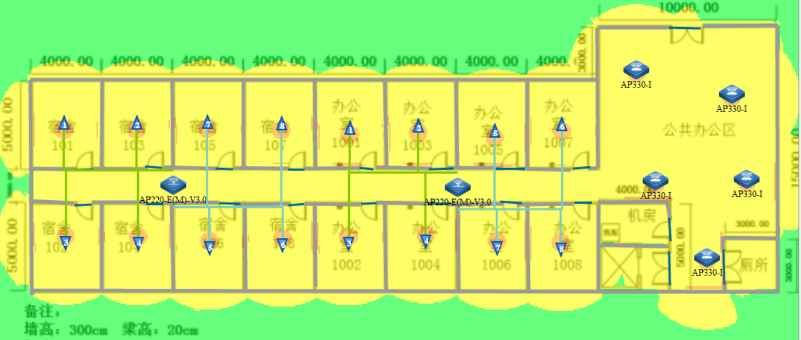
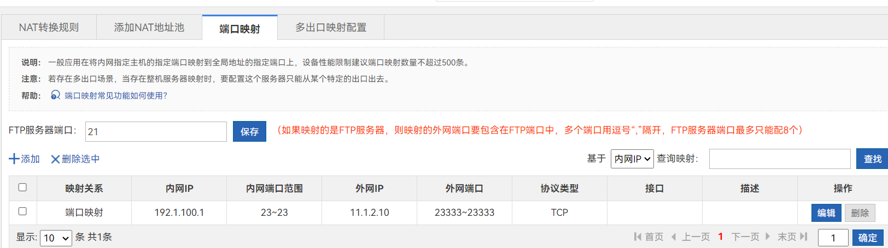

# 23国赛样题10网络

　　**2023年全国职业院校技能大赛**

　　**GZ073网络系统管理赛项**

　　**赛题第10套**

　　**模块A：网络构建**

​​

　　**目 ****录**

　　 **任务清单**​[	](#_Toc132397725)

　　 **（一）基础配置**​[	](#_Toc132397726)

　　 **（二）有线网络配置**​[	](#_Toc132397727)

　　 **（三）无线网络配置**​[	](#_Toc132397728)

　　 **（四）出口网络配置**​[	](#_Toc132397729)

　　 **（五）网络运维配置**​[	](#_Toc132397730)

　　 **（六）** SDN网络配置****	

　　**附录**1：拓扑图****	**6**

　　**附录**2：地址规划表****	**7**

# **任务清单**

#  **（一）基础配置**

### 1.根据附录1拓扑图及附录2地址规划表，配置设备接口信息。

　　S1

```shell
conf
hos S1
vlan 10
name Production
vlan 20
name Office
vlan 50
name APManage
vlan 60
name Wireless
vlan 100
name Manage
exi
int ran gi1/0/1-10
sw mo ac
sw ac vlan 10
int ran gi1/0/11-20
sw mo ac
sw ac vlan 20
int ran gi1/0/21-22
sw mo ac
sw ac vlan 50
exi
int vlan 100
ip add 192.1.100.1 255.255.255.0
```

　　S2

```shell
conf
hos S2
vlan 10
name Production
vlan 20
name Office
exi
int ran gi1/0/1-10
sw mo ac
sw ac vlan 10
int ran gi1/0/11-20
sw mo ac
sw ac vlan 20
int gi 1/0/23
no sw
desc SDN-Manage
ip add 192.168.1.3 255.255.255.0
```

　　S3

```shell
conf
hos S3
vlan 10
name Production
vlan 20
name Office
vlan 50
name APManage
vlan 60
name Wireless
vlan 100
name Manage
exi
int vlan 10
ip add 192.1.10.253 255.255.255.0
int vlan 20
ip add 192.1.20.253 255.255.255.0
int vlan 50
ip add 192.1.50.253 255.255.255.0
int vlan 60
ip add 192.1.60.253 255.255.255.0
int vlan 100
ip add 192.1.100.253 255.255.255.0
int gi1/0/24
no sw
ip add 10.1.1.2 255.255.255.252
int lo 0
ip add 10.1.0.3 255.255.255.255
```

　　S4

```shell
conf
hos S4
vlan 10
name Production
vlan 20
name Office
vlan 50
name APManage
vlan 60
name Wireless
vlan 100
name Manage
exi
int vlan 10
ip add 192.1.10.252 255.255.255.0
int vlan 20
ip add 192.1.20.252 255.255.255.0
int vlan 50
ip add 192.1.50.252 255.255.255.0
int vlan 60
ip add 192.1.60.252 255.255.255.0
int vlan 100
ip add 192.1.100.252 255.255.255.0
int gi1/0/24
no sw
ip add 10.1.1.6 255.255.255.252
int lo 0
ip add 10.1.0.4 255.255.255.255
```

　　S5

```shell
conf
hos S5
int gi 1/0/21
no sw
ip add 193.1.0.1 255.255.255.252
int ag1
no sw
exi
int ran gi 0/22-23
no sw
port-group 1 mo active 
int ag1
ip add 10.2.1.5 255.255.255.252
int gi 1/0/24
no sw
ip add 10.2.1.2 255.255.255.252
int lo 0
ip add 10.2.0.5 255.255.255.252
```

　　R1

```shell
conf
hos R1
vlan 10
name Production
vlan 20
name Office
exi
int vlan 10
ip add 192.1.10.254 255.255.255.0
int vlan 20
ip add 192.1.20.254 255.255.255.0
exi
int ran gi1/1-10
sw mo ac
sw ac vlan 10
int ran gi1/11-20
exi
int gi0/0
ip add 11.1.1.1 255.255.255.252
int gi0/1
ip add 11.1.2.1 255.255.255.252
int lo 0
ip add 11.1.0.1 255.255.255.255
```

　　R2

```shell
conf
hos R2
vlan 10
name Con-R3-OSPF20
vlan 20
name Con-EG2
vlan 30
name Con-R3-OSPF21
exi
int vlan 10
ip add 192.1.10.254 255.255.255.0
int vlan 20
ip add 192.1.20.254 255.255.255.0
exi
int ran gi1/1-10
sw mo ac
sw ac vlan 10
int ran gi1/11-20
exi
int gi0/0
ip add 11.1.1.2 255.255.255.252
int gi0/1
ip add 11.1.1.5 255.255.255.252
int lo 0
ip add 11.1.0.2 255.255.255.255
int lo 10
ip add 11.1.0.22 255.255.255.255
exi
int vlan 10
ip add 11.1.3.1 255.255.255.252
int vlan 20
ip add 11.1.1.9 255.255.255.252
int vlan 30
ip add 11.1.4.1 255.255.255.252
exi
int gi 1/0
sw mo ac
sw ac vlan 10
int gi 1/1
sw mo ac
sw ac vlan 20
int gi 1/2
sw mo ac
sw ac vlan 30
```

　　R3

```shell
conf
hos R3
vlan 10
name Con-R3-OSPF20
vlan 20
name Con-EG2
vlan 30
name Con-R3-OSPF21
exi
int vlan 10
ip add 192.1.10.254 255.255.255.0
int vlan 20
ip add 192.1.20.254 255.255.255.0
exi
int ran gi1/1-10
sw mo ac
sw ac vlan 10
int ran gi1/11-20
exi
int gi0/0
ip add 11.1.2.2 255.255.255.252
int gi0/1
ip add 11.1.2.5 255.255.255.252
int lo 0
ip add 11.1.0.3 255.255.255.255
int lo 10
ip add 11.1.0.33 255.255.255.255
exi
int vlan 10
ip add 11.1.3.2 255.255.255.252
int vlan 20
ip add 11.1.2.9 255.255.255.252
int vlan 30
ip add 11.1.4.2 255.255.255.252
exi
int gi 1/0
sw mo ac
sw ac vlan 10
int gi 1/1
sw mo ac
sw ac vlan 20
int gi 1/2
sw mo ac
sw ac vlan 30
```

　　VSU

```shell
conf
hos VSU
vlan 10
name Production
vlan 20
name Office
exi
int vlan 10
ip add 195.1.10.254 255.255.255.0
int vlan 20
ip add 195.1.20.254 255.255.255.0
exi
int ran gi1/0/1-40
sw mo ac
sw ac vlan 10
int ran gi2/0/1-40
sw mo ac
sw ac vlan 20
exi
int gi1/0/48
ip add 11.1.1.6 255.255.255.252
int gi2/0/48
ip add 11.1.2.6 255.255.255.252
int lo 0
ip add 11.1.0.67 255.255.255.255
```

　　VAC

```shell
conf
hos VAC
int ag 1
no sw
exi
int gi1/0/1
port-group 1 mo pass
int gi2/0/1
port-group 1 mo pass
int ag 1
ip add 10.2.1.6 255.255.255.252
int lo 0
ip add 10.2.0.12 255.255.255.255

```

### 2.在网络设备上，均开启SSH服务端功能。其中，用户名和密码为admin、Ruijie1234。密码为明文类型。特权密码为Ruijie123。

```shell
username admin pass 0 Ruijie1234
enable pass 0 Ruijie123
enable service ssh-server
cry key gen rsa

line vty 0 4
login local
```

### 3.交换设备上部署SNMP功能。配置所有设备SNMP消息，向主机172.16.0.254发送Trap消息版本采用V2C，读写的Community为“Test1234”，只读的Community为“Public123”，开启Trap消息。

```shell
enable service snmp
snmp enable traps
snmp Community Test1234 rw
snmp Community Public123 ro
snmp host 172.16.0.254 ver 2c Test1234
snmp host 172.16.0.254 ver 2c Public123
```

　　‍

#  **（二）有线网络配置**

### 1.在全网Trunk链路上做VLAN修剪。

### 2.在交换机S1的Gi0/1-Gi0/22端口启用端口保护。

```shell
int ran gi 1/0/21-22
sw protected 
```

### 3.在S1连接PC机端口上开启边缘端口和BPDU防护功能。

```shell
int ran gi 0/1-20
spanning-tree bpduguard enable
spanning-tree portfast 
```

### 4.检测到环路后处理方式为关闭端口

### 5.如果端口检测进入禁用状态，设置再过 300 秒后会自动恢复，重新检测是否有环路。

```shell
rldp enable 
rldp port loop-detect shutdown-port
errdisable recovery interval 300
```

### 6.DHCP服务器搭建于EG1上，DHCP对外服务使用loopback 0地址。

### 7.在S1交换机部署DHCP Snooping+DAI功能。其中，DAI功能主要针对VLAN10与VLAN20启用ARP防御。

```shell
service dhcp
ip dhcp snooping 
int ran gi 0/23-24
ip dhcp snooping trust
ip arp inspection trust 
exi
ip arp inspection vlan 10
ip arp inspection vlan 20
```

### 8.配置MSTP防止二层环路。要求VLAN10、VLAN20数据流经过S3转发，S3失效时经过S4转发。VLAN50、VLAN60、VLAN100数据流经过S4转发，S4失效时经过S3转发。region-name为test。revision版本为1。S3作为实例1的主根、实例2的从根，S4作为实例2的主根、实例1的从根。其中，主根优先级为4096，从根优先级为8192。

　　S1 S2

```shell
spanning-tree 
spanning-tree mst configuration 
revision 1
name test
 instance 1 vlan 10, 20
 instance 2 vlan 50, 60, 100
```

　　S3

```shell
spanning-tree 
spanning-tree mst configuration 
revision 1
name test
 instance 1 vlan 10, 20
 instance 2 vlan 50, 60, 100
exi
spanning-tree mst 1 priority 4096
spanning-tree mst 2 priority 8192
```

　　S4

```shell
spanning-tree 
spanning-tree mst configuration 
revision 1
name test
 instance 1 vlan 10, 20
 instance 2 vlan 50, 60, 100
exi
spanning-tree mst 1 priority 8192
spanning-tree mst 2 priority 4096
```

　　‍

### 9.在S3和S4交换机上配置VRRP，实现主机的网关冗余，所配置的参数要求见表1。在交换机S3、S4上配置的各VRRP组中，设置高优先级设置为150，低优先级设置为120，S3、S4的2条互联链路（Gi0/22、Gi0/23）上，配置二层链路聚合，采取LACP动态聚合模式。

　　表1 S3和S4的VRRP参数表

|**VLAN**|**VRRP备份组号（VRID）**|**VRRP虚拟IP**|
| ---------| -----| ---------------|
|VLAN10|10|192.1.10.254|
|VLAN20|20|192.1.20.254|
|VLAN50|30|192.1.50.254|
|VLAN60|40|192.1.60.254|
|VLAN100|100|192.1.100.254|

　　S3

```shell
int vlan 10
vrrp 10 ip 192.1.10.254
vrrp 10 pri 150
int vlan 20
vrrp 20 ip 192.1.20.254
vrrp 20 pri 150
int vlan 50
vrrp 50 ip 192.1.50.254
vrrp 50 pri 120
int vlan 60
vrrp 60 ip 192.1.60.254
vrrp 60 pri 120
int vlan 100
vrrp 100 ip 192.1.100.254
vrrp 100 pri 120
exi
int ag1
exi
int ran gi 1/0/22-23
port-group 1 mo ac
```

　　S4

```shell
int vlan 10
vrrp 10 ip 192.1.10.254
vrrp 10 pri 120
int vlan 20
vrrp 20 ip 192.1.20.254
vrrp 20 pri 120
int vlan 50
vrrp 50 ip 192.1.50.254
vrrp 50 pri 150
int vlan 60
vrrp 60 ip 192.1.60.254
vrrp 60 pri 150
int vlan 100
vrrp 100 ip 192.1.100.254
vrrp 100 pri 150
exi
int ag1
exi
int ran gi 1/0/22-23
port-group 1 mo pass
```

### 10.S6和S7间的Te0/49-50端口作为虚拟交换链路实现网络设备虚拟化。其中S6为主，S7为备。S6和S7间的Gi0/47端口作为双主机检测链路，配置基于双主机检测，当虚拟交换链路的所有物理链路都异常断开时，备机会切换成主机，从而保障网络正常。其中，主设备：Domain id：1。switch id:1。priority 150。 description: Switch-Virtual-Switch1。备设备：Domain id：1。switch id:2。priority 120。description: Switch-Virtual-Switch2。

　　S6

```shell
conf
switch vir domain 1
switch 1 pri 150
switch 1 desc Switch-Virtual-Switch1
exi
vsl-port
port inter tengi 0/49
port inter tengi 0/50
end
wr
switch con mode vir
reload
```

　　S7

```shell
conf
switch vir domain 1
switch 2 pri 120
switch 2 desc Switch-Virtual-Switch2
exi
vsl-port
port inter tengi 0/49
port inter tengi 0/50
end
wr
switch con mode vir
reload
```

　　VSU

```shell
conf
hos VSU
int gi1/0/47
no sw
int gi2/0/47
no sw
switch vir domain 1
dual de bfd
dual bfd int gi1/0/47
dual bfd int gi2/0/47
```

### 11.各机构内网运行OSPF，配置VAC、S5、EG2之间运行OSPF，进程号10，规划单区域：区域0。R1、R2、R3之间运行OSPF，进程号20，规划单区域：区域0。 VSU、R2、R3之间运行OSPF，进程号21，规划单区域：区域0。S3、S4、EG1之间运行OSPF，进程号为30。

### 12.要求业务网段中不出现协议报文。R1、VSU始发的终端网段以及各设备上的Loopback管理地址，均以重分发直连路由的方式注入路由;R2/EG2、R3/EG1之间互联段，均以重发布直连的方式，注入R2、R3的OSPF双进程中，R2、R3之间启用OSPF与BFD联动，以达到迅速检测运营商网络中断，快速地切换到其他备份线路，提高用户网络体验。

### 13.优化OSPF相关配置，以尽量加快OSPF收敛。配置重发布路由进OSPF中使用类型1。

#### 进程号10

　　VAC

```shell
router ospf 10
network 10.2.0.12 0.0.0.0 ar 0
network 10.2.1.6 0.0.0.3 ar 0
router-id 10.2.0.12
int ag1
ip ospf network point-to-point
```

　　S5

```shell
router ospf 10
network 10.2.0.5 0.0.0.0 ar 0
network 193.1.0.1 0.0.0.3 ar 0
network 10.2.1.2 0.0.0.3 ar 0
network 10.2.1.5 0.0.0.3 ar 0
router-id 10.2.0.5
int ag1
ip ospf network point-to-point
int gi0/24
ip ospf network point-to-point
```

　　EG2

```shell
router ospf 10
network 10.2.0.2 0.0.0.0 ar 0
network 10.2.1.1 0.0.0.3 ar 0
router-id 10.2.0.2
int gi0/1
ip ospf network point-to-point
```

#### 进程号20

　　R1

```shell
router ospf 20
router-id 11.1.0.1
redistribute connected metric-type 1 subnets
network 11.1.1.1 0.0.0.3 ar 0
network 11.1.2.1 0.0.0.3 ar 0
network 11.1.0.1 0.0.0.0 ar 0
```

　　R2

```shell
router ospf 20
redistribute connected metric-type 1 subnets
router-id 11.1.0.2
network 11.1.1.2 0.0.0.3 ar 0
network 11.1.3.1 0.0.0.3 ar 0
network 11.1.0.2 0.0.0.0 ar 0

int gi0/1
ip ospf network point-to-point
int gi0/0
ip ospf network point-to-point
int vlan 10
ip ospf network point-to-point
```

　　R3

```shell
router ospf 20
redistribute connected metric-type 1 subnets
router-id 11.1.0.3
network 11.1.2.2 0.0.0.3 ar 0
network 11.1.3.2 0.0.0.3 ar 0
network 11.1.0.3 0.0.0.0 ar 0

int gi0/1
ip ospf network point-to-point
int gi0/0
ip ospf network point-to-point
int vlan 10
ip ospf network point-to-point
```

#### 进程号21

　　VSU

```shell
router ospf 21
redistribute connected metric-type 1 subnets
router-id 11.1.0.67
network 11.1.0.67 0.0.0.0 ar 0
network 11.1.1.6 0.0.0.3 ar 0
network 11.1.2.6 0.0.0.3 ar 0
```

　　R2

```shell
router ospf 21
redistribute connected metric-type 1 subnets
router-id 11.1.0.22
network 11.1.0.22 0.0.0.0 ar 0
network 11.1.4.1 0.0.0.3 ar 0
network 11.1.1.5 0.0.0.3 ar 0

int vlan 30
ip ospf network point-to-point
```

　　R3

```shell
router ospf 21
redistribute connected metric-type 1 subnets
router-id 11.1.0.33
network 11.1.0.22 0.0.0.0 ar 0
network 11.1.4.2 0.0.0.3 ar 0
network 11.1.2.5 0.0.0.3 ar 0

int vlan 30
ip ospf network point-to-point
```

#### 进程号30

　　S3

```shell
router ospf 30
network 10.1.0.3 0.0.0.0 ar 0
network 10.1.1.2 0.0.0.3 ar 0
network 192.1.10.253 0.0.0.255 ar 0
network 192.1.20.253 0.0.0.255 ar 0
network 192.1.50.253 0.0.0.255 ar 0
network 192.1.60.253 0.0.0.255 ar 0
network 192.1.100.253 0.0.0.255 ar 0
pass vlan 10
pass vlan 20
pass vlan 50
pass vlan 60
router-id 10.1.0.3
exi
int vlan 100
ip ospf network point-to-m
int gi1/0/24
ip ospf network point-to-point
```

　　S4

```shell
router ospf 30
network 10.1.0.4 0.0.0.0 ar 0
network 10.1.1.6 0.0.0.3 ar 0
network 192.1.10.253 0.0.0.255 ar 0
network 192.1.20.253 0.0.0.255 ar 0
network 192.1.50.253 0.0.0.255 ar 0
network 192.1.60.253 0.0.0.255 ar 0
network 192.1.100.253 0.0.0.255 ar 0
pass vlan 10
pass vlan 20
pass vlan 50
pass vlan 60
router-id 10.1.0.4
y
exi
int vlan 100
ip ospf network point-to-m
int gi1/0/24
ip ospf network point-to-point
```

　　EG1

```shell
router ospf 30
network 10.1.0.1 0.0.0.0 ar 0
network 10.1.1.1 0.0.0.3 ar 0
network 10.1.1.5 0.0.0.3 ar 0
router-id 10.1.0.1
int gi0/1
ip ospf network point-to-p
int gi0/2
ip ospf network point-to-point
```

#### BFD联动

　　R2

```shell
int vlan 10
bfd interval 500 min_rx 500 multiplier 3
no bfd echo 
ip ospf bfd 
int vlan 30
bfd interval 500 min_rx 500 multiplier 3
no bfd echo 
ip ospf bfd 
```

　　R3

```shell
int vlan 10
bfd interval 500 min_rx 500 multiplier 3
no bfd echo 
ip ospf bfd 
int vlan 30
bfd interval 500 min_rx 500 multiplier 3
no bfd echo 
ip ospf bfd 
```

　　bfd配置成功

​​

### 14.分支机构之间，部署IPV6网络，实现机构之间的内网中安装的IPV6终端，可通过无状态自动从网关处获取地址。其中，IPV6地址规划如表2。R1、VSU通过Gre隧道实现局域网IPV6终端互联互通,且隧道内运行OSPFV3协议,进程号10，区域号为0；

　　表2 PV6地址规划表

|设备|接口|IPV6地址|
| ---------| -----------------------| -----------------------|
|R1|VLAN10|2001:194:1:10::254/64|
|VLAN20|2001:194:1:20::254/64||
|Tunnel0|2001:11:1:3::1/64||
|VSU|VLAN10|2001:195:1:10::254/64|
|VLAN20|2001:195:1:20::254/64||
|Tunnel0|2001:11:1:3::2/64||

　　由R2与R3在ospf下发缺省路由，实现R1与VSU的通信

　　R1

```shell
ipv6 unicast-routing 
int vlan 10
ipv6 enable
ipv6 address 2001:194:1:10::254/64
no ipv6 nd suppress-ra
ipv6 ospf 10 ar 0
int vlan 20
ipv6 enable
ipv6 address 2001:194:1:20::254/64
no ipv6 nd suppress-ra
ipv6 ospf 10 ar 0
int tu 0
 tunnel mode ipv6ip
tunnel source 11.1.0.1
tunnel destination 11.1.0.67
ipv6 enable
ipv6 address 2001:11:1:3::1/64
ipv6 ospf 10 area 0
```

　　VSU

```shell
ipv6 unicast-routing 
int vlan 10
ipv6 enable
ipv6 address 2001:195:1:10::254/64
no ipv6 nd suppress-ra
ipv6 ospf 10 ar 0
int vlan 20
ipv6 enable
ipv6 address 2001:195:1:20::254/64
no ipv6 nd suppress-ra
ipv6 ospf 10 ar 0
int tu 0
 tunnel mode ipv6ip
tunnel source 11.1.0.67
tunnel destination 11.1.0.1
ipv6 enable
ipv6 address 2001:11:1:3::2/64
ipv6 ospf 10 area 0
```

　　VSU正常学习到R1的ipv6网络

​​

#  **（三）无线网络配置**

　　北京互联网平台电子商务集团火星公司办公区无线项目拟投入12万元（网络设备采购部分），项目公共办公区人数大概在20人左右。平面布局如图1所示。

​​

　　图1 平面布局图

### 1.绘制AP点位图（包括：AP型号、编号、信道等信息，其中信道采用2.4G的1、6、11三个信道进行规划，洗手间、楼梯区域无须覆盖）。

### 2.使用无线地勘软件，输出AP点位图的2.4G频道的信号仿真热图（仿真信号强度要求大于-65db）。

​​

### 3.根据表3无线产品价格表，制定该无线网络工程项目设备的预算表；

　　表3无线产品价格表

|**产品型号**|**产品特征**|**传输速率**<br /> **（2.4G/最大）**|**推荐/最大带点数**|**功率**|**价格（元）**|||
| --------| -------------------| -------------| --------| -------| -------| --| --|
|AP1|双频双流|300M/1.167G|32/256|100mw|6000|||
|AP2|双频双流|300M/600M|32/256|100mw|11000|||
|AP3|单频单流|150M|12/32|60mw|2500|||
|线缆1|10米馈线|N/A|N/A|N/A|1600|||
|线缆2|15米馈线|N/A|N/A|N/A|2400|||
|天线|双频单流/单频单流|N/A|N/A|N/A|500|||
|Switch|24口POE交换机|N/A|N/A|240w|15000|||
|AC|无线控制器|6*1000M|32/200|40w|50000|||

### 4.分公司的无线网络规划中，使用EG1作为无线用户和无线FIT AP的DHCP服务器。分公司内网SSID为admin_Fit_XX(备注：XX现场提供)。WLANID为1。AP-Group为admin。配置内网中的无线用户在关联SSID后，即可自动获取VLAN60地址

　　EG1 DHCP规划

```shell
service dhcp
ip dhcp pool APManage
 lease 0 8 0 
 network 192.1.50.0 255.255.255.0
 dns-server 114.114.114.114
 default-router 192.1.50.254
ip dhcp pool wireless
 lease 0 8 0 
 dns-server 114.114.114.114
 network 192.1.60.0 255.255.255.0
 default-router 192.1.60.254
```

### 5.配置两台AC设备，使用虚拟化方案组合成1台虚拟AC。

### 6.AC1和AC2之间的Gi0/4-5端口作为虚拟交换链路。其中：配置AC1为主，AC2为备。

### 7.AC1和AC2间的Gi0/3端口，作为双主机检测链路，配置基于双主机检测。当虚拟交换链路的所有物理链路都异常断开时，备机会切换成主机，从而保障网络正常。其中，主设备为：Domain id：1。device id:1。priority 150。 description: AC-1。备设备为：Domain id：1。device id:2。priority 120。 description: AC-2。

　　注意：操作失误，这里交换链路使用3/4口，检测链路使用5口

　　AC1

```shell
virtual-ac domain 1
device 1
device 1 pri 150
device 1 description AC-1
exi
vac-port 
port-member interface gigabitEthernet 0/3
port-member interface gigabitEthernet 0/4
end
device convert mode virtual
```

　　AC2

```shell
virtual-ac domain 1
device 2
device 2 pri 120
device 2 description AC-2
exi
vac-port 
port-member interface gigabitEthernet 0/3
port-member interface gigabitEthernet 0/4
end
device convert mode virtual
```

　　VAC

```shell
conf
hos VAC
int GigabitEthernet 1/0/5
no sw
int GigabitEthernet 2/0/5
no sw
virtual-ac domain 1
 dual-active detection bfd
 dual-active bfd interface GigabitEthernet 1/0/5
 dual-active bfd interface GigabitEthernet 2/0/5
```

### 8.虚拟AC与S5之间的业务线缆都规划为双线路。为提升冗余性，采用三层链路聚合。

### 9.AP3使用胖模式进行部署，以透明模式进行部署，管理地址为192.1.100.3/24(备注：XX现场提供)。在无线AP3上创建SSID(WLAN-ID 2)，相关参数为：admin-Fat_XX(备注：XX现场提供) 。其中，内网无线用户关联SSID后，可自动获取VLAN60网段地址。

### 10.无线用户接入无线网络时，连接Fit AP无线用户接入无线网络时采用WPA2加密方式，加密密码为XX。Fat AP部署的无线网络中，无线用户接入无线网络时采用WEB认证方式，认证用户名user1、密码为XX。

#  **（四）出口网络配置**

### 1.出口网关上进行NAT配置，实现机构内网终端及服务器，均可访问互联网，通过NAPT方式将内网IP地址转换到互联网接口上。

　　配置IP时，把NAT打开即可

​​

### 2.出口网关EG1上配置，使S1交换机（192.1.100.1,其中：XX现场提供）设备的Telnet服务，可以通过互联网被访问。此外，将其地址映射至运营商线路上，映射地址为11.1.2.10，映射端口23333。

​​

​​

### 3.EG1设备，上启用Web Portal认证服务，认证用户名密码均为user1、user2。有线用户需进行WEB认证访问互联网无线用户不需在EG上进行WEB认证即可访问互联网。

　　开启认证 认证用户为独立认证

​​

　　放行内网，内网资源无需认证

​​

　　无线用户免认证

​​

　　添加用户

​​

### 4.出口网关EG1上，针对内网访问互联网WEB流量限速每IP 1000Kbps，内网WEB总流量不超过20Mbps，通道名称定义为WEB。

​​

​​

​​

​​

### 5.在EG1与EG2出口网关之间，启用GRE Over IPSec VPN嵌套功能。创建GRE隧道，实现内部承载OSPF协议，使其总分机构间内网连通。

### 6.配置IPSec安全使用静态点对点模式，要求esp传输模式封装协议。isakmp策略定义加密算法采用3des。散列算法采用md5，预共享密码为admin。DH使用组2。此外，转换集myset定义加密验证方式为esp-3des esp-md5-hmac。感兴趣流ACL编号为103。加密图定义为mymap。

　　EG1

```shell
int tu 0
 ip address 11.1.5.2 255.255.255.252
 tunnel source 11.1.2.10
 tunnel destination 11.1.1.10
access-list e 103 
per gre hos 11.1.2.10 hos 11.1.1.10
per gre hos 11.1.5.2 hos 11.1.5.1
crypto isakmp policy 1
 authentication pre-share
 encryption 3des
 group 2
crypto isakmp key 0 admin address 11.1.2.10
crypto ipsec transform-set myset esp-3des esp-md5-hmac
cry map mymap 10 ipsec-isakmp 
 set transform-set myset
 set peer 11.1.2.10
 set autoup
 match address 103
int gi0/4
crypto map mymap

```

　　EG2

```shell
int tu 0
 ip address 11.1.5.1 255.255.255.252
 tunnel source 11.1.1.10
 tunnel destination 11.1.2.10
access-list e 103
per gre hos 11.1.1.10 hos 11.1.2.10
per gre hos 11.1.5.1 hos 11.1.5.2
crypto isakmp policy 1
 authentication pre-share
 encryption 3des
 group 2
crypto isakmp key 0 admin address 11.1.2.10
crypto ipsec transform-set myset esp-3des esp-md5-hmac
cry map mymap 10 ipsec-isakmp 
 set transform-set myset
 set peer 11.1.2.10
 set autoup
 match address 103
int gi0/4
crypto map mymap
```

　　‍

　　‍

#  **（五）网络运维配置**

　　1.完成整网连通后，进入网络监控运维阶段，运维软件已安装在PC1的虚拟机OPMSrv中(访问运维平台的URL为http://192.1.100.100)，通过运维平台监控北京分公司所有设备。

　　2.通过运维平台将被监控设备纳入监控范围；通过拓扑配置功能，将网络拓扑配置到平台中；

　　3.将S3、S4和EG1的两条链路作为重点监测链路，纳入链路监控；

　　4.自定义监控大屏（名称：Chinaskills_network），将网络拓扑、设备运行状态（CPU使用率）、链路运行状态实时显示在大屏中。

#  **（六）SDN网络配置**

　　1.SDN控制器登录地址：：192.168.1.2/24，默认用户密码为admin/test@123。

　　2.使用S2/S4构建SDN网络，S2连接SDN控制器的6653端口。

　　3.通过SDN控制器手工给S2下发流表项使其S2下终端可与业务网段互联互通。

# **附录1：拓扑图**

​​

# **附录2：地址规划表**

|**设备**|**接口或VLAN**|**VLAN名称**|**二层或三层规划**|**说明**|
| -------------| -------------------| -------------------| ------------------| ------------------|
|S1|VLAN10|Production|Gi0/1至Gi0/10|生产网|
|VLAN20|Office|Gi0/11至Gi0/20|办公网||
|VLAN50|APManage|Gi0/21至Gi0/22|无线AP管理||
|VLAN60|Wireless|\|无线终端|||
|VLAN100|Manage|192.1.100.1/24|设备远程管理||
|S2|VLAN10|Production|Gi0/1至Gi0/10|生产网|
|VLAN20|Office|Gi0/11至Gi0/20|办公网||
|Gi0/23|SDN-Manage|192.168.1.3|SDN管理网段||
|AP3|BVI 100|Manage|192.1.100.3/24|设备远程管理|
|S3|VLAN10|Production|192.1.10.253/24|生产网|
|VLAN20|Office|192.1.20.253/24|办公网||
|VLAN50|APManage|192.1.50.253/24|无线AP管理||
|VLAN60|Wireless|192.1.60.253/24|无线终端||
|VLAN100|Manage|192.1.100.253/24|设备远程管理||
|Gi0/24|\|10.1.1.2/30||||
|LoopBack 0|\|10.1.0.3/32||||
|S4|VLAN10|Production|192.1.10.252/24|生产网|
|VLAN20|Office|192.1.20.252/24|办公网||
|VLAN50|APManage|192.1.50.252/24|无线AP管理||
|VLAN60|Wireless|192.1.60.252/24|无线终端||
|VLAN100|Manage|192.1.100.252/24|设备远程管理||
|Gi0/24|\|10.1.1.6/30||||
|LoopBack 0|\|10.1.0.4/32||||
|EG1|Gi0/1|\|10.1.1.1/30|||
|Gi0/2|\|10.1.1.5/30||||
|Gi0/4|\|11.1.2.10/30||||
|Tunnel 0|\|11.1.5.2/30||||
|LoopBack 0|\|10.1.0.1/32||||
|VAC|Gi1/0/1|\|10.2.1.6/30|AG1成员口||
|Gi2/0/1|\|AG1成员口||||
|LoopBack 0|\|10.2.0.12/32||||
|S5|Gi0/21|\|193.1.0.1/30|云平台||
|Gi0/22|\|10.2.1.5/30|AG1成员口|||
|Gi0/23|\|AG1成员口||||
|Gi0/24|\|10.2.1.2/30||||
|LoopBack 0|\|10.2.0.5/32||||
|EG2|Gi0/1|\|10.2.1.1/30|||
|Gi0/4|\|11.1.1.10/30||||
|Tunnel 0|\|11.1.5.1/30||||
|LoopBack 0|\|10.2.0.2/32||||
|R1|VLAN10|Production|194.1.10.254/24|Gi1/1-Gi1/10|
|VLAN20|Office|194.1.20.254/24|Gi1/11-Gi1/20||
|Gi0/0|\|11.1.1.1/30||||
|Gi0/1|\|11.1.2.1/30||||
|LoopBack 0|\|11.1.0.1/32||||
|R2|VLAN10|Con-R3-OSPF20|11.1.3.1/30|成员口Gi 1/0|
|VLAN20|Con-EG2　|11.1.1.9/30|成员口Gi 1/1||
|VLAN30|Con-R3-OSPF21|11.1.4.1/30|成员口Gi 1/2||
|Gi0/0|\|11.1.1.2/30||||
|Gi0/1|\|11.1.1.5/30||||
|LoopBack 0|NA|11.1.0.2/32|OSPF20进程||
|LoopBack 10|NA|11.1.0.22/32|OSPF21进程||
|R3|VLAN10|Con-R2-OSPF20|11.1.3.2/30|成员口Gi 1/0　|
|VLAN20|Con-EG1|11.1.2.9/30|成员口Gi 1/1||
|VLAN30|Con-R2-OSPF21|11.1.4.2/30|成员口Gi 1/2||
|Gi0/0|\|11.1.2.2/30||||
|Gi0/1|\|11.1.2.5/30||||
|LoopBack 0|\|11.1.0.3/32|OSPF20进程|||
|LoopBack 10|\|11.1.0.33/32|OSPF21进程|||
|VSU|VLAN10|Production|195.1.10.254/24|Gi1/0/1-Gi1/0/40|
|VLAN20|Office|195.1.20.254/24|Gi2/0/1-Gi2/0/40||
|Gi1/0/48|\|11.1.1.6/30||||
|Gi2/0/48|\|11.1.2.6/30||||
|LoopBack 0|\|11.1.0.67/32||||
