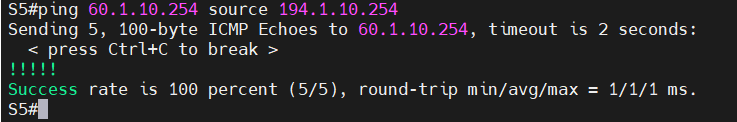
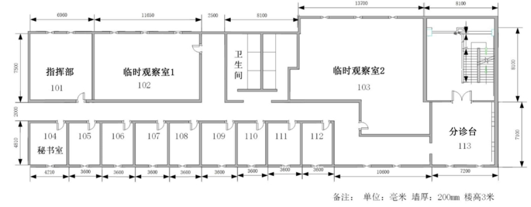
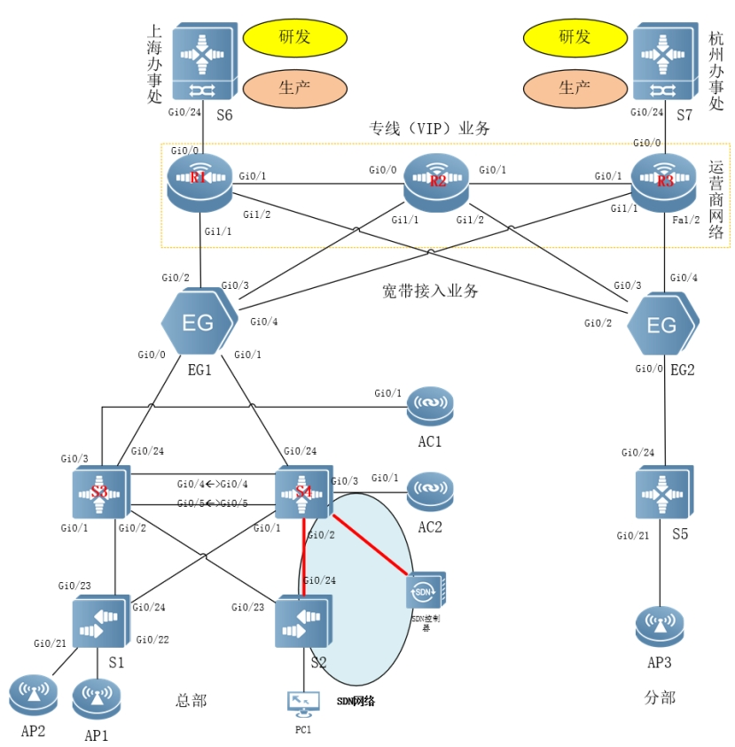

# 23国赛样题9网络

　　[]()

　　**2023年全国职业院校技能大赛**

　　**GZ073网络系统管理赛项**

　　**赛题第9套**

　　**模块A：网络构建**

​​

　　**目** ** 录**

　　任务清单**	**

　　（一）** **基础配置**	**

　　（二）** **有线网络配置**	**

　　（三）** **无线网络配置**	**

　　（四）** **出口网络配置**	**

　　（五）网络运维配置**	**

　　（六）**SDN网络配置**​[	](#_Toc132396493)

　　附录**1：拓扑图**​[	](#_Toc132396494)

　　附录**2：地址规划表**​[	](#_Toc132396495)

# **任务清单**

# （一）**基础配置**

### 1 根据附录1拓扑图及附录2地址规划表，配置设备接口信息；

　　S1

```shell
conf
hos S1
vlan 10
name JXL
vlan 20
name SYL
vlan 30
name BGL
vlan 40
name TSG
vlan 50
name AP
vlan 100
name Manage
exi
int ran gi 0/1-4
sw mo ac
sw ac vlan 10
int ran gi 0/5-8
sw mo ac
sw ac vlan 20
int ran gi 0/9-12
sw mo ac
sw ac vlan 30
int ran gi 0/13-16
sw mo ac
sw ac vlan 40
int ran gi 0/20-21
sw mo ac
sw ac vlan 50
exi
int vlan 100
ip add 192.1.100.11 255.255.255.0
```

　　S2

```shell
conf
hos S2
vlan 10
name JXL
vlan 20
name SYL
vlan 30
name BGL
vlan 40
name TSG
vlan 50
name AP
exi
int ran gi 0/1-4
sw mo ac
sw ac vlan 10
int ran gi 0/5-8
sw mo ac
sw ac vlan 20
int ran gi 0/9-12
sw mo ac
sw ac vlan 30
int ran gi 0/13-16
sw mo ac
sw ac vlan 40
int ran gi 0/20-21
sw mo ac
sw ac vlan 50
exi
int gi0/24
no sw
ip add 192.168.1.3 255.255.255.0
```

　　S3

```shell
conf
hos S3
vlan 10
name JXL
vlan 20
name SYL
vlan 30
name BGL
vlan 40
name TSG
vlan 100
name Manage
exi
int vlan 10
ip add 192.1.10.252 255.255.255.0
int vlan 20
ip add 192.1.20.252 255.255.255.0
int vlan 30
ip add 192.1.30.252 255.255.255.0
int vlan 40
ip add 192.1.40.252 255.255.255.0
int vlan 100
ip add 192.1.100.252 255.255.255.0
int gi 0/24
no sw
ip add 10.1.0.2 255.255.255.252
int lo 0
ip add 11.1.0.33 255.255.255.255
```

　　S4

```shell
conf
hos S3
vlan 10
name JXL
vlan 20
name SYL
vlan 30
name BGL
vlan 40
name TSG
vlan 100
name Manage
exi
int vlan 10
ip add 192.1.10.253 255.255.255.0
int vlan 20
ip add 192.1.20.253 255.255.255.0
int vlan 30
ip add 192.1.30.253 255.255.255.0
int vlan 40
ip add 192.1.40.253 255.255.255.0
int vlan 100
ip add 192.1.100.253 255.255.255.0
int gi 0/24
no sw
ip add 10.1.0.6 255.255.255.252
int lo 0
ip add 11.1.0.34 255.255.255.255
```

　　AC1

```shell
conf
hos AC1
vlan 50
name AP
vlan 60
name Wiressless
vlan 100
name Manage
exi
int lo 0
ip add 11.1.0.204 255.255.255.255
int vlan 50
ip add 192.1.50.252 255.255.255.0
int vlan 60
ip add 192.1.60.252 255.255.255.0
int vlan 100
ip add 192.1.100.2 255.255.255.0
```

　　AC2

```shell
conf
hos AC1
vlan 50
name AP
vlan 60
name Wiressless
vlan 100
name Manage
exi
int lo 0
ip add 11.1.0.205 255.255.255.255
int vlan 50
ip add 192.1.50.253 255.255.255.0
int vlan 60
ip add 192.1.60.253 255.255.255.0
int vlan 100
ip add 192.1.100.2 255.255.255.0
```

　　R1

```shell
conf
hos R1
int gi 0/0
no sw
ip add 50.1.0.9 255.255.255.252
int gi 0/1
no sw
ip add 50.1.0.1 255.255.255.252
exi
vlan 10
name Con-EG1
vlan 20
name Con-EG2
exi
int vlan 10
ip add 20.1.0.1 255.255.255.248
int vlan 20
ip add 20.1.0.9 255.255.255.248
int lo 0
ip add 11.1.0.1 255.255.255.255
exi
int gi1/1
sw mo ac
sw ac vlan 10
int gi1/2
sw mo ac
sw ac vlan 20
```

　　R2

```shell
conf
hos R2
int gi 0/0
no sw
ip add 50.1.0.2 255.255.255.252
int gi 0/1
no sw
ip add 50.1.0.5 255.255.255.252
exi
vlan 10
name Con-EG1
vlan 20
name Con-EG2
exi
int vlan 10
ip add 30.1.0.1 255.255.255.248
int vlan 20
ip add 30.1.0.9 255.255.255.248
int lo 0
ip add 11.1.0.2 255.255.255.255
exi
int gi1/1
sw mo ac
sw ac vlan 10
int gi1/2
sw mo ac
sw ac vlan 20
```

　　R3

```shell
conf
hos R2
int gi 0/0
no sw
ip add 50.1.0.13 255.255.255.252
int gi 0/1
no sw
ip add 50.1.0.6 255.255.255.252
exi
vlan 10
name Con-EG1
vlan 20
name Con-EG2
exi
int vlan 10
ip add 40.1.0.1 255.255.255.248
int vlan 20
ip add 40.1.0.9 255.255.255.248
int lo 0
ip add 11.1.0.3 255.255.255.255
exi
int gi1/1
sw mo ac
sw ac vlan 10
int gi1/2
sw mo ac
sw ac vlan 20
```

　　S6

```shell
conf
hos S6
vlan 10 
name Develop
vlan 20
name Product
exi
int vlan 10
ip add 60.1.10.254 255.255.255.0
int vlan 20
ip add 60.1.20.254 255.255.255.0
int gi 0/24
ip add 50.1.0.10 255.255.255.252
int lo 0
ip add 11.1.0.6 255.255.255.255
exi
int ran gi0/1-4
sw mo ac
sw ac vlan 10
int ran gi0/5-8
sw mo ac
sw ac vlan 20
```

　　S7

```shell
conf
hos S7
vlan 10 
name Develop
vlan 20
name Product
exi
int vlan 10
ip add 70.1.10.254 255.255.255.0
int vlan 20
ip add 70.1.20.254 255.255.255.0
int gi 0/24
ip add 50.1.0.14 255.255.255.252
int lo 0
ip add 11.1.0.7 255.255.255.255
exi
int ran gi0/1-4
sw mo ac
sw ac vlan 10
int ran gi0/5-8
sw mo ac
sw ac vlan 20
```

　　<span id="20240428205803-d6rexbr" style="display: none;"></span>S5 同时配置primary vlan

```shell
conf
hos S5
vlan 11
private-vlan community
name Community_vlan
vlan 12
private-vlan isolated
name Isolated_vlan
vlan 10
private-vlan primary
name Primary_vlan
private-vlan association add 11,12
vlan 20
name AP
vlan 30
name Wiressless_users1
vlan 40
name Wiressless_users2
exi
int gi0/24
no sw
ip add 10.1.0.10 255.255.255.252
int vlan 10
ip add 194.1.10.254 255.255.255.0
int vlan 20
ip add 194.1.20.254 255.255.255.0
int vlan 30
ip add 194.1.30.254 255.255.255.0
int vlan 40
ip add 194.1.40.254 255.255.255.0
int lo 0
ip add 11.1.0.5 255.255.255.255
exi
int ran gi 1/0/1-4
sw mo ac
sw ac vlan 11
int ran gi 1/0/5-8
sw mo ac
sw ac vlan 12
```

### 2 在网络设备上，均开启SSH服务端功能。其中，用户名和密码为admin、admin123。密码为明文类型。特权密码为admin1234；

```shell
username admin pass 0 admin123
enable pass 0 admin1234
ena ser ssh
cry key gen rsa
y
line vty 0 4
login local
exi
```

### 3 交换设备上部署SNMP功能。配置所有设备SNMP消息，向主机172.16.0.254发送Trap消息版本采用V2C，读写的Community为“Test@123”，只读的Community为“public@123”，开启Trap消息。

```shell
ena ser snmp
snmp ena trap
snmp comm Test@123 rw
snmp comm public@123 ro
snmp host 172.16.0.254 v 2c Test@123
snmp host 172.16.0.254 v 2c public@123
```

# （二）**有线网络配置**

### 1 在全网Trunk链路上做VLAN修剪；

　　<span id="20240429105907-78ij639" style="display: none;"></span>包含MSTP配置

　　S1

```shell
int ran gi 0/23-24
sw mo tr
sw tr al v on 10,20,30,40,50,100
exi
span mst con
name ruijie
re 1
exi
```

　　S2

```shell
int ran gi 0/23-24
sw mo tr
sw tr al v on 10,20,30,40,50
exi
span mst con
name ruijie
re 1
exi
```

　　S3

```shell
int ran gi 0/1-2
sw mo tr
sw tr al v on 10,20,30,40,50,100
int ran gi 0/4-5
sw mo tr
sw tr al v on 10,20,30,40,50,100
exi
span mst con
name ruijie
re 1
exi
span mst 0 pri 4096
```

　　S4

```shell
int ran gi 0/1-2
sw mo tr
sw tr al v on 10,20,30,40,50,100
int ran gi 0/4-5
sw mo tr
sw tr al v on 10,20,30,40,50,100
exi
span mst con
name ruijie
re 1
exi
span mst 0 pri 8192
```

　　‍

### 2 在S1开启边缘端口和BPDU防护功能。检测到环路后处理方式关闭端口。如果端口检测进入禁用状态，300秒后会自动恢复；

### 3 在S1交换机部署DHCP Snooping功能；

### 4 在S1开启防止环路功能，检测到环路后处理方式为关闭端口；

```shell
rldp enable
service dhcp
ip dhcp snooping
int ran gi 1/0/1-16
 errdisable recovery interval 300
 switchport access vlan 10
 spanning-tree bpduguard enable
 spanning-tree portfast

```

### 5 在S3、S4上配置DHCP中继，对VLAN10内的用户进行中继，DHCP服务器搭建于EG1上，地址池命名为Pool_VLAN10，DHCP对外服务使用loopback 0地址；

　　S3 S4

```shell
service dhcp
int vlan 10
ip helper-address 11.1.0.11
```

　　EG1

```shell
ser dhcp
ip dhcp pool Pool_VLAN10
 network 192.1.10.0 255.255.255.0
 default-router 192.1.10.254
```

　　‍

### 6 分校S5交换机配置Private Vlan；

　　[S5 同时配置primary vlan](#20240428205803-d6rexbr)

### 7 配置MSTP,要求所有有线数据流经过S3转发，S3失效时经过S4转发。所配置的参数要求如下：region-name为ruijie；revision版本为1；S3作为实例中的主根， S4作为实例中的从根；主根优先级为4096，从根优先级为8192；

　　[包含MSTP配置](#20240429105907-78ij639)

### 8 在S3和S4上配置VRRP，各VRRP组中高优先级设置为150，低优先级设置为120，所配置的参数要求如表1；

　　**表1**** S3和S4的VRRP参数表**

|**VLAN**|**VRRP备份组号（VRID）**|**VRRP虚拟IP**|
| ---------| -----| ---------------|
|VLAN10|10|192.1.10.254|
|VLAN20|20|192.1.20.254|
|VLAN30|30|192.1.30.254|
|VLAN40|40|192.1.40.254|
|VLAN100|100|192.1.100.254|

　　<span id="20240429152744-88gtaee" style="display: none;"></span>VRRP与VRRP6同时配置

　　S3

```shell
int vlan 10
ipv6 ena
ipv6 add 2001:192:10::252/64
vrrp 10 ip 192.1.10.254
vrrp 10 pri 150
vrrp 10 ipv6 FE80::310
vrrp 10 ipv6 2001:192:10::254
vrrp ipv6 10 priority 150
int vlan 20
ipv6 ena
ipv6 add 2001:192:20::252/64
vrrp 20 ip 192.1.20.254
vrrp 20 pri 150
vrrp 20 ipv6 FE80::320
vrrp 20 ipv6 2001:192:20::254
vrrp ipv6 20 priority 150
int vlan 30
ipv6 ena
ipv6 add 2001:192:30::252/64
vrrp 30 ip 192.1.30.254
vrrp 30 pri 150
vrrp 30 ipv6 FE80::330
vrrp 30 ipv6 2001:192:30::254
vrrp ipv6 30 priority 150
int vlan 40
ipv6 ena
ipv6 add 2001:192:40::252/64
vrrp 40 ip 192.1.40.254
vrrp 40 pri 150
vrrp 40 ipv6 FE80::340
vrrp 40 ipv6 2001:192:40::254
vrrp ipv6 40 priority 150
```

　　S4

```shell
int vlan 10
ipv6 ena
ipv6 add 2001:192:10::253/64
vrrp 10 ip 192.1.10.254
vrrp 10 pri 120
vrrp 10 ipv6 FE80::410
vrrp 10 ipv6 2001:192:10::254
vrrp ipv6 10 priority 120
int vlan 20
ipv6 ena
ipv6 add 2001:192:20::253/64
vrrp 20 ip 192.1.20.254
vrrp 20 pri 120
vrrp 20 ipv6 FE80::420
vrrp 20 ipv6 2001:192:20::254
vrrp ipv6 20 priority 120
int vlan 30
ipv6 ena
ipv6 add 2001:192:30::253/64
vrrp 30 ip 192.1.30.254
vrrp 30 pri 120
vrrp 30 ipv6 FE80::430
vrrp 30 ipv6 2001:192:30::254
vrrp ipv6 30 priority 120
int vlan 40
ipv6 ena
ipv6 add 2001:192:40::253/64
vrrp 40 ip 192.1.40.254
vrrp 40 pri 120
vrrp 40 ipv6 FE80::440
vrrp 40 ipv6 2001:192:40::254
vrrp ipv6 40 priority 120
```

### 9 本部与分校内网均使用OSPF协议组网，本部、分校与互联网间使用静态路由协议；

### 10 S3、S4、EG1、AC1、AC2间运行OSPF，进程号为10，规划多区域：区域0（S3、S4、EG1），区域1（S3、S4、AC1、AC2）；

### 11 AC1、AC2 OSPF接口不参与DR/BDR选举；区域1部署为完全NSSA简化AC1,AC2路由条目；

　　S3

```shell
router ospf 10
netw 10.1.0.2 0.0.0.3 ar 0
netw 11.1.0.33 0.0.0.0 ar 0
netw 192.1.10.0 0.0.0.255 ar 0
netw 192.1.20.0 0.0.0.255 ar 0
netw 192.1.30.0 0.0.0.255 ar 0
netw 192.1.40.0 0.0.0.255 ar 1
pass vlan 10
pass vlan 20
pass vlan 30
pass vlan 40
area 1 nssa no-summary


exi
int gi 1/0/24
ip ospf net point-to-point
```

　　S4

```shell
router ospf 10
netw 10.1.0.6 0.0.0.3 ar 0
netw 11.1.0.34 0.0.0.0 ar 0
netw 192.1.10.0 0.0.0.255 ar 0
netw 192.1.20.0 0.0.0.255 ar 0
netw 192.1.30.0 0.0.0.255 ar 0
netw 192.1.40.0 0.0.0.255 ar 0
netw 192.1.100.0 0.0.0.255 ar 1
pass vlan 10
pass vlan 20
pass vlan 30
pass vlan 40
area 1 nssa no-summary

exi
int gi 1/0/24
ip ospf net point-to-point
```

　　EG1

```shell
router ospf 10
netw 10.1.0.1 0.0.0.3 ar 0
netw 10.1.0.5 0.0.0.3 ar 0
netw 11.1.0.11 0.0.0.0 ar 0
netw 12.1.0.1 0.0.0.0 ar 0
exi
int ran gi 0/0-1
ip ospf net point-to-point
```

　　AC1

```shell
router ospf 10
netw 11.1.0.204 0.0.0.0 ar 1
netw 192.1.50.0 0.0.0.255 ar 1
netw 192.1.60.0 0.0.0.255 ar 1
netw 192.1.100.0 0.0.0.255 ar 1
area 1 nssa no-summary
exi
int vlan 100
ip ospf priority 0

```

　　AC2

```shell
router ospf 10
netw 11.1.0.205 0.0.0.0 ar 1
netw 192.1.50.0 0.0.0.255 ar 1
netw 192.1.60.0 0.0.0.255 ar 1
netw 192.1.100.0 0.0.0.255 ar 1
area 1 nssa no-summary
exi
int vlan 100
ip ospf priority 0

```

### 12 分部EG2、S5间运行OSPF，进程号为10，规划单区域：区域0（EG2、S5）；

　　EG2

```shell
router ospf 10
network 10.1.0.9 0.0.0.3 ar 0
network 11.1.0.12 0.0.0.0 ar 0
redistribute static metric-type 1 subnets

int gi 0/0
ip ospf ne point-to-p
```

　　S5

```shell
router ospf 10
 network 10.1.0.8 0.0.0.3 area 0
 network 11.1.0.5 0.0.0.0 area 0
 network 194.1.10.0 0.0.0.255 area 0
 network 194.1.20.0 0.0.0.255 area 0
 network 194.1.30.0 0.0.0.255 area 0
 network 194.1.40.0 0.0.0.255 area 0
pass vlan 10
pass vlan 20
pass vlan 30
pass vlan 40
int gi 0/24
ip ospf network point-to-p

```

### 13 要求业务网段中不出现协议报文；要求所有路由协议都发布具体网段；为了管理方便，需要发布Loopback地址；

### 14 优化OSPF相关配置，以尽量加快OSPF收敛；重发布路由进OSPF中使用类型1；

### 15 总部与分校部署IPV6网络实现总分机构内网IPV6终端可自动从网关处获取地址；

　　在有IPV6网络的设备开启

```shell
int vlan 10
no ipv6 nd sup
int vlan 20
no ipv6 nd sup
int vlan 30
no ipv6 nd sup
int vlan 40
no ipv6 nd sup
```

### 16 S3和S4上配置VRRP for IPv6，实现主机的IPv6网关冗余;VRRP与MSTP的主备状态与IPV4网络一致；

　　[VRRP与VRRP6同时配置](#20240429152744-88gtaee)

### 17 驻外办事处内网均部署OSPFV3协议，进程号10，区域号为0；

　　‍

### 18 驻外办事处间S6/S7通过Gre隧道实现办事处间局域网IPV6终端互联互通,且隧道内运行OSPFV3协议；

　　驻外办事处间部署IPV6网络实现办事处间IPV6业务终端互联互通，地址规划如表2：

　　 **表2IPV6地址规划表**

|**设备**|**接口**|**IPV6地址**|**VRRP组号**|**虚拟IP**|
| ---------| ---------------------| ---------------------| ---------------------| ---------------------|
|S3|VLAN10|2001:192:10::252/64|10|2001:192:10::254/64|
|VLAN20|2001:192:20::252/64|20|2001:192:20::254/64||
|VLAN30|2001:192:30::252/64|30|2001:192:30::254/64||
|VLAN40|2001:192:40::252/64|40|2001:192:40::254/64||
|S4|VLAN10|2001:192:10::253/64|10|2001:192:10::254/64|
|VLAN20|2001:192:20::253/64|20|2001:192:20::254/64||
|VLAN30|2001:192:30::253/64|30|2001:192:30::254/64||
|VLAN40|2001:192:40::253/64|40|2001:192:40::254/64||
|S5|VLAN10|2001:194:10::254/64|||
|VLAN20|2001:194:20::254/64||||
|VLAN30|2001:194:30::254/64||||
|VLAN40|2001:194:40::254/64||||
|S6|VLAN10|2001:195:10::254/64|||
|VLAN20|2001:195:20::254/64||||
|Tunnel0|2001:193:10::253/64||||
|S7|VLAN10|2001:196:10::254/64|||
|VLAN20|2001:196:20::254/64||||
|Tunnel0|2001:193:10::254/64||||

### 19 R1、R2、R3部署IGP使用OSPF动态路由实现直连网段互联互通；

　　R1

```shell
router ospf 10
 network 11.1.0.1 0.0.0.0 area 0
 network 20.1.0.0 0.0.0.7 area 0
 network 20.1.0.8 0.0.0.7 area 0
 network 50.1.0.0 0.0.0.3 area 0
 network 50.1.0.8 0.0.0.3 area 0

```

　　R2

```shell
router ospf 10
 network 11.1.0.2 0.0.0.0 area 0
 network 30.1.0.0 0.0.0.7 area 0
 network 30.1.0.8 0.0.0.7 area 0
 network 50.1.0.0 0.0.0.3 area 0
 network 50.1.0.4 0.0.0.3 area 0

```

　　R3

```shell
router ospf 10
 network 11.1.0.3 0.0.0.0 area 0
 network 40.1.0.0 0.0.0.7 area 0
 network 40.1.0.8 0.0.0.7 area 0
 network 50.1.0.4 0.0.0.3 area 0
 network 50.1.0.12 0.0.0.3 area 0
```

　　互联接口改p2p

　　‍

### 20 S6、S7关于IGP协议只维护直连路由，不使用任何路由协议；

### 21 R1、R2及R2、R3间部署IBGP,AS号为100, 使用Loopback接口建立Peer;部署R2作为R1与R3的路由反射器RR；

　　R1

```shell
router bgp 100
 bgp log-neighbor-changes
 neighbor 11.1.0.2 remote-as 100
 neighbor 11.1.0.2 update-source Loopback 0
 neighbor 11.1.0.3 remote-as 100
 neighbor 11.1.0.3 update-source Loopback 0
 !
 address-family ipv4
  neighbor 11.1.0.2 activate
  neighbor 11.1.0.3 activate
 exit-address-family
```

　　R2

```shell
router bgp 100
 bgp log-neighbor-changes
 neighbor 11.1.0.1 remote-as 100
 neighbor 11.1.0.1 update-source Loopback 0
 neighbor 11.1.0.3 remote-as 100
 neighbor 11.1.0.3 update-source Loopback 0
 !
 address-family ipv4
  neighbor 11.1.0.1 activate
  neighbor 11.1.0.1 route-reflector-client
  neighbor 11.1.0.3 activate
  neighbor 11.1.0.3 route-reflector-client
 exit-address-family
```

　　R3

```shell
router bgp 100
 bgp log-neighbor-changes
 neighbor 11.1.0.1 remote-as 100
 neighbor 11.1.0.1 update-source Loopback 0
 neighbor 11.1.0.2 remote-as 100
 neighbor 11.1.0.2 update-source Loopback 0
 !
 address-family ipv4
  neighbor 11.1.0.1 activate
  neighbor 11.1.0.2 activate
 exit-address-family
```

### 22 R1、S6部署EBGP，AS号为110，使用直连接口建立Peer;R3、S7部署EBGP，AS号为120, 使用直连接口建立Peer；

　　S6

```
router bgp 110
  neighbor 50.1.0.9 remote-as 100
 address-family ipv4
  neighbor 50.1.0.9 activate
```

　　R1

```shell
router bgp 100 
  neighbor 50.1.0.10 remote-as 110
 address-family ipv4
  neighbor 50.1.0.10 activate

```

　　R3

```shell
router bgp 100 
  neighbor 50.1.0.14 remote-as 120
 address-family ipv4
  neighbor 50.1.0.14 activate
```

　　S7

```shell
router bgp 120
  neighbor 50.1.0.13 remote-as 100
 address-family ipv4
  neighbor 50.1.0.13 activate
```

　　‍

### 23 办事处业务网段通告至二级运营商的路由条目只有一条汇总后的B段路由，且保证汇总后路径信息不丢失；

　　S7

```shell
  network 70.1.10.0 mask 255.255.255.0
  network 70.1.20.0 mask 255.255.255.0
  aggregate-address 70.1.0.0 255.255.0.0  summary-only as-set
```

　　S6

```shell
  network 60.1.10.0 mask 255.255.255.0
  network 60.1.20.0 mask 255.255.255.0
  aggregate-address 60.1.0.0 255.255.0.0  summary-only as-set
```

### 24 二级运营商通告宽带业务接入网段至办事处，R1处以汇总B段静态路由的方式进行发布；

　　汇总B段静态路由: 直接通告B段静态路由，最后记得把该路由指向黑洞

　　或者由R1发布全部路由，每套题解法都不一样

　　R1

```shell
network 20.1.0.0 mask 255.255.0.0
network 30.1.0.0 mask 255.255.0.0
network 40.1.0.0 mask 255.255.0.0
ip route 20.1.0.0 255.255.0.0 null 0  
ip route 30.1.0.0 255.255.0.0 null 0  
ip route 40.1.0.0 255.255.0.0 null 0  
```

### 25 北京分校不同业务部门对于上海与杭州驻外办事处有业务互访需求，具体要求如下：分校内网VLAN10终端通过R1服务节点中转访问上海办事处；分校内网VLAN40终端通过R3服务节点中转访问杭州办事处；当EG2与R1、R3服务节点间链路失效时，可自动切换到R2服务节点进行转发；Route-map策略名为Fenliu；分校VLAN10流量由ACL101（编号101）来定义；分校VLAN40流量由ACL102（编号102）来定义；

　　包含下一题解法

　　EG2

```shell
ip access-list extended 101
 10 permit ip 194.1.10.0 0.0.0.255 60.1.0.0 0.0.255.255
ip access-list extended 102
 10 permit ip 194.1.40.0 0.0.0.255 70.1.0.0 0.0.255.255


track 1 interface gi0/2 line-protocol
  delay up 0 down 0
  exit
track 2 interface gi0/3 line-protocol
  delay up 0 down 0
  exit
track 3 interface gi0/4 line-protocol
  delay up 0 down 0
  exit

# 将track检测应用到策略路由上
route-map Fenliu permit 10
 match ip address 101
 set next-hop 20.1.0.9  track 1
 set next-hop 30.1.0.9  track 2
route-map Fenliu permit 20
 match ip address 102
 set next-hop 40.1.0.9  track 3
 set next-hop 30.1.0.9  track 2

int gi 0/2
ip policy route-map Fenliu
```

　　在S5使用vlan10 ping 上海办事处

​​

　　‍

　　‍

### 26 为加快广域网线路异常时策略路由可快速收敛转发，为此部署Track检测，编号Track1, Track2, Track3分别检测本端广域网联通，电信，教育网接口状态，一旦接口协议状态为DOWN即刻进行切换；

　　‍

　　‍

### 27 考虑到数据分流及负载均衡的目的，具体要求如下：可通过修改OSPF 路由COST达到分流的目的，且其值必须为5或10；本部有线IPV4用户与互联网互通主路径规划为：S3-EG1;本部无线IPV4用户与互联网互通主路径规划为：AC2-S4-EG1;主链路故障时可无缝切换到多条备用链路上；

```shell
有线用户vlan在 S3 上修改为5，S4修改为10
无线用户vlan在 S3 上修改为10，S4修改为5
```

### 28 二级运营商R3服务节点在G0/0接口做流量监管，上行报文流量不能超过10Mbps，Burst-normal为1M bytes, burst-max为2M bytes如果超过流量限制则将违规报文丢弃。

```vim
rate-limit input 10000000 1000000 2000000 conform-action continue exceed-action drop
// 上行报文不超过10Mbps；Burst-normal为1Mbytes；
```

# （三）**无线网络配置**

　　集团企业广州分部医学院需要部署Wi-Fi网络，购置网络设备的预算为12万，除卫生间、楼梯间和电梯区域无需覆盖，其它都需重点覆盖。平面布局如图1所示。

​​

　　图1 平面布局图

### 1 绘制AP点位图（包括：AP型号、编号、信道等信息，其中信道采用2.4G的1、6、11三个信道进行规划，卫生间、楼梯和电梯区域无须覆盖）；

### 2 使用无线地勘软件，输出AP点位图的2.4G频道的信号仿真热图（仿真信号强度要求大于-65db）；

　　输出该无线网络工程项目设备的预算表，网络设备型号和价格依据表3；

　　表3 无线产品价格表

|**产品型号**|**产品特征**|**传输速率（2.4G/最大）**|**推荐/最大带点数**|**功率**|**价格（元）**|
| --------| -------------------| -------------| --------| -------| -------|
|AP1|双频双流|300M/1.167G|32/256|100mw|6000|
|AP2|双频双流|300M/600M|32/256|100mw|11000|
|AP3|单频单流|150M|12/32|60mw|2500|
|线缆1|10米馈线|N/A|N/A|N/A|1600|
|线缆2|15米馈线|N/A|N/A|N/A|2400|
|天线|双频单流/单频单流|N/A|N/A|N/A|500|
|Switch|24口POE交换机|N/A|N/A|240w|15000|
|AC|无线控制器|6*1000M|32/200|40w|50000|

### 3 使用AC1和AC2作为总部无线用户和无线AP的DHCP 服务器，使用S5作为分校无线用户和无线AP的DHCP服务器；

　　AC1

```shell
ip dhcp pool v60
 network 192.1.60.0 255.255.255.0
 default-router 192.1.60.252

wlan hot-backup 11.1.0.205
 local-ip 11.1.0.204
 !
 context 10
  priority level 7
 !
 wlan hot-backup enable

```

　　AC2

```shell
ip dhcp pool v50
 option 138 ip 11.1.0.204 11.1.0.205
 network 192.1.60.0 255.255.255.0
 default-router 192.1.60.252

wlan hot-backup 11.1.0.204
 local-ip 11.1.0.205
 wlan hot-backup enable
```

　　S5

```
```

　　‍

### 4 创建总部内网 SSID 为 Ruijie-BX_XX(XX现场提供)，WLAN ID 为1，AP-Group为BX，本部内网无线用户关联SSID后可自动获取地址；

　　‍

　　‍

### 5 总部AC2为主用，AC1为备用。AP与AC1、AC2均建立隧道，当AP与AC2失去连接时能无缝切换至AC1并提供服务；

### 6 AP3使用无线AP胖模式，以透明模式进行部署，S5部署DHCP服务为无线终端及AP分配地址,且AP每次均获取地址均为194.1.20.2；

### 7 AP3创建 SSID(WLAN-ID 1) 为 Ruijie-BJ_XX_1(XX现场提供), 分校内网无线用户关联SSID后可自动获取分校VLAN30网段地址；

### 8 AP3创建 SSID(WLAN-ID 2) 为 Ruijie-BJ_XX_2(XX现场提供),分校内网无线用户关联SSID后可自动获取分校VLAN40网段地址；

### 9 总部无线用户接入无线网络时需要采用WPA2加密方式，加密密码为XX(现场提供)；

### 10 为了防御无线局域网ARP欺骗影响用户上网体验，总部配置无线环境ARP欺骗防御功能；

### 11 要求总部内网无线网络启用本地转发模式；

### 12 为了保障总部每个用户的无线体验，针对WLAN ID 1下的每个用户的下行平均速率为 800KB/s ，突发速率为1600KB/s；

### 13 总部每AP最大带点人数为45人；

### 14 总部设置用户最小接入信号强度为-65dbm；

### 15 总部关闭低速率（11b/g 1M、2M、5M，11a 6M、9M）应用接入。

# （四）**出口网络配置**

### 1 出口网关上进行NAT配置实现本部与分校的所有用户均可访问互联网，通过NAPT方式将内网用户IP地址转换到互联网接口上，同时总部用户仅可在周一到周五工作时间09：00-17:00（命名为work）访问互联网；

### 2 在本部EG1上配置，使本部核心交换S4（11.1.0.34）设备的SSH服务可以通过互联网被访问，将其地址映射至联通线路上，映射地址为20.1.0.2；

### 3 本部内网主机有访问上海办事处S6设备的Telnet服务需求，但本部内网因网络规划要求不能引入外部路由，同时上海办事处网络运维人员考虑安全起见也不希望将S6设备（11.1.0.6）地址对外公布。为此规划在出口网关上进行NAT地址转化将S6真实地址映射至20.1.0.20；

### 4 在本部网关上启用Web Portal认证服务，并创建user1、user2，密码均为XX（现场提供）；

### 5 本部有线用户需进行WEB认证访问互联网；

### 6 本部无线用户不需在EG上进行WEB认证即可访问互联网；

### 7 分校EG2联通线路针对访问外网WEB流量限速每IP 1000Kbps，内网WEB总流量不超过50Mbps；

### 8 分校EG2周一到周五工作时间09：00-17:00（命名为work）阻断并审计P2P应用软件使用；

### 9 本部与分校用户数据流匹配EG内置联通、电信与教育地址库，实现访问联通资源走联通线路，访问电信资源走电信线路，访问教育网资源走教育网线路；

### 10 除联通、电信、教育资源之外默认所有数据流在三条线路间进行负载转发；

### 11 部署L2TP隧道进行本部对分部路由的对接验证，验证用户名密码均为ruijie，L2TP隧道密码为ruijie;

### 12 L2TP用户地址池为12.1.0.1—12.1.0.254，Virtual-Template接口引用本地loopback 1接口地址，Virtual-ppp使用12.1.0.2；

### 13 L2TP隧道中承载OSPF协议，使其总部与分部通过OSPF进行路由交互，区域号0；

### 14 部署IPSec对L2TP隧道中的业务数据加密；

### 15 IPSec VPN需要采用传输模式、预共享密码为 ruijie，加密认证方式为 ESP-3DES、ESP-MD5-HMAC ，DH使用组2;

### 16 总分机构间数据通信及加密通过二级运营商R1联通节点作为中转设备；

### 17 本部有线IPV4用户与分部IPV4用户互通主路径规划为：S3-EG1-EG2-S5(EG1/EG2间运行VPN隧道)。

# **[（五）网络运维配置]()**

　　1.完成整网连通后，进入网络监控运维阶段，运维软件已安装在PC1的虚拟机OPMSrv中(访问运维平台的URL为http://192.1.100.100)，通过运维平台监控总部所有设备。

　　2.通过运维平台将被监控设备纳入监控范围；通过拓扑配置功能，将网络拓扑配置到平台中；

　　3.将S3、S4和EG1的两条链路作为重点监测链路，纳入链路监控；

　　4.自定义监控大屏（名称：Chinaskills_network），将网络拓扑、设备运行状态（CPU使用率）、链路运行状态实时显示在大屏中。

#  **（六）SDN网络配置**

　　1.SDN控制器登录地址：：192.168.1.2/24，默认用户密码为admin/test@123。

　　2.使用S2/S4构建SDN网络，S2连接SDN控制器的6653端口。

　　3.通过SDN控制器手工给S2下发流表项使其S2下终端可与业务网段互联互通。

# **附录1：拓扑图**

​​

# **附录2：地址规划表**

|**设备**|**接口或VLAN**|**VLAN名称**|**二层或三层规划**|**说明**|
| ------------| -------------------| ------------------| -----------------| ------------------------------------|
|S1|VLAN10|JXL|Gi0/1至Gi0/4|教学楼|
|VLAN20|SYL|Gi0/5至Gi0/8|实验楼||
|VLAN30|BGL|Gi0/9至Gi0/12|办公楼||
|VLAN40|TSG|Gi0/13至Gi0/16|图书馆||
|VLAN50|AP|Gi0/20至Gi0/21|无线AP管理||
|VLAN100|Manage|192.1.100.11/24|设备管理VLAN||
|S2|VLAN10|JXL|Gi0/1至Gi0/4|教学楼|
|VLAN20|SYL|Gi0/5至Gi0/8|实验楼||
|VLAN30|BGL|Gi0/9至Gi0/12|办公楼||
|VLAN40|TSG|Gi0/13至Gi0/16|图书馆||
|VLAN50|AP|Gi0/20至Gi0/21|无线AP管理||
|Gi0/24|SDN-Manage|192.168.1.3|SDN管理网段||
|S3|VLAN10|JXL|192.1.10.252/24|教学楼|
|VLAN20|SYL|192.1.20.252/24|实验楼||
|VLAN30|BGL|192.1.30.252/24|办公楼||
|VLAN40|TSG|192.1.40.252/24|图书馆||
|VLAN100|Manage|192.1.100.252/24|设备管理VLAN||
|Gi0/24||10.1.0.2/30|||
|LoopBack 0||11.1.0.33/32|||
|S4|VLAN10|JXL|192.1.10.253/24|教学楼|
|VLAN20|SYL|192.1.20.253/24|实验楼||
|VLAN30|BGL|192.1.30.253/24|办公楼||
|VLAN40|TSG|192.1.40.253/24|图书馆||
|VLAN100|Manage|192.1.100.253/24|设备管理VLAN||
|Gi0/24||10.1.0.6/30|||
|LoopBack 0||11.1.0.34/32|||
|AC1|LoopBack 0||11.1.0.204/32|　|
|VLAN50|AP|192.1.50.252/24|无线AP管理||
|VLAN60|Wiressless|192.1.60.252/24|无线用户||
|Vlan100|Manage|192.1.100.2/24|管理与互联VLAN||
|AC2|LoopBack 0||11.1.0.205/32|　|
|VLAN50|AP|192.1.50.253/24|无线AP管理||
|VLAN60|Wiressless|192.1.60.253/24|无线用户||
|Vlan100|Manage|192.1.100.3/24|管理与互联VLAN||
|EG1|GI0/0||10.1.0.1/30|　|
|GI0/1||10.1.0.5/30|　||
|GI0/2||20.1.0.6/29|||
|GI0/3||30.1.0.6/29|||
|GI0/4||40.1.0.6/29|||
|LoopBack 0||11.1.0.11/32|　||
|LoopBack 1||12.1.0.1/24|||
|EG2|GI0/0||10.1.0.9/30||
|GI0/2||20.1.0.14/29|||
|GI0/3||30.1.0.14/29|||
|GI0/4||40.1.0.14/29|||
|LoopBack 0||11.1.0.12/32|||
|S5|Gi0/24||10.1.0.10/30|　|
|VLAN10|Primary_vlan|194.1.10.254/24|primary vlan||
|VLAN11|Community_vlan|Gi0/1至Gi0/4|community vlan||
|VLAN12|Isolated_vlan|Gi0/5至Gi0/8|isolated vlan||
|VLAN20|AP|194.1.20.254/24|分校无线AP管理||
|VLAN30|Wiressless_users1|194.1.30.254/24|分校无线用户||
|VLAN40|Wiressless_users2|194.1.40.254/24|分校无线用户||
|LoopBack 0||11.1.0.5/32|　||
|AP3|Gi0/1||DHCP动态获取||
|R1|Gi0/0||50.1.0.9/30|　|
|Gi0/1||50.1.0.1/30|　||
|VLAN10|Con-EG1|20.1.0.1/29|成员口Gi1/1||
|VLAN20|Con-EG2|20.1.0.9/29|成员口Gi1/2||
|LoopBack 0||11.1.0.1/32|||
|R2|Gi0/0||50.1.0.2/30|　|
|Gi0/1||50.1.0.5/30|　||
|VLAN10|Con-EG1|30.1.0.1/29|成员口Gi1/1||
|VLAN20|Con-EG2|30.1.0.9/29|成员口Gi1/2||
|LoopBack 0||11.1.0.2/32|||
|R3|Gi0/0||50.1.0.13/30|　|
|Gi0/1||50.1.0.6/30|　||
|VLAN10|Con-EG1|40.1.0.1/29|成员口Gi1/1||
|VLAN20|Con-EG2|40.1.0.9/29|成员口Gi1/2||
|LoopBack 0||11.1.0.3/32|||
|S6|VLAN10|Develop|60.1.10.254/24|Gi0/1至Gi0/4|
|VLAN20|Product|60.1.20.254/24|Gi0/5至Gi0/8||
|Gi0/24||50.1.0.10/30|||
|LoopBack 0||11.1.0.6|||
|S7|VLAN10|Develop|70.1.10.254/24|Gi0/1至Gi0/4|
|VLAN20|Product|70.1.20.254/24|Gi0/5至Gi0/8||
|Gi0/24||50.1.0.14/30|||
|LoopBack 0||11.1.0.7|||
|PC|PC||194.1.10.1/24|根据测试需求灵活调整终端位置及网段|

　　‍
