# 24样题

# **2024年河北省职业院校技能大赛**

#  **“信息技术应用创新赛项”（高职组）样题**

## **一、初始化环境**

　　	1.账号及默认密码如表1所示。

　　表1 账号及密码规划表

|账 号|密 码|
| ----------------| ------------|
|root（服务端）|kylin2024!|
|desk（客户端）|kylin2024!|

　　	2.操作系统配置如表2所示。

　　表2 桌面及服务器操作系统配置表

|版本|时区|系统环境语言|键盘|
| -------------------------------------| ---------------| --------------------| ------------|
|Kylin-Server-10-SP2（服务器）|Asia/Shanghai|English US (UTF-8)|English US|
|Kylin-Desktop-V10-SP1（桌面客户端）|Asia/Shanghai|English US (UTF-8)|English US|

　　3.服务器和客户端基本配置如表3所示。

　　表3 服务器和客户端基本配置表

|设备|主机名|IP地址|服务|安全状态|
| --------| ----------------------| --------------------------------| ----------------------------------------| --------------------------------|
|服务端|server.kylin2024.com|静态IP地址：192.168.100.100/24|FTPISCSICHRONYDNSNFSDOCKERMARIADBNGINX|Selinux=disabledKysec=disabled|
|客户端|client.kylin2024.com|静态IP地址：192.168.100.101/24|ISCSINFSAnsibleCHRONY|Selinux=disabledkysec=enabled|

## **二、任务描述**

　　	为了促进信创产业的发展，同时为员工提供便捷、稳定、安全的内外网网络环境，你作为公司的系统管理员，请根据上述的规划表和以下的配置要求，完成网络服务的安装与测试。

### A. **银河麒麟服务器操作系统任务**

## **任务1 基础环境配置**

### 	1．根据表3完成服务端和客户端的基本配置，包括IP地址、主机名、防火墙、Selinux等参数。

```shell
hostnamectl set-hostname server # 修改主机名
```

　　修改 `vim /etc/hosts`​ 文件

```shell
192.168.100.100 server.kylin2024.com server
192.168.100.101 client.kylin2024.com client
```

　　修改 `vim /etc/sysconfig/network-scripts/ifcfg-网卡名称`​

```shell
HWADDR=00:0C:29:EF:73:EC
MACADDR=stable
TYPE=Ethernet
PROXY_METHOD=none
BROWSER_ONLY=no
BOOTPROTO=static # 修改网卡类型 dhcp 或 static
DEFROUTE=yes
IPV4_FAILURE_FATAL=no
IPV6INIT=yes
IPV6_AUTOCONF=yes
IPV6_DEFROUTE=yes
IPV6_FAILURE_FATAL=no
IPV6_PRIVACY=no
IPV6_ADDR_GEN_MODE=stable-privacy
NAME=ens224
UUID=672cecfc-712c-4c93-8258-eff6944ba4b1
DEVICE=ens224
ONBOOT=yes # 开启网卡
# 添加以下内容
IPADDR=192.168.100.100  # IP
NETMASK=255.255.255.0   # 掩码
GATEWAY=192.168.100.1   # 网关
DNS1=114.114.114.114    # DNS
```

　　SELinux默认为关闭状态

​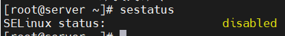​

　　Kysec默认关闭

​​

### 2.配置FTP服务器

#### (1).服务端安装ftp服务，匿名共享/data/ftp/DVD目录

　　安装服务  `yum install vsftpd -y`​

　　修改 `/etc/vsftpd/vsftpd.conf`​ 文件

　　将 `anonymous_enable`​ 修改为 `YES`​

​​

　　修改或添加以下配置

```shell
write_enable=YES
anon_upload_enable=YES
anon_mkdir_write_enable=YES
anon_root=/data/ftp/DVD
chroot_local_user=NO
```

　　创建目录并修改权限

　　​`mkdir -p /data/ftp/DVD`​

　　​`chmod 755 /data/ftp/DVD`​

　　‍

　　开启服务 `systemctl start vsftpd`​

　　设置开启自启 `systemctl enable vsftpd`​

#### (2).在当前目录下创建kylin_ftp文件，并将文件匿名上传至/data/ftp/DVD目录中

　　创建文件 `touch kylin_ftp`​

　　安装ftp 客户端 `yum install ftp -y`​

　　登录ftp `ftp localhost`​

　　上传文件 `ftp> put kylin_ftp`​

　　报错553 暂未解决

　　‍

　　如果登录报错500

　　报错截图

​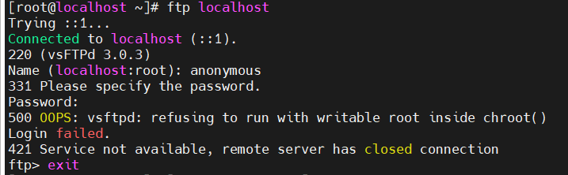​

　　解决方案：

　　主目录修改为755权限

　　拓展学习

　　‍

　　‍

#### （3）SSH服务加固

##### 配置SSH服务，禁止root用户通过SSH登录

　　修改 `/etc/ssh/sshd_config`​ 文件

　　​`PermitRootLogin`​ 改为 `no`​

​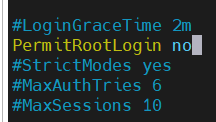​

### （4）通过iscsi协议基于文件方式建立存储

#### 创建2G文件存储

　　安装 `yum install targetcli -y`​

#### 文件存储名称：/root/kylin-iscsi-file

　　创建文件 `dd if=/dev/zero of=/root/kylin-iscsi-file bs=1G count=2`​

#### 共享名称：iqn.2024-04.com.kylin:file

　　英语不好，单词拼错了😭 

```shell
targetcli
/> cd /backstores/fileio
# 创建存储，kylin_file
/backstores/fileio> create kylin_file /root/kylin-iscsi-file
/backstores/fileio> cd /iscsi
# 创建共享，名称iqn.2024-04.com.kyline:file
/iscsi> create iqn.2024-04.com.kyline:file
# 添加存储到共享中
/iscsi> cd /iscsi/iqn.2024-04.com.kyline:file/tpg1/luns
/iscsi/iqn.20...ile/tpg1/luns> create /backstores/fileio/kylin_file
```

#### 该共享允许iqn.2024-04.com.kylin:storage机器挂载访问

```shell
/iscsi/iqn.20...ile/tpg1/luns> cd /iscsi/iqn.2024-04.com.kyline:file/tpg1/acls
# 允许这个机器访问
/iscsi/iqn.20...ile/tpg1/acls> create iqn.2024-04.com.kylin:storage
```

#### firewall防火墙配置，放行相应端口

```shell
firewall-cmd --add-port=3260/tcp --permanent
firewall-cmd --reload
```

　　设置开机自启

```shell
systemctl start target
systemctl enable target
```

### （5）配置时间服务器，要求所有计算机时间同步

#### 配置chrony时间服务器，使网络中的其他计算机向该服务器同步时间

　　安装 `yum install chrony`​

　　修改 `/etc/chrony.conf`​  文件，添加以下内容

```shell
allow 192.168.0.0/16
```

　　启动服务，并设置开机自启

```shell
systemctl start chronyd
systemctl enable chronyd
```

#### firewall防火墙配置，放行相应端口

　　开放端口 `firewall-cmd --add-port 123/udp`​

　　重启防火墙 `firewall-cmd --reload`​ 

## **任务2 文件夹共享**

### （1）在服务端创建/nfsdata目录，在/nfsdata目录下创建kylin01、kylin02文件夹，通过NFS协议共享

　　安装服务 ` yum install nfs-utils rpcbind -y`​

　　创建相关文件夹

```shell
mkdir -p /nfsdata/kylin01
mkdir -p /nfsdata/kylin02
```

### （2）/nfsdata/kylin01共享文件夹只允许客户端以只读权限挂载

### （3）/nfsdata/kylin02 共享文件夹使用匿名用户nfsuser访问，具有读写权限

　　添加 `nfsuser`​ 用户

```shell
useradd nfsuser
# 将文件夹归属用户改为nfsuser 
chown nfsuser:nfsuser /nfsdata/kylin02
# 修改权限 
chmod 777 /nfsdata/kylin02
```

　　查看 `nfsuser`​ 的id

​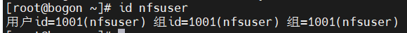​

　　修改 `/etc/exports`​ 文件

```shell
/nfsdata/kylin01 192.168.100.101/32(ro,sync,no_subtree_check)
/nfsdata/kylin02 192.168.100.101/32(rw,sync,no_subtree_check,anonuid=1001,anongid=1001)

为什么必须指定客户端地址才能挂载成功？

rw：读写
sync：表示数据在被确认写入磁盘之前，NFS服务器会响应客户端的写请求。这保证了数据的一致性，但可能会略微降低性能 必须选项？
no_subtree_check： 禁用 subtree checking，这是一个性能优化选项，NFS服务器不会检查每个操作是否跨越了挂载点边界，对于大型或深度目录树结构特别有用 必须选项？
anonuid：用户的uid
anongid：用户的gid
```

　　‍

　　开启服务  ` exportfs -arv`​

​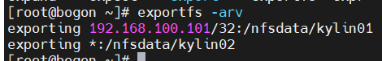​

　　启动服务并设置开机自启

```shell
systemctl start nfs-server
systemctl start rpcbind
systemctl enable nfs-server
systemctl enable rpcbind
```

### （4）firewall防火墙配置，放行相应端口

　　放行相关服务

```shell
firewall-cmd --add-service=nfs --permanent
firewall-cmd --add-service=rpc-bind --permanent
firewall-cmd --reload
```

## **任务3** **Docker容器部署管理**

### 	（1）服务端部署docker容器服务

### 	（2）根据Nginx容器镜像创建容器nginx-01。容器配置如下：

　　容器资源限制

　　CPU:2c

　　Memory:8G

　　‍

　　安装docker服务 `yum install docker`​

​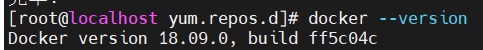​

　　设置开机自启

　　​`systemctl start docker`​

　　​`systemctl enable docker`​

　　拉取镜像 `docker pull nginx`​

　　运行容器  `docker run --name nginx-01 -d --cpus="2" --memory="8g" nginx`​

​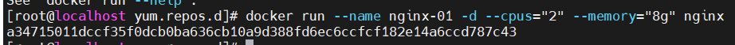​

　　查看状态  `docker ps`​

​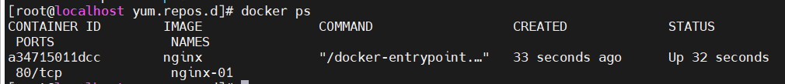​

　　‍

## **任务4 Ansible自动化运维**

### （1） 客户端通过ansible roles工具在服务端部署OpenGauss数据库

　　这题不做了

### （2） 数据库操作具体如下：

#### a) 完成OpenGauss数据库的安装后启动数据库。

#### b) 使用命令登录数据库，使用元命令完成如下操作：

1. 查看数据库系统的数据库列表
2. 列举所有的表、视图和索引
3. 查询表空间

### （3） 创建表空间tbs1,并设定数据文件的存储位置为/opt/openguass/tablespace/tbs1。

### （4） 在表空间tbs1创建数据db1，并切换至数据库db1。

1. 创建行存储表：学生信息表，包括学号，姓名，手机号，班级。
2. 向表内插入一行数据； 20120101,zhangsan,13522223333,2201
3. 查询stu表中数据

　　（5） 拷贝表stu中的数据到文件/guassdb/backup/copy_stu。

　　（6） firewall防火墙配置，放行相应端口

# B. **银河麒麟桌面操作系统任务**

## **任务1** **基础环境配置**

### （1）挂载ISCSI共享磁盘

　　安装 `apt install open-iscsi`​

　　发现目`iscsiadm -m discovery -t sendtargets -p 192.168.100.100:3260`​

　　修改 `/etc/iscsi/initiatorname.iscsi `​ 文件 

​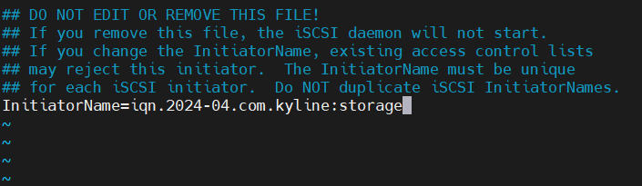​

　　登录目标 `iscsiadm -m node -T iqn.2024-04.com.kylin:file -p 192.168.100.100:3260 -l`​

​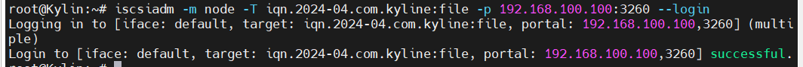​

　　连接不上请检查防火墙，开放端口3260  注意客户端的Kysec

　　以下内容基于Centos/Ubuntu/Kylin进行测试

　　查看登录状态  `iscsiadm -m session -P 3`​

​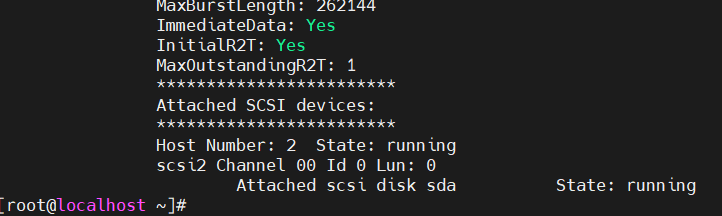​

#### 创建/data/storage目录

　　创建目录 `mkdir -p /data/storage`​

　　创建物理卷 `pvcreate /dev/sda`​ 如果失败，则加上 `-ff`​ 强制执行

#### 创建卷组名称为kylin_vg

　　创建卷组 `vgcreate kylin_vg /dev/sda`​

#### 将文件存储的所有空间容量加入卷组kylin_vg

#### 在卷组kylin_vg上将全部容量分配给逻辑卷，名称为kylin_lv

　　创建逻辑卷 `lvcreate -l +100%FREE -n kylin_lv kylin_vg`​

#### 格式化逻辑卷kylin_lv，文件系统为ext4

　　格式化为ext4  `mkfs.ext4 /dev/kylin_vg/kylin_lv`​

#### 将逻辑卷kylin_lv挂载到/data/storage目录,并要求开机自动挂载

　　挂载 `mount /dev/kylin_vg/kylin_lv /data/storage`​

　　查看逻辑卷ID  `blkid /dev/kylin_vg/kylin_lv`​

​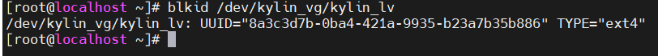​

　　执行 `iscsiadm -m node -T iqn.2024-04.com.kyline:file -p 192.168.100.100:3260 --op update -n node.startup -v automatic`​ 设置开机自启，此命令没有返回值

　　‍

　　修改 `/etc/fstab`​ 文件

　　添加以下内容

```shell
UUID=8a3c3d7b-0ba4-421a-9935-b23a7b35b886 /data/storage ext4 defaults,_netdev 0 0
```

### （2）向服务器同步时间

　　安装 `apt install chrony -y`​

　　修改 `/etc/chrony/chrony.conf`​ 文件

　　添加以下内容

```shell

server 192.168.100.100 iburst
```

　　设置开机自启

　　​`systemctl start chrony
systemctl enable chrony`​

　　‍

　　同步成功

​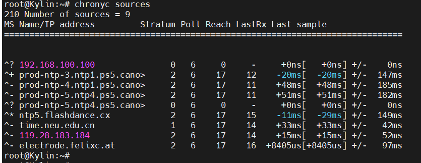​

　　‍

　　**任务2** **文件夹共享**

### 在客户端的/data/目录下创建client01、client02文件夹，通过NFS协议共享，要求如下：

　　安装服务 `apt install nfs-common`​

　　创建相关文件夹

```shell
mkdir -p /data/client01
mkdir -p /data/client02
```

#### /nfsdata/kylin01共享文件夹只允许客户端以只读权限挂载到本机的/data/client01目录，且开机自动挂载

#### /nfsdata/kylin02 共享文件夹使用匿名用户nfsuser访问本机的/data/client02目录，且开机自动挂载

　　修改 `/etc/fstab`​ 文件

```shell
#nfs
192.168.100.100:/nfsdata/kylin01                /data/client01  nfs             defaults        0 0
192.168.100.100:/nfsdata/kylin02                /data/client02  nfs             defaults        0 0
```

　　‍

　　尝试挂载

```shell
mount /data/client01
mount /data/client02
```

### **任务3** **Docker容器部署管理**

　　客户端无需操作

###  **任务4Ansible自动化运维**

#### 客户端部署Ansible软件，并配置Ansible roles角色，通过roles使服务端一键完成mysql数据库的部署

　　部署mysql还是openGauss？

　　‍

　　下面的内容不用看了，没有部署成功

　　‍

　　这题不做了

　　安装服务 `apt install ansible`​

　　‍

　　修改 `/etc/ansible/hosts `​ 文件

　　添加以下内容

```shell
[openGaussdb]
192.168.100.100 ansible_ssh_user=root ansible_ssh_pass=Centos123
```

　　测试连通性 报错

　　​`ansible -i /etc/ansible/hosts openGaussdb -m ping`​

​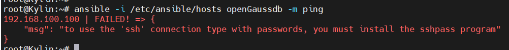​

　　安装服务 `apt install sshpass -y`​

　　这时，再次报错

​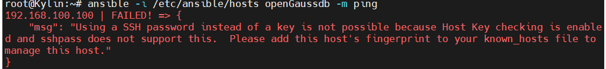​

　　执行 `ssh-keyscan -H 192.168.100.100 >> ~/.ssh/known_hosts`​

​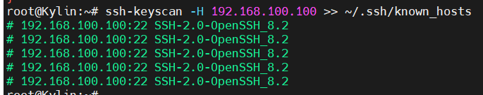​

　　再次测试 `ansible -i /etc/ansible/hosts openGaussdb -m ping`​

​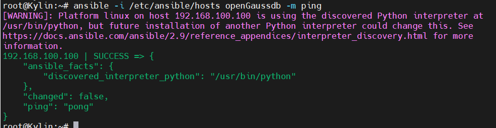​

　　成功

　　‍

　　创建角色 `ansible-galaxy init openGauss`​

　　修改 `openGauss/tasks/main.yml`​ 文件

　　添加以下内容

```shell
- name: Add OpenGauss repository
  apt_repository:
    repo: 'deb [trusted=yes] http://opengauss.org/download/debian {{ ansible_lsb.codename }} main'
    state: present

- name: Install OpenGauss
  apt:
    name: openGauss-server
    state: present

- name: Configure OpenGauss
```

　　‍

　　‍

## openGauss安装

　　测试环境：openEuler22.03    openGauss5.0.2  Centos7  KylinV10-server

　　openGauss下载：[https://opengauss.org/zh/download/](https://opengauss.org/zh/download/)

### 1.安装前准备

#### 1.1 安装流程

　　**安装流程：**

​​

|流程|说明|
| ---------------------| ---------------------------------------------------------------------------------------------------------------------------------------------------------------------------------------------------------|
|安装前准备|openGauss安装前需要准备相应的软硬件环境以及完成相关配置。<br />本文档提供了openGauss安装所需的最低要求，实际安装中，请用户根据实际情况进行规划。<br />更多信息，请参考[安装准备](https://docs-opengauss.osinfra.cn/zh/docs/5.0.0/docs/InstallationGuide/%E5%AE%89%E8%A3%85%E5%87%86%E5%A4%87_%E4%BC%81%E4%B8%9A%E7%89%88.html)。|
|获取并校验安装包|安装包需要在openGauss开源社区下载并且对安装包内容进行检查，详细请参见[获取安装包](https://docs-opengauss.osinfra.cn/zh/docs/5.0.0/docs/InstallationGuide/%E8%8E%B7%E5%8F%96%E5%AE%89%E8%A3%85%E5%8C%85_%E4%BC%81%E4%B8%9A%E7%89%88.html)。|
|配置XML文件|安装openGauss前需要创建XML文件。XML文件包含部署openGauss的服务器信息、安装路径、IP地址以及端口号等。用于告知openGauss如何部署。用户需根据不同场景配置对应的XML文件。<br />关于如何配置XML文件，详细请参见[创建XML配置文件](https://docs-opengauss.osinfra.cn/zh/docs/5.0.0/docs/InstallationGuide/%E5%88%9B%E5%BB%BAXML%E9%85%8D%E7%BD%AE%E6%96%87%E4%BB%B6.html)。|
|上传安装包和XML文件|上传安装包和XML配置文件到待安装的服务器。|
|解压安装包|使用tar命令解压安装包。|
|初始化安装环境|安装环境的初始化包含上传安装包和XML文件、解压安装包、使用gs_preinstall准备好安装环境。<br />关于如何初始化安装环境，详细请参见[初始化安装环境](https://docs-opengauss.osinfra.cn/zh/docs/5.0.0/docs/InstallationGuide/%E5%88%9D%E5%A7%8B%E5%8C%96%E5%AE%89%E8%A3%85%E7%8E%AF%E5%A2%83.html)。|
|执行安装|使用gs_install安装openGauss。<br />关于如何执行安装，详细请参见[执行安装](https://docs-opengauss.osinfra.cn/zh/docs/5.0.0/docs/InstallationGuide/%E6%89%A7%E8%A1%8C%E5%AE%89%E8%A3%85.html)。|
|设置备机可读|可选操作。在开启备机可读之后，备机将支持读操作，并满足数据一致性要求。|

#### 1.2 配置系统环境

　　下载安装包

```shell
wget https://opengauss.obs.cn-south-1.myhuaweicloud.com/5.0.2/arm_2203/openGauss-5.0.2-openEuler-64bit-all.tar.gz
```

　　**设置字符集参数**

　　修改文件 `/etc/profile`​，添加 `export LANG=en_US.UTF‐8`​ 到末尾

```shell
echo "export LANG= en_US.UTF‐8" >> /etc/profile
```

​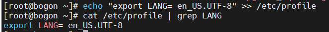​

　　刷新配置文件，使新配置生效

```shell
source /etc/profile
```

　　**修改Python为3.7**

　　之后安装过程中openGauss用户互信，openEuler服务器需要用到Python-3.7.x命令，但是默认Python版本为Python-2.7.x，所以需要切换Python版本。

　　进入/usr/bin目录。

　　​`cd /usr/bin/`​

　　备份python文件

　　​`mv python python.bak `​

　　建立Python3软连接。

　　​`ln -s python3 /usr/bin/python `​

　　Euler默认为python3，版本3.9.9

　　Euler：`ln -s python3 python`​

　　验证Python版本。

　　​`python -V `​

​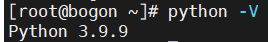​

　　**安装相关服务**

　　​`yum install libaio* -y`​

### 2 安装openGauss

#### 2.1 解压安装包

```shell
mkdir -p /opt/software/opengauss  
chmod 755 /opt/software/opengauss/
mv openGauss-5.0.2-openEuler-64bit-all.tar.gz /opt/software/opengauss
```

#### 2.2**创建XML文件，用于安装数据库**

```shell
vim clusterconfig.xml
```

　　添加以下内容

　　＂opengauss01＂是服务器的主机名，＂192.xxx.x.xx＂为服务器的IP地址（私有），例如：192.168.133.154；其他value值可以不进行修改。

```shell
<?xml version="1.0" encoding="UTF-8"?> 
<ROOT> 
    <CLUSTER> 
        <PARAM name="clusterName" value="dbCluster" /> 
        <PARAM name="nodeNames" value="opengauss01" /> 
        <PARAM name="backIp1s" value="192.168.133.154"/> 
        <PARAM name="gaussdbAppPath" value="/opt/gaussdb/app" /> 
        <PARAM name="gaussdbLogPath" value="/var/log/gaussdb" /> 
        <PARAM name="gaussdbToolPath" value="/opt/huawei/wisequery" /> 
        <PARAM name="corePath" value="/opt/opengauss/corefile"/> 
        <PARAM name="clusterType" value="single-inst"/> 
    </CLUSTER> 
   
    <DEVICELIST> 
  
        <DEVICE sn="1000001"> 
            <PARAM name="name" value="opengauss01"/> 
            <PARAM name="azName" value="AZ1"/> 
            <PARAM name="azPriority" value="1"/> 
            <PARAM name="backIp1" value="192.168.133.154"/> 
            <PARAM name="sshIp1" value="192.168.133.154"/> 
   
	    <!--dbnode--> 
	    <PARAM name="dataNum" value="1"/> 
	    <PARAM name="dataPortBase" value="26000"/> 
	    <PARAM name="dataNode1" value="/gaussdb/data/db1"/> 
        </DEVICE> 
    </DEVICELIST> 
</ROOT>
```

|**参数**|**说明**|
| -----------------| --------------------------------------------------------------------------------------------------------------------------------------------------------------------------------------------------------------------------------------------------------------------------------------------------------------|
|clusterName|openGauss名称。|
|nodeNames|openGauss中主机名称。|
|backIp1s|主机在后端存储网络中的IP地址（内网IP）。所有openGauss主机使用后端存储网络通讯。|
|gaussdbAppPath|openGauss程序安装目录。此目录应满足如下要求：<br />•磁盘空间>1GB。<br />•与数据库所需其它路径相互独立，没有包含关系。|
|gaussdbLogPath|openGauss运行日志和操作日志存储目录。此目录应满足如下要求：<br />•磁盘空间建议根据主机上的数据库节点数规划。数据库节点预留1GB空间的基础上，再适当预留冗余空间。<br />•与openGauss所需其它路径相互独立，没有包含关系。<br />此路径可选。不指定的情况下，openGauss安装时会默认指定＂$GAUSSLOG/安装用户名＂作为日志目录。|
|tmpdbPath|数据库临时文件存放目录。<br />若不配置tmpdbPath，默认存放在/opt/huawei/wisequery/perfadm_db目录下。|
|gaussdbToolPath|openGauss系统工具目录，主要用于存放互信工具等。此目录应满足如下要求：<br />•磁盘空间>100MB。<br />•固定目录，与数据库所需其它目录相互独立，没有包含关系。<br />此目录为可选配置项。不指定的情况下，openGauss安装时会默认指定＂/opt/huawei/wisequery＂作为数据库系统工具目录。|
|corePath|openGauss core文件的指定目录。|

　　须知：

* ＂/opt/huawei/newsql/tools＂存放互信等工具，避免权限问题，不要把实例数据目录放在此目录下。
* 安装目录和数据目录须为空或者不存在，否则可能导致安装失败。
* 在对数据库节点的实例进行具体配置时，需确保配置的目录之间不相互耦合。即各个配置目录不关联，删除其中任意一个目录，不会级联删除其它目录。如gaussdbAppPath为＂/opt/gaussdb/app＂，gaussdbLogPath为＂/opt/gaussdb/app/omm＂。当gaussdbAppPath目录被删除时，会级联删除gaussdbLogPath目录，从而引起其它问题。
* 若需要安装脚本自动创建安装用户时，各配置的目录需保证不与系统创建的默认用户目录耦合关联。
* 配置openGauss路径和实例路径时，路径中不能包含＂|＂,＂;＂,＂&＂,＂$＂,＂<＂,＂>＂,＂`＂,＂\＂,＂'＂,＂\＂,＂{＂,＂}＂,＂(＂,＂)＂,＂[＂,＂]＂,＂~＂,＂*＂,＂?＂特殊字符。

#### 2.3 确保openssl版本正确

　　执行预安装前加载安装包中lib库

　　执行命令如下，其中packagePath为用户安装包放置的路径，本示例中为/opt/software/openGauss。

```shell
cat >>/etc/profile<<END
export packagePath=/opt/software/openGauss
export LD_LIBRARY_PATH=$packagePath/script/gspylib/clib:$LD_LIBRARY_PATH
END
```

　　刷新配置

　　​`source /etc/profile`​

#### 2.4 解压安装包

```shell
cd /opt/software/opengauss/
tar -xzvf openGauss-5.0.2-openEuler-64bit-all.tar.gz
tar -xzvf openGauss-5.0.2-openEuler-64bit-om.tar.gz
```

　　安装包解压后，会在/opt/software/openGauss路径下自动生成script子目录，并且在script目录下生成gs_preinstall等各种OM工具脚本。

```shell
cd script/
ll
```

​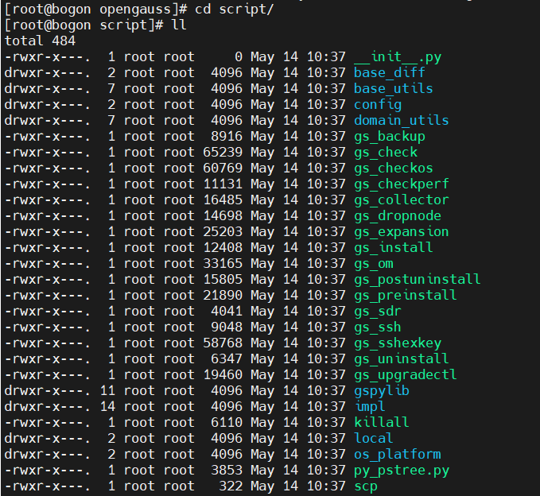​

#### 2.5 交互式安装

```shell
python gs_preinstall -U omm -G dbgrp -X /opt/software/openGauss/clusterconfig.xml
```

　　报错Error: os architecture is x86_64, package architecture is aarch64

　　下载错版本了，根据自己的架构下载openGauss版本，使用`arch`​查询架构

　　提示[GAUSS-50236] : The /opt/software/openGauss/clusterconfig.xml does not exist or the permission on the upper-layer directory is insufficient. 找不到文件

　　检查文件路径 区分大小写

　　报错[GAUSS-51620] : Failed to obtain local instance information. It is not a host name bogon.

　　修改主机名，注意与xml文件的`nodeNames`​字段保持一致，同时与`<DEVICE sn="1000001">`​下的`name`​字段一致

　　报错ImportError: libpython3.6m.so.1.0: cannot open shared object file: No such file or directory

　　缺少 libpython3.6m.so.1.0 库

　　系统中存在ibpython3.7m.so.1.0，创建一个软链接指向3.6即可

　　​`find / -name libpython*m.so.1.0`​

​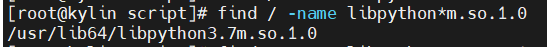​

　　​`ln -s /usr/lib64/libpython3.7m.so.1.0 /usr/lib64/libpython3.6m.so.1.0`​

　　预安装命令执行时卡住，没有输出内容

　　添加 `--unused-third-party`​ 可选项

　　报错Error: os architecture is x86_64, package architecture is

　　麒麟：架构一致，不知道为什么报错

　　假装自己是centos也不行，修改源码，跳过检测

　　修改 `/opt/software/opengauss/script/gspylib/common/CheckPythonVersion.py`​   文件的 `check_os_and_package_arch()`​ 函数

　　在68行附近，注释掉

​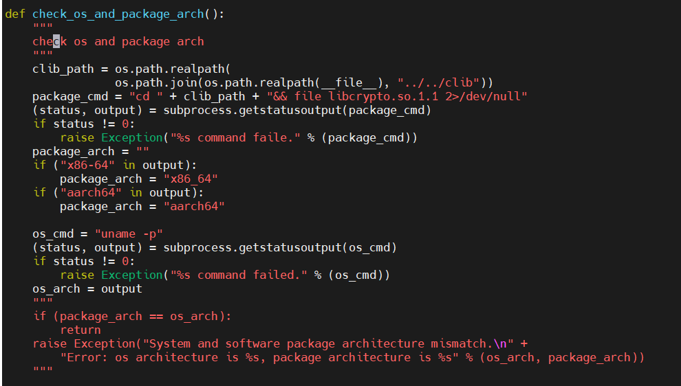​

　　报错ModuleNotFoundError: No module named 'netifaces'

　　缺少该模块，安装即可，其他模块一致处理

　　​`pip3 install netifaces`​

　　报错[GAUSS-50201] : The ['openGauss-5.0.2-openEuler-64bit.tar.bz2', 'openGauss-5.0.2-Kylin-64bit.tar.bz2', 'openGauss-5.0.2-UnionTech-64bit.tar.bz2'] does not exist.

　　返回上级目录

　　修改相关文件名

​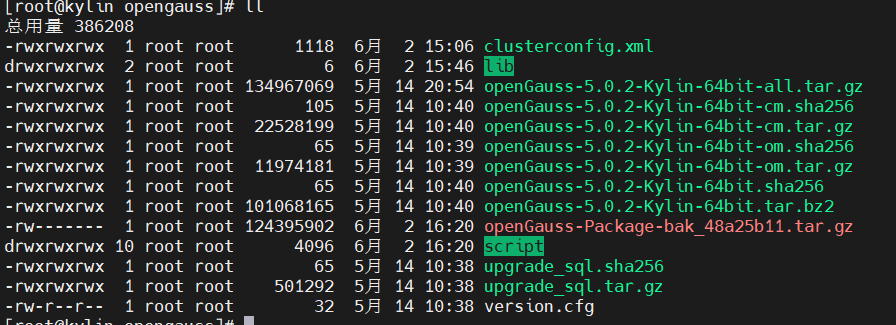​

　　[GAUSS-51103] : Failed to execute the PSSH command [encrypt ...].Error is:./encrypt: error while loading shared libraries: libreadline.so.6: cannot open shared object file: No such file or directory

　　进入`/lib64`​ 目录

​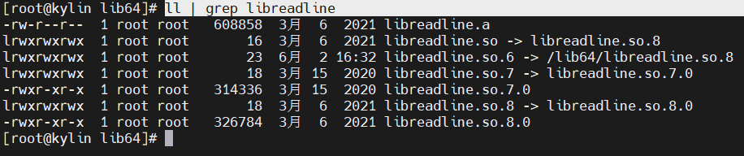​

　　查找相关文件，不存在就创建软链接

　　[GAUSS-52400] : Installation environment does not meet the desired result.  
Please get more details by "/opt/software/opengauss/script/gs_checkos -i A -h kylin --detail".

　　安装环境不满足要求，`/opt/software/opengauss/script/gs_checkos -i A -h kylin --detail`​ 按要求修改

　　‍

　　命令中的omm为操作系统用户（同时omm也是openGauss的数据库管理员账号），dbgrp为运行openGauss的操作系统用户的群组名称，/opt/software/openGauss/clusterconfig.xml为openGauss配置文件路径。

　　在执行过程中，用户根据提示选择是否创建互信，填写 yes。

　　此时会创建操作系统omm用户，并对omm创建trust互信，并要求设置密码，设置为Admin@123（建议用户自定义设置密码）。

​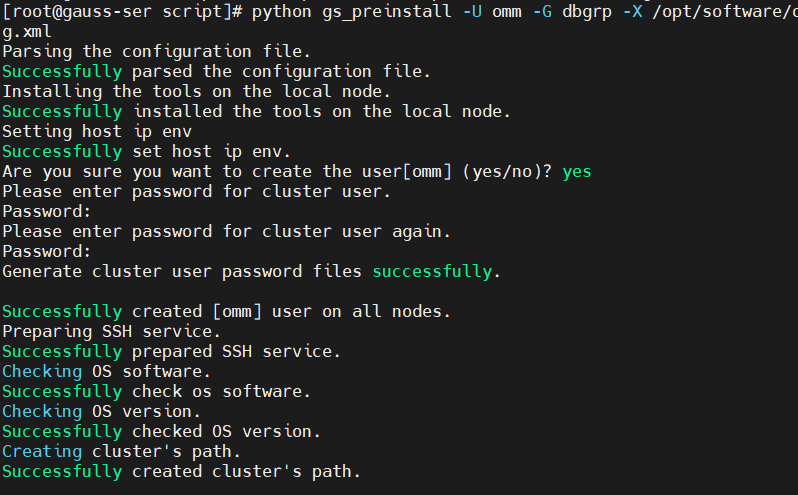​

#### 2.6 开始安装

```shell
chmod -R 755 /opt/software/openGauss/script/
su - omm
```

　　omm指的是前置脚本gs_preinstall中-U参数指定的用户。

　　安装脚本gs_install必须以前置脚本中指定的omm执行，否则，脚本执行会报错。

```shell
gs_install -X /opt/software/openGauss/clusterconfig.xml --gsinit-parameter="--encoding=UTF8"  --dn-guc="max_process_memory=5GB"  --dn-guc="shared_buffers=256MB" --dn-guc="bulk_write_ring_size=256MB" --dn-guc="cstore_buffers=16MB"

```

　　提示gs_install不存在 -bash: gs_install: command not found

　　使用绝对路径 `/opt/software/openGauss/script/gs_install`​

　　提示操作文件时没有权限

　　使用root用户将文件夹改777

　　Exception: [GAUSS-51802] : Failed to obtain the environment variable PGHOST.

　　猜测是主机名，修改成主机名并没有解决问题

​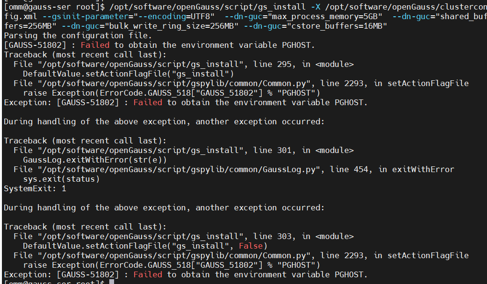​

　　设置监听地址

```shell
export PGHOST=localhost
source ~/.bashc
```

​​

　　修改不生效？

```shell
vi .bashc
```

​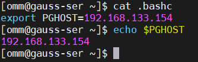​

　　Exception: [GAUSS-50201] : The 192.168.133.154 does not exist. Please check it.

　　欧拉报错，而centos却没有此问题

　　实际上，centos的`PGHOST`​值为`/opt/huawei/wisequery/omm_mppdb`​

　　欧拉执行`export PGHOST=/opt/huawei/wisequery/omm_mppdb`​

　　重新安装报错 `Exception: [GAUSS-50201] : The /opt/huawei/wisequery/omm_mppdb does not exist. Please check it.`​

　　实际中，eluer的/opt目录下没有相关文件夹，猜测是预安装的问题

　　所以这个值是干嘛用的？

　　‍

　　‍

　　‍

　　/opt/software/ openGauss/clusterconfig.xml为openGauss配置文件的路径。在执行过程中，用户需根据提示输入数据库管理员omm用户的密码，密码具有一定的复杂度，为保证用户正常使用该数据库，请记住输入的数据库密码。

　　参数说明如下：

* Encoding：设置字符集；
* max_process_memory：设置一个数据库节点可用的最大物理内存；
* shared_buffers：设置openGauss使用的共享内存大小；
* bulk_write_ring_size：大批量数据写入触发时，该操作使用的环形缓冲区大小；
* cstore_buffers：设置列存所使用的共享缓冲区的大小。
* 按照设置密码要求，设置密码为GaussDB@123（**建议用户自定义设置复杂密码**）

​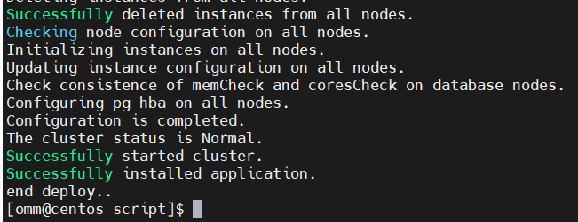​

　　‍

### 3 启动数据库

#### 3.1 查看服务状态

　　​`gs_om -t start`​

　　启动状态

​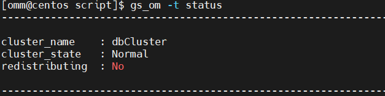​

　　未启动状态

​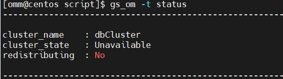​

#### 3.2 启动服务

　　​`gs_om -t start`​ 默认为启动状态

​​

#### 3.3 进入数据库

　　​`gsql -d postgres -p 26000 -r`​

​​

　　‍

　　‍

　　‍
