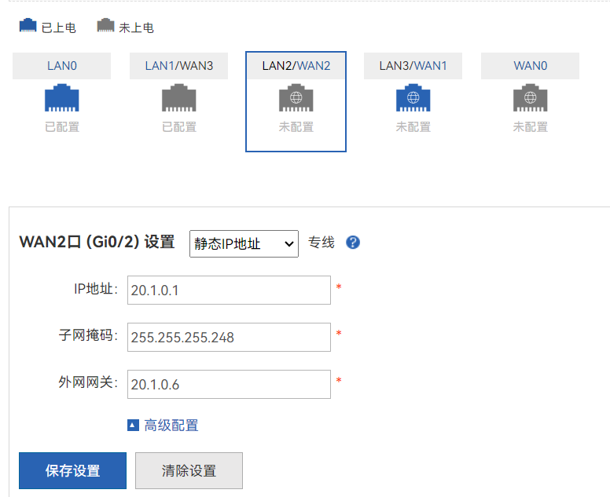
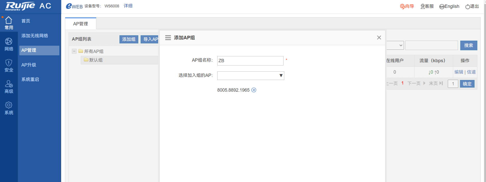
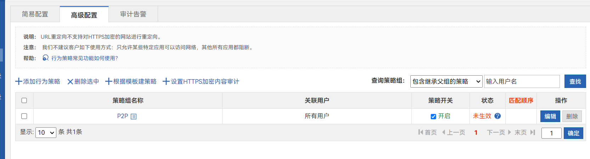
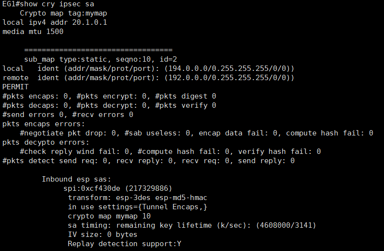

# 24省赛样题1

　　**2024年河北省职业院校技能大赛**

　　**网络系统管理赛项**

　　网络构建

​​

　　目录

　　任务描述	

　　任务清单	

　　（一）基础配置	

　　（二）有线网络配置	

　　（三）无线网络配置	

　　（四）出口网络配置	

　　附录1：拓扑图	

　　附录2：地址规划表	

# **任务描述**

　　CII集团公司业务不断发展壮大，为适应IT行业技术飞速发展，满足公司业务发展需要，集团公司决定建设广州总部、吉林分部的信息化网络。你做为火星公司网络工程师前往CII集团完成网络规划与建设任务。

# **任务清单**

#  **（一）基础配置**

### 1.根据附录1、附录2，配置设备接口信息。

　　S1:

```shell
conf
hos S1
vlan 10
name Yanfa
vlan 20
name Xiaoshou
vlan 30
name Caiwu
vlan 100
name Manage
exi
int ran g1/0/1-4
sw mo ac 
sw ac vlan 10
int ran g1/0/5-8
sw mo ac 
sw ac vlan 20
int ran g1/0/9-12
sw mo ac 
sw ac vlan 30
int vlan 100
ip add 192.1.100.1 255.255.255.0
int ran g1/0/23-24
sw mo tr
sw tr al v only 10,20,30,100

```

　　S2:

```shell
conf
hos S2
vlan 10
name Yanfa
vlan 20
name Xiaoshou
vlan 30
name Caiwu
vlan 100
name Manage
exi
int ran g1/0/1-4
sw mo ac 
sw ac vlan 10
int ran g1/0/5-8
sw mo ac 
sw ac vlan 20
int ran g1/0/9-12
sw mo ac 
sw ac vlan 30
int vlan 100
ip add 192.1.100.2 255.255.255.0
int ran g1/0/23-24
sw mo tr
sw tr al v only 10,20,30,100
```

　　S3:

```shell
conf
hos S3
vlan 10
name Yanfa
vlan 20
name Xiaoshou
vlan 30
name Caiwu
vlan 100
name Manage
exi
int vlan10
ip add 192.1.10.252 255.255.255.0
int vlan20
ip add 192.1.20.252 255.255.255.0
int vlan30
ip add 192.1.30.252 255.255.255.0
int vlan100
ip add 192.1.100.252 255.255.255.0
exi
int gi1/0/24
no sw
ip add 10.1.0.1 255.255.255.252
int lo 0
ip add 11.1.0.33 32
exi
int ran gi1/0/1-2
sw mo tr
sw tr al v on 10,20,30,100
int ran gi1/0/21-22
sw mo tr
sw tr al v on 10,20,30,100
```

　　S4:

```shell
conf
hos S4
vlan 10
name Yanfa
vlan 20
name Xiaoshou
vlan 30
name Caiwu
vlan 100
name Manage
exi
int vlan10
ip add 192.1.10.253 255.255.255.0
int vlan20
ip add 192.1.20.253 255.255.255.0
int vlan30
ip add 192.1.30.253 255.255.255.0
int vlan100
ip add 192.1.100.253 255.255.255.0
exi
int gi1/0/24
no sw
ip add 10.1.0.5 255.255.255.252
int lo 0
ip add 11.1.0.34 32
exi
int ran gi1/0/1-2
sw mo tr
sw tr al v on 10,20,30,100
int ran gi1/0/21-22
sw mo tr
sw tr al v on 10,20,30,100
```

　　S6/7:

　　先配置虚拟化，再配置IP

```shell
int gi1/0/1
no sw 
ip add 10.1.0.2 30
int gi2/0/1
no sw
ip add 10.1.0.6 30
int gi1/0/2
no sw
ip add 10.1.0.9 30
int gi2/0/2
no sw
ip add 10.1.0.13 30
exi
int lo 1
ip add 11.1.0.67 32
```

　　EG1：

　　需要先修改接口属性，然后重启

　　Gi0/0口不做任何配置，路由全网通后再修改IP

​​

​​

​​

​​

　　执行命令 创建loopback1

```shell
conf
int lo 0
ip add 11.1.0.11 32
```

　　EG2:

​​

​​

​​

​​

​​

　　执行命令 创建loopback1

```shell
conf
int lo 0
ip add 11.1.0.12 32
```

　　S5:

```shell
conf
hos S5
vlan 10
name AP
vlan 20
name Caiwu_Wifi
vlan 30
name Yanfa_Wifi
vlan 100
name Manage
int vlan 10
ip add 194.1.10.254 255.255.255.0
int vlan 20
ip add 194.1.20.254 255.255.255.0
int vlan 30
ip add 194.1.30.254 255.255.255.0
int vlan 100
ip add 194.1.100.254 255.255.255.0
exi
int gi1/0/24
no sw
ip add 10.1.0.17 30
int lo 0 
ip add 11.1.0.5 32
exi
int ran gi1/0/1-10
sw mo tr
sw tr al vl on 10,20,30,100
int ran gi1/0/21-22
sw mo tr
sw tr al vl on 10,20,30,100
```

　　AC1配置：

```shell
conf
hos AC1
vlan 100
name Manage
int vlan 100
ip add 194.1.100.251 24
int lo 0 
ip add 11.1.0.204 32
int gi1/0/1
sw mo tr
sw tr al vl on 10,20,30,100
```

　　AC2配置：

```shell
conf
hos AC2
vlan 100
name Manage
int vlan 100
ip add 194.1.100.252 24
int lo 0 
ip add 11.1.0.205 32
int gi1/0/1
sw mo tr
sw tr al vl on 10,20,30,100
```

　　R1配置：

　　因设备原因，s2/3口使用gi0/2-3口代替。1/1-2口使用gi0/0-1口代替

```shell
conf
hos R1
int gi0/0
ip add 20.1.0.6 255.255.255.248
int gi0/1
ip add 20.1.0.14 255.255.255.248
int gi0/2
ip add 12.1.0.1 255.255.255.252
int lo 0
ip add 11.1.0.1 255.255.255.255
```

　　R2配置

```shell
conf
hos R2
int gi0/0
ip add 30.1.0.6 255.255.255.248
int gi0/1
ip add 30.1.0.14 255.255.255.248
int gi0/2
ip add 12.1.0.2 255.255.255.252
int lo 0
ip add 11.1.0.2 255.255.255.255
int gi0/3
ip add 23.1.0.1 255.255.255.252
```

　　R3配置：

```shell
conf
hos R3
int gi0/0
ip add 40.1.0.6 255.255.255.248
int gi0/1
ip add 40.1.0.14 255.255.255.248
int lo 0
ip add 11.1.0.3 255.255.255.255
int gi0/3
ip add 23.1.0.2 255.255.255.252
```

### 2.所有交换机和无线控制器开启SSH服务，用户名密码分别为admin、admin1234；密码为明文类型,特权密码为admin。

　　所有SW与AC执行

```shell
username admin password 0 admin1234
enable password 0 admin
enable service ssh-server
crypto key generate rsa


line vty 0 4
login local 
```

### 3.交换机配置SNMP功能，向主机172.16.0.254发送Trap消息版本采用V2C，读写的Community为“Test”，只读的Community为“public”，开启Trap消息。

　　所有交换机执行

```shell
enable service snmp-agent
snmp-server enable traps
snmp-server community test rw
snmp-server community public ro
snmp-server host 172.16.0.254 version 2c test
snmp-server host 172.16.0.254 version 2c public
```

#  **（二）有线网络配置**

### 1.在全网Trunk链路上做VLAN修剪。

　　trunk链路中只允许指定vlan通过，具体配置请看 接口配置 部分

### 2.为隔离部分终端用户间的二层互访，在交换机S1/S2的Gi0/5-Gi0/16端口启用端口保护。

　　在S1、2执行

```shell
int ran gi1/0/5-16
sw pro
```

### 3.要求在吉林分部接入设备S1/S2进行防环处理。具体要求如下：终端接口开启BPDU防护不能接收 BPDU报文；终端接口下开启 RLDP防止环路，检测到环路后处理方式为 Shutdown-Port；连接终端的所有端口配置为边缘端口；如果端口被 BPDU Guard检测进入 Err-Disabled状态，再过 300 秒后会自动恢复（基于接口部署策略），重新检测是否有环路。

　　S1 2执行

```shell
rldp ena
int ran gi1/0/1-12
spanning-tree bpduguard enable
spanning-tree bpdufilter enable
errdisable recovery interval 300
rldp port loop-detect shutdown-port
```

### 4.在交换机S3、S4上配置DHCP中继，对VLAN10内的用户进行中继，使得本部PC1用户使用DHCP Relay方式获取IP地址。具体要求如下：DHCP服务器搭建于VSU上，地址池命名为Pool_VLAN10，DHCP对外服务使用loopback 0地址；为了防御动态环境局域网伪DHCP服务欺骗，在S1、S2交换机部署DHCP Snooping功能。

　　VSU：

```shell
service dhcp 
ip dhcp pool Pool_VLAN10
network 192.1.10.0 255.255.255.0
default-router 192.1.10.254
```

　　中继要求使用VSU的loopback 0，所以这里要等路由打通之后再做

　　S3 S4:

```shell
service dhcp 
int vlan 10
ip helper-address 11.1.0.67
```

　　S1 S2：

```shell
service dhcp 
ip dhcp snooping
int ran gi1/0/23-24
ip dhcp snooping trust
```

### 5.为了防止伪 IP 源地址攻击， 导致出口路由器会话占满，要求S1交换机部署端口安全，接口Gi0/1只允许PC1通过。

　　S1

```shell
int gi1/0/1
switchport port-security mac-address 6018.952b.6f62
```

### 6.在吉林分部交换机S1、S2、S3、S4上配置MSTP防止二层环路；要求所有数据流经过S4转发，S4失效时经过S3转发。所配置的参数要求如下：region-name为test；revision版本为1；S3作为实例中的从根， S4作为实例中的主根；主根优先级为4096，从根优先级为8192；在S3和S4上配置VRRP，实现主机的网关冗余，所配置的参数要求如表1；S3、S4各VRRP组中高优先级设置为150，低优先级设置为120。

　　表1 S3和S4的VRRP参数表

|**VLAN**|**VRRP备份组号（VRID）**|**VRRP虚拟IP**|
| -------------------| -----| ---------------|
|VLAN10|10|192.1.10.254|
|VLAN20|20|192.1.20.254|
|VLAN30|30|192.1.30.254|
|VLAN100(交换机间)|100|192.1.100.254|

　　S1 S2配置：

```shell
spanning-tree
spanning-tree mst configuration
revision 1
name test
```

　　S3：

```shell
spanning-tree
spanning-tree mst configuration
revision 1
name test
exi
spanning-tree mst 0 pri 8192
int vlan 10
vrrp 10 ip 192.1.10.254
vrrp 10 pri 120
int vlan 30
vrrp 30 ip 192.1.30.254
vrrp 30 pri 120
int vlan 20
vrrp 20 ip 192.1.20.254
vrrp 20 pri 120
int vlan 100
vrrp 100 ip 192.1.100.254
vrrp 100 pri 120
```

　　S4：

```shell
spanning-tree
spanning-tree mst configuration
revision 1
name test
exi
spanning-tree mst 0 pri 4096
int vlan 10
vrrp 10 ip 192.1.10.254
vrrp 10 pri 150
int vlan 30
vrrp 30 ip 192.1.30.254
vrrp 30 pri 150
int vlan 20
vrrp 20 ip 192.1.20.254
vrrp 20 pri 150
int vlan 100
vrrp 100 ip 192.1.100.254
vrrp 100 pri 150

```

　　‍

　　‍

　　‍

### 7.S6和S7间部署虚拟化，其中S7为主，S6为备；规划S6和S7间的Gi0/48端口作为双主机检测链路，配置基于BFD的双主机检；主设备：Domain id：1,switch id:2,priority 150, description: S6000-2;备设备：Domain id：1,switch id:1,priority 120, description: S6000-1。

　　S6：

```shell
conf
switch virtual domain 1  
switch 1
switch 1 priority 120
switch 1 description S6000-1
exit
vsl-port
port-member interface TengigabitEthernet 0/49
port-member interface TengigabitEthernet 0/50
end
wr
switch convert mode virtual
```

　　S7：

```shell
conf
switch virtual domain 1  
switch 2
switch 2 priority 150
switch 2 description S6000-2
exit
vsl-port
port-member interface TengigabitEthernet 0/49
port-member interface TengigabitEthernet 0/50
end
wr
switch convert mode virtual
```

　　VSU：

　　配置BFD

```shell
int gi1/0/48
no sw
int gi2/0/48
no sw
switch virtual domain 1
dual-active detection bfd
dual-active bfd interface gi1/0/48
dual-active bfd interface gi2/0/48
```

### 8.广州总部与吉林分部内网均使用OSPF协议组网，访问互联网均使用默认路由。具体要求如下：总部S5、AC1、AC2、EG1间运行OSPF，进程号为10；吉林分部EG2、S3、S4、S6/S7间运行OSPF，进程号为10； 要求业务网段中不出现协议报文；要求所有路由协议都发布具体网段；为了管理方便，需要发布Loopback地址;优化OSPF相关配置，以尽量加快OSPF收敛；重发布路由进OSPF中使用类型1。

#### 吉林分部

　　VSU：

```shell
router ospf 10
router-id 11.1.0.67
network 10.1.0.2 0.0.0.3 ar 0
network 10.1.0.9 0.0.0.3 ar 0
network 10.1.0.6 0.0.0.3 ar 0
network 10.1.0.13 0.0.0.3 ar 0
network 11.1.0.67 0.0.0.0 ar 0
exi
int ran gi1/0/1-2
ip ospf network point-to-point
int ran gi1/0/2-2
ip ospf network point-to-point
```

　　S3：

```shell
router ospf 10
router-id 11.1.0.33
network 10.1.0.1 0.0.0.3 ar 0
network 11.1.0.33 0.0.0.0 ar 0
network 192.1.10.252 0.0.0.255 ar 0
network 192.1.20.252 0.0.0.255 ar 0
network 192.1.30.252 0.0.0.255 ar 0
network 192.1.100.252 0.0.0.255 ar 0
pass vlan 10
pass vlan 20
pass vlan 30
exi
int gi1/0/24
ip ospf network point-to-point
int vlan 100
ip ospf network point-to-point
```

　　S4:

```shell
router ospf 10
router-id 11.1.0.34
network 10.1.0.5 0.0.0.3 ar 0
network 11.1.0.34 0.0.0.0 ar 0
network 192.1.10.252 0.0.0.255 ar 0
network 192.1.20.252 0.0.0.255 ar 0
network 192.1.30.252 0.0.0.255 ar 0
network 192.1.100.252 0.0.0.255 ar 0
pass vlan 10
pass vlan 20
pass vlan 30
exi
int gi1/0/24
ip ospf network point-to-point
int vlan 100
ip ospf network point-to-point
```

　　EG2:

```shell
router ospf 10
router-id 11.1.0.12
network 10.1.0.10 0.0.0.3 ar 0
network 10.1.0.14 0.0.0.3 ar 0
network 11.1.0.12 0.0.0.0 ar 0
default-information originate always
exi
int gi0/0
ip ospf network point-to-point
int gi0/1
ip ospf network point-to-point
```

#### 广州总部

　　S5：

```shell
router ospf 10
router-id 11.1.0.5
network  10.1.0.17 0.0.0.3 ar 0
network  11.1.0.5 0.0.0.0 ar 0
network  194.1.10.254 0.0.0.255 ar 0
network  194.1.20.254 0.0.0.255 ar 0
network  194.1.30.254 0.0.0.255 ar 0
network  194.1.100.254 0.0.0.255 ar 0
pass vlan 10
pass vlan 20
pass vlan 30
int gi0/24
ip ospf network point-to-multipoint 
```

　　AC1：

```shell
router ospf 10
router-id 11.1.0.204
network  11.1.0.204 0.0.0.0 ar 0
network  194.1.100.251 0.0.0.255 ar 0
int vlan 100
ip ospf network point-to-multipoint 
```

　　AC2：

```shell
router ospf 10
router-id 11.1.0.205
network  11.1.0.205 0.0.0.0 ar 0
network  194.1.100.252 0.0.0.255 ar 0
int vlan 100
ip ospf network point-to-multipoint 
```

　　EG1：

```shell
router ospf 10
router-id 11.1.0.11
network 10.1.0.18 0.0.0.3 ar 0
network 11.1.0.11 0.0.0.0 ar 0
default-information originate always
exi
int gi0/0
ip ospf network point-to-point
```

　　‍

### 9.吉林分部部署IPV6网络实现内网IPV6终端通过无状态自动从网关处获取地址；

　　S3 S4:

```shell
ipv6 un
int vlan 10
ipv6 ena
no ipv6 nd sup
int vlan 20
ipv6 ena
no ipv6 nd sup
int vlan 30
ipv6 ena
no ipv6 nd sup
```

### 10.在S3和S4上配置VRRP for IPv6，实现主机的IPv6网关冗余;VRRP与MSTP的主备状态与IPV4网络一致；IPV6地址规划如下表2：

　　表2 IPV6地址规划表

|设备|接口|IPV6地址|VRRP组号|虚拟IP|
| --------| ---------------------| ---------------------| ---------------------| ---------------------|
|S3|VLAN10|2001:193:10::252/64|10|2001:193:10::254/64|
|VLAN20|2001:193:20::252/64|20|2001:193:20::254/64||
|VLAN30|2001:193:30::252/64|30|2001:193:30::254/64||
|S4|VLAN10|2001:193:10::253/64|10|2001:193:10::254/64|
|VLAN20|2001:193:20::253/64|20|2001:193:20::254/64||
|VLAN30|2001:193:30::253/64|30|2001:193:30::254/64||

　　S3:

```shell
int vlan 10
ipv6 address 2001:193:10::252/64
ipv6 address autoconfig
vrrp 10 ipv6 FE80::310
vrrp 10 ipv6 2001:193:10::254
vrrp ipv6 10 pri 120
int vlan 20
ipv6 address 2001:193:20::252/64
ipv6 address autoconfig
vrrp 20 ipv6 FE80::320
vrrp 20 ipv6 2001:193:20::254
vrrp ipv6 20 pri 120
int vlan 30
ipv6 address 2001:193:30::252/64
ipv6 address autoconfig
vrrp 30 ipv6 FE80::330
vrrp 30 ipv6 2001:193:30::254
vrrp ipv6 30 pri 120
```

　　S4

```shell
int vlan 10
ipv6 address 2001:193:10::253/64
ipv6 address autoconfig
vrrp 10 ipv6 FE80::410
vrrp 10 ipv6 2001:193:10::254
vrrp ipv6 10 pri 150
int vlan 20
ipv6 address 2001:193:20::253/64
ipv6 address autoconfig
vrrp 20 ipv6 FE80::420
vrrp 20 ipv6 2001:193:20::254
vrrp ipv6 20 pri 150
int vlan 30
ipv6 address 2001:193:30::253/64
ipv6 address autoconfig
vrrp 30 ipv6 FE80::430
vrrp 30 ipv6 2001:193:30::254
vrrp ipv6 30 pri 150
```

### 11.由于公司在吉林设有分部。为总部及分部之间互联互通，申请运营商专线业务。针对运营商组网部署要求如下：R1、R2、R3直连接口封装PPP协议，部署IGP中OSPF动态路由进程号为20，实现直连网段互联互通。

　　R1

```shell
router ospf 20
router-id 11.1.0.1
yes
network 20.1.0.6 0.0.0.7 ar 0
network 20.1.0.14 0.0.0.7 ar 0
network 12.1.0.1 0.0.0.3 ar 0
network 11.1.0.1 0.0.0.0 ar 0
exi
int gi0/2
ip ospf network point-to-point 
```

　　R2

```shell
router ospf 20
router-id 11.1.0.2
yes
network 30.1.0.6 0.0.0.7 ar 0
network 30.1.0.14 0.0.0.7 ar 0
network 12.1.0.2 0.0.0.3 ar 0
network 23.1.0.1 0.0.0.3 ar 0
network 11.1.0.2 0.0.0.0 ar 0
exi
int gi0/2
ip ospf network point-to-point 
int gi0/3
ip ospf network point-to-point 
```

　　R3

```shell
router ospf 20
router-id 11.1.0.3
yes
network 40.1.0.6 0.0.0.7 ar 0
network 40.1.0.14 0.0.0.7 ar 0
network 23.1.0.2 0.0.0.3 ar 0
network 11.1.0.3 0.0.0.0 ar 0
exi
int gi0/3
ip ospf network point-to-point 
```

### 12.R1、R2、R3间部署BGP联盟,联盟AS号为100, 使用Loopback接口建立Peer;R1与R2的成员AS号为64512，R3的成员AS号为64523。

　　R3的成员AS这里使用64513替代

　　R1

```shell
router bgp 64512
 bgp confederation identifier 100
 bgp confederation peers 64513
 bgp log-neighbor-changes
 neighbor 11.1.0.2 remote-as 64512
 neighbor 11.1.0.2 update-source Loopback 0
address-family ipv4
  neighbor 11.1.0.2 activate
```

　　R2

```shell
router bgp 64512
 bgp confederation identifier 100
 bgp confederation peers 64513
 bgp log-neighbor-changes
 neighbor 11.1.0.1 remote-as 64512
 neighbor 11.1.0.1 update-source Loopback 0
 neighbor 11.1.0.3 remote-as 64513
 neighbor 11.1.0.3 update-source Loopback 0
address-family ipv4
  neighbor 11.1.0.1 activate
  neighbor 11.1.0.3 activate
```

　　R3

```shell
router bgp 64513
 bgp confederation identifier 100
 bgp confederation peers 64512
 bgp log-neighbor-changes
 neighbor 11.1.0.2 remote-as 64512
 neighbor 11.1.0.2 update-source Loopback 0
address-family ipv4
  neighbor 11.1.0.2 activate
```

　　‍

### 13.运营商R1、R2、R3各自通告EG1、EG2的直连网段到BGP中，以汇总B段静态路由的方式进行发布，当运营商路由器与EG直连链路断开时，可通过其他路由器与EG互通。

　　R1

```shell
router bgp 64512
  network 20.1.0.0 mask 255.255.255.248
  network 20.1.0.8 mask 255.255.255.248
  aggregate-address 20.0.0.0 255.255.0.0

```

　　R2

```shell
router bgp 64512
  network 30.1.0.6 mask 255.255.255.248
  network 30.1.0.14 mask 255.255.255.248
  aggregate-address 30.0.0.0 255.255.0.0
```

　　R3

```shell
router bgp 64513
  network 40.1.0.6 mask 255.255.255.248
  network 40.1.0.14 mask 255.255.255.248
  aggregate-address 40.0.0.0 255.255.0.0
```

### 14.考虑到数据分流及负载均衡的目的，具体要求如下：可通过修改OSPF 路由COST达到分流的目的，且其值必须为5或10；吉林分部有线IPV4用户与互联网互通主路径规划为：S4-S7-EG2;主链路故障时可无缝切换到备用链路上。

　　修改S6/S7的cost

　　VSU

```shell
int ran gi1/0/1-2
ip ospf cost 10
int ran gi2/0/1-2
ip ospf cost 5
```

　　原路径：vlan10下PC用户

​​

　　修改后路径：

​​

#  **（三）无线网络配置**

　　CII集团公司拟投入9.5万元（网络设备采购部分），项目要求重点覆盖楼层、走廊和办公室。平面布局如图1所示。

​​

　　图1 平面布局图

### 1.绘制AP点位图（包括：AP型号、编号、信道等信息，其中信道采用2.4G的1、6、11三个信道进行规划）。

​​

### 2.使用无线地勘软件，输出AP点位图的2.4G频道的信号仿真热图（仿真信号强度要求大于-65db）。

​​

### 3.根据表3无线产品价格表，制定该无线网络工程项目设备的预算表。

　　表3 无线产品价格表

|**产品型号**|**产品特征**|**传输速率（2.4G/最大）**|**推荐/最大带点数**|**功率**|**价格（元）**|
| --------| -------------------| -------------| --------| -------| -------|
|AP1|双频双流|300M/1.167G|32/256|100mw|6000|
|AP2|双频双流|300M/600M|32/256|100mw|11000|
|AP3|单频单流|150M|12/32|60mw|2500|
|线缆1|10米馈线|N/A|N/A|N/A|1600|
|线缆2|15米馈线|N/A|N/A|N/A|2400|
|天线|双频单流/单频单流|N/A|N/A|N/A|500|
|Switch|24口POE交换机|N/A|N/A|240w|15000|
|AC|无线控制器|6*1000M|32/200|40w|50000|

### 4.使用S5作为广州总部无线用户和无线AP的DHCP 服务器。

　　S5

```shell
ip dhcp pool v10 
network 194.1.10.254 255.255.255.0
default-router 194.1.10.254
option 138 ip 11.1.0.204 11.1.0.205
ip dhcp pool v20 
network 194.1.20.254 255.255.255.0
default-router 194.1.20.254
ip dhcp pool v30 
network 194.1.30.254 255.255.255.0
default-router 194.1.30.254
```

### 5.创建财务部内网 SSID 为 test-CW_XX(XX现场提供)，WLAN ID 为1；创建研发部内网 SSID 为 test-YF_XX(XX现场提供)，WLAN ID 为2。

​​

​​

​​

### 6.AP-Group为ZB，内网无线用户关联SSID后可自动获取地址。

　　两台AC都创建组，并把AP全部添加进去

​​

### 7.本部AC1为主用，AC2为备用。AP与AC1、AC2均建立隧道，当AP与AC1失去连接时能无缝切换至AC2并提供服务。

　　AC1

```shell
wlan hot-backup 11.1.0.205
  local-ip 11.1.0.204
  context 10
	priority level 7
	ap-group ZB
  wlan hot-backup enable
```

　　AC2

```shell
wlan hot-backup 11.1.0.204
  local-ip 11.1.0.205
  context 10
	ap-group ZB
  wlan hot-backup enable
```

### 8.研发部用户接入无线网络时需要采用WPA2加密方式，加密密码为XX(现场提供)；

　　两台AC同时配置

​​

### 9.启用白名单校验，仅放通PC2无线终端。

​​

### 10.要求内网无线网络均启用集中转发模式。

​​

### 11.为了保障本部每个用户的无线体验，针对WLAN ID 1下的每个用户的下行平均速率为 800KB/s ，突发速率为1600KB/s。

```shell
wlan-config 1
wlan-based per-user-limit down-streams average-data-rate 800 burst-data-rate 1600
```

### 12.配置AP3最大带点人数为30人。

```shell
ap-config AP3
sta-limit 30
```

### 13.通过时间调度，要求每周一至周五的21:00至23:30期间关闭研发部无线服务。

​​

### 14.设置AP2最小接入信号强度为-65dBm。

```shell
ap-config AP2
response-rssi 65 radio 1
```

### 15.关闭低速率（11b/g 1M、2M、5M，11a 6M、9M）应用接入。

```shell
ac-controller 
802.11g network rate 1 disabled 
802.11g network rate 2 disabled 
802.11g network rate 5 disabled 
802.11b network rate 1 disabled 
802.11b network rate 2 disabled 
802.11b network rate 5 disabled 
802.11a network rate 6 disabled 
802.11a network rate 9 disabled 
```

#  **（四）出口网络配置**

　　因题目未详细说明，这里假设20.x为联通，30.x为电信，40.x为教育网

### 1.出口网关及出口路由器上进行NAT配置实现总部与分部的所有用户(ACL 110)均可访问互联网，通过NAPT方式将内网用户IP地址转换到互联网接口上。

　　EG1

```shell
ip access-list extended 110
 10 deny ip 194.0.0.0 0.255.255.255 192.0.0.0 0.255.255.255 
 20 permit ip 194.0.0.0 0.255.255.255 any 
ip nat inside source list 110 interface GigabitEthernet 0/2 overload
```

　　EG2

```shell
ip access-list extended 110
 10 deny ip 192.0.0.0 0.255.255.255 194.0.0.0 0.255.255.255 
 20 permit ip 192.0.0.0 0.255.255.255 any 
ip nat inside source list 110 interface GigabitEthernet 0/2 overload
```

### 2.广州总部EG1针对访问外网WEB流量限速每IP 1000Kbps，内网WEB总流量不超过50Mbps（策略名称WEB）。

​​

​​

​​

​​

### 3.广州总部EG1基于网站访问、邮件收发、IM聊天、论坛发帖、搜索引擎多应用启用审计功能。

​​

### 4.广州总部EG1周一到周五工作时间09：00-17:00（命名为work）阻断并审计P2P应用软件使用（策略名称P2P）。

​​

​​

​​

​​

​​

### 5.为了实现总部与分部互访数据的安全性，要求使用IPSec对总部到分部的数据流进行加密ACL（编号为101）。为此规划如下：要求使用动态隧道主模式，预共享密码为 test，加密认证方式为 ESP-3DES、ESP-MD5-HMAC，DH使用组2;总分机构间数据通信及加密通过运营商R1联通节点作为中转设备；总部无线IPV4用户与分部IPV4用户互通主路径规划为：AC1-S5-EG1-EG2-S7-S4-S1/S2(EG1/EG2间运行VPN隧道)。

　　EG1

```shell
ip access-list extended 101
permit ip 194.0.0.0 0.255.255.255 192.0.0.0 0.255.255.255 
exi
crypto isakmp policy 1
 encryption 3des
 authentication pre-share
 hash md5
 group 2
exi
crypto isakmp key 0 test address 20.1.0.9
crypto ipsec transform-set myset esp-3des esp-md5-hmac
exi
crypto map mymap 10 ipsec-isakmp
 set peer 20.1.0.9 
 set transform-set myset
 match address 101
 set autoup
exi
int gi0/2
crypto map mymap

// 添加一条静态路由，指向EG2。并引进OSPF
ip route 192.0.0.0 255.0.0.0 20.1.0.6
router ospf 10
redistribute static metric-type 1
```

　　EG2

```shell
ip access-list extended 101
permit ip 192.0.0.0 0.255.255.255 194.0.0.0 0.255.255.255 
exi
crypto isakmp policy 1
 encryption 3des
 authentication pre-share
 hash md5
 group 2
exi
crypto isakmp key 0 test address 20.1.0.1
crypto ipsec transform-set myset esp-3des esp-md5-hmac
exi
crypto map mymap 10 ipsec-isakmp
 set peer 20.1.0.1  
 set transform-set myset
 set autoup
 match address 101
exi
int gi0/2
crypto map mymap

// 添加一条静态路由，指向EG1。并引进OSPF
ip route 194.0.0.0 255.0.0.0 20.1.0.14
router ospf 10
redistribute static metric-type 1
```

　　隧道建立成功

​​

​​

### 6.本部与分部用户数据流匹配EG内置联通、电信与教育地址库，实现访问联通资源走联通线路，访问电信资源走电信线路，访问教育网资源走教育网线路。

　　配置接口IP时，选择一下运营商即可。

​​

　　系统会默认生成

​​

### 7.除联通、电信、教育资源之外默认所有数据流在三条线路间进行负载转发。

​​

# **附录1：拓扑图**

​​

# **附录2：地址规划表**

|设备|接口或VLAN|VLAN名称|二层或三层规划|说明|
| -------------| ------------| ------------------| ------------------| --------|
|S1|VLAN10|Yanfa|Gi0/1至Gi0/4|研发部|
|VLAN20|Xiaoshou|Gi0/5至Gi0/8|销售部||
|VLAN30|Caiwu|Gi0/9至Gi0/12|财务部||
|Vlan100|Manage|192.1.100.1/24|管理与互联VLAN||
|S2|VLAN10|Yanfa|Gi0/1至Gi0/4|研发部|
|VLAN20|Xiaoshou|Gi0/5至Gi0/8|销售部||
|VLAN30|Caiwu|Gi0/9至Gi0/12|财务部||
|Vlan100|Manage|192.1.100.2/24|管理与互联VLAN||
|S3|VLAN10|Yanfa|192.1.10.252/24|研发部|
|VLAN20|Xiaoshou|192.1.20.252/24|销售部||
|VLAN30|Caiwu|192.1.30.252/24|财务部||
|Vlan100|Manage|192.1.100.252/24|管理与互联VLAN||
|Gi0/24||10.1.0.1/30|　||
|LoopBack 0|　|11.1.0.33/32|||
|S4|VLAN10|Yanfa|192.1.10.253/24|研发部|
|VLAN20|Xiaoshou|192.1.20.253/24|销售部||
|VLAN30|Caiwu|192.1.30.253/24|财务部||
|Vlan100|Manage|192.1.100.253/24|管理与互联VLAN||
|Gi0/24||10.1.0.5/30|　||
|LoopBack 0|　|11.1.0.34/32|||
|S6/S7|Gi1/0/1||10.1.0.2/30||
|Gi2/0/1||10.1.0.6/30|||
|Gi1/0/2||10.1.0.9/30|||
|Gi2/0/2||10.1.0.13/30|||
|LoopBack 0|　|11.1.0.67/32|||
|EG1|Gi0/0||10.1.0.18/30||
|Gi0/2||20.1.0.1/29|||
|Gi0/3||30.1.0.1/29|||
|Gi0/4||40.1.0.1/29|||
|LoopBack 0|　|11.1.0.11/32|||
|EG2|Gi0/0||10.1.0.10/30||
|Gi0/1||10.1.0.14/30|||
|Gi0/2||20.1.0.9/29|||
|Gi0/3||30.1.0.9/29|||
|Gi0/4||40.1.0.9/29|||
|LoopBack 0|　|11.1.0.12/32|||
|S5|VLAN10|AP|194.1.10.254/24||
|Gi0/1至Gi10|||||
|VLAN20|Caiwu_Wifi|194.1.20.254/24|||
|VLAN30|Yanfa_Wifi|194.1.30.254/24|||
|Vlan100|Manage|194.1.100.254/24|||
|Gi0/24||10.1.0.17/30|||
|LoopBack 0|　|11.1.0.5/32|||
|AC1|Vlan100|Manage|194.1.100.251/24||
|LoopBack 0|　|11.1.0.204/32|||
|AC2|Vlan100|Manage|194.1.100.252/24||
|LoopBack 0|　|11.1.0.205/32|||
|R1|Gi0/0||20.1.0.6/29||
|Gi0/1||20.1.0.14/29|||
|Se2/0||12.1.0.1/30|||
|Loopback0||11.1.0.1/32|||
|R2|Gi0/0||30.1.0.6/29||
|Gi0/1||30.1.0.14/29|||
|Se2/0||12.1.0.2/30|||
|Se3/0||23.1.0.1/30|||
|Loopback0||11.1.0.2/32|||
|R3|Gi0/0||40.1.0.6/29||
|Gi0/1||40.1.0.14/29|||
|Se3/0||23.1.0.2/30|||
|Loopback0||11.1.0.3/32|||

# 全部配置文件

## EG1

```shell

Building configuration...
Current configuration: 18622 bytes

version EG_RGOS 11.9(6)B17P1, Release(10201701)
hostname EG1
!
ap-group default
!
ap-config all
 no 11axsupport enable radio 1
 no 11axsupport enable radio 2
 no 11axsupport enable radio 3
 no 11axsupport enable radio 4
 no 11axsupport enable radio 5
 no 11axsupport enable radio 6
 no 11axsupport enable radio 7
 no 11axsupport enable radio 8
 no 11axsupport enable radio 9
 no 11axsupport enable radio 10
 no 11axsupport enable radio 11
 no 11axsupport enable radio 12
 no 11axsupport enable radio 13
 no 11axsupport enable radio 14
 no 11axsupport enable radio 15
 no 11axsupport enable radio 16
 no 11axsupport enable radio 17
 no 11axsupport enable radio 18
 no 11axsupport enable radio 19
 no 11axsupport enable radio 20
 no 11axsupport enable radio 21
 no 11axsupport enable radio 22
 no 11axsupport enable radio 23
 no 11axsupport enable radio 24
 no 11axsupport enable radio 25
 no 11axsupport enable radio 26
 no 11axsupport enable radio 27
 no 11axsupport enable radio 28
 no 11axsupport enable radio 29
 no 11axsupport enable radio 30
 no 11axsupport enable radio 31
 no 11axsupport enable radio 32
 no 11axsupport enable radio 33
 no 11axsupport enable radio 34
 no 11axsupport enable radio 35
 no 11axsupport enable radio 36
 no 11axsupport enable radio 37
 no 11axsupport enable radio 38
 no 11axsupport enable radio 39
 no 11axsupport enable radio 40
 no 11axsupport enable radio 41
 no 11axsupport enable radio 42
 no 11axsupport enable radio 43
 no 11axsupport enable radio 44
 no 11axsupport enable radio 45
 no 11axsupport enable radio 46
 no 11axsupport enable radio 47
 no 11axsupport enable radio 48
 no 11axsupport enable radio 49
 no 11axsupport enable radio 50
 no 11axsupport enable radio 51
 no 11axsupport enable radio 52
 no 11axsupport enable radio 53
 no 11axsupport enable radio 54
 no 11axsupport enable radio 55
 no 11axsupport enable radio 56
 no 11axsupport enable radio 57
 no 11axsupport enable radio 58
 no 11axsupport enable radio 59
 no 11axsupport enable radio 60
 no 11axsupport enable radio 61
 no 11axsupport enable radio 62
 no 11axsupport enable radio 63
 no 11axsupport enable radio 64
 no 11axsupport enable radio 65
 no 11axsupport enable radio 66
 no 11axsupport enable radio 67
 no 11axsupport enable radio 68
 no 11axsupport enable radio 69
 no 11axsupport enable radio 70
 no 11axsupport enable radio 71
 no 11axsupport enable radio 72
 no 11axsupport enable radio 73
 no 11axsupport enable radio 74
 no 11axsupport enable radio 75
 no 11axsupport enable radio 76
 no 11axsupport enable radio 77
 no 11axsupport enable radio 78
 no 11axsupport enable radio 79
 no 11axsupport enable radio 80
 no 11axsupport enable radio 81
 no 11axsupport enable radio 82
 no 11axsupport enable radio 83
 no 11axsupport enable radio 84
 no 11axsupport enable radio 85
 no 11axsupport enable radio 86
 no 11axsupport enable radio 87
 no 11axsupport enable radio 88
 no 11axsupport enable radio 89
 no 11axsupport enable radio 90
 no 11axsupport enable radio 91
 no 11axsupport enable radio 92
 no 11axsupport enable radio 93
 no 11axsupport enable radio 94
 no 11axsupport enable radio 95
 no 11axsupport enable radio 96
!
ac-controller
 ac-control disable
 country CN
 802.11g network rate 1 disabled
 802.11g network rate 2 disabled
 802.11g network rate 5 disabled
 802.11g network rate 6 supported
 802.11g network rate 9 supported
 802.11g network rate 11 mandatory
 802.11g network rate 12 supported
 802.11g network rate 18 supported
 802.11g network rate 24 supported
 802.11g network rate 36 supported
 802.11g network rate 48 supported
 802.11g network rate 54 supported
 802.11b network rate 1 disabled
 802.11b network rate 2 disabled
 802.11b network rate 5 disabled
 802.11b network rate 11 mandatory
 802.11a network rate 6 mandatory
 802.11a network rate 9 supported
 802.11a network rate 12 mandatory
 802.11a network rate 18 supported
 802.11a network rate 24 mandatory
 802.11a network rate 36 supported
 802.11a network rate 48 supported
 802.11a network rate 54 supported
!
app-auth offline-detect
!
app-auth cfg-opt id-mac
app-auth cfg-opt syn-proxy
app-auth cfg-opt tup-pass
!
app-auth set-mode business
!
app-auth local-auth subscriber mac-limit 0
!
app-auth wx-state direct
ip session filter 0
flow-pre-mgr enable
flow-pre-mgr protocol-enable
!
flow-pre-mgr upload-pps-limit 0
!
flow-pre-mgr new-session-limit start-up limit 0
flow-pre-mgr new-session-limit virtual-host limit 0
flow-pre-mgr new-session-limit real-host limit 0
!
flow-pre-mgr total-limit 0
flow-pre-mgr 1 subscriber any action trust total-limit 0 per-ip-limit 2000
!
local-account cloud data interval 0
local-account cloud log interval 0
!
convert port 1 to lan
convert port 2 to wan
!
ip access-list standard 1
 10 permit any 
!
ip access-list extended 101
 10 permit ip 194.0.0.0 0.255.255.255 192.0.0.0 0.255.255.255 
!
ip access-list extended 110
 10 deny ip 194.0.0.0 0.255.255.255 192.0.0.0 0.255.255.255 
 20 permit ip 194.0.0.0 0.255.255.255 any 
!
ip access-list extended 2397
 10 deny ospf any any 
 20 deny 112 any any 
 30 deny icmp any any 
 40 deny udp any eq domain any 
 50 deny tcp any any eq www 
 60 deny tcp any any eq 443 
 1000 permit ip any any 
 list-remark ±???9????
!
servctl service apm off
servctl service police_log off
servctl service rlog off
servctl service was off
servctl service rarely-used on
servctl service sslvpn off
sntp interval 7200
sntp server ntp.ntsc.ac.cn
sntp server ntp1.aliyun.com
sntp enable
wids
!       
ip ref load-sharing original-only
ip tcp keepalive
!
time-range any
 periodic Daily 0:00 to 23:59 
!
time-range day_time
 periodic Daily 6:00 to 18:00 
!
time-range night_time
 periodic Weekdays 0:00 to 5:59 
 periodic Daily 18:01 to 23:59 
!
time-range unwork_time
 periodic Weekdays 0:00 to 7:59 
 periodic Weekdays 12:00 to 13:00 
 periodic Weekdays 18:01 to 23:59 
!
time-range weekend
 periodic Weekend 0:00 to 23:59 
!
time-range work
 periodic Weekdays 9:00 to 17:00 
!       
time-range work_time
 periodic Weekdays 8:00 to 12:00 
 periodic Weekdays 13:00 to 18:00 
!
time-range working_time
 periodic Weekdays 0:00 to 23:59 
!
route-auto-choose cernet GigabitEthernet 0/4 40.1.0.6
route-auto-choose cnc GigabitEthernet 0/2 20.1.0.6
route-auto-choose cnii GigabitEthernet 0/3 30.1.0.6
!
identify-application templete tpl-college
identify-application enable
!
identify-application custom-group ???????~route
 app-add WEB??
 app-add ???WEB??
 app-add ??PC
 app-add HTTPθ????
 app-add HTTP??
 app-add WEB?Ф
 app-add ??θ?WEB
 app-add ??θ??C
 app-add ?????? 
 app-add ????°???
 app-add ???
 app-add ????????
 app-add ??jθτ?????
 app-add ???????
 app-add ?????_MOBILE
 app-add ???_MOBILE
 app-add WEB_MOBILE
 app-add ??_MOBILE
!
identify-application custom-group ???????~route
 app-add ????????
 app-add P2P?????
!
identify-application custom-group ???????~route
 app-add HTTP??
 app-add ??|??_MOBILE
!
identify-application custom-group ??????~route
 app-add HTTP??
 app-add HTTP???
 app-add ????
 app-add θ???
 app-add θ?_MOBILE
!
identify-application custom-group ???????~route
 app-add ??θ?
 app-add θ?θ?
 app-add ??
!
identify-application custom-group QQθ°??¨Р????~route
 app-add ??j?Р?
 app-add ??j????
!
identify-application key DNS
identify-application key ????????
identify-application key IPθ??绰
identify-application key ?????Э?
identify-application key ICMP-DETAIL
identify-application key VPN??
identify-application key °?OA
identify-application key ????
identify-application key ?????_MOBILE
identify-application web-group HTTPЭ?
identify-application web-group ??θ??C
identify-application web-group HTTPS
identify-application online-video-group HTTP??
identify-application online-video-group ??|??_MOBILE
identify-application p2p-video-group ????????
identify-application download-group HTTP??
identify-application download-group FTP
identify-application download-group ??
identify-application download-group TFTP
identify-application download-group NNTP
identify-application download-group IXIA
identify-application download-group SVN
identify-application download-group SMB
identify-application download-group θ???
identify-application download-group θ?_MOBILE
identify-application p2p-group P2P?????
identify-application p2p-group ????
identify-application update-group ???
identify-application update-group θ°???????
identify-application upload-group HTTP???
identify-application inhibitive ??TCP
identify-application inhibitive ??UDP
identify-application inhibitive TCP?????
identify-application inhibitive UDP?????
identify-application inhibitive TCP??????
identify-application inhibitive UDP??????
identify-application inhibitive θ??????
identify-application block ??¨DNS
identify-application other ??±???
identify-application other ??jθτ?????
identify-application other θ?????
identify-application other ??Э?
identify-application other ???
identify-application other ???????
identify-application other ??_MOBILE
identify-application other θ??_MOBILE
identify-application other ???_MOBILE
identify-application other RFC
identify-application other IP-RAW
identify-application other IPЭ??
app-proxy expect enable
no ssl-audit mode
!
https-audit enable
anti-pap set-node 0
url-filter-notice display ?±?????????????j?θ??????
no url-audit exact-filter
no url-rule apply-referer
!
url-class un_audit_class
 comment unaudit
!       
url-object un_audit_object
 class ??????
 class ???δ? 
 class un_audit_class
!
content-policy _AUDIT_DEFAULT
 mail-rule audit-default-enable
 im-rule audit-default-enable
 web-bbs-rule audit-default-enable
 web-search-rule audit-default-enable
 web-mail-rule audit-default-enable
 url-rule audit-default-enable
!
content-policy P2P
 app-rule 1 time-range work app-group P2P????? action deny audit comment P2P-app-1713874673135
!
content-policy _TOP_PRIORITY
 url-rule 997 url-object un_audit_object time-range any action permit comment ?????ō
!
content-policy-relate relate auth-subscriber any policy _TOP_PRIORITY
content-policy-relate relate subscriber any policy _TOP_PRIORITY
content-policy-relate relate subscriber any policy P2P
content-policy-relate relate subscriber any policy _AUDIT_DEFAULT
!       
no cwmp
!
dev-audit enable
ip dhcp client-address auto-renew event interface-updown
service dhcp
ip dhcp database
!
ip name-server 114.114.114.114
!
dns-proxy
!
mail-service enable
feedback frequency 60
flow-audit enable
flow-audit intf-rt refresh 1
flow-audit intf-rt storage 10 max
!
crypto isakmp policy 1
 encryption 3des
 authentication pre-share
 hash md5
 group 2
!
crypto isakmp key 7 06123b103b address 20.1.0.9 
crypto ipsec transform-set myset esp-3des esp-md5-hmac
!
crypto map mymap 10 ipsec-isakmp
 set peer 20.1.0.9  
 set transform-set myset
 set autoup
 match address 101
!
layer23 classify enable
!
layer23 scc-attention enable
!
network-group name "Out_Server" parent "/"
!
no line-quality enable
!
mllb enable
!
sys-mode gateway
!
specify interface GigabitEthernet 0/1 lan
specify interface GigabitEthernet 0/2 wan
specify interface GigabitEthernet 0/3 wan
!       
no nat-log enable
no ip nat-log on
password policy strong
no service password-encryption
!
ip http port 80
ip http secure-port 4430
enable service web-server all
enable service web-server http
enable service web-server https
no rnfp-ping-reply enable
!
control-plane
 ef-rnfp enable
 security deny wan-telnet
 security deny wan-ssh
!
control-plane protocol
 scpp list 2397 bw-rate 3600 bw-burst-rate 3600
 no acpp
!
control-plane manage
 port-filter 
 arp-car 20 log
 scpp list 2397 bw-rate 3600 bw-burst-rate 3600
 no acpp
!
control-plane data
 no glean-car
 scpp list 2397 bw-rate 3600 bw-burst-rate 3600
 no acpp
!
ip ssh key-exchange dh_group_exchange_sha1 dh_group14_sha1 dh_group1_sha1 ecdh_sha2_nistp256 ecdh_sha2_nistp384 ecdh_sha2_nistp521
ip ssh cipher-mode ctr
ip ssh hmac-algorithm md5-96 md5 sha1-96 sha1 sha2-256 sha2-512
ip ssh version 2
sftp-client speed 0
logging filter rule exact-match module LOGIN mnemonic LOGIN_FAIL level 5
logging userinfo command-log
logging buffered 65535
logging file flash:syslog/syslog 
clock timezone UTC +8 0
!
vpdn limit_rate 15
!
link-check disable
!
web quick-set
macc start-set
webmaster username admin password 7 13041647042f43797f
frn
!
flow-control Gi0/4
 comment tpl-college
 !
 channel-tree inbound
  no auto-pir enable
  !
  channel-group root parent null cir 1000000 pir 1000000 pri 4 per-net per-pir 2000 limit 100 
  channel-group key parent root cir 800000 pir 1000000 pri 3 per-net per-pir 5000 limit 100 
  channel-group default parent root pir 1000000 pri 3 per-net per-pir 10000 limit 100 
  channel-default default
 !
 channel-tree outbound
  auto-pir enable root-rate 92 pernet-mode 
  !
  channel-group root parent null cir 1000000 pir 1000000 pri 4 per-net per-cir 25 per-pir 2000 limit 100 
  channel-group key parent root cir 800000 pir 1000000 pri 3 per-net per-cir 25 per-pir 5000 limit 100 
  channel-group default parent root pir 1000000 pri 3 per-net per-cir 25 per-pir 10000 limit 100 
  channel-default default
 !
 flow-rule 999 time-range any 
 flow-rule 999 action pass in-channel default out-channel default comment Match_ALL_NON_VPN
 flow-rule 998 subscriber VIP time-range any 
 flow-rule 998 action pass in-channel key out-channel key comment Match_VIP_Group_of_NON_VPN
 flow-rule 997 network-group Out_Server time-range any 
 flow-rule 997 action pass in-channel key out-channel key comment Match_Out_Server_of_NON_VPN
!
flow-control Gi0/2
 comment tpl-college
 !
 channel-tree inbound
  no auto-pir enable
  !
  channel-group root parent null cir 1000000 pir 1000000 pri 4 per-net per-pir 2000 limit 100 
  channel-group key parent root cir 800000 pir 1000000 pri 3 per-net per-pir 5000 limit 100 
  channel-group default parent root pir 1000000 pri 3 per-net per-pir 10000 limit 100 
  channel-group WEB parent root pir 51200 pri 4 per-net per-pir 1000 limit 100 
  channel-default default
 !
 channel-tree outbound
  auto-pir enable root-rate 92 pernet-mode 
  !
  channel-group root parent null cir 1000000 pir 1000000 pri 4 per-net per-cir 25 per-pir 2000 limit 100 
  channel-group key parent root cir 800000 pir 1000000 pri 3 per-net per-cir 25 per-pir 5000 limit 100 
  channel-group default parent root pir 1000000 pri 3 per-net per-cir 25 per-pir 10000 limit 100 
  channel-group WEB parent root pir 51200 pri 4 per-net limit 100 
  channel-default default
 !
 flow-rule 999 time-range any 
 flow-rule 999 action pass in-channel default out-channel default comment Match_ALL_NON_VPN
 flow-rule 998 subscriber VIP time-range any 
 flow-rule 998 action pass in-channel key out-channel key comment Match_VIP_Group_of_NON_VPN
 flow-rule 997 network-group Out_Server time-range any 
 flow-rule 997 action pass in-channel key out-channel key comment Match_Out_Server_of_NON_VPN
 flow-rule 1 app-group HTTPЭ? time-range any 
 flow-rule 1 action pass in-channel WEB out-channel WEB comment WEB
!
flow-control Gi0/3
 comment tpl-college
 !
 channel-tree inbound
  no auto-pir enable
  !
  channel-group root parent null cir 1000000 pir 1000000 pri 4 per-net per-pir 2000 limit 100 
  channel-group key parent root cir 800000 pir 1000000 pri 3 per-net per-pir 5000 limit 100 
  channel-group default parent root pir 1000000 pri 3 per-net per-pir 10000 limit 100 
  channel-default default
 !
 channel-tree outbound
  auto-pir enable root-rate 92 pernet-mode 
  !
  channel-group root parent null cir 1000000 pir 1000000 pri 4 per-net per-cir 25 per-pir 2000 limit 100 
  channel-group key parent root cir 800000 pir 1000000 pri 3 per-net per-cir 25 per-pir 5000 limit 100 
  channel-group default parent root pir 1000000 pri 3 per-net per-cir 25 per-pir 10000 limit 100 
  channel-default default
 !
 flow-rule 999 time-range any 
 flow-rule 999 action pass in-channel default out-channel default comment Match_ALL_NON_VPN
 flow-rule 998 subscriber VIP time-range any 
 flow-rule 998 action pass in-channel key out-channel key comment Match_VIP_Group_of_NON_VPN
 flow-rule 997 network-group Out_Server time-range any 
 flow-rule 997 action pass in-channel key out-channel key comment Match_Out_Server_of_NON_VPN
!
interface GigabitEthernet 0/0
 ip address 10.1.0.18 255.255.255.252
 ip ospf network point-to-point
 ip nat inside
!
interface GigabitEthernet 0/1
!
interface GigabitEthernet 0/2
 bandwidth 1000000
 nexthop 20.1.0.6
 reverse-path
 ip address 20.1.0.1 255.255.255.248
 crypto map mymap
 ip nat outside
 flow-policy Gi0/2
!
interface GigabitEthernet 0/3
 bandwidth 1000000
 nexthop 30.1.0.6
 reverse-path
 ip address 30.1.0.1 255.255.255.248
 ip nat outside
 flow-policy Gi0/3
!
interface GigabitEthernet 0/4
 bandwidth 1000000
 nexthop 40.1.0.6
 reverse-path
 ip address 40.1.0.1 255.255.255.248
 ip nat outside
 flow-policy Gi0/4
!
interface Loopback 0
 ip address 11.1.0.11 255.255.255.255
!
interface SSLVPN 0
!
interface SSLVPN 1
!
app route switch
app route mode new-flow
!
router ospf 10
 router-id 11.1.0.11
 graceful-restart
 redistribute static metric-type 1
 network 10.1.0.16 0.0.0.3 area 0
 network 11.1.0.11 0.0.0.0 area 0
 default-information originate always
!
ip nat pool nat_pool prefix-length 24
 address interface GigabitEthernet 0/2 match interface GigabitEthernet 0/2
 address interface GigabitEthernet 0/3 match interface GigabitEthernet 0/3
 address interface GigabitEthernet 0/4 match interface GigabitEthernet 0/4
!
ip nat inside source list 1 pool nat_pool overload
ip nat inside source list 110 interface GigabitEthernet 0/2 overload
!       
ip route 0.0.0.0 0.0.0.0 GigabitEthernet 0/2 20.1.0.6
ip route 0.0.0.0 0.0.0.0 GigabitEthernet 0/3 30.1.0.6
ip route 0.0.0.0 0.0.0.0 GigabitEthernet 0/4 40.1.0.6
ip route 192.0.0.0 255.0.0.0 20.1.0.6
!
line console 0
line vty 0 4
 login
!
end

```

## EG2

```shell

Building configuration...
Current configuration: 12516 bytes

version EG_RGOS 11.9(6)B17P1, Release(10201701)
hostname EG2
!
ap-group default
!
ap-config all
 no 11axsupport enable radio 1
 no 11axsupport enable radio 2
 no 11axsupport enable radio 3
 no 11axsupport enable radio 4
 no 11axsupport enable radio 5
 no 11axsupport enable radio 6
 no 11axsupport enable radio 7
 no 11axsupport enable radio 8
 no 11axsupport enable radio 9
 no 11axsupport enable radio 10
 no 11axsupport enable radio 11
 no 11axsupport enable radio 12
 no 11axsupport enable radio 13
 no 11axsupport enable radio 14
 no 11axsupport enable radio 15
 no 11axsupport enable radio 16
 no 11axsupport enable radio 17
 no 11axsupport enable radio 18
 no 11axsupport enable radio 19
 no 11axsupport enable radio 20
 no 11axsupport enable radio 21
 no 11axsupport enable radio 22
 no 11axsupport enable radio 23
 no 11axsupport enable radio 24
 no 11axsupport enable radio 25
 no 11axsupport enable radio 26
 no 11axsupport enable radio 27
 no 11axsupport enable radio 28
 no 11axsupport enable radio 29
 no 11axsupport enable radio 30
 no 11axsupport enable radio 31
 no 11axsupport enable radio 32
 no 11axsupport enable radio 33
 no 11axsupport enable radio 34
 no 11axsupport enable radio 35
 no 11axsupport enable radio 36
 no 11axsupport enable radio 37
 no 11axsupport enable radio 38
 no 11axsupport enable radio 39
 no 11axsupport enable radio 40
 no 11axsupport enable radio 41
 no 11axsupport enable radio 42
 no 11axsupport enable radio 43
 no 11axsupport enable radio 44
 no 11axsupport enable radio 45
 no 11axsupport enable radio 46
 no 11axsupport enable radio 47
 no 11axsupport enable radio 48
 no 11axsupport enable radio 49
 no 11axsupport enable radio 50
 no 11axsupport enable radio 51
 no 11axsupport enable radio 52
 no 11axsupport enable radio 53
 no 11axsupport enable radio 54
 no 11axsupport enable radio 55
 no 11axsupport enable radio 56
 no 11axsupport enable radio 57
 no 11axsupport enable radio 58
 no 11axsupport enable radio 59
 no 11axsupport enable radio 60
 no 11axsupport enable radio 61
 no 11axsupport enable radio 62
 no 11axsupport enable radio 63
 no 11axsupport enable radio 64
 no 11axsupport enable radio 65
 no 11axsupport enable radio 66
 no 11axsupport enable radio 67
 no 11axsupport enable radio 68
 no 11axsupport enable radio 69
 no 11axsupport enable radio 70
 no 11axsupport enable radio 71
 no 11axsupport enable radio 72
 no 11axsupport enable radio 73
 no 11axsupport enable radio 74
 no 11axsupport enable radio 75
 no 11axsupport enable radio 76
 no 11axsupport enable radio 77
 no 11axsupport enable radio 78
 no 11axsupport enable radio 79
 no 11axsupport enable radio 80
 no 11axsupport enable radio 81
 no 11axsupport enable radio 82
 no 11axsupport enable radio 83
 no 11axsupport enable radio 84
 no 11axsupport enable radio 85
 no 11axsupport enable radio 86
 no 11axsupport enable radio 87
 no 11axsupport enable radio 88
 no 11axsupport enable radio 89
 no 11axsupport enable radio 90
 no 11axsupport enable radio 91
 no 11axsupport enable radio 92
 no 11axsupport enable radio 93
 no 11axsupport enable radio 94
 no 11axsupport enable radio 95
 no 11axsupport enable radio 96
!
ac-controller
 ac-control disable
 country CN
 802.11g network rate 1 disabled
 802.11g network rate 2 disabled
 802.11g network rate 5 disabled
 802.11g network rate 6 supported
 802.11g network rate 9 supported
 802.11g network rate 11 mandatory
 802.11g network rate 12 supported
 802.11g network rate 18 supported
 802.11g network rate 24 supported
 802.11g network rate 36 supported
 802.11g network rate 48 supported
 802.11g network rate 54 supported
 802.11b network rate 1 disabled
 802.11b network rate 2 disabled
 802.11b network rate 5 disabled
 802.11b network rate 11 mandatory
 802.11a network rate 6 mandatory
 802.11a network rate 9 supported
 802.11a network rate 12 mandatory
 802.11a network rate 18 supported
 802.11a network rate 24 mandatory
 802.11a network rate 36 supported
 802.11a network rate 48 supported
 802.11a network rate 54 supported
!
app-auth offline-detect
!
app-auth cfg-opt id-mac
app-auth cfg-opt syn-proxy
app-auth cfg-opt tup-pass
!
app-auth set-mode business
!
app-auth local-auth subscriber mac-limit 0
!
app-auth wx-state direct
ip session filter 0
flow-pre-mgr enable
flow-pre-mgr protocol-enable
!
flow-pre-mgr upload-pps-limit 0
!
flow-pre-mgr new-session-limit start-up limit 0
flow-pre-mgr new-session-limit virtual-host limit 0
flow-pre-mgr new-session-limit real-host limit 0
!
flow-pre-mgr total-limit 0
flow-pre-mgr 1 subscriber any action trust total-limit 0 per-ip-limit 2000
!
local-account cloud data interval 0
local-account cloud log interval 0
!
convert port 1 to lan
convert port 2 to wan
!
ip access-list standard 1
 10 permit any 
!
ip access-list extended 101
 10 permit ip 192.0.0.0 0.255.255.255 194.0.0.0 0.255.255.255 
!
ip access-list extended 110
 10 deny ip 192.0.0.0 0.255.255.255 194.0.0.0 0.255.255.255 
 20 permit ip 192.0.0.0 0.255.255.255 any 
!
ip access-list extended 2397
 10 deny ospf any any 
 20 deny 112 any any 
 30 deny icmp any any 
 40 deny udp any eq domain any 
 50 deny tcp any any eq www 
 60 deny tcp any any eq 443 
 1000 permit ip any any 
 list-remark ±¾µط9¥»𗩓
!
servctl service was off
servctl service police_log off
servctl service rlog off
servctl service rarely-used on
servctl service apm off
servctl service sslvpn off
sntp interval 7200
sntp server ntp.ntsc.ac.cn
sntp server ntp1.aliyun.com
sntp enable
wids
!       
ip tcp keepalive
!
time-range any
 periodic Daily 0:00 to 23:59 
!
time-range day_time
 periodic Daily 6:00 to 18:00 
!
time-range night_time
 periodic Weekdays 0:00 to 5:59 
 periodic Daily 18:01 to 23:59 
!
time-range unwork_time
 periodic Weekdays 0:00 to 7:59 
 periodic Weekdays 12:00 to 13:00 
 periodic Weekdays 18:01 to 23:59 
!
time-range weekend
 periodic Weekend 0:00 to 23:59 
!
time-range work_time
 periodic Weekdays 8:00 to 12:00 
 periodic Weekdays 13:00 to 18:00 
!       
time-range working_time
 periodic Weekdays 0:00 to 23:59 
!
identify-application enable
!
identify-application custom-group ³£¼򹒳Ӧԃ~route
 app-add WEBӦԃ
 app-add ӆ¶¯WEBӦԃ
 app-add Û̳PC
 app-add HTTPθ繺ϯ
 app-add HTTPԎϷ
 app-add WEBԊФ
 app-add ͚ѶθԎWEB
 app-add Ǖͨθҳ䰀C
 app-add ͚ѶԎϷƽ̨ 
 app-add ͚ѶԎϷ°²ȫǷ
 app-add ԎϷ¸
 app-add ¼´ʱͨѶɭ¼þ
 app-add »¥jθτ¼þ´«ˤ
 app-add Զ³̷Ďː­ө
 app-add ¼´ʱͨѶ_MOBILE
 app-add ʧ½»_MOBILE
 app-add WEB_MOBILE
 app-add Ǥ̻_MOBILE
!
identify-application custom-group ³£¼񴂷Ӧԃ~route
 app-add ˓Ƶ·ýͥɭ¼þ
 app-add P2PӦԃɭ¼þ
!
identify-application custom-group ³£¼󔆵Ӧԃ~route
 app-add HTTP˓Ƶ
 app-add ˓Ƶ|ӰӴ_MOBILE
!
identify-application custom-group ³£¼㕘Ӧԃ~route
 app-add HTTPЂ՘
 app-add HTTPʏ´«
 app-add ɭ¼þ¸
 app-add θçӲƌ
 app-add θƌ_MOBILE
!
identify-application custom-group ³£¼򹃧ԎϷ~route
 app-add ͚ѶθԎ
 app-add θӗθԎ
 app-add ̑º
!
identify-application custom-group QQθ°ʌو¨Р¹ٓ¦ԃ~route
 app-add ӢћjċР¹
 app-add ӢћjċµȂ¼
!
app-proxy expect enable
no ssl-audit mode
!
anti-pap set-node 0
url-filter-notice display ţ±»½򹸃ϊ֢¸󎹕¾£¬ȫjϵθվ¹݀£¡
no url-audit exact-filter
no url-rule apply-referer
!
no cwmp
!
dev-audit enable
ip dhcp client-address auto-renew event interface-updown
service dhcp
ip dhcp database
!
ip dhcp pool pool_Gi0/1
 lease 0 8 0 
 network 10.1.0.12 255.255.255.252
 dns-server 114.114.114.114 
 default-router 10.1.0.14 
!
ip name-server 114.114.114.114
!       
dns-proxy
!
mail-service enable
feedback frequency 60
flow-audit enable
flow-audit intf-rt refresh 1
flow-audit intf-rt storage 10 max
!
crypto isakmp policy 1
 encryption 3des
 authentication pre-share
 hash md5
 group 2
!
crypto isakmp key 7 1001173411 address 20.1.0.1 
crypto ipsec transform-set myset esp-3des esp-md5-hmac
!
crypto map mymap 10 ipsec-isakmp
 set peer 20.1.0.1  
 set transform-set myset
 set autoup
 match address 101
!
layer23 classify enable
!
layer23 scc-attention enable
!
network-group name "Out_Server" parent "/"
!
no line-quality enable
!
sys-mode gateway
!
specify interface GigabitEthernet 0/1 lan
specify interface GigabitEthernet 0/2 wan
specify interface GigabitEthernet 0/3 wan
!
no nat-log enable
no ip nat-log on
password policy strong
no service password-encryption
!
ip http port 80
ip http secure-port 4430
enable service web-server all
enable service web-server http
enable service web-server https
no rnfp-ping-reply enable
!
control-plane
 ef-rnfp enable
 security deny wan-telnet
 security deny wan-ssh
!
control-plane protocol
 scpp list 2397 bw-rate 3600 bw-burst-rate 3600
 no acpp
!
control-plane manage
 port-filter 
 arp-car 20 log
 scpp list 2397 bw-rate 3600 bw-burst-rate 3600
 no acpp
!
control-plane data
 no glean-car
 scpp list 2397 bw-rate 3600 bw-burst-rate 3600
 no acpp
!
ip ssh key-exchange dh_group_exchange_sha1 dh_group14_sha1 dh_group1_sha1 ecdh_sha2_nistp256 ecdh_sha2_nistp384 ecdh_sha2_nistp521
ip ssh cipher-mode ctr
ip ssh hmac-algorithm md5-96 md5 sha1-96 sha1 sha2-256 sha2-512
ip ssh version 2
sftp-client speed 0
logging filter rule exact-match module LOGIN mnemonic LOGIN_FAIL level 5
logging userinfo command-log
logging buffered 65535
logging file flash:syslog/syslog 
clock timezone UTC +8 0
!
vpdn limit_rate 15
!
link-check disable
!
web quick-set
macc start-set
webmaster username admin password 7 04361c0b370d7e474173
frn
!
flow-control Gi0/2
 channel-tree inbound
  no auto-pir enable
  !
  channel-group root parent null cir 1000000 pir 1000000 pri 4 fifo
  channel-default root
 !      
 channel-tree outbound
  no auto-pir enable
  !
  channel-group root parent null cir 1000000 pir 1000000 pri 4 fifo
  channel-default root
 !
!
flow-control Gi0/3
 channel-tree inbound
  no auto-pir enable
  !
  channel-group root parent null cir 1000000 pir 1000000 pri 4 fifo
  channel-default root
 !
 channel-tree outbound
  no auto-pir enable
  !
  channel-group root parent null cir 1000000 pir 1000000 pri 4 fifo
  channel-default root
 !
!
flow-control Gi0/4
 channel-tree inbound
  no auto-pir enable
  !
  channel-group root parent null cir 1000000 pir 1000000 pri 4 fifo
  channel-default root
 !
 channel-tree outbound
  no auto-pir enable
  !
  channel-group root parent null cir 1000000 pir 1000000 pri 4 fifo
  channel-default root
 !
!
interface GigabitEthernet 0/0
 ip address 10.1.0.10 255.255.255.252
 ip ospf network point-to-point
 ip nat inside
!
interface GigabitEthernet 0/1
 reverse-path
 no ip unreachables
 no ip redirects
 no ip mask-reply
 ip address 10.1.0.14 255.255.255.252
 ip ospf network point-to-point
 ip nat inside
!
interface GigabitEthernet 0/2
 bandwidth 1000000
 nexthop 20.1.0.14
 reverse-path
 ip address 20.1.0.9 255.255.255.248
 crypto map mymap
 ip nat outside
!
interface GigabitEthernet 0/3
 bandwidth 1000000
 nexthop 30.1.0.14
 reverse-path
 ip address 30.1.0.9 255.255.255.248
 ip nat outside
!
interface GigabitEthernet 0/4
 bandwidth 1000000
 nexthop 40.1.0.14
 reverse-path
 ip address 40.1.0.9 255.255.255.248
 ip nat outside
!
interface Loopback 0
 ip address 11.1.0.12 255.255.255.255
!
interface SSLVPN 0
!
interface SSLVPN 1
!
app route switch
app route mode new-flow
!
router ospf 10
 graceful-restart
 redistribute static metric-type 1
 network 10.1.0.12 0.0.0.3 area 0
 network 11.1.0.12 0.0.0.0 area 0
 default-information originate always
!
ip nat pool nat_pool prefix-length 24
 address interface GigabitEthernet 0/2 match interface GigabitEthernet 0/2
 address interface GigabitEthernet 0/3 match interface GigabitEthernet 0/3
 address interface GigabitEthernet 0/4 match interface GigabitEthernet 0/4
!
ip nat inside source list 1 pool nat_pool overload
ip nat inside source list 110 interface GigabitEthernet 0/2 overload
!       
ip route 0.0.0.0 0.0.0.0 GigabitEthernet 0/2 20.1.0.14
ip route 0.0.0.0 0.0.0.0 GigabitEthernet 0/3 30.1.0.14
ip route 0.0.0.0 0.0.0.0 GigabitEthernet 0/4 40.1.0.14
ip route 194.0.0.0 255.0.0.0 20.1.0.14
!
line console 0
line vty 0 4
 login
!
end

```

## AC1

```shell

Building configuration...
Current configuration: 3098 bytes

version 11.1(5)B7
hostname AC1
!
wlan-config 1 test-CW_01
 ssid-code utf-8
 wlan-based per-user-limit down-streams average-data-rate 800 burst-data-rate 1600
!
wlan-config 2 test-YF_01
 ssid-code utf-8
 schedule session 4
!
ap-group ZB
 interface-mapping 1 20 ap-wlan-id 1
 interface-mapping 2 20 ap-wlan-id 2
!
ap-group default
!
ap-config all
!
ac-controller
 capwap ctrl-ip 11.1.0.204
 country CN
 802.11g network rate 1 disabled
 802.11g network rate 2 disabled
 802.11g network rate 5 disabled
 802.11g network rate 6 supported
 802.11g network rate 9 supported
 802.11g network rate 11 mandatory
 802.11g network rate 12 supported
 802.11g network rate 18 supported
 802.11g network rate 24 supported
 802.11g network rate 36 supported
 802.11g network rate 48 supported
 802.11g network rate 54 supported
 802.11b network rate 1 disabled
 802.11b network rate 2 disabled
 802.11b network rate 5 disabled
 802.11b network rate 11 mandatory
 802.11a network rate 6 disabled
 802.11a network rate 9 disabled
 802.11a network rate 12 mandatory
 802.11a network rate 18 supported
 802.11a network rate 24 mandatory
 802.11a network rate 36 supported
 802.11a network rate 48 supported
 802.11a network rate 54 supported
!
username admin password admin1234
!       
cwmp
!
enable service web-server http
enable service web-server https
no service password-encryption
!
tftp-server enable
schedule session 4
schedule session 4 time-range 1 period Mon to Fri time 21:00 to 23:30
!
link-check disable
!
nfpp
!
wids
!
enable password admin
enable service ssh-server
vlan 1
!
vlan 10
!
vlan 20
!       
vlan 100
 name Manage
!
interface GigabitEthernet 0/1
 switchport mode trunk
 switchport trunk allowed vlan only 10,20,100
!
interface GigabitEthernet 0/2
!
interface GigabitEthernet 0/3
!
interface GigabitEthernet 0/4
!
interface GigabitEthernet 0/5
!
interface GigabitEthernet 0/6
!
interface GigabitEthernet 0/7
!
interface GigabitEthernet 0/8
!
interface Loopback 0
 ip address 11.1.0.204 255.255.255.255
!       
interface VLAN 1
!
interface VLAN 100
 ip address 194.1.100.251 255.255.255.0
 ip ospf network point-to-multipoint
!
wlan hot-backup 11.1.0.205
 local-ip 11.1.0.204
 !
 context 10
  priority level 7
  ap-group ZB
 !
 wlan hot-backup enable
!
wlansec 1
 security rsn enable
 security rsn ciphers aes enable
 security rsn akm psk enable
 security rsn akm psk set-key ascii ckill0101
 security wpa enable
 security wpa ciphers aes enable
 security wpa akm psk enable
 security wpa akm psk set-key ascii ckill0101
!
wlansec 2
 security rsn enable
 security rsn ciphers aes enable
 security rsn akm psk enable
 security rsn akm psk set-key ascii ckill0101
 security wpa enable
 security wpa ciphers aes enable
 security wpa akm psk enable
 security wpa akm psk set-key ascii ckill0101
!
router ospf 10
 router-id 11.1.0.204
 graceful-restart
 network 11.1.0.204 0.0.0.0 area 0
 network 194.1.100.0 0.0.0.255 area 0
!
line console 0
line vty 0 4
 login local
!
end

```

## AC2

```shell

Building configuration...
Current configuration: 3029 bytes

version 11.1(5)B7
hostname AC2
!
wlan-config 1 test-CW_01
 ssid-code utf-8
 wlan-based per-user-limit down-streams average-data-rate 800 burst-data-rate 1600
!
wlan-config 2 test-YF_01
 ssid-code utf-8
!
ap-group ZB
 interface-mapping 1 20 ap-wlan-id 1
 interface-mapping 2 30 ap-wlan-id 2
!
ap-group default
!
ap-config all
!
ac-controller
 capwap ctrl-ip 11.1.0.205
 country CN
 802.11g network rate 1 disabled
 802.11g network rate 2 disabled
 802.11g network rate 5 disabled
 802.11g network rate 6 supported
 802.11g network rate 9 supported
 802.11g network rate 11 mandatory
 802.11g network rate 12 supported
 802.11g network rate 18 supported
 802.11g network rate 24 supported
 802.11g network rate 36 supported
 802.11g network rate 48 supported
 802.11g network rate 54 supported
 802.11b network rate 1 disabled
 802.11b network rate 2 disabled
 802.11b network rate 5 disabled
 802.11b network rate 11 mandatory
 802.11a network rate 6 disabled
 802.11a network rate 9 disabled
 802.11a network rate 12 mandatory
 802.11a network rate 18 supported
 802.11a network rate 24 mandatory
 802.11a network rate 36 supported
 802.11a network rate 48 supported
 802.11a network rate 54 supported
!
username admin password admin1234
!
cwmp    
!
enable service web-server http
enable service web-server https
no service password-encryption
!
tftp-server enable
!
link-check disable
!
nfpp
!
wids
 whitelist mac-address 0050.56c0.0001
!
enable password admin
enable service ssh-server
vlan 1
!
vlan 10
!
vlan 20
!
vlan 30
!       
vlan 100
 name Manage
!
interface GigabitEthernet 0/1
 switchport mode trunk
!
interface GigabitEthernet 0/2
!
interface GigabitEthernet 0/3
!
interface GigabitEthernet 0/4
!
interface GigabitEthernet 0/5
!
interface GigabitEthernet 0/6
!
interface GigabitEthernet 0/7
!
interface GigabitEthernet 0/8
!
interface Loopback 0
 ip address 11.1.0.205 255.255.255.255
!
interface VLAN 1
!
interface VLAN 100
 ip address 194.1.100.252 255.255.255.0
 ip ospf network point-to-multipoint
!
wlan hot-backup 11.1.0.204
 local-ip 11.1.0.205
 !
 context 10
  priority level 7
  ap-group ZB
 !
 wlan hot-backup enable
!
wlansec 1
 security rsn enable
 security rsn ciphers aes enable
 security rsn akm psk enable
 security rsn akm psk set-key ascii ckill0101
 security wpa enable
 security wpa ciphers aes enable
 security wpa akm psk enable
 security wpa akm psk set-key ascii ckill0101
!       
wlansec 2
 security rsn enable
 security rsn ciphers aes enable
 security rsn akm psk enable
 security rsn akm psk set-key ascii ckill0101
 security wpa enable
 security wpa ciphers aes enable
 security wpa akm psk enable
 security wpa akm psk set-key ascii ckill0101
!
router ospf 10
 router-id 11.1.0.205
 graceful-restart
 network 11.1.0.205 0.0.0.0 area 0
 network 194.1.100.0 0.0.0.255 area 0
!
router ospf 100
 graceful-restart
!
line console 0
line vty 0 4
 login local
!
end  
```

## R1

```shell

Building configuration...
Write to boot config file: [/config.text]

[OK]
R1#show run

Building configuration...
Current configuration : 2875 bytes

!
version RGOS 10.4(3b126)p3 Release(233492)(Thu Jun 24 17:06:37 CST 2021 -10x-62)
hostname R1
webmaster level 0 username admin password 7 14134e00281c
!
!
!
!
!
!
diffserv domain default
!
!
!
!
!
!
no cwmp
!
!
!       
!
!
!
!
!
vlan 1
!
!
no service password-encryption
!
!
!
!
!
!
!
!
!
!
!
!
!
!
ip ref tcp adjust-mss
!
!
!
!
!
control-plane
!
control-plane protocol
 acpp bw-rate 1250 bw-burst-rate 2500
!
control-plane manage
 port-filter
 arp-car 5
 acpp bw-rate 1250 bw-burst-rate 2500
!
control-plane data
 glean-car 5
 acpp bw-rate 1250 bw-burst-rate 2500
!
!
!
!
!
!       
!
web-auth mac-check enable
!
!
!
!
!
enable service web-server http
enable service web-server https
!
!
!
!
!
!
!
!
!
!
!
!
!
!
!       
interface GigabitEthernet 0/0
 ip address 20.1.0.6 255.255.255.248
 duplex auto
 speed auto
!
interface GigabitEthernet 0/1
 ip address 20.1.0.14 255.255.255.248
 duplex auto
 speed auto
!
interface GigabitEthernet 0/2
 ip ospf network point-to-point
 ip address 12.1.0.1 255.255.255.252
 duplex auto
 speed auto
!
interface GigabitEthernet 0/3
 duplex auto
 speed auto
!
interface GigabitEthernet 1/0
!
interface GigabitEthernet 1/1
!       
interface GigabitEthernet 1/2
!
interface GigabitEthernet 1/3
!
interface GigabitEthernet 1/4
!
interface GigabitEthernet 1/5
!
interface GigabitEthernet 1/6
!
interface GigabitEthernet 1/7
!
interface GigabitEthernet 1/8
!
interface GigabitEthernet 1/9
!
interface GigabitEthernet 1/10
!
interface GigabitEthernet 1/11
!
interface GigabitEthernet 1/12
!
interface GigabitEthernet 1/13
!       
interface GigabitEthernet 1/14
!
interface GigabitEthernet 1/15
!
interface GigabitEthernet 1/16
!
interface GigabitEthernet 1/17
!
interface GigabitEthernet 1/18
!
interface GigabitEthernet 1/19
!
interface GigabitEthernet 1/20
!
interface GigabitEthernet 1/21
!
interface GigabitEthernet 1/22
!
interface GigabitEthernet 1/23
!
interface Loopback 0
 ip address 11.1.0.1 255.255.255.255
!
interface VLAN 1
 ip address 192.168.1.1 255.255.255.0
!
!
!
!
!
!
!
!
!
!
!
!
!
router bgp 64512
 bgp confederation identifier 100
 bgp confederation peers 64513
 bgp log-neighbor-changes
 neighbor 11.1.0.2 remote-as 64512
 neighbor 11.1.0.2 update-source Loopback 0
 !
 address-family ipv4
  network 20.1.0.0 mask 255.255.255.248
  network 20.1.0.8 mask 255.255.255.248
  aggregate-address 20.0.0.0 255.255.0.0
  neighbor 11.1.0.2 activate
 exit-address-family
!
!
!
!
router ospf 20
 router-id 11.1.0.1
 network 11.1.0.1 0.0.0.0 area 0
 network 12.1.0.0 0.0.0.3 area 0
 network 20.1.0.0 0.0.0.7 area 0
 network 20.1.0.8 0.0.0.7 area 0
!
!
!
!
!
!
!
!
!
!
!       
!
!
!
!
!
!
ref parameter 75 100
line con 0
line vty 0 4
 login
!
!
end

```

## R2

```shell

!
version RGOS 10.4(3b126)p3 Release(233492)(Thu Jun 24 17:06:37 CST 2021 -10x-62)
hostname R2
webmaster level 0 username admin password 7 004b244e4a39
!
!
!
!
!
!
diffserv domain default
!
!
!
!
!
!
no cwmp
!
!
!       
!
!
!
!
!
vlan 1
!
!
no service password-encryption
!
!
!
!
!
!
!
!
!
!
!
!
!
!
ip ref tcp adjust-mss
!
!
!
!
!
control-plane
!
control-plane protocol
 acpp bw-rate 1250 bw-burst-rate 2500
!
control-plane manage
 port-filter
 arp-car 5
 acpp bw-rate 1250 bw-burst-rate 2500
!
control-plane data
 glean-car 5
 acpp bw-rate 1250 bw-burst-rate 2500
!
!
!
!
!
!       
!
web-auth mac-check enable
!
!
!
!
!
enable service web-server http
enable service web-server https
!
!
!
!
!
!
!
!
!
!
!
!
!
!
!       
interface GigabitEthernet 0/0
 ip address 30.1.0.6 255.255.255.248
 duplex auto
 speed auto
!
interface GigabitEthernet 0/1
 ip address 30.1.0.14 255.255.255.248
 duplex auto
 speed auto
!
interface GigabitEthernet 0/2
 ip ospf network point-to-point
 ip address 12.1.0.2 255.255.255.252
 duplex auto
 speed auto
!
interface GigabitEthernet 0/3
 ip ospf network point-to-point
 ip address 23.1.0.1 255.255.255.252
 duplex auto
 speed auto
!
interface GigabitEthernet 1/0
!       
interface GigabitEthernet 1/1
!
interface GigabitEthernet 1/2
!
interface GigabitEthernet 1/3
!
interface GigabitEthernet 1/4
!
interface GigabitEthernet 1/5
!
interface GigabitEthernet 1/6
!
interface GigabitEthernet 1/7
!
interface GigabitEthernet 1/8
!
interface GigabitEthernet 1/9
!
interface GigabitEthernet 1/10
!
interface GigabitEthernet 1/11
!
interface GigabitEthernet 1/12
!       
interface GigabitEthernet 1/13
!
interface GigabitEthernet 1/14
!
interface GigabitEthernet 1/15
!
interface GigabitEthernet 1/16
!
interface GigabitEthernet 1/17
!
interface GigabitEthernet 1/18
!
interface GigabitEthernet 1/19
!
interface GigabitEthernet 1/20
!
interface GigabitEthernet 1/21
!
interface GigabitEthernet 1/22
!
interface GigabitEthernet 1/23
!
interface Loopback 0
 ip address 11.1.0.2 255.255.255.255
!
interface VLAN 1
 ip address 192.168.1.1 255.255.255.0
!
!
!
!
!
!
!
!
!
!
!
!
!
router bgp 64512
 bgp confederation identifier 100
 bgp confederation peers 64513
 bgp log-neighbor-changes
 neighbor 11.1.0.1 remote-as 64512
 neighbor 11.1.0.1 update-source Loopback 0
 neighbor 11.1.0.3 remote-as 64513
 neighbor 11.1.0.3 update-source Loopback 0
 !
 address-family ipv4
  network 30.1.0.0 mask 255.255.255.248
  network 30.1.0.8 mask 255.255.255.248
  aggregate-address 30.0.0.0 255.255.0.0
  neighbor 11.1.0.1 activate
  neighbor 11.1.0.3 activate
 exit-address-family
!
!
!
!
router ospf 20
 router-id 11.1.0.2
 network 11.1.0.2 0.0.0.0 area 0
 network 12.1.0.0 0.0.0.3 area 0
 network 23.1.0.0 0.0.0.3 area 0
 network 30.1.0.0 0.0.0.7 area 0
 network 30.1.0.8 0.0.0.7 area 0
!
!
!
!
!       
!
!
!
!
!
!
!
!
!
!
!
!
ref parameter 75 100
line con 0
line vty 0 4
 login
!
!
end

```

## R3

```shell

Building configuration...
Current configuration : 2983 bytes

!
version RGOS 10.4(3b126)p1 Release(230762)(Fri Jun  5 12:23:25 CST 2020 -ngcf61)
hostname R3
webmaster level 0 username admin password 7 051902330a21
!
!
!
!
!
!
diffserv domain default
!
!
!
!
!
!
no cwmp
!
!
!       
!
!
!
!
!
vlan 1
!
install 2 HSIC-2HS
!
no service password-encryption
!
!
!
!
!
!
!
!
!
!
!
!
!
!       
ip ref tcp adjust-mss
!
!
!
!
!
control-plane
!
control-plane protocol
 acpp bw-rate 1250 bw-burst-rate 2500
!
control-plane manage
 port-filter
 arp-car 5
 acpp bw-rate 1250 bw-burst-rate 2500
!
control-plane data
 glean-car 5
 acpp bw-rate 1250 bw-burst-rate 2500
!
!
!
!
!       
!
!
web-auth mac-check enable
!
!
!
!
!
enable service web-server http
enable service web-server https
!
!
!
!
!
!
!
!
!
!
!
!
!
!       
!
interface Serial 2/0
 clock rate 64000
!
interface Serial 2/1
 clock rate 64000
!
interface GigabitEthernet 0/0
 ip address 40.1.0.6 255.255.255.248
 duplex auto
 speed auto
!
interface GigabitEthernet 0/1
 ip address 40.1.0.14 255.255.255.248
 duplex auto
 speed auto
!
interface GigabitEthernet 0/2
 duplex auto
 speed auto
!
interface GigabitEthernet 0/3
 ip ospf network point-to-point
 ip address 23.1.0.2 255.255.255.252
 duplex auto
 speed auto
!
interface GigabitEthernet 1/0
!
interface GigabitEthernet 1/1
!
interface GigabitEthernet 1/2
!
interface GigabitEthernet 1/3
!
interface GigabitEthernet 1/4
!
interface GigabitEthernet 1/5
!
interface GigabitEthernet 1/6
!
interface GigabitEthernet 1/7
!
interface GigabitEthernet 1/8
!
interface GigabitEthernet 1/9
!
interface GigabitEthernet 1/10
!
interface GigabitEthernet 1/11
!
interface GigabitEthernet 1/12
!
interface GigabitEthernet 1/13
!
interface GigabitEthernet 1/14
!
interface GigabitEthernet 1/15
!
interface GigabitEthernet 1/16
!
interface GigabitEthernet 1/17
!
interface GigabitEthernet 1/18
!
interface GigabitEthernet 1/19
!
interface GigabitEthernet 1/20
!
interface GigabitEthernet 1/21
!
interface GigabitEthernet 1/22
!
interface GigabitEthernet 1/23
!
interface Loopback 0
 ip address 11.1.0.3 255.255.255.255
!
interface VLAN 1
 ip address 192.168.1.1 255.255.255.0
!
!
!
!
!
!
!
!
!
!
!
!
!
router bgp 64513
 bgp confederation identifier 100
 bgp confederation peers 64512
 bgp log-neighbor-changes
 neighbor 11.1.0.2 remote-as 64512
 neighbor 11.1.0.2 update-source Loopback 0
 !
 address-family ipv4
  network 40.1.0.0 mask 255.255.255.248
  network 40.1.0.8 mask 255.255.255.248
  aggregate-address 40.0.0.0 255.255.0.0
  neighbor 11.1.0.2 activate
 exit-address-family
!
!
!
!
router ospf 20
 router-id 11.1.0.3
 network 11.1.0.3 0.0.0.0 area 0
 network 23.1.0.0 0.0.0.3 area 0
 network 40.1.0.0 0.0.0.7 area 0
 network 40.1.0.8 0.0.0.7 area 0
!
!
!
!       
!
!
!
!
!
!
!
!
!
!
!
!
!
ref parameter 75 100
line con 0
line vty 0 4
 login
!
!
end

```

## S3

```shell

S3#show run

Building configuration...
Current configuration: 3703 bytes

version S5750_RGOS 11.4(1)B1P3
hostname S3
!
spanning-tree mst configuration
 revision 1
 name test
!
spanning-tree mst 0 priority 8192
spanning-tree
!
username admin password admin1234
!
cwmp
!
service dhcp
!
install switch 1 S5750-24GT4XS-L
install 1/0 S5750-24GT4XS-L
!
sysmac 0074.9c2f.3bea
!
nfpp
!
no service password-encryption
!     
redundancy
!
enable password admin
enable service ssh-server
!
vlan 10
 name Yanfa
!
vlan 20
 name Xiaoshou
!
vlan 30
 name Caiwu
!
vlan 100
 name Manage
!
vlan 1
!
interface GigabitEthernet 1/0/1
 switchport mode trunk
 switchport trunk allowed vlan only 10,20,30,100
!
interface GigabitEthernet 1/0/2
 switchport mode trunk
 switchport trunk allowed vlan only 10,20,30,100
!
interface GigabitEthernet 1/0/3
!
interface GigabitEthernet 1/0/4
!
interface GigabitEthernet 1/0/5
!
interface GigabitEthernet 1/0/6
!
interface GigabitEthernet 1/0/7
!
interface GigabitEthernet 1/0/8
!
interface GigabitEthernet 1/0/9
!
interface GigabitEthernet 1/0/10
!
interface GigabitEthernet 1/0/11
!
interface GigabitEthernet 1/0/12
!
interface GigabitEthernet 1/0/13
!
interface GigabitEthernet 1/0/14
!
interface GigabitEthernet 1/0/15
!
interface GigabitEthernet 1/0/16
!
interface GigabitEthernet 1/0/17
!
interface GigabitEthernet 1/0/18
!
interface GigabitEthernet 1/0/19
!
interface GigabitEthernet 1/0/20
!
interface GigabitEthernet 1/0/21
 switchport mode trunk
 switchport trunk allowed vlan only 10,20,30,100
!
interface GigabitEthernet 1/0/22
 switchport mode trunk
 switchport trunk allowed vlan only 10,20,30,100
!
interface GigabitEthernet 1/0/23
!
interface GigabitEthernet 1/0/24
 no switchport
 ip address 10.1.0.1 255.255.255.252
 ip ospf network point-to-point
!
interface TenGigabitEthernet 1/0/25
!
interface TenGigabitEthernet 1/0/26
!
interface TenGigabitEthernet 1/0/27
!
interface TenGigabitEthernet 1/0/28
!
interface Loopback 0
 ip address 11.1.0.33 255.255.255.255
!
interface VLAN 10
 ip address 192.1.10.252 255.255.255.0
 vrrp 10 ip 192.1.10.254
 vrrp 10 ipv6 FE80::310
 vrrp 10 ipv6 2001:193:10::254
 ipv6 address 2001:193:10::252/64
 ipv6 address autoconfig
 ipv6 enable
 no ipv6 nd suppress-ra
 vrrp ipv6 10 priority 120
 vrrp 10 priority 120
 ip helper-address 11.1.0.67
!
interface VLAN 20
 ip address 192.1.20.252 255.255.255.0
 vrrp 20 ip 192.1.20.254
 vrrp 20 ipv6 FE80::320
 vrrp 20 ipv6 2001:193:20::254
 ipv6 address 2001:193:20::252/64
 ipv6 address autoconfig
 ipv6 enable
 no ipv6 nd suppress-ra
 vrrp ipv6 20 priority 120
 vrrp 20 priority 120
!
interface VLAN 30
 ip address 192.1.30.252 255.255.255.0
 vrrp 30 ip 192.1.30.254
 vrrp 30 ipv6 FE80::330
 vrrp 30 ipv6 2001:193:40::254
 vrrp 30 ipv6 2001:193:30::254
 ipv6 address 2001:193:30::252/64
 ipv6 address autoconfig
 ipv6 enable
 no ipv6 nd suppress-ra
 vrrp ipv6 30 priority 120
 vrrp 30 priority 120
!
interface VLAN 100
 ip address 192.1.100.252 255.255.255.0
 vrrp 100 ip 192.1.100.254
 vrrp 100 priority 120
 ip ospf network point-to-point
!
router ospf 10
 graceful-restart
 passive-interface VLAN 10
 passive-interface VLAN 20
 passive-interface VLAN 30
 network 10.1.0.0 0.0.0.3 area 0
 network 11.1.0.33 0.0.0.0 area 0
 network 192.1.10.0 0.0.0.255 area 0
 network 192.1.20.0 0.0.0.255 area 0
 network 192.1.30.0 0.0.0.255 area 0
 network 192.1.100.0 0.0.0.255 area 0
!
switch virtual domain 1
!
snmp-server host 172.16.0.254 traps version 2c test
snmp-server enable traps
snmp-server community test rw 
snmp-server community public ro 
!
line console 0
line vty 0 4
 login local
!
end

```

## S4

```shell

Building configuration...
Current configuration: 3724 bytes

version S5750_RGOS 11.4(1)B1P3
hostname S4
!
spanning-tree mst configuration
 revision 1
 name test
!
spanning-tree mst 0 priority 4096
spanning-tree
!
username admin password admin1234
!
cwmp
!
service dhcp
!
install switch 1 S5750-24GT4XS-L
install 1/0 S5750-24GT4XS-L
!
sysmac 0074.9c2f.3c6e
!
nfpp
!
no service password-encryption
!       
redundancy
!
enable password admin
enable service ssh-server
!
vlan 10
 name Yanfa
!
vlan 20
 name Xiaoshou
!
vlan 30
 name Caiwu
!
vlan 100
 name Manage
!
vlan 1
!
interface GigabitEthernet 1/0/1
 switchport mode trunk
 switchport trunk allowed vlan only 10,20,30,100
!
interface GigabitEthernet 1/0/2
 switchport mode trunk
 switchport trunk allowed vlan only 10,20,30,100
!
interface GigabitEthernet 1/0/3
!
interface GigabitEthernet 1/0/4
!
interface GigabitEthernet 1/0/5
!
interface GigabitEthernet 1/0/6
!
interface GigabitEthernet 1/0/7
!
interface GigabitEthernet 1/0/8
!
interface GigabitEthernet 1/0/9
!
interface GigabitEthernet 1/0/10
!
interface GigabitEthernet 1/0/11
!
interface GigabitEthernet 1/0/12
!
interface GigabitEthernet 1/0/13
!
interface GigabitEthernet 1/0/14
!
interface GigabitEthernet 1/0/15
!
interface GigabitEthernet 1/0/16
!
interface GigabitEthernet 1/0/17
!
interface GigabitEthernet 1/0/18
!
interface GigabitEthernet 1/0/19
!
interface GigabitEthernet 1/0/20
!
interface GigabitEthernet 1/0/21
 switchport mode trunk
 switchport trunk allowed vlan only 10,20,30,100
!
interface GigabitEthernet 1/0/22
 switchport mode trunk
 switchport trunk allowed vlan only 10,20,30,100
!
interface GigabitEthernet 1/0/23
!
interface GigabitEthernet 1/0/24
 no switchport
 ip address 10.1.0.5 255.255.255.252
 ip ospf network point-to-point
!
interface TenGigabitEthernet 1/0/25
!
interface TenGigabitEthernet 1/0/26
!
interface TenGigabitEthernet 1/0/27
!
interface TenGigabitEthernet 1/0/28
!
interface Loopback 0
 ip address 11.1.0.34 255.255.255.255
!
interface VLAN 1
!
interface VLAN 10
 ip address 192.1.10.253 255.255.255.0
 vrrp 10 ip 192.1.10.254
 vrrp 10 ipv6 FE80::410
 vrrp 10 ipv6 2001:193:10::254
 ipv6 address 2001:193:10::253/64
 ipv6 address autoconfig
 ipv6 enable
 no ipv6 nd suppress-ra
 vrrp ipv6 10 priority 150
 vrrp 10 priority 150
 ip helper-address 11.1.0.67
!
interface VLAN 20
 ip address 192.1.20.253 255.255.255.0
 vrrp 20 ip 192.1.20.254
 vrrp 20 ipv6 FE80::420
 vrrp 20 ipv6 2001:193:20::254
 ipv6 address 2001:193:20::253/64
 ipv6 address autoconfig
 ipv6 enable
 no ipv6 nd suppress-ra
 vrrp ipv6 20 priority 150
 vrrp 20 priority 150
!
interface VLAN 30
 ip address 192.1.30.253 255.255.255.0
 vrrp 30 ip 192.1.30.254
 vrrp 30 ipv6 FE80::430
 vrrp 30 ipv6 2001:193:40::254
 vrrp 30 ipv6 2001:193:30::254
 ipv6 address 2001:193:30::253/64
 ipv6 address autoconfig
 ipv6 enable
 no ipv6 nd suppress-ra
 vrrp ipv6 30 priority 150
 vrrp 30 priority 150
!
interface VLAN 100
 ip address 192.1.100.253 255.255.255.0
 vrrp 100 ip 192.1.100.254
 vrrp 100 priority 150
 ip ospf network point-to-point
!
router ospf 10
 graceful-restart
 passive-interface VLAN 10
 passive-interface VLAN 20
 passive-interface VLAN 30
 network 10.1.0.4 0.0.0.3 area 0
 network 11.1.0.34 0.0.0.0 area 0
 network 192.1.10.0 0.0.0.255 area 0
 network 192.1.20.0 0.0.0.255 area 0
 network 192.1.30.0 0.0.0.255 area 0
 network 192.1.100.0 0.0.0.255 area 0
!
switch virtual domain 1
!
snmp-server host 172.16.0.254 traps version 2c test
snmp-server enable traps
snmp-server community test rw 
snmp-server community public ro 
!
line console 0
line vty 0 4
 login local
!
end

```

## S5

```shell

Building configuration...
Current configuration: 3933 bytes

version S5750_RGOS 11.4(1)B1P3
hostname S5
!
spanning-tree
!
username admin password admin1234
!
cwmp
!
service dhcp
!
ip dhcp pool v10
 option 138 ip 11.1.0.204 11.1.0.205 
 network 194.1.10.0 255.255.255.0
 default-router 194.1.10.254 
!
ip dhcp pool v20
 network 194.1.20.0 255.255.255.0
 default-router 194.1.20.254 
!
ip dhcp pool v30
 network 194.1.30.0 255.255.255.0
 default-router 194.1.30.254 
!
install 0 S5750-24GT4XS-L
!
sysmac 0074.9c2f.3c54
!
nfpp
!
no service password-encryption
!
redundancy
!
enable password admin
enable service ssh-server
!
vlan 10
 name AP
!
vlan 20
 name Caiwu_Wifi
!
vlan 30
 name Yanfa_Wifi
!
vlan 100
 name Manage
!       
vlan 1
!
interface GigabitEthernet 0/1
 switchport mode trunk
 switchport trunk native vlan 10
 switchport trunk allowed vlan only 10,20,30,100
!
interface GigabitEthernet 0/2
 switchport mode trunk
 switchport trunk native vlan 10
 switchport trunk allowed vlan only 10,20,30,100
!
interface GigabitEthernet 0/3
 switchport mode trunk
 switchport trunk native vlan 10
 switchport trunk allowed vlan only 10,20,30,100
!
interface GigabitEthernet 0/4
 switchport mode trunk
 switchport trunk native vlan 10
 switchport trunk allowed vlan only 10,20,30,100
!
interface GigabitEthernet 0/5
 switchport mode trunk
 switchport trunk native vlan 10
 switchport trunk allowed vlan only 10,20,30,100
!
interface GigabitEthernet 0/6
 switchport mode trunk
 switchport trunk native vlan 10
 switchport trunk allowed vlan only 10,20,30,100
!
interface GigabitEthernet 0/7
 switchport mode trunk
 switchport trunk native vlan 10
 switchport trunk allowed vlan only 10,20,30,100
!
interface GigabitEthernet 0/8
 switchport mode trunk
 switchport trunk native vlan 10
 switchport trunk allowed vlan only 10,20,30,100
!
interface GigabitEthernet 0/9
 switchport mode trunk
 switchport trunk native vlan 10
 switchport trunk allowed vlan only 10,20,30,100
!
interface GigabitEthernet 0/10
 switchport mode trunk
 switchport trunk native vlan 10
 switchport trunk allowed vlan only 10,20,30,100
!
interface GigabitEthernet 0/11
!
interface GigabitEthernet 0/12
!
interface GigabitEthernet 0/13
!
interface GigabitEthernet 0/14
!
interface GigabitEthernet 0/15
!
interface GigabitEthernet 0/16
!
interface GigabitEthernet 0/17
!
interface GigabitEthernet 0/18
!
interface GigabitEthernet 0/19
!
interface GigabitEthernet 0/20
!       
interface GigabitEthernet 0/21
 switchport mode trunk
 switchport trunk allowed vlan only 10,20,30,100
!
interface GigabitEthernet 0/22
 switchport mode trunk
 switchport trunk allowed vlan only 10,20,30,100
!
interface GigabitEthernet 0/23
!
interface GigabitEthernet 0/24
 no switchport
 ip address 10.1.0.17 255.255.255.252
 ip ospf network point-to-point
!
interface TenGigabitEthernet 0/25
!
interface TenGigabitEthernet 0/26
!
interface TenGigabitEthernet 0/27
!
interface TenGigabitEthernet 0/28
!
interface Loopback 0
 ip address 11.1.0.5 255.255.255.255
!
interface VLAN 10
 ip address 194.1.10.254 255.255.255.0
!
interface VLAN 20
 ip address 194.1.20.254 255.255.255.0
!
interface VLAN 30
 ip address 194.1.30.254 255.255.255.0
!
interface VLAN 100
 ip address 194.1.100.254 255.255.255.0
 ip ospf network point-to-multipoint
!
router ospf 10
 router-id 11.1.0.5
 graceful-restart
 passive-interface VLAN 10
 passive-interface VLAN 20
 passive-interface VLAN 30
 network 10.1.0.16 0.0.0.3 area 0
 network 11.1.0.5 0.0.0.0 area 0
 network 194.1.10.0 0.0.0.255 area 0
 network 194.1.20.0 0.0.0.255 area 0
 network 194.1.30.0 0.0.0.255 area 0
 network 194.1.100.0 0.0.0.255 area 0
!
snmp-server host 172.16.0.254 traps version 2c test
snmp-server enable traps
snmp-server community test rw 
snmp-server community public ro 
!
line console 0
line vty 0 4
 login local
!
end

```

## VSU

```shell

Building configuration...
Current configuration: 5560 bytes

version S6000E_RGOS 11.4(1)B12P8
hostname VSU
!
no spanning-tree
!
username admin password admin1234
!
cwmp
!
service dhcp
!
ip dhcp pool Pool_VLAN10
 network 192.1.10.0 255.255.255.0
 default-router 192.1.10.254 
!
install switch 1 S6000C-48GT4XS-E
install switch 2 S6000C-48GT4XS-E
install 1/0 S6000C-48GT4XS-E
install 2/0 S6000C-48GT4XS-E
!
sysmac 5869.6cf5.2273
!
mmu buffer-mode burst-enhance
!
nfpp    
!
no service password-encryption
!
redundancy
!
no zam
enable password admin
enable service ssh-server
!
vlan 1
!
interface GigabitEthernet 1/0/1
 no switchport
 ip address 10.1.0.2 255.255.255.252
 ip ospf network point-to-point
 ip ospf cost 10
!
interface GigabitEthernet 1/0/2
 no switchport
 ip address 10.1.0.9 255.255.255.252
 ip ospf network point-to-point
 ip ospf cost 10
!
interface GigabitEthernet 1/0/3
!
interface GigabitEthernet 1/0/4
!
interface GigabitEthernet 1/0/5
!
interface GigabitEthernet 1/0/6
!
interface GigabitEthernet 1/0/7
!
interface GigabitEthernet 1/0/8
!
interface GigabitEthernet 1/0/9
!
interface GigabitEthernet 1/0/10
!
interface GigabitEthernet 1/0/11
!
interface GigabitEthernet 1/0/12
!
interface GigabitEthernet 1/0/13
!
interface GigabitEthernet 1/0/14
!
interface GigabitEthernet 1/0/15
!
interface GigabitEthernet 1/0/16
!
interface GigabitEthernet 1/0/17
!
interface GigabitEthernet 1/0/18
!
interface GigabitEthernet 1/0/19
!
interface GigabitEthernet 1/0/20
!
interface GigabitEthernet 1/0/21
!
interface GigabitEthernet 1/0/22
!
interface GigabitEthernet 1/0/23
!
interface GigabitEthernet 1/0/24
!
interface GigabitEthernet 1/0/25
!
interface GigabitEthernet 1/0/26
!
interface GigabitEthernet 1/0/27
!
interface GigabitEthernet 1/0/28
!
interface GigabitEthernet 1/0/29
!
interface GigabitEthernet 1/0/30
!
interface GigabitEthernet 1/0/31
!
interface GigabitEthernet 1/0/32
!
interface GigabitEthernet 1/0/33
!
interface GigabitEthernet 1/0/34
!
interface GigabitEthernet 1/0/35
!
interface GigabitEthernet 1/0/36
!
interface GigabitEthernet 1/0/37
!
interface GigabitEthernet 1/0/38
!
interface GigabitEthernet 1/0/39
!
interface GigabitEthernet 1/0/40
!
interface GigabitEthernet 1/0/41
!
interface GigabitEthernet 1/0/42
!
interface GigabitEthernet 1/0/43
!
interface GigabitEthernet 1/0/44
!
interface GigabitEthernet 1/0/45
!
interface GigabitEthernet 1/0/46
!
interface GigabitEthernet 1/0/47
!
interface GigabitEthernet 1/0/48
 no switchport
!
interface GigabitEthernet 2/0/1
 no switchport
 ip address 10.1.0.6 255.255.255.252
 ip ospf network point-to-point
 ip ospf cost 5
!
interface GigabitEthernet 2/0/2
 no switchport
 ip address 10.1.0.13 255.255.255.252
 ip ospf network point-to-point
 ip ospf cost 5
!
interface GigabitEthernet 2/0/3
!
interface GigabitEthernet 2/0/4
!
interface GigabitEthernet 2/0/5
!
interface GigabitEthernet 2/0/6
!
interface GigabitEthernet 2/0/7
!
interface GigabitEthernet 2/0/8
!
interface GigabitEthernet 2/0/9
!
interface GigabitEthernet 2/0/10
!       
interface GigabitEthernet 2/0/11
!
interface GigabitEthernet 2/0/12
!
interface GigabitEthernet 2/0/13
!
interface GigabitEthernet 2/0/14
!
interface GigabitEthernet 2/0/15
!
interface GigabitEthernet 2/0/16
!
interface GigabitEthernet 2/0/17
!
interface GigabitEthernet 2/0/18
!
interface GigabitEthernet 2/0/19
!
interface GigabitEthernet 2/0/20
!
interface GigabitEthernet 2/0/21
!
interface GigabitEthernet 2/0/22
!       
interface GigabitEthernet 2/0/23
!
interface GigabitEthernet 2/0/24
!
interface GigabitEthernet 2/0/25
!
interface GigabitEthernet 2/0/26
!
interface GigabitEthernet 2/0/27
!
interface GigabitEthernet 2/0/28
!
interface GigabitEthernet 2/0/29
!
interface GigabitEthernet 2/0/30
!
interface GigabitEthernet 2/0/31
!
interface GigabitEthernet 2/0/32
!
interface GigabitEthernet 2/0/33
!
interface GigabitEthernet 2/0/34
!       
interface GigabitEthernet 2/0/35
!
interface GigabitEthernet 2/0/36
!
interface GigabitEthernet 2/0/37
!
interface GigabitEthernet 2/0/38
!
interface GigabitEthernet 2/0/39
!
interface GigabitEthernet 2/0/40
!
interface GigabitEthernet 2/0/41
!
interface GigabitEthernet 2/0/42
!
interface GigabitEthernet 2/0/43
!
interface GigabitEthernet 2/0/44
!
interface GigabitEthernet 2/0/45
!
interface GigabitEthernet 2/0/46
!       
interface GigabitEthernet 2/0/47
!
interface GigabitEthernet 2/0/48
 no switchport
!
interface TenGigabitEthernet 1/0/49
!
interface TenGigabitEthernet 1/0/50
!
interface TenGigabitEthernet 1/0/51
!
interface TenGigabitEthernet 1/0/52
!
interface TenGigabitEthernet 2/0/49
!
interface TenGigabitEthernet 2/0/50
!
interface TenGigabitEthernet 2/0/51
!
interface TenGigabitEthernet 2/0/52
!
interface Loopback 1
 ip address 11.1.0.67 255.255.255.255
!       
interface Mgmt 1/0
!
interface Mgmt 2/0
!
router ospf 10
 router-id 11.1.0.67
 graceful-restart
 network 10.1.0.0 0.0.0.3 area 0
 network 10.1.0.4 0.0.0.3 area 0
 network 10.1.0.8 0.0.0.3 area 0
 network 10.1.0.12 0.0.0.3 area 0
 network 11.1.0.67 0.0.0.0 area 0
!
switch virtual domain 1
 dual-active detection bfd
 dual-active bfd interface GigabitEthernet 1/0/48
 dual-active bfd interface GigabitEthernet 2/0/48
!
snmp-server host 172.16.0.254 traps version 2c test
snmp-server enable traps
snmp-server community test rw 
snmp-server community public ro 
!
line console 0
line vty 0 4
 login local
!
end

```

## S1

```shell

Building configuration...

[OK]
S1#show run

Building configuration...
Current configuration: 3943 bytes

version S29_RGOS 11.4(1)B12P11
hostname S1
!
errdisable recovery interval 300
spanning-tree mst configuration
 revision 1
 name test
!
spanning-tree
!
rldp enable
!
ip dhcp snooping
!
username admin password admin1234
!
cwmp
!
service dhcp
!
install 0 S2910-24GT4XS-E
!
sysmac 0074.9c2f.47d0
!
nfpp    
!
no service password-encryption
!
redundancy
!
no zam
enable password admin
enable service ssh-server
!
vlan 10
 name Yanfa
!
vlan 20
 name Xiaoshou
!
vlan 30
 name Caiwu
!
vlan 100
 name Manage
!
vlan 1
!
interface GigabitEthernet 0/1
 errdisable recovery interval 300
 switchport access vlan 10
 spanning-tree bpduguard enable
 rldp port loop-detect shutdown-port
 switchport port-security mac-address 6018.952b.6f62 vlan 10
!
interface GigabitEthernet 0/2
 errdisable recovery interval 300
 switchport access vlan 10
 spanning-tree bpduguard enable
 rldp port loop-detect shutdown-port
!
interface GigabitEthernet 0/3
 errdisable recovery interval 300
 switchport access vlan 10
 spanning-tree bpduguard enable
 rldp port loop-detect shutdown-port
!
interface GigabitEthernet 0/4
 errdisable recovery interval 300
 switchport access vlan 10
 spanning-tree bpduguard enable
 rldp port loop-detect shutdown-port
!       
interface GigabitEthernet 0/5
 errdisable recovery interval 300
 switchport protected
 switchport access vlan 20
 spanning-tree bpduguard enable
 rldp port loop-detect shutdown-port
!
interface GigabitEthernet 0/6
 errdisable recovery interval 300
 switchport protected
 switchport access vlan 20
 spanning-tree bpduguard enable
 rldp port loop-detect shutdown-port
!
interface GigabitEthernet 0/7
 errdisable recovery interval 300
 switchport protected
 switchport access vlan 20
 spanning-tree bpduguard enable
 rldp port loop-detect shutdown-port
!
interface GigabitEthernet 0/8
 errdisable recovery interval 300
 switchport protected
 switchport access vlan 20
 spanning-tree bpduguard enable
 rldp port loop-detect shutdown-port
!
interface GigabitEthernet 0/9
 errdisable recovery interval 300
 switchport protected
 switchport access vlan 30
 spanning-tree bpduguard enable
 rldp port loop-detect shutdown-port
!
interface GigabitEthernet 0/10
 errdisable recovery interval 300
 switchport protected
 switchport access vlan 30
 spanning-tree bpduguard enable
 rldp port loop-detect shutdown-port
!
interface GigabitEthernet 0/11
 errdisable recovery interval 300
 switchport protected
 switchport access vlan 30
 spanning-tree bpduguard enable
 rldp port loop-detect shutdown-port
!
interface GigabitEthernet 0/12
 errdisable recovery interval 300
 switchport protected
 switchport access vlan 30
 spanning-tree bpduguard enable
 rldp port loop-detect shutdown-port
!
interface GigabitEthernet 0/13
 switchport protected
!
interface GigabitEthernet 0/14
 switchport protected
!
interface GigabitEthernet 0/15
 switchport protected
!
interface GigabitEthernet 0/16
 switchport protected
!
interface GigabitEthernet 0/17
!
interface GigabitEthernet 0/18
!       
interface GigabitEthernet 0/19
!
interface GigabitEthernet 0/20
!
interface GigabitEthernet 0/21
!
interface GigabitEthernet 0/22
!
interface GigabitEthernet 0/23
 switchport mode trunk
 switchport trunk allowed vlan only 10,20,30,100
 ip dhcp snooping trust
!
interface GigabitEthernet 0/24
 switchport mode trunk
 switchport trunk allowed vlan only 10,20,30,100
 ip dhcp snooping trust
!
interface TenGigabitEthernet 0/25
!
interface TenGigabitEthernet 0/26
!
interface TenGigabitEthernet 0/27
!       
interface TenGigabitEthernet 0/28
!
interface VLAN 100
 ip address 192.1.100.1 255.255.255.0
!
snmp-server host 172.16.0.254 traps version 2c test
snmp-server enable traps
snmp-server community test rw 
snmp-server community public ro 
!
line console 0
line vty 0 4
 login local
!
end

```

## S2

```shell
Building configuration...
Current configuration: 3847 bytes

version S29_RGOS 11.4(1)B12P11
hostname S2
!
spanning-tree mst configuration
 revision 1
 name test
!
spanning-tree
!
rldp enable
!
ip dhcp snooping
!
username admin password admin1234
!
cwmp
!
service dhcp
!
install 0 S2910-24GT4XS-E
!
sysmac 8005.88db.ddf0
!
nfpp
!       
no service password-encryption
!
redundancy
!
no zam
enable password admin
enable service ssh-server
!
vlan 10
 name Yanfa
!
vlan 20
 name Xiaoshou
!
vlan 30
 name Caiwu
!
vlan 100
 name Manage
!
vlan 1
!
interface GigabitEthernet 0/1
 errdisable recovery interval 300
 switchport access vlan 10
 spanning-tree bpduguard enable
 rldp port loop-detect shutdown-port
!
interface GigabitEthernet 0/2
 errdisable recovery interval 300
 switchport access vlan 10
 spanning-tree bpduguard enable
 rldp port loop-detect shutdown-port
!
interface GigabitEthernet 0/3
 errdisable recovery interval 300
 switchport access vlan 10
 spanning-tree bpduguard enable
 rldp port loop-detect shutdown-port
!
interface GigabitEthernet 0/4
 errdisable recovery interval 300
 switchport access vlan 10
 spanning-tree bpduguard enable
 rldp port loop-detect shutdown-port
!
interface GigabitEthernet 0/5
 errdisable recovery interval 300
 switchport protected
 switchport access vlan 20
 spanning-tree bpduguard enable
 rldp port loop-detect shutdown-port
!
interface GigabitEthernet 0/6
 errdisable recovery interval 300
 switchport protected
 switchport access vlan 20
 spanning-tree bpduguard enable
 rldp port loop-detect shutdown-port
!
interface GigabitEthernet 0/7
 errdisable recovery interval 300
 switchport protected
 switchport access vlan 20
 spanning-tree bpduguard enable
 rldp port loop-detect shutdown-port
!
interface GigabitEthernet 0/8
 errdisable recovery interval 300
 switchport protected
 switchport access vlan 20
 spanning-tree bpduguard enable
 rldp port loop-detect shutdown-port
!
interface GigabitEthernet 0/9
 errdisable recovery interval 300
 switchport protected
 switchport access vlan 30
 spanning-tree bpduguard enable
 rldp port loop-detect shutdown-port
!
interface GigabitEthernet 0/10
 errdisable recovery interval 300
 switchport protected
 switchport access vlan 30
 spanning-tree bpduguard enable
 rldp port loop-detect shutdown-port
!
interface GigabitEthernet 0/11
 errdisable recovery interval 300
 switchport protected
 switchport access vlan 30
 spanning-tree bpduguard enable
 rldp port loop-detect shutdown-port
!
interface GigabitEthernet 0/12
 errdisable recovery interval 300
 switchport protected
 switchport access vlan 30
 spanning-tree bpduguard enable
 rldp port loop-detect shutdown-port
!
interface GigabitEthernet 0/13
 switchport protected
!
interface GigabitEthernet 0/14
 switchport protected
!
interface GigabitEthernet 0/15
 switchport protected
!
interface GigabitEthernet 0/16
 switchport protected
!
interface GigabitEthernet 0/17
!
interface GigabitEthernet 0/18
!
interface GigabitEthernet 0/19
!       
interface GigabitEthernet 0/20
!
interface GigabitEthernet 0/21
!
interface GigabitEthernet 0/22
!
interface GigabitEthernet 0/23
 switchport mode trunk
 switchport trunk allowed vlan only 10,20,30,100
 ip dhcp snooping trust
!
interface GigabitEthernet 0/24
 switchport mode trunk
 switchport trunk allowed vlan only 10,20,30,100
 ip dhcp snooping trust
!
interface TenGigabitEthernet 0/25
!
interface TenGigabitEthernet 0/26
!
interface TenGigabitEthernet 0/27
!
interface TenGigabitEthernet 0/28
!       
interface VLAN 100
 ip address 192.1.100.2 255.255.255.0
!
snmp-server host 172.16.0.254 traps version 2c test
snmp-server enable traps
snmp-server community test rw 
snmp-server community public ro 
!
line console 0
line vty 0 4
 login local
!
end

```
