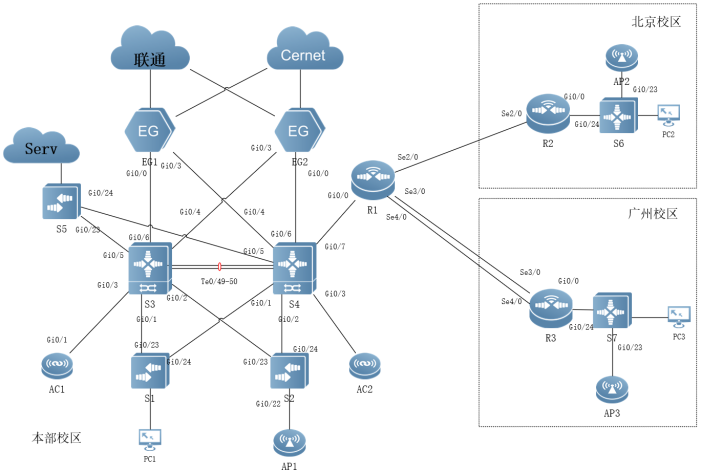

# 河北省赛样题2023网络解法

　　配置文件有部分测试时的冗余配置无视即可。

　　解法只有大致解法，并不完整。请参考配置，自己补全

# 基础配置

## 1.所有交换机和无线控制器开启SSH服务，用户名密码分别为admin、admin1234；密码为明文类型,特权密码为admin@1234。

　　所有交换机、AC执行

```shell
enable password admin@1234
enable service ssh-server
username admin password admin1234
line vty 0 4
 transport input ssh
 login local
```

## 2.交换设备配置SNMP功能，向主机172.16.0.254发送Trap消息版本采用V2C，读写的Community为“Test”，只读的Community为“public”，开启Trap消息。

　　所有交换机执行

```shell
snmp-server host 172.16.0.254 traps version 2c public
snmp-server host 172.16.0.254 traps version 2c Test
snmp-server enable traps
snmp-server community public ro 
snmp-server community Test rw
```

# 有线网络

## 1.在全网Trunk链路上做VLAN修剪。

　　交换设备示例，只允许特定vlan通过

```shell
interface GigabitEthernet 0/24
 switchport mode trunk
 switchport trunk allowed vlan only 10,20,30,40,50,100
 ip dhcp snooping trust
```

## 2.为隔离网络中部分终端用户间的二层互访，在交换机S1、S2上使用端口保护。

　　相关接口下执行

```shell
interface GigabitEthernet 0/1
 switchport protected
```

　　‍

## 3.为了保证接入区DHCP服务安全及伪IP源地址攻击，具体要求如下：DHCP服务器搭建于S3上对VLAN10以内的用户进行地址分配；为了防御从非法DHCP服务器获得的地址要求在S1、S2上部署DHCP Snooping功能。

　　S1和S2开启DHCP Snooping

```shell
service dhcp
ip dhcp snooping
interface GigabitEthernet 0/23
ip dhcp snooping trust
interface GigabitEthernet 0/24
ip dhcp snooping trust
```

　　在S3部署dhcp服务

```shell
service dhcp
ip dhcp pool 10
 network 192.1.10.0 255.255.255.0
 dns-server 8.8.8.8 
 default-router 192.1.10.254 
```

## 4.在本部交换机S3、S4上配置MSTP防止二层环路；要求VLAN10、VLAN20、VLAN30数据流经过S3转发，VLAN40、VLAN50、VLAN100数据流经过S4转发，S3、S4其中一台宕机时均可无缝切换至另一台进行转发。所配置的参数要求如下:region-name为test；revision版本为1；实例1，包含VLAN10，VLAN20，VLAN30；实例2，包含VLAN40，VLAN50，VLAN100；S3作为实例0、1中的主根，S4作为实例0、1的从根；S4作为实例2中的主根，S3作为实例2的从根；主根优先级为4096，从根优先级为8192；在S3和S4上配置VRRP，实现主机的网关冗余。所配置的参数要求如表1；S3、S4各VRRP组中高优先级设置为150，低优先级设置为120。

|**VLAN**|**VRRP备份组号（VRID）**|**VRRP虚拟IP**|
| -------------------| -----| ---------------|
|VLAN10|10|192.1.10.254|
|VLAN20|20|192.1.20.254|
|VLAN30|30|192.1.30.254|
|VLAN40|40|192.1.40.254|
|VLAN50|50|192.1.50.254|
|VLAN100(交换机间)|100|192.1.100.254|

　　mstp:

　　全局一致

```shell
spanning-tree mst configuration
revision 1
name test
instance 1 vlan 10, 20, 30
instance 2 vlan 40, 50, 100
```

　　根据实际情况调整优先级

```shell
spanning-tree mst 0 priority 4096
spanning-tree mst 1 priority 4096
spanning-tree mst 2 priority 8192
```

　　vrrp：

```shell
interface VLAN 20
ip address 192.1.20.252 255.255.255.0
vrrp 20 ip 192.1.20.254
vrrp 20 priority 150
```

　　根据情况调整

## 5.本部内网使用静态路由、OSPF多协议组网。其中S3、S4、S5、EG1、EG2、R1使用OSPF协议，本部其余三层设备间使用静态路由协议。本部与分校广域网间使用静态路由协议（R1除外），各分校局域网环境使用静态路由协议。要求网络具有安全性、稳定性。具体要求如下：本部OSPF进程号为10，规划多区域；区域0（S3、S4），区域1（S3，S4，S5）,区域2（S3，S4，EG1，EG2），区域3（S4、R1）；区域1为完全NSSA区域；AP使用静态路由协议；本部与分校通过重分发引入彼此路由；要求本部业务网段中不出现协议报文；不允许重发布直连路由，Network方式发布本地明细路由；为了管理方便，需要发布Loopback地址；优化OSPF相关配置，以尽量加快OSPF收敛；重发布路由进OSPF中使用类型1；不允许在R1设备使用IPV4静态路由。

　　[简单配置 - 动态](数据通信.md#20231210215417-0cqp4qh)

　　‍

## 6.考虑到广域网线路安全性较差，所以需要使用IPSec对各分校到总校的业务数据进行加密。要求使用动态隧道主模式，安全协议采用esp协议，加密算法采用3des，认证算法采用md5，以IKE方式建立IPsec SA。

　　‍

## 7.在R1上所配置的参数要求如下：ipsec加密转换集名称为myset；动态ipsec加密图名称为dymymap；预共享密钥为明文123456；静态的ipsec加密图mymap。

　　‍

## 8.在R2和R3上所配置的参数要求如下：ACL编号为101；静态的ipsec加密图mymap预共享密钥为明文123456。

　　‍

## 9.考虑到数据分流及负载均衡的目的，针对本部与各分校数据流走向要求如下:通过修改OSPF接口COST达到分流的目的，且其值必须为5或10；OSPF通过路由引入时改变引入路由的COST值，且其值必须为5或10；本部VLAN10，VLAN20，VLAN30用户与互联网互通主路径规划为：S3-EG1；本部VLAN40用户与互联网互通主路径规划为：S4-EG2；各分校用户与互联网互通主路径规划为：S4-EG2；云平台服务器与互联网互通主路径规划为S3-EG1；主链路故障可无缝切换到备用链路上。

　　修改cost，已通过mstp进行分流，修改ospf的cost值即可

　　‍

## 10.总部机构部署IPV6实现其IPV6终端互联互通，在S3和S4上配置VRRP for IPv6，实现主机的IPv6网关冗余；VRRP与MSTP的主备状态与IPV4网络一致。

```shell
interface VLAN 30
vrrp 30 ipv6 FE80::130
vrrp 30 ipv6 2001:192:30::254
ipv6 address 2001:192:30::252/64
vrrp ipv6 30 priority 150
vrrp ipv6 30 accept_mode
```

## 11.S3、S4、R1间部署OSPFV3,进程为10，区域为0；R2、S6间部署OSPFV3进程为20，区域为0；R3、S7间部署OSPFV3进程为30，区域为0。

　　‍

## 12.S3、S4、AC1、AC2部署IPV6静态路由协议，实现总部有线与无线IPV6终端互联互通。

　　‍

## 13.R1\R2间部署IPV6 6to4动态隧道，隧道内部署静态路由协议，实现总分机构间IPV6终端互联互通。

```shell
interface Tunnel 1
tunnel mode ipv6ip 6to4
tunnel source Serial 2/0
ipv6 address 2002:1400:1::1/64
ipv6 enable

ipv6的ip是计算得出
```

　　[ipv6ip 6to4 隧道配置命令](数据通信.md#20231215220910-hmqfaeu)

　　注意 需要写条2002::/16的路由才能通

## 14.R1\R3间部署IPV6 GRE隧道，隧道内部署OSPFV3协议，实现总分机构间IPV6终端互联互通。IPV6地址规划如表2：

|**设备**|**接口**|**IPV6地址**|**VRRP组号**|**虚拟IP**|
| -----| ----------| ----------------------| -----| ----------------------|
|S3|VLAN10|2001:192:10::252/64|10|2001:192:10::254/64|
||VLAN20|2001:192:20::252/64|20|2001:192:20::254/64|
||VLAN30|2001:192:30::252/64|30|2001:192:30::254/64|
||VLAN40|2001:192:40::252/64|40|2001:192:40::254/64|
||VLAN100|2001:192:100::252/64|100|2001:192:100::254/64|
|S4|VLAN10|2001:192:10::253/64|10|2001:192:10::254/64|
||VLAN20|2001:192:20::253/64|20|2001:192:20::254/64|
||VLAN30|2001:192:30::253/64|30|2001:192:30::254/64|
||VLAN40|2001:192:40::253/64|40|2001:192:40::254/64|
||VLAN100|2001:192:100::253/64|100|2001:192:100::254/64|
||GI0/7|2001:193:10::1/64|||
|AC1|VLAN60|2001:192:60::252/64|60|2001:192:60::254/64|
||VLAN100|2001:192:100::2/64|100|2001:192:100::1/64|
|AC2|VLAN60|2001:192:60::253/64|60|2001:192:60::254/64|
||VLAN100|2001:192:100::3/64|100|2001:192:100::1/64|
|R1|Gi0/0|2001:193:10::2/64|||
||Tunnel 0|2001:191:10::1/64|||
||Tunnel 1|自行计算|||
|R2|Gi0/0|2001:193:20::1/64|||
||Tunnel 1|自行计算|||
|S6|Gi0/24|2001:193:20::2/64|||
||VLAN10|2001:194:10::254/64|||
|R3|Gi0/0|2001:193:30::1/64|||
||Tunnel0|2001:191:10::2/64|||
|S7|Gi0/24|2001:193:30::2/64|||
||VLAN10|2001:195:10::254/64|||

　　‍

　　‍

　　‍

　　‍

　　‍

　　‍

# 无线网络

## 1.绘制AP点位图（包括：AP型号、编号、信道等信息，其中信道采用2.4G的1、6、11三个信道进行规划）。

　　‍

## 2.使用无线地勘软件，输出AP点位图的2.4G频道的信号仿真热图（仿真信号强度要求大于-65db）。

　　‍

## 3.根据表3无线产品价格表，制定该无线网络工程项目设备的预算表。

|**产品型号**|**产品特征**|**传输速率**<br /> **（2.4G/最大）**|**推荐/最大带点数**|**功率**|**价格（元）**|||
| --------| -------------------| -------------| --------| -------| -------| --| --|
|AP1|双频双流|300M/1.167G|32/256|100mw|6000|||
|AP2|双频双流|300M/600M|32/256|100mw|11000|||
|AP3|单频单流|150M|12/32|60mw|2500|||
|线缆1|10米馈线|N/A|N/A|N/A|1600|||
|线缆2|15米馈线|N/A|N/A|N/A|2400|||
|天线|双频单流/单频单流|N/A|N/A|N/A|500|||
|Switch|24口POE交换机|N/A|N/A|240w|15000|||
|AC|无线控制器|6*1000M|32/200|40w|50000|||

　　‍

## 4.使用AC为本部无线用户DHCP服务器，使用S3、S4为本部AP的DHCP服务器,S3分配AP地址范围为其网段的1至100,S4分配AP地址范围为其网段的101至200。

## 5.创建本部SSID(WLAN-ID 1)为test-ZX\_XX(XX现场提供)，AP-Group为ZX，本部无线用户关联SSID后可自动获取地址。

　　‍

## 6.AC1为主用，AC2为备用。AP与AC1、AC2均建立隧道，当AP与AC1失去连接时能无缝切换至AC2并提供服务。

　　‍

## 7.要求本部无线用户启用集中转发模式。

　　‍

## 8.本部关闭低速率（1M,6M）应用接入。

　　‍

## 9.AP2胖模式,以透明形式进行部署，S6部署DHCP为无线终端和AP分配地址。

　　‍

## 10.AP2创建SSID(WLAN-ID 1)为test-BJ\_XX(XX现场提供),采用WEB进行认证，认证用户名为user1,密码为XX(现场提供)。

　　‍

## 11.AP3胖模式,以路由形式进行部署，本地部署DHCP为无线终端分配地址。

　　‍

# 出口网络

## 1.本部出口网关上配置访问控制列表，允许本部、分部有线无线业务网段(ACL编号110)通过NAPT访问联通、教育网资源。

　　‍

## 2.在本部EG1上配置，使本部核心交换S4（11.1.0.4）设备的Telnet服务可以通过互联网被访问，将其地址映射至联通线路上，映射地址为196.1.0.10。

　　‍

## 3.需确保NAT映射数据流来回一致，启用EG源进源出功能保证任何外网用户（联通、电信、移动、教育……）均可访问映射地址196.1.0.10。

　　‍

## 4.在本部网关上启用Web Portal认证服务，并创建user1、user2，密码均为123456。有线用户需进行WEB认证访问互联网。

　　‍

## 5.无线用户不需在EG上进行WEB认证即可访问互联网。

　　‍

# 拓扑/IP规划

​​

　　‍

|**设备**|**接口或VLAN**|**VLAN名称**|**二层或三层规划**|**说明**|
| -----| ------------| ---------------| ------------------| ----------------------|
|S1|VLAN10|Office10|Gi0/1至Gi0/4|办公网段|
||VLAN20|Office20|Gi0/5至Gi0/8|办公网段|
||VLAN30|Office30|Gi0/9至Gi0/12|办公网段|
||VLAN40|Office40|Gi0/13至Gi0/16|办公网段|
||VLAN50|AP|Gi0/21至Gi0/22|无线AP管理|
||VLAN100|Manage|192.1.100.4/24|设备管理VLAN|
|S2|VLAN10|Office10|Gi0/1至Gi0/4|办公网段|
||VLAN20|Office20|Gi0/5至Gi0/8|办公网段|
||VLAN30|Office30|Gi0/9至Gi0/12|办公网段|
||VLAN40|Office40|Gi0/13至Gi0/16|办公网段|
||VLAN50|AP|Gi0/21至Gi0/22|无线AP管理|
||VLAN100|Manage|192.1.100.5/24|设备管理VLAN|
|S3|VLAN10|Office10|192.1.10.252/24|办公网段|
||VLAN20|Office20|192.1.20.252/24|办公网段|
||VLAN30|Office30|192.1.30.252/24|办公网段|
||VLAN40|Office40|192.1.40.252/24|办公网段|
||VLAN50|AP|192.1.50.252/24|无线AP管理|
||VLAN100|Manage|192.1.100.252/24|设备管理VLAN|
||Gi0/4|　|10.1.0.41/30|互联EG2|
||Gi0/5|　|10.1.0.1/30|互联S5|
||Gi0/6|　|10.1.0.5/30|互联EG1|
||LoopBack 0|　|11.1.0.33/32|　|
|S4|VLAN10|Office10|192.1.10.253/24|办公网段|
||VLAN20|Office20|192.1.20.253/24|办公网段|
||VLAN30|Office30|192.1.30.253/24|办公网段|
||VLAN40|Office40|192.1.40.253/24|办公网段|
||VLAN50|AP|192.1.50.253/24|无线AP管理|
||VLAN100|Manage|192.1.100.253/24|设备管理VLAN|
||Gi0/4|　|10.1.0.37/30|互联EG1|
||Gi0/5|　|10.1.0.33/30|互联S5|
||Gi0/6|　|10.1.0.9/30|互联EG2|
||Gi0/7|　|10.1.0.13/30|互联R1|
||LoopBack 0|　|11.1.0.34/32|　|
|AC1|LoopBack 0|　|11.1.0.204/32|　|
||VLAN60|Wiressless|192.1.60.252/24|无线用户|
||Vlan100|Manage|192.1.100.2/24|管理与互联VLAN|
|AC2|LoopBack 0|　|11.1.0.205/32|　|
||VLAN60|Wiressless|192.1.60.253/24|无线用户|
||Vlan100|Manage|192.1.100.3/24|管理与互联VLAN|
|S5|LoopBack 0|　|11.1.0.5/32|　|
||Gi0/23|　|10.1.0.2/30|互联S3|
||Gi0/24|　|10.1.0.34/30|互联S4|
|EG1|Gi0/0|　|10.1.0.6/30|互联S3|
||Gi0/1|　|196.1.0.1/24|互联EG2|
||Gi0/2|　|197.1.0.1/24|互联EG2|
||Gi0/3|　|10.1.0.38/30|互联S4|
||LoopBack 0|　|11.1.0.11/32|　|
|EG2|Gi0/0|　|10.1.0.10/30|互联S4|
||Gi0/1|　|196.1.0.2/24|互联EG1|
||Gi0/2|　|197.1.0.2/24|互联EG1|
||Gi0/3|　|10.1.0.42/30|互联S3|
||LoopBack 0|　|11.1.0.12/32|　|
|R1|Gi0/0|　|10.1.0.14/30|互联S4|
||S2/0|　|20.0.0.1/30|互联R2|
||S3/0|　|10.1.0.22/30|捆绑组1成员|
||S4/0|　|10.1.0.22/30|捆绑组1成员|
||LoopBack 0|　|11.1.0.1/32|　|
|R2|Gi0/0|　|10.1.0.25/30|互联S6|
||S2/0|　|20.0.0.2/30|互联R1|
||LoopBack 0|　|11.1.0.2/32|　|
|R3|Gi0/0|　|10.1.0.29/30|互联S7|
||S3/0|　|10.1.0.21/30|捆绑组1成员|
||S4/0|　|10.1.0.21/30|捆绑组1成员|
||LoopBack 0|　|11.1.0.3/32|　|
|S6|Gi0/24|　|10.1.0.26/30|　|
||VLAN10|Wire_user|194.1.10.254/24|分校有线用户Gi0/1-20|
||VLAN20|Wireless_user|194.1.20.254/24|分校无线用户|
||VLAN30|AP|194.1.30.254/24|分校APGi0/21-23|
||LoopBack 0|　|11.1.0.6/32||
|S7|Gi0/23||10.1.0.49/30|AP|
||Gi0/24||10.1.0.30/30||
||VLAN10|Wire_user|195.1.10.254/24|分校有线用户Gi0/1-20|
||LoopBack 0|　|11.1.0.7/32||
|AP3|Gi0/1|　|10.1.0.50/30||
||BVI20|　|195.1.20.254/24|分校无线用户|

　　‍

# 设备配置

　　部分设备有测试的冗余配置，无视即可。

## R1

```shell
R1#show run

Building configuration...
Current configuration : 3566 bytes

!
version RGOS 10.4(3b34)p4 Release(208710)(Mon Oct 24 17:11:09 CST 2016 -ngcf70)
hostname R1
webmaster level 0 username admin password 7 04361c0b370d
!
!
!
!
!
!
diffserv domain default
!
!
!
!
cwmp
!
!
!
route-map fb permit 10
 match ip address prefix-list fb1
 set ip next-hop 20.0.0.2
!       
route-map fb permit 20
 match ip address prefix-list fb2
 set ip next-hop 10.1.0.21
!
!
!
!
!
!
vlan 1
!
!
no service password-encryption
!
!
!
!
!
!
!
!
!
!
!
!       
!
!
!
ip prefix-list fb1 seq 5 permit 10.1.0.24/30
ip prefix-list fb1 seq 10 permit 11.1.0.2/32
ip prefix-list fb1 seq 15 permit 11.1.0.6/32
ip prefix-list fb1 seq 20 permit 194.1.0.0/16
!
ip prefix-list fb2 seq 5 permit 10.1.0.28/30
ip prefix-list fb2 seq 10 permit 11.1.0.3/32
ip prefix-list fb2 seq 15 permit 10.1.0.48/30
ip prefix-list fb2 seq 20 permit 195.1.10.0/24
ip prefix-list fb2 seq 25 permit 11.1.0.7/32
!
!
!
!
!
!
control-plane
!
control-plane protocol
 no acpp
!       
control-plane manage
 no port-filter
 no arp-car
 no acpp
!
control-plane data
 no glean-car
 no acpp
!
!
!
!
enable service web-server http
enable service web-server https
!
crypto isakmp policy 1
 encryption 3des
 authentication pre-share
!
!
crypto isakmp key 7 1443185e75477d address 0.0.0.0 0.0.0.0
crypto ipsec transform-set myset esp-3des esp-md5-hmac
!
crypto dynamic-map dymay 5
 set transform-set myset
!
!
!
crypto dynamic-map dymymap 5
 set transform-set myset
!
!
!
crypto map mymap 10 ipsec-isakmp dynamic dymymap
!
!
!
!
!
!
!
!
!
!
!
!
!
!       
!
interface Serial 2/0
 encapsulation PPP
 ip address 20.0.0.1 255.255.255.252
 crypto map mymap
!
interface Serial 3/0
 encapsulation PPP
 ip address 10.1.0.22 255.255.255.252
 crypto map mymap
!
interface FastEthernet 1/0
!
interface FastEthernet 1/1
!
interface FastEthernet 1/2
!
interface FastEthernet 1/3
!
interface FastEthernet 1/4
!
interface FastEthernet 1/5
!
interface FastEthernet 1/6
!
interface FastEthernet 1/7
!
interface FastEthernet 1/8
!
interface FastEthernet 1/9
!
interface FastEthernet 1/10
!
interface FastEthernet 1/11
!
interface FastEthernet 1/12
!
interface FastEthernet 1/13
!
interface FastEthernet 1/14
!
interface FastEthernet 1/15
!
interface FastEthernet 1/16
!
interface FastEthernet 1/17
!
interface FastEthernet 1/18
!
interface FastEthernet 1/19
!
interface FastEthernet 1/20
!
interface FastEthernet 1/21
!
interface FastEthernet 1/22
!
interface FastEthernet 1/23
!
interface GigabitEthernet 0/0
 ip policy route-map fb
 ip ospf network point-to-point
 ip address 10.1.0.14 255.255.255.252
 ipv6 address 2001:193:10::2/64
 ipv6 ospf 10 area 0
 duplex auto
 speed auto
!
interface GigabitEthernet 0/1
 duplex auto
 speed auto
!       
interface Loopback 0
 ip address 11.1.0.1 255.255.255.255
!
interface Tunnel 0
 tunnel source 10.1.0.22
 tunnel destination 10.1.0.21
 ipv6 address 2001:191:10::1/64
 ipv6 ospf 30 area 0
!
interface Tunnel 1
 tunnel mode ipv6ip 6to4
 tunnel source Serial 2/0
 ipv6 address 2002:1400:1::1/64
 ipv6 enable
!
!
!
!
!
!
ipv6 route 2001:193:20::/64 Tunnel 1
ipv6 route 2002::/16 Tunnel 1
!
!       
ipv6 router ospf 10
 redistribute static
 redistribute ospf 30
!
ipv6 router ospf 30
 redistribute static
 redistribute ospf 10
!
!
!
!
!
!
!
!
!
!
!
!
!
!
ip route 0.0.0.0 0.0.0.0 10.1.0.13
!
!       
!
!
!
ref parameter 75 140
line con 0
line aux 0
line vty 0 4
 login
!
!
end
R1#   
```

## R2

```shell
R2#show run

Building configuration...
Current configuration : 2767 bytes

!
version RGOS 10.4(3b34)p4 Release(208710)(Mon Oct 24 17:11:09 CST 2016 -ngcf70)
hostname R2
webmaster level 0 username admin password 7 073f07221c1c
!
!
!
!
!
!
diffserv domain default
!
!
!
!
cwmp
!
!
!
!
!       
!
!
!
vlan 1
!
!
no service password-encryption
!
!
!
!
!
!
!
!
!
!
!
!
!
!
!
!
ip access-list extended 101
 10 permit ip any any 
!
!
!
!
!
control-plane
!
control-plane protocol
 no acpp
!
control-plane manage
 no port-filter
 no arp-car
 no acpp
!
control-plane data
 no glean-car
 no acpp
!
!
!
!
enable service web-server http
enable service web-server https
!
crypto isakmp policy 1
 encryption 3des
 authentication pre-share
!
!
crypto isakmp key 7 1443185e75477d address 20.0.0.1
crypto ipsec transform-set myset esp-3des esp-md5-hmac
!
crypto map mymap 5 ipsec-isakmp
 set peer 20.0.0.1   
 set transform-set myset
 match address 101
!
!
!
!
!
!
!
!
!
!       
!
!
!
!
!
interface Serial 2/0
 encapsulation PPP
 ip address 20.0.0.2 255.255.255.252
 crypto map mymap
 clock rate 64000
!
interface FastEthernet 1/0
!
interface FastEthernet 1/1
!
interface FastEthernet 1/2
!
interface FastEthernet 1/3
!
interface FastEthernet 1/4
!
interface FastEthernet 1/5
!
interface FastEthernet 1/6
!
interface FastEthernet 1/7
!
interface FastEthernet 1/8
!
interface FastEthernet 1/9
!
interface FastEthernet 1/10
!
interface FastEthernet 1/11
!
interface FastEthernet 1/12
!
interface FastEthernet 1/13
!
interface FastEthernet 1/14
!
interface FastEthernet 1/15
!
interface FastEthernet 1/16
!
interface FastEthernet 1/17
!
interface FastEthernet 1/18
!
interface FastEthernet 1/19
!
interface FastEthernet 1/20
!
interface FastEthernet 1/21
!
interface FastEthernet 1/22
!
interface FastEthernet 1/23
!
interface GigabitEthernet 0/0
 ip address 10.1.0.25 255.255.255.252
 ipv6 address 2001:193:20::1/64
 ipv6 ospf 20 area 0
 duplex auto
 speed auto
!
interface GigabitEthernet 0/1
 duplex auto
 speed auto
!
interface Loopback 0
 ip address 11.1.0.2 255.255.255.255
!
interface Tunnel 1
 tunnel mode ipv6ip 6to4
 tunnel source Serial 2/0
 ipv6 address 2002:1400:2::1/64
 ipv6 enable
!
!
!
!
!
!
ipv6 route 2001::/16 2002:1400:1::1
ipv6 route 2002::/16 Tunnel 1
!
!
ipv6 router ospf 20
!
!
!
!
!
!
!       
!
!
!
!
!
!
!
ip route 0.0.0.0 0.0.0.0 20.0.0.1
ip route 11.1.0.1 255.255.255.255 20.0.0.1
ip route 11.1.0.6 255.255.255.255 10.1.0.26
ip route 194.1.10.0 255.255.255.0 10.1.0.26
ip route 194.1.20.0 255.255.255.0 10.1.0.26
ip route 194.1.30.0 255.255.255.0 10.1.0.26
!
!
!
!
!
ref parameter 75 140
line con 0
line aux 0
line vty 0 4
 login
!       
!
end
R2#
```

## R3

```shell
R3#show run

Building configuration...
Current configuration : 2750 bytes

!
version RGOS 10.4(3b34)p4 Release(208710)(Mon Oct 24 17:11:09 CST 2016 -ngcf70)
hostname R3
webmaster level 0 username admin password 7 051902330a21
!
!
!
!
!
!
diffserv domain default
!
!
!
!
cwmp
!
!
!
!
!       
!
!
!
vlan 1
!
!
no service password-encryption
!
!
!
!
!
!
!
!
!
!
!
!
!
!
!
!
ip access-list extended 101
 10 permit ip any any 
!
!
!
!
!
control-plane
!
control-plane protocol
 no acpp
!
control-plane manage
 no port-filter
 no arp-car
 no acpp
!
control-plane data
 no glean-car
 no acpp
!
!
!
!
enable service web-server http
enable service web-server https
!
crypto isakmp policy 1
 encryption 3des
 authentication pre-share
!
!
crypto isakmp key 7 0549546d577a43 address 20.0.0.1
crypto isakmp key 7 1443185e75477d address 10.1.0.22
crypto ipsec transform-set myset esp-3des esp-md5-hmac
!
crypto map mymap 5 ipsec-isakmp
 set peer 10.1.0.22   
 set transform-set myset
 match address 101
!
!
!
!
!
!
!
!
!       
!
!
!
!
!
!
interface Serial 3/0
 encapsulation PPP
 ip address 10.1.0.21 255.255.255.252
 crypto map mymap
 clock rate 64000
!
interface Serial 4/0
 encapsulation HDLC
 clock rate 64000
!
interface FastEthernet 1/0
!
interface FastEthernet 1/1
!
interface FastEthernet 1/2
!
interface FastEthernet 1/3
!       
interface FastEthernet 1/4
!
interface FastEthernet 1/5
!
interface FastEthernet 1/6
!
interface FastEthernet 1/7
!
interface FastEthernet 1/8
!
interface FastEthernet 1/9
!
interface FastEthernet 1/10
!
interface FastEthernet 1/11
!
interface FastEthernet 1/12
!
interface FastEthernet 1/13
!
interface FastEthernet 1/14
!
interface FastEthernet 1/15
!       
interface FastEthernet 1/16
!
interface FastEthernet 1/17
!
interface FastEthernet 1/18
!
interface FastEthernet 1/19
!
interface FastEthernet 1/20
!
interface FastEthernet 1/21
!
interface FastEthernet 1/22
!
interface FastEthernet 1/23
!
interface GigabitEthernet 0/0
 ip address 10.1.0.29 255.255.255.252
 ipv6 address 2001:193:30::1/64
 ipv6 ospf 30 area 0
 duplex auto
 speed auto
!
interface GigabitEthernet 0/1
 duplex auto
 speed auto
!
interface Loopback 0
!
interface Tunnel 10
 tunnel source 10.1.0.21
 tunnel destination 10.1.0.22
 ipv6 address 2001:191:10::2/64
 ipv6 ospf 30 area 0
!
!
!
!
!
!
!
ipv6 router ospf 30
!
!
!
!
!
!       
!
!
!
!
!
!
!
!
ip route 0.0.0.0 0.0.0.0 10.1.0.22
ip route 10.1.0.48 255.255.255.252 10.1.0.30
ip route 11.1.0.1 255.255.255.255 10.1.0.22
ip route 11.1.0.7 255.255.255.255 10.1.0.30
ip route 195.1.10.0 255.255.255.0 10.1.0.30
!
!
!
!
!
ref parameter 75 140
line con 0
line aux 0
line vty 0 4
 login
!       
!
end
R3# 
```

## S1

```shell
S1#show run

Building configuration...
Current configuration: 3301 bytes

version S53_RGOS 11.4(1)B70P1
hostname S1
!
spanning-tree mst configuration
 revision 1
 name test
 instance 0 vlan 1-9, 11-19, 21-29, 31-39, 41-49, 51-99, 101-4094
 instance 1 vlan 10, 20, 30
 instance 2 vlan 40, 50, 100
!
spanning-tree
!
ip dhcp snooping
!
username admin password admin1234
!
no cwmp
!
service dhcp
!
install 0 S5310-24GT4XS
!
sysmac c0b8.e674.e13d
!
nfpp  
!
no service password-encryption
!
redundancy
!
enable password admin@1234
enable service ssh-server
!
vlan 10
 name Office10
!
vlan 20
 name Office20
!
vlan 30
 name Office30
!
vlan 40
 name Office40
!
vlan 50
 name AP
!
vlan 100  
 name Manage
!
vlan 1
!
interface GigabitEthernet 0/1
 switchport protected
 switchport access vlan 10
!
interface GigabitEthernet 0/2
 switchport protected
 switchport access vlan 10
!
interface GigabitEthernet 0/3
 switchport protected
 switchport access vlan 10
!
interface GigabitEthernet 0/4
 switchport protected
 switchport access vlan 10
!
interface GigabitEthernet 0/5
 switchport protected
 switchport access vlan 20
!     
interface GigabitEthernet 0/6
 switchport protected
 switchport access vlan 20
!
interface GigabitEthernet 0/7
 switchport protected
 switchport access vlan 20
!
interface GigabitEthernet 0/8
 switchport protected
 switchport access vlan 20
!
interface GigabitEthernet 0/9
 switchport protected
 switchport access vlan 30
!
interface GigabitEthernet 0/10
 switchport protected
 switchport access vlan 30
!
interface GigabitEthernet 0/11
 switchport protected
 switchport access vlan 30
!     
interface GigabitEthernet 0/12
 switchport protected
 switchport access vlan 30
!
interface GigabitEthernet 0/13
 switchport protected
 switchport access vlan 40
!
interface GigabitEthernet 0/14
 switchport protected
 switchport access vlan 40
!
interface GigabitEthernet 0/15
 switchport protected
 switchport access vlan 40
!
interface GigabitEthernet 0/16
 switchport protected
 switchport access vlan 40
!
interface GigabitEthernet 0/17
 switchport protected
!
interface GigabitEthernet 0/18
 switchport protected
!
interface GigabitEthernet 0/19
 switchport protected
!
interface GigabitEthernet 0/20
 switchport protected
!
interface GigabitEthernet 0/21
 switchport protected
 switchport access vlan 50
!
interface GigabitEthernet 0/22
 switchport protected
 switchport access vlan 50
!
interface GigabitEthernet 0/23
 switchport mode trunk
 switchport trunk allowed vlan only 10,20,30,40,50,100
 ip dhcp snooping trust
!
interface GigabitEthernet 0/24
 switchport mode trunk
 switchport trunk allowed vlan only 10,20,30,40,50,100
 ip dhcp snooping trust
!
interface TenGigabitEthernet 0/25
!
interface TenGigabitEthernet 0/26
!
interface TenGigabitEthernet 0/27
!
interface TenGigabitEthernet 0/28
!
interface VLAN 1
!
interface VLAN 10
 ip helper-address 192.1.10.252
!
interface VLAN 100
 ip address 192.1.100.4 255.255.255.0
!
snmp-server host 172.16.0.254 traps version 2c public
snmp-server host 172.16.0.254 traps version 2c Test
snmp-server enable traps
snmp-server community public ro 
snmp-server community Test rw 
!     
line console 0
line vty 0 4
 transport input ssh
 login local
!
end
S1#  
```

## S2

```shell
S2#show run

Building configuration...
Current configuration: 3402 bytes

version S53_RGOS 11.4(1)B70P1
hostname S2
!
spanning-tree mst configuration
 revision 1
 name test
 instance 0 vlan 1-9, 11-19, 21-29, 31-39, 41-49, 51-99, 101-4094
 instance 1 vlan 10, 20, 30
 instance 2 vlan 40, 50, 100
!
spanning-tree
!
ip dhcp snooping
!
username admin password admin1234
!
no cwmp
!
service dhcp
!
install 0 S5310-24GT4XS
!
sysmac c0b8.e674.e19d
!
nfpp    
!
no service password-encryption
!
redundancy
!
enable password admin@1234
enable service ssh-server
!
vlan 10
 name Office10
!
vlan 20
 name Office20
!
vlan 30
 name Office30
!
vlan 40
 name Office40
!
vlan 50
 name AP
!
vlan 100  
 name Manage
!
vlan 1
!
interface GigabitEthernet 0/1
 switchport protected
 switchport access vlan 10
!
interface GigabitEthernet 0/2
 switchport protected
 switchport access vlan 10
!
interface GigabitEthernet 0/3
 switchport protected
 switchport access vlan 10
!
interface GigabitEthernet 0/4
 switchport protected
 switchport access vlan 10
!
interface GigabitEthernet 0/5
 switchport protected
 switchport access vlan 20
!       
interface GigabitEthernet 0/6
 switchport protected
 switchport access vlan 20
!
interface GigabitEthernet 0/7
 switchport protected
 switchport access vlan 20
!
interface GigabitEthernet 0/8
 switchport protected
 switchport access vlan 20
!
interface GigabitEthernet 0/9
 switchport protected
 switchport access vlan 30
!
interface GigabitEthernet 0/10
 switchport protected
 switchport access vlan 30
!
interface GigabitEthernet 0/11
 switchport protected
 switchport access vlan 50
!       
interface GigabitEthernet 0/12
 switchport protected
 switchport access vlan 30
!
interface GigabitEthernet 0/13
 switchport protected
 switchport access vlan 40
!
interface GigabitEthernet 0/14
 switchport protected
 switchport access vlan 40
!
interface GigabitEthernet 0/15
 switchport protected
 switchport access vlan 40
!
interface GigabitEthernet 0/16
 switchport protected
 switchport access vlan 40
!
interface GigabitEthernet 0/17
 switchport protected
!
interface GigabitEthernet 0/18
 switchport protected
!
interface GigabitEthernet 0/19
 switchport protected
!
interface GigabitEthernet 0/20
 switchport protected
!
interface GigabitEthernet 0/21
 switchport protected
 switchport access vlan 50
!
interface GigabitEthernet 0/22
 switchport protected
 switchport mode trunk
 switchport trunk native vlan 50
 switchport trunk allowed vlan only 50,60
!
interface GigabitEthernet 0/23
 switchport mode trunk
 switchport trunk allowed vlan only 10,20,30,40,50,60,100
 ip dhcp snooping trust
!
interface GigabitEthernet 0/24
 switchport mode trunk
 switchport trunk allowed vlan only 10,20,30,40,50,60,100
 ip dhcp snooping trust
!
interface TenGigabitEthernet 0/25
!
interface TenGigabitEthernet 0/26
!
interface TenGigabitEthernet 0/27
!
interface TenGigabitEthernet 0/28
!
interface VLAN 1
!
interface VLAN 10
 ip helper-address 192.1.10.252
!
interface VLAN 50
!
interface VLAN 100
 ip address 192.1.100.5 255.255.255.0
!
snmp-server host 172.16.0.254 traps version 2c public
snmp-server host 172.16.0.254 traps version 2c Test
snmp-server enable traps
snmp-server community public ro 
snmp-server community Test rw 
!
line console 0
line vty 0 4
 transport input ssh
 login local
!
end
S2#  
```

## S3

```shell
S3#show run

Building configuration...
Current configuration: 6954 bytes

version S6000E_RGOS 11.4(1)B12P8
hostname S3
!
spanning-tree mst configuration
 revision 1
 name test
 instance 0 vlan 1-9, 11-19, 21-29, 31-39, 41-49, 51-99, 101-4094
 instance 1 vlan 10, 20, 30
 instance 2 vlan 40, 50, 100
!
spanning-tree mst 0 priority 4096
spanning-tree mst 1 priority 4096
spanning-tree mst 2 priority 8192
spanning-tree
!
username admin password admin1234
!
cwmp
!
service dhcp
ip dhcp excluded-address 192.1.50.101 192.1.50.254
!
ip dhcp pool 10
 option 138 ip 192.1.100.2 192.1.100.3 
 network 192.1.100.0 255.255.255.0
 dns-server 8.8.8.8 
 default-router 192.1.10.254 
!
ip dhcp pool ap
 option 138 ip 192.1.100.2 192.1.100.3 
 network 192.1.50.0 255.255.255.0
 dns-server 1.1.1.1 
 default-router 192.1.50.254 
!
install 0 S6000C-48GT4XS-E
!
sysmac 5869.6cf5.2285
!
mmu buffer-mode burst-enhance
!
nfpp
!
no service password-encryption
!
redundancy
!
no zam
enable password admin@1234
enable service ssh-server
!
vlan 10
 name Office10
!
vlan 20
 name Office20
!
vlan 30
 name Office30
!
vlan 40
 name Office40
!
vlan 50
 name AP
!
vlan 100
 name Manage
!
vlan 1
!
interface GigabitEthernet 0/1
 switchport mode trunk
 switchport trunk allowed vlan only 10,20,30,40,50,100
!
interface GigabitEthernet 0/2
 switchport mode trunk
 switchport trunk allowed vlan only 10,20,30,40,50,100
!
interface GigabitEthernet 0/3
 switchport mode trunk
 switchport trunk native vlan 100
 switchport trunk allowed vlan only 60,100
!
interface GigabitEthernet 0/4
 no switchport
 ip address 10.1.0.41 255.255.255.252
 ip ospf network point-to-point
 ip ospf cost 10
!
interface GigabitEthernet 0/5
 no switchport
 ip address 10.1.0.1 255.255.255.252
 ip ospf network point-to-point
!
interface GigabitEthernet 0/6
 no switchport
 ip address 10.1.0.5 255.255.255.252
 ip ospf network point-to-point
 ip ospf cost 5
!
interface GigabitEthernet 0/7
!
interface GigabitEthernet 0/8
!
interface GigabitEthernet 0/9
!
interface GigabitEthernet 0/10
!
interface GigabitEthernet 0/11
!
interface GigabitEthernet 0/12
!
interface GigabitEthernet 0/13
!
interface GigabitEthernet 0/14
!
interface GigabitEthernet 0/15
!
interface GigabitEthernet 0/16
!
interface GigabitEthernet 0/17
 switchport access vlan 50
!
interface GigabitEthernet 0/18
!
interface GigabitEthernet 0/19
!
interface GigabitEthernet 0/20
!
interface GigabitEthernet 0/21
!
interface GigabitEthernet 0/22
!
interface GigabitEthernet 0/23
!
interface GigabitEthernet 0/24
!
interface GigabitEthernet 0/25
!
interface GigabitEthernet 0/26
!
interface GigabitEthernet 0/27
!
interface GigabitEthernet 0/28
!       
interface GigabitEthernet 0/29
!
interface GigabitEthernet 0/30
!
interface GigabitEthernet 0/31
!
interface GigabitEthernet 0/32
!
interface GigabitEthernet 0/33
!
interface GigabitEthernet 0/34
!
interface GigabitEthernet 0/35
!
interface GigabitEthernet 0/36
!
interface GigabitEthernet 0/37
!
interface GigabitEthernet 0/38
!
interface GigabitEthernet 0/39
!
interface GigabitEthernet 0/40
!       
interface GigabitEthernet 0/41
!
interface GigabitEthernet 0/42
!
interface GigabitEthernet 0/43
!
interface GigabitEthernet 0/44
!
interface GigabitEthernet 0/45
!
interface GigabitEthernet 0/46
!
interface GigabitEthernet 0/47
!
interface GigabitEthernet 0/48
!
interface TenGigabitEthernet 0/49
 port-group 1 mode active
!
interface TenGigabitEthernet 0/50
 port-group 1 mode active
!
interface TenGigabitEthernet 0/51
!       
interface TenGigabitEthernet 0/52
!
interface AggregatePort 1
 switchport mode trunk
 switchport trunk allowed vlan only 10,20,30,40,50,60,100
!
interface Loopback 0
 ip address 11.1.0.33 255.255.255.255
!
interface VLAN 10
 ip address 192.1.10.252 255.255.255.0
 vrrp 10 ip 192.1.10.254
 vrrp 10 ipv6 FE80::110
 vrrp 10 ipv6 2001:192:10::254
 ipv6 address 2001:192:10::252/64
 vrrp ipv6 10 priority 150
 vrrp ipv6 10 accept_mode
 vrrp 10 priority 150
 ip ospf network point-to-point
 ip ospf cost 5
 ipv6 ospf 10 area 0
!
interface VLAN 20
 ip address 192.1.20.252 255.255.255.0
 vrrp 20 ip 192.1.20.254
 vrrp 20 ipv6 FE80::120
 vrrp 20 ipv6 2001:192:20::254
 ipv6 address 2001:192:20::252/64
 vrrp ipv6 30 priority 150
 vrrp ipv6 30 accept_mode
 vrrp 20 priority 150
 ip ospf network point-to-point
 ip ospf cost 5
 ipv6 ospf 10 area 0
!
interface VLAN 30
 ip address 192.1.30.252 255.255.255.0
 vrrp 30 ip 192.1.30.254
 vrrp 30 ipv6 FE80::130
 vrrp 30 ipv6 2001:192:30::254
 ipv6 address 2001:192:30::252/64
 vrrp ipv6 30 priority 150
 vrrp ipv6 30 accept_mode
 vrrp 30 priority 150
 ip ospf network point-to-point
 ip ospf cost 5
 ipv6 ospf 10 area 0
!       
interface VLAN 40
 ip address 192.1.40.252 255.255.255.0
 vrrp 40 ip 192.1.40.254
 vrrp 40 ipv6 FE80::140
 vrrp 40 ipv6 2001:192:40::254
 ipv6 address 2001:192:40::252/64
 vrrp ipv6 40 priority 120
 vrrp ipv6 40 accept_mode
 vrrp 40 priority 120
 ip ospf network point-to-point
 ip ospf cost 10
 ipv6 ospf 10 area 0
!
interface VLAN 50
 ip address 192.1.50.252 255.255.255.0
 vrrp 50 ip 192.1.50.254
 vrrp 50 ipv6 FE80::150
 vrrp 50 ipv6 2001:192:50::254
 ipv6 address 2001:192:50::252/64
 vrrp ipv6 50 priority 120
 vrrp ipv6 50 accept_mode
 vrrp 50 priority 120
 ip ospf network point-to-point
 ipv6 ospf 10 area 0
!
interface VLAN 100
 ip address 192.1.100.252 255.255.255.0
 vrrp 100 ip 192.1.100.254
 vrrp 100 ipv6 FE80::100
 vrrp 100 ipv6 2001:192:100::254
 ipv6 address 2001:192:100::252/64
 vrrp ipv6 100 priority 120
 vrrp ipv6 100 accept_mode
 vrrp 100 priority 120
 ip ospf network point-to-point
 ipv6 ospf 10 area 0
!
interface Mgmt 0
!
router ospf 10
 graceful-restart
 redistribute static metric-type 1 subnets
 passive-interface VLAN 10
 passive-interface VLAN 20
 passive-interface VLAN 30
 passive-interface VLAN 40
 passive-interface VLAN 50
 area 0   
 area 1
 area 1 nssa no-summary
 network 10.1.0.0 0.0.0.3 area 1
 network 11.1.0.33 0.0.0.0 area 0
 network 192.1.10.0 0.0.0.255 area 0
 network 192.1.20.0 0.0.0.255 area 0
 network 192.1.30.0 0.0.0.255 area 0
 network 192.1.40.0 0.0.0.255 area 0
 network 192.1.50.0 0.0.0.255 area 0
 network 192.1.100.0 0.0.0.255 area 0
!
ipv6 router ospf 10
 graceful-restart
 passive-interface VLAN 10
 passive-interface VLAN 20
 passive-interface VLAN 30
 passive-interface VLAN 40
 passive-interface VLAN 50
!
ipv6 route 2001:192:60::/64 2001:192:100::2
!
ip route 11.1.0.204 255.255.255.255 192.1.100.2
ip route 192.1.60.0 255.255.255.0 192.1.100.2
!       
snmp-server host 172.16.0.254 traps version 2c public
snmp-server host 172.16.0.254 traps version 2c Test
snmp-server enable traps
snmp-server community public ro 
snmp-server community Test rw 
!
line console 0
line vty 0 4
 transport input ssh
 login local
!
end
S3#  
```

## S4

```shell
S4#show run

Building configuration...
Current configuration: 7515 bytes

version S6000E_RGOS 11.4(1)B12P8
hostname S4
!
spanning-tree mst configuration
 revision 1
 name test
 instance 0 vlan 1-9, 11-19, 21-29, 31-39, 41-49, 51-99, 101-4094
 instance 1 vlan 10, 20, 30
 instance 2 vlan 40, 50, 100
!
spanning-tree mst 0 priority 8192
spanning-tree mst 1 priority 8192
spanning-tree mst 2 priority 4096
spanning-tree
!
username admin password admin1234
!
cwmp
!
service dhcp
ip dhcp excluded-address 192.1.50.1 192.1.50.100
ip dhcp excluded-address 192.1.50.201 192.1.50.254
!
ip dhcp pool ap
 option 138 ip 192.1.100.2 192.1.100.3 
 network 192.1.50.0 255.255.255.0
 dns-server 1.1.1.1 
 default-router 192.1.50.254 
!
install 0 S6000C-48GT4XS-E
!
sysmac 5869.6cf5.2273
!
mmu buffer-mode burst-enhance
!
nfpp
!
no service password-encryption
!
redundancy
!
no zam
enable password admin@1234
enable service ssh-server
!
vlan 10
 name Office10
!
vlan 20   
 name Office20
!
vlan 30
 name Office30
!
vlan 40
 name Office40
!
vlan 50
 name AP
!
vlan 100
 name Manage
!
vlan range 1,60
!
interface GigabitEthernet 0/1
 switchport mode trunk
 switchport trunk allowed vlan only 10,20,30,40,50,60,100
!
interface GigabitEthernet 0/2
 switchport mode trunk
 switchport trunk allowed vlan only 10,20,30,40,50,60,100
!       
interface GigabitEthernet 0/3
 switchport mode trunk
 switchport trunk native vlan 100
 switchport trunk allowed vlan only 60,100
!
interface GigabitEthernet 0/4
 no switchport
 ip address 10.1.0.37 255.255.255.252
 ip ospf network point-to-point
 ip ospf cost 10
!
interface GigabitEthernet 0/5
 no switchport
 ip address 10.1.0.33 255.255.255.252
 ip ospf network point-to-point
!
interface GigabitEthernet 0/6
 no switchport
 ip address 10.1.0.9 255.255.255.252
 ip ospf network point-to-point
 ip ospf cost 5
!
interface GigabitEthernet 0/7
 no switchport
 ip address 10.1.0.13 255.255.255.252
 ipv6 address 2001:193:10::1/64
 ip ospf network point-to-point
 ipv6 ospf 10 area 0
!
interface GigabitEthernet 0/8
!
interface GigabitEthernet 0/9
!
interface GigabitEthernet 0/10
!
interface GigabitEthernet 0/11
!
interface GigabitEthernet 0/12
!
interface GigabitEthernet 0/13
!
interface GigabitEthernet 0/14
!
interface GigabitEthernet 0/15
!
interface GigabitEthernet 0/16
!
interface GigabitEthernet 0/17
!
interface GigabitEthernet 0/18
!
interface GigabitEthernet 0/19
!
interface GigabitEthernet 0/20
!
interface GigabitEthernet 0/21
!
interface GigabitEthernet 0/22
!
interface GigabitEthernet 0/23
!
interface GigabitEthernet 0/24
!
interface GigabitEthernet 0/25
!
interface GigabitEthernet 0/26
!
interface GigabitEthernet 0/27
!
interface GigabitEthernet 0/28
!
interface GigabitEthernet 0/29
!
interface GigabitEthernet 0/30
!
interface GigabitEthernet 0/31
!
interface GigabitEthernet 0/32
!
interface GigabitEthernet 0/33
!
interface GigabitEthernet 0/34
!
interface GigabitEthernet 0/35
!
interface GigabitEthernet 0/36
!
interface GigabitEthernet 0/37
!
interface GigabitEthernet 0/38
!
interface GigabitEthernet 0/39
!
interface GigabitEthernet 0/40
!
interface GigabitEthernet 0/41
!
interface GigabitEthernet 0/42
!
interface GigabitEthernet 0/43
!
interface GigabitEthernet 0/44
!
interface GigabitEthernet 0/45
!
interface GigabitEthernet 0/46
!
interface GigabitEthernet 0/47
!
interface GigabitEthernet 0/48
!
interface TenGigabitEthernet 0/49
 port-group 1 mode active
!
interface TenGigabitEthernet 0/50
 port-group 1 mode active
!
interface TenGigabitEthernet 0/51
!
interface TenGigabitEthernet 0/52
!
interface AggregatePort 1
 switchport mode trunk
 switchport trunk allowed vlan only 10,20,30,40,50,60,100
!
interface Loopback 0
 ip address 11.1.0.34 255.255.255.255
!
interface VLAN 10
 ip address 192.1.10.253 255.255.255.0
 vrrp 10 ip 192.1.10.254
 vrrp 10 ipv6 FE80::110
 vrrp 10 ipv6 2001:192:10::254
 ipv6 address 2001:192:10::253/64
 vrrp ipv6 10 priority 120
 vrrp ipv6 10 accept_mode
 vrrp 10 priority 120
 ip ospf network point-to-point
 ip ospf cost 10
 ipv6 ospf 10 area 0
!
interface VLAN 20
 ip address 192.1.20.253 255.255.255.0
 vrrp 20 ip 192.1.20.254
 vrrp 20 ipv6 FE80::120
 vrrp 20 ipv6 2001:192:20::254
 ipv6 address 2001:192:20::253/64
 vrrp ipv6 30 priority 120
 vrrp ipv6 30 accept_mode
 vrrp 20 priority 120
 ip ospf network point-to-point
 ip ospf cost 10
 ipv6 ospf 10 area 0
!
interface VLAN 30
 ip address 192.1.30.253 255.255.255.0
 vrrp 30 ip 192.1.30.254
 vrrp 30 ipv6 FE80::130
 vrrp 30 ipv6 2001:192:30::254
 ipv6 address 2001:192:30::253/64
 vrrp ipv6 30 priority 120
 vrrp ipv6 30 accept_mode
 vrrp 30 priority 120
 ip ospf network point-to-point
 ip ospf cost 10
 ipv6 ospf 10 area 0
!
interface VLAN 40
 ip address 192.1.40.253 255.255.255.0
 vrrp 40 ip 192.1.40.254
 vrrp 40 ipv6 FE80::140
 vrrp 40 ipv6 2001:192:40::254
 ipv6 address 2001:192:40::253/64
 vrrp ipv6 40 priority 150
 vrrp ipv6 40 accept_mode
 vrrp 40 priority 150
 ip ospf network point-to-point
 ip ospf cost 5
 ipv6 ospf 10 area 0
!
interface VLAN 50
 ip address 192.1.50.253 255.255.255.0
 vrrp 50 ip 192.1.50.254
 vrrp 50 ipv6 FE80::150
 vrrp 50 ipv6 2001:192:50::254
 ipv6 address 2001:192:50::253/64
 vrrp ipv6 50 priority 150
 vrrp ipv6 50 accept_mode
 vrrp 50 priority 150
 ip ospf network point-to-point
 ipv6 ospf 10 area 0
!       
interface VLAN 100
 ip address 192.1.100.253 255.255.255.0
 vrrp 100 ip 192.1.100.254
 vrrp 100 ipv6 FE80::100
 vrrp 100 ipv6 2001:192:100::254
 ipv6 address 2001:192:100::253/64
 vrrp ipv6 100 priority 150
 vrrp ipv6 100 accept_mode
 vrrp 100 priority 150
 ip ospf network point-to-point
 ipv6 ospf 10 area 0
!
interface Mgmt 0
!
router ospf 10
 graceful-restart
 redistribute static metric-type 1 subnets
 passive-interface VLAN 10
 passive-interface VLAN 20
 passive-interface VLAN 30
 passive-interface VLAN 40
 passive-interface VLAN 50
 area 0
 area 1   
 area 1 nssa no-summary
 network 10.1.0.12 0.0.0.3 area 3
 network 10.1.0.32 0.0.0.3 area 1
 network 11.1.0.34 0.0.0.0 area 0
 network 192.1.10.0 0.0.0.255 area 0
 network 192.1.20.0 0.0.0.255 area 0
 network 192.1.30.0 0.0.0.255 area 0
 network 192.1.40.0 0.0.0.255 area 0
 network 192.1.50.0 0.0.0.255 area 0
 network 192.1.100.0 0.0.0.255 area 0
!
ipv6 router ospf 10
 graceful-restart
 passive-interface VLAN 10
 passive-interface VLAN 20
 passive-interface VLAN 30
 passive-interface VLAN 40
 passive-interface VLAN 50
!
ipv6 route 2001:192:60::/64 2001:192:100::3
!
ip route 10.1.0.24 255.255.255.252 10.1.0.14
ip route 10.1.0.28 255.255.255.252 10.1.0.14
ip route 10.1.0.48 255.255.255.252 10.1.0.14
ip route 11.1.0.1 255.255.255.255 10.1.0.14
ip route 11.1.0.2 255.255.255.255 10.1.0.14
ip route 11.1.0.3 255.255.255.255 10.1.0.14
ip route 11.1.0.6 255.255.255.255 10.1.0.14
ip route 11.1.0.7 255.255.255.255 10.1.0.14
ip route 11.1.0.205 255.255.255.255 192.1.100.3
ip route 20.0.0.0 255.255.255.252 10.1.0.14
ip route 192.1.60.0 255.255.255.0 192.1.100.3
ip route 194.1.0.0 255.255.0.0 10.1.0.14
ip route 195.1.0.0 255.255.0.0 10.1.0.14
!
snmp-server host 172.16.0.254 traps version 2c public
snmp-server host 172.16.0.254 traps version 2c Test
snmp-server enable traps
snmp-server community public ro 
snmp-server community Test rw 
!
line console 0
line vty 0 4
 transport input ssh
 login local
!
end
S4#  
```

## S5

```shell
S5#show run

Building configuration...
Current configuration: 2107 bytes

version S5750_RGOS 11.4(1)B1P3
hostname S5
!
username admin password admin1234
!
cwmp
!
install switch 1 S5750-24GT4XS-L
install 1/0 S5750-24GT4XS-L
!
sysmac 0074.9c2f.3bea
!
nfpp
!
no service password-encryption
!
redundancy
!
enable password admin@1234
enable service ssh-server
!
vlan 1
!
interface GigabitEthernet 1/0/1
!       
interface GigabitEthernet 1/0/2
!
interface GigabitEthernet 1/0/3
!
interface GigabitEthernet 1/0/4
!
interface GigabitEthernet 1/0/5
!
interface GigabitEthernet 1/0/6
!
interface GigabitEthernet 1/0/7
!
interface GigabitEthernet 1/0/8
!
interface GigabitEthernet 1/0/9
!
interface GigabitEthernet 1/0/10
!
interface GigabitEthernet 1/0/11
!
interface GigabitEthernet 1/0/12
!
interface GigabitEthernet 1/0/13
!       
interface GigabitEthernet 1/0/14
!
interface GigabitEthernet 1/0/15
!
interface GigabitEthernet 1/0/16
!
interface GigabitEthernet 1/0/17
!
interface GigabitEthernet 1/0/18
!
interface GigabitEthernet 1/0/19
!
interface GigabitEthernet 1/0/20
!
interface GigabitEthernet 1/0/21
!
interface GigabitEthernet 1/0/22
!
interface GigabitEthernet 1/0/23
 no switchport
 ip address 10.1.0.2 255.255.255.252
 ip ospf network point-to-point
 ip ospf cost 5
!       
interface GigabitEthernet 1/0/24
 no switchport
 ip address 10.1.0.34 255.255.255.252
 ip ospf network point-to-point
 ip ospf cost 10
!
interface TenGigabitEthernet 1/0/25
!
interface TenGigabitEthernet 1/0/26
!
interface TenGigabitEthernet 1/0/27
!
interface TenGigabitEthernet 1/0/28
!
interface Loopback 0
 ip address 11.1.0.5 255.255.255.255
!
router ospf 10
 graceful-restart
 area 1
 area 1 nssa no-summary
 network 10.1.0.0 0.0.0.3 area 1
 network 10.1.0.32 0.0.0.3 area 1
 network 11.1.0.5 0.0.0.0 area 1
!
switch virtual domain 1
!
snmp-server host 172.16.0.254 traps version 2c public
snmp-server host 172.16.0.254 traps version 2c Test
snmp-server enable traps
snmp-server community public ro 
snmp-server community Test rw 
!
line console 0
line vty 0 4
 transport input ssh
 login local
!
end
S5#
```

## S6

```shell
S6#show run

Building configuration...
Current configuration: 2665 bytes

version S5750_RGOS 11.4(1)B1P3
hostname S6
!
cwmp
!
service dhcp
!
ip dhcp pool 20
 network 194.1.20.0 255.255.255.0
 dns-server 8.8.8.8 
 default-router 194.1.20.254 
!
install switch 1 S5750-24GT4XS-L
install 1/0 S5750-24GT4XS-L
!
sysmac 0074.9c2f.3c6e
!
nfpp
!
no service password-encryption
!
redundancy
!
vlan range 1,10,20,30
!       
interface GigabitEthernet 1/0/1
 switchport access vlan 20
!
interface GigabitEthernet 1/0/2
 switchport access vlan 10
!
interface GigabitEthernet 1/0/3
 no switchport
 ip address dhcp
!
interface GigabitEthernet 1/0/4
 switchport access vlan 10
!
interface GigabitEthernet 1/0/5
 switchport access vlan 10
!
interface GigabitEthernet 1/0/6
 no switchport
 ip address dhcp
!
interface GigabitEthernet 1/0/7
 switchport access vlan 10
!
interface GigabitEthernet 1/0/8
 switchport access vlan 10
!
interface GigabitEthernet 1/0/9
 switchport access vlan 10
!
interface GigabitEthernet 1/0/10
 switchport access vlan 10
!
interface GigabitEthernet 1/0/11
 switchport access vlan 10
!
interface GigabitEthernet 1/0/12
 switchport access vlan 10
!
interface GigabitEthernet 1/0/13
 switchport access vlan 10
!
interface GigabitEthernet 1/0/14
 switchport access vlan 10
!
interface GigabitEthernet 1/0/15
 switchport access vlan 10
!
interface GigabitEthernet 1/0/16
 switchport access vlan 10
!
interface GigabitEthernet 1/0/17
 switchport access vlan 10
!
interface GigabitEthernet 1/0/18
 switchport access vlan 10
!
interface GigabitEthernet 1/0/19
 switchport access vlan 10
!
interface GigabitEthernet 1/0/20
 switchport access vlan 10
!
interface GigabitEthernet 1/0/21
 switchport access vlan 30
!
interface GigabitEthernet 1/0/22
 switchport access vlan 30
!
interface GigabitEthernet 1/0/23
 switchport mode trunk
 switchport trunk allowed vlan only 20,30
!       
interface GigabitEthernet 1/0/24
 no switchport
 ip address 10.1.0.26 255.255.255.252
 ipv6 address 2001:193:20::2/64
 ipv6 ospf 20 area 0
!
interface TenGigabitEthernet 1/0/25
!
interface TenGigabitEthernet 1/0/26
!
interface TenGigabitEthernet 1/0/27
!
interface TenGigabitEthernet 1/0/28
!
interface Loopback 0
 ip address 11.1.0.6 255.255.255.255
!
interface VLAN 10
 ip address 194.1.10.254 255.255.255.0
 ipv6 address 2001:194:10::254/64
 ipv6 ospf 20 area 0
!
interface VLAN 20
 ip address 194.1.20.254 255.255.255.0
!
interface VLAN 30
 ip address 194.1.30.254 255.255.255.0
!
ipv6 router ospf 20
 graceful-restart
!
switch virtual domain 1
!
ip route 0.0.0.0 0.0.0.0 10.1.0.25
!
line console 0
line vty 0 4
 login
!
end
S6#
```

## S7

```shell
S7#show run

Building configuration...
Current configuration: 1650 bytes

version S5750_RGOS 11.4(1)B1P3
hostname S7
!
cwmp
!
install 0 S5750-24GT4XS-L
!
sysmac 0074.9c2f.3c54
!
nfpp
!
no service password-encryption
!
redundancy
!
vlan range 1,10
!
interface GigabitEthernet 0/1
!
interface GigabitEthernet 0/2
!
interface GigabitEthernet 0/3
!
interface GigabitEthernet 0/4
!       
interface GigabitEthernet 0/5
!
interface GigabitEthernet 0/6
!
interface GigabitEthernet 0/7
!
interface GigabitEthernet 0/8
!
interface GigabitEthernet 0/9
!
interface GigabitEthernet 0/10
!
interface GigabitEthernet 0/11
!
interface GigabitEthernet 0/12
!
interface GigabitEthernet 0/13
!
interface GigabitEthernet 0/14
!
interface GigabitEthernet 0/15
!
interface GigabitEthernet 0/16
!       
interface GigabitEthernet 0/17
!
interface GigabitEthernet 0/18
!
interface GigabitEthernet 0/19
!
interface GigabitEthernet 0/20
!
interface GigabitEthernet 0/21
!
interface GigabitEthernet 0/22
!
interface GigabitEthernet 0/23
 no switchport
 ip address 10.1.0.49 255.255.255.252
!
interface GigabitEthernet 0/24
 no switchport
 ip address 10.1.0.30 255.255.255.252
 ipv6 address 2001:193:30::2/64
 ipv6 ospf 30 area 0
!
interface TenGigabitEthernet 0/25
!       
interface TenGigabitEthernet 0/26
!
interface TenGigabitEthernet 0/27
!
interface TenGigabitEthernet 0/28
!
interface Loopback 0
 ip address 11.1.0.7 255.255.255.255
!
interface VLAN 10
 ip address 195.1.10.254 255.255.255.0
 ipv6 address 2001:195:10::254/64
 ipv6 ospf 30 area 0
!
ipv6 router ospf 30
 graceful-restart
!
ip route 0.0.0.0 0.0.0.0 10.1.0.29
!
line console 0
line vty 0 4
 login
!
end     
S7#   
```

## AC1

```shell
AC1#show run

Building configuration...
Current configuration: 2418 bytes

version 11.1(5)B7
hostname AC1
!
wlan-config 1 test-ZX_SZ
 ssid-code utf-8
!
ap-group ZX
 interface-mapping 1 60 ap-wlan-id 1
!
ap-group default
!
ap-config all
!
ac-controller
 capwap ctrl-ip 192.1.100.2
 country CN
 802.11g network rate 1 disabled
 802.11g network rate 2 disabled
 802.11g network rate 5 disabled
 802.11g network rate 6 supported
 802.11g network rate 9 supported
 802.11g network rate 11 mandatory
 802.11g network rate 12 supported
 802.11g network rate 18 supported
 802.11g network rate 24 supported
 802.11g network rate 36 supported
 802.11g network rate 48 supported
 802.11g network rate 54 supported
 802.11b network rate 1 disabled
 802.11b network rate 2 disabled
 802.11b network rate 5 disabled
 802.11b network rate 11 mandatory
 802.11a network rate 6 disabled
 802.11a network rate 9 disabled
 802.11a network rate 12 mandatory
 802.11a network rate 18 supported
 802.11a network rate 24 mandatory
 802.11a network rate 36 supported
 802.11a network rate 48 supported
 802.11a network rate 54 supported
!
cwmp
!
enable service web-server http
enable service web-server https
no service password-encryption
!
tftp-server enable
!       
link-check disable
!
nfpp
!
wids
!
vlan 1
!
vlan 50
!
vlan 60
!
vlan 100
!
interface GigabitEthernet 0/1
 switchport mode trunk
 switchport trunk native vlan 100
 switchport trunk allowed vlan only 60,100
!
interface GigabitEthernet 0/2
!
interface GigabitEthernet 0/3
 no switchport
 ip address 192.168.110.150 255.255.255.0
!
interface GigabitEthernet 0/4
!
interface GigabitEthernet 0/5
!
interface GigabitEthernet 0/6
!
interface GigabitEthernet 0/7
!
interface GigabitEthernet 0/8
!
interface Loopback 0
 ip address 11.1.0.204 255.255.255.255
!
interface VLAN 1
!
interface VLAN 60
 ip address 192.1.60.252 255.255.255.0
 vrrp 60 ipv6 FE80::360
 vrrp 60 ipv6 2001:192:60::254
 ipv6 address 2001:192:60::252/64
 vrrp ipv6 60 accept_mode
!
interface VLAN 100
 ip address 192.1.100.2 255.255.255.0
 vrrp 100 ipv6 FE80::300
 ipv6 address 2001:192:100::2/64
 vrrp ipv6 100 accept_mode
!
wlan hot-backup 192.1.100.3
 !
 context 100
  priority level 1
  ap-group default
 !
 wlan hot-backup enable
!
wlansec 1
!
ipv6 route 2000::/8 2001:192:100::252
!
ip route 0.0.0.0 0.0.0.0 192.1.100.254
!
line console 0
line vty 0 4
 login
!
end     
AC1#
```

## AC2

```shell
AC2#show run

Building configuration...
Current configuration: 2525 bytes

version 11.1(5)B7
hostname AC2
!
wlan-config 1 test-ZX_SZ
 ssid-code utf-8
 band-select enable
!
ap-group ZX
 interface-mapping 1 60 ap-wlan-id 1
!
ap-group default
!
ap-config all
!
ac-controller
 capwap ctrl-ip 192.1.100.3
 country CN
 802.11g network rate 1 disabled
 802.11g network rate 2 disabled
 802.11g network rate 5 disabled
 802.11g network rate 6 supported
 802.11g network rate 9 supported
 802.11g network rate 11 mandatory
 802.11g network rate 12 supported
 802.11g network rate 18 supported
 802.11g network rate 24 supported
 802.11g network rate 36 supported
 802.11g network rate 48 supported
 802.11g network rate 54 supported
 802.11b network rate 1 disabled
 802.11b network rate 2 disabled
 802.11b network rate 5 disabled
 802.11b network rate 11 mandatory
 802.11a network rate 6 disabled
 802.11a network rate 9 disabled
 802.11a network rate 12 mandatory
 802.11a network rate 18 supported
 802.11a network rate 24 mandatory
 802.11a network rate 36 supported
 802.11a network rate 48 supported
 802.11a network rate 54 supported
!
cwmp
!
service dhcp
!
ip dhcp pool wifi
 network 192.1.60.0 255.255.255.0
 dns-server 1.1.1.1 
 default-router 192.1.60.253 
!
enable service web-server http
enable service web-server https
no service password-encryption
!
tftp-server enable
!
link-check disable
!
nfpp
!
wids
!
vlan 1
!
vlan 50
!
vlan 60
!
vlan 100
!
interface GigabitEthernet 0/1
 switchport mode trunk
 switchport trunk native vlan 100
 switchport trunk allowed vlan only 60,100
!
interface GigabitEthernet 0/2
!
interface GigabitEthernet 0/3
!
interface GigabitEthernet 0/4
!
interface GigabitEthernet 0/5
!
interface GigabitEthernet 0/6
!
interface GigabitEthernet 0/7
!
interface GigabitEthernet 0/8
!
interface Loopback 0
 ip address 11.1.0.205 255.255.255.255
!
interface VLAN 1
!
interface VLAN 60
 ip address 192.1.60.253 255.255.255.0
 vrrp 60 ipv6 FE80::460
 vrrp 60 ipv6 2001:192:60::254
 ipv6 address 2001:192:60::253/64
 vrrp ipv6 60 accept_mode
!
interface VLAN 100
 ip address 192.1.100.3 255.255.255.0
 vrrp 100 ipv6 FE80::400
 vrrp 100 ipv6 2001:192:100::1
 ipv6 address 2001:192:100::3/64
 vrrp ipv6 100 accept_mode
!
wlan hot-backup 192.1.100.2
 !
 context 100
  priority level 1
  ap-group default
 !
 wlan hot-backup enable
!
ipv6 route 2000::/8 2001:192:100::253
!
ip route 0.0.0.0 0.0.0.0 192.1.100.254
!       
line console 0
line vty 0 4
 login
!
end
AC2#
```

## AP1

```shell
Ruijie#show run

Building configuration...
Current configuration: 1832 bytes

version AP_RGOS 11.1(9)B1P14, Release(06163010)
privilege exec all level 1 debug
privilege exec all level 1 show
privilege exec all level 1 terminal
privilege exec all level 1 undebug
fair-schedule
ip dhcp snooping clear-broadcast-flag
!
spectral
!
cwmp
 acs url http://devicereg.ruijienetworks.com/service/tr069servlet
 cpe inform
!
data-plane queue-weight 16 4 2 1 1
!
enable service web-server http
enable service web-server https
webmaster level 0 username admin password 7 13041647042f
no service password-encryption
!
link-check disable
!
dot11 wlan 1
 band-select enable
 ssid test-ZX_SZ
!
nfpp
!
wids
!
wlocation
!
login access non-aaa
enable secret 5 $1$7eyy$wv2Drs0zry0z74A9 
vlan 1
!
vlan 60
!
interface GigabitEthernet 0/1
 encapsulation dot1Q 1
!
interface GigabitEthernet 0/1.1
!
interface Dot11radio 1/0
 country-code CN 
 cca-ed threshold 28
 radio-type 802.11b
 antenna receive 3
 antenna transmit 3
 no ampdu-rts
 rate-set 11b mandatory 1 2 5 11
 rate-set 11g mandatory 11
 rate-set 11g support 6 9 12 18 24 36 48 54
 rate-set 11g disable 1 2 5
 rate-set 11n mcs-support 15
 channel 1
 chan-width 20
!
interface Dot11radio 1/0.1
 wlan-id 1
!
interface Dot11radio 2/0
 country-code CN 
 cca-ed threshold 28
 no short-preamble
 radio-type 802.11a
 antenna receive 3
 antenna transmit 3
 mu-mimo enable
 no ampdu-rts
 rate-set 11a mandatory 12 24
 rate-set 11a support 18 36 48 54
 rate-set 11a disable 6 9
 rate-set 11n mcs-support 15
 rate-set 11ac mcs-support 19
 11acsupport enable
 channel 149
 chan-width 20
!
interface Dot11radio 2/0.1
 wlan-id 1
!
interface BVI 1
 ip address dhcp
 ipv6 enable
!
wlansec 1
!
no offline-detect
!
line console 0
 login
 password ruijie
line vty 0 4
 login
 password ruijie
!
end
Ruijie# 

```

## AP2

```shell
Ruijie#show run

Building configuration...
Current configuration: 1787 bytes

version AP_RGOS 11.1(9)B1P14, Release(06163010)
fair-schedule
!
http redirect direct-arp 192.168.60.254
http redirect port 8081
!
web-auth template iportal
 page-suite default
!
username user1 web-auth password test
!
aaa new-model
!
aaa accounting network default start-stop none
aaa authentication iportal default local
!
spectral
!
enable service web-server http
enable service web-server https
webmaster level 0 username admin password 7 092e111f2e0b
no service password-encryption
!
link-check disable
!       
dot11 wlan 1
 ssid test-BJ_XX
!
nfpp
!
wids
!
wlocation
!
vlan 1
!
vlan 20
!
vlan 30
!
interface GigabitEthernet 0/1
!
interface GigabitEthernet 0/1.20
 encapsulation dot1Q 20
!
interface GigabitEthernet 0/1.30
 encapsulation dot1Q 30
!
interface Dot11radio 1/0
 country-code CN 
 radio-type 802.11b
 antenna receive 3
 antenna transmit 3
 no ampdu-rts
 rate-set 11b mandatory 1 2 5 11
 rate-set 11g mandatory 1 2 5 11
 rate-set 11g support 6 9 12 18 24 36 48 54
 rate-set 11n mcs-support 15
 channel 1
 chan-width 20
!
interface Dot11radio 1/0.2
 encapsulation dot1Q 20
 wlan-id 1
!
interface Dot11radio 2/0
 country-code CN 
 no short-preamble
 radio-type 802.11a
 antenna receive 3
 antenna transmit 3
 mu-mimo enable
 no ampdu-rts
 rate-set 11a mandatory 6 12 24
 rate-set 11a support 9 18 36 48 54
 rate-set 11n mcs-support 15
 rate-set 11ac mcs-support 19
 11acsupport enable
 channel 149
 chan-width 20
!
interface BVI 1
 ip address 192.168.111.1 255.255.255.0
!
interface BVI 30
 ip address 194.1.30.1 255.255.255.0
!
wlansec 1
 web-auth portal iportal
 webauth
!
no offline-detect
!
line console 0
 password admin
line vty 0 4
 privilege level 15
 password admin
!
end
Ruijie#  
```

## AP3

```shell
Ruijie#show run

Building configuration...
Current configuration: 1549 bytes

version AP_RGOS 11.1(9)B1P14, Release(06163010)
fair-schedule
!
spectral
!
service dhcp
!
ip dhcp pool 20
 network 195.1.20.0 255.255.255.0
 dns-server 8.8.8.8 
 default-router 195.1.20.254 
!
enable service web-server http
enable service web-server https
webmaster level 0 username admin password 7 092e111f2e0b
no service password-encryption
!
link-check disable
!
dot11 wlan 1
 ssid test-SZ_XX
!
nfpp
!
wids    
!
wlocation
!
vlan 1
!
vlan 20
!
interface GigabitEthernet 0/1
 ip address 10.1.0.50 255.255.255.252
!
interface Dot11radio 1/0
 country-code CN 
 radio-type 802.11b
 antenna receive 3
 antenna transmit 3
 no ampdu-rts
 rate-set 11b mandatory 1 2 5 11
 rate-set 11g mandatory 1 2 5 11
 rate-set 11g support 6 9 12 18 24 36 48 54
 rate-set 11n mcs-support 15
 channel 1
 chan-width 20
!
interface Dot11radio 1/0.2
 encapsulation dot1Q 20
 wlan-id 1
!
interface Dot11radio 2/0
 country-code CN 
 no short-preamble
 radio-type 802.11a
 antenna receive 3
 antenna transmit 3
 mu-mimo enable
 no ampdu-rts
 rate-set 11a mandatory 6 12 24
 rate-set 11a support 9 18 36 48 54
 rate-set 11n mcs-support 15
 rate-set 11ac mcs-support 19
 11acsupport enable
 channel 149
 chan-width 20
!
interface BVI 1
 ip address 192.168.111.1 255.255.255.0
!
interface BVI 20
 ip address 195.1.20.254 255.255.255.0
!
ip route 0.0.0.0 0.0.0.0 10.1.0.49
!
no offline-detect
!
line console 0
 login
 password admin
line vty 0 4
 privilege level 15
 login
 password admin
!
end
Ruijie#  
```

　　‍
