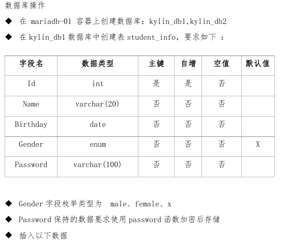
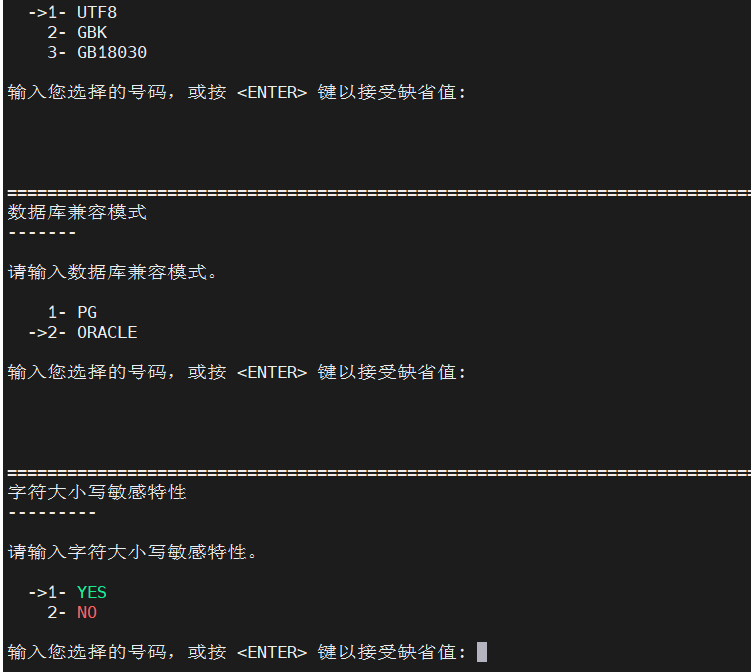

# 金砖信创

# 麒麟系统

　　1.账号及默认密码如表1所示。

　　表1 账号及密码规划表

|账号|密码|
| ------| -----------|
|root|Kylin2023|

　　    2.操作系统配置如表2所示。

　　表2 操作系统配置表

|版本|时区|系统环境语言|键盘|
| ----------------------| ---------------| ---------------------| ------------|
|Kylin Server V10 SP3|Asia/Shanghai|English US  (UTF-8)|English US|

　　3.KVM虚拟主机基本配置如表3所示。

　　表3 KVM虚拟主机基本配置表

|主机名|IP地址|FQDN|服务|安全状态|
| ------------------------| --------------------------------| ------------------------| ------------------------------------------------| -----------------------------------------|
|server01.kylin2023.com|静态IP地址： 172.16.200.100/24|server01.kylin2023.com|FTP Chrony DNS MariaDB NFS Nginx PHP Firewalld|Selinux\=disabled Kysec\=disabled|
|server02.kylin2023.com|静态IP地址： 172.16.200.101/24|server02.kylin2023.com|Chrony NFS Firewalld|Selinux\=disabled Kysec\=disabled|

　　在server01.kylin2023.com服务器和server02.kylin2023.com服务器上完成系统、网络及服务环境的配置。且所有主机的防火墙均是启用的状态。

　　具体要求如下：

## 1.根据表3完成两台服务端的基本配置，包括IP地址、主机名等参数。

　　server1配置，server2同理

```
hostnamectl set-hostname server01.kylin2023.com
vim /etc/hosts  # 修改hosts
172.16.200.100  server01.kylin2023.com  # 注意IP，与机器对应
172.16.200.101  server02.kylin2023.com
systemctl start firewalld
systemctl enable firewalld  # 开启防火墙，并设置为自启动
```

## 2.配置网络链路聚合

　　（1）       配置team0网卡，采用activebackup 模式

　　（2）       将空闲两块网卡配置为team0的slave网卡，如只有一块网卡需自行添加

　　（3）       为team0网卡配置IP地址为172.16.200.100/24

　　‍

```
nmcli connection add con-name team0 ifname team0 type team config '{"runner":{"name":"activebackup"}}' autoconnect yes
接口名tema0，类型team。activebackup 主路径失效时自动切换到备用路径。autoconnect yes：开机自动连接
nmcli connection add con-name team0-1 ifname enp1s0 type team-slave master team0
nmcli connection add con-name team0-2 ifname enp8s0 type team-slave master team0
子接口enp1s0添加到聚合接口，并命名team0-1 指定team0 作为主连接
nmcli connection modify team0 ipv4.method manual ipv4.add 172.16.200.100/24 ipv4.gateway 172.16.200.1 autoconnect yes
修改聚合口ip等信息
nmcli connection up team0
激活聚合口
```

## 3.安装ftp服务

　　本地源安装，先配置本地yum源

```
[root@server01 ~]# mount /dev/sr0 /mnt
[root@server01 ~]# vim /etc/yum.repos.d/local.repo
[iso]
baseurl=file:///mnt
gpgcheck=0

原始yum源文件改名
[root@server01 ~]# mv kylin_aarch64.repo kylin_aarch64.repo.bak
[root@server01 ~]# yum update
```

### （1）配置vsftpd服务并启用匿名登录和本地用户登录，匿名登录地址为/data/ftp/

```

yum install vsftpd -y  安装服务
mkdir -p /data/ftp
vim /etc/vsftpd/vsftpd.conf

修改以下参数，被注释掉的解除注释，没有的自行添加
anonymous_enable=YES  允许匿名登录
local_enable=YES  允许本地登录
write_enable=YES  允许写入文件
anon_upload_enable=YES  允许匿名上传文件
anon_mkdir_write_enable=YES  允许匿名创建目录
anon_root=/data/ftp 设置用户根目录

[root@server ~]# systemctl restart vsftpd  重启服务
[root@server ~]# firewall-cmd --permanent --add-service=ftp  防火墙放行服务，二选一执行即可
[root@server ~]# firewall-cmd --permanent --add-port=21/tcp 
[root@server ~]# firewall-cmd --reload  重启防火墙
```

### （2）配置vsftpd服务以使用SSL加密进行数据传输

```
[root@server01 ~]# yum install openssl -y 安装服务
签发证书，相关信息题目未提供，为空
[root@server ~]# openssl req -new -x509 -nodes -out vsftpd.pem -keyout vsftpd.pem -days 365
Generating a RSA private key
.............................+++++
........+++++
writing new private key to 'vsftpd.pem'
-----
You are about to be asked to enter information that will be incorporated
into your certificate request.
What you are about to enter is what is called a Distinguished Name or a DN.
There are quite a few fields but you can leave some blank
For some fields there will be a default value,
If you enter '.', the field will be left blank.
-----
Country Name (2 letter code) [AU]: 
State or Province Name (full name) [Some-State]:
Locality Name (eg, city) []:
Organization Name (eg, company) [Internet Widgits Pty Ltd]:
Organizational Unit Name (eg, section) []:
Common Name (e.g. server FQDN or YOUR name) []:
Email Address []:

[root@server01 ~]# mkdir /etc/vsftpd/.ssl
[root@server01 ~]# mv vsftpd.pem /etc/vsftpd/.ssl/
[root@server01 ~]# vim /etc/vsftpd/vsftpd.conf
ssl_enable=YES
force_local_data_ssl=YES
force_local_logins_ssl=YES
ssl_tlsv1=TRUE
ssl_sslv2=FALSE
ssl_sslv3=FALSE
require_ssl_reuse=NO
ssl_ciphers=HIGH
rsa_cert_file=/etc/vsftpd/.ssl/vsftpd.pem
rsa_private_key_file=/etc/vsftpd/.ssl/vsftpd.pem
listen=YES
listen_ipv6=NO
pasv_enable=YES
pasv_max_port=30010
pasv_min_port=30000
[root@server01 ~]# systemctl restart vsftpd
```

　　重启报错，待解决 玄学问题-已解决

```
[root@server ~]# systemctl restart vsftpd
Job for vsftpd.service failed because the control process exited with error code.
See "systemctl status vsftpd.service" and "journalctl -xe" for details.
```

### （3）创建一个ftp用户为“kylinftp”，密码为“Kftp@123”，限制其只能访问主目录

```
[root@server01 ~]# useradd -s /sbin/nologin -d /home/kylinftp kylinftp  创建用户
[root@server01 ~]# passwd kylinftp  修改密码
[root@server01 ~]# vim /etc/vsftpd/vsftpd.conf

chroot_local_user=YES  将登录用户的根目录限制在主目录中
chroot_list_enable=YES  列在该文件中的用户将不会被限制在其主目录中。
chroot_list_file=/etc/vsftpd/chroot_list  用户列表的文件路径
allow_writeable_chroot=YES 允许用户在其 chroot 目录中拥有可写权限。

[root@server01 ~]# touch /etc/vsftpd/chroot_list
[root@server01 ~]# vim /etc/pam.d/vsftpd
#auth       required    pam_shells.so    #这一行注释掉   允许无效 shell 登录 有什么用？
[root@server01 ~]# systemctl restart vsftpd
```

### （4）启用vsftpd服务双份日志功能，一份日志由/var/log/xferlog记录，同时/var/log/vsftpd.log记录另一份日志内容

```
[root@server01 ~]# vim /etc/vsftpd/vsftpd.conf
dirmessage_enable=YES  启用目录消息功能，用户登陆时可指定显示一些内容。目录下的README 或 message 的文件
xferlog_enable=YES  记录所有文件传输（上传和下载）的详细信息。这对于监控和审计 FTP 活动非常有用。
xferlog_file=/var/log/xferlog  指定传输日志文件的路径
xferlog_std_format=YES  日志将采用标准的 FTP 日志格式记录
[root@server01 ~]# systemctl restart vsftpd

```

## 4.本地镜像配置yum源

```
[root@server01 ~]# umount /mnt
[root@server01 ~]# mount /dev/sr0 /data/ftp 
以上为srv01专属配置，srv02配置本地源时不需要
[root@server01 ~]# vim /etc/yum.repos.d/local.repo
[iso]
baseurl=ftp://server01.kylin2023.com
gpgcheck=0
[root@server01 ~]# yum clean all
[root@server01 ~]# yum update
```

## 5.配置ntp时间服务器

```
yum install chrony  安装时间服务
vim /etc/chrony.conf

allow 192.168.0.0/16 允许哪些网段向自己进行同步 本题不用配置
server 172.16.200.100 iburst  向某台主机同步时间
local stratum 10  设置优先级 ，不必须

systemctl restart chronyd
firewall-cmd --permanent --add-service=ntp
firewall-cmd --reload
```

## 6.NFS网络共享

　　在server01.kylin2023.com服务器的/nfsdata/目录下创建KY01、KY02文件夹，通过NFS协议共享。

　　具体要求如下：

1. KY01共享文件夹允许172.16.200.0/24网段的所有机器都可以以读写的方式进行访问。并挂载到服务端server02.kylin2023.com的/nfs/net\_public目录下，且使用autofs进行挂载；
2. KY02共享文件夹只允许server02.kylin2023.com以读写权限挂载到本机的/nfsdata/net\_dir目录，且开机自动挂载。

　　srv01

```
yum install nfs-utils rpcbind -y  安装相关服务
mkdir -p /nfsdata/KY01
mkdir -p /nfsdata/KY02

vim /etc/exports
参数只写rw也行，剩下两个可以省略
/nfsdata/KY01 172.16.200.0/24(rw,no_root_squash,no_subtree_check)
/nfsdata/KY02 172.16.200.101(rw,no_root_squash,no_subtree_check)

设置开机自启，并重启相关服务
systemctl enable rpcbind  
systemctl restart rpcbind
systemctl enable nfs
systemctl restart nfs

防火墙放行相关服务
firewall-cmd --permanent --add-service=nfs  
firewall-cmd --permanent --add-service=mountd
firewall-cmd --permanent --add-service=rpc-bind
firewall-cmd --reload
```

　　srv02

```
mkdir -p /nfsdata/net_dir
mkdir -p /nfs/net_public
vim /etc/fstab

172.16.200.100:/nfsdata/KY02    /nfsdata/net_dir        nfs     defaults 0 0

mount /nfsdata/net_dir  尝试挂载目录

yum install autofs -y 安装服务
rpm -ivh autofs-5.1.4-26.ky10.aarch64.rpm  通过软件包安装，二选一即可

echo -e "/nfs /etc/auto.misc" >> /etc/auto.master
echo -e "net_public	-fstype=nfs,rw	172.16.200.100:/nfsdata/KY01" >> /etc/auto.misc

systemctl enable autofs
systemctl restart autofs
防火墙放行相关服务
firewall-cmd --permanent --add-service=nfs  
firewall-cmd --permanent --add-service=mountd
firewall-cmd --permanent --add-service=rpc-bind
firewall-cmd --reload
```

　　浅浅验证一下

​​

## 7.WEB服务

　　在server01.kylin2023.com主机上，配置Web服务器并实现基本的安全设置。

　　具体要求如下：

### 安装并配置LNMP（Nginx+MariaDB+PHP）架构的WEB服务器;

```
通过准备好的软件包直接安装，切换到该题目所需软件包的目录中
[root@server01 ~]# yum localinstall -y ./*

没软件包 pass
```

### 在Web服务器上托管Discuz论坛，要求可正常访问论坛，并在论坛网站上注册用户（用户名为kylin，密码为kylin123）。Discuz论坛工具包可在大赛资源包中找到。

　　‍

### 配置防火墙（可以使用iptables或firewalld），确保80端口（HTTP）和22端口（SSH）对外开放;

```
firewall-cmd --permanent --add-port=80/tcp
firewall-cmd --permanent --add-port=22/tcp
firewall-cmd --reload
```

### 设置SSH访问，禁止root用户通过SSH登录，并限制其他用户登录次数（比如最多允许3次登录尝试失败后锁定时间为1分钟）。

```
vim /etc/ssh/sshd_config

PermitRootLogin yes 允许root用户登录
MaxAuthTries 3  允许最大尝试次数

vim /etc/security/faillock.conf
fail_interval = 60  尝试失败后，账户锁定时间

systemctl restart sshd

```

## 8.docker服务

### 1.将本机/data/目录中的kylin-10-sp2-x86\_64.tar.xz 文件导入镜像库

#### 步骤 1：解压缩文件

　　首先，你需要将 `.tar.xz`​ 文件解压缩为 `.tar`​ 文件。你可以使用以下命令：

```
tar -xvf /data/kylin-10-sp2-x86_64.tar.xz -C /data/
```

　　这将解压缩文件到 `/data/`​ 目录中，假设它生成的文件名为 `kylin-10-sp2-x86_64.tar`​。

#### 步骤 2：加载 Docker 镜像

　　使用 `docker load`​ 命令将解压后的 `.tar`​ 文件加载为 Docker 镜像：

```
docker load -i /data/kylin-10-sp2-x86_64.tar
```

#### 步骤 3：查看已加载的镜像

　　加载成功后，可以使用以下命令查看已加载的镜像：

```
docker images
```

　　查找你刚刚加载的镜像，确认其名称和标签（可能会是 `<none>`​ 标签）。

#### 步骤 4：给镜像打标签

　　使用 `docker tag`​ 命令将镜像打上新标签。例如，如果镜像的 ID 是 `<image_id>`​，你可以使用以下命令：

```
docker tag <image_id> kylin-10-sp2-mariadb:v
```

　　请将 `<image_id>`​ 替换为在上一步中查到的镜像 ID。

#### 步骤 5：登录到 Docker 镜像库

　　如果要将命名为 `kylin-10-sp2-mariadb:v`​ 的镜像推送到 Docker Hub 或私有 Registry，请先登录：

```
docker login
```

　　输入你的 Docker Hub 用户名和密码。

#### 步骤 6：推送镜像到镜像库

　　使用 `docker push`​ 命令将镜像推送到镜像库。假设你要推送到 Docker Hub，并且你的 Docker Hub 用户名是 `myusername`​，可以输入以下命令：

```
docker tag kylin-10-sp2-mariadb:v myusername/kylin-10-sp2-mariadb:v
docker push myusername/kylin-10-sp2-mariadb:v
```

#### 步骤 7：验证推送

　　在 Docker Hub 或你的镜像库中检查是否成功上传了镜像。

### 2.根据 kylin-10-sp2-mariadb:v1 容 器 镜 像 创 建 容 器 mariadb-01 和 mariadb-02。容器配置如下

　　容器资源限制

　　CPU:2c

　　Memory:8G

　　容器持久化存储

　　mariadb-01： /data/storage/docker/mariadb-01/data:/var/lib/mysql

　　mariadb-02： /data/storage/docker/mariadb-02/data:/var/lib/mysq

```
yum install docker -y  安装docker

创建相关目录
mkdir -p /data/storage/docker/mariadb-01/data
mkdir -p /data/storage/docker/mariadb-02/data

先用镜像源，拉一下镜像

docker run -d \
  --name mariadb-01 \
  --cpus="2.0" \
  --memory="8g" \
  -v /data/storage/docker/mariadb-01/data:/var/lib/mysql \
  -e MYSQL_ROOT_PASSWORD="Kylin2022!" \
  hub.littlediary.cn/library/mariadb 

docker run -d \
  --name mariadb-02 \
  --cpus="2.0" \
  --memory="8g" \
  -v /data/storage/docker/mariadb-02/data:/var/lib/mysql \
  -e MYSQL_ROOT_PASSWORD="Kylin2022!" \
  hub.littlediary.cn/library/mariadb 


进入容器
docker exec -it mariadb-01 /bin/bash
```

　　‍

### 命令参数解释

```
GRANT ALL PRIVILEGES ON *.* TO 'root'@'192.168.100.%' IDENTIFIED BY 'Kylin2022!';
GRANT ALL PRIVILEGES ON *.* TO 'root'@'172.17.%' IDENTIFIED BY 'Kylin2022!';
```

1. ​**​`GRANT`​**​：

    * 这是 SQL 的一个命令，用于授予用户权限。
2. ​**​`ALL PRIVILEGES`​**​：

    * 这表示授予用户在指定数据库上所有权限，包括 SELECT（查询）、INSERT（插入）、UPDATE（更新）、DELETE（删除）、CREATE（创建）、DROP（删除）等。
3. ​**​`ON *.*`​** ​：

    * 这里的 `*.*`​ 是数据库和表的指定方式。第一个星号(`*`​)表示所有数据库，第二个星号(`*`​)表示所有表。这意味着对所有数据库的所有表授予权限。
4. ​**​`TO 'root'@'192.168.100.%'`​** ​：

    * ​`'root'`​ 是用户名。
    * ​`@'192.168.100.%'`​ 定义了用户的主机访问限制。

      * ​`192.168.100.%`​ 是一个主机名模式。它表示来自 `192.168.100.0`​ 到 `192.168.100.255`​ 的任何 IP 地址都可以使用这个帐号连接数据库。`%`​ 是一个通配符，表示任何数值。
5. ​**​`IDENTIFIED BY 'Kylin2022!'`​** ​：

    * 这部分用于为指定的用户设定密码。在这个例子中，`root`​ 用户的密码被设定为 `Kylin2022!`​。

#### 总结

　　这两条命令的整体作用是：

* 允许来自 `192.168.100.0/24`​ 网段的任何主机使用 `root`​ 用户名和密码 `Kylin2022!`​ 连接到数据库，并授予他们在系统上所有权限。
* 允许来自 `172.17.0.0/16`​ 网段（通常是 Docker 的默认网络）的任何主机使用相同的 `root`​ 用户名和密码连接数据库，并授予他们同样的权限。

### 配置Mariadb数据库互为主备模式  创建备份用户backup，密码Kylin2022!，并授予备份权限

　　放弃 太浪费时间了

```
创建用户并授予权限 并刷新
CREATE USER 'backup'@'%' IDENTIFIED BY 'Kylin2022!';  
GRANT REPLICATION CLIENT ON *.* TO 'backup'@'%';
GRANT REPLICATION SLAVE ON *.* TO 'backup'@'%';
FLUSH PRIVILEGES;

 修改配置
容器内没有编辑器，可以使用echo输出到文件，也可以映射到主机进行修改 /etc/mysql/my.cnf
[mysqld]
server-id=1
log_bin=mysql-bin
binlog_do_db=*

echo -e "[mysql]\nserver-id=2" >> /etc/mysql/my.cnf

进入数据库报错
root@5810ae70e48a:/# mariadb -u root -p
mariadb: unknown variable 'server-id=2'
mariadb: unknown variable 'log_gin=mysql-bin'
mariadb: unknown variable 'binlog_do_db=*'
```

### 数据库操作

​​

​​

　　1.创建数据库

```
CREATE DATABASE kylin_db1;
CREATE DATABASE kylin_db2;
```

　　2.创建表

```
USE kylin_db1;

CREATE TABLE student_info (
    Id INT AUTO_INCREMENT PRIMARY KEY,
    Name VARCHAR(20) NOT NULL,
    Birthday DATE NOT NULL,
    Gender ENUM('male', 'female', 'X') NOT NULL,
    Password VARCHAR(100) NOT NULL
);
```

　　3.插入数据

```
INSERT INTO student_info (Id, Name, Birthday, Gender, Password) VALUES
(10001, 'tom', '1990-04-12', 'male', PASSWORD('kylin-12345')),
(10002, 'harry', '1993-07-05', 'female', PASSWORD('kylin@12345')),
(10003, 'barry', '1992-02-23', 'male', PASSWORD('KY-45677')),
(10004, 'lily', '1982-07-08', 'X', PASSWORD('kylin+45677')),
(10005, 'oliver', '1995-10-02', 'female', PASSWORD('KY_99887')),
(10006, 'marry', '1991-11-17', 'X', PASSWORD('kylin_88779'));
```

　　4.导入文件

　　没文件 pass

## 9.CA服务

　　放弃 太麻烦了

```
创建目录存储文件
mkdir -p ~/myCA/{certs,crl,newcerts,private}
chmod 700 ~/myCA/private
touch ~/myCA/myCAindex

生成CA私钥
openssl genrsa -out ~/myCA/private/ca.key 4096

创建 CA 证书时使用的配置文件。创建 myCA.cnf 文件，内容如下：
vim myCA.cnf


创建CA证书
openssl req -x509 -new -nodes -key ~/myCA/private/ca.key \
-out ~/myCA/certs/ca.crt -days 7300 -config ~/myCA/myCA.cnf

生成服务器私钥
openssl genrsa -out ~/myCA/private/server.key 2048

vim server.cnf

生成CSR
openssl req -new -key ~/myCA/private/server.key -out ~/myCA/private/server.csr -config ~/server.cnf

使用CA签发证书
openssl x509 -req -in ~/myCA/private/server.csr \
-CA ~/myCA/certs/ca.crt -CAkey ~/myCA/private/ca.key \
-CAcreateserial -out ~/myCA/certs/server.crt -days 3650 \
-sha256 -extfile ~/myCA/server.cnf -extensions v3_req
```

　　CA证书文件内容

```
[ ca ]
default_ca = CA_default

[ CA_default ]
dir             = ~/myCA
database        = $dir/myCAindex
new_certs_dir   = $dir/newcerts
certificate     = $dir/certs/ca.crt
private_key     = $dir/private/ca.key
serial          = $dir/serial
default_md      = sha256
policy          = policy_match

[ policy_match ]
countryName       = supply
stateOrProvinceName = match
localityName      = match
organizationName  = match
organizationalUnitName = optional

[ req ]
default_bits       = 4096
distinguished_name = req_distinguished_name
req_extensions     = v3_req
prompt             = no

[ req_distinguished_name ]
C  = CN
ST = Guangdong
L  = Guangdong
O  = kylin
OU = system

[ v3_req ]
keyUsage = critical, digitalSignature, keyCertSign
extendedKeyUsage = serverAuth
```

　　server.cnf

```
[ req ]
default_bits       = 2048
distinguished_name = req_distinguished_name
req_extensions     = v3_req
prompt             = no

[ req_distinguished_name ]
C  = CN
ST = Guangdong
L  = Guangdong
O  = kylin
OU = system
CN = server.kylin2022.com

[ v3_req ]
keyUsage = digitalSignature, keyEncipherment
extendedKeyUsage = serverAuth
```

# KingBase

## 数据库部署

### 部署数据库软件及服务

#### 1、查看/install目录中的安装文件和授权文件，并挂载KES的安装文件。

　　（1）查看安装文件，KingbaseES_V008R006C005B0023_Lin64_single_install.iso；

　　（2）查看授权文件，安装时请选择企业版授权license_enterprise.dat；

​​

　　（3）挂载安装文件到/mnt目录。

```shell
mount /root/kingbase/KingbaseES_V008R006C007B0024_Lin64_install.iso /mnt
```

　　提示：`mount: /mnt: WARNING: source write-protected, mounted read-only.`​为正常现象

#### 2、执行安装KingbaseES V8R6（图形化界面或字符界面安装均可）,要求如下：

　　（1）数据库管理员SYSTEM的密码设置为kingbase；

　　（2）数据库监听端口号设置为52022；

　　（3）数据库字符集设置为UTF8；

　　（4）配置操作系统启动时自动启动数据库服务。

```shell
useradd kingbase
su - kingbase
bash /mnt/setup.sh
```

　　进入控制台安装

​​

​​

　　这里写授权文件的路径

​​

　　可能会提示权限不足，将授权文件放到`kingbase`​的用户目录，并更改所有权给`kingbase`​

　　​`chown -R kingbase /home/kingbase/license.dat`​

​​

　　这里做错啦，使用`kingbase`​用户创建`/KingbaseES/V8`​目录，安装到这个目录

​​

　　恭喜你看到这里，其实这里也错啦，数据目录是`/data`​

​​

​​

​​

​​

　　使用root权限运行`/opt/Kingbase/ES/V8/install/script/root.sh`​

​​

#### 验证

　　分别执行以下命令

　　​`ls -ltr /mnt |tail -2`​

​​

　　​`/KingbaseES/V8/Server/bin/ksql -Usystem -dtest -p52022 -c "select get_license_validdays()"`​

​​

　　​`/KingbaseES/V8/Server/bin/sys_ctl status -D /data`​

​​

　　​`/KingbaseES/V8/Server/bin/ksql -Usystem -dtest -p52022 -c "show port"|grep 52022`​

​​

　　​`/KingbaseES/V8/Server/bin/ksql -Usystem -dtest -p52022 -c "\encoding"`​

​​

　　​`chkconfig --list|grep kingbase8d`​

​​

### 配置KES安装用户的环境变量

　　1、允许数据库命令不带路径就可以执行。

　　2、通过环境变量指定数据库默认所在的目录和默认端口号。

```shell
vim /home/kingbase/.bashrc
添加以下内容
export PATH=$PATH:/KingbaseES/V8/Server/bin/
export KINGBASE_DATA=/data
export KINGBASE_PORT=52022
刷新环境变量
source /home/kingbase/.bashrc
```

#### 验证

　　​`env|grep -iE 'kingbase_data|kingbase_port|path'`​

​​

　　‍

# WEB服务

## 原型图1

　　远程设备控制功能包括但不限于获取富设备传感器数据，设备状态，控制设 备等

​​

　　据原型图编写UI界面，包含传感器数据展示图标，传感器数据折线图。 传感器包括温度传感器、湿度传感器、光照传感器、土壤湿度传感器、二氧 化碳浓度传感器。

### 完整代码

　　页面（vue）

```
<template>
    <el-row>
        <el-col :span="24">
            <el-card>
                <el-row :gutter="10">
                    <el-col :span="6">
                        <div class="title">
                            实时温度
                        </div>
                        <Temp height="350px" width="100%" id="temp" :value="data.temp.value" />
                    </el-col>
                    <el-col :span="6">
                        <div class="title">
                            实时湿度
                        </div>
                        <Humidity height="350px" width="100%" id="humidity" :value="data.humidity.value" />
                    </el-col>
                    <el-col :span="6">
                        <div class="title">
                            实时光照
                        </div>
                        <Illumination height="350px" width="100%" id="illumination" :value="data.illumination.value" />
                    </el-col>
                    <el-col :span="6">
                        <div class="title">
                            实时烟雾
                        </div>
                        <Smoke height="350px" width="100%" id="smoke" :value="data.smoke.value" />
                    </el-col>
                </el-row>
            </el-card>
        </el-col>
        <hr>
        <el-col>
            <el-card>
                <div ref="lineChart" style="width: 100%; height: 400px;"></div>
            </el-card>
        </el-col>
    </el-row>
</template>
<script setup>
import { onMounted, onBeforeUnmount, onUnmounted, ref } from 'vue';
// 引用表盘组件
import Temp from './components/temp.vue'
import Humidity from './components/humidity.vue'
import Illumination from './components/illumination.vue'
import Smoke from './components/smoke.vue'
import Dashboard from './components/Dashboard.vue'
// 引用图表库
import * as echarts from 'echarts';

// 定义基础数据
const data = {
    temp: ref('40'),
    humidity: ref('70'),
    illumination: ref('60'),
    smoke: ref('40'),
    temp2: ref([]),
    humidity2: ref([]),
    illumination2: ref([]),
    smoke2: ref([]),
    date:ref([]),
}

// 定义折线图
const lineChart = ref(null);
const initChart = () => {
    // 初始化实例
    const myChart = echarts.init(lineChart.value);
    // 折线图参数
    const option = {
        title: { text: '折线图示例' },
        tooltip: { trigger: 'axis' },
        legend: {
            data: ['实时温度', '实时湿度', '实时光照', '实时烟雾'], // 图例的名称
            orient: 'horizontal', // 图例的排列方式，水平排列
            right: '10%', // 图例距离右边的距离
            top: '5%', // 图例距离顶部的距离
        },
        // 图线名称
        xAxis: { type: 'category', data: data.date.value },
        yAxis: { type: 'value' },
        // 折线图数据
        series: [
            { name: '实时温度', type: 'line', data: data.temp2.value },
            { name: '实时湿度', type: 'line', data: data.humidity2.value },
            { name: '实时光照', type: 'line', data: data.illumination2.value },
            { name: '实时烟雾', type: 'line', data: data.smoke2.value },
        ],
    };
    myChart.setOption(option);
};


// 更新折线图数据
const upzxdata = (list,value) => {
    // 只显示10条数据，超出则删除
    if(list.length > 9){
        list.shift();
    }
    // 更新数据
    list.push(value)
    // 刷新图表
    initChart()
}

const dataAnalysis = (value) => {
    if (value) {
        // 数据存在，并是键值对格式
        if (value.includes(':')) {
            // 将字符串按冒号分割成数组，第一个元素为键，第二个元素为值
            let quesArr = value.split(':');
            let str = ''
            switch (quesArr[0]) {
                case 'temp':
                    // 更新表盘的值
                    data.temp.value = quesArr[1]
                    // 更新折线图的值
                    upzxdata(data.temp2.value,quesArr[1])
                    // 更新折线图下面的时间
                    let date = new Date();
                    upzxdata(data.date.value,`${date.getHours()}:${date.getMinutes()}:${date.getSeconds()}`)
                    break;
                case 'humi':
                    data.humidity.value = quesArr[1]
                    upzxdata(data.humidity2.value,quesArr[1])
                    break;
                case 'gz':
                    data.illumination.value = quesArr[1]
                    upzxdata(data.illumination2.value,quesArr[1])
                    break;
                case 'yw':
                    data.smoke.value = quesArr[1]
                    upzxdata(data.smoke2.value,quesArr[1])
                    break;
                default:
                    str = ''
                    break;
            }
            //    if(str!=''){
            //      callback(str)
            //    }
        }

    }
}

onMounted(() => {
    // 初始化图表
    initChart();
});

// 1.建立链接 -- 携带cookie参数
var ws = new WebSocket(
    `ws://localhost:8089`
);

// 2. 监听连接打开事件
ws.onopen = function () {
    console.log("WebSocket 连接已建立");

    // 3. 发送消息到服务器
    ws.send('turnonled');
};

// 2. ws.send()给服务器发送信息
// ws.readyState 是连接属性 0-未连接 1-已连接 2-正在关闭 3-已关闭
// setTimeout(() => {
//     if (ws.readyState === 1) {
//         ws.send('turnonled');
//     }
// }, 5000)

// 3.服务器每次返回信息都会执行一次onmessage方法
ws.onmessage = function (e) {
    // console.log("服务器返回的信息: " + e.data);
    dataAnalysis(e.data)
};
// 4.卸载前, 关闭链接
onUnmounted(() => {
    ws.close();
});

</script>
<style lang="scss">
@import './index.scss';
</style>
```

　　配套服务端（nodejs）

```
// 引入 ws 库
const WebSocket = require('ws');

// 创建 WebSocket 服务器，监听端口 8089
const wss = new WebSocket.Server({ port: 8089 });

// 存储所有连接的客户端
const clients = [];

// 监听连接事件
wss.on('connection', (ws) => {
    console.log('客户端已连接');
  
    // 将新连接的客户端添加到 clients 数组
    clients.push(ws);

    // 监听消息事件
    ws.on('message', (message) => {
        console.log('收到消息: %s', message);
    
        // 发送响应给客户端
        ws.send('消息已接收: ' + message);
    });

    // 监听关闭事件
    ws.on('close', () => {
        console.log('客户端已断开连接');
        // 从 clients 数组中移除已断开的客户端
        clients.splice(clients.indexOf(ws), 1);
    });
});
function getRandomInt(min, max) {
    return Math.floor(Math.random() * (max - min)) + min; // 包含 min，但不包含 max
}
// 定时向所有连接的客户端发送消息
setInterval(() => {
    clients.forEach(client => {
        if (client.readyState === WebSocket.OPEN) {
            client.send(`temp:${getRandomInt(1,60)}`);
            client.send(`gz:${getRandomInt(100,600)}`);
            client.send(`humi:${getRandomInt(1,100)}`);
            client.send(`yw:${getRandomInt(100,600)}`);
        }
    });
}, 2000); // 每5秒发送一次

// 服务器启动成功的提示
console.log('WebSocket 服务器正在运行，监听端口 8089');

```

### 步骤

　　引用表盘组件

```
import Temp from './components/temp.vue'
import Humidity from './components/humidity.vue'
import Illumination from './components/illumination.vue'
import Smoke from './components/smoke.vue'
import Dashboard from './components/Dashboard.vue'
```

　　在页面上显示

```
<el-col :span="24">
            <el-card>
                <el-row :gutter="10">
                    <el-col :span="6">
                        <div class="title">
                            实时温度
                        </div>
                        <Temp height="350px" width="100%" id="temp" :value="data.temp.value" />
                    </el-col>
                    <el-col :span="6">
                        <div class="title">
                            实时湿度
                        </div>
                        <Humidity height="350px" width="100%" id="humidity" :value="data.humidity.value" />
                    </el-col>
                    <el-col :span="6">
                        <div class="title">
                            实时光照
                        </div>
                        <Illumination height="350px" width="100%" id="illumination" :value="data.illumination.value" />
                    </el-col>
                    <el-col :span="6">
                        <div class="title">
                            实时烟雾
                        </div>
                        <Smoke height="350px" width="100%" id="smoke" :value="data.smoke.value" />
                    </el-col>
                </el-row>
            </el-card>
        </el-col>
```

　　定义表盘用的基础数据

```
// 定义基础数据
const data = {
以下是表盘使用
    temp: ref('40'),
    humidity: ref('70'),
    illumination: ref('60'),
    smoke: ref('40'),
以下是折线图使用
    temp2: ref([]),
    humidity2: ref([]),
    illumination2: ref([]),
    smoke2: ref([]),
    date:ref([]),
}
```

　　从ws获取数据

```
// 1.建立链接 -- 携带cookie参数
var ws = new WebSocket(
    `ws://localhost:8089`
);

// 2. 监听连接打开事件
ws.onopen = function () {
    console.log("WebSocket 连接已建立");

    // 3. 发送消息到服务器
    ws.send('turnonled');
};

// 2. ws.send()给服务器发送信息
// ws.readyState 是连接属性 0-未连接 1-已连接 2-正在关闭 3-已关闭
// setTimeout(() => {
//     if (ws.readyState === 1) {
//         ws.send('turnonled');
//     }
// }, 5000)

// 3.服务器每次返回信息都会执行一次onmessage方法
ws.onmessage = function (e) {
    // console.log("服务器返回的信息: " + e.data);
获取到数据后会调用dataAnalysis函数
    dataAnalysis(e.data)
};
// 4.卸载前, 关闭链接
onUnmounted(() => {
    ws.close();
});
```

　　折线图显示

```
<el-col>
            <el-card>
                <div ref="lineChart" style="width: 100%; height: 400px;"></div>
            </el-card>
        </el-col>
```

　　定义折线图

```
// 定义折线图
const lineChart = ref(null);
const initChart = () => {
    // 初始化实例
    const myChart = echarts.init(lineChart.value);
    // 折线图参数
    const option = {
        title: { text: '折线图示例' },
        tooltip: { trigger: 'axis' },
        legend: { // 图例，必要情况下可省略
            data: ['实时温度', '实时湿度', '实时光照', '实时烟雾'], // 图例的名称
            orient: 'horizontal', // 图例的排列方式，水平排列
            right: '10%', // 图例距离右边的距离
            top: '5%', // 图例距离顶部的距离
        },
        // 图线名称
        xAxis: { type: 'category', data: data.date.value },
        yAxis: { type: 'value' },
        // 折线图数据
        series: [
            { name: '实时温度', type: 'line', data: data.temp2.value },
            { name: '实时湿度', type: 'line', data: data.humidity2.value },
            { name: '实时光照', type: 'line', data: data.illumination2.value },
            { name: '实时烟雾', type: 'line', data: data.smoke2.value },
        ],
    };
    myChart.setOption(option);
};
onMounted(() => {
    // 初始化图表
    initChart();
});
```

　　基础表盘参数

```
option = {
    tooltip: {
      formatter: '{a} <br/>{b} : {c}%'
    },                                            显示进度条                 显示数字动画             直接显示值
    series: [{name: '温度',type: 'gauge',progress: {show: true},detail: {valueAnimation: true,formatter: '{value}'},data: [{value: value}]}]
  };
```

　　定义折线图数据更新函数

```
// 更新折线图数据
const upzxdata = (list,value) => {
    // 只显示10条数据，超出则删除
    if(list.length > 9){
        list.shift();
    }
    // 更新数据
    list.push(value)
    // 刷新图表
    initChart()
}
```

　　更新数据

```
const dataAnalysis = (value) => {
    if (value) {
        // 数据存在，并是键值对格式
        if (value.includes(':')) {
            // 将字符串按冒号分割成数组，第一个元素为键，第二个元素为值
            let quesArr = value.split(':');
            let str = ''
            switch (quesArr[0]) {
                case 'temp':
                    // 更新表盘的值
                    data.temp.value = quesArr[1]
                    // 更新折线图的值
                    upzxdata(data.temp2.value,quesArr[1])
                    // 更新折线图下面的时间
                    let date = new Date();
                    upzxdata(data.date.value,`${date.getHours()}:${date.getMinutes()}:${date.getSeconds()}`)
                    break;
                case 'humi':
                    data.humidity.value = quesArr[1]
                    upzxdata(data.humidity2.value,quesArr[1])
                    break;
                case 'gz':
                    data.illumination.value = quesArr[1]
                    upzxdata(data.illumination2.value,quesArr[1])
                    break;
                case 'yw':
                    data.smoke.value = quesArr[1]
                    upzxdata(data.smoke2.value,quesArr[1])
                    break;
                default:
                    str = ''
                    break;
            }
            //    if(str!=''){
            //      callback(str)
            //    }
        }
    }
}
```

## 原型图2

​​

　　全部代码 UI自行优化

```
<template>
  <div class="body">
  
    <el-row>
        <el-col :span="24">
          
                <el-row :gutter="20">
                    <el-col :span="12">
                      <el-card>
                        风扇设备控制
                        <p style="text-align: center;">室内温度： 室外温度： 二氧化碳浓度：</p>
                        <p style="text-align: center;">
                          风扇开关：<el-switch v-model="fs" active-value="turnonfan" inactive-value="turnofffan" @click="ws.send(fs)"></el-switch>
                        </p>
                      </el-card>
                      
                    </el-col>
                    <el-col :span="12">
                      <el-card>
                        水泵设备控制
                      </el-card>
                      
                    </el-col>
                </el-row>
          
        </el-col>
      </el-row>

  </div>
</template>
  
<script lang="ts" setup>
import { Socket } from 'socket.io-client';
import { onMounted, onBeforeUnmount, onUnmounted, ref } from 'vue';
const fs = ref("turnonfan")

var ws = new WebSocket(
  `ws://localhost:8089`
)


</script>

<style lang="scss" scoped>

</style>
```

# 鸿蒙开发

## 1.烧录固件

　　使用typec连接开发板，电脑查看连接端口

​​

　　打开Hiburn

　　选择com口和固件文件

　　按下开发板的复位键，

　　点击Connet，开始刷入

 ​

​​

　　‍

　　‍

　　烧录完成后，点击disconnet 关闭串口占用

​​

　　‍

　　打开sscom

　　端口选择com3，点击打开串口 连接

​​

　　**AT指令集**

　　​`AT+STARTSTA`​

　　​`AT+SCAN`​ 扫描周围的热点信息，扫描并不会直接返回扫描到的热点信息，需要执行AT+SCANRESULT进行查看

　　​`AT+SCANRESULT`​ 查看扫描到的热点信息。

　　​`AT+CONN=,08:6b:d1:93:a5:72,3,"12345678"`​

　　​`AT+CONN=“SSID”,2,“PASSWORD”`​

　　连接到指定的WIFI热点。连接的完整指令是AT+SCAN\=,,\<auth\_type\>[,]。

　　ssid，即路由器名称

　　bssid，即路由器的MAC地址

　　auth\_type，认证方式。0:OPEN 1:WEP 2:WPA2\_PSK 3:WPA\_PWA2\_PSK

　　passwd，即密码

　　连接时ssid和bssid选择一个即可，ssid需要使用双引号("")括起来，bssid不需要。auth\_type一般选择3

　　​`AT+DHCP=wlan0,1`​ 获取IP地址。dhcp服务器命令的完整形式为AT+DHCPS=

　　​`AT+STASTAT`​ 查看连接结果

　　​`AT+IFCFG`​ 查看模组接口IP

　　​`AT+PING=X.X.X.X`​ 查看WLAN模组与网关联通是否正常，其中X.X.X.X需替换为实际的网关地址

　　‍

## 2.鸿蒙开发

　　​`Image($r('app.media.alarm_black')).width('100%')`​ 引用图片文件，在res.../base/media 目录下

　　​`$rawfile('back.png')`​ 引用文件，在res.../rawfile目录下

　　‍
