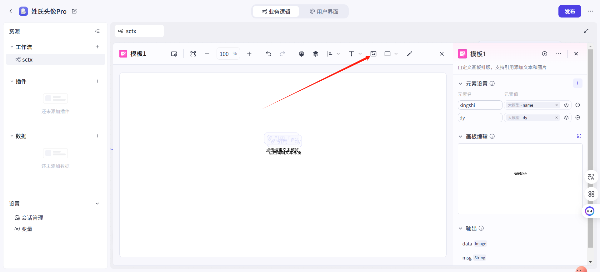

** Chat SDK部署指南**

快速将智能体部署到自己的网页上，实现免登录访问

介绍部分建议查看官方文档：https://www.coze.cn/open/docs/developer_guides/install_web_sdk

看完后直接跳到最后，查看示例代码

扣子Chat SDK 是一个 JavaScript 库，集成了扣子 OpenAPI
的对话、文件上传等能力，便于开发者高效、便捷、快速地搭建一个聊天应用。集成扣子
Chat SDK 之后，用户可通过网页悬浮窗方式与 AI 应用对话。

比如我们的知识库AI助手

{width="2.8020833333333335in"
height="6.072916666666667in"}

点开后可以直接进行对话而不需要登录

**支持功能**

**点击图片可查看完整电子表格**

**安装**

在网页中引用以下代码

  ----------------------------------------------------------------------------------------------------------------
  /<script
  src="https://lf-cdn.coze.cn/obj/unpkg/flow-platform/chat-app-sdk/1.1.0-beta.0/libs/cn/index.js"/>/</script/>

  ----------------------------------------------------------------------------------------------------------------

**获取Token**

这里以获取个人访问令牌为例，实际使用中应该使用OAuth JWT令牌

点击侧边栏-扣子API-个人访问令牌-添加新令牌

{width="5.75in"
height="5.822916666666667in"}

{width="5.614583333333333in"
height="3.2291666666666665in"}

您可以根据需求自定义以下设置：

名称与过期时间：支持用户自定义命名和设置有效期限

权限配置：四个必选权限

Bot管理权限

会话权限

消息权限

文件权限

团队空间访问：选择智能体所在的工作空间即可

完成设置后，请点击"确定"按钮保存配置。

{width="5.75in"
height="4.135416666666667in"}

记录这个令牌，只显示一次，关闭后就没有了。

**配置**

在你的网页上面配置聊天框

添加以下代码

+----------------------------------------------------------------------------------------+
| /<script/>                                                                             |
|                                                                                        |
| const cozeWebSDK = new CozeWebSDK.WebChatClient({                                      |
|                                                                                        |
| config: {                                                                              |
|                                                                                        |
| // 智能体 ID                                                                           |
|                                                                                        |
| botId: /'740849137970326/*/*/*/*/',                                                    |
|                                                                                        |
| },                                                                                     |
|                                                                                        |
| auth: {                                                                                |
|                                                                                        |
| // 鉴权方式                                                                            |
|                                                                                        |
| type: /'token/',                                                                       |
|                                                                                        |
| // 鉴权密钥                                                                            |
|                                                                                        |
| token:                                                                                 |
| /'pat_zxzSAzxawer234zASNElEglZxcmWJ5ouCcq12gsAAsqJGALlq7hcOqMcPFV3wEVDiqjrg/*/*/*/*/', |
|                                                                                        |
| // 备用密钥                                                                            |
|                                                                                        |
| onRefreshToken: () =/>                                                                 |
| /'pat_zxzSAzxawer234zASNElEglZxcmWJ5ouCcq12gsAAsqJGALlq7hcOqMcPFV3wEVDiqjrg/*/*/*/*/', |
|                                                                                        |
| }                                                                                      |
|                                                                                        |
| });                                                                                    |
|                                                                                        |
| /</script/>                                                                            |
+----------------------------------------------------------------------------------------+

完整代码参考

鉴权方式为token，这个不要改。

token就是咱们前面获取的那一段令牌

**获取智能体ID**

在工作空间点开智能体

查看地址栏，最后的一段数字就是智能体ID

{width="5.75in"
height="0.7916666666666666in"}

将这些信息修改到代码中即可。

加下来，打开网页，就能看到右下角有一个按钮

点击按钮，即可打开

{width="2.8020833333333335in"
height="6.09375in"}

这是系统默认的初始页面，目前已经可以正常使用。

但当前存在一个需要改进的问题：所有用户访问时看到的内容是完全相同的。举例来说，用户A的聊天记录可能会被用户B看到，这显然不符合隐私保护的要求。

为了解决这个问题，我们需要实现会话隔离功能。关于会话隔离的具体实现方法，我们将在后续单独撰写一篇详细的教程文章进行说明。

**界面配置**

这个页面大部分的内容都是可以修改的

**用户信息**

**点击图片可查看完整电子表格**

**UI效果**

**点击图片可查看完整电子表格**

**悬浮球**

**点击图片可查看完整电子表格**

**底部文案**

**点击图片可查看完整电子表格**

**聊天框**

**点击图片可查看完整电子表格**

**修改方式**

在配置中添加以下内容

{width="5.75in"
height="4.208333333333333in"}

**示例文件：**

**/[1.html/]**
